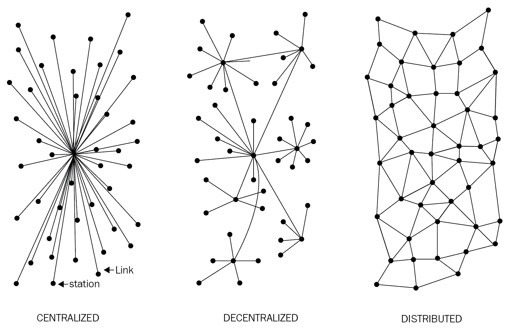
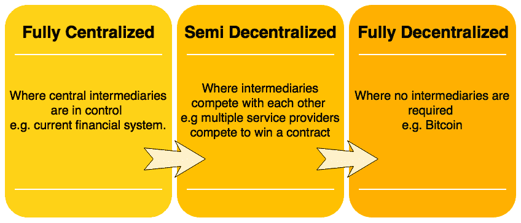
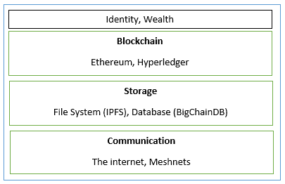

# 分散

权力下放并不是一个新概念。长期以来，它一直被用于战略、管理和政府中。分权的基本思想是将控制权和权力分散到组织的边缘，而不是由一个中心机构完全控制组织。这种配置为组织带来了几个好处，如提高效率、加快决策制定、更好的激励以及减轻高层管理人员的负担。

在本章中，我们将在区块链的背景下讨论分权的概念。区块链的根本基础是没有一个单一的中央权力机构在控制，在这一章中，我们将举例说明各种权力下放的方法和实现这一目标的途径。此外，我们将详细讨论区块链生态系统的去中心化、去中心化应用以及实现去中心化的平台。此外，我们将向您介绍分散式区块链技术中涌现出的众多激动人心的应用和创意。

# 利用区块链的权力下放

分散化是区块链技术提供的核心优势和服务。从设计上来说，区块链是提供一个平台的完美载体，这个平台不需要任何中介，可以与通过共识机制选择的许多不同领导人合作。这种模式允许任何人竞争成为决策权威。这种竞争由共识机制管理，最常用的方法被称为**工作证明** ( **PoW** )。

权力下放的程度各不相同，从半权力下放模式到完全权力下放模式，视需要和情况而定。从区块链的角度来看，分散化可以被视为一种机制，它提供了一种重塑现有应用程序和范例的方式，或者构建新的应用程序，以便将完全控制权交给用户。

**信息和通信技术** ( **ICT** )传统上是基于集中式范例，由此数据库或应用服务器处于中央机构(例如系统管理员)的控制之下。随着比特币和区块链技术的出现，这种模式已经改变，现在这种技术已经存在，它允许任何人启动一个去中心化的系统，并在没有单点故障或单一可信机构的情况下运行它。它可以自主运行，也可以需要一些人工干预，这取决于在区块链上运行的分散式应用程序中使用的治理类型和模型。

下图显示了目前存在的不同类型的系统:集中式、分散式和分布式。这个概念最早是由 Paul Baran 在《分布式通信:I .分布式通信网络简介》中发表的(兰德公司，1964 年):

不同类型的网络/系统

**集中式系统**是传统的(客户端-服务器)IT 系统，其中只有一个机构控制系统，并且该机构单独负责系统的所有操作。集中式系统的所有用户都依赖于单一的服务来源。大多数在线服务提供商，包括谷歌、亚马逊、易贝、苹果应用商店和其他公司，都使用这种传统模式来提供服务。

一个**分布式系统**，数据和计算分布在网络中的多个节点上。有时，这个术语会与*并行计算*混淆。虽然在定义上有一些重叠，但这些系统之间的主要区别在于，在并行计算系统中，所有节点同时执行计算以获得结果；例如，并行计算平台被用于天气研究和预报、模拟和金融建模。另一方面，在分布式系统中，计算可能不是并行发生的，数据在多个节点上复制，用户将这些节点视为单个连贯的系统。使用这两种模型的变体来实现容错和速度。在并行系统模型中，仍然有一个控制所有节点的中央权威机构来管理处理。这意味着该系统本质上仍然是中央集权的。

分散式系统和分布式系统的关键区别在于，在分布式系统中，仍然存在一个中央权威机构来管理整个系统；而在一个分散的系统中，不存在这样的权威。

**分散系统**是一种网络，其中节点不依赖于单个主节点；相反，控制权分布在许多节点上。这类似于这样一种模型:组织中的每个部门都负责自己的数据库服务器，这样就从中央服务器中取走了权力，并将其分配给管理自己数据库的子部门。

分散模式中的一个重大创新是**分散共识**，它带来了应用程序分散化的新时代。这种机制在比特币中发挥了作用，它使用户能够通过共识算法达成一致，而不需要中央可信的第三方、中介或服务提供商。

# 权力下放的方法

有两种方法可以用来实现去中心化:非中介化和竞争(竞争驱动的去中心化)。这些方法将在接下来的章节中详细讨论。

# 脱媒

**脱媒**的概念可以借助一个例子来解释。假设你想给另一个国家的朋友寄钱。你去找一家银行，这家银行会收费把你的钱转到那个国家的银行。在这种情况下，银行会维护一个更新的中央数据库，以确认您已经汇款。有了区块链技术，就有可能把这笔钱直接寄给你的朋友，而不需要通过银行。你需要的只是你在区块链的朋友的地址。这样，中介；也就是银行，不再需要，通过*脱媒*实现了去中心化。然而，由于大量的监管和合规要求，在金融部门通过非中介化实现的实际分权程度是有争议的。然而，这个模型不仅可以用于金融，也可以用于许多不同的行业。

# 竞争驱动的分权

在涉及**竞争**的方法中，不同的服务提供商相互竞争，以便被系统选择提供服务。这种模式没有实现完全的去中心化。然而，在某种程度上，它确保中介或服务提供商不会垄断服务。在区块链技术的背景下，可以设想一个系统，在该系统中，智能合同可以根据外部数据提供商的声誉、以前的得分、评论和服务质量，从大量提供商中选择外部数据提供商。

这种方法不会导致完全去中心化，但它允许智能合同根据刚才提到的标准进行自由选择。通过这种方式，在服务提供商之间形成了一种竞争环境，他们相互竞争成为首选的数据提供商。

下图显示了不同级别的分权。在左侧，显示了由中央系统控制的传统方法；在右边，随着中介被完全移除，完全的非中介化得以实现。中间显示的是相互竞争的中介或服务提供商。在这一级，根据声誉或投票选择中介或服务提供商，从而实现部分分权。

权力下放的规模

虽然分散化有许多好处，包括透明度、效率、成本节约、可信生态系统的发展，以及在某些情况下的隐私和匿名，但一些挑战，如安全要求、软件缺陷和人为错误，需要彻底检查。

例如，在比特币或以太坊等通常由私钥提供安全性的分散式系统中，如果私钥丢失或由于智能合同代码中的错误或分散式应用程序变得容易受到攻击，如何确保与这些私钥相关联的智能财产不会变得无用？在开始使用区块链和去中心化应用程序去中心化一切之前，您必须理解不是所有的事情都可以或者需要去中心化。

这种观点没有提出什么根本性的问题。真的需要区块链吗？什么时候需要区块链？在什么情况下区块链比传统数据库更受青睐？要回答这些问题，请仔细阅读下面的一组简单问题:

1.  需要高数据吞吐量吗？如果这个问题的答案是肯定的，那么使用传统的数据库。
2.  更新是否受到集中控制？如果是，那么使用传统的数据库。
3.  用户之间相互信任吗？如果是，那么使用传统的数据库。
4.  用户匿名吗？如果是，则使用公共区块链；如果没有，那么使用私人区块链。
5.  如果需要在一个联盟中保持一致，那么使用私有区块链，否则使用公共区块链。

回答所有这些问题可以了解是否需要区块链。除了该模型中提出的问题之外，还有许多其他问题需要考虑，例如延迟、共识机制的选择、是否需要共识以及在哪里达成共识。如果共识由财团内部维持，则应使用私有区块链；否则，如果需要多个实体公开达成共识，则应考虑公共区块链解决方案。在决定是使用区块链数据库还是传统数据库时，还应该考虑不变性等其他方面。如果需要严格的数据不变性，那么应该使用公共区块链；否则，中央数据库可能是一个选项。

随着区块链技术的成熟，将会有更多关于这种模式的问题出现。然而，就目前而言，这组问题足以决定是否需要一个基于区块链的解决方案。

# 权力下放的途径

尽管在区块链和比特币之前就有系统存在，包括 BitTorrent 和 Gnutella 文件共享系统，在一定程度上可以归类为去中心化。然而，随着区块链技术的出现，现在正在采取许多举措来利用这一新技术实现权力下放。比特币区块链通常是许多人的首选，因为它已被证明是最具弹性和最安全的区块链，在撰写本文时市值接近 1450 亿美元。或者，其他区块链，如以太坊，成为许多开发人员构建分散式应用程序的首选工具。与比特币相比，以太坊已经成为一个更突出的选择，因为它允许通过使用*智能合约*将任何商业逻辑编程到区块链中。

# 如何放权

阿尔温德·纳拉亚南(Arvind Narayanan)和其他人在他们的书《比特币和加密货币技术(T0)、*和【普林斯顿大学出版社】中提出了一个框架，可以用来评估区块链技术背景下各种问题的去中心化要求。该框架提出了四个问题，这些问题的答案清楚地说明了系统如何去中心化:*

1.  什么是去中心化？
2.  需要何种程度的权力下放？
3.  用的是什么区块链？
4.  使用了什么安全机制？

第一个问题简单地要求您识别什么系统正在被分散。这可以是任何系统，例如身份系统或交易系统。

第二个问题要求您通过检查前面讨论的权力下放的规模来指定所需的权力下放程度。可以是完全脱媒，也可以是部分脱媒。

第三个问题要求开发人员确定哪种区块链适合特定的应用程序。它可以是比特币区块链、以太坊区块链或任何其他被认为适合特定应用的区块链。

最后，需要解决的一个基本问题是如何保证分散系统的安全性。例如，安全机制可以是基于原子性的，其中事务要么完全执行，要么根本不执行。这种确定性方法确保了系统的完整性。其他机制可能包括基于信誉的机制，它允许系统中不同程度的信任。

# 权力下放框架的例子

让我们评估一个货币转账系统，作为一个被选择去中心化的应用程序的例子。前面讨论的四个问题用于评估该应用的分散化要求。这些问题的答案如下:

1.  汇款系统
2.  脱媒
3.  比特币
4.  原子数

这些回复表明，可以通过移除在比特币区块链上实现的中介来分散资金转移系统，并且将通过原子性来提供安全保证。原子性将确保事务完全成功执行或根本不执行。我们选择了比特币区块链，因为它是历史最悠久的区块链，经受住了时间的考验。

同样，这一框架可以用于任何其他需要在权力下放方面进行评估的系统。这四个简单问题的答案有助于澄清采取什么方法来分散系统。

# 区块链和全生态系统去中心化

为了实现彻底的权力下放，区块链周围的环境也必须下放。区块链是一个运行在传统系统之上的分布式账本。这些元素包括存储、通信和计算。还有其他因素，如身份和财富，这些因素传统上是基于集中范式的，为了实现充分分散的生态系统，也需要分散这些方面。

# 仓库

数据可以直接存储在区块链中，这样就实现了去中心化。但是，这种方法的一个显著缺点是区块链不适合存储大量数据。它可以存储简单的事务和一些任意数据，但它肯定不适合存储图像或大块数据，传统数据库系统就是这种情况。

存储数据的一个更好的替代方法是使用**分布式哈希表** ( **分布式哈希表**)。DHT 最初用于点对点文件共享软件，如 BitTorrent、Napster、Kazaa 和 Gnutella。通过 CAN、Chord、Pastry 和 Tapestry 项目，DHT 研究变得流行起来。BitTorrent 是最具扩展性和速度最快的网络，但是 BitTorrent 和其他网络的问题是用户没有动力无限期地保存文件。用户通常不会永久保存文件，如果仍有某人需要的数据的节点离开网络，除了让需要的节点重新加入网络以使文件再次变得可用之外，没有其他方法可以检索这些数据。

这里的两个主要要求是高可用性和链路稳定性，这意味着数据应该在需要时可用，网络链路也应该总是可访问的。胡安·贝内的星际文件系统拥有这两种特性，它的愿景是通过取代 HTTP 协议来提供一个分散的万维网。IPFS 使用 Kademlia DHT 和 Merkle **有向无环图** ( **DAG** )分别提供存储和搜索功能。DHT 和 Dag 的概念将在[第 6 章](06.html)、*公钥密码学*中详细介绍。

存储数据的激励机制基于一种称为 Filecoin 的协议，该协议向使用 Bitswap 机制存储数据的节点支付激励。位交换机制允许节点以一对一的关系保存发送的字节或接收的字节的简单分类帐。此外，在 IPFS 中使用基于 Git 的版本控制机制来提供数据版本的结构和控制。

数据存储还有其他替代方案，比如以太坊 Swarm、Storj 和 MaidSafe。以太坊有自己的分散和分布式生态系统，使用 Swarm 进行存储，使用 Whisper 协议进行通信。MaidSafe 旨在提供一个分散的万维网。所有这些项目都将在本书后面更详细地讨论。

BigchainDB 是另一个存储层分散项目，旨在提供一个可伸缩的、快速的、线性可伸缩的分散数据库，而不是传统的文件系统。BigchainDB 补充了以太坊和 IPFS 等分散处理平台和文件系统。

# 沟通

互联网(区块链的通信层)被认为是分散的。这种信念在某种程度上是正确的，因为互联网最初的愿景是开发一个分散的通信系统。电子邮件和在线存储等服务现在都是基于这样一种模式，即服务提供商处于控制地位，用户相信此类提供商会根据他们的请求授予他们访问服务的权限。这种模式基于对中央权威机构(服务提供商)的无条件信任，用户无法控制他们的数据。甚至用户密码也存储在可信的第三方系统中。

因此，需要以这样一种方式向个人用户提供控制，即保证对其数据的访问，并且不依赖于单个第三方。访问互联网(通信层)是基于互联网服务提供商(T1)(T2 的互联网服务提供商，T3)，他们是互联网用户的中心枢纽。如果 ISP 因任何原因关闭，则此型号无法通信。

另一种方法是使用**网状网络**。尽管与 internet 相比，它们的功能有限，但它们仍然提供了一种分散的替代方案，在这种方案中，节点可以直接相互通信，而无需 ISP 之类的中心集线器。

一个 Meshnet 的例子是 FireChat([http://www.opengarden.com/firechat.html](http://www.opengarden.com/firechat.html))，它允许 iPhone 用户在没有互联网连接的情况下以点对点的方式直接相互交流。

现在想象一个允许用户控制他们的通信的网络；没有人能以任何理由关闭它。这可能是区块链生态系统中分散通信网络的下一步。必须指出的是，这种模式只有在互联网受到政府审查和控制的司法管辖区才是至关重要的。

如前所述，互联网最初的愿景是建立一个去中心化的网络；然而，多年来，随着谷歌、亚马逊和易贝等大型服务提供商的出现，控制权正在向这些大公司转移。例如，电子邮件的核心是一个去中心化的系统；也就是说，任何人都可以用最少的努力运行电子邮件服务器，并可以开始发送和接收电子邮件。有更好的选择，例如，Gmail 和 Outlook.com，它们已经为最终用户提供了托管服务，所以人们很自然地倾向于从这些大型集中式服务中进行选择，因为它们更方便、更免费。这是一个显示互联网如何走向集中化的例子。

然而，免费服务是以暴露有价值的个人数据为代价的，许多用户没有意识到这一事实。区块链再次向世界展示了这种去中心化的愿景，现在人们正在齐心协力地利用这种技术，并利用它可以提供的好处。

# 计算能力和分散化

计算或处理能力的分散化是通过以太坊(Ethereum)等区块链技术实现的，其中嵌入了业务逻辑的智能合同可以在区块链网络上运行。其他区块链技术也提供类似的处理层平台，业务逻辑可以以分散的方式在网络上运行。

下图显示了一个分散的生态系统概述。在底层，互联网或网格提供了一个分散的通信层。在下一层，存储层使用 IPFS 和 BigchainDB 等技术来实现去中心化。最后，在下一层，你可以看到区块链作为一个分散的处理(计算)层。区块链也可以以有限的方式提供存储层，但这严重阻碍了系统的速度和容量。因此，其他解决方案如 IPFS 和 BigchainDB 更适合以分散的方式存储大量数据。身份、财富层显示在顶层。互联网上的身份是一个巨大的话题，BitAuth 和 OpenID 等系统提供了不同程度的分散化和安全假设的认证和识别服务:

分散生态系统

区块链有能力为与权力下放有关的各种问题提供解决方案。一个与身份相关的概念被称为**佐科三角**，它要求网络协议中的命名系统是安全的、分散的，并且能够向用户提供人类有意义且容易记忆的名称。据推测，一个系统只能同时具有这两种性质。然而，随着区块链硬币的出现，这个问题解决了。现在有可能实现安全，权力下放，和人类有意义的名字与硬币区块链的名字。然而，这不是万灵药，它带来了许多挑战，例如依赖用户安全地存储和维护私钥。这就引出了其他关于权力下放是否适合某一特定问题的一般性问题。

权力下放并不适合每一种情况。在许多情况下，声誉良好的中央集权系统往往能更好地发挥作用。例如，与个人电子邮件服务器由互联网上的用户托管的情况相比，来自知名公司如谷歌或微软的电子邮件平台将提供更好的服务。

有许多项目正在为更全面的分布式区块链系统开发解决方案。例如，开发 Swarm 和 Whisper 是为了给以太坊区块链提供分散存储和通信。

随着权力下放模式的出现，不同的术语和流行语现在出现在媒体和学术文献中。随着区块链技术的出现，现在有可能以**去中心化组织** ( **DOs** )和其他类似结构的形式构建传统物理组织的软件版本，我们将很快对此进行详细研究。

在权力下放的背景下，以下概念值得讨论。

# 智能合同

智能合同是一个分散的程序。智能合约不一定需要区块链来运行；然而，由于区块链技术提供的安全优势，区块链已经成为智能合同的标准分散执行平台。

智能合约通常包含一些业务逻辑和数量有限的数据。如果满足特定标准，则执行业务逻辑。区块链中的参与者使用这些智能合约，或者它们代表网络参与者自主运行。

关于智能合约的更多信息将在第 4 章、*智能合约*中提供。

# 分权组织

DOs 是一种运行在区块链上的软件程序，它是基于由人和协议组成的实际组织的思想。一旦 DO 以智能合约或一组智能合约的形式被添加到区块链，它就变得分散化，并且各方基于 DO 软件中定义的代码彼此交互。

# 分散的自治组织

就像 DOs 一样，**去中心化自治组织** ( **道**)也是一个运行在区块链之上的计算机程序，其中嵌入了治理和业务逻辑规则。道和做根本上是一回事。然而，主要的区别在于 Dao 是自治的，这意味着它们是完全自动化的，并且包含人工智能逻辑。另一方面，DOs 缺乏这种特性，依赖人工输入来执行业务逻辑。

以太坊区块链率先推出了 DAOs。在 DAO 中，代码被认为是管理实体，而不是人或书面契约。然而，一个人类管理员维护这个代码，并作为社区的提议评估者。如果从令牌持有者(参与者)处收到足够的意见，Dao 可以雇佣外部承包商。

最著名的 DAO 项目是 DAO，它在众筹阶段筹集了 1.68 亿美元。"一体行动"项目旨在成为一个风险资本基金，旨在提供一个没有单一实体作为所有者的分散经营模式。不幸的是，这个项目由于 DAO 代码中的一个错误而被黑客攻击，价值数百万美元的**以太货币** ( **ETH** )被从项目中抽走，变成了黑客创建的子 DAO。以太坊区块链需要一个硬分叉来逆转黑客攻击的影响并启动资金恢复。这一事件引发了关于安全性、质量以及彻底测试智能合约中的代码以确保其完整性和适当控制的必要性的辩论。还有其他项目正在进行中，特别是在学术界，它们正在寻求将智能契约编码和测试形式化。

目前，Dao 没有任何法律地位，尽管它们可能包含一些执行某些协议和条件的智能代码。然而，这些规则目前在现实世界的法律制度中没有价值。有一天，也许一个**自主代理**(**AA**)；也就是说，由执法机构或监管机构委托的一段无需人工干预即可运行的代码将包含可嵌入到 DAO 中的规则和条例，以便从法律和法规遵从性的角度确保其完整性。Dao 是完全分散的实体，这一事实使它们能够在任何管辖区运行。因此，它们提出了一个大问题，即当前的法律制度如何适用于如此多样的司法管辖区和地理区域。

# 分权自治公司

分散自治公司(**DAC**)在概念上类似于 Dao，尽管被认为是它们的一个较小的子集。DAC 和 Dao 的定义有时可能会重叠，但总的区别是 Dao 通常被认为是非盈利性的；而 DAC 可以通过提供给参与者的股份赚取利润，并向参与者支付股息。DAC 可以根据编程逻辑自动运行业务，无需人工干预。

# 分散自治社会

**去中心化自治社会** ( **DASs** )是一个概念，通过这个概念，整个社会可以在多个复杂的智能契约以及 DAOs 和**去中心化应用** ( **DApps** )的组合的帮助下，在区块链上运行。这种模式不一定转化为一种自由开放的方式，也不是基于完全自由主义的意识形态；相反，政府通常提供的许多服务可以通过区块链提供，如政府身份证系统、护照以及契约、婚姻和出生记录。另一个理论是，如果政府腐败，中央系统无法提供一个社会所需要的令人满意的信任水平，那么这个社会可以在分散共识和透明度驱动的区块链上启动自己的虚拟政府。这个概念可能看起来像是自由主义者或赛博朋克的梦想，但在区块链身上是完全可能的。

# 分散式应用程序

到目前为止提到的所有想法都在 DApps 的大伞下。Dao、DAC 和 DOs 是运行在对等网络中区块链之上的 DApps。它们代表了去中心化技术的最新进展。另一方面，DApps 是可以在它们各自的区块链上运行的软件程序，使用现有的已建立的区块链，或者只使用现有的区块链的协议。这些被称为 I 型、II 型和 III 型 DApps。

# 分散应用程序的要求

对于被认为是分散的应用程序，它必须满足以下标准。Johnston 和其他人在白皮书《分散应用的一般理论》中提供了这个定义，Dapps :

*   DApp 应该是完全开源和自治的，任何一个实体都不应该控制它的大部分令牌。对应用程序的所有更改都必须基于社区给出的反馈意见并得到一致认可。
*   应用程序操作的数据和记录必须加密保护，并存储在一个公共的、分散的区块链上，以避免任何中心故障点。
*   应用程序必须使用加密令牌来为那些为应用程序贡献价值的人(例如，比特币矿工)提供访问和奖励。
*   令牌必须由 DApp 根据标准密码算法生成。这一代令牌充当了对贡献者(例如，矿工)的价值的证明。

# DApp 的运作

通过 DApp 建立共识可以使用共识算法如 PoW 和 PoS 来实现。到目前为止，只有 PoW 被发现可以令人难以置信地抵抗 51%的攻击，这一点从比特币中可见一斑。此外，DApp 可以通过采矿、筹款和开发来分发代币(硬币)。

# DApp 的例子

这里提供了一些分散应用的例子。

# KYC 链

该应用程序提供了基于智能合同安全、方便地管理**了解您的客户** ( **KYC** )数据的工具。

# OpenBazaar

这是一个分散的点对点网络，使买卖双方能够直接进行商业活动，而不是依赖于一个中心方，如易贝和亚马逊。应当注意，该系统不是建立在区块链之上的；相反，分布式哈希表用于对等网络，以实现对等体之间的直接通信和数据共享。它利用比特币和各种其他加密货币作为支付方式。

# Lazooz

这相当于优步的分权制。它允许点对点乘车共享，用户可以通过移动证明获得激励，他们可以赚取 Zooz 硬币。

许多其他的 DApps 已经在以太坊区块链建成，并在 http://dapps.ethercasts.com/展出。

# 权力下放平台

今天，有许多平台可用于去中心化。事实上，区块链网络的基本特征是提供权力下放。因此，任何区块链网络，如比特币、以太坊、超级账本结构或法定人数，都可以用来提供去中心化服务。世界各地的许多组织都推出了平台，承诺使分布式应用程序开发变得简单、可访问和安全。下面将介绍其中的一些平台。

# 艾瑟芬

以太坊名列榜首，因为它是第一个引入图灵完全语言和虚拟机概念的区块链。这与比特币和许多其他加密货币中有限的脚本语言形成了鲜明的对比。随着被称为 Solidity 的图灵完备语言的出现，开发分散式应用程序有了无限的可能性。这个区块链是由 Vitalik Buterin 在 2013 年首次提出的，它提供了一个公共区块链来开发智能合约和分散化应用程序。以太坊上的货币代币被称为**以太**。

# 迈德赛夫

**MaidSafe** 为每个人提供**安全访问** ( **SAFE** )网络由未使用的计算资源组成，如存储、处理能力及其用户的数据连接。网络上的文件被分成小块数据，这些数据被加密并随机分布在整个网络中。这些数据只能由其各自的所有者检索。MaidSafe 的一项关键创新是在网络上自动拒绝重复文件，这有助于减少管理负载所需的额外计算资源。它使用 Safecoin 作为令牌来激励其贡献者。

# 丽丝

Lisk 是一个区块链应用开发和加密货币平台。它允许开发人员使用 JavaScript 构建去中心化的应用程序，并将它们托管在各自的侧链中。Lisk 使用**授权利益证明** ( **DPOS** )机制来达成共识，由此可以选出 101 个节点来保护网络并提出区块。它使用 Node.js 和 JavaScript 后端，而前端允许使用标准技术，如 CSS3、HTML5 和 JavaScript。

Lisk 使用 LSK 硬币作为区块链的货币。Lisk 的另一个衍生产品是 Rise，这是一个基于 Lisk 的去中心化应用和数字货币平台。它更加关注系统的安全性。

对这些平台和其他平台的更实用的介绍将在后面的章节中提供。

# 摘要

在本章中，我们介绍了去中心化的概念，这是区块链技术提供的核心服务。尽管权力下放的概念并不新鲜，但它在区块链世界获得了新的意义。因此，最近已经引入了基于分散架构的各种应用。

我们在本章开始时介绍了权力下放的概念。接下来，我们从区块链的角度讨论了权力下放。此外，我们还向您介绍了与区块链生态系统中不同层次的去中心化相关的想法，以及随着区块链技术的出现而出现的几个新概念和术语，以及从区块链的角度来看的去中心化，包括 Dao、DAC 和 DApps。最后，我们看了几个分散式应用程序的例子。

在下一章，我们将看到以太坊是如何工作的，以及我们可以使用以太坊开发什么。我们还将看到重要的以太坊客户端和节点实现。