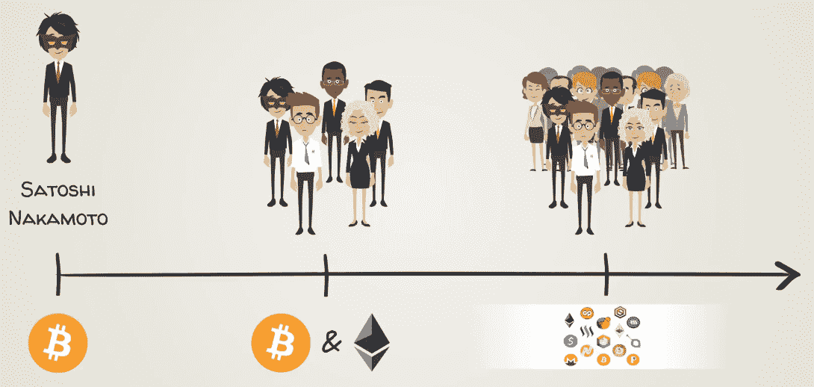
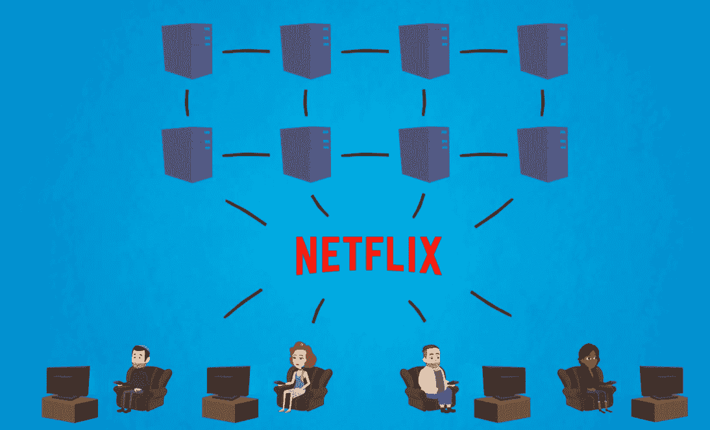
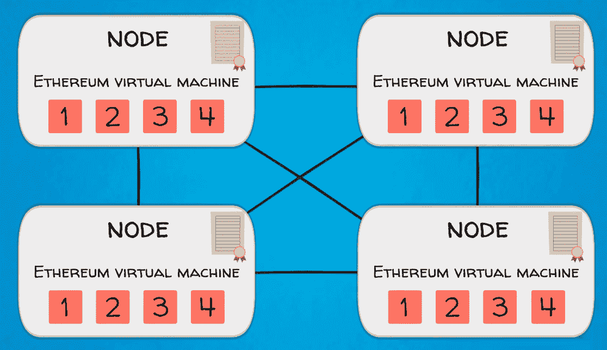

# 以太坊如何将区块链的想法提升到一个新的水平

既然你已经理解了塑造比特币技术的五种力量是如何工作的，我们就准备引入以太坊，这是第一个图灵完全区块链平台。如果你还不完全确定图灵完备是什么意思，不要担心，我们将在本章中讨论它。

本章将涵盖以下主题:

*   以太坊简介
*   以太坊是如何产生的
*   了解以太坊
*   以太坊虚拟机

# 以太坊简介

正如我们在前面的章节中提到的，比特币播下了区块链技术和加密资产的种子，并迅速开始聚集热情和专注的爱好者和支持者社区。一场新的运动由 Satoshi 创造的巧妙系统启动。这一势头以指数速度加速，产生了创新的滚雪球效应。区块链空间的进一步技术颠覆和突破迫在眉睫。比特币的开源特性强化了这些影响。

许多开发人员开始通过创建替代的加密资产协议来试验比特币代码。这种新的替代区块链被称为**替代硬币**(因为它们是原始硬币比特币的替代品)。下图展示了比特币的演变过程:

到目前为止，以太坊给这个新领域带来了最大的影响和最重大的创新。这就是为什么我们将在这里广泛讨论它。

以太坊代表了第二代区块链技术，其增强的功能超越了支付和分布式资产分类账。它的一个关键领域是分散计算。以太坊创始人维塔利克·布特林(Vitalik Buterin)的愿景是打造一台去中心化的全球计算机，通过**以太坊虚拟机** ( **EVM** )来实现。

以太坊的工作原理与支撑比特币的基本原理和技术相同:

*   区块链
*   密码系统
*   工作证明一致性算法
*   对等网络
*   软件代码库

以太坊区别于比特币和许多其他替代货币的关键创新在于其图灵完全编程语言。图灵完全意味着以太坊的编程语言可以用来编程和运行几乎任何功能或任务。这使得能够创建和部署更广泛的分散式应用程序。它为开发人员提供了一套完整的工具，帮助他们进一步创新，在区块链上构建应用程序和业务。区块链以太坊是整个经济和社会生态系统的骨干基础设施。这就是为什么大多数**去中心化区块链应用**(或简称 **DAPPs** )目前使用以太坊平台的原因。

正如我们将在后面看到的，这种更大的代码库的缺点是更大的攻击面和软件错误的风险，这是不可避免的。

让我们一步一步来，看看以太坊自诞生以来是如何演变的。

# 以太坊是如何产生的

以太坊的想法是由当时 19 岁的 Vitalik Buterin 在 2013 年提出的。维塔利科最初迷上了电脑游戏，就像他的许多同龄人一样。他的父亲也是一名计算机科学家，向他介绍了比特币，维塔利克欣然接受并开始热情探索。他在 2011 年共同创办了《比特币》杂志，并在那里担任记者。他还参与了彩色硬币项目。你可能还记得彩色硬币，我们在之前关于比特币的章节中详细介绍过。它们在比特币区块链上实现了智能合约和数字资产的基本实现。Vitalik 希望扩展彩色硬币的概念，使更大、更灵活和更强大的应用程序能够在区块链上运行。当他面临来自比特币核心开发者的阻力时，他决定推出自己的项目，并从头开始设计。

维塔利克是一位多产的区块链思想领袖。甚至在以太坊获得全球成功之前，他的才华就已经得到了认可。在很小的时候，他就被安排在天才儿童班。他在 2012 年 18 岁时赢得了国际信息学奥林匹克竞赛的铜奖。2013 年，他撰写了以太坊白皮书，概述了他的愿景。

2014 年，Vitalik 获得了 IT 软件世界技术奖，其他杰出的获奖者如 Elon Musk 获得了能源奖。

同样在 2014 年，他获得了著名的泰尔奖学金，并从滑铁卢大学辍学，全职专注于以太坊。

# 泰尔奖学金

泰尔奖学金是由亿万富翁企业家和投资者彼得·泰尔创建的，他是 PayPal 和 Palantir 的联合创始人，这两家公司都成为了价值数十亿美元的公司。他是一位杰出的风险投资家，也是脸书的第一位外部投资者。利用他的奖学金，彼得·泰尔旨在资助 23 岁以下有才华的年轻人，他们离开大学的传统道路，追求具有高度全球影响力的项目。这类项目可以包括科学研究、初创企业或社会企业。由于不到 1%的选择率，该奖项被认为比获得世界上最好的大学的认可更具竞争力。

有了泰尔的一些资助，Vitalik 继续聚集了一个由联合创始人和开发人员组成的天才团队，并追求他对以太坊的愿景。哦，天哪，这是一个宏伟的愿景！该团队希望创建 Web 3.0，这是一个更分散、更智能的下一代互联网，由以太坊提供动力。

由于他们需要更多的资金，创始人在 2014 年 7 月推出了**初始硬币发行** ( **ICO** )，这实际上是未来以太坊平台的原生加密资产以太的预售。他们设法筹集了价值约 1800 万美元的维特币，这是他们接受的捐款货币，这是当时最大的 ICO。这种通过众包筹集初创企业资本的形式将在未来几年内得到广泛采用和迅猛增长。稍后我们将讨论更多关于 ICOs 的内容。

有了充足的资金保证，创始团队有许多个月的艰苦工作要做，直到以太坊网络在 2015 年 7 月上线。

让我们开始吧——欢迎来到区块链 2.0。

# 了解以太坊

如果我们想了解以太坊，最好的起点可能是看一下它的白皮书。那么，让我们看看它的创始人是如何描述它的，好吗？

以太坊白皮书的开头如下:

*"Satoshi Nakamoto's development of Bitcoin in 2009 has often been hailed as a radical development in money and currency, being the first example of a digital asset, which simultaneously has no backing or "intrinsic value" and no centralized issuer or controller. However, another, arguably more important, part of the Bitcoin experiment is the underlying blockchain technology as a tool of distributed consensus, and attention is rapidly starting to shift to this other aspect of Bitcoin. Commonly cited alternative applications of blockchain technology include using on-blockchain digital assets to represent custom currencies and financial instruments (colored coins), the ownership of an underlying physical device (smart property), non-fungible assets such as domain names (Namecoin), as well as more complex applications involving having digital assets being directly controlled by a piece of code implementing arbitrary rules (smart contracts) or even blockchain-based **decentralized autonomous organizations** (**DAOs**). What Ethereum intends to provide is a blockchain with a built-in fully fledged Turing-complete programming language that can be used to create contracts that can be used to encode arbitrary state transition functions, allowing users to create any of the systems described here, as well as many others that we have not yet imagined, simply by writing up the logic in a few lines of code."*

白皮书告诉我们，除了支付，区块链技术还有许多潜在的使用案例。以太坊在该领域的先驱比特币的基础上进一步创新了这项技术。一个非常雄心勃勃的计划，不是吗？

以太坊提供工具来促进定制数字资产、金融工具和分散应用程序的创建。每个人都可以启动自己的项目，并使用开源以太坊协议创建数字资产、DAPP 或整个 DAO。

区块链上的数字资产被称为**智能财产**，这意味着任何实物资产，如黄金、房地产、股票、债券、艺术品等，都可以用一个令牌来表示，并在分布式账本上存储或交易。

此外，智能合约支持创建复杂的金融工具和应用程序。通过这种方式，智能财产可以包含在智能合同中，并在合同中规定的某些条件下进行交易。还记得我们在比特币章节中提到的贸易融资例子吗？在这个例子中，智能合约可以替代银行提供的托管账户和信用证。在产品交付需要时间的交易中，可以建立一个智能合同，这样它可以在货物成功交付给买方后将资金释放给卖方。

将智能财产和智能合同结合起来可能会导致 Dao，在 Dao 中，运营整个组织的业务逻辑是在智能合同的复杂系统中编程的。目前，这在实践中如何运作还有待观察。

如前所述，这些想法已经被以太坊之前的各种项目所探索。然而，以前的项目使用比特币和其他区块链协议不太适合这个目的，而以太坊是专门为此设计的。

以太坊协议及其开发团队并不直接创建或支持分散的应用程序，但他们为开发人员提供了工具、构建模块和基础设施来启动它们。以太坊以创新和有意义的方式将区块链的概念超越了加密货币。

接下来，我们将进一步了解以太坊的一些关键元素。

# 以太坊虚拟机

此时你可能在想——OMG！又一个虚拟的东西！我们不得不习惯于虚拟货币、虚拟资产等抽象概念，而现在我们谈论的是虚拟机？！嗯，我们生活在数字信息时代，所以虚拟商品和虚拟现实将越来越多地出现在我们的日常生活中。因此，逐步熟悉这些概念是很有用的。虚拟机是一个非常抽象的概念，所以我们将尝试从几个角度来解决这个困难的问题。

# 虚拟机简介

虚拟机在分布式计算中并不是一个全新的概念。随着万维网的持续发展，迁移到云中的软件产品和服务的数量一直在稳步增长。商业模式和信息基础设施已经发展并适应了新的网络模式。共享和分发计算资源比在同一台计算机上存储和处理所有内容更有效和高效。下图显示了这方面的一个示例:

云计算和虚拟化的概念基于计算机系统不同组件之间的分离。在顶层，我们有硬件和软件。然后，我们可以将不同类型的软件分解成附加层，例如软件操作系统和软件应用程序。

虚拟机是位于计算机硬件或标准操作系统(如 Windows)之上的另一种构造，它与各种应用程序进行交互。虚拟机基本上创建了一个可以与硬件分离的虚拟操作系统环境。正如网络中的任何其他虚拟机一样，它独立于网络，但却是网络的一部分。

这种与网络的隔离使得它不会受到黑客威胁或任何数据损坏。这允许将整个操作系统从一个硬件设备复制并粘贴到另一个硬件设备，就像任何其他文件一样(类似于视频、图片或文本文件)。这种虚拟化是当今非常流行的云计算的一部分。下图显示了虚拟机的体系结构:

如上图所示，**操作系统** ( **OS** )及其应用程序共享来自单个主机服务器或主机服务器池的硬件资源。每个虚拟机都需要自己的底层操作系统，并且硬件是虚拟化的。虚拟机管理程序或虚拟机监视器是创建和运行虚拟机的软件、固件或硬件。它位于硬件和虚拟机之间，是虚拟化服务器所必需的。

许多软件产品和服务越来越多地在云上按需交付，这意味着它们是基于互联网和分布式的。微软 office 及其 Word、Excel 和 PowerPoint 应用程序已经成为 20 世纪 90 年代和 21 世纪初几乎家喻户晓的软件名称和 Office 主食，现在有了基于云的替代品，如谷歌文档、谷歌工作表和谷歌幻灯片。

越来越多的企业和消费者转向基于云的解决方案。

Salesforce.com 公司是另一家受欢迎的**软件即服务** ( **SaaS** )公司，它在云上提供**客户关系管理** ( **CRM** )和其他企业软件服务。它以其新的商业模式引领潮流，并开始与 Oracle 和 SAP 等传统企业软件巨头竞争。鉴于云计算的颠覆性和高效性，所有成熟的行业领导者都很快效仿，推出了自己的云解决方案。

这种向基于 web 的服务的迁移在很大程度上是由于 Java 编程语言和 Java 虚拟机的出现而实现的。这是因为它们使得创建大型 web 应用程序变得更加容易。用 Java 编写的应用程序可以在任何 JVM 上运行，不管底层的计算机系统架构如何。

以太坊将虚拟机的概念引入了区块链世界。EVM 支持在区块链上创建和运行标准化智能合同和分散式应用程序。这是在图灵完全编程语言的帮助下完成的，比如 Solidity，这是以太坊开发团队特意设计的。图灵完全意味着它是通用的或计算通用的，换句话说，它可以用来编程和执行几乎任何功能或任务。这种设计使得以太坊成为一个非常适合分散应用的环境。下图显示了 EVM 如何协同工作:

例如，考虑 EVMs 中的安全性。黑客非常顽固，他们试图突破区块链平台，窃取加密货币。他们最近在其他几个平台上取得了成功，但没有在以太坊平台上取得成功，因为 EVM 已经成为平台抵御黑客的屏障，使得入侵以太坊平台非常困难。为了保护平台，EVM 倾向于保护平台的防火墙，并加强安全措施。这确保了加密系统上存在的令牌和交易的安全性。

我们现在可以推断出技术的长期趋势，从最初的软件应用公司如微软和甲骨文在 70 年代和 80 年代推出，到基于云但仍然集中的服务公司如谷歌和 Salesforce 在 90 年代末和 21 世纪初开创，到未来的分散应用。基于区块链的去中心化应用可能成为计算机技术的下一件大事，它将与当前可用的云解决方案形成互补和竞争。我们将在接下来的章节中详细介绍这一点。

# 摘要

在这一章中，我们学习了以太坊的所有知识，以及它如何革新了互联网。我们学习了以太坊是如何被发明的以及为什么被发明。我们还了解了以太坊如何使用 EVM 来创建去中心化的应用程序。

我们了解了由 EVMs 支持的各种智能合约和分散式应用。在接下来的章节中，我们将关注以太坊带给世界的一些关键创新。