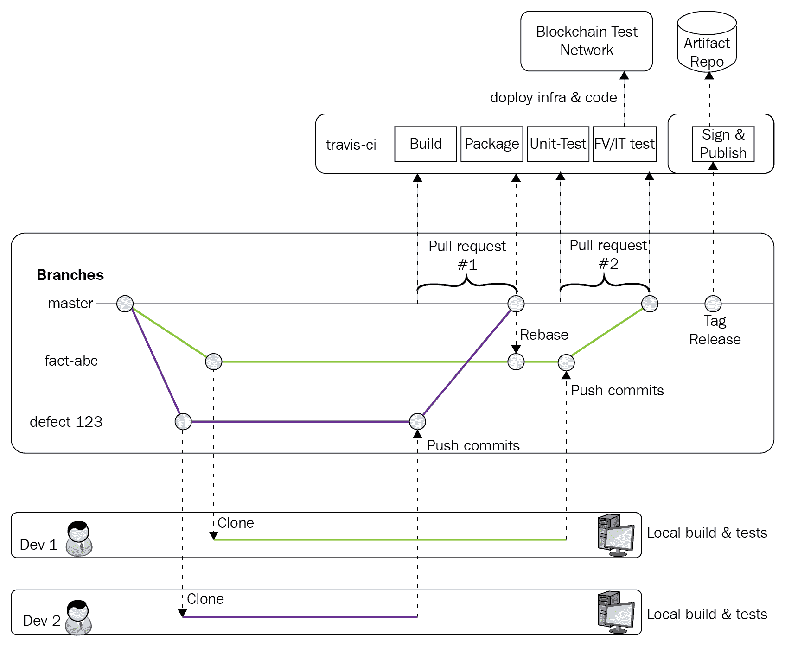
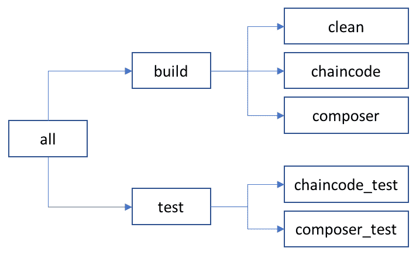
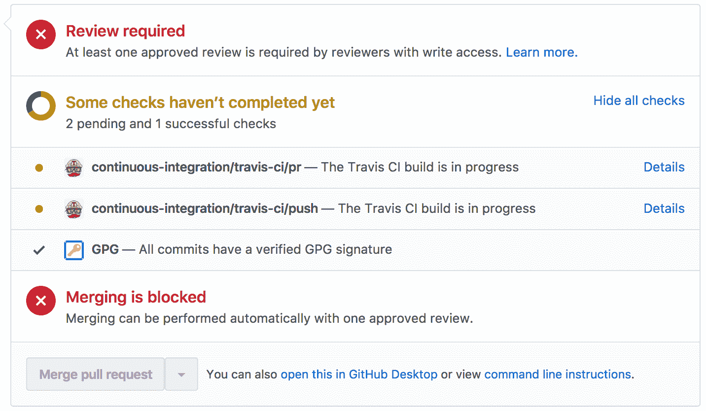
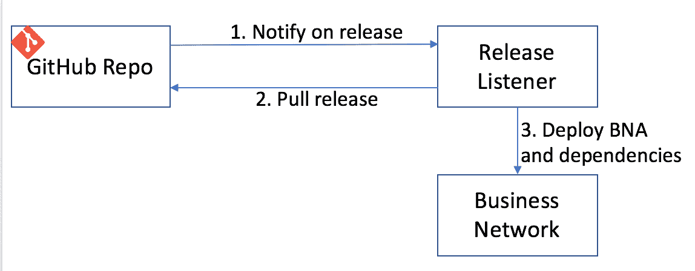

# 区块链网络中的敏捷性

此时，如果一切顺利，您应该有一个功能完整的分散式应用程序，相关的智能合同在 Hyperledger Fabric 上运行。有了这些知识，生活就会变得美好，对吗？嗯，像任何事情一样，解决方案会随着时间的推移而演变。这可能是法规的变化，联盟中新成员的引入，或者是您的智能合同中的一个简单错误——无论是什么原因，解决方案都会增长，如果没有坚实的开发和运营实践，变化将会很慢，您的生活将会很痛苦。

考虑到在一个 IT 组织的开发过程中保持敏捷性已经是非常具有挑战性的了，那么如何在一个联盟中做到呢？不同文化、不同速度的公司如何在一个时间框架内一起交付和维护解决方案，以保持网络提供的竞争优势？

虽然已经有很多关于 IT 敏捷性和 DevOps 的文章，但本章将着重于将其中一些概念应用于区块链网络。我们说*一些*是因为我们的注意力将集中在那些对区块链来说特定/不同的概念上。通过自动化和**持续集成和交付** ( **CI 和 CD** )管道的部署，我们将讨论区块链网络对人员、流程和技术的影响。

在本章中，我们将讨论以下主题:

*   定义促销流程
*   配置持续集成管道
*   保护源代码管理
*   更新网络
*   联合体对团队结构的影响

# 定义促销流程

正如您可能已经意识到的，推广流程定义了任何系统修改都需要经历的一系列关键活动和关口。它通常包括开发、打包、测试(例如，单元测试、功能验证和集成测试)、版本控制和部署。通常，一个组织将会有一个标准化的方法，该方法将会被记录，以便描述对项目及其支持团队的期望。在 Hyperledger 结构网络的情况下，至少会有两种不同的促销流程:

*   智能合同:由于这些组件对于系统参与者之间的业务交互至关重要，因此每个参与者都必须同意合同的内容
*   整合层:由于他们位于网络的边界，他们的晋升过程将取决于谁拥有他们(一个财团还是一个特定的组织)

可选地，还可能有控制网络策略改变的过程；但是，它将与智能合同推广流程紧密配合。

不过，在直接跳到管道的配置之前，我们先花点时间了解一下这两个提升过程的注意事项。

# 智能合同注意事项

正如我们提到的，智能合同对于任何区块链网络参与者之间的业务交互都至关重要。由于它们本质上包含交易被视为有效的规则和条件，我们需要确保每个参与者和组织都同意其有效性，否则，信任将受到损害。

推广智能合同的条件包括:

*   **问题的可追溯性**:这是一个缺陷修复还是一个新特性？除此之外，组织可能还需要在问题进入实施阶段之前对其进行批准。
*   成功执行所有测试:这对于某些人来说可能是不言而喻的，但是大多数测试应该是自动化的，并且结果应该被捕获。

*   **关键方的代码审查**:你会在没有审查合同条款的情况下签署合同吗？嗯，代码审查也有类似的目的。
*   **影响评估**:新版智能合约向后兼容吗？不向后兼容的更改将需要额外的规划。
*   **关键方签字**:在所有其他要点之前，您是否得到了所有相关方的认可？你会在哪里录这个？

关键方的定义将留给联合体来定义。关键方可以是当前使用该智能合同的所有组织，或者该术语可以指创始人组织的技术领导或成员的子集。

在推广智能合同的条件之前，推广频率也可能是有争议的。一些组织习惯于季度周期，而其他组织则习惯于每周部署。如果不提前讨论这一因素，摩擦必然会发生，因为这将直接影响组织可能需要考虑的运营费用，以维持其对联合体的预期参与水平。还应注意，智能合同的范围可以是整个网络或一对或一组参与者。这些智能合同的范围以及各种排列和组合代表了推广所需的有趣的系统修改。

关键是，修改智能合同的条件和过程应该由财团预先定义，以避免任何误解和挫折。从某种意义上说，这和传统合同被修改没什么区别；合同修改的条件条款需要提前达成一致，以避免冲突。

# 集成层考虑事项

正如我们在 [*第五章*](05.html) 、*揭露网络资产和交易*中所看到的，组织和财团可以使用几种模式来调用网络上的交易。选定的模式将有助于推动促销流程的管理。

如果应用程序的服务层直接调用 fabric SDK，那么应用程序的所有者将必须管理其提升过程。相反，如果联盟强制使用 REST 网关，那么您可以预期其部署将遵循类似于智能合约的过程。

无论所有者是谁，集成层提供的抽象都应该将应用程序与智能合约隔离开来，因此，它们应该独立发展。然而，这并没有消除影响评估的重要性。

# 促销流程概述

定义了这些概念后，让我们将注意力转向应用程序的推广过程。由于我们使用 Git 作为我们的软件配置管理工具，我们将利用它的社交编码特性来支持我们的推广流程:

*   我们可以使用 Git 问题来记录新的特性或错误修复
*   我们可以使用 Git 分支来隔离提议的修改
*   Git GPG 用于签署每个提交和标记
*   拉请求用于实施治理

下图总结了我们将用来配置应用程序的过程:



想知道什么是拉取请求？本章假设读者已经熟悉了许多 Git 概念。如果不是这种情况，停下来探索 Git 能提供什么可能是个好主意。

作为一个快速的总结，pull request 就是人们可以在 forks(也就是不同的库)或者 branches(一个库内)之间提交代码变更的过程。它提供了一种可控的方法来审查、评论并最终批准所有的代码变更。

现在，我们将详细介绍这个过程，并将重点放在信任和代码来源的问题上。正如我们已经讨论过的，由于智能合约是区块链网络的核心，我们需要确保密切跟踪它们的发展，以避免不幸的事件。从这个角度来看，我们希望从需求(Git 问题)一直到部署都有可追溯性。

因此，每个代码修改都应该从创建 Git 问题开始。它应该正确地识别它的范围——特性请求或错误修复——然后精确地描述预期的工作。

我们将在几章中讨论治理方面，但是现在我们可以假设这个问题已经被划分了优先级，并且工作将根据联盟的优先级来分配。

一旦开发人员被指派处理这个问题，他的第一步将是创建一个临时的 Git 分支来跟踪与这个 Git 问题相关的所有代码更改。代码修改永远不应该在主分支上完成，因为它代表了代码的稳定版本，新的特性和错误修复应该在集成到稳定流之前进行评审。

开发人员应该在他们自己的本地环境中运行所有适当的测试，并且只有当代码准备好并且所有单元测试成功完成时才提交回分支。

当提交修改的时候，Git 提供了一个特性，允许你使用 **GPG** 来签署你所有的工作。你会问，GPG 是什么？它代表 **GNU 隐私保护**，是`openpgp`标准的开放实现。它基本上提供了一个工具，帮助您使用自己的私钥对数据进行签名和加密。Git 已经实现了 GPG，允许开发者签署他们的作品。可以使用作者的 GPG 密钥对每个提交或标记进行签名，从而提供提交的不可否认性。

为什么使用 GPG 修改符号代码？有些人可能会说这是一种开销，但是考虑到被修改的代码代表一种合法的契约，并且是网络信任的基础。从这个角度来看，确保作者的身份被证明是毫无疑问的可能是可取的。

对普通提交使用单因素身份验证可能不足以证明其作者身份；想想互联网上所有关于人们假冒他人身份的报道。

如果没有签名的提交，我们可以想象一种情况，一个流氓开发人员为了自己的利益修改了一个智能合同，并声称他们不是代码更改的真正作者。这样的事件将危及网络的生存能力，并且远远超过签署提交的不便。

既然开发人员已经签署了提交，他们就可以提交一个拉请求了。拉取请求已配置为检查以下标准:

*   临时分支用来自主分支的内容进行更新
*   每个提交都经过签名
*   代码所有者已经审查并接受了代码变更
*   持续集成管道已成功完成

创建拉请求时，将自动触发管道。一旦满足了所有的条件，那么其中一个代码所有者就可以将代码与主分支合并，并提交这些更改(当然，在签署提交时)。

在实际场景中，联盟将有额外的环境(用户接受环境、试运行环境等等)，在那里测试完整的解决方案堆栈。

图表中描述的最后一步集中在标记发布。这里的想法是，单个发布可以由一系列多个拉请求构建。当联盟准备发布一个新版本时，它应该标记它以代表正在部署的正式版本。

在这个事件中，管道将被再次触发，但是有一个不同的目标:构建、测试、签署和发布智能契约到工件存储库。这个工件存储库可能是许多流行的解决方案之一，但是在我们的例子中，为了简单起见，我们将智能契约附加到 Git 版本上。

你们中的一些人可能想知道为什么我们不直接在网络上部署。同样，目的是在网络的集中构建过程和分散本质之间保持一个清晰的界限。可以通知每个组织新的智能合同，以便部署、提取归档、根据签名进行验证并部署它。

总而言之，以下是推广过程中的几点:

*   每一个代码变更都与一个变更请求相关联
*   开发者使用 GPG 签署他们的修改
*   主分支完整性由拉请求过程保持
*   管道为拉请求构建和测试代码
*   当变更被标记时，管道将智能契约发布到工件存储库
*   当新版本可用时，每个组织都会收到通知

在下一节中，我们将开始配置我们刚刚定义的持续集成管道。

# 配置持续集成管道

并非所有的语言都是生来平等的，虽然我们可以争论强类型语言(如 Java 和 Go)与非类型语言(如 JavaScript)的优势，但事实是我们需要依靠单元测试来确保代码按预期工作。这本身并不是一件坏事——每一个代码工件都应该得到一组具有足够覆盖率的测试的支持。

你可能会想，这与持续交付管道有什么关系？嗯，这都是关于测试的，对于 JavaScript 代码来说，这是非常重要的。尽管管道需要确保以下事项:

*   代码符合所有质量规则
*   所有单元测试都成功
*   所有集成测试都成功

一旦这些步骤成功，流程就能够打包并发布结果。

因此，在接下来的小节中，我们将使用一个流行的基于云的持续集成服务 Travis CI 来试验管道的部署和配置。我们将涵盖以下要素:

*   定制管道流程
*   根据存储库发布我们的智能合同

一旦这些都完成了，我们将继续配置我们的 Git 存储库，以控制如何验证和集成变更。所以事不宜迟，我们开始吧。

# 定制管道流程

您可能还记得，在我们的促销过程中，我们在生命周期中确定了两个旨在触发渠道的事件:

*   拉取请求
*   标签发布

有些人可能想知道为什么只选择这些事件。如果您回忆一下这个过程，开发人员应该在他们的本地环境中手动运行测试，因此没有必要在每次有人向他们自己的分支交付代码时都触发管道。然而，当开始向主分支交付代码的过程时，在接受对主分支的变更之前，验证代码可以被构建、部署和测试是很重要的。标记一个发布版本也是如此——这表明一个新版本已经被删除，因此最后一次重新运行管道来发布部署单元(在我们的例子中是智能合约包)是有意义的。

无论如何，这是我们为我们的管道设定的指导方针，但是其他团队可能会选择不同的方法。读者应该认为这是一个指导方针，而不是持续交付的最终方法。

# 本地构建

在我们深入到管道的配置之前，让我们快速地看一下构建过程是如何组织的。首先要注意的是，我们的解决方案现在技术含量很高:Fabric、Composer、`go`、`node.js`。这些技术有相当多的依赖关系，需要在适当的位置构建才能工作；想想 Fabric 和 Composer、`go`及其库、`NVM`、`NPM`、`Node`的先决条件，以及部署的所有包。

为了在本地和远程环境之间获得一致的构建输出，我们需要有一种方法来减少和包含依赖性。

这就是使用`Docker`和`make`的方法的由来:

*   Docker 为我们提供了一个环境，帮助包含依赖关系和`make`环境之间的执行保持一致。
*   `make`帮助我们管理依赖性，因为它内置于大多数操作系统中(不幸的是，除了 Windows ),所以减少了额外工具部署和配置的需求。

这个组合允许开发人员用最少的努力在他们的系统上运行构建。不需要部署额外的包，如果系统有 Docker 和`make`就可以了。

Windows 用户:虽然 Windows 自带了`make`，我们还是建议你看看 GNU `Make`。【http://gnuwin32.sourceforge.net/packages/make.htm】你可以按照这个网站的安装说明来做:

正如我们所提到的，Docker 提供了一个存在于容器中的预构建环境，从而避免了在本地工作站上部署过多工具的需要。以下是作曲家的任务:

```
.PHONY: composer
composer:
  echo ">> Building composer package within Docker container"
  docker run --rm -v $(COMPOSER_PATH):/src -v $(DIST_DIR):/dist -w /src node:8.11 sh -c "$(COMPOSER_BUILD_CMD)"
```

中断 docker 运行命令:

*   `--rm`:在构建结束时移除容器
*   `-v`:从 git 克隆文件夹挂载 src 和 dist 目录
*   `-w`:将容器`/src`目录作为工作目录
*   `node:8:11`:部署并配置了节点 8.11 的容器映像
*   `sh -c "$(COMPOSER_BUILD_CMD)"`:要运行的构建命令

正如您所看到的，通过最少的配置，构建现在在容器中进行，但是使用本地 git 克隆文件和文件夹。它的好处是，无论是在本地运行还是在我们的构建管道中运行，容器的行为都是一样的。

你为什么问这个？`Makefile`是一个伟大但古老的工具。因此，它最初主要关注文件依赖性。

如果有人定义了一个名为`build`或`test`的文件，`make`会认为这个任务是最新的，什么也不做。

`.PHONY`告诉`make`不要将这些标签视为文件。

请随意探索`Makefile`的剩余任务。Chaincode 将使用不同的映像(golang:1.9.6)构建，但利用相同的方法。

从`Makefile`任务的角度来看，定义了以下依赖关系:



在下一节中，我们将利用`make build`和`make test`命令来执行我们的管道。

# 配置 Travis CI

Travis CI 入门非常简单。你基本上需要将你的浏览器指向[www.travis-CI.org](https://travis-ci.org/)网站，使用你的 GitHub 身份认证，并授权 Travis 访问你的 GitHub 账户，Travis CI 会为你创建一个配置文件，并与你的 Git 账户同步。一旦完成，您将看到一个 Git 项目列表。您只需要轻触我们项目旁边的开关，Travis CI 就会开始跟踪您的 GitHub 存储库中的事件:


# 使用. travis.yml 自定义管道

虽然 Travis CI 现在正在跟踪我们的 Git 存储库，但它还不够智能，不知道在事件发生时如何处理它。为了告诉 Travis CI 要做什么，我们需要在存储库的根目录下创建一个特殊的文件。每当 Git 事件发生时(例如，Git pull 请求)，`.travis.yml`文件将被处理并用于编排管道执行。

在我们的智能契约中，我们在 Git 存储库的根中有以下内容:

```
sudo: required
services:
- docker
dist: trusty
cache: 
  directories:
  - node_modules
script:
- make build
- make test
```

由于我们的`Makefile`正在利用 Docker 容器来`make`独立于运行环境的构建，我们需要让 Travis 知道这一点。因此，文件的前三行表明构建过程将会`make`使用 Docker。`dist: trusty`正在修复 Linux 发行版，以确保系统行为的一致性。

重要的线条代表该过程的两个主要步骤:

*   **Cache** :这是对构建的优化，确保每次构建运行时 node_modules 不会总是被重新加载。
*   脚本:这是提供构建命令的地方。在这种情况下，该步骤包括以下内容:
    *   `make build`:建立链码和作曲家 BNA
    *   `make test`:单元测试执行

chaincode 的任务细节已经在前一章中介绍过了，所以我们不再赘述。然而，我们将关注 Composer 构建并探索`package.json`文件的节:

```
[...]
"scripts": {
  "prepare": "mkdirp ../dist && composer archive create --sourceType dir --sourceName . -a ../dist/trade-finance-logistics.bna",
  "pretest": "npm run lint",
  "lint": "eslint .",
  "test": "nyc mocha -t 0 test/*.js && cucumber-js",
 "coverage": "nyc check-coverage",
  "posttest": "npm run coverage"
},  
[...]  
```

您将在 composer 文件夹中的 trade-finance-logistics 存储库下找到`package.json`。

让我们快速回顾一下生成 composer 项目时生成的每个默认命令:

*   这个命令将把我们的项目打包成一个 BNA 文件。该脚本在`install`之前运行，并将使用 Hyperledger composer 命令行界面创建存档。我们对这个任务所做的唯一修改是添加子目录`..`到 BNA 文件的 dist 目录和输出的创建中。
*   `lint`:运行`eslint`工具，这是一个我们在搜索模式时用来分析代码的工具。该工具应用的规则可以通过`.eslintrc.yml`文件进行调整。
*   `test`:mocha 单元测试框架将运行位于项目测试目录中的测试，并将由`nyc`工具调用。`nyc`工具用于测量摩卡测试的覆盖率。

然后，您需要将这两个任务添加到 package.json:

*   这个任务是一个触发器，一旦测试运行，它就会被激活。在这种情况下，它将调用覆盖任务。
*   `coverage`:在报告模式下运行`nyc`工具。此任务将评估是否有足够的单元测试来覆盖代码。如果在`package.json`的`nyc`节中定义的最小值没有被满足，那么这个任务就会失败。以下是这个`config`的一个样本:

```
        "nyc": {
          "lines": 99,
          "statements": 99,
          "functions": 99,
          "branches": 99
        },
```

通过修改`package.json`,我们现在有了运行测试覆盖率和代码质量验证的“门”,如果没有达到最低要求，就会失败。

# 发布我们的智能合同包

在这一点上，在传统部署中，我们可以考虑自动化应用程序的部署，以自动将其推向生产。然而，在区块链网络的情况下，允许单个进程将生产代码推送到多个组织和位置可能是该网络的致命弱点。

我们将把 BNA 文件发布到一个可信的存储区(在本例中是 GitHub 版本),让每个组织提取存档，而不是试图把生产代码推给多个组织。

幸运的是，Travis CI 在`deploy`步骤中使用了一个函数，它允许我们自动将智能合同包附加到一个带标签的发布中。该函数需要在我们的 GitHub 帐户上配置一个`OAUTH_TOKEN`，并且需要将它添加到 Travis 配置中，以允许 Travis 将智能合同附加到发布中。

虽然这种配置可以手动完成，但 Travis 有一个简单的命令行界面，可以自动将令牌推送到 Git Hub，并将`deploy`部分添加到`.travis.yml`中。

我们可以使用以下命令安装`travis` CLI:

```
gem install travis
```

安装 CLI 后，我们运行以下命令:

```
$ travis setup releases
Username: ldesrosi
Password for ldesrosi: ********
File to Upload: ./dist/network.bna
Deploy only from HyperledgerHandsOn/trade-finance-logistics? |yes| 
Encrypt API key? |yes| no
```

该工具将要求一些信息:我们的 GitHub 用户 ID、密码、我们想要上传的文件的位置(我们的 BNA)、我们是否想要仅从我们的存储库中获取`deploy`，以及我们是否想要加密我们的 API 密钥。对于最后一个问题，重要的是说不。我们很快会解释为什么。

该工具将在`.travis.yml`文件的末尾添加如下所示的部分:

```
deploy:
  provider: releases
  api_key: 3ce1ab5452e39af3ebb74582e9c57f101df46d60
  file_glob: true
  file: ./dist/*
  on:
    repo: HyperledgerHandsOn/trade-finance-logistics
```

我们要做的第一件事是将 API 密钥复制到我们的工作站剪贴板，然后返回 Travis CI 站点。在主仪表板上，您应该会看到您的存储库，在右侧，您会看到一个名为 **More Options** 的按钮。点击它并选择**设置**，你会看到一个面板，分成几个部分。

向下滚动一点，您会发现环境变量部分。完成以下步骤:

1.  在`name`字段中，键入 OAUTH_TOKEN
2.  在`value`字段中，粘贴您在`.travis.yml`文件中复制的 API 密钥
3.  单击保存

结果应该如下所示:


你看，虽然我们可以将 OAUTH_TOKEN 加密保存在我们的`.travis.yml`文件中，但是它会被存储在我们的 GitHub 存储库中，供每个人查看。通过将关键转移到环境中，我们避免了这种情况。

我们现在可以修改配置文件，以引用我们刚刚定义的环境变量:

```
deploy:
 provider: releases
 api_key: ${OAUTH_TOKEN}
 file_glob: true
 file: ./dist/*
 on:
 repo: HyperledgerHandsOn/trade-finance-logistics
 tags: true

```

`on:`部分提供了将发布过程限制在存储库中的`tag`事件的能力。

修改了`package.json`和`.travis.yml`之后，我们只需要通过提交和推送我们的变更到主分支来更新我们的存储库。我们的管道现在已经完全配置好了！在几个小节中，我们将看到如何通知网络参与者新版本的发布以及如何检索档案，但是现在，让我们看看我们需要在 Git 中配置什么。

# 配置您的 Git 存储库

在本节中，我们将通过执行以下操作来了解如何正确保护我们的 Git 存储库:

*   设置智能合约的代码所有者
*   保护总分行

*   为提交签名和验证配置 Git
*   通过提交拉请求来测试流程

# 设置智能合约的代码所有者

我们将从定义智能契约的代码所有者开始。

理想情况下，在大型企业中，代码所有者和修改代码的人不应该是同一个团队。请记住，这些步骤旨在增强网络中的信任。

代码所有者在名为`CODEOWNERS`的文件中定义，该文件可以位于根目录或`.Github`目录中。GitHub 允许我们根据文件模式定义不同的代码所有者，因此虽然我们可以变得非常有创意，但我们将重点关注 Hyperledger composer 项目中的一些工件:

*   由于它控制着构建和打包过程，所以这是一个需要控制的关键文件。
*   `header.txt`:包含许可证。因此，你可能需要一组特定的人来监督这件事(比如律师)。
*   `JavaScript files`:包含智能合约的核心逻辑。根据复杂性，这可能会根据文件进一步分解，但我们将保持在较高的水平。
*   `*.cto files`:这应该与 JavaScript 的所有者保持一致。
*   `*.acl files`:这应该与 JavaScript 的所有者保持一致。
*   `*.qry files`:这应该与 JavaScript 的所有者保持一致。
*   这代表你的智能合约的文档。根据范围的不同，这可能与 JavaScript 的相同所有者或不同的人群相关联。

# 代码所有者的示例内容

以下是基于本书作者的一组关于`CODEOWNERS`的基本规则。你可以根据自己的团队随意调整。这里需要注意的重要一点是，最后匹配的模式将是用于识别需要执行审查的所有者的模式。因此，我们必须注意规则的顺序:

```
# In this example, documentation and Header.txt are part # of the default match. Default owners if nothing else 
# matches.
*       @ldesrosi
# Code related should be validated by Rama.  
# JavaScripts files could have been separated 
# into tests versus logic by using folder's structure
*.qry   @rama
*.acl   @rama
*.cto   @rama
*.js    @rama
# Package.json should be reviewed by everyone
package.json    @ldesrosi @rama @ODOWDAIBM
```

我们可以使用 GitHub 团队的概念来分配代码所有权，而不是在规则中列出团队的每个成员。

定义了`CODEOWNERS`之后，我们现在可以专注于将它提交给主分支。使用命令行提示符，执行以下步骤:

1.  导航到存储库克隆的位置
2.  创建一个名为`.Github`的新目录
3.  将目录更改为新创建的目录
4.  根据上一节定义的内容创建`CODEOWNERS`文件
5.  提交新文件和目录:

```
        Git add -A
        Git commit -m "Setting initial code ownership."
```

6.  将提交推送到主分支:

```
        Git push
```

# 保护总分行

正如我们之前所讨论的，由于主分支代表了我们的智能契约的稳定版本，我们需要适当地控制如何引入代码变更。

我们现在将配置我们的存储库，以确保只有拉请求可以改变主分支的内容。要实现这一点，第一步是打开一个浏览器，并将其指向您的 Git 存储库。

网页加载后，请执行以下步骤:

1.  查看 Git 页面的顶部选项卡，您应该能够找到 Setting 选项卡
2.  一旦你点击它，一个侧边菜单应该出现在页面的左侧
3.  选择“分支”菜单项，您应该能够看到“受保护的分支”部分
4.  从下拉列表中选择主分行

这将打开包含所有选项的页面，我们需要设置这些选项来正确保护主分支。

内容应设置如下:


第一组选项(用红色圈出)确保对主分支的每个更改都是通过拉请求完成的，并且批准过程只能在最新代码上完成，并且只能由代码所有者完成。

我们用红色突出显示了这一部分，因为虽然这在团队工作时非常重要，但在我们的练习中应该禁用它。实际上，GitHub 不会让您查看自己的 pull 请求，并且会阻止您完成后面的步骤。

第二组选项提供了在允许代码合并之前定义要执行的`checks`的能力。我们将在下一节中添加其中一个检查。

最后一个选项还确保了即使是存储库的管理员在修改代码时也需要遵循拉请求的过程。

# 为提交签名和验证配置 Git

此时，我们有了一个受保护的 Git 分支，并确定了谁应该审查代码变更。我们还知道，对开发人员来说，签署提交是证明他们是代码变更的作者的好方法。然而，除非每个人都签署了他们的提交，你怎么能确定未签署的提交是有效的呢？

幸运的是，出现了一些 GitHub 应用程序来解决这个问题。我们将使用一个名为`probot-gpg`的应用程序，可在[https://probot.Github.io/apps/gpg/](https://probot.github.io/apps/gpg/)获得。

通过使用浏览器导航到此页面，您将能够单击“安装”按钮。您将被带到一个页面，允许您选择希望应用程序选择的存储库。在我们的例子中，我们将选择`yourID/trading-smart-contract/`存储库。单击 Install，应用程序将被授权访问您的存储库。

# 在本地工作站上配置 GPG

为了确保一切顺利，我们现在将在本地工作站上设置 GPG，并通过提交一个拉请求来测试我们的存储库。在本节中，我们将执行以下操作:

*   安装 GPG 并生成我们的一组`gpg`公钥和私钥
*   在 GitHub 配置文件中导入我们的`gpg`公钥
*   向主分支提交一个带有签名提交的拉请求

`gpg`的客户端申请可以在[www.gnupg.org](https://gnupg.org/)网站上找到。从网站上，您可以下载源代码或预编译的二进制文件。根据您的操作系统和选择的选项(源代码或二进制文件)，按照网站上提供的说明安装客户端。

为了配置系统使用`gpg`密钥来签署我们的 Git 提交，我们需要做以下事情:

1.  生成一个`gpg`密钥
2.  导出公钥
3.  在我们的 Git 中导入公钥
4.  配置我们的 Git 客户端来使用我们的`gpg`键

要开始，请打开终端并键入以下命令:

```
gpg --full-generate-key
```

`gpg`工具现在将询问一些关于钥匙特征的问题:

*   **密钥种类**:选择默认(RSA 和 RSA)
*   **按键尺寸**:选择最大尺寸(4096)
*   **密钥有效期**:确保密钥不会过期

根据所提供的钥匙特征，`gpg`工具将询问与钥匙相关的身份:

*   **真实姓名**
*   **电子邮件**
*   **注释**:您可能想要使用注释框来表明这个身份的目的(签署 GitHub 提交)

确保电子邮件与您的 GitHub 配置文件的条目相匹配，否则系统将无法将身份与提交进行协调。记住大小写对 GitHub 很重要:`yourID@email.com`和`yourID@email.com`不是同一个邮件。

最后，该工具将要求输入密码以保护私钥，并要求您通过移动鼠标来生成熵。几秒钟后，您应该会看到如下所示的输出:

```
gpg: key 3C27847E83EA997D marked as ultimately trusted
gpg: directory '/Users/yourID/.gnupg/openpgp-revocs.d' created
gpg: revocation certificate stored as '/Users/yourID/.gnupg/openpgp-revocs.d/962F9129F27847E83EA997D.rev'
public and secret key created and signed.
pub   rsa4096 2018-02-03 [SC]
      962F9129FC0B77E83EA997D
uid    Your Name (GitHub Signing Identity) <yourID@email.com>
sub   rsa4096 2018-02-03 [E]
```

创建了`gpg`之后，我们现在需要以 GitHub 能够理解的格式导出密钥。为此，我们运行以下命令:

```
gpg --armor --export <<email-you-use-to-generate-the-key>>
```

该工具将直接在控制台中输出公钥，应该如下所示:

```
-----BEGIN PGP PUBLIC KEY BLOCK-----mQINBFp1oSYBEACtkVIlfGR5ifhVuYUCruZ03NglnCmrlVp9Nc417qUxgigYcwYZ
[…]
vPF4Gvj2O/l+95LfI3QAH6pYOtU8ghe9a4E=
-----END PGP PUBLIC KEY BLOCK-----
```

将整个密钥复制到剪贴板，包括标题，使用您的浏览器，转到您的 GitHub 配置文件，并从左侧菜单中选择 **SSH 和 GPG 密钥**选项卡。

你应该会看到两个部分——宋承宪和 GPG。单击“新 GPG 键”按钮，将剪贴板中的内容粘贴到显示的输入字段中。最后，点击添加 GPG 键按钮，如果一切顺利，GitHub 应该会显示类似的条目:


记下并将密钥 ID 复制到剪贴板。我们将重用该密钥来配置我们的 Git 客户端。

回到控制台，键入以下命令:

```
git config --global user.signingkey 3C27847E83EA997D
```

此时，您应该有一个完全配置好的管道和受保护的 Git 存储库。我们现在准备开始测试我们的配置。

为了方便下一节中的测试步骤，我们没有在 Git 客户端中激活`gpg`签名配置。我们将在下一节中激活它。

# 测试端到端流程

完成所有的配置后，我们将运行一个简单的场景，它将允许我们测试我们的配置，并确保一切工作顺利。

该场景将包括解决添加新事务的需求。为了提供这一新功能，我们将执行以下步骤/测试:

1.  为我们的业务网络创建新的交易。一旦我们完成编码，我们将尝试做以下事情:
    1.  直接将提交推送到主分支
    2.  提交带有未签名提交的拉请求

2.  添加测试用例来覆盖我们的新事务:
    1.  修改我们要签署的承诺
    2.  添加我们的测试用例，并提交一个额外的签名提交
3.  发布新版商业网络
    1.  在主分支上合并拉请求
    2.  创建新版本，并检查 BNA 是否已发布

# 创建新事务

出于测试的目的，我们将保持新事务相对简单:我们的事务将两个资产合并为一个，在这个过程中增加它们的价值。

为了声明新的事务，我们将编辑模型文件并添加这个新的声明:

```
transaction MergeAssets {
--> Asset mergeFrom
--> Asset mergeTo
}

```

有了创建的定义，让我们在`/lib/logic.js`文件中添加逻辑:

```
/**
  * Sample transaction
  * @param {org.example.biznet.MergeAssets} tx
  * @transaction
  */
function onMergeAssets(tx) {
  var assetRegistry;
  var mergeFromAsset = tx.mergeFrom;
  var mergeToAsset = tx.mergeTo;
  mergeToAsset.value += tx.mergeFrom.value;

  return getAssetRegistry('org.example.biznet.SampleAsset')
    .then(function(ar) {
      assetRegistry = ar;
      return assetRegistry.update(mergeToAsset);
    })
    .then(function() {
      return assetRegistry.remove(mergeFromAsset);
    });
}
```

这就是全部了！当然，有些人可能会说我们没有遵循好的方法——我们对这段代码的单元测试在哪里？我们继续吧。别担心，这都是计划的一部分！

# 将提交直接推送到主分支

代码修改完成后，让我们尝试将源代码添加到我们的 Git 存储库中。为此，我们将经历以下步骤:

1.  导航到存储库克隆的位置
2.  提交新文件和目录:

```
git add -A 
git commit -m "Testing master branch protection."
```

3.  将提交推送到主分支:

```
git push
```

`push`命令应该失败，并显示如下错误消息:

```
$ git push
Counting objects: 3, done.
Delta compression using up to 8 threads.
Compressing objects: 100% (2/2), done.
Writing objects: 100% (3/3), 367 bytes | 367.00 KiB/s, done.
Total 3 (delta 0), reused 0 (delta 0)
remote: error: GH006: Protected branch update failed for refs/heads/master.
remote: error: Waiting on code owner review from ldesrosi.
To https://github.com/HyperledgerHandsOn/trade-finance-logistics.git
 ! [remote rejected] master -> master (protected branch hook declined)
error: failed to push some refs to 'https://Github.com/yourID/trading-smart-contract.Git'
```

如果你得到类似的信息，你知道你在正确的道路上。如果`push`命令成功，你应该回到*保护主分支*部分。

# 提交带有未签名提交的拉请求

继续我们之前的尝试，我们知道我们需要一个单独的分支来存储我们的工作，然后才能向主分支提交 pull 请求。既然我们已经提交了一个变更，我们需要小心不要丢失我们的工作。我们要做的第一件事是通过运行以下命令来*撤销*我们的提交:

```
git reset HEAD^
```

为了保存我们的工作，我们将使用 Git 中的一个很好的函数来临时存储我们的工作:

```
git stash
```

保存我们的修改后，我们可以通过运行`Git checkout`命令在本地创建新的分支。对于那些不太熟悉 Git 的人来说，`-b`选项指定了新分支的名称，最后一个参数表示新分支基于主分支:

```
git checkout -b Feat-1 origin/master
```

使用本地创建的新分支，我们可以使用以下命令恢复我们的修改:

```
git stash pop
```

最后，我们可以提交代码并将其推送到`Feat-1`分支:

```
git add -A
git commit -m "Testing commit signing."
git push
```

随着这些命令的执行，我们的`Feat-1`分支现在应该包含额外的事务代码。让我们切换到浏览器，在 GitHub 上创建拉请求:

1.  选择`Feat-1`分支并点击新的拉请求按钮
2.  确保分支可以合并，并点击**创建拉动请求**按钮

下一个屏幕上的结果将显示拉请求没有通过`gpg`检查和 Travis 构建。构建的细节应该表明测试覆盖率不足以满足我们之前建立的阈值:


如果你得到同样的结果，那么你做得很好！如果您的 pull 请求没有这样的检查失败，请确保查看了*为提交签名和验证配置 Git*部分。

我们现在将更正我们的构建并添加必要的测试！

# 添加测试用例

在添加我们的测试用例之前，我们将首先启用`gpg`签名，并用签名修改我们之前的提交。这应该会让我们走上一条健康的拉取请求的正确道路。

# 提交带有签名提交的拉请求

我们现在可以完成并激活我们的`gpg`签名了。在控制台中，键入以下命令:

```
git config --global commit.gpgsign true
```

现在，我们将简单地`amend`我们的`commit`并在上面添加我们的签名，而不是必须创建一个单独的分支并从头开始重复相同的步骤:

```
git commit --amend -S -m "Testing commit signing."
```

尝试修改提交时，可能会出现以下错误:
`error: gpg failed to sign the data`
`fatal: failed to write commit object`
如果是这样，可能需要设置以下环境变量:
`export GPG_TTY=$(tty)`

该命令将签名委托给 GPG，您应该被要求输入您的`gpg`密码短语。一旦完成，我们可以使用下面的命令将我们的更改推送到我们的测试分支:

```
git push origin test --force
```

我们需要`--force`我们的更改，因为我们只是在修改我们的提交。

如果您返回浏览器并查看拉取请求，您现在应该会看到如下内容:



我们应该已经解决了一个问题——提交的签署。如果您有相同的结果，您现在知道一切都配置正确。您可以通过为我们的新事务添加一个测试来继续并专注于纠正测试覆盖率。

# 添加 mergeAssets 单元测试

让我们将这个额外测试用例的内容添加到`test/logic.js`文件中:

```
 describe('MergeAssets()', () => {
 it('should change the value to ' + assetType + ' to 200', () => {
 const factory = businessNetworkConnection.getBusinessNetwork().getFactory();
 // Create the asset 1
 const asset1 = factory.newResource(namespace, assetType, 'ASSET_001');
 asset1.value = 100;
 // Create the asset 2
 const asset2 = factory.newResource(namespace, assetType, 'ASSET_002');
 asset2.value = 100;

 // Create a transaction to change the asset's value property
 const mergeAssetTx = factory.newTransaction(namespace, 'MergeAssets');
 mergeAssetTx.mergeFrom = factory.newRelationship(namespace, assetType, asset1.$identifier);
 mergeAssetTx.mergeTo = factory.newRelationship(namespace, assetType, asset2.$identifier);

 let assetRegistry;
 return businessNetworkConnection.getAssetRegistry(namespace + '.' + assetType).then(registry => {
   assetRegistry = registry;
   // Add the asset to the appropriate asset registry
   return assetRegistry.add(asset1);
 }).then(() => {
   return assetRegistry.add(asset2);
 }).then(() => {
   // Submit the transaction
   return businessNetworkConnection.submitTransaction(mergeAssetTx);
 }).then(() => {
  // Get the asset
  return assetRegistry.get(asset2.$identifier);
 }).then(newAsset => {
  // Assert that the asset has the new value property
  newAsset.value.should.equal(200);
 });
});
});
```

我们不会讨论这个测试用例的细节，因为它已经在前面的章节中讨论过了。但是，如果您想查看测试是否成功完成，请运行以下命令:

```
npm test
```

让我们将这个新测试提交给 Git:

```
git add -A
git commit -S -m "Added new test case"
git push origin Feat-
```

这将自动触发我们的构建管道，该管道将成功完成，并使我们的拉请求处于以下状态:


这应该允许您合并拉请求。点击 Merge request 按钮，确认合并，并准备创建您的第一个版本！

如果您的拉请求不是绿色的，并要求进行代码审查，您可能忘记了取消选中在合并前要求拉请求审查选项，正如在*保护主分支*部分中提到的。

# 发布新版本

我们现在准备发布新的企业网络档案。转到 web 浏览器，导航到 Git 存储库的 Code 选项卡。您应该会在顶部导航栏中看到一个 x releases 选项，如下面的屏幕截图所示:


点击发布，然后点击起草新的发布按钮。按照与以下示例类似的方式填写表单:


点击表格底部的发布按钮。这将最后一次触发您的构建管道，几分钟后，您应该将 BNA 文件附加到与您的发布相关的资产列表中:


干得好！我们已经使用 Travis CI 和 GitHub 配置了一个完整的管道，并探索了如何正确地签署和保护我们的智能合同。

现在，我们的最后一步将是了解各种网络参与者如何自动检索**业务网络档案** ( **BNA** )和`deploy`智能合同更新。

# 更新网络

随着 BNA 文件的发布和发布，我们现在来看看在我们的联盟中安装/更新业务网络的过程。更具体地说，我们将查看以下步骤:

*   发布通知
*   业务网络更新

# 通知联合体

有几种方法和技术可以用来确保每个组织都得到通知，企业网络可以更新了。

可以肯定的是，手动通知不是一个选项；随着智能合约和参与者数量的增长，您需要一个可靠的通知流程。

下图描述了在交付新版本后部署业务网络的潜在流程:



正如我们之前所讨论的，我们不分发 BNA，因为这将为某些人篡改存档创造机会。相反，通知只通知每个组织新版本的存在，并让联盟检索和`deploy`存档。

这就是 release listener 的概念正在做的事情:监听通知，然后向 GitHub 发出请求，以检索新版本的归档文件。

release listener 是一个需要由一个联盟来实现的概念，如果他们决定坚持这种方法的话。不要寻找源代码——它还不存在。

可以实现发布侦听器来侦听来自两个来源之一的事件:

*   **GitHub webhooks** :通过提供发布监听器的 URL，GitHub webhooks 可以被配置为发送关于特定事件的 JSON 消息。在我们的例子中，它将是`Release`事件。
*   **Travis CI 通知**:Travis CI 中还有一个类似于 webhook 的概念。还有其他机制，比如 Atom feed 和 Slack integration，可能更适合您团队。

该机制的选择实际上取决于您的业务需求，但是一般来说，使用 GitHub webhooks 会更好，因为它们是由我们感兴趣的实际事件触发的:智能合约的新版本的发布。

即使有人向发布监听器发送错误通知，因为它只从 GitHub 检索发布的二进制文件，第三方也不可能注入**坏的**档案。

# 升级业务网络

此时，我们将假设我们已经收到通知，并且我们负责部署新版本。请记住，业务网络可以部署到多个渠道中。因此，虽然不是每个对等体都需要 BNA 部署，但是每个希望运行这些事务的通道都需要。

我们的部署将包括两个简单的步骤:

1.  下载新版本
2.  更新业务网络

# 下载新版本

假设我们刚刚发布了新版本，并且管道已经将二进制文件添加到发布版本中，我们可以简单地使用`curl`命令下载归档文件，如下所示:

```
curl https://Github.com/HyperledgerHandsOn/trade-finance-logistics/releases/download/v1.1.0/network.bna -L -o network.bna
```

`-L`选项用于告诉`curl`遵循任何重定向命令。执行这个命令之后，BNA 文件应该在您的本地文件系统上。

# 更新业务网络

由于 BNA 内容实际上存储在世界州中，因此可以从任何有权访问管理证书的客户端提交业务网络更新。

因此，要更新网络，您需要提交以下命令:

```
composer network install -a ./network.bna -c <card-name>
composer network upgrade -n trade-finance-logistics -v 0.0.1 -c <card-name>
```

为了测试更新后的 BNA 的部署，请参考:[https://github . com/hyperledger handson/trade-finance-logistics/tree/master/composer](https://github.com/HyperledgerHandsOn/trade-finance-logistics/tree/master/composer)。

请注意，在生产部署中，还需要考虑其他依赖组件，比如 REST 网关和应用程序。

# 摘要

希望这一章能给你一个很好的概述，让你了解在推广过程中联盟所需的挑战和考虑。

连续交付管道是向联盟提供速度、消除手动过程以及确保每个组织能够在代码变更上线之前审查和批准它们的重要部分。我们已经研究了一些关键事件，比如拉取请求和标签释放。

在本章的学习过程中，您已经完成了完整的持续集成管道的配置，包括业务网络档案的测试和发布。此外，我们已经看到了如何通过保护主分支并确保每个变更都受到来自组织的关键参与者的代码审查来保护生产就绪代码。我们还研究了如何确保使用`gpg`签名维护每个 Git 提交的出处。最后，我们回顾了以可信方式部署更新的流程。

有一点是肯定的:自动化是敏捷性的关键——通过消除重复的手动任务，并提供一个我们如何修改代码的结构，我们使组织变得更加敏捷并快速响应，无论是对缺陷还是新需求。当然，这一章只是对这种方法及其相关概念的简单介绍；这些话题中的一些可以保证他们有自己的书。