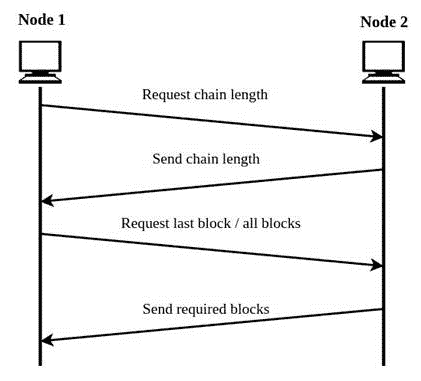
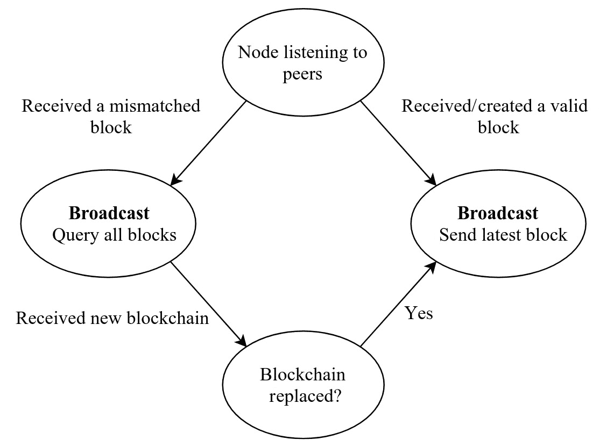
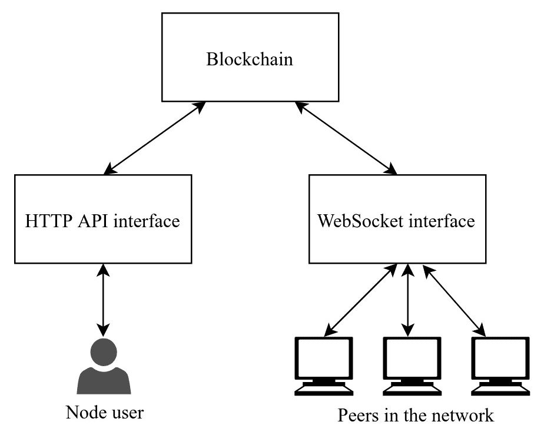

# 区块链中的网络

在前面的章节中，我们介绍了区块链在不可信网络中运行所必需的加密概念。但是我们还没有讨论什么是不可信网络。分散式网络促进了不信任的环境。在这一章中，我们将探索区块链如何通过**点对点** ( **P2P** )联网实现去中心化。

在本章中，我们将讨论以下主题:

*   P2P 网络
*   网络发现
*   块同步
*   在 P2P 网络中构建简单的区块链

我们知道，创建区块链是为了通过建立一个不可信的网络来消除对单一中央权力机构的信任，该网络将原本集中在单一实体中的所有任务分散化。P2P 网络是一种架构风格，用于在区块链应用程序中实现这种去中心化。我们将从探索 P2P 网络的定义、历史和架构开始这一章。

# 对等(P2P)网络

P2P 网络的基本定义是一种网络，其中称为节点的独立计算机组相互连接，在没有任何集中式服务器的帮助下共享数据。它是一个基于互联网的架构。这种类型的网络中的参与者或节点被称为对等体，因为它们在网络中是平等的，并且具有同等的责任。由于 P2P 网络中没有特殊的节点，每个节点既是服务提供者又是消费者。

# P2P 网络的历史

万维网的早期愿景与 P2P 网络的概念相一致，在 P2P 网络中，每个用户都是网络的积极编辑者和贡献者。1979 年首次开发的 USENET 实施了一种分散模式，在这种模式下，USENET 服务器相互通信以共享新闻文章。

虽然 P2P 模型在互联网的早期就已经使用，但它最常见的用途是在文件共享服务中实现。文件共享中的 P2P 因音乐共享应用 Napster 而流行起来。然而，随后出现了许多类似 P2P 文件共享模式的音乐服务。虽然 Napster 是先驱，但是 P2P 中的文件共享由于 BitTorrent 协议而获得了很多关注，BitTorrent 协议允许任何数字媒体的文件共享。

# P2P 网络架构

P2P 网络是一种架构，其中每个对等点同时充当服务器和客户端。由于区块链网络通常在公共网络上实现，因此很难创建适合 P2P 网络的物理拓扑。要创建这种体系结构，必须在实际的物理网络拓扑上构建虚拟或逻辑网络覆盖。创建逻辑网络是为了在公共网络中实现方便的资源索引和对等点发现。虽然形成了覆盖，但是数据将通过 TCP/IP 网络进行交换。

尽管底层物理网络可以遵循任何网络拓扑，但是 P2P 架构中的逻辑网络将形成网状拓扑，以便在对等体之间实现更好的通信:


图 4.1:部分物理网状拓扑

在物理网状拓扑中，每个节点可以直接或通过一些中间节点与任何其他对等节点建立通信。如果拓扑是全网状的，每个节点将能够直接通信，其中每个节点链接到网络中的所有对等体。部分网状配置始终是首选，因为构建全网状拓扑成本高昂。

基于节点的链接方式，P2P 网络主要有两种分类:**非结构化**和**结构化 P2P 网络**。

在一个非结构化的网络中，对等点之间没有以一种有组织的方式相互链接。每个节点随机连接到对等节点，形成一个逻辑网格。很容易构建非结构化网络，并且由于节点的冗余分布，它们非常健壮。然而，这些网络有缺点，例如请求泛滥的可能性，这是由于缺乏关于资源分配的知识而导致的结果。

结构化 P2P 网络覆盖是通过遵循特定的网络拓扑来形成的，以确保节点能够有效地在网络上执行活动。创建一个结构化的网络可以确保在某个时间可以从网络上的某个地方获取资源。一个**分布式哈希表** ( **DHT** )是一个广泛使用的结构化网络实现，提供去中心化的查找服务。DHT 中的资源信息可以使用存储在散列表中的键/值对的键从散列表中检索。与该键相关联的值提供了关于拥有该资源的对等体的信息。DHT 也在 BitTorrent 文件共享协议中用作集中式查找服务(如跟踪器)的替代品。

DHT 是在分布式系统中维护的查找服务。分布式系统中的节点负责维护从键到值的映射，从而提供资源信息。

现在，我们已经对 P2P 网络架构有了一个大致的了解，让我们深入了解一下区块链技术的一些概念，这些概念在 P2P 网络中用于形成一个分散的区块链网络。

# 网络发现

P2P 网络中的网络发现至关重要。当新节点启动时，没有定义网络。新节点必须检测到至少一个区块链节点是网络的一部分。节点可以通过多种方式识别对等体，从而发现网络。

不同的区块链框架使用自己的协议来执行对等点发现和高效路由。我们将通过查看比特币的原始实现来探索基本的 P2P 网络发现。

找到要连接的对等点列表的最简单方法是硬编码几个众所周知的对等点。使用维护对等点列表的中央服务器是另一种方法。比特币拥有关于 DNS 种子的信息，当节点最初设置时，DNS 种子提供了高度的可靠性，并将以比特币节点的 IP 地址列表做出响应。一旦检测到种子节点，该节点将建立 TCP 连接以与该节点进行握手。握手通过发送版本、地址、本地区块链信息和任何其他相关信息来验证节点。

一旦在由该节点发现的对等体之间建立了连接，该节点就可以查询关于连接到其对等体的其他节点的信息。类似地，节点可以向连接的对等体广播其自己的地址信息，以提高其可达性。每个节点还确保维护活动连接数量的阈值，以避免不必要的带宽使用。

一些区块链平台，如以太坊，使用一种称为 RLPx 的加密 P2P 网络协议套件，为应用程序通过 P2P 网络进行通信提供通用传输和接口。RLPx 利用类似 Kademlia 的路由来确保统一的网络结构。在初始节点握手之后，数据包被封装成帧，然后被加密。

# 块同步

加入区块链网络的每个节点都需要更新其区块链的本地副本，以将其状态与网络其余部分的全局状态同步。这是通过块同步实现的。需要更新其区块链的节点发送包含区块链高度信息的消息。任何具有较长区块链的对等节点都会发送一份清单，其中包含关于需要添加到主机节点的固定块数的元数据。现在，该节点向其所有对等节点发出请求，通过参考其收到的清单来获取各个块。该节点应该通过对它发送的块请求的数量保持一个上限，来确保不会用块请求淹没网络。

对于新加入的节点，块同步是一个漫长的过程。但是，一旦所有块都是最新的，它就可以验证块中的信息，如资产交易。当节点处于非活动状态后重新联机时，可以重新初始化块同步过程。

# 在 P2P 网络中构建简单的区块链

在[第三章](03.html)、【区块链中的 T2】密码术中，我们探讨了如何在去中心化网络中借助工作证明(proof-of-work)等算法达成共识。因为一致性算法确保拜占庭失败问题可以被解决，所以在对等体之间没有信任的分散网络中可以维护全局真理。尽管一致性算法提供了维护公共分类帐的便利方式，但是每个节点必须执行一组操作来维护分布式网络中的分类帐。

我们已经创建了一个简单的区块链应用程序，每当我们有新数据要插入时，它可以不断地扩大记录。因为我们的区块链应用程序是在单个系统中部署和创建的，所以我们还没有添加任何机制来验证这些块。但是，当我们将区块链部署为公共分类帐时，无论何时数据块从节点的对等方到达，都需要在每个节点进行验证。

为了在网络中达成一致，每个节点必须执行以下过程:

*   验证每个传入块的完整性，以便将其附加到本地区块链
*   选择由分布式网络中的对等体发布的最长有效链
*   每当有一些数据需要插入公共分类账时，创建一个有效的块

我们将构建一个简单的区块链应用程序，在 P2P 网络中部署区块链。该应用程序是一个参考实施，有助于我们理解区块链网络的分散化。尽管该应用程序执行网络发现、块同步和块验证，但为了简单起见，它并不遵循所有必需的协议。

现在，在深入研究应用程序的实现之前，让我们探讨一些构建应用程序时需要考虑的设计问题。以下部分涵盖了本应用程序中使用的验证、块同步和基本接口设计。

# 验证新块

虽然块是由挖掘器节点在验证了链中所有先前的块之后创建的，但是执行块验证以确保该块可以被附加到区块链的本地副本是网络中每个节点的责任。块验证是一个简单的过程，它检查最新的块是否有指向前一个块的指针或散列引用。当数据块包含复杂数据时，例如一组事务，必须验证独立的事务来验证数据块。因为我们不会在块中处理任何复杂的数据，所以验证事务超出了本章的范围。

# 选择最长的链

在分散网络中寻找全局真理是一项艰巨的任务，各种共识算法有助于实现这一目标。前一章讨论的工作验证算法是第一个也是最好的解决方案之一。它确保所创建的最长链具有网络中合法节点贡献给它的最多工作。为了简单起见，本申请中不包括一致算法。

# 冲突解决

虽然选择一个块似乎是一项显而易见的任务，但有时两个或更多节点会同时创建一个块，由于块中包含的内容不同，该块具有不同的标识。当一个节点收到相同高度的不同版本的块时，它将根据到达的顺序将其中一个添加到区块链中，并拒绝另一个或将其保留在内存池中。因此，网络中的节点最终可能会拥有不同版本的区块链。这被称为临时分叉或软分叉。

软分支是区块链中的一种分支，其中由于同时的块创建或某些故障，创建了两个或更多不同版本的区块链。这种分叉是暂时的，一旦更长的区块链在网络中传播，就会得到纠正。


图 4.2:由同时创建块引起的块冲突

*图 4.2* 显示了由于同时创建相同高度的块，如何创建两个区块链。两个区块链有相同的高度和相同的区块，直到索引 **11** 。但是 block **12** 有两个不同的版本。正如我们在图中看到的，其中一个块有一个以**结尾的散列...bfa9779618ff** ，另一个 hash 以**结尾...bce8564de9a8** 。这两个块都是有效的，因为它们的前一个哈希值与前一个块的哈希值相匹配，**...ea758a8134b1** 。在这个阶段，其中一个嵌段将被插入主链，另一个将被拒绝。

尽管在一个节点上解决了冲突，但是在整个网络中不存在区块链的全局真实性，因为其他节点可能已经决定接受不同的块。这将在区块链中创建一个临时分支，因为一些节点有区块链的一个版本，而一些节点有另一个版本。


图 4.3:通过接受较长的链来解决冲突

这种暂时的分叉不会长久。一旦一个更长的区块链被创建，并且当一个新的块被附加到一个链上时，每个节点将拒绝较小的区块链并且用较长的替换它们的区块链。*图 4.3* 显示了区块链如何与哈希值**...索引 **12** 处的 bce8564de9a8** 将被接受，因为它已经通过额外的块增加了其区块链，从而形成了更长的链。

# 阻止对等方之间的交换

该应用中的块交换使用广播查询消息和块来执行。新加入的节点经历初始块同步过程，以更新其区块链的本地副本。

# 初始块同步

当一个新节点加入网络时，它连接到网络中的一个可用对等体；然后，它尝试与对等方交换其块信息，并在需要时更新本地区块链。



图 4.4:初始块同步

该节点在连接到对等体之后发送链长度或最后块查询消息。请求链长度相当于请求最后一个块来标识它的索引。如果接收到的块由于散列不匹配而不能被附加到本地区块链，则该节点向其对等节点发送消息，要求其发送所有的块。该节点还可以广播请求所有块的消息，以确保它接收到最长的链。

# 广播场景

在 P2P 网络中，节点通过建立多个一对一的连接来相互通信，因为没有一个对等点是完全可信任的。维护多个连接迫使每个节点向其连接的对等节点广播任何信息，以便向整个网络分发数据并维护全局真实性。

在我们的应用中，我们将广播几种场景的信息，如*图 4.5* 中描述的状态转换图所示:



图 4.5:广播的状态转换图

网络中的节点在以下情况下执行广播:

*   当一个节点创建一个新的块时，它必须将它广播给所有连接的对等节点，以便传播该块的信息
*   当一个节点从它的对等节点接收到一个新的块时，它必须广播它以便在 P2P 网络中传播该块
*   当一个节点接收到一个不符合当前区块链的块时，它向它的所有对等节点发送一个查询消息，以便找到最长的链

# 应用程序接口

该应用程序提供了两个用户界面:一个用于访问和操作区块链信息的 HTTP API 界面，以及一个位于所有节点的 WebSocket 界面，通过创建一个长期通道来实现双向通信:



图 4.6:应用程序的界面

# 钻研代码

有三个不同的类构成了应用程序的三个独立部分。第一个是`Server`，将处理区块链网络上的 P2P 通信。另外两个类是`Blockchain`和`Block`，它们在前一章中已经介绍过，执行基本的区块链操作。`Blockchain`类还执行增强的功能，以便验证从对等体接收的块，如应用程序架构中所讨论的。

# 服务器界面

服务器接口是使用名为`Sanic`的 Python web 服务器框架创建的，它有助于以异步方式对 web 服务器逻辑进行编码:

背景:Sanic 是一个轻量级 web 服务器框架，可用于构建高速 web 服务器。它通过支持闪亮的异步请求处理程序来支持异步编程。它利用名为`uvloop`的事件循环来获得更好的性能。

```
class Server(object): 

    def __init__(self): 

        self.app = Sanic() 
        self.blockchain = Blockchain() 
        self.sockets = [] 
        self.app.add_route(self.blocks, '/blocks', methods=['GET']) 
        self.app.add_route(self.mine_block, '/mineBlock', methods=['POST']) 
        self.app.add_route(self.peers, '/peers', methods=['GET']) 
        self.app.add_route(self.add_peer, '/addPeer', methods=['POST']) 
        self.app.add_websocket_route(self.p2p_handler, '/') 
```

前面的`Server`类的代码片段创建了四个 REST API 接口，用于显示块、挖掘(创建)新块、显示节点的当前对等点以及添加新对等点。我们将使用使用`add_route`方法创建的端点来与我们的节点交互。

我们将使用 WebSocket 协议来执行节点之间的 P2P 通信，因为它允许连接的节点之间进行双向通信，并在不增加 web 服务器负载的情况下保持活动连接。

与 HTTP 不同，WebSocket 是 TCP 之上的一种通信协议，它提供双向通信通道。它可以用于 P2P 通信，因为两端可以同时发送和接收消息。

上述代码片段中定义的所有 API 接口都调用以下方法:

```
    async def mine_block(self, request): 
        try: 
            newBlock = self.blockchain.generate_next_block(request.json["data"]) 
        except KeyError as e: 
            return json({"status": False, "message": "pass value in data key"}) 
        self.blockchain.add_block(newBlock) 
        await self.broadcast(self.response_latest_msg()) 
        return json(newBlock) 
```

前面的方法实现了生成要追加的新块所需的功能。因为它是一个 HTTP POST 方法，所以它接受一个名为`data`的参数，这个参数是在 HTTP 请求体中发送的。该数据用于创建新块。该方法将广播新创建的块，如应用程序设计一节所述。

本地区块链中存在的块通过以下方法格式化并返回:

```
     async def blocks(self, request): 
         return json(self.blockchain.blocks) 
```

每当用户想要显式添加对等点时，他们将使用以下界面:

```
    async def add_peer(self, request): 

        asyncio.ensure_future(self.connect_to_peers
([request.json["peer"]]),        
        loop=asyncio.get_event_loop()) 
        return json({"status": True}) 
```

该方法向 web 服务器的事件循环添加了一个异步`connect_to_peers`任务。所连接的对等体的所有套接字信息都被维护用于将来的广播。

以下实现从初始连接后由节点维护的所有对等方的套接字对象中获取地址和端口信息:

```
    async def peers(self, request): 
        peers = map(lambda x: "{}:{}".format(x.remote_address[0], x.remote_address[1]), self.sockets) 
        return json(peers)] 

    async def connect_to_peers(self, newPeers): 
        for peer in newPeers: 
            logger.info(peer) 
            try: 
                ws = await websockets.connect(peer) 

                await self.init_connection(ws) 
            except Exception as e: 
                logger.info(str(e)) 
```

`connect_to_peers`方法初始化与所有已知对等方的 WebSocket 连接。当使用 HTTP 接口添加新的对等点时，也会调用此方法。使用`init_connection`功能执行初始块同步。`p2p-handler`是一个监听连接的 WebSocket 处理程序。它使用`init_connection`创建一个套接字并执行块同步:

```
    async def p2p_handler(self, request, ws): 
        logger.info('listening websocket p2p port on: %d' % port) 
        try: 
            await self.init_connection(ws) 
        except (ConnectionClosed): 
            await self.connection_closed(ws) 
```

当对等体断开连接时，套接字信息被删除:

```
    async def connection_closed(self, ws): 

        logger.critical("connection failed to peer") 
        self.sockets.remove(ws) 
```

块同步是由`init_connection`方法通过发送查询消息请求对等体的区块链的最后一块来执行的。它还添加了一个消息处理程序，持续监听来自其对等方的消息:

```
    async def init_connection(self, ws): 

        self.sockets.append(ws) 
        await ws.send(JSON.dumps(self.query_chain_length_msg())) 

        while True: 
            await self.init_message_handler(ws) 
```

每个节点上的消息处理程序监听三种类型的消息。其中两个是查询消息，节点通过查询本地区块链对其进行响应。`RESPONSE_BLOCKCHAIN`消息是从本地节点进行的查询接收的响应。该消息将由`handle_blockchain_response`进一步处理:

```
    async def init_message_handler(self, ws): 
        data = await ws.recv() 
        message = JSON.loads(data) 
        logger.info('Received message: {}'.format(data)) 

        await { 
            QUERY_LATEST: self.send_latest_msg, 
            QUERY_ALL: self.send_chain_msg, 
            RESPONSE_BLOCKCHAIN: self.handle_blockchain_response 
        }[message["type"]](ws, message) 
```

以下方法序列化要发送到对等方的查询消息请求的响应数据:

```
    async def send_latest_msg(self, ws, *args): 
        await ws.send(JSON.dumps(self.response_latest_msg())) 

    async def send_chain_msg(self, ws, *args): 

        await ws.send(JSON.dumps(self.response_chain_msg())) 
```

当连接的对等体查询区块链时，整个区块链被发送到该对等体:

```
    def response_chain_msg(self): 
        return { 
            'type': RESPONSE_BLOCKCHAIN, 
            'data': JSON.dumps([block.dict() for block in self.blockchain.blocks])} 
```

以下代码片段从区块链获取最后一个块，并将其格式化为 JSON，以便可以通过套接字通道发送:

```
    def response_latest_msg(self): 

        return { 
            'type': RESPONSE_BLOCKCHAIN, 
            'data': JSON.dumps([self.blockchain.get_latest_block().dict()]) 
        } 
```

以下代码片段是用于查询区块链的连接对等体的查询请求消息:

```
    def query_chain_length_msg(self): 

        return {'type': QUERY_LATEST} 

    def query_all_msg(self): 

        return {'type': QUERY_ALL} 
```

下面的方法在消息处理程序中调用，该处理程序持续监听对等体的请求和响应。调用此方法来处理对等方发送的区块链信息:

```
    async def handle_blockchain_response(self, ws, message): 
        received_blocks = sorted(JSON.loads(message["data"]), key=lambda k: k['index']) 
        latest_block_received = received_blocks[-1] 
        latest_block_held = self.blockchain.get_latest_block() 

        if latest_block_received["index"] > latest_block_held.index: 
            logger.info('blockchain possibly behind. We got: ' + str(latest_block_held.index) 
                  + ' Peer got: ' + str(latest_block_received["index"])) 
```

如果块的最后一个索引不大于本地区块链的最后一个索引，它将被拒绝，因为节点只对最长的链感兴趣:

```
            if latest_block_held.hash == latest_block_received["previous_hash"]: 
                logger.info("We can append the received block to our chain") 

                self.blockchain.blocks.append
(Block(**latest_block_received)) 
                await self.broadcast(self.response_latest_msg()) 
```

如果最后接收的块满足散列条件，则将其附加到本地区块链。如果它被满足，那么它被广播给所有的对等体:

```
            elif len(received_blocks) == 1: 
                logger.info("We have to query the chain from our peer") 
                await self.broadcast(self.query_all_msg()) 
            else: 
                logger.info("Received blockchain is longer than current blockchain") 
                await self.replace_chain(received_blocks) 
```

如果最后一个块不满足散列条件，则本地区块链可能落后不止一个块。如果是完整的链，则本地副本将被所接收的区块链替换。否则，广播消息以查询整个区块链。

当节点收到比当前本地拷贝更长的区块链时，它将验证整个区块链，然后替换整个本地区块链:

```
    async def replace_chain(self, newBlocks): 

        try: 
            if self.blockchain.is_valid_chain(newBlocks) and len(newBlocks) > len(self.blockchain.blocks): 
                logger.info('Received blockchain is valid. Replacing current blockchain with ' 'received blockchain') 
                self.blockchain.blocks = [Block(**block) for block in newBlocks] 
                await self.broadcast(self.response_latest_msg()) 
            else: 
                logger.info('Received blockchain invalid') 
        except Exception as e: 
            logger.info("Error in replace chain" + str(e)) 
```

然后，`broadcast`方法将所有的请求和响应发送给通过已建立的套接字连接连接到该节点的每个对等体:

```
    async def broadcast(self, message): 

        for socket in self.sockets: 
            await socket.send(JSON.dumps(message)) 
```

# 块和区块链接口

`Block`和`Blockchain`类方法类似于前一章中构建简单区块链所使用的方法，唯一的改进是用于验证接收块的验证方法。

调用下面的方法来验证每个块都链接到其前一个块:

```
    def is_valid_new_block(self, new_block, previous_block): 
```

以下条件验证新块的索引:

```
        if previous_block.index + 1 != new_block.index: 
            logger.warning('invalid index') 
            return False 
```

此条件通过比较块的哈希值来执行哈希验证:

```
        if previous_block.hash != new_block.previous_hash: 
            logger.warning('invalid previous hash') 
            return False 
```

这种情况通过计算其摘要来检查新添加块的完整性:

```
        if self.calculate_hash_for_block(new_block) != new_block.hash: 
            logger.info(type(new_block.hash) + ' ' + type(self.calculate_hash_for_block(new_block))) 
            logger.warning('invalid hash: ' + self.calculate_hash_for_block(new_block) + ' ' + new_block.hash) 
            return False 
        return True 
```

当节点想要用从其对等节点检索到的区块链替换本地时，使用以下方法来验证整个区块链:

```
    def is_valid_chain(self, blockchain_to_validate): 
        if self.calculate_hash_for_block(Block(**blockchain_to_validate[0])) != self.get_genesis_block().hash: 
            return False 
```

这个条件验证了硬编码的 genesis 块:

```
        temp_blocks = [Block(**blockchain_to_validate[0])] 
        for currentBlock in blockchain_to_validate[1:]: 
            if self.is_valid_new_block(Block(**currentBlock), temp_blocks[-1]): 
                temp_blocks.append(Block(**currentBlock)) 
            else: 
                return False 
        return True 
```

通过调用`is_valid_new_block`，对接收到的区块链的每个块进行迭代验证。

# 运行区块链节点

虽然每个节点都有两个处理程序，分别用于 HTTP 和 WebSocket 接口。一个 web 服务器应用程序实例就足以服务于这两者。 *Sanic* 使用`uvloop`作为调度程序。它异步处理请求:

```
if __name__ == '__main__': 

    server = Server() 
    server.app.add_task(server.connect_to_peers(initialPeers)) 
    server.app.run(host='0.0.0.0', port=port, debug=True) 
```

服务器应用程序被实例化，并且创建一个任务来将节点连接到`initialPeers`，该任务由每个节点硬编码。应用程序将使用默认端口来创建 web 服务器。

每个节点将运行服务器应用程序来加入网络。一旦节点连接到一个对等点，它的区块链就与网络的更新区块链同步。

我们现在将通过创建三个节点实例来运行应用程序:节点 1、节点 2 和节点 3。节点 2 将节点 1 作为其初始对等体，节点 3 将节点 2 作为其初始对等体。当我们运行所有三个节点实例时，它们形成一个环状网络。

让我们通过调用每个节点的 HTTP API 端点`/peers`来检查每个节点的对等信息:

*   **node 1**:[" 127 . 0 . 0 . 1:51160 "]
*   **Node2** : ["127.0.0.1:3001 "，" 127.0.0.1:35982"]
*   **node 3**:[" 127 . 0 . 0 . 1:3002 "]

`3001`是分配给节点 1 的端口号。节点 2 的端口号为`3002`，节点 3 的端口号为`3003`。随机端口号是试图与节点 2 通信的对等体的端口号。前面的信息清楚地表明，node2 将 node1 添加为其对等节点，node3 将 node2 添加为其对等节点。

当我们调用`/blocks` HTTP API 端点时，所有节点都返回以下结果:

```
[ 
  { 
    "data": "my genesis block!!", 
    "hash": 
 "816534932c2b7154836da6afc367695e6337db8a921823784c14378abed4f7d7", 
    "index": 0, 
    "previous_hash": "0", 
    "timestamp": 1465154705 
  } 
] 
```

让我们使用`/mineBlock` HTTP API 端点，通过发送一个带有有效负载`{"data": "created at node2"}`的 POST 请求，在 node2 挖掘一个新的块。由于所有节点都是互连的，形成一个网格，每个节点将接收新广播的块，并更新其本地区块链分类帐。现在，每个节点反映了以下区块链:

```
[ 
  { 
    "data": "my genesis block!!", 
    "hash": 
 "816534932c2b7154836da6afc367695e6337db8a921823784c14378abed4f7d7", 
    "index": 0, 
    "previous_hash": "0", 
    "timestamp": 1465154705 
  }, 
  { 
    "data": "created at node2", 
    "hash": 
 "29630fab36aa1e3abf85b62aee8f84b08438b90e9e19f39d18766cc9208b585c", 
    "index": 1, 
    "previous_hash": 
 "816534932c2b7154836da6afc367695e6337db8a921823784c14378abed4f7d7", 
    "timestamp": "1522069707" 
  } 
] 
```

下面这个例子:完整的 P2P 区块链应用程序可以在本书的 GitHub 知识库中找到。它有一个配置，可用于使用 Docker Compose 设置 Docker 集群。这将帮助您在一台机器上设置任意数量的区块链节点。

# 摘要

本章通过构建一个具有基本功能的简单 P2P 应用程序，介绍了区块链应用程序中使用的 P2P 网络的各个方面。您从本章中学到的基础架构知识将帮助您理解一些区块链平台中使用的高级网络概念。

现在，在讲述了几个密码学和网络概念之后，我们对区块链技术有了一个很好的了解，接下来我们将介绍区块链技术的原始和最强大的用例之一——加密货币。在下一章中，我们将应用到目前为止介绍的大多数概念来理解和实现加密货币用例。