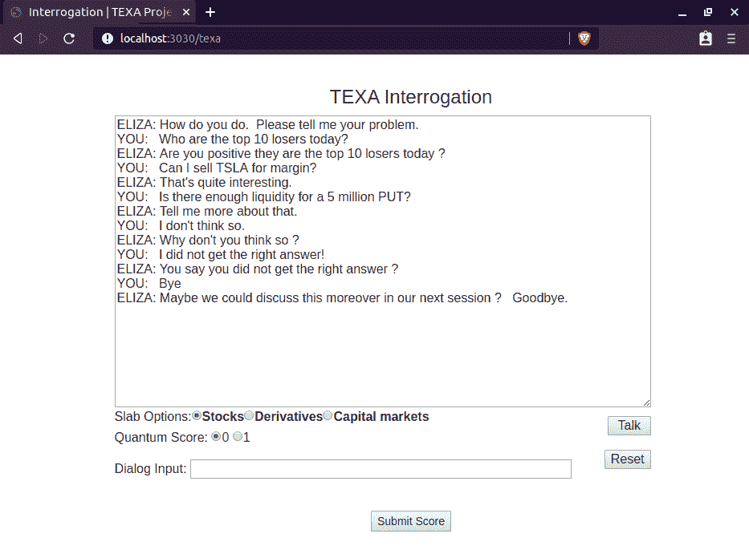
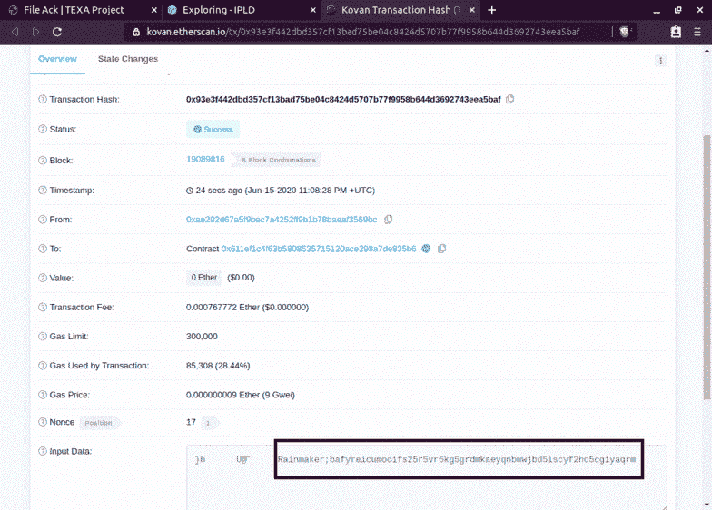

Empowering Blockchain Using AI *"Combining trust and intelligence for a better internet era"*

本章探索了多种方法和设计模式，通过利用**人工智能** ( **AI** )模型和技术来提升区块链解决方案的质量。你将会看到人工智能和区块链在多个垂直领域的应用。此外，你将能够识别空白，用引导的方法解决它们，并通过使用区块链和人工智能设计解决方案。在本章中，我们将讨论以下主题:

*   结合区块链和人工智能的好处
*   关于 acumen 技术
*   疫情管理中区块链与人工智能的结合
*   将区块链和人工智能结合到社会金融中
*   将区块链和人工智能结合到人性化的数字交互中
*   AI 的民主化与去中心化

# **区块链和 AI 结合的好处**

简单地说，使用人工智能的商业好处是降低成本，使用区块链的商业好处是在流程中实现透明。当这两种技术一起使用时，您可以应用一种新的解决方案来解决当今世界中各种各样缺乏透明度和成本效益的问题。在下面的章节中，我们将观察结合使用区块链和人工智能来解决现实世界挑战的产品和解决方案。我认为以下产品和解决方案是使用这两种技术的第一代应用程序；在下一波数字化转型中，可能还会有更多变革。

## **关于艾库门科技**

艾库门科技([www.aicumen.com](http://www.aicumen.com))是一家领先的数字创新工作室，其愿景是通过使用区块链和人工智能构建可信的**去中心化智能应用** ( **DIApps** )来赋能数字经济中的价值创造，成立于 2017 年。

使用新兴技术交付解决方案的关键挑战之一是对现实世界的问题实施有意义的解决方案的能力。这一挑战在区块链和人工智能等阶跃变化技术中更加明显。为了应对这一挑战，Aicumen 开发了一种独特的数字再想象流程，这种流程既创新又可行，旨在利用区块链和人工智能等颠覆性技术提供有意义、有价值的商业解决方案。

数字再成像过程是一个自下而上的过程，在技术上由内聚的协议层、分散的网络、智能传输和适应性应用来定义。整个过程中开发和消耗的协议是 **Krama 智能协议** ( **KIP** )。像 MóiBit 和 MoiFi 这样的去中心化网络是建立在 KIP 之上的，嵌入了像**社会信任商数** ( **STQ** )这样的智能传输来创建 FINETs、Tracy 和 REBECA 这样的 DIApps。

这一过程也可以定制和重复用于其他区块链和人工智能技术，共同形成数字再成像技术栈。

在接下来的章节中，你将会了解到一些由 Aicumen 制造的由区块链和 AI 驱动的产品。

## **结合和艾在的管理**

最近，我们经历了一个名为**新冠肺炎**的新疫情，它影响了许多人的生活。由于担心传染，全球经济几乎处于停滞状态。为了振兴我们的经济，我们需要控制当前的感染并防止其再次发生。对于政府、当局和公民来说，这是一项具有挑战性的任务，他们需要在这个不确定的时代遵守新的规则。因此，疫情管理软件正在成为以负责任的方式振兴经济的重要手段。

### **数字接触追踪的当前问题**

虽然政府和当局正在尽最大努力借助接触者追踪应用程序来管理最近的新冠肺炎疫情，但我们可以观察到一些关键问题:

*   **缺乏用户隐私**:虽然联系追踪应用程序有助于恢复正常，但用户的隐私面临严重风险。这可能在短期内导致数据泄露，并在长期内升级为社会不平等。
*   **低质量数据**:设计效率低下的联系人追踪应用程序导致数据质量低下。在某些情况下，我们还可以看到位置欺骗和其他形式的欺骗正在被执行，以愚弄当局。这是可能的，因为用户缺乏**公钥基础设施** ( **PKI** )，应用程序使用传统的客户端-服务器模型。
*   **更长的验证时间**:由于此类应用程序收集的是非结构化数据，因此需要更多时间来确定公民或社区是否存在感染风险。没有准确和高质量的数据点，很难决定是否隔离某个区域。延误或假阴性会进一步导致灾难性后果和社会动荡。

对当前数字联系追踪的局限性有了一个合理的理解，让我们看看一个叫 Tracy 的产品是如何克服这些挑战的。

**Case study**: **Tracy** is a privacy-preserving app for pandemic management and safe movement that digitally enables governments, citizens, and medical professionals to live in an **anxiety-free** and **risk-mitigated** model. Tracy is customizable as per the needs of the local region. You can learn more about Tracy at [https://www.gettracy.app/](https://www.gettracy.app/).

现在让我们观察一下社交金融中使用区块链和人工智能的产品。

## **结合社交金融中的区块链和 AI**

今天的合作金融世界需要以更具包容性的方法为目标，为最需要资金的人提供资金。在后新冠肺炎时代，获得跨境资本有助于在有兴趣放贷的富人和需要资本的人之间创造一种平衡。

### **当前融资问题**

虽然许多应用程序都在努力实现包容性和智能驱动的决策，但它们面临的一些关键问题如下:

*   银行服务不足和没有银行账户的人无法获得资本:在后新冠肺炎时代，许多人失去了工作。此外，由于缺乏资本，许多小型和微型企业主无法继续其日常业务。
*   **无法个性化借贷**:尽管一些国家可能已经推出了刺激方案来支持创业和经济增长，但央行和金融服务机构的贷款利率可能对借款人无效。因此，有必要将贷款人和借款人直接联系起来，双方都可以同意条款并完成融资。
*   **无法衡量借款人还款的意图和能力**:社会可验证的数据可以作为创建贷款评分的证据。人工智能可以衡量借款人的意图和还贷能力。我们很多借贷平台都缺乏这个功能，而有些平台可能会在极端的层面上实践这个，从而损害借款人的隐私。因此，有必要在借款人的隐私和应用程序跟踪他们结清贷款的能力之间取得平衡。

对当前社会融资的局限性有了一个公平的理解，让我们来观察一种产品是如何克服这些挑战的。

**Case study**: **FINETs** is India's first **Decentralized Finance** (**DeFi**) application specializing in co-operative finance models, which enable normal people in India to participate in a decentralized world. As part of the same DeFi initiative, Aicumen has also been developing assets and local currency-based DAO to support financial inclusion through rupee-backed stablecoins (RuCoin). You can learn more about FINETs by visiting their website at [https://www.finets.us/](https://www.finets.us/).

现在让我们看看一些使用区块链和人工智能使数字交互人性化的产品。

## **结合区块链和人工智能，使数字交互更加人性化**

由于区块链和人工智能模型的几个实现正在帮助世界变得更好，在去中心化软件社区中一直有一种努力设计最有效的去中心化协议、网络和软件的精神。这场思想和技术的革命最近受到了过去 10 年人工智能和区块链领域前所未有的大量研究的推动。

### **数字互动的当前问题**

虽然“让区块链更美好”的研究仍在进行，但以下是区块链科技在成熟和人性化数字交互方面面临的一些关键问题:

*   可扩展性:大多数分散式网络预计会大量运行。因此，网络以最佳形式运行的能力受到网络中不断增长的节点数量的阻碍。
*   **缺乏背景**:尽管大多数区块链协议和框架受到了去中心化运动的启发，但它们未能捕捉到衡量网络所产生价值所需的背景。这在理解和解释由大多数传统区块链网络创建的代币的价值方面造成了障碍。
*   **应用受网络限制**:网络的行为严重限制了应用的范围。由于僵化的结构，这种限制阻碍了区块链的大规模采用。

对当前数字交互的局限性有了一个合理的理解，让我们看看一个产品是如何克服这些挑战的。

**Case study**: Aicumen is leading the research and development of **Krama Intelligence Protocol** (**KIP**), an initiative trying to humanize the internet and give power and control back to the users. You can learn more about KIP by visiting the website at [https://www.kip.foundation/](https://www.kip.foundation/).

了解了 Aicumen 如何在他们的产品中应用人工智能和区块链，现在让我们观察区块链和分散数据库在分散人工智能中的应用。

## **AI 的民主化与去中心化**

在过去的 10 年里，我们看到了人工智能领域的进步和颠覆，区块链也是如此。通过访问大量用户数据，科技公司现在能够为客户提供内部人工智能驱动的助手。银行和保险公司正在使用聊天机器人来降低运营成本和留住客户。投资公司和交易应用程序正在使用机器人顾问来获取股票市场上股票的最新买卖趋势。同样，我们也看到了亚马逊 Alexa、Google Home、苹果的 Siri 等虚拟助手的推出。这些虚拟助手不再是专门安装在手机上的。最近，这些助手已经与几个第三方服务紧密集成，以在外部应用程序中执行用户命令。

在单个语音助手或聊天机器人技术为用户集成了许多服务的情况下，需要保持 AI 对每个单独上下文的响应质量。为了确保这些助手和聊天机器人的一致响应质量，我提出了一个更好的测试模型。

正如在[第二章](02.html)、*人工智能领域简介*中介绍的，人工智能也是软件，因此，它需要严格的测试来确保软件质量。测试 AI 的最早方法之一是由艾伦·图灵提出的。他称之为图灵测试。

在图灵测试中，人类评估员的任务是仔细检查两组文本。评估者被告知两段文字中的一段来自机器，另一段来自人类。在图灵测试的最初想法中，询问仅限于文本。如果评估者不能可靠地确定人类生成的文本和机器生成的文本，则机器被认为成功地避开了评估者，并通过了测试。需要注意的是，该测试并不关注 AI 对问题给出正确答案的能力。该测试只关注文本与人类可能产生的文本有多相似。我强烈推荐你通过阅读维基百科的文章来了解更多关于图灵测试的知识:[https://en.wikipedia.org/wiki/Turing_test](https://en.wikipedia.org/wiki/Turing_test)。

基于此，我能够构建一个更新的界面，适合 2016 年和 2017 年不断增长的聊天机器人开发者社区。这导致了开源框架**图灵测试扩展架构** ( **TEXA** )的开发，如下节所述。

### **案例研究 TEXA 项目**

图灵测试的这个原始版本已经面临来自人工智能领域的许多专家和人工心理学的哲学思想家的几次批评。这些批评可以归纳如下:

*   **机器智能的非量化:**最初的图灵测试没有提供被测机器所展示的智能的**梯度。这种批评需要得到解决，以使人工智能合格，这是基于将其功能分类为部分，并将分数分类为级别。**
*   **人类经验的非量化:**最初的图灵测试没有为执行和操作测试的询问者提供一个**开放知识库**。这种批评需要得到解决，以确保测试的价值以及实例中涉及的人类智能和人工智能的潜力。

**Artificial psychology**: Although the term artificial psychology has many meanings, it is generally described as the study of the **mental processing** of AI. Such studies can help us understand how machines comprehend objects, data, and patterns.

为了与近年来更新的人工智能模型进行交互、评估和评价，需要一个增强的框架来解决与聊天机器人和语音助手的最新发展相关的批评。前面提到的两个批评与前沿人工智能发展的现状有关，因为许多使用这种人工智能模型的产品都是针对与多个应用程序相关的用户，这就产生了丰富的上下文。

虽然一些测试框架试图向开发者提供全面的测试能力，但也存在保持 AI 性能透明的需要。这将防止公司在丰富的环境中对其人工智能算法的安全性和质量做出大胆的声明。总之，我们需要一个全面的测试框架，它还能保持测试结果的透明性。TEXA 框架满足了这些要求。

TEXA 是一个新颖的测试和基准框架，由简单的数学理论支持。它可以用来与在多上下文环境中工作的人工智能进行交互、评估和评价。简单来说，TEXA 通过允许测试者给每一次与机器的交互分配一个二进制分数，增强了图灵测试的概念。这将允许我们量化模型的质量，并比较它们在多种情况下的性能。

这个测试框架基于新的数学模型，允许测试人员在粒度级别上提供他们对人工智能性能的反馈。AI 和测试者之间的每次交互都可以被评分。测试者提供的分数是二进制格式，表示 1 或 0。这些分数被称为**量子分数**。每个量子分数代表测试者对与人工智能交互的满意度。TEXA 框架中的量子分数的添加是一个可以帮助以主观方式量化用户体验的特征。

除了量子分数，TEXA 框架还提供了在多种背景下测试人工智能的机会。让我们假设，聊天机器人是为了满足向从事资本市场、衍生品和股票交易的交易员提供适当建议的需求而构建的。这个聊天机器人可以插入一个数据接口，为三种不同类型的用户提供洞察。所有这些用户都需要关键信息，不能有任何延迟或混乱。因此，重要的是聊天机器人不要将与股票相关的查询误认为与衍生品相关的查询。在传统的测试环境下，将创建三个独立的测试会话来测试实现。然而，我们必须明白，只有一个 chatbot 实例将在生产环境中运行，支持三种类型的用户。因此，如果测试是孤立的，就很难观察到异常。为了观察上下文切换期间的异常，TEXA 框架允许测试人员创建**块**。基本上，slab 是一个表示询问器和 AI 之间交互环境的参数。在交互测试会话期间，测试人员可以在为人工智能的响应分配量子分数之前，通过选择适当的平板来提供粒度目标反馈。

分配给属于一个平板的每个交互的量子分数用于计算分数，并比较人工智能的响应性和准确性。

一旦测试会话完成并且分数被提交，测试分数被计算并存储在本地数据库中。一旦存储在本地数据库中，考试成绩就会公布在公共的**星际文件系统** ( **IPFS** )上。一旦发布，就会生成一个公共链接，供测试人员检查结果数据。随后，由公共 IPFS 网络返回的**内容标识符** ( **CID** )用于在区块链以太坊的 Kovan testnet 上签署交易。事务链接也被生成并返回给测试人员。该交易是带有审计跟踪的公共数据，公众和感兴趣的爱好者都可以访问。这为人工智能的开发和测试提供了一个透明的社区，减少了任何人在未来干预人工智能评分和排名过程的机会。

TEXA 项目为上传聊天机器人数据提供了一个简单的交互式 UI 环境，并允许用户在一个集成的流程中与上传的聊天机器人进行交互、评估和评价。您可以通过阅读以下 GitHub 链接上的文档来了解更多关于 TEXA 的功能:[https://GitHub . com/TEXA project/TEXA-docs/blob/master/TEXA % 20-% 20 project % 20 report . pdf](https://github.com/TexaProject/texa-docs/blob/master/TEXA%20-%20Project%20Report.pdf)。

#### **TEXA 的功能**

对 TEXA theory 及其为聊天机器人和语音助手开发人员提供的特性和功能有了基本的了解后，让我们一步一步地观察它的功能:

1.  测试 AI 实现的人被称为询问者或测试者。询问器在欢迎屏幕上上传聊天机器人数据:

图 5.1:TEXA web 应用程序要求询问者上传聊天机器人数据文件的屏幕截图

2.  上传完成后，框架会要求测试人员用一个名称来标识他们的 AI:

图 5.2:TEXA web 应用程序要求询问者给出会话中被测试 AI 的名称的屏幕截图

3.  一旦提供了姓名，就会在屏幕上打印出确认信息。确认屏幕底部有一个按钮可用于继续测试:

图 5.3:TEXA web 应用程序确认聊天机器人数据存储在本地服务器中的屏幕截图

4.  现在，框架要求测试人员输入 AI 实现需要测试的板块或类别的总数:

图 5.4:TEXA web 应用程序请求用户输入板坯数量的屏幕截图

当板的数量被量化时，要求测试者输入每个板的名称。

5.  一旦名字被输入，我们进入主询问窗口。该屏幕提供了一个简单的界面，允许测试人员在许多情况下与人工智能进行交流。在下面的截图中，你可以观察到我们正在测试一个聊天机器人来响应三种上下文，称为**股票**、**衍生品**和**资本市场**:

图 5.5:TEXA web 应用程序中询问窗口的屏幕截图，询问器与 AI 进行交互

测试人员现在将与上传的 AI 进行交互，并通过选择正确的上下文来评估每个交互，并根据他们的满意度分配分数。

6.  一旦测试完成，分数就会被提交。现在，我们收到来自框架的确认，分数已经计算出来并公布给公众 IPFS。给出了访问结果数据的链接。此外，还提供了与区块链交易的链接:

图 5.6:TEXA web 应用程序的屏幕截图，该应用程序确认向 IPFS 和区块链事务链接发布结果数据

7.  通过单击第一个链接，我们可以观察结果数据:

图 5.7:显示存储在 IPFS 上的结果数据的 IPLD 浏览器的屏幕截图

在这个屏幕截图中，您可以观察到 AI 的名称、测试人员的名称以及由 TEXA 框架计算的测试会话的结果。

8.  通过单击第二个链接，我们可以观察事务和签名的数据:

图 5.8:以太坊区块链浏览器的屏幕截图，显示了作为输入数据在交易中签名的 CID 哈希值

在前面的截图中，您可以看到 AI 的名称和结果的 CID 已经作为输入数据提供。这是公共区块链上可获得的不可变数据，以建立进行测试的证据。

9.  最后，通过单击结果屏幕上的访问/结果按钮，您可以进入下表:

图 5.9:TEXA web 应用程序的屏幕截图，显示了在服务器上本地查询的所有聊天机器人的列表结果

前面的截图显示了我在本地电脑上测试的所有聊天机器人的结果。您可能看不到所有条目，但在每个表中只能看到一行。这是表从本地数据库读取数据时的预期行为。

要在您的本地机器上运行这个应用程序，您可以按照以下链接的文档中的说明进行操作:[https://github.com/TexaProject/texa/blob/master/README.md](https://github.com/TexaProject/texa/blob/master/README.md)。

# 摘要

在这一章中，我们已经了解了如何使用区块链和人工智能技术来增强应用程序的能力。你已经被介绍到爱库门科技公司，这是第一家使用区块链和人工智能对问题进行创新解决方案的公司。你已经被介绍到几个领域的挑战，如疫情管理，社会融资，互联网上人性化的数字互动。我们还介绍了使用区块链和人工智能解决这些问题的应用程序。已经向您介绍了图灵测试的概念及其在测试聊天机器人中的应用。您还可以看到区块链在聊天机器人测试框架 TEXA 中的应用。

本章展示的例子将帮助你分析人工智能和区块链在下一代互联网应用中带来透明和健壮应用的好处。

在下一章中，我将向您介绍人工智能在加密货币中的应用，您将能够试验加密交易中的一些新技术。