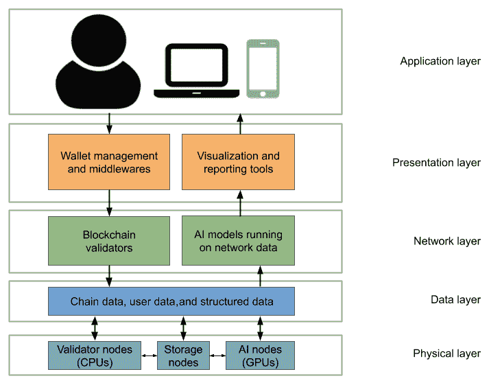
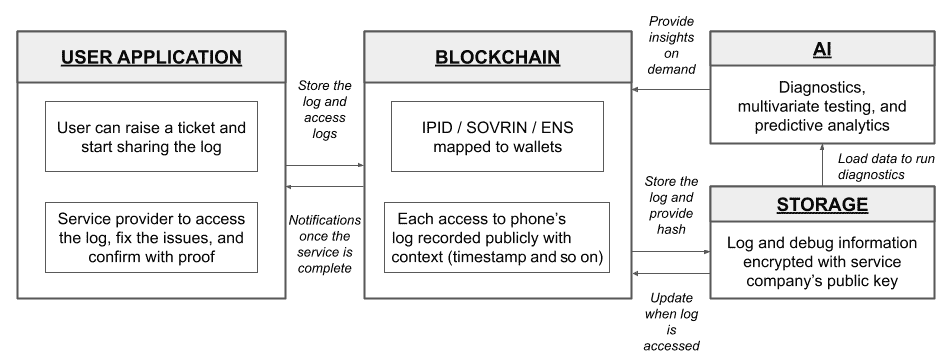
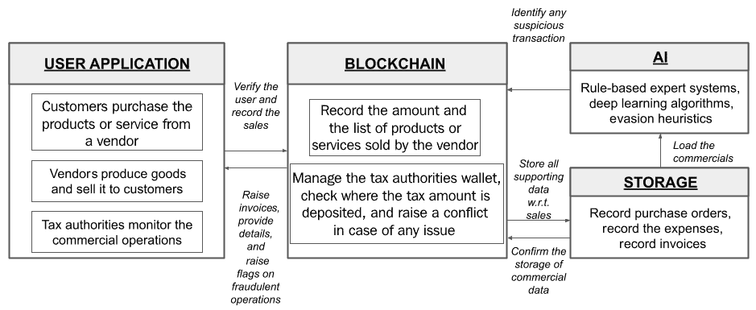
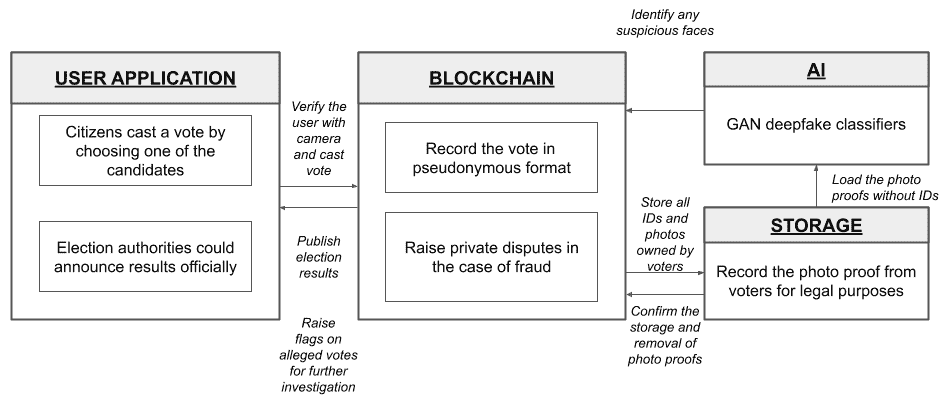
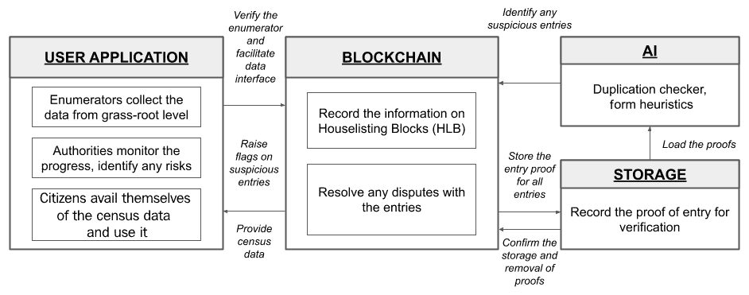
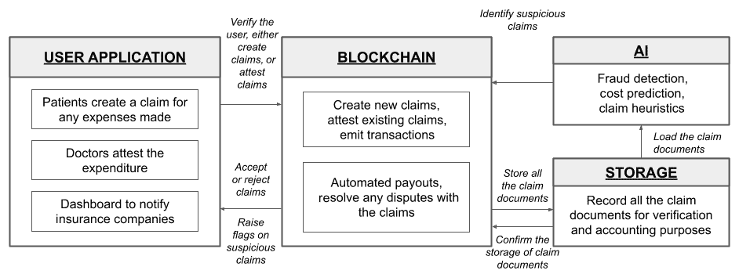
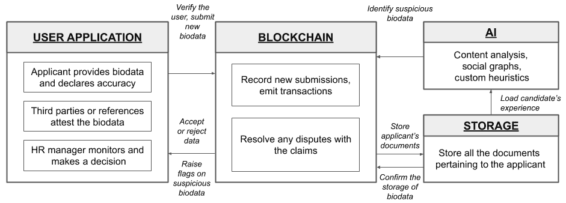

The Future of AI with Blockchain *"Let's walk the talk with blockchain and AI!"*

在这本书的最后一章，我们将一窥人工智能和区块链技术的未来。我们将研究如何将这些技术结合起来解决影响许多行业和我们星球的一些最大的问题。在这一章中，我也提出了许多建议，这些建议可以被感兴趣的学生和教师用作学术项目的新想法。如果你是一名职业人士或爱好者，你仍然可以考虑将这些想法作为一个辅助项目，与那些喜欢在闲暇时间集思广益的人一起工作。

在本章中，我们将讨论以下主题:

*   艾与区块链的交汇
*   融合人工智能和区块链的未来
*   在企业中融合人工智能和区块链
*   在政府中融合 AI 和区块链
*   在金融服务领域融合人工智能和区块链
*   人工智能和区块链在人力资源领域的融合
*   在医疗保健领域融合人工智能和区块链
*   在供应链管理中融合人工智能和区块链
*   在其他领域融合人工智能和区块链

# 技术要求

本章需要对区块链和人工智能有一个基本的概念理解，分别在 [第一章](01.html)、*区块链入门*和[第二章](02.html)、*人工智能前景介绍、*中阐述。本章还要求你通过阅读[第三章](03.html)、*人工智能和区块链的特定领域应用*和[第五章](05.html)、*使用人工智能赋能区块链*来集思广益，推测可以观察到的结果。

本章还要求你重新应用从第七章、*学到的设计模式。最后，这一章可以帮助你深入区块链和人工智能的发展，就构建可以解决许多现实世界挑战的概念验证提出建议。如果你能够基于[第 8 章](08.html)、*实现 DIApps* 中阐述的步骤，使用区块链和人工智能构建一个智能应用，这也将是有益的。*

# 艾与区块链的交汇

鉴于你已经读到了这本书的结尾，人工智能和区块链技术不再是热门词汇。以太坊等区块链公共网络上的创新金融工具管理着价值数十亿美元的资产。人工智能被用于预测性医疗保健、癌症研究和追踪新冠肺炎感染的接触者。这两种技术都在以间接的方式为人类服务。正如在 [第五章](05.html)、*使用人工智能*赋能区块链中所解释的，人工智能和区块链的结合应用正在帮助解决当今许多关键的用例。

现在，你已经掌握了这两种技术的基本概念和实践技能，让我们来看看融合人工智能和区块链的一些想法，以解决一些现实世界的问题。

# 融合人工智能和区块链的未来

正在进行几项实验，以构建新一波数字解决方案，人工智能和区块链可以共存，以提供最佳解决方案，实现更快的决策，并为所有利益相关者提供所需的透明度。一些公司已经发布了产品和商业解决方案，为消费者和企业提供两种技术的融合。

我们必须明白，这种融合才刚刚开始，因为我们还没有探索出最佳的人工智能技术来与可行的区块链和分散存储网络相融合。

在下图中，我提供了一个 DIApp 的混合解决方案架构的一般表示:

图 9.1:DIApp 的参考解决方案架构

上图是大多数 DIApp 解决方案参考架构的图示。我已经在五个层面上确定了解决方案中涉及的所有主要资源和利益相关者。我用分层的格式描述了这一点，类似于**开放系统互连** ( **OSI** )模型，以提供对概念的理解。在[第八章](08.html)、*实现 DIApps* 中，我们已经了解了如何使用几个区块链平台和人工智能技术。在这一章中，我们将根据涉及所有共同利益相关方和主要技术组件的解决方案来介绍相同的知识。

OSI 是 20 世纪 70 年代末概念化的网络模型。它由国际标准化组织于 1984 年出版。ISO 模型由七层组成:物理层、数据链路层、网络层、传输层、会话层、表示层和应用层。

在我们探索现实世界的挑战之前，让我们从前面的图表中了解解决方案架构的所有五层。

这些层如下:

*   **应用层**:应用层由终端用户和安装在手机、笔记本电脑和设备上的客户端软件组成。用户将通过中间件签署交易，并通过表示层的报告工具访问数据。应用层还代表了更广泛的部署设施，以及通过特殊工具对 DIApp 的管理，如**身份和访问管理** ( **IAM** )管理器。
*   **表示层**:表示层由表现在客户端的后端功能组成，这些功能对最终用户是不可见的。这一层包括在应用程序中启用区块链功能所需的所有支持工具和软件，如签署交易、传播签署的交易和接收结果。该层还包含实现人工智能相关功能所需的工具，这些功能可以帮助用户从应用程序中获得洞察力，如可视化和报告。
*   **网络层**:顾名思义，网络层由服务网络组成，服务网络由运行一个软件包的区块链验证器节点组成，该软件包用于验证用户交易和区块链网络中其他节点形成的块。同样，网络层也由基于**机器学习** ( **ML** )算法和**深度学习** ( **DL** )算法的若干 AI 服务组成。其中一些 AI 服务可能还会用到**人工神经网络** ( **ANNs** )、**卷积神经网络**(**CNN**)等等。
*   **数据层**:数据层定义、持久化，并为应用程序提供访问用户数据、网络数据和其他已处理数据的接口。数据层是网络层和物理层之间的连接层。应用程序、验证软件和人工智能模型将通过管理员配置的适当身份验证方法从该层访问关键信息。
*   **物理层**:物理层代表所有的**图形处理单元**(**GPU**)**虚拟机**(**VM**)，以及用于存储数据和执行复杂计算的存储节点。这一层还通过各种开发运维实践解决了基础设施的核心管理问题。

现在，我们已经详细了解了参考体系结构，让我们在接下来的章节中了解一些现实世界中的挑战。我将在这些部分提供一些想法，您可以使用它们来构建概念证明。

# 在企业中融合人工智能和区块链

未来五年内，**企业资源规划** ( **ERP** )软件的全球市场规模预计将达到 700 亿美元左右。在过去十年的几年中，ERP 软件市场中的领先公司，如 SAP 和 Oracle，一直在推动云及其他新兴技术的使用。为了降低成本和提高各种解决方案领域的整体生产力，我们还启动了几个试点项目，包括**客户关系管理** ( **CRM** )和**供应链管理** ( **SCM** )。有一些利基用例可以利用人工智能和区块链技术的最佳效果，以及其他外围技术，如分散数据管理和**分散 ID** ( **做了**)管理。

现在让我们探索一些可以用区块链和人工智能技术增强当前企业软件的用例。

## 客户服务

说到客户服务，人们总觉得包括印度在内的发展中国家的公司和品牌不太擅长为客户服务。出于以下一般原因，这种看法可能是正确的:

*   缺乏必要的才能
*   缺乏适当的员工培训

还有一个问题是激励措施和无休止的轮班可能会阻止员工发挥出最佳水平。这个问题可以通过结合使用区块链和人工智能技术来解决。

让我们看一下当前的场景，客户服务请求通常是如何进行的，尤其是在电子行业。

### 现状场景

客户服务机构和呼叫中心通常受到以下问题的困扰:

**总体缺乏背景**:作为一个高端手机品牌的客户和用户，你可能希望访问他们的服务中心，全面了解你的手机出了什么问题。然而，不是简单地扫描移动 IMEI 并提取最新记录，该代表可能会要求您填写一份表格，并包括与您的手机当前面临的问题有关的所有细节。这个问题可以通过将背景带到服务台来非常容易地解决。

现在，让我们来看看艾和提出的同一个问题的未来情景。

### 未来情景

利用区块链和人工智能的力量，服务台人员应该能够自动识别和验证手机的主人。如果可以使用私钥通过签名或者通过复杂的**零知识证明** ( **ZKP** )成功地对相同人员进行认证，则相同人员应该被自动授权访问本地电话日志以执行基本诊断。我还建议使用分散的数据存储服务，如 MoiBit ( [www。MoiBit.io](http://www.moibit.io) )来存储必要的诊断文件。这些文件可以由移动设备所有者托管，并由工作人员使用所有者设置的严格共享选项来进一步检查问题。MoiBit 还可以被工作人员用来通过销售契约或购买收据来验证移动设备的所有权。

现在，让我们在下一节中讨论一些可以促进这个场景的架构思想。

### 可能的解决方案

我们可以使用**分散标识符** ( **DIDs** )来识别移动公司供应链管理软件零售端的每个移动所有者。这个供应链将不再是一个筒仓系统，而是一个手机制造商联盟，他们也可以识别这款高端手机的所有者，这意味着一个人可以代表一部或多部手机的所有权。

现在，在文档和文件的持久性是必要的情况下，我们可以使用 MoiBit，因为它易于使用，而且您可以使用细粒度的访问控制来为手机所有者提供隐私(在购买手机之前和之后)。

这也意味着我们可以使用 MoiBit 将所有者手机的日志安全地存储在他们自己的专用基础设施或公共网络中，而不会为集中化或非法数据挖掘活动铺平道路。一旦手机能够记录所有数据，我们只需要应用预测维护机器学习算法，以确保即使在用户确定需要帮助之前，客户服务也是可用的。

下图以划分的参考结构总结了我们的方法，以帮助您更好地理解该解决方案:

图 9.2:解决客户服务问题的参考解决方案架构

如前面的参考解决方案体系结构图所示，建议的解决方案分为四个组件，首先是:

*   **用户应用程序**:可以有一个应用程序，使用户能够为某个问题提出问题。该应用程序还可以请求用户允许访问日志，以提供安全备份，并访问 MoiBit 分散存储上的日志。

另一方面，我们可以有另一个应用程序，它可以将票据委托给服务主管。可以通知服务主管分配给他们的新票据。

这两个应用程序都要求用户通过钱包操作，这将在下面的组件中讨论。

*   **区块链**:用户应用应该允许客户分享他们所面临问题的更多细节。与问题相关的详细信息可能包括产品信息和技术规格。如果问题仍然存在，用户应该能够共享启动日志或任何其他敏感信息。为了加强审计的透明度并对访问此类敏感数据进行问责，我们要求所有经过验证的人员通过特定的电子钱包地址执行与服务相关的操作。这些钱包地址可以在 DIDs 和名称服务的帮助下进一步增强，例如**以太坊名称服务** ( **ENS** )。
    区块链网络不仅将为客户和服务人员提供钱包，还将记录每一次**读**和**写**操作，这意味着对日志的每一次更新(**写**)都将记录一个嵌入在事务中的新散列。类似地，每次服务人员成员访问用户日志时，都会发出一个事务和一个通知。
    一旦解决了服务单，服务人员将提供适当的证据并投入资源，以便要求并验证服务任务已完成。如果网络中的大多数人不能用给定的证据来验证该声明，则股份会被稀释，从而给不诚实行为的人员造成经济损失。

*   **存储**:我们需要一个分散的存储服务，可以安全地记录个人信息和其他证据，以支持上述逻辑。我们可以使用 MoiBit 来存储信息，只在用户和服务人员之间进行加密。服务人员现在可以使用他们指定的钱包来访问日志、执行分析并提供适当的支持。关于分析的细节将包含在以下组件中。
*   AI:现在信息已经安全地存储在 MoiBit 上，我们可以建立一个简单的模型，可以运行基本的诊断，然后对数据进行多变量测试。可以通过使用 MoiBit API 以及已经在区块链的票务合同上注册的服务专业人员的证书来访问数据。API 将不会为服务人员或未分配票证的其他用户提供对数据的未经授权的访问。

这种想法可以应用于许多需要主动维护的产品，而不会损害用户隐私或公司的知识产权。因此，范围可以扩展到汽车、车间机器、3D 打印机、军事中的关键任务系统以及其他消费电子产品，如冰箱、空调和安全摄像机。

现在，让我们探索企业软件领域中的另一个领域，即性能管理，并尝试解决一些现实世界中的挑战。

## 性能管理

企业公司要求董事会及其高管在管理各种绩效因素时全神贯注。这些因素推动收入和利润，并通过**关键绩效指标**(**KPI**)传达，这些指标用于识别业务中的任何潜在增长或陷阱。随着公司朝着实现多个业务目标的方向发展，了解潜在的问题非常重要。这些问题可能会减缓实现业务目标所需的动力，或者在最坏的情况下，最终完全破坏目标。

下面简单介绍一下企业中的绩效管理，让我们了解一下当今企业面临的一些问题。

### 现状场景

在过去十年的几年中，在分析关键绩效指标方面已经进行了大量的**研发** ( **R & D** )，使董事会能够在更短的时间内做出有效的决策。然而，用于转变商业模式或优化商业模式的数据质量可以重新审视。如今，每一个数字化的业务流程都有利有弊。自动化的好处是显而易见的，同时减少了实现目标所需的时间和精力。然而，缺点是缺乏透明度，以及与内部遵守该程序相关的一系列问题。数字化业务流程中可能存在隐藏的盲点，可能无法有效地生产长期所需的关键数据。

让我们以送餐应用程序为例。有多种应用程序让用户选择远程订餐，并在 30 分钟或更短时间内送货上门。从用户的应用程序订购食物，到到达餐厅的厨房，再到将烹饪好的食物从餐厅送到用户的地址，这一过程如今已经是一个数字化的过程。可以肯定的是，没有人会拿着笔和纸来记录你的远程订单。

这些食品交付应用程序公司中的许多都已经建立了 KPI，如取消订单的数量、**延迟交付的数量**和**订单的数量**。这些 KPI 在内部依赖于我上面提到的流程的结果，人工智能已经被用于通过大数据分析来监控这些 KPI。

围绕为分析业务而收集的有限数据出现了许多问题，包括:

**缺乏激励**:仅从指标中插入数据存在一些问题。面向消费者的应用程序只有在积极倾听用户意见的情况下才能持续。让我们都来问一个问题:我们在应用程序中诚实地评价过多少次送餐体验？即使我们真的花时间提供有价值的反馈，有多少次我们被应用程序激励着这么做？我们大多数人可能会用*否*来回答，至少对后一个问题是这样。

因此，需要将这一数字流程游戏化，以利用来自最终用户的真实信息，并优化流程以获得更好的结果。

### 未来情景

一家面向消费者的公司总是渴望发展并提供更好的客户服务。在未来，应用程序应该考虑通过为每个成功提交的评论支付加密货币来奖励客户。这将有助于激励用户为应用程序提供的每个服务实例提供真实的反馈。在收集用户评论的过程中，公司还能够解决当前的一些低效问题，削减与特定类型的服务相关的成本，并做出商业决策。

### 可能的解决方案

你可以考虑构建一个新颖的食品配送应用程序，它不仅可以处理正常的操作，还可以用一个分散的标识符来识别每个用户。这是通向用户隐私之路的第一步。使用 DID，您可以关联一个钱包，该钱包用于为每个成功的审核汇寄数字货币。您还可以考虑应用表单验证和速率限制技术，以确保不良行为者不会仅仅为了获得奖励而利用这个系统。如果应用程序的规则认为评论内容足够引人注目，可以使用机器人快速汇出数字货币，并与用户开始对话，通知他们非常感谢反馈。

稍后，如果用户愿意的话，机器人也可以用来交流，简单介绍一下问题。这叫做**互动反馈系统**。用户通过聊天机器人接收到的任何扩展信息都可以在以后进行标记化，并使用叙述分析和内容分析发送给模型。使用这种方法，新的增强版应用程序将接收更多的反馈，提高服务质量，并降低服务中不必要组件的成本。

下图以划分的参考结构总结了我们的方法，以帮助您更好地理解该解决方案:

图 9.3:为了提高产品或服务的性能，将用户反馈系统游戏化的参考解决方案架构

如前面的参考解决方案体系结构图所示，建议的解决方案分为四个组件，即:

*   用户应用程序(User application):现有应用程序中可以有一个应用程序或页面，以方便用户反馈系统。该系统将要求用户提供关于用户所利用的产品或服务的有价值的反馈，以换取加密货币。与可能附带条件的忠诚度积分相比，这是一种用流动资产激励用户的新方法。
    可能还需要为公司和产品或服务的既得利益者开发一个单独的仪表板，他们需要获得反馈的主要信息。除了提供 KPI 和 KRAs 之类的顶层信息，仪表板还需要提供一个界面来深入了解反馈，以便更好地理解上下文。

*   **区块链**:为了用加密货币将反馈过程游戏化，并限制不良行为者和 Sybil 攻击，我们需要使用区块链网络。区块链网络将用于为选择提供反馈的产品或服务的每个用户指定一个钱包。当反馈在客户端级别得到验证时，数据需要由用户指定的钱包签名，以便验证和确认他们的操作。当钱包被用于签署数据时，产生的交易然后被发送到区块链网络。
    网络验证并执行 oracle 或 webhook，以便将反馈数据存储在二级网络中。以下要点涵盖了存储方面:

*   存储:我们需要一个分散的存储服务，使用户能够以一种许可的方式存储他们的反馈数据。在我们今天使用的大多数反馈系统中，用户一旦离开应用程序，就失去了对反馈数据的控制。这需要改变，以便为用户提供更多的控制。我们可以使用任何基于 IPFS 的网络，如 MoiBit，以许可的方式保存反馈。对用户和提供所述产品或服务的公司的反馈数据将被加密。这些数据现在可以由公司以许可的方式使用，以评估、评价和增强他们对客户的服务。
*   **AI** :一旦反馈数据安全地存储在 MoiBit 中，并与各自的公司共享，您就可以构建一个人工智能模型，使用 MoiBit API 通过适当的身份验证远程获取数据。一旦加载了数据，我们可以使用几种 NLP 技术，如内容和上下文分析，以便在不需要任何人工努力的情况下获得初步的理解。一旦模型设置了优先级，我们就可以使用聊天机器人来启动对反馈的解决方案。在谈话进行的过程中，我们也可以使用叙事分析来获得更丰富的情境背景。如果训练有素的聊天机器人不能解决问题，我们可以向人类代表提供整个分析的结果，以便识别和纠正任何差距。人类代表将通过基于人工智能模型提供的支持数据做出最终决策来解决反馈。

现在，让我们探索企业环境中的另一个领域，即数据安全，并尝试解决一些现实世界中的挑战。

## 数据安全

为了保持公司在竞争对手中的战略和战术地位，保护成长中企业的商业秘密、关键市场数据和其他敏感信息非常重要。尽管在上一代产品中为企业提供了几种特殊的安全软件，但只有少数能够利用尖端技术保护信息免受新一轮攻击。

下一波信息或数据安全软件可能由区块链和人工智能提供支持，以尽可能增强企业的能力并减少潜在的攻击。我们将在接下来的章节中探讨这一点。

### 现状场景

企业数据管理的传统模式从内部**知识管理系统** ( **KMSs** )转移到了数据仓库。后来，我们看到更多的创新发生在云上，公司被鼓励从现场基础设施转向混合模式，将所有信息远程存储在由**云服务提供商** ( **CSP** )如 Azure 和亚马逊网络服务管理的服务器上。除了采用云之外，还提出了一种更实用的方法，其中相关的数据可以存储在云上，也可以存储在本地，以提供灵活性。

尽管云在使用方面越来越受欢迎，但仍有很大一部分市场尚未迈出完全云迁移的勇敢一步。对数据的控制权和所有权的担忧可能会让一些决策者感到担忧，从而阻碍这一进程。

管理公共云上的数据安全面临的首要问题如下:

**粒度访问控制和加密:**企业应用程序主要处理有关公司财务数据、商业机密、设计文件和潜在客户线索的关键信息。由于所使用和传播的信息的性质，有必要对知识共享保持额外的警惕。如果落入坏人之手，泄露的公司信息会对公司的业绩造成毁灭性的影响。

### 未来情景

尽管区块链技术本身可能不是企业的关键促成因素，但它为企业提供了一个分散的基础设施。在这种分散的基础设施中，公司可以共享、交易和交换资源，形成更强大的业务网络。这种基于区块链的共享基础设施的新方法更不容易受到网络攻击，当然也不会受到恶意用户意图的数据破坏。我们将从竞争模式转向合作模式，在这种模式下，所有利益相关者可以集中非关键资源，以实现共同的业务目标。

将来，企业应用程序应该能够利用区块链实现全面的责任和对企业信息访问的透明视图。这些应用程序还可以配备**商业智能** ( **BI** )工具和人工智能服务，根据访问模式提供见解，以消除任何网络威胁。

### 可能的解决方案

您可以考虑使用分散的数据库和数据服务(如 MoiBit)来构建一个可以有效设计的以文档为中心的应用程序，以确保业务文档的数据完整性保持不变。我们还可以单独使用一个区块链来存储文件的元数据和维护访问日志。结合使用区块链，您还可以构建新的可视化工具和基本回归模型，使用户能够从存储在所述分散数据库中的数据中获得洞察力。随着几个 did 和名称解析器的出现，用户认证可以显著增强。

下图以划分的参考结构总结了我们的方法，以帮助您更好地理解该解决方案:

图 9.4:借助区块链和人工智能识别 ERP 系统安全威胁的参考解决方案架构

如前面的参考解决方案体系结构图所示，建议的解决方案分为四个部分，首先是:

*   **用户应用**:和往常一样，应用组件将由员工和管理员使用的客户端应用组成。雇员应用程序可以是一个简单的**客户关系管理** ( **CRM** )应用程序，它将销售线索数据安全地存储在一个基于 IPFS 的许可网络上，比如 MoiBit。在 CRM 应用程序中，我们可以有一个基本功能，允许员工根据销售员工收集的信息创建新的销售线索。应用程序可以依赖自定义名称解析器来验证雇员。
    另一方面，我们还需要一个管理员控制面板来密切监控网络的健康状况，然后是员工最近的访问列表。基于可视化工具提供的可视化，管理员可以采取必要的措施来确保网络的稳定性。管理员仪表板也可以具有基于 multisig 的功能，从而确保进行更改的**权力**不会授予一个人。
    系统的整体安全性至少可以提高三个等级，如下所示:

*   一步验证:公司电子邮件 ID 和密码。
*   两步验证:通过员工的手机和/或验证器进行动态口令。
*   3 步验证:验证属于特定名称服务的钱包的所有权。例如，您可以确保只有当您的钱包地址可以解析为 **companyxyz.eth** 时，应用程序才允许访问。XYZ 公司的雇员 ABC 女士将获得一个名为 **abc.companyxyz.eth** 的钱包地址。如果用户无法证明自己拥有一个由 **abc.companyxyz.eth** 解析的钱包，应用程序就不应该授予访问权限。

应该提到的是，上述增强功能可以作为企业认证机制的增强功能，包括**快速身份在线** ( **FIDO** )密钥。

*   **区块链**:区块链网络将解析名称服务，以确认钱包的所有权。一旦钱包被授权，区块链网络还负责促进信息在二级网络中的存储。一旦存储操作完成，区块链中的智能合同将为每次成功或失败的文档访问发出事务。这些访问数据主要存储在区块链上，稍后复制到辅助存储网络，以便进一步分析失败的资源访问。在下一节中，您将理解它的用途。
*   **存储**:我们需要一个分散的存储服务，可以缓存所有的访问日志，以便人工智能系统可以更快地访问数据，而不会在主区块链网络中造成瓶颈。通过使用基于 IPFS 的网络，我们保留了区块链的不变性特征，并且还保留了验证缓存内容的能力。
*   **AI** :现在，访问日志已经被复制并缓存到 MoiBit 中，管理员可以选择自己定制的训练模型，或者使用无监督的机器学习技术来检测访问大量关键文档方面的异常。一旦生成并分析了模式，就可以识别异常，以便对攻击采取行动。

现在，让我们探索企业环境中的另一个领域——财务管理，并尝试解决他们的问题。

## 财务管理

大多数企业公司都是靠已建立的产品线产生的稳定收入生存的。根据产品或服务的不同，这些公司每年可以创造数百万到数十亿美元的收入。如此巨额的收入需要相应的费用，这些费用需要定期审计，并确保账簿完好无损。还需要注意的是，产生如此巨大收入的大规模公司大多是上市公司，许多公共利益相关者密切关注公司销售的增长。

### 现状场景

传统的会计软件，用于让职员或会计等员工手动为商品销售开具账单。然而，在当今一代的财务软件中，会计模块已经与各种前端模块紧密结合在一起，包括用于对项目计费和生成发票的**销售点** ( **POS** )。

尽管大多数会计操作现在正从手工录入转向条形码驱动的自动化，但财务欺诈和在账簿中伪造数字的风险可能很高。

企业在财务管理中面临的首要问题如下:

**会计丑闻**:会计丑闻是指为了达到欺骗某人的目的而故意操纵公司财务报表的过程。大多数国家认为这是一种犯罪行为，因为它允许个别员工和公司过分强调资产或虚报当前的金融负债，从而使利益相关者面临风险。

### 未来情景

未来，会计软件不仅可以与其他模块一起实现自动化。透明度可以通过使用区块链来实现，以便为利益相关方提供更简单、更廉价的审计。此外，会计应用程序应该能够利用深度学习技术来识别公司现金流交易中的任何潜在异常。

### 可能的解决方案

您可以考虑构建一个会计应用程序，按照规范维护一个记录分类帐的虚拟分类帐。如果公司愿意，会计应用程序也可以透明地广播虚拟分类账。同时，这个区块链应用程序还将负责管理每个钱包的状态，以便监控一个部门内的任何不良行为者。该应用程序还可以利用深度学习模型来检测财务报表中发现的异常，并确保没有欺诈行为。

下图以划分的参考结构总结了我们的方法，以帮助您更好地理解该解决方案:

图 9.5:用于管理支出和识别任何欺诈交易的参考解决方案架构

如前面的参考解决方案体系结构图所示，建议的解决方案分为四个组件，即:

*   **用户应用**:可能有一个表格可供员工报销费用。你可以像前面的*数据安全*部分解释的那样简单地构建一个安全的应用程序，并允许用户增加费用。
    财务部门可能会使用另一种表格来审查和解决索赔。虽然今天你可以自动化这一部分的很大一部分，但我们可以分别在区块链和人工智能的帮助下重新思考透明度和欺诈检测。
*   **区块链**:区块链网络将为包括会计部门在内的每位员工提供钱包，用于管理公司的资金。总部位于区块链的智能合同还可以用来以民主的方式质疑一些可疑的交易，以解决部门内的费用问题。
*   **存储**:我们需要一个分散的存储服务，可以存储账单副本、收据、采购订单以及提出费用报销的员工提供的许多其他支持文档。这些支持文件将由会计师审查，同时还有一个人工智能模型，该模型减少了追踪来源和验证员工交易真实性的人工努力。我们需要一个以 IPFS 为基地的网络，可以持久保存这些文件，而不屈服于任何网络攻击或张贴篡改值的发票。支持文档可以加密并在会计部门之间共享，以供进一步审查。
*   **AI** :现在证明文件存储在 IPFS 的网络中，如 MoiBit，我们可以使用 API 和会计部门的凭证将费用数据加载到机器学习算法中，以识别潜在的欺诈性费用。基于规则的专家系统还可以用来识别任何超出公司政策范围的索赔，这样就可以在不花费太多精力的情况下拒绝索赔。

在详细介绍了企业环境中几个领域的问题之后，现在让我们来探讨政府面临的问题。

# 在政府中融合人工智能和区块链

在撰写本文时，政府软件业务的总市场规模预计将在未来 3 到 5 年内达到 150 亿美元左右。社会的进步很大程度上依赖于地方政府以及国家级政府提供的服务。一些国家，如美国，称其为联邦政府。公民以这样或那样的方式依赖政府提供基本服务，如身份证登记，获得出生和死亡证明。

在接下来的几节中，让我们试着了解当今世界各国政府面临的一些现实挑战。我们还将观察如何应用区块链和人工智能技术来解决这些问题。

让我们从探索政府在税收领域面临的挑战开始。

## 征税

为了发展持久的经济和提供公共服务，政府依靠向公民和企业征收直接税和间接税。直接税是对公民个人或企业的收入征收的。间接税是以关税的形式对商品和服务征收的。在撰写本文时，销售税软件的全球市场规模预计到 2026 年将达到 112.5 亿美元。

### 现状场景

税收被认为是世界上大多数政府的主要收入来源之一。在印度 2018-2019 财年期间，**中央直接税委员会** ( **CBDT** )据报道征收了约 1117 万卢比**印度卢比** ( **印度卢比**)。尽管这一数字看起来令人震惊，但据报道，所收集的金额仍然短缺约 83，000 亿卢比，占设定的收集目标的近 7.4%。同样，间接税也将在服务点征收。间接税的征收数量可能直接取决于经济状况，即买方有足够的购买力购买产品或服务。支付手段也会直接影响到间接税的征收，因为追踪该国每个角落发生的现金交易变得极其困难。

让我们看看政府在税收方面面临的首要问题:

**逃税**:当向客户提供的服务不能通过应税销售发票确认时，税收可能会大幅减少。不幸的是，如果客户和服务提供商相互同意用现金交换服务，从而逃避纳税，这种情况仍然会发生。

### 未来情景

在未来，可以鼓励企业使用基于区块链的应用程序，该应用程序以不可替代令牌的形式跟踪所有库存，以独特的方式区分原材料。可以强制服务提供商在区块链网络中转移或说明所述 NFT。这可以帮助识别库存中项目的输入和输出，并跟踪多个利益相关者之间的货物移动。基于此类资源的转让或销售，智能合同可以自动生成发票，并要求客户付款。通过将整个供应链流程和销售生命周期置于区块链之上，我们或许能够显著抑制间接逃税。

### 可能的解决方案

您可以使用任何区块链网络建立一个公共或特许网络，由企业主以及相关税务机关管理。所有进入的原材料都可以被认为是投入，每一单位的原材料都有一个 NFT。随后，一旦产品从原材料中制造出来，相应的 NFT 就可以被烧掉，并产生一个新的 NFT，它是属于产品中使用的原材料的所有 NFT 的合成物。产品的销售现在是一个可审计的记录，保存在网络上，有一个清晰的关系来建立组成。这不仅会使进项税和销项税的记录更容易，而且还能在此过程中征收更多的税。

下图以划分的参考结构总结了我们的方法，以帮助您更好地理解该解决方案:

图 9.6:减少逃税的参考解决方案架构

如前面的参考解决方案体系结构图所示，建议的解决方案分为四个组件，即:

*   **用户应用**:与之前提出的解决方案架构不同，我们在这个用例中有三个主要角色。终端客户可以使用一个应用程序来购买零售级别的成品。可能还有另一个应用程序，允许供应商在彼此之间销售原材料，也可以将成品销售给最终用户。用户出售的所有商品都可以是以太坊等区块链网络上的 NFT。在进行销售时，可能需要税务机关使用专用应用程序来监控假名格式的 B2B 和 B2C 交易。每一笔销售都可以深入研究，因为每一笔销售都可以在区块链上记录为一笔交易，并在二级网络上提供丰富的支持文档。

*   **区块链**:区块链网络将为这三个参与者提供钱包。顾客需要钱包来支付产品或服务的费用。供应商需要钱包来执行业务并接收报价金额。税务机关需要一个钱包，以便转移在销售点扣除的间接税金额。供应商钱包不仅会保存卢比或其他当地货币，还会保存他们库存的原材料余额。这种平衡以独特的方式分配给每一单位的原材料。一旦原材料被转化成成品，NFTs 可以被燃烧以铸造可以代表所述成品的新 NFT。每当客户和供应商之间(B2C)或供应商之间(B2B)发生销售时，每笔销售都会被记录为区块链网络上的一笔交易，由相应应用程序中的支付操作触发。

*   **存储**:我们需要一个分散的存储服务，它可以保存这个过程的文档记录，从采购订单到发票。我们需要一个基于 IPFS 的许可网络，既尊重公司隐私，又能与当局分享相关数据。
    每当一份纸质文件被添加到一个供应商账户中时，一个具有相关优先权的新交易就会在网络中发出。只有网络中合格的参与者才能查看交易。这是设计的一个重要部分，以保持市场中所有参与利益相关者的竞争精神。
*   AI :现在我们有了文件记录和分类账余额，我们可以运行基于规则的专家系统来确定要征收的税额。为了识别任何遗漏的税收目标，我们还需要使用启发式方法来识别潜在的逃税行为。深度学习也可以用来识别任何洗钱活动。

现在让我们探索治理中的另一个领域，投票，并尝试解决与这个领域相关的问题。

## 投票

选举被视为民主的庆典，每个公民都有机会行使自己的权利，选择合适的代表就职。因此，至关重要的是，选举应以非政治化的方式进行，不偏袒任何候选人或政党。此外，观察技术界的最新变化并应用相关技术以有效和公平地进行选举也是有益的。

### 现状场景

目前，大多数选举都是线下进行的，这意味着公民需要自己登记，并在各自选举机构宣布的指定投票站投票。许多人认为这种传统工艺已经过时了。基于互联网在全球范围内的不断发展，客户可以在任何电子商务网站上订购产品或服务。同样，允许公民在家里或办公室用自己的手机投票也很方便。这不仅使通过数字平台进行投票变得更加容易，而且将宣布选举结果的时间从几天或几个小时缩短到近乎即时。

政府在投票中面临的首要问题如下:

许多民主国家为公民提供假期，以确保人们能够出现在当地的选区办公室，投票，然后等待结果。尽管政府可以为投票提供便利，但这一过程在很大程度上是手工进行的。因此，在指定的安全地点处理、转移、核实和统计所有选票需要时间，这一过程涉及大量资源。

### 未来情景

在未来，应该鼓励政府和公民使用简单易用的安全移动应用程序为他们的候选人投票。每一张选票都是通过应用公民的私钥来投的，该私钥可以被解析为生物特征签名，从而证明公民在投票期间在场。

### 可能的解决方案

您可以在移动设备或 web 上构建一个示例投票应用程序，该程序与部署在区块链网络上的智能合约进行通信。每个用户可以通过证明与所述账户相关联的私钥的所有权来投票。此外，应用程序可以利用多种模式识别技术和计算机视觉来识别移动设备或浏览器前面的人是否是真实的人，而不是系统生成的图形。这可以通过使用基于**生成对抗网络**(**)的分类器来实现。一旦投票完毕，我们可以再次核对数字，并宣布一场假想选举的获胜者。**

 **下图以划分的参考结构总结了我们的方法，以帮助您更好地理解该解决方案:

图 9.7:改革选举技术以节省时间和成本的参考解决方案架构

如前面的参考解决方案体系结构图所示，建议的解决方案分为四个组件，即:

*   **用户应用**:公民或用户可以使用一个移动应用。为了防止 Sybil 攻击，这个应用程序必须与一个 SIM 卡紧密绑定。这个客户端应用程序还需要能够捕捉照片 ID，然后是投票人的视频，以确保投票是由上述人员只投。
    类似地，可以有一个 web 应用程序或仪表板来监控整体投票率并处理可疑的投票。web 仪表板还可以提供针对每个参与者或候选人的投票信息。
*   **区块链**:区块链网络将为每个公民或用户提供钱包。投票是在智能合同中进行的，其中存在映射来计算每个候选人的投票数。区块链还可以用于提供冲突管理，以防 AI 识别或警告用户提供的虚假证明。
*   **存储**:我们需要一个分散的存储服务，可以存储照片证明，作为用户参与投票的法律证据。值得注意的是，视频是由相关公民上传的，这是参与者的另一项自我声明。这种数据必须存储在基于 IPFS 的网络上，以确保数据不会被破坏。
*   AI:既然公民或用户的带照片的身份证明和视频都可以获得，我们可以使用任何 IPFS 网络的 API 来审查与当局共享的证明。随着最近发布的基于 GAN 的 deep fakes，我们可以考虑通过使用仅构建在 GAN 之上的高级分类器来验证该示例应用程序。

现在让我们探索治理的另一个领域，立法改革，并尝试解决他们的问题。

## 立法改革

立法改革是政府的主要成果领域之一。尽管法案被通过成为法案，但这些法案的执行有时可能并不有效。许多改革导致财务规划、背书和权利的改变。一个这样的例子是社会保障。

管理机构通过的一项或多项法案可能需要立即迅速通过。在这种情况下，我们需要能够确保这些改革的受益者能够毫不拖延地享受其好处。

### 现状场景

社保改革，比如提高养老金水平，可能需要一段时间才能在支票上体现出来。这种转变可能需要时间，而且不一定能保持透明度。一旦通过适当的立法，我们就可以解决社会保障改革的问题。

政府在管理立法改革方面面临的首要问题如下:

*   执法:更新的法律规则很少被普通公民知晓和认可。这种信息差距可能会产生问题。此外，我们需要确保更新后的剩余量不会被价值链上的任何人所窃取。
*   文件:一旦政府的立法部门制定了修订计划，所有相关文件都必须存放在一个单独的存放处。这将有助于所有成员就法案的背景、目的和目标达成共识。

### 未来情景

在未来，政府可以鼓励使用区块链和人工智能来解决立法改革中的许多问题。您可以构建一个试点解决方案来应对社会保障计划的变化。此外，人工智能可以用来检测受益人和捐助人的功能中的任何异常。通过采用深度学习技术，人工智能还可以用于识别任何挪用资金的行为。

### 可能的解决方案

你可以使用任何合适的区块链平台来记录对一项提案的投票。你也可以使用区块链管理养老基金，根据一定的条件锁定和解锁。区块链平台还可以通过钱包来识别每个受益人，并利用基于人工智能的人脸识别模型来确保各个受益人安全收到资金。

下图以划分的参考结构总结了我们的方法，以帮助您更好地理解该解决方案:

图 9.8:快速支持社会保障立法改革的参考解决方案架构

如前面的参考解决方案体系结构图所示，建议的解决方案分为四个组件，即:

*   **用户应用**:公民可以使用一种表格，他们是社会保障计划的受益者。政府机构和立法院可以使用另一种形式，以便对任何变化进行表决，并在公开的环境中监督资金的分配。
*   **区块链**:区块链网络将为每位受益人和立法者提供钱包。它还将托管两个独立的合同:一个**投票合同**可用于帮助*投票支持*和*反对*该法案。**养老金合同**也可用于根据设定的条件促进指定给各受益人的资金转移。受益人只需证明他们的存在，就可以领取养老金。
*   **存储**:我们需要一个能够存储前述证明的分散存储服务。当局可能需要这些证明作为法律文件。这些证据将归用户所有，并可以在预定的时间内与当局共享，以检查潜在的欺诈或任何其他边缘情况。一旦证据得到核实，当局可以取消许可。
*   AI :现在我们有证据证明受益人安全地存储在 IPFS 的网络上，我们可以将他们输入到基于 GAN 的分类器和深度学习算法中，以识别任何可疑的活动。任何可疑或欺诈性的交易都可以被后端团队的争议解决模型标记出来，这可能需要人工参与。

现在让我们探索治理的另一个领域，即人口普查，并尝试解决这里遇到的问题。

## 人口普查

人口普查是由政府组织的一个有计划、有步骤的过程，用来计算任何特定地区的最新人口数量。人口普查也有助于确定一个特定地区的文化和经济多样性。你可能已经知道，印度每十年进行一次人口普查。最近一次人口普查是由印度政府在 2011 年组织的，结果观察到的最新人口为 1，210，193，422 人。

### 现状场景

印度政府正在组织 2020-2021 年期间的第 16 次人口普查，这是一个关键的区别点。普查操作将是数字化的，全部通过移动界面驱动。**普查员**可以选择使用移动应用程序，或者选择传统的纸质记录，然后提交进行数字化处理。

政府在进行普查时面临的主要问题如下:

*   **得出结果的时间**:虽然普查员提交的数据可能是数字的，但可能需要一些人工努力来验证普查员记录的数据的真实性。此外，必须减少与验证相关的时间，这可能会直接影响发布结果所需的周转时间。
*   透明度:人口普查过程就是要了解一个地区在文化、社会和经济多样性方面的变化。作为一个社区，建立某些基本参数和过程检查点是一种健康和推荐的做法，这些参数和过程检查点可以在一个开放的网络中发布，以满足每个人的好奇心。

### 未来情景

在未来，人口普查工作不仅应该数字化，还应该强调使社区能够以公平的方式了解自己的基本做法。这可以通过使用公共区块链网络透明地交流进展来实现。未来的人口普查行动可以由人工智能提供支持，以便节省成本，并通过深入研究收集的大量数据来获得对社区的了解。

### 可能的解决方案

您可以考虑构建一个由区块链和人工智能支持的试点智能普查应用程序。该应用程序可以使用合适的区块链来记录和传达普查操作中的所有检查点。区块链钱包加上分散的数据存储也可用于确保地面普查员收集的信息无法在另一种介质中复制。该应用程序还可以利用可视化工具和深度学习模型，允许机构和感兴趣的第三方深入研究积累的数据，以获得人口统计见解。

下图以划分的参考结构总结了我们的方法，以帮助您更好地理解该解决方案:

图 9.9:引入安全透明的数字普查的参考解决方案架构

如前面的参考解决方案体系结构图所示，建议的解决方案分为四个组件，即:

*   **用户应用** **:** 在提议的系统中有三个参与者:普查员、人口普查当局和国家的公民。为了构建这个示例项目，我推荐三种不同的形式。一种形式由调查员使用，他们从基层的每个家庭收集数据。当局将使用第二种形式来监测人口普查工作的进展，并解决与任何可疑条目的任何争议。第三种形式将由普通公民使用，他们有兴趣了解我们社会的文化、经济和人口统计方面。
*   **区块链**:区块链网络将为每个普查员提供一个钱包。普查员将收到一个指定的钱包地址，在他们的应用程序中登录条目时使用。因为每个钱包都是独一无二的，所以它有助于在这个过程中保持问责制。每个条目都是一个事务，带有一个签名的消息，表示添加到基于 IPFS 的网络的数据的散列。
*   存储:我们需要一个分散的存储服务，能够以确保隐私的方式保存所有公民的信息。可以保留可疑条目的证据，并放弃对剩余条目的访问。
*   AI :既然参赛作品的证明可以在 IPFS 的不可变记录保存网络上获得，我们可以使用几种受监督的机器学习算法来检测重复的参赛作品。我们还可以使用形式试探法来评估数据的质量，并在几个**房屋列表区块** ( **HLBs** )之间进行比较。

HLB 是一个在人口普查领域广泛使用的术语，用于标识特定的地理居住区域。每个普查员都分配到一个或多个 HLB，以执行普查并提交所有要求的信息。

在对治理中几个领域的问题进行了详细的介绍之后，现在让我们来探讨一下金融服务所面临的问题。

# 在金融服务领域融合人工智能和区块链

如今，金融服务业为机构、组织和个人在定义明确的数字环境中运营提供了经济支柱。尽管金融服务作为所有技术的早期采用者之一保持着良好的声誉，但同样的情况可能不适用于区块链技术。这可能是由于在该过程中实现的透明度所引起的复杂性。然而，我们必须明白，在这一点上，区块链与人工智能的应用几乎是不可避免的，因为大多数科技公司都开始为客户提供银行和保险解决方案。这明显是把传统银行和保险公司的人脱媒了。为了将来的使用，我建议您考虑在以下用例中开发应用程序。

在接下来的章节中，我们将讨论保险行业在金融服务领域所面临的问题，并尝试解决这些问题。

## 保险

保险软件的市场规模正在快速增长。我们可能会在保险业中发现相当多的多样化。随着最近新冠肺炎冠状病毒的爆发，全世界对健康保险的需求成倍增长。

### 现状场景

我们生活在一个充满波动性、T2、不确定性、复杂性和不确定性的世界中，迫切需要防范各种意想不到的后果。了解到保险不仅限于人类、动物、器官和交通工具，你可能会很感兴趣。如今，你还会发现，一些区块链网络上的智能合约也被投保，以防止黑客攻击或滥用。因此，重新审视当今保险管理的运作方式与未来技术支持的数字流程是非常重要的。

保险业面临的最大问题之一如下:

**理赔管理:**让我们以健康保险为例，它在保险行业中占了很大一部分。根据入院情况和疾病或事故的性质，提出索赔的过程可能会变得复杂。

这要求在管理索赔方面采取严厉的措施。

### 未来情景

将来，医院和保险公司可以考虑密切合作，以降低成本，缩短处理索赔的时间。医院、诊断中心和保险公司可以组成一个联盟，创造代币，并使用相同的代币进行结算。鉴于与疫情疫情相关的严峻形势，我们需要找到维持下去的最佳机制。让我们探索一种可以更好地帮助管理索赔的解决方案。

### 可能的解决方案

如果患者正在接受医院治疗，则该事件可以用零知识证明记录在区块链上，而不会将个人可识别信息泄露给任何人。或许一个简单的生物特征签名能有所帮助。一旦医疗程序结束，可以通过能够直接与区块链通信的设备进行定期医疗检查，并在几个层面上确定来源。此外，一些基于人工智能的先进技术可以用来识别任何欺诈索赔。如果保险公司能指望医生或任何相关证明人在允许他们批准任何索赔之前在区块链上下注，这将是一项值得注意的努力。这也可以大大减少欺诈索赔造成的损失。如果已知索赔是欺诈，买方的保险可能被禁止，医生或证明人的股份可能被清算，从而使他们不起作用。

下图以划分的参考结构总结了我们的方法，以帮助您更好地理解该解决方案:

图 9.10:优化健康保险索赔流程以提高透明度和准确性的参考解决方案架构

如前面的参考解决方案体系结构图所示，建议的解决方案分为四个组件，即:

*   **用户应用**:在这个用例中，我建议使用三个不同的应用。一个应用程序供购买了保险的客户或患者使用。他们可以填写表格并附上必要的信息，以便成功地创建索赔。
    第二个 app 建议给患者治疗的住院医生使用。每次创建新的索赔时，都要求医生验证和证明该索赔。重要的是要明白，在这里，医生需要他们的工资的很大一部分，以执行认证。如果系统识别出医生证实了欺诈索赔，股份将被清算。
    第三个应用程序是一个仪表板应用程序，建议保险公司使用，以监控顶层信息，如过去 24 小时的总支出，以及过去 24 小时的可疑索赔。
*   **区块链**:区块链网络将为保险公司管理资金提供钱包。用户可以支付他们的保费，并期待从这样的钱包支付。该网络还将为医生提供一个钱包，以便让他们将工资的很大一部分投入其中。在索赔有效的情况下，同样的钱包可以用来支付医生的报酬。最后，网络还需要为消费者或患者提供钱包。他们将收到钱包里的支出。

值得注意的是，区块链网络还需要在智能合同的帮助下促进对合格索赔的自动支付。索赔的有效性将根据索赔所附的证明文件来决定。

*   **存储**:我们需要一个分散的存储服务，可以存储所有与索赔相关的证明文件。一旦文档被持久化，我们就可以使用相关的人工智能模型和技术来验证索赔，并识别潜在的欺诈性索赔。我们需要使用任何基于 IPFS 的网络，以便以不变的方式存储这些文件，以防止对帐单金额、日期和其他细节的任何更改。
*   **AI** :将关键的索赔相关文档存储在二级存储网络上，我们可以使用基于规则的专家系统来验证索赔结构和格式。我们还可以使用机器学习技术来识别索赔中的任何重复，并识别相似的模式来对比成本。如果条件令人满意并且低于编程的风险水平，则可以触发自动支付。如果模式观察看起来可疑，模型可以在网络上发布关于索赔的信息，以便投票和解决索赔问题。

在详细介绍了金融服务领域的几个领域的问题之后，现在让我们来探讨人力资源管理面临的问题。

# 人工智能和区块链在人力资源领域的融合

雇用新人才和留住现有人才已经成为各种规模的组织的重要议程之一。在编写本报告时，美利坚合众国的失业率是过去十年以来最高的之一。这一前所未有的失业率可归因于新冠肺炎疫情。随着经济复苏，未来几年将在多个公共和私营部门组织中创造成千上万的新工作岗位。尽管就业机会正以指数级的速度增长，但也很难找到合适的人才来匹配技能和薪水。

尤其是在技术领域，从两个层面管理人才变得极其困难:

*   留住现有人才:这意味着现有员工为了更高的薪水和更好的福利而跳槽。这可以通过积极的公司文化和诱人的薪水来缓解。
*   **入职新人才**:这意味着雇佣最近才进入这个行业的新人变得越来越困难。这可以通过改进现有的传统流程来识别潜在雇员来缓解。

虽然人力资源专家正在努力解决上述第一个挑战，但我认为，欢迎新一代人才进入科技行业非常重要。虽然其他行业可能同样需要新的人才，但让我们把范围限制在我们的 it 行业。

在下一节中，我们将了解如何解决对 IT 行业中的一些关键技术资源进行背景调查的问题。我们将讨论该行业当前经理面临的挑战。我们还将通过在解决方案架构中适当使用区块链和人工智能来应对这些挑战。我们还将利用技术支持和流程中几个检查点的游戏化来解决新一波人才入职中的问题。

## 背景调查

背景调查是正式核实求职者提供的信息的过程。这是一个由人力资源经理执行的过程，可能会因执行过程的时间而异。一些公司和人力资源经理会在成功聘用申请人后进行背景调查。然而，有一些公司要求在确认申请之前严格遵守背景调查。

以下是背景调查过程中需要的一些常见文件:

*   **犯罪文件**:有些公司可能会被法律要求检查和核实申请人是否有任何犯罪行为。该国的相关法律和执法部门可以查阅这些文件。一旦确认申请人没有涉及任何刑事诉讼，公司可能会确认聘用该候选人。
*   **财务文件**:有些公司可能会要求申请人确认公司现有职位目前提供的薪资。如果申请人提供了银行对账单等财务文件，就可以证实这一点。
*   **药检**:一些公司可能对滥用药物有严格的政策，因此可能要求申请人接受药检。根据该测试的结果，申请人可能会根据适用的公司政策或法律规则被确认或拒绝。
*   身体健康:在世界各地的政府机构中，有一些工作可能需要严格遵守一些身体健康标准。因此，公司可能会要求候选人接受新的体能测试。根据体能测试的结果，雇主可以做出适当的决定。
*   以往工作经历 **:** 雇主通常被要求保留所有雇员的工作经历记录。雇主可能要求申请人提供真实的证明，作为认证证明。

对背景调查流程和流程中涉及的常见文档有了基本的了解，现在让我们来了解人力资源经理和申请人面临的问题。

### 现状场景

目前，上面提到的大多数文件都是由求职者通过电子邮件提供的。申请人发送的文件由人力资源经理接收。值得指出的是，药物测试结果和身体健康报告等文件可能会由进行测试的第三方供应商在内部与人力资源经理共享。一些与申请人相关的文件可能包含敏感的个人身份信息。

困扰征聘过程和人力资源管理的主要问题如下:

*   **申请人缺乏数据所有权**:上述大部分文件都是由求职者通过电子邮件提供的。申请人发送的文件由人力资源经理接收。值得一提的是，药物测试结果和体能报告等文件可能会由进行测试的第三方供应商在内部与人力资源经理共享。一些与申请人相关的文件可能包含敏感的个人身份信息。
*   **无法执行强大的自动化背景验证**:人力资源经理收到文件后，会根据公司政策对文件进行审查。应当注意的是，管理人员所做的大部分验证工作都是手工进行的，这意味着这很费时，而且还容易出错。

现在，我们已经确定了流程中的一些漏洞，让我们来看一个简单的解决方案提案，它可以解决背景调查流程中的一些关键挑战。

### 未来情景

未来，政府和公司应该鼓励使用区块链的 DIDs，以控制申请人与雇主共享的数据。如果申请人没有得到这份工作，他们会很乐意使用一个可以编辑申请人数据的系统。此外，使用**光学字符识别** ( **OCR** )读取测试结果和财务报表等其他关键文档，通过人工智能实现自动化来简化整个流程也很重要。如果有一个专门的 OCR 程序可以读取银行对账单以确认申请人的当前工资并立即编辑文件，申请人会更放心。这种背景验证流程的转变不仅可以节省公司的时间和资金，还可以提供一个更加安全的环境，对申请人更加友好。

### 可能的解决方案

我们可以使用一个合适的区块链平台，并建立一个智能合同，允许申请人安全地与公司或人力资源经理签署声明表格。此外，我们可以通过允许申请人将数据存储在 MoiBit 等个人数据存储介质上，将数据从该流程中分离出来，以便在该流程中定制访问雇主所需的所有文件。我们还可以使用 OCR 程序，并精心设计一个基于零知识证明的系统，该系统可以确认文件的许多属性，而不会让人力资源经理不必要地访问数据。

下图以划分的参考结构总结了我们的方法，以帮助您更好地理解该解决方案:

图 9.11:面试候选人时优化背景调查流程的参考解决方案架构

如前面的参考解决方案体系结构图所示，建议的解决方案分为四个组件，即:

*   **用户应用**:在这个用例中，我建议使用三种不同的应用。申请人可以使用第一个应用程序来申请公司，并共享他们的生物数据和所有已经存储在他们的个性化数据空间中的支持文件。在这种情况下，我建议使用 IPFS 的网络，如 MoiBit，以便为用户提供访问。第二类 app 可以由执行药物测试等的第三方使用。以前的雇主和推荐人也可以使用它来确认申请人申报的数据。一旦第三方或推荐人提供了信息，就可以对其进行验证，并激励他们的努力。然而，为了激励好的行为者，需要实施赌注。我们将在下一节讨论这一点。最后，人力资源经理使用第三种类型的应用程序来发布职位描述、列出候选人名单、查看自动验证结果等等。
*   **区块链**:区块链网络将用于为所有四个参与者提供钱包:申请人、人力资源经理、推荐人和第三方服务提供商。为了防止永久访问信息，我们可以使用钱包，并向未来公司的人力资源经理提供临时只读访问权限。同样，必须激励推荐人和第三方服务提供商所付出的努力。因此，钱包可以用来直接向他们转移他们选择的代币。除了钱包，区块链网络的选择也应该能够促进智能合同，以记录生物数据的更新。我们还可以使用智能合同以公开的方式解决争议。
*   存储:我们需要一个分散的存储服务，可以存储申请人的生物数据，并根据需要与各自的人力资源经理共享。申请人存储的每份文件都将通过交易在网络上得到认可。
*   AI:有了二级网络上可用的文档，我们可以用自定义试探法来验证生物数据。我们还可以考虑使用社交图来识别相关的引用。如果发现异常情况，我们可以让系统在网络上报告以解决问题。

在对人力资源管理领域的几个领域的问题进行了详细的介绍之后，现在让我们来探讨一下医疗保健行业所面临的问题。

# 在医疗保健领域融合人工智能和区块链

医疗保健行业已经从一个机构系统转变为一个由许多技术支持的服务驱动的系统。许多医疗保健服务，包括诊断、治疗和预防性用药，已经数字化，并以个人方式与患者互动。健身带、追踪器和药物泵等医疗保健设备正在取代我们依赖的一些医务人员。在新药的帮助下，顾客层面的这种转变也可以得到加强。让我们了解一下医疗保健行业在成功制造药物方面面临的一些问题。

在接下来的章节中，我们将探讨医疗保健行业面临的一些主要问题。我们不仅会观察这些问题，还会对使用区块链和人工智能的试点项目提出一些创新的建议。

## 药物警戒

**药物警戒** ( **PV** )可以定义为一组活动，包括各种过程，如药物配方、测试新配方药物、评估风险，以及最终在药物上市前防止药物产生任何副作用。药物警戒的主要焦点是确保消费者的药物安全。

这些活动由许多人员进行，也需要跨行业的利益相关者，在当地药品管理机构的仔细监督下进行。因此，需要一种软件，能够以数字方式促进这些过程，降低成本，并根据可用数据识别测试中的任何潜在风险。此外，重要的是，使用药物的任何不良反应通常都要报告给当地药品监管机构(如适用)。正在使用药物警戒软件来报告此类病例。在撰写本文时，药物警戒软件的全球市场规模预计到 2027 年将超过 2.5 亿美元。

### 现状场景

任何药物警戒软件的基本要求可能是收集和评估与药物实验相关的数据。对这种软件的另一个值得注意的需求是使一些过程自动化并补充对人力的需求。这种软件也有望根据当地法规和法治，编制适用的定义明确、结构合理的报告。如今，大多数成功的药物警戒软件都提供了灵活的功能来满足这些要求并降低成本。

药物的安全性将通过几个阶段进行评估。该软件用于收集反应数据，对其进行分析，并将其报告给适用的药物管理机构。该软件还可能提供使药物更安全和降低过程中相关成本所需的见解。

药物警戒软件面临的主要问题如下:

**受试者个人信息**:接受药物试验的人通常被称为**受试者**。当受试者进行这种试验时，他们被指示服用规定量的特定药物。在一段时间内监测药物消耗，以观察反应，了解更多关于副作用的信息，并从测试中收集有用的信息。这些信息可以传递给药物配方团队，以便在下一次迭代中改进产品。在测试过程中，受试者可能会出现一些不良反应，包括死亡。当地药品管理机构可能会要求药品制造商确认这种情况，并以规定的格式报告这种不良事件，详细说明原因。由于受试者个人信息的敏感性，并非所有的报告数据都可以向公众或其他相关机构公开。

医疗保健的未来在于采用先进的透明度，这允许利益相关者提供更多关于可能已经上市的药物的不利数据。

### 未来情景

在将来，当地药物管理当局可以鼓励以匿名方式公布所有副作用数据，其中简要说明了药物试验中受试者面临的每种副作用，但是所有经历副作用的受试者的个人身份是匿名的。在这里，区块链可用于 pharmacovigilance 软件，以确定各利益相关方发布的报告的透明度和出处。人工智能还可以用于分析报告中的关键数据点，并帮助确认不良情况，如受试者的死亡，是否是由药物本身或其他健康状况引起的。

### 可能的解决方案

我们可以选择任何合适的区块链平台，该平台能够以公开和许可的方式处理数据报告。可能有几份报告严格限于少数利益相关者，从而防止商业秘密的暴露。类似地，我们可以使用人工智能模型来预测药物试验期间的任何副作用，因为三分之一的受试者可能会因药物相互作用而产生副作用。

下图以划分的参考结构总结了我们的方法，以帮助您更好地理解该解决方案:

图 9.12:在药物警戒中实现高效药物审批和透明度的参考解决方案架构

如前面的参考解决方案体系结构图所示，建议的解决方案分为四个组件，即:

*   **用户应用**:我想在这个用例中提出三个应用。受试者可以使用一个应用程序来上传对药物的反应以及当局规定的合适的照片或重要信息。这些信息将存储在一个匿名的钱包里，不会向公众泄露太多的个人信息。制药公司可能会使用另一个应用程序来审查受试者提交的反应。这些数据对于公司配制副作用更少或没有副作用的更好的药物非常有帮助。最后，我们可能需要一个单独的仪表板，供当地药品机构监控任何关键病例，报告药物测试期间的死亡情况，以及批准或拒绝药物。
*   **区块链**:区块链网络将为所有三个参与者提供钱包:主体、制药公司和监管者。药物反应数据将安全地共享给所有三个钱包。此外，保持一种药物所经历的所有测试的可审计的出处也很重要。这可能有助于今后的调查，并有助于确定负有责任的行为者。我们还需要网络中的智能合同，以便通过智能合同批准药物。这种智能合同可以简单地在监管机构的监督下运行，或者通过使用网络中多个钱包的私钥对批准请求交易进行集体数字签名来展示集团的集体利益。这种方法通常被称为 multisig。
*   **储存**:我们需要一个分散的储存服务，能够储存受试者药物反应的准确的未改变版本。我再次建议使用基于 IPFS 的网络来定制对数据的访问。
*   **AI** :现在药物反应数据可以在 MoiBit 这样的 IPFS 网络上获得，我们需要能够使用深度学习技术和药物反应试探法。如果发现严重伤害或死亡，我们可以使用模型重新生成药物配方来解决副作用。

在对医疗保健行业中的几个领域的问题进行了详细的介绍之后，现在让我们来探讨一下供应链行业所面临的问题。

# 在供应链管理中融合人工智能和区块链

供应链管理被定义为一组简化成品生产所需的所有商品和原材料流动的活动。它包括原材料的储存和移动，监控库存，以及将成品运送到消费点。所有这些过程都需要数字监控，并实时传达任何中断。因此，需要灵活而准确的智能供应链管理软件。到 2025 年，供应链管理软件的市场规模预计将达到 250 亿美元左右。

有多种方法和解决方案架构可用于构建智能**供应链管理** ( **SCM** )软件。我在[第三章](03.html)、*AI 和区块链的特定领域应用*中提到过一些这样的供应链管理软件。因此，我们将讨论供应链行业面临的一个简单问题，并尝试用基于区块链和人工智能的解决方案来解决这个问题。

在下面的章节中，我们将探讨供应链行业面临的主要问题，并尝试解决这些问题。

## 波动性

由于供求关系的变化，商品的价格会出现波动。地缘政治问题、生物危害问题、法律和其他经济问题也可能影响商品的价格。管理商品价格的波动是供应链管理中的一个关键因素。相反，来自供应链的任何风险都可能扰乱商品价格。

我们需要智能供应链软件来解决一些导致价格波动的因素。让我们在下一节中解决这个问题。

### 现状场景

供应链中商品的价格波动可能导致损失。目前，供应链利益相关者可能会遭受这些损失，因为该软件可能无法识别价格的快速变化。

### 未来情景

未来，供应链利益相关者应该组成财团，提前发现流动性问题，并使用区块链和人工智能促进贸易和物流。

### 可能的解决方案

我们可以使用任何合适的区块链平台，通过可扩展的智能合同支持来促进所有供应链活动。我建议您在深入开发方面之前，仔细了解区块链的功能以及它可以处理的容量。这种简单的研究有助于在启动项目之前节省时间和精力。此外，您还可以考虑使用分散的数据存储选项，如 MoiBit，来存储维护审计目的和建立出处所必需的所有关键文件跟踪。最后，可以开发人工智能模型来利用透明的分类账，以确定原材料的当前数量，并为其做出必要的安排。然而，如果供应受到抑制，模型可以求助于对冲当前的原材料，以弥补剩余成本并继续运营。

下图以划分的参考结构总结了我们的方法，以帮助您更好地理解该解决方案:

图 9.13:参考解决方案架构，以降低供应链中的波动风险并加快结算速度

如前面的参考解决方案体系结构图所示，建议的解决方案分为四个组件，即:

*   **用户应用**:我提出了一个简单的应用程序，买家和卖家都可以使用。也许您可以考虑用真实的贸易数据来增强现有的市场应用程序。
*   **区块链**:区块链网络将为买卖双方提供钱包。你可以考虑用定制的稳定货币进行交易，而不是将当地货币兑换成全球储备货币，因为这种货币数量丰富，兑换费用较低。
*   存储:我们需要一个分散的存储服务，它可以捕获交易对，而不会泄露交易的细节。这可以通过只保留那些对任何人都可用而不损害任何人隐私的交易对来实现。
*   AI :现在交易对已经存在，我们可以运行监督机器学习算法来优化搜索，以找到能够以更低价格出售稳定债券的交易者。这有助于减少货币兑换时的波动问题，从而减少结算所需的总时间和成本。

在详细介绍了供应链行业中几个领域的问题之后，现在让我们探索一下其他领域面临的问题。

# 在其他领域融合人工智能和区块链

在这一部分中，我将概述问题和一个*到*的场景以及好处。但是，你不会看到解决方法。我希望您对这些挑战进行进一步的研究，展开分析，并自己提出一个解决方案架构作为练习。

通过为每个领域建议的*未来*场景和*现状*场景，鼓励您提出自己的解决方案。您可以遵循我在本章各节中建议的可能解决方案的格式。

现在让我们来探讨法律和秩序当局面临的问题，并试图解决他们的问题。

## 治安

警察局、地方行政部门和司法系统密切合作，保护人们免受诈骗、暴力和其他形式犯罪活动的侵害。这组政府机构可以统称为法律和秩序。

### 现状场景

在资源有限的情况下，监控发展中经济体的人员、实体和组织的行动可能会很乏味。我们需要考虑改变我们当前系统中的一些关键流程，以维护社会和平和发展企业。

法律和秩序当局面临的首要问题如下:

**冲突和仲裁管理**:当一项法案通过后，作为公民，跟踪和了解该法规何时适用变得具有挑战性。你可能也观察到了，虽然一个法律规则已经被上议院通过，但是它需要很长的时间才能实现。有时，一项共同的法律规则可能会影响到两个或两个以上的政府组织，从而导致有关该规则的执行更加混乱。这些问题将导致对公民服务的延迟。

### 未来情景

在未来，法律和秩序需要在对人类智慧的需求与机器和网络提供的效率之间取得平衡。这可以通过紧密结合我们的行政、立法和司法部门来实现。优化已经以重复的方式出现的某一套决策过程的流程有助于更好地服务于社区。一个由政府机构组成的联合体不仅可以帮助行政部门达到预期的绩效，而且还可以大大降低执法成本。

现在让我们探讨实现国家安全所面临的问题，并尝试解决这些问题。

## 国家安全

国家安全对每个国家都至关重要。对于发展中国家来说，正在努力确保它们在全球政治舞台上获得更好的地位。同样，发达国家可能会努力确保它们不会失去在全球政治舞台上相对较高的地位。在这两个目标之间，存在着通过代理战争、内部政治动荡和间谍活动潜在破坏另一个国家努力的既得利益。我们必须找到一种方法来识别困扰许多国家的这些问题，并尝试在区块链和 AI 的帮助下解决它们。

### 现状场景

与一些对手相比，印度的地缘政治地位相对较高。这是由于一些对手面临的地理挑战，以及该国作为一个发达国家正在取得的经济进步。在如此显著的进步中，我们可能会遇到一些破坏国家政府采取的举措的努力。因此，我们必须确定这些问题，并以适当的方式处理它们。

部队在处理国家安全事务方面面临的首要问题如下:

**无人机** ( **无人机**):这些以四轴飞行器形式飞行的国产无人机，很多在技术上被称为无人机。无人机对平民和军队都构成威胁。因此，识别印度进口、运营和销毁的所有无人机非常重要。

### 未来情景

在未来，政府可以鼓励当局在区块链的帮助下登记所有的无人机和任何其他支持设备。此外，这些机构可以在城市的每个区域建立一个当地的无人机响应中心，以减轻无人机带来的任何风险。这些响应中心可以使用基于人工智能的技术来分析无线电传感器的反馈，以预测无人机的任何计划外飞行。这一情报有助于在攻击发生前评估其风险。

现在让我们来探讨保护我们的环境所面临的问题，并尝试解决在这一领域遇到的问题。

## 环境保护

我认为保护我们唯一的家园地球是一项基本的责任和道德义务。保护地球的一种方法是通过保护我们的生态多样性，这有助于我们地球的稳定。你可能已经知道，气候变化以不同的方式在世界的几个地方可见。虽然它可能不会达到毁灭性的水平，但它很快就会达到不可逆转的毁灭点。为了防止这种情况发生，我们可以尽最大努力保护我们的野生动物以及陆地和水域的生态多样性。

### 现状场景

目前，由于燃烧化石燃料、养牛和许多工业产品的制造，几种温室气体，包括一氧化碳(CO)、二氧化碳(CO2)和甲烷，在我们的大气中普遍存在。

阻碍节能工作的主要问题如下:

**碳定价**:碳定价是一种减少温室气体排放的方法，通过对燃料的盈余收费或对一个实体可以排放的气体量设定限额。根据巴黎协议，许多国家已经自愿参与碳定价。然而，一些国家尚未支持这一运动。虽然许多国家已经自愿参加，但如果不以透明的方式让人们看到这些变化，就很难宣传这一运动的进展。

### 未来情景

未来，所有自愿加入《巴黎协定》的国家都可以将所有碳补偿数据记录到区块链中。这种信息可能从基本消费者传递给供应商，一直传递给各国政府，然后返回给也可能加入联合体的《巴黎协定》成员。

现在，让我们来探讨农业行业面临的问题，并尝试解决这些问题。

## 农业

农业是印度经济的支柱。在撰写本文时，它是我们国内生产总值的最大贡献者之一，其全球市场规模预计在未来 3 年内将达到近 12 万亿美元。

### 现状场景

在过去的几年里，印度的农业面临着一些严重的问题。除了农民由于不规则的季风、洪水和饥荒所面临的困境之外，我们将在下一节探讨农民所面临的一些经济问题。

困扰农业的主要问题如下:

*   **农民的公平价格发现**:随着互联网的出现，通过一些决定产量价格的合作系统发现价格变得更加容易。农民们也能从邻近的市场上发现农产品的价格。然而，如果经纪人计划确定一个有利于他们个人动机的价格，这可能是一个更大的游戏。这是通过经纪人在当地以低价获得收益，并将其出口到可能不知道当地收益价格的市场来实现的。
*   **即时锁定和支付**:即使农民接受经纪人设定的价格，也不能保证一旦产量存入仓库就能即时支付。一旦产量囤积在仓库里，经纪人可能会找到一个合适的买家，拿走分成，然后把货款还给农民。在印度，这可能需要几天或几周的时间。如果延迟付款，农民的义务可能无法履行。一些农民失去了他们的资产，而其他人则选择了自杀，这是一种非常可悲的状况。

### 未来情景

未来，所有农民都应该考虑加入区块链网络上的价格发现应用程序，以便在地区和州一级共享所有产量的价格信息。农民也应该考虑短期内在他们之间交易收益和抵押贷款。

# 摘要

本章阐述了我们如何使用各种人工智能技术和模型来增强区块链及其分散化应用的能力。本章还向您介绍了企业、政府、金融服务、人力资源经理、医疗保健和供应链管理等领域面临的一些现实挑战。本章的目的是启发你在即将到来的项目中使用这些想法。你也可以把这一章的思想重新应用到你对区块链和人工智能的研究中的其他问题上。

人工智能和区块链都是催化创新步伐的两大技术。这两种技术的结合有望改造 IT 行业的创新。我希望这本书通过将两种技术结合起来，使您能够开发出一种思维范式，来发布面向下一代互联网及其用户的高效且健壮的应用程序。

我祝贺你完成这本书，并鼓励你继续关注这两项革命性的技术。我希望这本书能帮助你在许多方面有所提高。感谢您的阅读。我祝愿您在未来与和艾的事业中健康、幸福、成功。合十礼。**