# 第七天-部署到网络

好了，今天是第七天，我们书的最后一天。我们已经有了一个工作的 DApp，今天，我们将通过将我们的合同部署到 Ropsten 测试网络，并使用**亚马逊网络服务**或 **AWS** 公开我们的 UI，来推动这一进程越过终点线。

本章涵盖以下主题:

*   了解用户界面和智能合约的作用
*   将智能合约部署到以太网
*   获得用于测试网络的乙醚
*   将 UI 部署到 AWS

# 了解用户界面和智能合约的作用

测试网络就像它听起来的那样——它是一个供您使用的公共以太网，但这些网络上使用的以太网不是真实的，它有点像垄断资金。因此，有三个主要的以太坊测试网络，如下所示:

*   很难吗
*   Rinkeby
*   罗普斯特

每个测试网络的运行方式都略有不同，所以让我们重点介绍每个网络的可用功能。这将有助于您决定在未来的项目中使用哪个网络。

林克比使用了一个**权威证明** ( **POA** )共识协议，这意味着不是任何人都可以在这个网络上开采乙醚，只有经过批准的矿工才可以。这使得它能够抵御垃圾邮件攻击，从而使测试网络更加稳定。它还支持 Geth 以太坊客户端，但不支持奇偶校验。到目前为止，在我们的开发过程中，我们一直使用 Ganache，因为它提供了我们的本地区块链网络和我们的客户，这使我们更容易专注于开发。

但是，Ganache 不能作为公共以太网的客户端，这就是 Geth 和奇偶校验的用武之地。在本章的后面，我将向您展示如何安装和配置 Geth。

Kovan 也是一个 POA 网络，这意味着你不能启动自己的采矿服务器并在那里采矿。此外，Kovan 不支持 Geth，而是支持奇偶校验客户端。

最后，我们有 Ropsten，它使用**工作证明** ( **POW** )用于共识算法，任何人都可以在这个网络上启动一个挖掘服务器。正因为如此，它很容易受到垃圾邮件的攻击，所以网络性能有时会有点糟糕。然而，它是值得使用的，因为它与主要的以太坊网络相同——所以当您在这里测试时，您是在与您将在生产中使用的环境相同的环境中测试。它还支持 Geth 和奇偶校验。

我们可以使用下表总结这三种网络的优缺点:

| **网络** | **共识协议** | **Geth** | **奇偶性** |
| Rinkeby | 狱监协会 | 是 | 不 |
| 很难吗 | 狱监协会 | 不 | 是 |
| 罗普斯特 | 啪 | 是 | 是 |

我们将使用 Ropsten 网络来部署和测试我们的合同，因此，让我们在讨论部署时对我们所讨论的内容有一个高层次的概述。

到目前为止，我们所做的一切都是在您的本地工作站上完成的。UI 使用 Node.js 在本地运行，Ganache 在本地运行，提供以太坊网络，它们的交互发生在您的工作站上:


当我们谈论部署时，我们谈论的是编译你的 Solidity 契约并将其迁移到公共测试网络，我们谈论的是将你的 UI 代码推送到公共服务器。因此，当您在测试网络上测试您的 DApp 时，您使用本地计算机上的浏览器来查看部署到 AWS 的 UI，而 AWS 又知道如何使用 Geth 客户端在以太坊测试网络上与您的合同对话。下图显示了其工作原理:


将代码从本地工作站推送到公共服务器和网络的过程有时被称为**部署管道**。现在，让我们看看如何将我们编写的契约部署到公共以太网。

# 将智能合约部署到以太网

在前面的章节中，我们了解了三个可用的以太坊测试网络，以及我们的游戏在本地运行和部署时的区别。现在，让我们将合同部署到 Ropsten 测试网络。在我们的代码库中，有一个名为`truffle.js`的文件，它目前看起来类似于下面的代码片段:

```
module.exports = {
  migrations_directory: "./migrations",
  solc: {
    optimizer: {
      enabled: true,
      runs: 2000
    }
  },
  networks: {
    development: {
      host: "127.0.0.1",
      port: 7545,
      network_id: "*" // Match any network id
    }
  }
};
```

`network`部分是我们的应用程序如何知道与哪个网络对话。我们定义了一个开发网络，如果你不告诉 Truffle，它就会使用这个开发网络。主机设置为本地主机，端口设置为本地 Ganache 安装运行的端口。最后，我们有一个网络 ID，当您在本地运行 Ganache 时，我们可以将其设置为使用任何网络 ID。

当我们部署到公共网络时，我们需要设置 ID 来匹配我们要部署到的网络。主要的公共网络是 1 号；这是您将应用部署到生产环境时将使用的 ID。为了部署到 Ropsten 网络，我们使用网络 ID 3；对于 Rinkeby，我们可以使用网络 ID 4；对于 Kovan，我们可以使用网络 ID 42。

因此，我们将返回到我们的`truffle.js`配置文件，然后，在网络部分，我们将为 Ropsten 添加一个新条目，如下面的代码片段所示:

```
    ropsten: {
      host: "127.0.0.1",
      port: 8545,
      network_id: 3,
    }
```

我们给它我们将要使用的网络的 ID。主机将是端口 8545 上的 localhost，我们刚刚了解到 Ropsten 的网络 ID 是 3，所以我们将把它输入为`network_id`。

所以，如果你看一下代码，我们只是在端口`8545`上将其设置为 localhost，但是我们没有在那里运行任何东西——这是怎么回事？

嗯，到目前为止，我们一直使用 Ganache 作为我们的以太坊网络，它为我们处理一切，但现在我们需要一种方法来与不属于我们的以太坊网络对话。我们需要一个以太坊客户端，我们将使用 Geth。

# Geth

Geth 是用 Go 编写的以太坊客户端，可以从[https://github . com/ether eum/Go-ether eum/wiki/Building-ether eum](https://github.com/ethereum/go-ethereum/wiki/Building-Ethereum)下载。有适用于 OS X、Linux 和 Windows 的安装程序，以及 Docker 映像。

安装 Geth 后，我们可以从终端启动客户机。这是您将使用的命令:

```
$ geth --testnet --syncmode "light" --rpc --rpcapi db,eth,net,web3,personal,admin --cache=1024 --rpcport 8545
```

让我们分解这个命令来理解它。首先，我们有`--testnet`，它告诉 Geth 我们想要使用 Ropsten 测试网络。接下来，我们用参数`light`指定同步模式。这告诉 Geth 我们只是在这里获取当前状态，我们不会处理事务或验证元素。如果有什么需要验证，我们会联系网络上的一个完整节点。我们这样做是因为这是在您的工作站上运行客户端的最轻方式，不会消耗您可能需要用于其他应用程序的大量 CPU 和内存。我们使用`--rpc`标志在客户机中启用 RPC 模式，后面是`--rpcapi`标志和我们想要启用的 API 列表，如下所示:

*   `db`:`db`API 允许我们读写本地数据库。
*   `eth`:`eth`参数提供对以太账户和相关功能的 API 访问，例如账户、余额和交易。
*   `net`:`net`参数提供网络相关的 API 调用。
*   `web3`:该参数提供了我们的`web3`库。
*   `personal`:该参数提供 API 访问来管理密钥库中的私钥。
*   `admin`:该参数支持对 Geth 实例的细粒度访问。

我们用 1 GB 的高速缓存来充实我们的选项列表，并将我们的客户机设置为在 TCP 端口 8545 上侦听，这不同于使用 RPC 端口 7545 的 Ganache。

然后，我们将点击 *Enter* ，这将启动客户端，它开始通过从测试网络下载当前块头来同步。您可以在输出截图中看到这种情况:

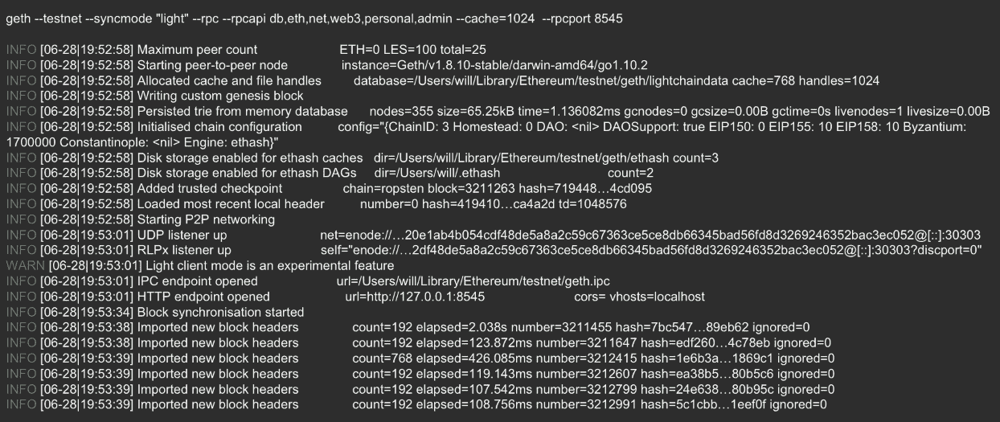

这需要一点时间来完成。我们可以通过打开另一个终端会话来跟踪其进度，在该窗口中，我们将键入以下命令:

```
$ geth attach http://127.0.0.1:8545
```

运行这个命令会将我们带入一个 JavaScript 控制台，在这里我们可以与这个客户端进行交互，如下面的屏幕截图所示:


然后，我们将执行以下命令:

```
web3.eth.syncing
```

我们将得到类似于下面的截图:

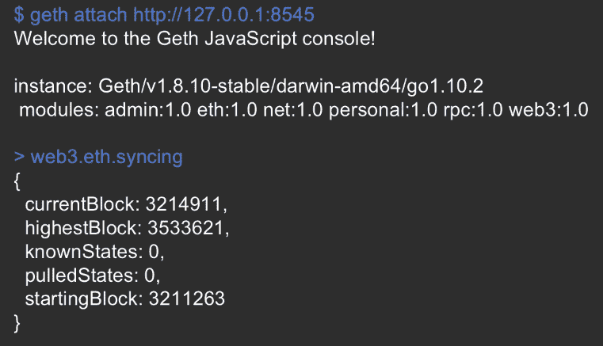

在这里，我们可以看到当前下载的块是 3，214，911，而网络上最高的块是 3，533，621。这意味着我还有大约 300，000 块需要下载，这将需要几分钟的时间。

至此，我们已经为 Truffle 配置了部署到 Ropsten 网络的能力。我们已经安装并启动了 Geth，作为 Ropsten 网络上的客户端，并且给了它同步的时间。现在，我们想将我们的可靠性合同部署到 Ropsten 网络，但这将产生一个交易，而交易需要花费汽油，现在我们没有钱花。那是因为我们的以太网在我们本地的 Ganache 网络上，而现在我们使用的是 Ropsten 网络。那是完全不同的网络，所以你在一个网络中拥有的任何以太都不同于你在另一个网络中拥有的以太。不过我们可以解决这个问题，而且这样做的方便性是我选择部署在 Ropsten 网络上的原因之一。那么，让我们跳到下一节，我们将看到如何获得以太网以用于 Ropsten 网络。

# 获得用于测试网络的乙醚

现在我们准备将我们的合同部署到 Ropsten 网络，但是我们没有任何以太网，所以让我们修复它。

让我们回到浏览器，在 MetaMask 中，您可能连接到您的专用网络，因此单击下拉菜单，切换到 Ropsten 网络，如下所示:


然后，打开浏览器标签，进入[水龙头. ropsten.be](http://faucet.ropsten.be) 。这叫水龙头，就像廉价旅馆里漏水的浴室水龙头一样，这个漏水。

但是，这个水龙头不是每隔几秒钟就漏水，而是漏乙醚。水龙头自动填充你的以太坊地址从 MetaMask 到文本框那里，点击发送给我测试以太网按钮将提交你的地址到水龙头，它会发送给你一个以太网。以下屏幕截图显示了水龙头窗口:

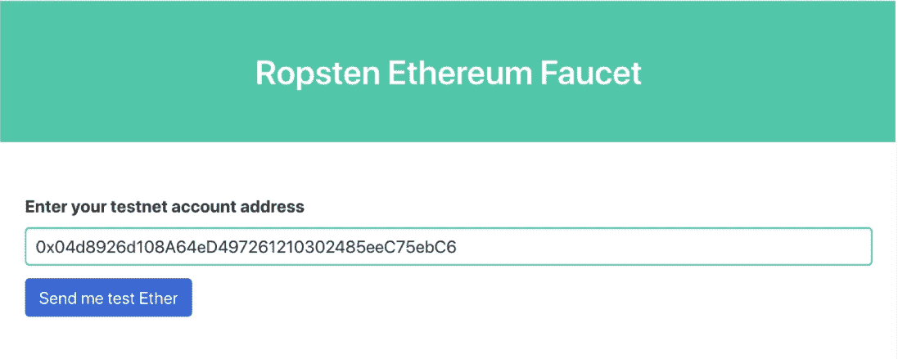

这里要知道的一件事是，水龙头每 30 秒才滴一滴乙醚，所以如果你面前有一个请求队列，可能需要几分钟乙醚才会出现在你的帐户中。您应该继续检查，因为它会出现，当它出现时，您现在有一些零用钱，可以让您支付将您的合同部署到 Ropsten 网络的交易。

所以，我们现在有一些乙醚，我们想用松露来部署我们的合同。而且，我们已经让 Geth 作为我们的以太坊客户端运行，所以 Geth 需要访问我们在 Ropsten 网络上的帐户，以便它可以支付该交易。

为此，我们将单击 MetaMask 上的 Details 按钮，然后导出我们的私钥:


在这里，我们将单击“导出私钥”按钮，它会提示您键入密码，这将显示私钥。您应该将私钥复制到一个文件中，以便于访问。

我们现在将运行以下命令:

```
web3.eth.accounts
```

这会产生以下输出:

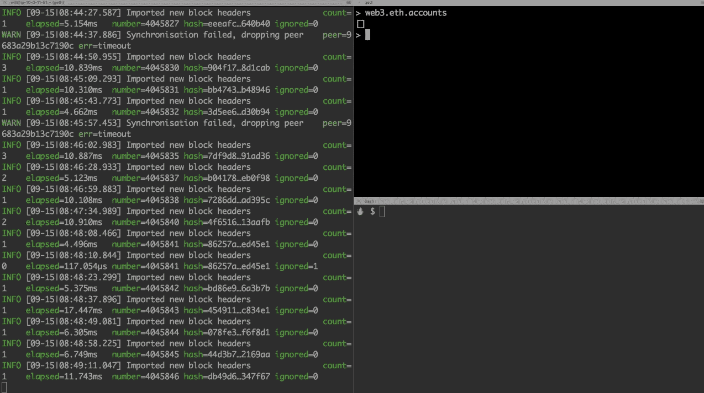

您可以看到 Geth 中目前没有列出任何帐户。因此，在新的终端窗口中，我们将导航到包含私钥的文本文件所在的代码目录，并在那里运行以下命令:

```
$ geth account import private.txt --keystore `/Library/Ethereum/testnet/keystore/
```

这会产生以下输出:


注意:前面的命令是针对 OSX 的，如果您使用的是 Windows 或 Linux，请使用下面的命令:

对于 Windows: `geth account import private.txt --keystore %APPDATA%\Ethereum\testnet\keystore`，和

对于 Linux: `geth account import private.txt --keystore `/.ethereum/testnet/keystore`。

如果我们看一下该地址的最后几位数字，`3eae6`，我们会发现它与元掩码中列出的帐户的最后几位数字相匹配。

因此，现在我们将返回 JavaScript Geth 控制台，再次运行 accounts 命令。这一次，我们将看到我们的帐户列在这里:


那是一个有密码保护的帐户，所以我们需要解锁它。为此，运行以下命令:

```
personal.unlockAccount(eth.accounts[0])
```

这会产生以下输出:


由于密码短语返回`true`，我们知道帐户已经成功解锁。这里重要的一步是删除私有文件，因为它包含了私有密钥，你不想把它放在任何地方。

打开`truffle.js`文件，在 Ropsten 配置中，我们将添加一个新行`from`，然后指定我们刚刚导入到 Geth 中的帐户的地址。这将告诉 Truffle 在部署该合同时使用哪个帐户。

切换回终端，我们将运行以下命令:

```
$ truffle compile
$ truffle migrate --network ropsten
```

这会产生以下输出:


它看起来就像在 Ganache 上一样，因为它成功地迁移到了网络上。

如果您想对此进行测试，此时您可以键入以下命令:

```
npm start
```

这将启动我们的 web 服务器，它将使用新部署的合同，因此我们可以对我们的神秘号码下注。以下屏幕截图显示了该网页:

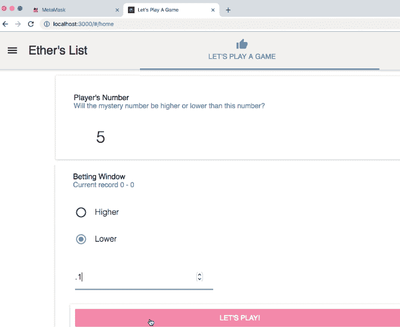

我们下注时会收到弹出通知:

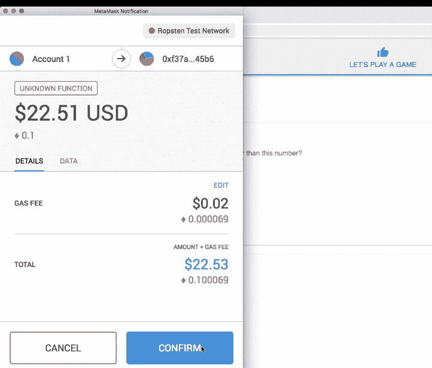

此窗口显示我们已连接到 Ropsten 测试网络，因此我们可以确认这一点，正如前面的屏幕截图所示，我们输掉了赌注，因此，我的帐户被我下注的. 1 乙醚记入借方。因此，我们已经成功地将我们的合同部署到 Ropsten 网络，并且我们能够从我们的本地 UI 与它进行交互。本章的最后一个任务是将 UI 部署到 AWS。

# 将 UI 部署到 AWS

为了向全世界发布我们的游戏，我们需要在互联网上提供用户界面。我们将使用 Docker 和 AWS 来完成这项工作。

如果你不熟悉 Docker，它是一个在操作系统级别执行虚拟化的工具，这被称为**容器化**。这意味着它将把你的代码和它需要运行的所有东西打包到一个可以在 Docker 主机上执行的容器中。我们将使用 AWS **弹性集装箱服务** ( **ECS** )作为我们的码头主机。这允许我们运行我们的容器，而不必构建或管理底层基础设施。

要构建 Docker 映像，您需要安装 Docker 版本 18 或更高版本。如果你没有，你可以从[http://docker.com](http://docker.com)下载，确保你下载的是社区版，因为那是免费版本，但是它有我们需要的一切。

为了创建我们的 Docker 映像，我们将使用一个 Docker 文件。这是一组指定应该如何构建容器的指令。我们将一步一步地剖析我们在 Docker 文件中添加的内容。

我们从定义我们的基本形象开始。使用 Docker，您可以使用另一个 Docker 图像作为您的图像的基础，允许您在其他人已经完成的工作的基础上进行构建。在我们的例子中，我们需要 Node.js，所以我们将使用一个正式的 Node.js Docker 映像。我们已经完成了在 Linux 服务器上安装和运行 Node.js 所需的所有步骤。下面的代码片段显示了我们在这里做的事情:

```
FROM node:8.11.3-stretch
```

然后，我们使用一个`COPY`命令将当前目录中的所有内容复制到名为`app`的容器中的一个文件夹中，我们将切换到那个目录。之后，我们将设置一个名为`NODE_ENV development`的环境变量。这是 Node.js 在 Node 启动时使用的。对于生产版本，您应该将它设置为`production`而不是`development`。以下代码片段说明了这一点:

```
COPY ./app
WORKDIR /app

ENV NODE_ENV development
```

接下来，我们将运行`apt-get install`，这是 Debian 命令来更新基本映像，我们安装`git-core`，这允许从他们的 GitHub repo 安装我们的一些节点依赖项。然后，我们运行`npm install`命令来安装节点应用程序的所有依赖项，如下面的代码片段所示:

```
RUN apt-get update && apt-get install -y git-core
RUN npm install
```

接下来，`EXPOSE`命令打开 Docker 容器上的 TCP 端口 3000，这允许我们在端口 3000 上连接到我们的网站。最后，我们有在容器启动时执行的命令，如下所示:

```
EXPOSE 3000

CMD ["npm", "start"]
```

因此，这相对简单，因为我们基本上只是输入我们用来设置应用程序的相同命令的 Docker 版本。所有这些都被执行并保存到我们的 Docker 映像中，当我们启动映像时，`npm start`命令被执行。

现在，我们可以使用以下命令构建 Docker 映像:

```
docker build -t gaming:latest
```

我们提供了`-t`标志来用`gaming:latest`标签标记我们的图像，结尾的尾随点告诉 Docker 在当前目录中查找我们的 Docker 文件。这将执行我们放入 Docker 文件的所有命令，并将输出存储为 Docker 映像。

构建映像的另一种方法是，如果使用可视代码，可以右键单击 Docker 文件并选择 Build Image。它将提示您输入图像名称，即`gaming:latest`，然后点击*并输入*，这将运行前面提到的相同命令。完成后，我们将登录 AWS，并选择 ECS。这将引导您进入以下页面:


这里有几个不同的部分，我们将逐一介绍。让我们从存储库开始；一种将存储库想象成一个桶的方式，用来存放您构建的 Docker 映像。我们把它们放在亚马逊或 AWS 上，这样当我们部署这项服务时，亚马逊就有办法获得这张图片:


我们将创建一个新的存储库，并以我们的应用程序`gaming`命名。创建后，它会给我们它的 URL，以及我们需要的命令:

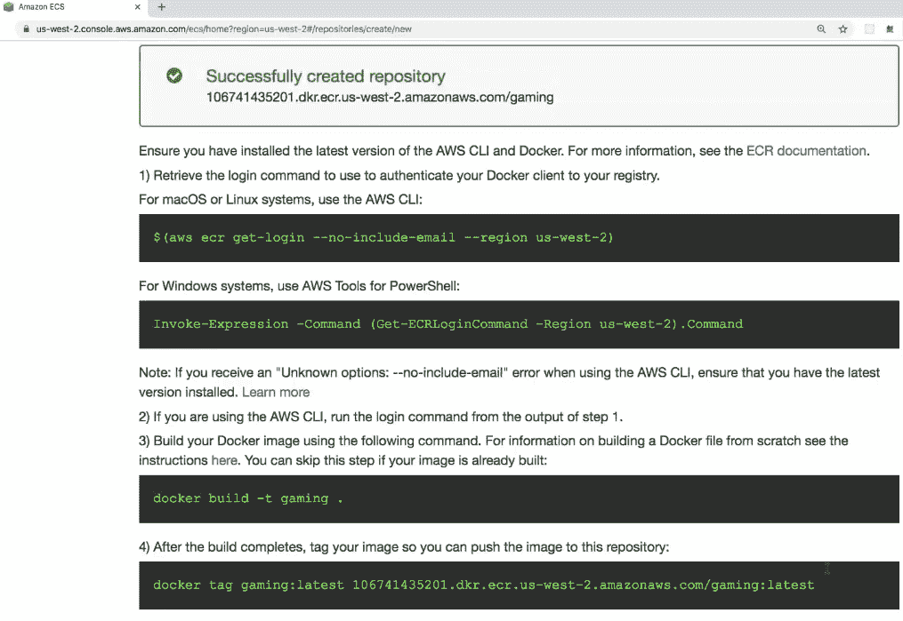

因此，我们将复制第一个命令，并将其粘贴到终端中。这将执行 ECS 控制台或 ECS 存储库的登录功能，因为除非您经过身份验证，否则您无法推送至存储库。这可以防止外界的人将他们的 Docker 图像推送到您的存储库中。

您可以看到，为了方便起见，它为我们列出了 Docker build 命令，但我们已经这样做了。因此，我们将转到下一个命令，为存储库标记图像。我们将运行它，然后获取最后一个命令，这将把我们的 Docker 映像推送到存储库。

上传该图像后，我们可以单击“完成”按钮，我们将看到我们的图像列在存储库中:


现在，我们将创建一个任务定义；任务定义是一种定义所有不同容器的方法，我们希望将这些容器作为服务的一部分来操作。为此，我们将进入 AWS 上的任务定义选项卡:

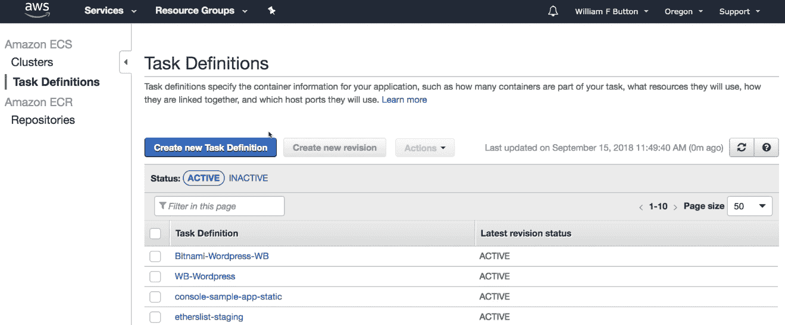

单击 Create new Task Definition，我们将任务定义命名为`gaming-staging`，然后我们需要选择一个任务角色。我已经在这里构建了一个，但是如果您还没有构建，一个基本的 ECS 任务执行规则将会起作用。下面的截图显示了这是什么样子:


在我们的 ECS 函数中，我们不需要任何特殊权限。我将为它提供 8 GB 内存和 4 个 CPU，因为这足以支持 React UI 应用程序和 Geth 客户端节点。现在，我们需要添加我们的容器:


我们的第一个容器将是我们的`gaming-ui`，这是我们构建的 React 应用程序，图像来自我们推送的 ECS 存储库。如果我们查看我们的资源库，URI 提供的资源库中有我们需要的 URL，我们会将它粘贴到图像框中。我们需要公开端口 3000，因为这是我们的应用程序运行的端口。然后，我们需要指定一个健康检查。我们将在运行状况检查窗口中使用以下命令:

```
curl http://127.0.0.1:3000 || exit 1
```

这将使用`curl`命令来检查 localhost，这将确定端口 3000 是否有响应。如果它没有响应，该命令会以值 1 退出，这样 ECS 就知道该容器不健康，它会将其拆除并替换它。

我们希望每 60 秒检查一次，有 15 秒的超时时间，在进行初始测试之前，我们会给自己 60 秒的启动时间。在失败之前，我们会给它两次通过的机会:

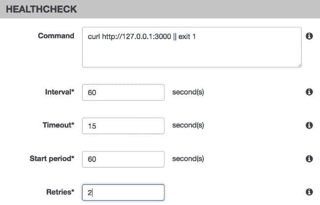

我们不需要在这个容器上设置任何东西，所以我们可以点击 Add。

然后，我们将添加第二个容器。这将是我们的`geth-client`容器。它将来自以太坊库，使用以太坊提供的`client-go`图像。对于我们的端口映射，我们在公开的端口 8545 中，对于我们的健康检查命令，我们将`echo "true"`，这将具有始终通过的最终结果。我们将做和以前一样的事情:60 秒间隔，15 秒超时，60 秒启动，2 次重试。

对于这个命令，我们唯一需要做的就是设置`--rpc`和`--testnet`标志。其他一切都是在 Docker 图像中为我们设置的。我们将点击添加，然后创建它。

现在，我们需要转到 EC2，并创建一个负载平衡器。一个负载平衡器将为我们提供一个前端接口，这样每当我们访问它的 URL 时，它将在多个 Docker 容器之间进行平衡，或者如果 Docker 映像失败，它将启动一个新的映像，并将其放在负载平衡器中，这样我们的 URL 就不会改变。

因此，单击负载平衡器，创建一个，我们将在这里使用一个应用程序负载平衡器:

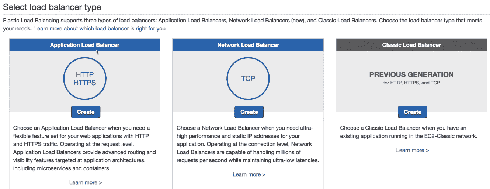

我们将其命名为与任务定义相同的名称，即`gaming-staging`。每当我们在 AWS 中查看不同的资源时，这将使我们很容易看到哪些资源是彼此相关的。它将面向互联网，并在端口 80 上使用 HTTP。我们需要设置 VPC，并在两个区域之间进行平衡，以便 AWS 之间有一些容错和冗余:

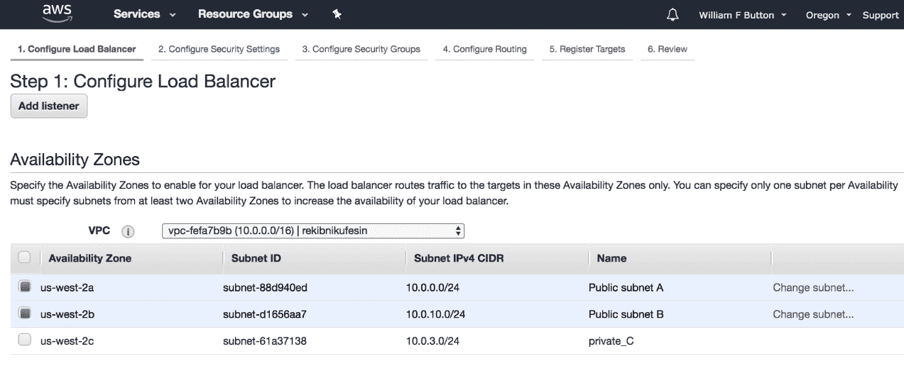

接下来，我们将它放在一个为 www 服务器公开端口的安全组中，它主要公开端口 80 和端口 443:


然后，我们将在端口 80 上创建一个目标组，目标类型为 IP 端口；这是 ECS 将放入负载平衡器的资源容器或资源池:


我们还没有任何要注册的目标，所以我们只需点击“Create ”:

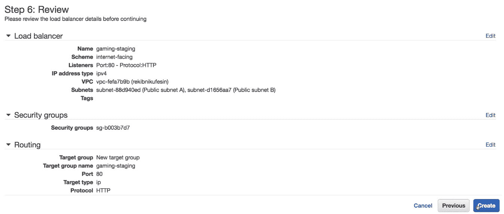

是时候返回到 ECS，创建作为我们的应用程序的实际运行组件的服务了。现在，我们将选择创建集群，创建 Fargate 集群的过程非常简单:

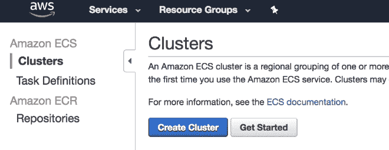

完成后，我们应该会看到类似下面的截图:

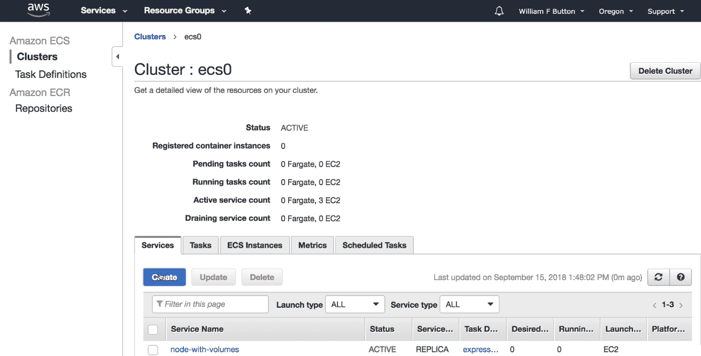

在集群内部，我们将点击 Create 来创建一个新的服务，指定 Fargate 作为启动类型，然后选择我们刚刚创建的任务定义，`gaming-staging`。我将为服务命名为我们对所有这些资源使用的相同名称，然后指定我想要 1 个任务。如果您预计会有更多的流量，或者如果您希望确保在其中一个容器出现故障时有另一个容器可以接管流量，您可以指定更多的任务:


我将指定放置负载平衡器的相同 VPC，然后，对于负载平衡器，我将选择我们刚刚构建的负载平衡器:

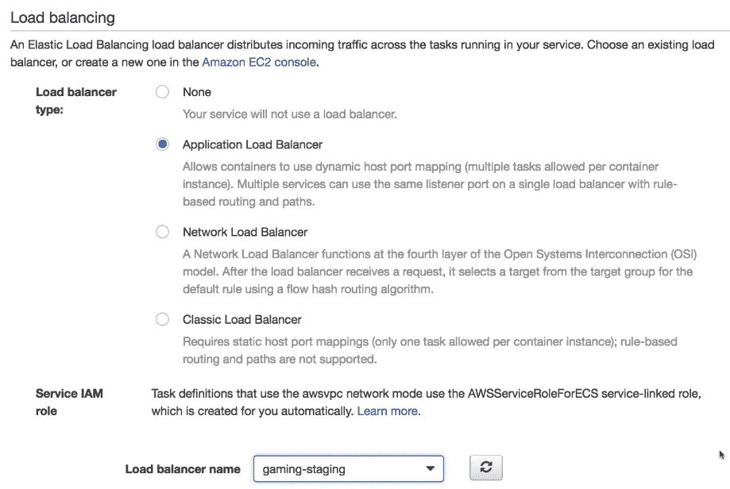

我们可以查看所有设置，然后点击创建服务:


几分钟后，我们的服务应该启动并运行。一旦它启动并运行，我们就可以切换回 EC2，转到我们的负载平衡器，选择我们创建的负载平衡器，并复制那里的 DNS 名称:

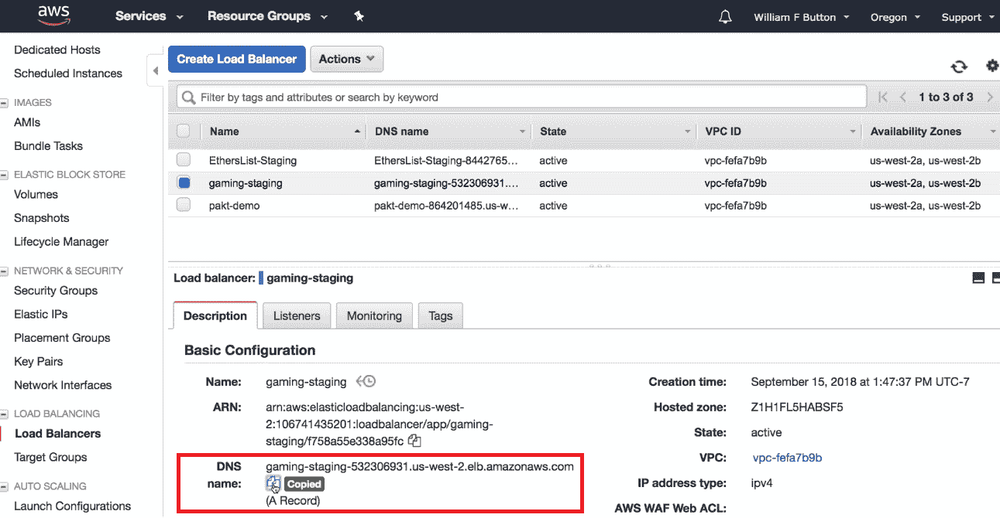

我们将把它粘贴到我们的浏览器中，就这样，我们的应用程序被加载，在 AWS 上运行我们的 UI，并使用 Ropsten 网络作为以太网。

我们还需要检查一件事，这是您最关心的事情之一。我们将回到 ECS，向您展示如何关闭它，这样您就不会继续为此付费。进入服务并选择我们创建的服务，然后点击更新并将任务数设置为 0，然后更新服务。这将关闭正在运行的容器，这样您就不会为此付费了:


使用你在本章中学到的步骤，你也可以将你的应用程序发布到以太坊主网络，让你游戏的玩家使用真正的以太。

说完这些，让我们进入今天和本书的最后一部分，也就是今天的作业。

# 分配

在本书的最后一项家庭作业中，你将使用我们在本章中学到的所有步骤在 AWS 上启动你的应用程序:

1.  你今天的第一项任务是将你的合同部署到 Ropsten 网络上。请记住，您需要先在 Ropsten 上创建一个帐户，并从水龙头中获取一些乙醚，以便支付煤气费来部署您的合同。
2.  一旦您部署了合同，您将构建 Docker 映像来包含您的用户界面，然后登录 AWS 并创建一个存储库来保存您的映像并将您的映像推送到该存储库。
3.  我希望您创建一个任务定义，定义您的应用程序如何运行。您需要为您的 UI 应用程序定义一个任务，并为您的 Geth 客户端定义一个任务。通过将它们放在同一个任务定义中，您可以确保您的 UI 应用程序始终有一个 Geth 客户端在本地运行，以便与 Robsten 网络进行通信。
4.  启动新的 ECS 服务，使您的应用程序上线。一旦它启动，给你的应用一个测试驱动。
5.  请确保您在线共享该网址，供其他人试用。如果你正在寻找一份区块链开发人员的工作，没有什么比在网上让潜在雇主看到展示你技能的东西更好的了。

# 摘要

本章标志着学习区块链以及如何使用它来创建和实现一个游戏应用程序的结束。在这一章中，我们学习了以太坊网络是如何工作的，以及如何制定与之交互的智能合约。我们学习了如何获得以太网用于测试网络。最后，我们学习了如何将我们的应用程序部署到 AWS，并让世界各地的用户试用它！

在过去的七天里，我们已经讨论了很多内容，还有很多内容需要学习，但是现在您已经掌握了自己探索更高级主题的技能。我希望你在区块链工作的时候和我一样开心，我很想看看你用在这里学到的技能做了什么！