# 区块链双因素认证

每个组织都有数百个应用程序和数据库，其员工每天都使用他们的凭据(即用户名和密码)来访问它们。具有这种有效凭证的攻击者可以绕过现有的安全解决方案，因为它们看起来像合法用户。根据 2016 年威瑞森数据泄露报告，超过 63%的成功泄露事件涉及泄露凭据。**双因素认证** ( **2FA** )为现有的基于凭证的系统保护提供了一个额外的层，作为这个急剧增长的问题的解决方案。

在本章中，我们将讨论以下主题:

*   什么是 2FA？
*   2FA 的区块链
*   工党

# 什么是 2FA？

随着几起数据泄露事件的发生，我们目睹了社交和专业网站账户被黑客攻击的数量大幅增加。有时，即使是一个简单的人为错误也会在全球范围内造成巨大的麻烦。有时，很容易根据用户的日常活动、行为甚至姓名来预测他们的密码。用户仍然倾向于使用明文密码来保护他们的账户，其中最糟糕的有`password`、`123456`和`abcde`。

2FA 是一个额外的安全层，用于确保只有合法的所有者才能访问他们的帐户。在这种方法中，用户将首先输入用户名和密码的组合，而不是直接进入他们的帐户，用户将被要求提供其他信息。这另一条信息可以以下列方式之一的形式出现:

*   **用户知道的东西**:这可能是诸如密码、秘密问题的答案之类的信息，或者可能是**个人识别号** ( **PIN** )。
*   **用户拥有的东西**:这种方法包括基于卡细节的第二级认证，通过智能手机、其他硬件或软件令牌。
*   **用户身份**:这是在第二步中验证用户的最有效方法之一，这是通过击键动力学和鼠标行为等生物特征数据来完成的。

# 用户认证的发展

一些组织一直在努力寻找更好的方法来实现更有效、更可靠的认证系统。从互联网的诞生到公共云和混合云的扩展，身份认证因素一直在齐头并进。选择支持可靠身份认证解决方案的解决方案非常重要。组织确保系统是经得起未来考验的和可互操作的。下图解释了认证系统如何从**单因素认证** ( **SFA** )发展到**多因素认证** ( **MFA** )系统:

*   **SFA** :它基于用户预先共享的 PIN 或密码信息，或者最有可能是安全问题。然而，这有时会受到干扰，因为如果用户不经常访问应用程序，用户可能会忘记这个预先共享的信息。
*   **2FA** :这是为了克服用户根据自己所知忘记预先分享信息的倾向。有智能手机、门禁卡、或**一次性密码** ( **OTP** )验证等方式。在这个因素中，身份验证的第二步本质上是动态的，用户不必与应用程序的所有者共享任何东西。这也避免了帐户因凭据被盗而受损的风险。
*   **MFA** :它有多种方法在第二层认证用户，如语音生物识别、面部识别、手形、基于视觉的方法、指纹扫描、地理定位、热成像识别等等。然而，本章仅限于探索 2FA。

下图显示了身份验证的演变:

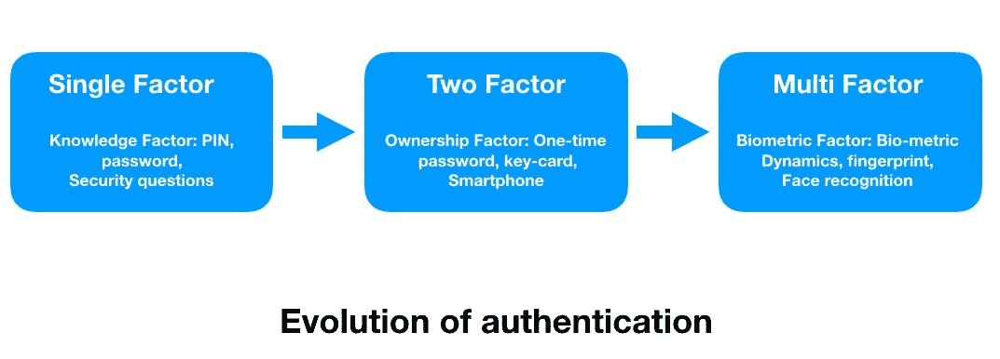

# 为什么是 2FA？

2FA 有助于最终用户和企业安全，使用它有以下几个好处:

*   **更好的安全性**:通过集成第二级认证，基于 SMS 的 OTP 降低了攻击者冒充合法用户的风险。这降低了帐户被盗和数据泄露的风险。即使黑客从暗网获得了用户的凭证，他们也不会拥有完全认证所需的第二条信息。
*   **生产力提高**:移动 2FA 帮助全球企业无缝使用第二级身份认证。员工可以从任何设备或位置安全地访问公司应用程序、文档和第三方系统，而无需共享任何机密信息。
*   **欺诈减少，信任增加**:大多数欺诈受害者都避免去某些零售商那里，即使该商家对数据泄露没有责任。2FA 与用户建立了更大的信任层，同时也减少了商家网站上的欺诈企图。

# 它是如何工作的？

2FA 可以以两种模式部署，一种是**基于云的解决方案**，另一种是**本地解决方案**。我们将了解这两种解决方案，并了解哪一种更适合哪种部署:

*   **基于云的解决方案**:这被电子商务、网上银行和其他在线服务相关的网络应用大量使用。请看下图:

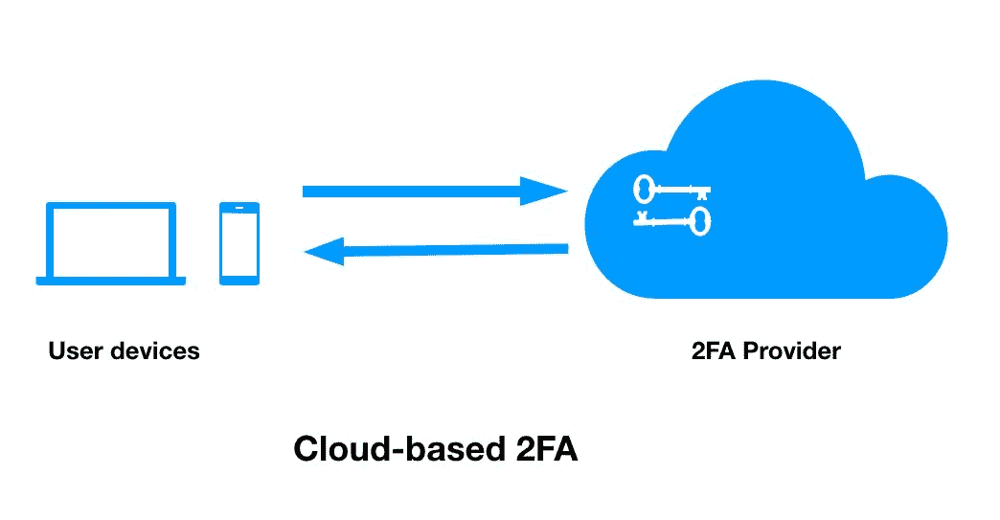

*   **本地解决方案**:组织对基于云的安全解决方案犹豫不决，倾向于使用本地解决方案，员工在访问 web 应用程序时输入用户名和密码。现在，这些信息进入内部 VPN 集成器，它处理凭证并在组织和第三方 2FA 提供商之间交换密钥。第三方 2FA 提供商将生成动态口令，并通过短信或移动应用程序与员工分享。这种模式有助于实现组织的隐私，因为它不必与第三方 2FA 提供商共享凭据。请看下图:


# 挑战

在 2FA 中，第一级身份验证是用户名和密码的组合，但是对于第二级身份验证，这条信息是由中央存储库提供的。这个中央存储库负责存储对用户进行身份验证所需的所有信息。尽管 2FA 通过第二层身份验证提高了安全级别，但它仍然存在缺点，即集中式数据库存储了一系列秘密用户信息。中央数据库可能会被有针对性的威胁篡改或破坏，这可能会导致大量数据泄露。

# 2FA 的区块链

区块链被誉为最具革命性和颠覆性的技术之一。区块链一直在扰乱基于网络安全解决方案的中情局安全三合一原则。2FA 几年来一直是安全措施的关键；然而，攻击者有时会设法破坏这些系统。我们将了解区块链如何改造 2FA 系统以实现改进的安全方法。

# 区块链如何改变 2FA？

从设计上来说，区块链是一种分散的技术，它允许多个参与者之间进行任何类型的价值交易，而无需第三方的参与。通过利用区块链，我们可以确保这些敏感信息永远不会保留在一个数据库中；但是，它可以位于具有不变性且不能被修改或删除的区块链节点中。下图显示了总部位于区块链的 2FA。

在这种情况下，用户设备将由第三方 2FA 提供商通过区块链网络进行认证。区块链网络中的每一方将安全地保存端点信息，并将激活 2FA 系统来生成二级口令。

这可以通过第三方 API 调用部署在公共域甚至私有网络中:

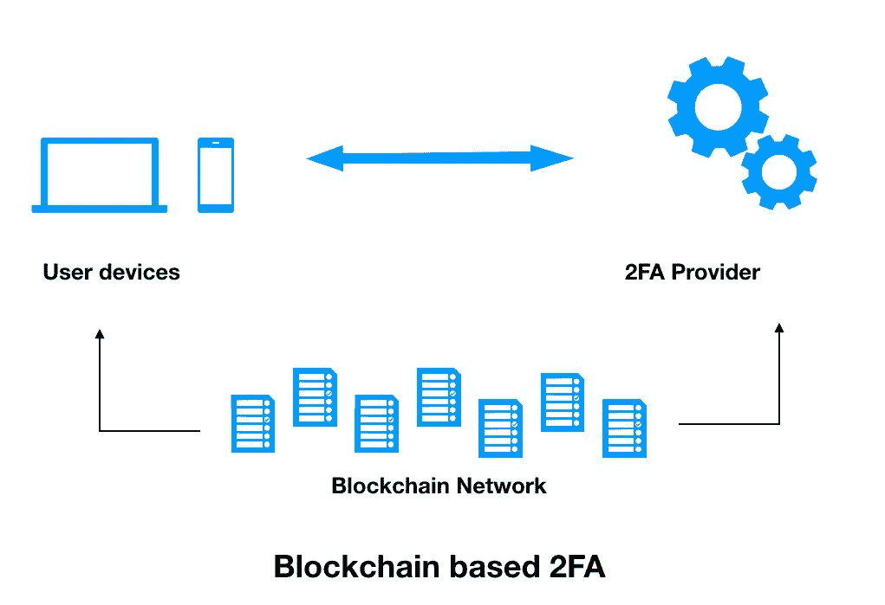

# 解决方案架构

作为最新的技术，区块链仍处于测试阶段，与几个组织。在这一章中，我们将使用以太坊区块链来开启 2FA 系统。以太坊允许使用智能合约对应用程序进行编程。在下图中，描述了用户、web 应用程序和基于以太坊的存储库之间的基本流程:

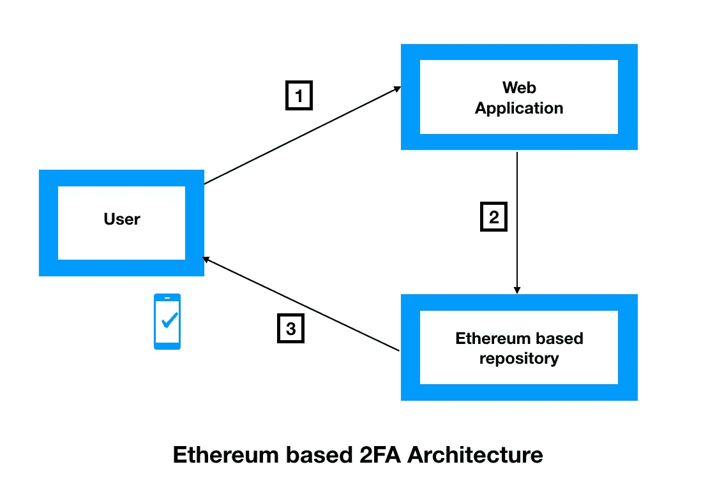

用户访问网络门户并输入第一级证书。一个 web 应用程序将与基于以太坊的存储库通信，以生成 OTP 并与用户共享。最后，用户输入同一个 OTP 并获得对 web 应用程序的访问权。让我们通过下图更深入地了解以太坊区块链:

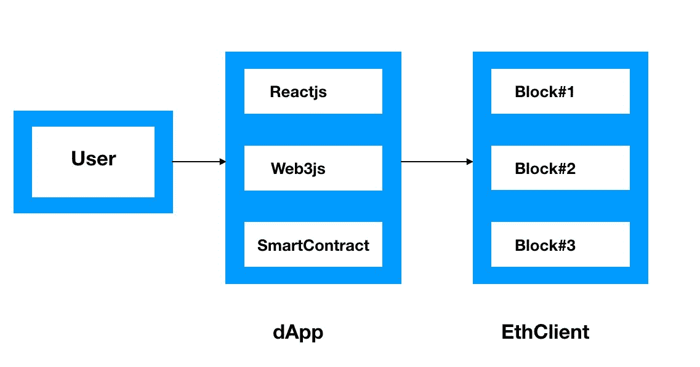

# 工党

为了启动整个项目，我们必须部署这个项目的子组件。来源摘自 GitHub，可在以下链接中找到:[https://github.com/hoxxep/Ethereum-2FA.](https://github.com/hoxxep/Ethereum-2FA)

其中包含以下文件:

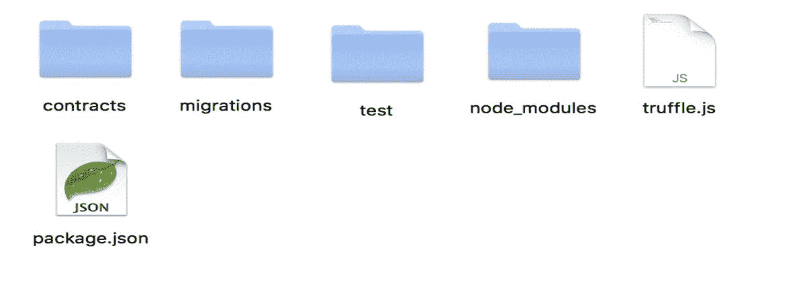

前面截图中的文件解释如下:

*   `contracts`:这个文件夹包括我们的智能合约，`TwoFactorAuth.sol`。
*   `migrations`:该文件夹包含将合同部署到区块链的迁移文件。
*   `test`:该文件夹由`server.js`组成，负责我们合同中的事件认证。
*   这个文件夹包含了所有的库。
*   `truffle.js`:该配置文件由一组连接到区块链的配置组成。
*   这是我们指定项目配置的地方，比如名称和脚本。

# 成分

以下是该项目的三个核心组件，如下图所示:

*   区块链网络(我们将通过 Ganache CLI 开发)
*   智能合同
*   与区块链通信的服务器

请看下图:

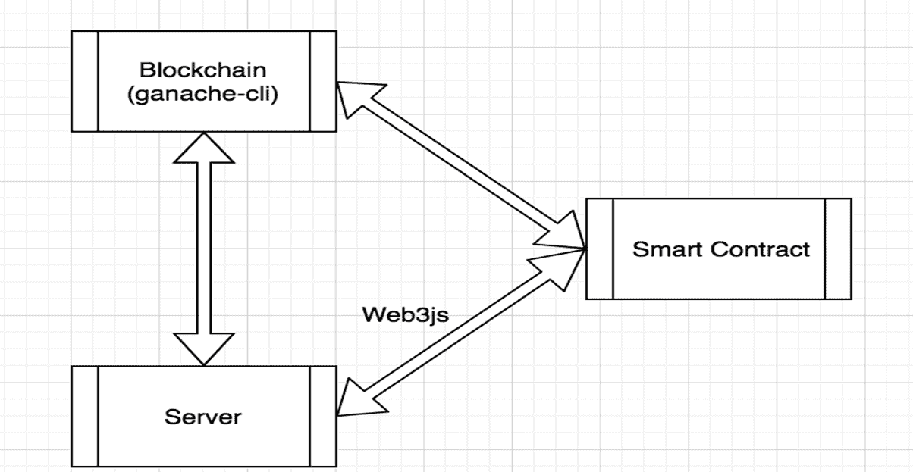

# 准备

在我们开始配置任何其他参数之前，开发区块链网络是非常重要的。首先，让我们从在一个叫做`testrpc`的本地以太坊上开发我们的**去中心化应用** ( **dApps** )开始。在我们的例子中，我们使用的是 Ganache CLI，它使用 EthereumJS 来模拟完整的客户端行为，使 Ethereum 开发更加容易和安全。它还包括所有众所周知的 RPC 函数和特性。

# 安装 Node.js

我们将首先在本地系统上安装 Node.js 包。代码可以从以下链接下载:[https://nodejs.org/uk/download/package-manager/#arch-linux](https://nodejs.org/uk/download/package-manager/#arch-linux)。

# 打开以太坊

打开以太坊的步骤如下:

1.  首先，我们需要在我们的系统上安装`ganache-cli`:

```
>  npm install -g ganache-cli
```

2.  接下来，使用以下命令运行整个套件:

```
> ganache-cli
```

在前面提到的命令执行之后，我们将获得 10 个默认帐户和 10 个默认私钥。现在我们将有一个本地以太坊，`testrpc`，运行在`http://localhost:8545`上，正如你在下面的截图中看到的:

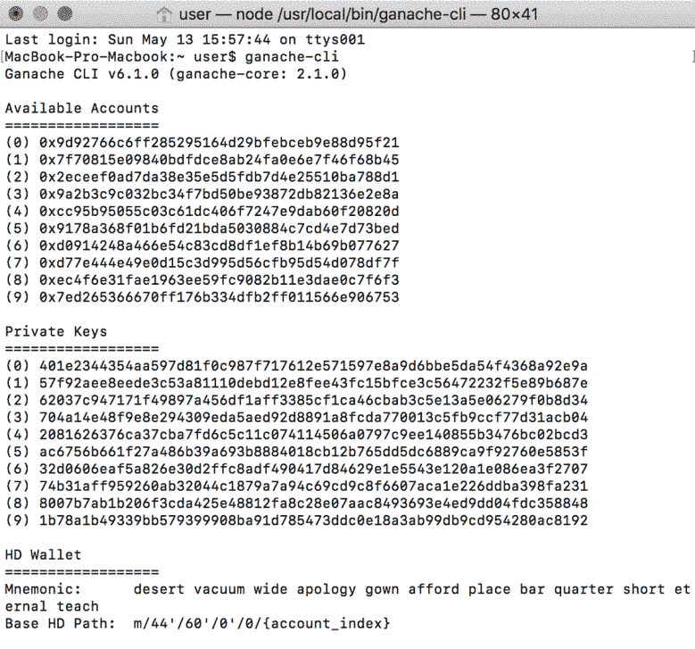

# 打开智能合同

我们现在将使用以下命令运行`server.js`:

```
Macbook-Air: Ethereum-2FA_user$ truffle_test ./test/server.js
```

执行前面的命令后，我们将看到下面的屏幕，其中也显示了 2FA 的网址:

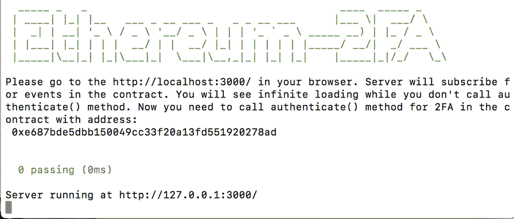

现在让我们打开 Google Chrome 并访问端口`3000`上的本地主机，就像前面截图中提到的那样。看一下下面的截图:

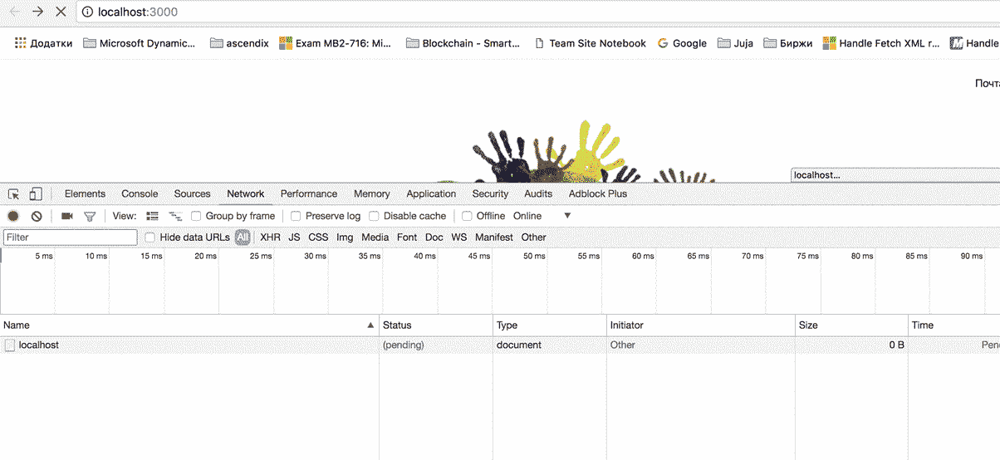

# 测试和验证

测试和验证通过以下步骤完成:

1.  **调用认证函数**:我们需要在以太坊 IDE 上运行智能合约代码，通过 https://remix.ethereum.org 的[可以访问。以下过程将实体代码添加到混音中:](https://remix.ethereum.org)

我们需要调用`authenticate()`函数对合同进行认证，如下面的截图所示:

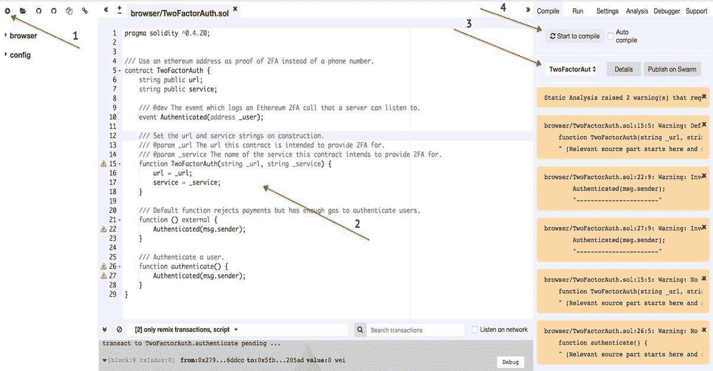

2.  **验证认证**:在这一步，我们需要验证认证是否有效。为此，请按照下列步骤操作:


3.  **成功认证**:我们的服务器订阅了合同，当我们调用`authenticate()`方法时，服务器从区块链读取并返回一个成功认证:


# 摘要

在本章中，您了解了 2FA 为何是最重要的安全措施之一。然而，中央存储库可能面临被复杂的网络攻击破坏的风险。我们研究了区块链如何帮助在多个节点之间分散数据库，并减少成为数据泄露受害者的机会。以太坊智能合约是实现 2FA 系统的一个真正伟大的组件，它提供了对整个系统进行编程的灵活性。

# 问题

我们有关于理解 2FA、类型和认证方法的主题，以及演示如何使用以太坊创建 2FA 基础设施的实验。有些问题值得探究，例如:

1.  我们也可以用以太坊实现 MFA 吗？如果可以，如何实现？
2.  如何将基于短信的 2FA 与以太坊智能合约融合？

# 进一步阅读

要了解更多关于 NIST *多因素认证(MFA)* 指南的信息，请访问以下链接[https://www . NIST . gov/ITL/TIG/back-basics-multi-factor-authentic ation](https://www.nist.gov/itl/tig/back-basics-multi-factor-authentication)。