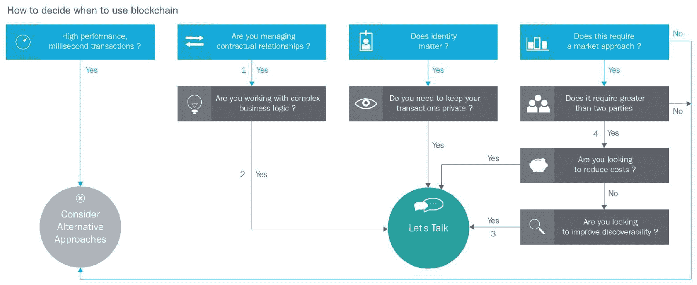
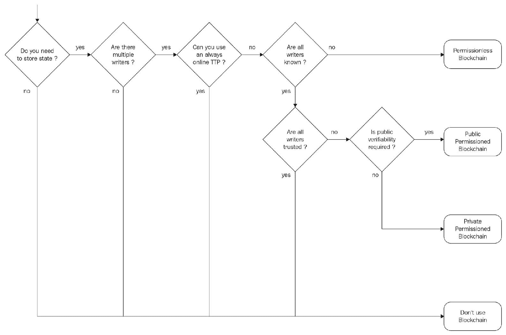
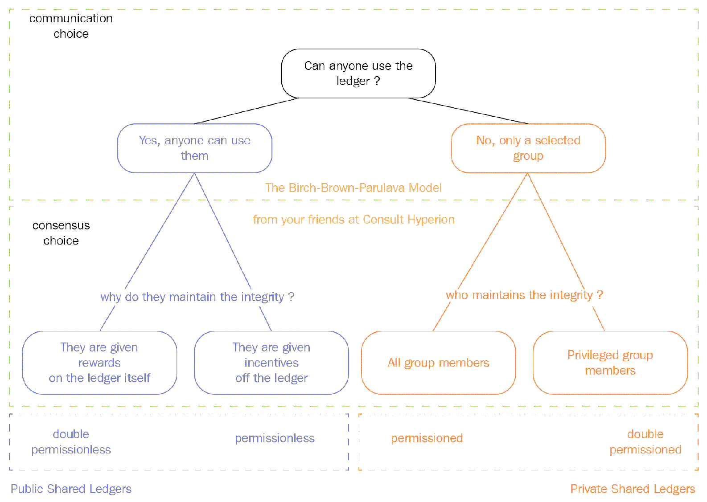

# 关于区块链和网络安全的事实

区块链技术是创新的，它使用一种结合了计算算法和数据结构的独特方法来解决几个部门长期存在的问题。区块链技术还在不断涌现，对各种机构来说都是新鲜事物。然而，真正的问题不仅仅在于知道技术；更重要的是知道是否值得用区块链技术解决现有的问题。

让我们看看区块链有意义的不同情况。

我们将在本章中讨论以下主题:

*   区块链的决策路径
*   领导者的清单
*   与区块链的挑战
*   区块链的网络安全未来

# 区块链的决策路径

就像每次新技术更新一样，领导者和管理机构在批准技术升级提案之前，必须遵循某些预定义的程序。决策路径是在得出结论之前必须遵循的一系列行动的流程。让我们了解一下区块链技术的一些流行决策途径:

*   IBM model :这是关于帮助决策者知道何时使用区块链。它还会带你去区块链的市场。这是一个简化的布局，展示了在什么条件下区块链集成非常适合您的组织。IBM Hyperledger Fabric 旨在为行业提供私有区块链解决方案，如下图所示:

*   Karl Wust 和 Arthur Gervais 模型:该模型主要是决定哪种区块链风味最适合您的业务需求。这是 2017 年 5 月开发的，旨在构建确定业务问题解决方案的方法，如供应链管理、银行间和国际支付网关以及分散的自治组织。请参见下图:

写入者基本上是指对区块链分类帐具有写入权限的各方，他们还参与共识机制来创建块并将其添加到分类帐中。

*   **Birch-Brown-Parulava 模型**:同样，这是一个很棒的模型，是专门为制定合适的区块链选择方法而开发的。流程的上下文更多的是关于确定各方对完整性的需求。如果正直必须由一个选定的团体来维护，那么私人区块链是一个更好的选择。然而，如果是关于激励或奖励，那么公共区块链是一个更好的选择。请参见下图:

# 什么时候应该使用区块链？

区块链可用于以下场景:

*   **冲突情况**:区块链网络不仅连接可信方，也连接不可信方。因此，关注冲突情况并无缝解决它们是至关重要的。区块链利用共识算法来确认交易和准备区块。不同的区块链使用不同的共识模型，如****Work**(**PoW**)**Proof-stage**(**PoS**)等等，但目的是一样的，那就是避免冲突，执行成功的交易。**
***   **共享公共数据库**:如果组织在员工(管理员或非 IT 人员)、承包商或第三方之间共享一个公共数据库，那么**许可的区块链**确实可以满足需求。当不同方共享一个集中式数据库时，会增加权限提升带来的访问控制漏洞的风险。当使用许可的区块链时，它确保只有提交对等方有权对数据库进行更改，而任何预先选择的参与者都可以进行事务签署。*   **交易的业务规则需求**:如果业务模型要求你有一个简单或复杂的逻辑策略来执行任何交易，区块链可以通过其逻辑策略提供很大的保证，比如以太坊的智能合约或 Hyperledger 的 chaincode。业务策略将始终在节点软件中定义，它将强制节点按照定义的规则工作。*   **系统透明的需求**:如果一个组织的业务模式要求它必须对整个供应链的客户或供应商透明，分布式账本技术可以更好地发挥作用，提供供应链运作和管理系统的端到端可见性。在无许可的区块链网络中，每个节点都被允许读写区块链总账，因此也变得透明。然而，企业总是更偏向于允许的环境，其中只有预先选择的节点参与区块链计算过程和分类帐管理。*   **对数据不变性的需求**:如果一个组织需要开发一个高度安全的仅附加数据库，加密哈希和数字签名可以帮助我们建立一个高度安全的分类账。在准备每个数据块的过程中，它采用前一个数据块的散列，因此一旦创建了数据库，就不可能修改或重新安排它。**

 **# 什么时候不应该使用区块链？

尽管区块链是该行业有史以来最强大的技术，但它并不总是适合所有工作的工具。这使得评估阶段在各个方面都非常关键。了解了最适合的地方之后，让我们看看区块链不适合的一些情况:

*   **存储大量数据**:由于其分布式和分散性，整个数据库存储在区块链网络的每个节点上(在许可分类账的情况下，只有预先选择的参与者可以被允许读取和存储数据，因此，复制数据库需要很长时间，可能会导致速度变慢)。有一些解决方案就是为实现这一目的而构建的；让我们快速浏览一下它们。
*   **如果交易规则变化频繁**:如果设置并发起智能合约策略，不会改变执行路径。不建议业务流程和运营频繁变化的组织使用基于区块链的应用程序。区块链网络中的每个子系统和子流程都必须是确定的。
*   **如果区块链必须从外部来源获取数据**:区块链智能合约不是为了从外部来源获取信息而构建的。即使它被配置为在区块链和可信数据库之间进行通信，它也将作为常规数据库操作来操作。此外，在这种情况下，区块链智能合约不会从外部数据库中提取条目；相反，可信数据库必须将数据推送到区块链。

# 领导者的清单

区块链正在创造一些伟大的技术和商业机会，它正在促进组织的协作。组织领导目前正处于感知和识别区块链技术在业务运营中的使用案例的阶段，以便能够跟上不断变化的市场需求。让我们把注意力集中在你去区块链计划的重要问题上:

*   在我所在的区块链科技行业，谁是最值得信任的领导者？
*   我的竞争对手对区块链有什么看法？
*   哪些业务部门最有可能被打乱？
*   谁会受到我们在区块链部署的最大影响，他们可能会有什么反应？
*   区块链可能的商业案例是什么？我们如何实现更好的可持续商业模式？
*   部署中涉及的总体成本因素是什么？
*   当前的规则和法规对区块链申请有什么影响？
*   我们如何与监管机构实现双赢，向市场推出区块链应用？
*   我们如何对我们的区块链应用程序应用安全控制？

在向市场推出区块链应用程序之前，预计会有一系列的集思广益，但是建议准备好项目的范围并确定合适的堆栈持有人。

# 与区块链的挑战

虽然区块链对资产交换有很大的影响，并降低了金融机构的运营成本，这是常有的事，但炒作造成了模糊的结构，并分散了对潜在业务解决方案和用例的注意力。现在，重要的是了解一些需要特别关注的挑战，以便我们能够通过基于区块链的应用程序实现可持续的业务模式。这些挑战如下:

*   **技术专业知识**:根据 2017 年全球数字智商调查，大约 86%的财务高管表示，他们的组织没有开发出所需的区块链技能。缺乏区块链在全球市场的专业知识，导致对其潜在业务用例及几种实施方法的关注较少。虽然区块链从根本上说是一种变革性的技术，但打开区块链后端系统的方法仍然是使用编程语言，如 Node.js、JavaScript 和一些新开发的语言，如 Go 和 Solidity。然而，仅靠程序员不足以启动系统。拥有了解业务流程和核心要素的区块链顾问来确定区块链申请流程至关重要。
*   **合规**:欧盟**通用数据保护条例** ( **GDPR** )于 2018 年 5 月 25 日生效，不仅改变了在欧洲运营的企业的战略，也改变了全球各地的企业(那些在欧洲地区拥有客户群的企业)。GDPR 推出了这一概念，这与区块链的基本面完全相反。GDPR 下的组织必须对其所有数据库进行**创建、读取、更新、删除** ( **CRUD** )操作；然而，区块链数据库不允许用户或管理员更新或删除数据库中的任何条目。其次，GDPR 声明个人信息不应离开欧盟，而公共区块链的一个主要问题是分布式模型不允许您将数据存储限制在特定的节点或节点组。
*   互操作性(inter operability):转变技术适应本质上应该是渐进和无缝的，为了实现这一点，区块链应该能够与传统平台进行交互。最初，区块链很难处理现有系统的所有功能；因此，必须对现有系统进行大量修改，以促进逐步过渡。
*   存储:从属性上来说，区块链是一个只会追加的数据库，它会不断增长。区块链通常存储文件或媒体的文本或元数据，即使我们试图存储所有的实际数据，区块链的属性之一也将是一个障碍，也就是分布式网络。它的默认特性是确保所有节点的同一数据库的可用性，这对于大规模数据来说可能是一个障碍。有几个创业公司正在研究这个问题，以克服区块链的基本挑战。
*   **能耗**:根据 Digiconomist 的数据，比特币目前的能耗约为 61.4 TWh，相当于美国耗电量的 1.5%。以太坊，随着 PoS 共识模型，正在克服严重的能源消耗问题，并实现绿色经济。

# 区块链的网络安全未来

网络安全是最多样化的行业之一，在这个行业中，企业几乎每隔一天就会目睹一种新的威胁。尽管网络安全的未来对全球领导者来说始终是一项不可预测的任务，但准备评估可能的威胁和潜在的安全创新以保持客户和利益相关方的一致信任至关重要。

块构建算法和散列法的结合使区块链成为网络安全产品组合中的一个很好的解决方案，当在分布式网络中处理任何种类的价值交易时，它可以增强数据的安全性。区块链正在以多种方式改变网络安全解决方案。在云计算和其他一些数字发展之后，很明显，组织应该使用数百个应用程序(内部的和基于云的)来满足一些业务需求。这也提高了最终用户和组织的数据泄露水平。

根据 2017 年新的**泄露级别指标** ( **BLI** )，超过 25 亿条数据记录被泄露。因此，预计在即将到来的数字时代，舒适和灵活性将被隐私和安全所取代。正如已经清楚表明的那样，区块链完全是为了提供机密信息的数据安全性和隐私性，而区块链很可能会吸引一些商业应用程序来提供更好的安全性和隐私性。

# 摘要

在本章中，我们讲述了一些关于区块链和网络安全的重要事实。我们认识到在选择区块链技术之前充分关注决策过程的重要性。网络安全将永远是攻击者和防御者之间永无止境的竞赛。防御者不断测试和部署创新武器很重要，因为攻击者永远不会停止。

# 问题

在成功报道了区块链和网络安全的一些关键事实后，读者可能会有以下问题:

1.  有哪些区块链趋势决策路径？
2.  克服上述区块链挑战有哪些困难，多久能解决？

# 进一步阅读

要了解更多关于卡尔·伍斯特和阿瑟·热尔韦决策路径模型的信息，请访问 https://eprint.iacr.org/2017/375.pdf 的链接。**