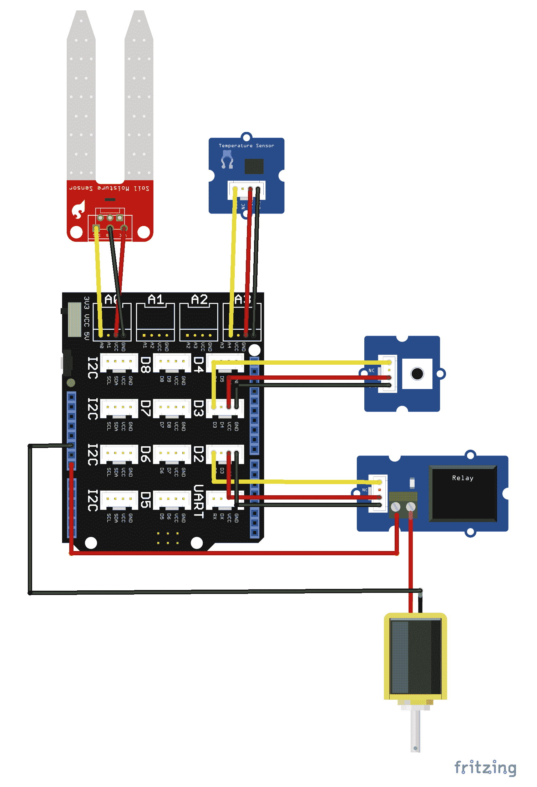
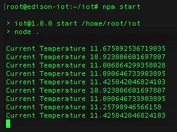
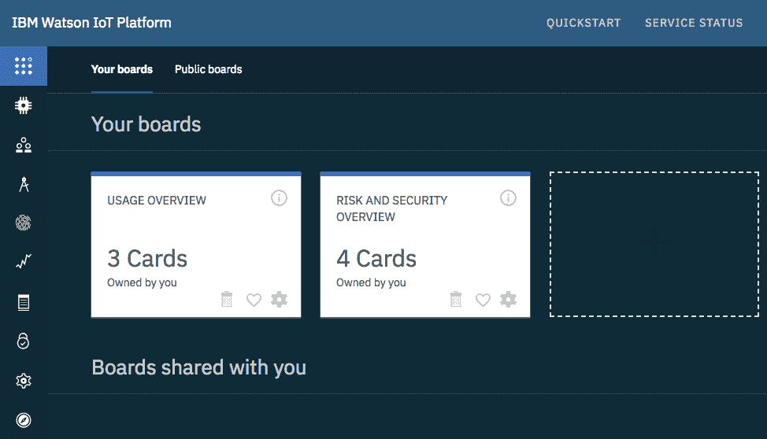
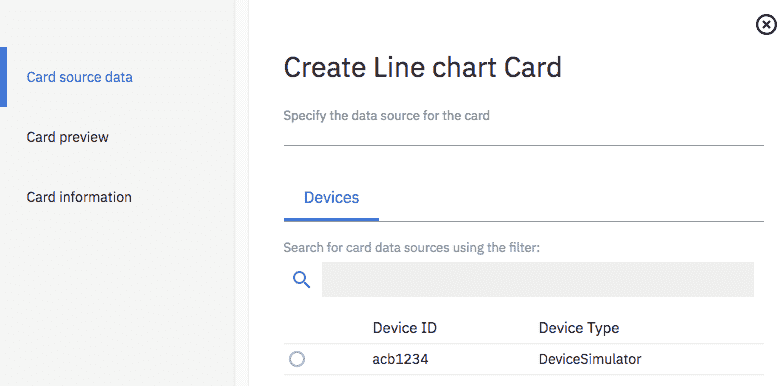
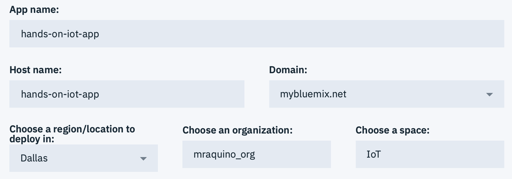

# 创建您的首个物联网解决方案

在前一章中，我们探索了**物联网** ( **物联网**)以及 IBM Watson 物联网平台。我们还创建了第一个简单的解决方案。在本章中，我们将通过创建一个简单的端到端解决方案来实践这一点，从选择设备到创建设备固件和一个用于控制简单花园浇水系统的应用程序。

本章将涵盖以下主题:

*   了解如何设置解决方案
*   创建连接的设备
*   创建一个连接到平台的简单应用程序
*   发布和处理设备事件
*   将操作发布到设备
*   当你遇到困难时如何寻求帮助

# 技术要求

完整的解决方案代码在`ch2`文件夹中，可从[https://github . com/packt publishing/Hands-On-IoT-Solutions-with-block chain . git](https://github.com/PacktPublishing/Hands-On-IoT-Solutions-with-Blockchain.git)资源库获得。

确保您还安装了 Cloud Foundry CLI 和 Bluemix CLI 这些命令行界面的安装过程在[https://console.bluemix.net/docs/cli/index.html#overview](https://console.bluemix.net/docs/cli/index.html#overview)中描述。

# 首个物联网解决方案——园艺解决方案

浇水系统是 DIY 社区中使用物联网的常见第一个项目。我们也将使用它作为在 IBM Watson 物联网平台上开始的示例项目。

# 需求概述

好的解决方案基于对人们真正重要的问题。因此，让我们从介绍实际问题开始我们的解决方案:

约翰独自住在城里的一套公寓里。他是一个商人，一周要出差 3-4 天。当不旅行或工作时，约翰喜欢照顾他的植物。然而，由于他有半个星期不在家，约翰正在努力保持他的花园健康美丽。

约翰在使用自动浇水系统时遇到了几个具有挑战性的经历:要么系统没有给植物浇足够的水(例如，在炎热或干燥的日子里)，要么在天气好的时候浇得太多。

约翰正在寻找一种解决方案，只有当植物达到一定的土壤湿度条件时，或者当他觉得有必要时，才给他的花园浇水。

# 解决方案概述

下图概述了为解决 John 的问题而开发的解决方案组件:


一个连接的设备将连接到 John 的工厂，并定期从工厂和环境(土壤湿度和温度)中检索测量结果，并将事件发布到 IBM Watson 物联网平台。该设备还将订阅触发命令(动作)。

部署到 IBM Cloud (Bluemix)的应用程序将订阅 John 的事件，每当达到配置的最低土壤湿度水平或高温阈值时，应用程序将发送一个动作命令，在一定时间内给植物浇水。

# 选择设备

根据上一节描述的要求，需要创建的设备必须具备以下功能:

*   能够测量土壤的湿度水平(模拟探头非常适合这种解决方案)
*   具有双向通信能力(以便用户可以在任何他认为必要的时候给花园浇水)
*   能够配置土壤的水分限制(一个可配置的规则)

以下关于解决方案的假设也是正确的:

*   用户将提供

*   将提供无线网络连接

由于我们是在创建实际器件之前进行原型制作，因此有许多原型制作平台可以使快速连接和测试解决方案变得更加容易。为此，我们将使用最强大的模块化平台之一:英特尔 Edison 和 Grove。

我们将寻找具有 Wi-Fi 连接和模拟传感器连接的设备(或组合)。我们还需要一个土壤湿度模拟传感器探头，一个温度和湿度传感器，以及一个水电磁阀。

因此，该解决方案将需要一个部件列表，如下所示:

| **数量** | **组件** |
| one | 英特尔爱迪生模块 |
| one | 英特尔 Edison Arduino 分线板 |
| one | Grove base shield v2 |
| one | 格罗夫土壤湿度传感器 |
| one | 凹槽温度传感器 1.2 版 |
| one | Grove 继电器模块 |
| one | Grove 按钮模块 |
| four | Grove 通用 4 针电缆 |
| one | 12V 水电磁阀 |
| one | 12V 2A 电源 |
| 2 | 跳线电缆(公对公) |

下图概述了零件列表中指定的零件。请注意，设备的形状和颜色仅用于说明目的，可能会因供应商、版本或其他特征而有所不同:


该图像是用 Fritzing 创建的，并在 CC BY-SA 3.0 下获得许可；参见 https://creativecommons.org/licenses/by-sa/3.0/

让我们快速回顾一下列表中的零件。

# 英特尔爱迪生

Edison 是一款**片上系统** ( **SoC** )，基于英特尔 x86 架构，内置蓝牙 4.0 和专为物联网应用设计的 Wi-Fi。Edison 运行一个名为 Yocto 的 Linux 发行版；已支持多种平台，如 Python、Node.js、C、c++；并且拥有使用 Arduino IDE、Eclipse 和英特尔 XDK 开发解决方案的插件。

# Arduino 分线板

用于 Edison 的 Arduino 分线板也是由英特尔发布的，它提供了与 Arduino 模块相同的标准引脚接口，并与 Arduino shields 兼容。由于您可以使用标准 Arduino IDE、兼容库、连接器和屏蔽，英特尔 Edison Arduino 分线板是原型制作和运行 Arduino 草图的绝佳界面。

# 格罗夫系统

Grove 是一组组件和屏蔽，它创建了一个标准化的模块化平台，为 Seeed 创建的原型解决方案提供了构建块。有许多可用的原型，包括互联网上可用的 Grove 平台的工作代码，特别是在**DIY**(**DIY**)社区网站上。

Grove 系统为市场上大量采用的平台提供了屏蔽，如 Arduino、Raspberry Pi 和 BeagleBone。可以在互联网上找到计算模块、基座屏蔽、Grove 模块和备件的捆绑包。

请注意，并非每个传感器都与每个平台兼容，因为有些平台缺乏某些功能。例如，Raspberry Pi 不提供模拟接口，因此可通过模拟接口连接的传感器将无法与之兼容。

让我们来看看我们将在该物联网解决方案中使用的所有 Grove 组件。

# Arduino 的 Grove 基座护罩

在这个项目中，我们将为 Arduino 使用 Grove base shield，它为 Grove 标准连接器提供一个接口，将 Grove 模块连接到 Arduino 引脚接口。它提供四个模拟接口、四个 I2C 接口、七个数字接口和一个 UART 接口。

# Grove 传感器

在这个项目中，我们将使用两种不同类型的传感器:土壤湿度传感器和温度传感器。

土壤湿度传感器是一个模拟探头，提供土壤电阻测量，我们将在本章后面解释。传感器的温度基于热敏电阻，其规格和计算也将在*测量环境温度*章节*中详述。*

两个传感器都使用标准 Grove 连接器电缆，提供`VCC`、`GND`和与探头的数据连接。

# Grove 按钮

该按钮遵循与传感器相同的到计算模块的连接，但是根据按钮是否被按下，提供开路或闭路状态。

它可以有不同的解释:要么是当按钮被按下时连接中断，意味着除非按钮被按下，否则它将继续做某事；或者当按钮被按下时连接被激活，这意味着只有在按钮被按下后它才会做一些事情。

# 格罗夫继电器

正如所料，继电器模块连接到标准 Grove 接口，但它被归类为执行器，因为它不提供读数。

led、显示器、电机驱动器和蜂鸣器等其他致动器模块用于执行操作，而不是读取状态。继电器模块也有两种状态，开路或闭路，这意味着继电器的输入连接没有连接到输出。

我们对零件的检查到此结束。让我们进入解决方案开发流程的下一步。

# 设备接线

为了组装硬件，我们需要将传感器探头正确连接到处理单元，在本例中为 Intel Edison 模块。

Grove 模块使连接非常简单，如以下步骤所示:

1.  使用 Grove 通用电缆:
    *   将 Grove 湿度传感器连接到基座护罩中的`A0`连接插孔
    *   将凹槽温度传感器连接到基座护罩中的`A3`连接插孔
    *   将 Grove 继电器模块连接到基座护罩中的`D2`连接插孔
    *   将凹槽按钮模块连接到基座护罩中的`D3`连接插孔

2.  使用跳线:
    *   将电磁阀的`V+`端连接到外部 12V 电源
    *   将外部`GND`销连接到基座护罩中的`GND`销上
    *   将继电器连接到`GND`引脚上
    *   将电磁阀`GND`端子连接到另一个继电器模块连接上

下图显示了正确的连接:



图像是用 Fritzing 创建的，它是在 CC BY-SA 3.0 https://creativecommons.org/licenses/by-sa/3.0/下授权的

# 设备固件编码

接下来，我们将创建一个设备应用程序(固件),用于读取传感器数据并将其发送到后台应用程序。在前一章中，我们使用 Node.js 从设备模拟器发布事件，现在我们将使用这个方法来利用前一章的代码。请记住，这种解决方案的目的是在温度高或土壤湿度太低时给植物浇水。

下一节展示了创建固件所需的代码，该固件读取所有传感器数据并将事件发布到 IBM Watson 物联网平台。

# 测量土壤湿度

本项目中使用的传感器探头是一个电阻式传感器，用于测量通过传感器探头的电流。它有两个物理上分开的探针；一个探针连接到正极末端，另一个连接到`GND`末端。当两个探针通过一个公共表面连接时，它将测量通过该表面的电流，并给出读数。

在我们的例子中，当探针接触土壤时，它将测量通过的电流。当土壤变湿时，它变得更加导电，这意味着更多的电流将通过探针。

Arduino 分线板中的英特尔 Edison ADC(模数)转换器具有 12 位分辨率，但通过软件限制为 10 位分辨率。如果我们以此作为我们测量的基础，我们将得到对读数的如下理解:

2 <sup>10</sup> = 1024

这意味着我们的读数将是一个从 0 到 1，023 的值，其中 0 表示完全没有水，1，023 表示 100%有水。这将因土壤中存在的其他杂质而异，如矿物质。然而，在这种情况下，我们将假设土壤被完美地测量。当它完全干燥时，它会给我们一个 0%的测量值，如果它是一杯水，没有任何土壤，它会给我们一个 100%的读数。

以下代码将每两秒钟读取一次土壤湿度传感器:

```
var mraa = require('mraa');
var pin0 = new mraa.Aio(0);
var getSoilMoisture = function() {
  var sensorReading = pin0.read();
  return sensorReading;
};
setInterval(function() {
  console.log("Current Moisture " + getSoilMoisture());
},2000);
```

要运行代码，在 Edison 的 SSH 控制台中键入`npm start`。

出于测试目的，让我们看看打印到控制台的传感器测量读数，并对这些值有一些了解:


我们已经知道，0 表示 0%水，1，023 是 100，这意味着程序中的样本测量读数如下:


将读数应用于前面的公式会将它们转换为百分比值，如下所示:

| **读数** | **水分百分比** |
| 25 six | 25.02% |
| 30 seven | 30.00% |
| 30 2 | 29.52% |
| 30 three | 29.61% |
| 29 nine | 29.22% |
| 29 eight | 29.13% |

# 测量环境温度

与前面的代码块类似(但数学上稍微复杂一些)，温度传感器返回传感器的模拟读数。

如果我们看一下制造商关于如何读取传感器的解释([http://wiki.seeedstudio.com/Grove-Temperature_Sensor_V1.2/](http://wiki.seeedstudio.com/Grove-Temperature_Sensor_V1.2/)),我们会发现传感器的 1.2 版配有一个阻值为 4250 的热敏电阻和一个 100k 的电阻。

因此，使用该传感器计算温度值的公式如下:


以下代码将根据每两秒钟的传感器读数给出温度:

```
var mraa = require('mraa');
var pin3 = new mraa.Aio(3);
var RESISTOR = 100000;
var THERMISTOR = 4250;
var getTemperature = function() {
  var sensorReading = pin3.read();
  var R = 1023 / sensorReading - 1;
  R = RESISTOR * R;
  var temperature = 1 / (Math.log(R/RESISTOR)/THERMISTOR+1/298.15)-273.15;
  return temperature;
};
setInterval(function() {
  console.log("Current Temperature " + getTemperature());
},2000);
```

这段代码的输出如下所示:



使用 SSH 控制台，这些读数将被记录下来。

# 打开继电器

最后但同样重要的是，由于我们想要打开一个让水流动的继电器，然后再将其关闭，因此一秒钟后打开水，两秒钟后关闭水的代码如下:

```
var mraa = require('mraa');
var pinD2 = new mraa.Gpio(2);
pinD2.dir(mraa.DIR_OUT);
setTimeout(function() {
  pinD2.write(1);
  setTimeout(function() {
    pinD2.write(0);
  },2000);
},1000);
```

延迟一秒钟后，您将看到`D3`继电器模块 LED 亮起，并且您还会听到一声咔嗒声。这意味着继电器连接是关闭的，两秒钟后它将关闭并打开连接。

# 发布事件

在本章的这一点上，我们已经探索了能够读取土壤湿度和温度的 Node.js 脚本，并且我们还研究了能够打开和关闭让水流向植物的继电器的代码。

现在的目标是将这两个值发布到 IBM Watson 物联网平台。

如前一章所示，有必要创建一个设备并记录凭证，以便我们可以使用它们将设备连接到平台。以下代码执行事件的常规发布:

```
var iotf = require("ibmiotf");
var mraa = require('mraa');
var config = require("./device.json");
var deviceClient = new iotf.IotfDevice(config);
var temperatureSensor = new mraa.Aio(3);
var moistureSensor = new mraa.Aio(0);
var RESISTOR = 100000;
var THERMISTOR = 4250;
var getTemperature = function() {
 var sensorReading = temperatureSensor.read();
 var R = 1023 / sensorReading - 1;
 R = RESISTOR * R;
 var temperature = 1 / (Math.log(R/RESISTOR)/THERMISTOR+1/298.15)-273.15;
 return temperature;
};
var getSoilMoisture = function() {
 var sensorReading = moistureSensor.read();
 return sensorReading;
};
deviceClient.connect();
deviceClient.on('connect', function(){
console.log("connected");
setInterval(function function_name () {
deviceClient.publish('status', 'json', '{ "temperature": ' + getTemperature() +', "soilMoisture": ' + getSoilMoisture() + '}', 2);
},300000);
});
```

当脚本启动时，它们将从`device.json`文件加载配置，连接到 IBM Watson 物联网平台，然后每五分钟发布一次当前土壤湿度和温度的事件。

# 监控事件

查看设备发布的数据的最简单方法是使用电路板和卡。如果在创建卡时保持设备脚本运行，它将从设备发布的数据结构中获取值。

1.  要创建卡，请访问 IBM Watson 物联网平台控制台，并在左侧菜单中选择电路板:



2.  在页面的右上角，选择+创建新电路板，填写所需信息，然后创建电路板。大多数必须提供的信息都是杂七杂八的，但是要确保它对目标用户有意义。这里创建的板应该显示工厂监控的读数:


板是一组相关的卡，卡是一组由设备发布到平台的相关值。

3.  选择已创建的电路板，并通过选择+添加新卡来创建卡。

4.  选择折线图设备可视化和创建的设备:


5.  选择折线图卡片后，您需要为事件选择一个数据源。选择创建作为此卡数据源的设备。顾名思义，数据源是将从设备收集的指标填充到图表中的信息来源:



6.  选择数据源后，有必要选择将绘制在图表上的指标。如果设备已经向 IBM Watson 物联网平台发布了一些事件，则可以选择度量名称。另一方面，如果设备代码以前从未运行过，您将需要提供指标名称。建议(不要求)在创建图表之前，至少测试一下设备代码以避免错误。

7.  在正在开发的解决方案中，我们希望该卡将两个指标绘制在折线图中并进行跟踪。添加每个指标及其相应的单位以及最大和最小可能值。对于土壤湿度，我们使用百分比，因此最小和最大值`0`和`100`的单位应为`%`:


8.  对于以摄氏度(°C)测量的温度，最小和最大可能值为`0`和`100`:


9.  选择您想要显示的卡片的大小，给卡片命名，然后创建它。现在，您将能够可视化发布的数据:


可以验证工厂设备发送的测量值，绘制在时间线上。也可以改变图表的时间框架。

# 订阅操作

在为设备发布事件之后，是时候定义需要由设备处理的动作了。在我们的例子中，该解决方案的用户 John 希望能够在检测到定义的土壤湿度阈值时、在温度达到可配置值时，或者在他触发事件为植物浇水时，为他的植物浇水。

水流由电磁阀控制，电磁阀由继电器模块打开和关闭。下面的代码是上一个代码的更新，包括对 water-the-plant 操作的订阅，该操作将打开阀门一分钟。

1.  起点是导入所有的包依赖项，用预定义的值定义`RESISTOR`和`THERMISTOR`常量，并从`device.json`加载配置:

```
var iotf = require("ibmiotf");
var mraa = require('mraa');
var config = require("./device.json");
var deviceClient = new iotf.IotfDevice(config);
var temperatureSensor = new mraa.Aio(3);
var moistureSensor = new mraa.Aio(0);
var relayControl = new mraa.Gpio(2);
var RESISTOR = 100000;
var THERMISTOR = 4250;
```

2.  然后，创建辅助函数，将传感器读数转换成可用的值。以下函数负责从实际设备中检索传感器值，并将其转换为人类可理解的值:

```
var getTemperature = function() {
  var sensorReading = temperatureSensor.read();
  var R = 1023 / sensorReading - 1;
  R = RESISTOR * R;
  var temperature = 1 / (Math.log(R/RESISTOR)/THERMISTOR+1/298.15)-273.15;
  return temperature;
};
var getSoilMoisture = function() {
  var sensorReading = moistureSensor.read();
  return sensorReading;
};
```

3.  下一步是创建一个助手函数来激活电磁阀，等待请求的时间量(`secondsToWater`变量的值)，然后关闭阀门，以便停止供水:

```
var waterPlant = function(secondsToWater) {
  relayControl.write(1);
  setTimeout(function() {
    pinD2.write(0);
  },secondsToWater * 1000);
```

4.  连接到 IBM Watson 物联网平台，创建一个发布功能，每五分钟向平台发布一次事件:

```
deviceClient.connect();
deviceClient.on('connect', function(){
  console.log("connected");
  setInterval(function function_name () {
    deviceClient.publish('status', 'json', '{ "temperature": ' + getTemperature() +', "soilMoisture": ' + getSoilMoisture() + '}', 2);
  },300000);
});
```

5.  并创建一个订阅`water`事件的函数，触发`waterPlant`函数:

```
deviceClient.on("command", function (commandName,format,payload,topic) {
  if(commandName === "water") {
    var commandPayload = JSON.parse(payload.toString());
    console.log("Watering the plant for " + commandPayload.duration + " seconds.");
    waterPlant(commandPayload.duration);
  } else {
    console.log("Command not supported.. " + commandName);
  }
});
```

我们的设备固件编码到此结束，这样它就可以执行我们的用户 John 所期望的操作。

# 创建后端应用程序

设备固件安装完成后，现在是时候专注于开发处理设备事件和发送命令的应用程序了，这样 John 的植物就可以在他不在家时得到灌溉。

应用程序的代码将在 IBM 云平台(Bluemix)上运行。由于这只是一个示例应用程序，我们将使用环境变量来存储参数(温度和土壤湿度阈值)。

# 在 IBM 云平台中创建云铸造应用程序

1.  要在 IBM Cloud 中创建一个应用程序，请访问[https://console.bluemix.net](https://console.bluemix.net)，选择创建资源选项，并在左侧菜单中选择 Cloud Foundry Apps，然后选择 Node.js 的 SDK。



2.  应用程序创建完成后，在左侧菜单中选择连接，并创建到物联网服务的连接:


3.  创建到 IBM Watson IoT 平台组织的连接后，在左侧菜单中选择环境变量后面的运行时选项。在屏幕底部，添加两个用户定义的变量，值为`300`的`MINIMUM_MOISTURE`和值为`50`的`MAXIMUM_TEMPERATURE`:


与我们在上一章中使用 JSON 文件存储配置不同，现在唯一需要的配置是在`VCAP_SERVICES`和环境变量中。这些变量可以使用默认的库包从代码中访问，Node.js 中有加速器用于访问 Cloud Foundry 环境相关的设施，例如在下一节介绍的代码中使用的`cfenv`模块。

# 上传代码

因为我们将应用程序部署到 Cloud Foundry 环境，所以知道 Cloud Foundry 容器期望有一个由容器发布的 HTTP 端口是很重要的，所以即使我们没有使用容器来公开 HTTP 资源，我们也将启动一个 Express JS 服务器。

以下代码处理从设备接收的事件，并在满足任何条件时发布操作。

1.  同样，代码的入口点是加载模块依赖项，并从 Cloud Foundry 环境变量中收集所需的配置:

```
var express = require("express");
var cfenv = require("cfenv");
var Client = require("ibmiotf");
var minimumMoisture = parseInt(process.env.MINIMUM_MOISTURE);
var maximumTemperature = parseInt(process.env.MAXIMUM_TEMPERATURE);
```

2.  然后，从 Cloud Foundry 环境加载配置数据，并生成连接配置数据:

```
var app = express();
var appEnv = cfenv.getAppEnv();
var iotConfig = appEnv.getService("Internet of Things Platform-mf");
var appClientConfig = {
  "org": iotConfig.credentials.org,
  "id": "hands-on-iot-app",
  "auth-key": iotConfig.credentials.apiKey,
  "auth-token": iotConfig.credentials.apiToken
}
```

3.  下一步是连接到 IBM Watson 物联网平台并订阅目标设备事件:

```
var appClient = new Client.IotfApplication(appClientConfig);
appClient.connect();
appClient.on("connect", function () {
  appClient.subscribeToDeviceEvents();
});
appClient.on("deviceEvent", function (deviceType, deviceId, eventType, format, payload) {
  var deviceData = JSON.parse(payload);
```

4.  每当从订阅接收到事件时，应用程序会检查设备报告的温度是否较高，或者土壤湿度是否低于定义的阈值。如果是，则具有以秒为单位的指定持续时间的水事件被发布到设备，从而供水阀被激活:

```
  if(deviceData.temperature > maximumTemperature ||
deviceData.soilMoisture < minimumMoisture ) {
    console.log("Device, please water the plant for 60 seconds");
    var actionData= { duration : 60 };
    actionData = JSON.stringify(actionData);
    appClient.publishDeviceCommand(deviceType, deviceId, "water", "json", actionData);
  }
});
```

5.  最后，启动 Express 服务器，以便 Cloud Foundry 环境启动并监控 IBM Cloud SDK for Node.js 容器:

```
var port = process.env.PORT;
app.listen(port, function() {
 console.log("App listening!");
});
```

要部署应用程序，打开`manifest.yml`文件并更改应用程序的`name`属性。然后打开命令行终端，切换到应用基础目录(`manifest.yml`所在的位置)，使用`bluemix` CLI 部署应用:

```
bluemix login

bluemix target -o <your_cloud_foundry_organization_name> -s <space_where_your_app_will_be_deployed>

bluemix cf push
```


获得成功部署消息后，使用`bluemix` CLI 检查应用程序日志:

```
bluemix cf logs <your_application_name> 
```

该命令将从 Cloud Foundry 应用程序中检索并显示日志文件，如下所示。为了确保您可以检索这些日志，请确保所有应用程序跟踪都被发送到`stdout`和`stderr`:


来自 Cloud Foundry 应用程序的日志文件

查看设备日志，您可以看到，只要满足任何条件，他们就会收到一个给植物浇水的操作请求:


此时，您已经有了一个连接的物联网应用程序和设备，并在 IBM 云环境中正常工作。

# 摘要

在本章中，我们开发了一个在支持 Node.js 的真实设备上运行的解决方案。我们还使用了低级别的 mraa 库，它与设备 GPIO(通用 IO)交互，读取模拟传感器(温度和土壤湿度传感器)，并使用数字引脚来开关继电器。这看起来非常简单，但大多数设备都有传感器和执行器，这可能会改变它们的使用方式。然而，它们本质上遵循相同的概念。

我们在 IBM Watson 物联网平台中创建了一个仪表板，有助于查看实时数据设备发布的内容。我们还在 IBM Cloud Platform (Bluemix)中创建了一个应用程序，并将支持服务(IBM Watson IoT Platform organization)附加到该应用程序，以便利用配置数据连接到服务，并使用 Bluemix 命令行界面部署应用程序。

接下来的章节将介绍区块链作为一个互联业务平台，并解释其价值和常见的使用案例，其中它增加了业务链的价值。

# 进一步阅读

使用 IBM Watson 物联网平台完成解决方案所需的大部分资源可以在以下链接的官方文档中找到:[https://console . bluemix . net/docs/services/IoT/index . html # gettingstartedtemplate](https://console.bluemix.net/docs/services/IoT/index.html#gettingstartedtemplate)。使用 IBM Watson IoT 的社区也发布了许多食谱，这些可以在 developerWorks Recipes 网站上获得，网址是:[https://developer . IBM . com/Recipes/tutorials/category/internet-of-things-IoT/](https://developer.ibm.com/recipes/tutorials/category/internet-of-things-iot/)。

了解如何将项目上传到 GitHub 存储库，以及如何创建交付管道来自动构建、测试和部署应用程序(每当有新的变更被推送到存储库时),也非常有帮助。这样做不在本书的讨论范围之内，但是这仍然是一个很好的实践。

有关 Grove 系统平台、模块、捆绑包和组件规格的更多信息可在制造商网站上找到:[http://wiki.seeedstudio.com/Grove/](http://wiki.seeedstudio.com/Grove/)。