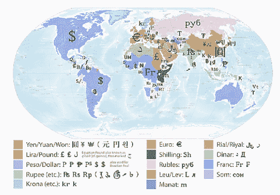
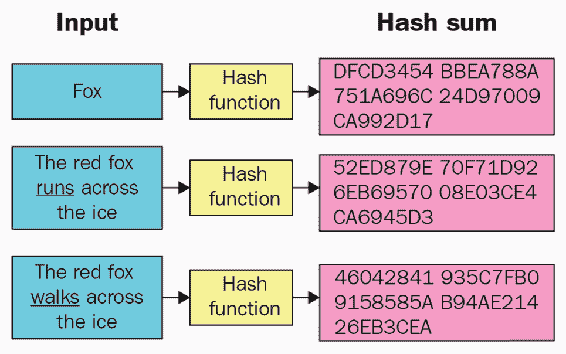
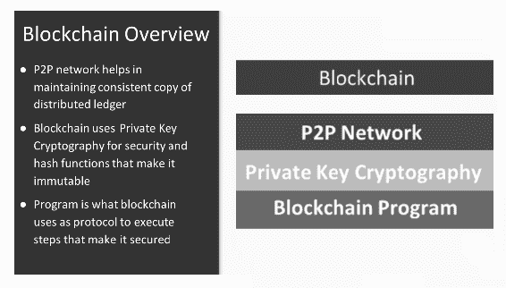
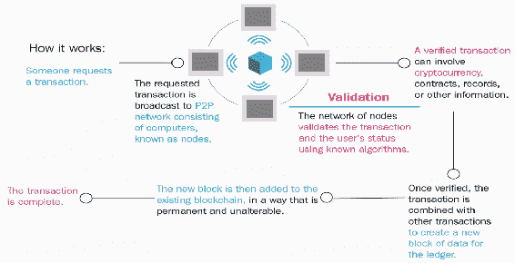
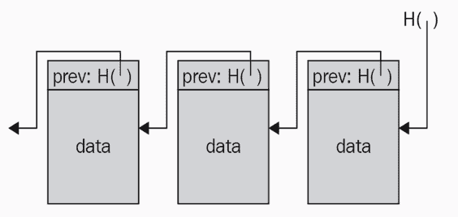
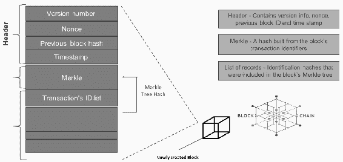

# 区块链和比特币简介

在本章中，我们将逐步了解“比特币”和“区块链”的原理，以及它们的各种功能和特点。比特币和区块链这两个流行语与席卷全球的新兴技术有关。随着本章的深入，我们将详细介绍这些独特技术的基础知识。本章还将带您了解加密技术的本质，以及加密货币如何利用这项创新作为基础。我们还将了解比特币的历史、可用的替代加密货币和各种比特币钱包，并了解比特币块头的结构。当谈到区块链，我们将通过不同类型的区块链，区块链结构，其各种工作和特点，所面临的挑战，各种平台可用于区块链，等等。

在本章中，我们将探讨以下主题:

*   密码学和加密货币
*   比特币的历史和介绍
*   区块链简介
*   比较私立、公立和财团区块链

# 密码学和加密货币简介

区块链技术是加密货币的支柱，它使用密码术来保持数据安全。在本章的这一节，我们将讨论加密技术、加密货币以及如何在加密货币实施中使用加密技术。我们还将研究法定货币加密的工作原理，加密货币的能量使用，以及所使用的加密技术的安全特性。我们将学习我们需要知道的关于去中心化数字货币及其底层架构的一切。

当我们浏览本节的各个部分时，我们将了解比特币的历史、其替代货币、比特币基础知识以及比特币的技术操作；然后，我们将浏览区块链的技术基础、密码学的基础以及它如何保证数据安全。从那里，我们将继续了解区块链，它的特点，每个比特币的底层架构，以及加密货币是如何实现的。

# 法定货币的运行和安全

在了解加密货币之前，我们先来看看全球使用的一些基本货币。这些货币也被称为法定货币。

它们显示在下图中:

法定货币的一些特征如下:

*   这些是由各国政府拥有的
*   它们通过银行或法律实体集中控制
*   它们是通货膨胀，意味着货币的价值下降
*   它们包括各种安全属性以防止伪造和欺骗，但是伪造它们也不是不可能的

由于伪造货币并非不可能，执法部门开始阻止和起诉那些参与伪造法定货币的人。我们现在来看看在法定货币中实现的各种安全功能，如下图所示:

你会发现两个水印。您还会看到正在实施的微型字体和识别标记。大多数时候，荧光墨水被用在纸币上，用于检测假钞。

# 了解加密货币及其用途

加密货币是一个非常有趣和耐人寻味的话题，已经成为一种全球现象。它不同于世界上所有的货币。从加密货币的工作，到谁拥有或控制它，它的好处和局限性，它的使用等等，都是基于新的想法和流程。现在让我们来简单了解一下加密货币的各种特性。

加密货币的主要特征如下:

*   它是一种用作交易媒介的数字资产
*   它通过使用**密码术**来保护交易和控制供应
*   它是**种替代货币**的子集
*   2008 年，第一种去中心化的加密货币 T1 被概念化
*   加密货币是**数字货币**，而能够在个人之间移动数字硬币或资产的底层技术被称为**区块链**

# 散列函数

加密货币中使用的主要加密技术是哈希函数和数字签名。

让我们简单地看一下每一个。哈希函数是一个数学函数，具有以下属性:

*   我们提供的任何输入，无论是字符串、数字、浮点数还是任何东西，都可以是任意大小
*   它产生固定大小的输出，例如 128 位散列结果，甚至 256 位结果
*   它是耐碰撞的
*   它将数据隐藏在其中

现在让我们看看下图中的哈希函数示例:

让我们看看这里使用的散列函数。在上图中，我们给了 **Fox** 一个字符串，作为加密模块的输入，并对其应用了哈希函数。它给出一个特定的固定散列结果，也称为**摘要散列和**。假设我们传递另一个语句，说**红狐跑过冰面**，我们对它应用一个哈希函数。它给我们一个特定的散列和，也称为**摘要**。然后，我们添加另一个语句，**赤狐走过冰面**，我们看到它随着输入的改变而改变散列函数。这是哈希函数带来的关键特性。

# 数字签名

这是加密货币的第二个组成部分，在数字上类似于我们通常制作的手写签名。

数字签名的属性如下:

*   您可以创建自己的签名，但也可以由其他人验证
*   签名与特定的文档或消息相关联，因此不能在不同的文档和消息中重复使用

现在让我们看看下图中的数字签名示例:

让我们举一个例子，假设文档中有一个字符串表示“**我同意为软件**支付 5000 美元”。因为这是要签名的文档，所以我们首先对它应用一个散列函数。它为我们提供了文档的散列或摘要，其大小也是固定的。然后，我们应用我们的私钥，或特定的密钥，对它进行加密，我们得到的结果是数字签名。这个数字签名是专门为这个输入而签署的，它声明“我同意为该软件支付 5000 美元”。

在这里，我们看到了密码学和加密货币是如何被广泛使用的数字资产。我们还看到了加密货币如何使用密码学及其技术，如哈希函数和数字签名。

# 比特币简介

比特币是第一种去中心化的数字货币，因此它是一项革命性的技术发明。它改变了我们计算事物的方式，以及我们操作软件和计算机的方式。比特币和区块链被认为是继互联网之后的下一波大变革。

现在，我们来看看比特币的以下属性:

*   这是一个国际支付网络。
*   它使用加密技术来控制其创建和管理，而不是依赖于中央权威机构，如政府、银行、联盟领地或中介机构。
*   它不是打印出来的，而是由人们使用解决数学问题的软件制作出来的。
*   它的供应受到控制和限制，从而解决了恶性通货膨胀问题。例如，每当非洲国家缺少纸币时，他们就不得不印刷更多的纸币，这导致了恶性通货膨胀，使货币贬值。
*   自从比特币出现以来，比特币程序的编写方式意味着全球最多将有 2100 万个比特币可用。当 2100 万个比特币被挖掘出来的时候，这个程序不会再产生新的比特币。因此，比特币的供应将受到限制，这将遏制恶性通货膨胀的问题。

# 比特币的历史

中本聪在 2008 年提出了比特币的概念。我们不知道它是一个人还是一群人。这个匿名的人或团体仍然是一个谜。我们所知道的是，中本聪自称是一名居住在日本的男子，出生于 1975 年 4 月 15 日。但是，关于中本聪的身份，有很多的理论和猜测。有人说，中本聪的身份是基于多位居住在美国和欧盟的密码学和计算机科学专家，而不一定是日本人。2017 年 11 月，中本聪被认为拥有大约 100 万个比特币，这 100 万的价值达到 72 亿美元，这是一个世界上任何人都不知道的人所拥有的巨额资金。

# 比特币的替代加密货币

Altcoins 是比特币的替代加密货币。一旦比特币变得流行，人们就意识到了比特币带来的价值、稳健性和灵活性，并开始喜欢比特币升值的事实。他们只是从 GitHub 仓库中获取比特币协议的源代码，将其分叉，根据自己的需要进行修改，并创造出替代的加密货币。随着比特币的日益普及，比特币的使用量和费率都在暴涨。抛开这个不谈，下一个问题是“我们如何以数字形式安全地存储或拥有这种虚拟货币？”。

# 比特币钱包

有几种类型的钱包可供使用，我们可以在其中安全地存放我们的比特币。每个钱包都有自己的功能和操作方式。

钱包的不同种类如下:

*   软件钱包(Software wallet):软件钱包是一个比特币应用程序，位于你的电脑硬盘上，让你完全控制和保护你的比特币。比特币军械库是软件钱包的一个例子，被认为是所有钱包中最稳定和安全的。
*   网络钱包:下一种钱包是网络钱包。网络钱包比软件钱包更方便，因为它们可以通过任何设备使用你的资金、比特币或资产。因此，你可以在你的 Android 或 iOS 设备上，你的桌面上，甚至在互联网上访问你的网络钱包。
*   **冷钱包**:下一种钱包叫做冷钱包。冷钱包简单来说就是任何一种不联网的比特币钱包。这些可以是纸质的，或者你也可以把钱包放在 USB 驱动器上。
*   **大脑钱包**:下一种钱包是大脑钱包。大脑钱包的地址是由计算机程序通过用户输入的单词散列密码短语生成的。
*   **硬件钱包**:下一类钱包是硬件钱包。硬件钱包只能由拥有钱包的指定人员通过与钱包的物理接触来访问。它将用户的私钥存储在只有用户可以访问的安全硬件驱动器中，通常使用指纹扫描仪或生物识别技术来访问它。

# 区块链简介

在这一节中，我们将看看区块链的架构，它是如何工作的，以及是什么显著特征使它如此具有颠覆性。区块链是由中本聪创建的，作为比特币的基础设施，它被视为自互联网以来最重要的东西。区块链在较高层次上由三个主要组件组成，如下图所示:

现在让我们来看看区块链的以下三个主要组成部分:

*   **P2P 网络** : A **p** **点对点网络** ( **P2P** )帮助维护分布式账本的一致副本。在区块链上以块的形式捕获的所有交易都由分布式分类帐在运行块和程序的节点网络上维护。
*   **私钥加密**:这个组件被区块链用于安全和哈希函数，使其不可改变。
*   **区块链程序**:这个组件被区块链用作协议来执行使其安全的步骤。

# 区块链的运作

现在，让我们看看区块链实现是如何工作的，以及完成执行流程所涉及的所有事情。让我们以一枚比特币为例，显示在区块链的以下工作流程中:

在上图中，我们可以看到区块链是如何工作的，提到的步骤如下:

1.  假设有人请求用比特币进行交易；例如，人 A 想要将比特币发送给人 B。该人或实体请求交易，该交易导致将一个比特币记入人 A 的钱包的借方并将一个比特币记入人 B 的钱包的贷方。
2.  现在，这个请求的事务被广播到 P2P 网络，P2P 网络由分布在全球的称为节点的计算机组成。
3.  现在，一旦事务被传播，事务就被节点网络拾取，它们验证运行区块链程序的节点，并且它们使用在所有节点上通用的已知算法来验证事务和用户状态。
4.  在我们的例子中，我们谈到了 A 人向 B 人发送一个比特币，这也涉及加密货币。验证部分还包括检查发起一个比特币交易的人 A 是否真正拥有该比特币。

必须避免双重预订和虚假交易。验证还可能涉及需要验证的合同、记录、协议或文件。

5.  一旦通过验证，该交易将与其他交易相结合，为分类帐创建一个新的数据块。这个新创建的一系列事务块然后以一种永久的方式被添加到现有的区块链中(这是不可更改的)。

6.  将这个块添加到区块链后，交易就完成了。
7.  一旦添加了该块，它将在区块链的剩余生命中一直保留在那里。

# 区块链的特色

我们现在将讨论区块链的以下特征:

*   安全:任何人都不可能篡改区块链中的交易或分类账记录，这使得它更加安全，因此它被视为可靠的信息来源。
*   **全球覆盖**:区块链已经在全球范围内被采用，并得到了来自银行和非银行部门的许多投资者的支持，这使其成为全球公认的技术堆栈。
*   **自动化操作**:操作通过软件完全自动化。私营公司不需要处理业务，这就是为什么进行交易不需要中介，信任得到保证，因此人们可以进行自己的交易。
*   **开源**:区块链是一种开源技术。所有的操作都是由开源社区来完成的。
*   **分布式**:区块链以分布式方式工作，记录存储在网络中的所有节点。如果一个节点宕机，不会影响任何其他节点或任何其他记录，因为它们是全局分布在所有节点上的。
*   **灵活**:区块链是可编程的，使用基本的编程概念和编程语义，这使得区块链非常灵活。

# 区块链的结构

在这一节，我们将了解区块链的以下几个方面:它的结构；它的积木；以及使其具有破坏性、稳健性、坚固性和防篡改性的核心部分。

让我们来看看区块链的结构。区块链结构与**链表**或**二叉树**非常相似。链表或二叉树使用指针相互链接，指针指向链表中节点上的上一个或下一个列表元素。区块链的结构与二叉树的结构并没有什么不同，但是主要的区别在于区块链是防篡改的，并且很容易发现是否发生了任何篡改。

在下图中，我们将了解区块链是如何构造的，以及它是如何成为一个链表的:

现在让我们讨论区块链的结构和元素。

区块链是一个链表，它是用散列指针而不是指针构建的。这就是区块链的确切原因，尽管它类似于一个链表，但它是不同的，因为在链表中，我们一直使用指针指向列表中元素的前一个节点，但在区块链的情况下，指针是散列指针，而不仅仅是简单的指针。

所以，典型地，区块链中的任何块都由三部分组成，或者说由三个脚组成，比如一个**头**、 **Merkle** 和**事务的 Id 列表**。这是新创建的块。

我们可以在下图中看到区块链的结构:

我们现在将研究以下模块及其元素:

*   **Header** :这个块包含块的版本信息、nonce、以前的块 ID 和在创建块时再次被散列的时间戳。
*   Merkle :这个块是从块的事务标识符构建的散列。
*   **交易 Id 列表**:该块代表交易本身。这是块的 Merkle 树中包含的记录、标识散列的列表。

然后，使用前面的所有细节创建块。这个新创建的块被添加到区块链中。

现在，让我们看看什么是 Merkle 树，如下所示:

*   在区块链结构中，它也被称为二进制哈希树。它是一种数据结构，用于汇总和验证大型数据集的完整性。
*   它不仅汇总了在特定块上捕获的数据，而且还验证了数据的完整性，从而确保块中表示的数据是完整的，没有被篡改。它包含加密哈希，用于确保在整个块中保持完整性。
*   这是一棵上下颠倒的树，树根在上面，树叶在下面。

现在，让我们看看下图中 Merkle 树的表示:

下面简要概述了 top hash、data blocks 和 Merkle root 的含义，如下所示:

*   在上图中，我们可以看到 **Top Hash，**是 Merkle 树的根，还有叶节点或叶子组成了整个树。
*   **数据块**是已经被捕获和散列的事务。它们被多次配对和散列，这就是你到达 Merkle 树顶端的方法。
*   收集一个包含一个或多个新记录的块，然后将这些记录配对并一起哈希多次，直到只剩下一个哈希。这个散列被称为 Merkle 树的 Merkle 根。

如果交易数据的任何部分发生任何更改或篡改，我们可以以一种大胆而清晰的方式看到这种妥协。因此，Merkle 树在区块链的实现中非常重要，并且是确保区块链数据不被篡改的主要因素。

# 构建比特币块头

现在，我们将研究比特币块标头的结构，其中标头由一个块组成，每个块包含以下三组块元数据:

*   对先前块散列的引用
*   标题的难度、时间戳和随机数部分
*   Merkle 根

让我们看看下图中的各种术语:

以下是对上图中提到的术语的详细说明:

*   **版本**:头的第一部分是版本的 **4 字节**。版本号跟踪软件协议升级。将该数据捕获为块本身的一部分非常重要，因为如果在程序的后续版本中有任何更改，就有必要捕获哪个程序或节点正在运行每个程序，以便通过互联网发送事务和块。
*   **前一哈希块**:头的第二部分是 **32 字节**前一哈希块或前一哈希块代码。它是对链中前一个块的散列的引用。它不仅仅是指向前一个块的链接，它还是指向前一个块的散列指针，这确保了添加的新块保持了块或链的顺序。
*   **Merkle Root** :头的第三部分是 Merkle Root 的 **32 字节**。我们刚刚看了 Merkle 根，它是 Merkle 树的散列根。它是作为块的一部分捕获的所有事务的最终哈希代码。
*   **时间戳:**报头的第四部分是时间戳的 **4 字节**。这是创建该块所用的大致时间。我们使用术语“近似”,因为一旦创建了数据块，需要几毫秒的时间才能添加到实际的区块链中，因为事务由不同的节点进行验证。
*   **难度目标**:头的第五部分是捕获难度目标的 **4 字节**。这是块的工作算法的证明。它是为运行比特币区块链程序的特定节点提供的。
*   **Nonce** :报头的第六部分是 Nonce 的 **4 字节**。它是用于**工作证明** ( **PoW** )算法的计数器。无论哪个节点首先计算和解决数学问题，实际上都会产生问题解决方案的结果，并且该结果包含该现时，该现时用于捕获事务并验证节点携带的功率是正确的。

因此，我们可以看到，这是比特币块头的典型结构，每个块中大约包含 80 个字节的信息。

# 代表区块链结构

现在，我们将在下图中查看比特币区块链报头的整体结构:

在本例中，**块 16** 表示前一个块的散列，由创建时间戳组成，事务根也称为 Merkle 根，nonce 是必须验证的算法兼计数器。所有关于交易的隐藏信息被再次散列，并且该散列在**块 17** 中被捕获。它由前一个块的散列、时间戳、Merkle 根和 nonce 组成。

在上图中的**数据 1** 、**数据 2** 、**数据 3** 和**数据 4** 的部分中，所有数据都被多次配对和散列。因此，数据会一直向上，直到到达最后一个哈希。这些块保持移动，整个 Merkle 树由块中捕获的事务组成。这就是它如此强大、健壮、防篡改、集成和不可改变的原因。这就是区块链的魅力。

# 与区块链的挑战

在了解了区块链的构建块、结构和核心部分之后，我们现在将了解各种类型的可用区块链实现，我们还将了解它们的特性和优势。众所周知，比特币区块链因其不变性、安全性、健壮性和透明性而广受欢迎。该行业需要比特币区块链架构，但也出现了挑战。

该行业面临的挑战如下:

*   **它将如何迎合企业的特定需求**:我们知道比特币区块链是开源的，对各种解决方案都是开放的。如果 IT 行业或各种企业想要使用这种区块链架构，他们将无法使用它，因为他们的需求是不同的。
*   **我们如何在区块链使用其他货币**:由于区块链架构的不变性、安全性和透明性，愿意使用该架构的企业希望跟踪自己的资产，这在比特币区块链是不可能的，因为它使用比特币和其他替代货币作为货币。
*   **它将如何允许我们在区块链上定义特定的角色和权限**:不同的企业有它们自己的角色、特权和权限，它们必须在区块链节点上被捕获和执行。在比特币区块链的例子中，我们知道全球的每个节点都扮演着同样的角色。

因此，这些挑战引发了行业、企业和 IT 公司对区块链进行特定更改的需求，以便为自己的目的使用区块链，这反过来又催生了不同的区块链版本或变体。

# 区块链的类型

让我们来看看以下几种类型的区块链:

*   公共的:公共的区块链在互联网上对每个人都有可见的分类账，任何人都可以核实并添加一批交易到区块链。一些例子是比特币，以太币，Dash，Factom，以及今天市场上可以买到的数百种替代币。
*   第二种类型的区块链是私人区块链。所有权限都集中在一个组织中。私有区块链仅允许组织中具有特定角色的特定人员验证交易块，但允许互联网上的任何人查看交易块。这也要看组织的决定。一些例子是**多链**和**块堆栈**。
*   财团:第三种也是最受欢迎的区块链是财团。它由一个成员财团控制。这些成员来自顶级公司，他们站出来为特定目的改变区块链。因此，只有预定义的一组节点有权向区块链写入数据或数据块。一些例子有**涟漪**、 **R3** 、 **Hyperledger 1.0** 和 **Hyperledger 2.0** 。

# 许可和无许可区块链实现

现在，让我们看看有**权限的**和无**权限的**区块链实现之间的区别，如下图所示:

让我们探讨一下有权限和无权限区块链之间的区别，如下所示:

*   **权限** **少了区块链** : 既然网络是开放的，那就叫无权限的区块链。任何人都可以参与并促成共识。现在，参与区块链采矿的所有节点的共识各不相同。甚至一个人就可以设置挖掘并开始运行区块链实现。这是一个公共网络，每个人都可以扮演一个特定的角色，或者说，一个普通的角色。
*   **权限区块链** : 它限制能够促成系统状态一致的参与者，并为参与实现的参与者提供对区块链的基于角色的访问。

下表描述了公共和私有区块链之间的差异:

那么，让我们来看看这些实施提供的以下功能:

*   **访问** : 在访问方面，公共区块链是开放的，任何运行区块链实现的节点都可以对数据库进行读写访问。另一方面，私有的区块链需要获得对数据库的读写权限。
*   **速度** : 在速度上，大众区块链要慢一些。这是因为它是公共的，并且参与区块链的节点的数量、大小和数目更大，因此需要一些时间来捕获事务。对于私有区块链，它们有特定的角色，由有限的节点扮演，有助于更快地实现交易。
*   **安全** : 公共区块链的工作方式是以 PoW 或**利害关系证明** ( **PoS** )为前提，而私人区块链中的安全由预先授权的参与者提供，这些参与者只能参与或贡献给区块链。
*   **身份**:就大众区块链而言，它为贡献区块链的演员提供匿名或化名。但是，在私有区块链中，身份是通过包含参与的每个节点来确定的。
*   **资产:**公众提供原生资产，甚至是比特币、以太、所有 Altcoins 之类的加密货币。但是，在私有区块链中，目的是使用任何资产，因此提供了跟踪区块链上的资产的功能。

这里有一个例子。假设两个组织同意执行一些工作，并在转换完成后转移或交换资产或货币。因此，他们达成的协议可以成为私人区块链的资产。

# 区块链平台

让我们来看看实现了区块链的各种平台:

*   **Hyperledger** :第一种是 Hyperledger，是财团建设的。这是一个开源的合作项目，旨在推进跨行业的区块链技术。这是一个非常著名的平台。
*   **以太坊**:第二种是以太坊或者企业以太坊，有两种变体。第一个是开放的区块链平台，任何人都可以构建和使用基于区块链技术的分散式应用程序。和比特币一样，没有人控制或拥有以太坊，企业以太坊是类似于 Hyperledger 的财团。

*   **IBM Bluemix** :这是一个**平台即服务** ( **PaaS** )建立在 Hyperledger 项目之上，它为企业使用 Hyperledger 区块链实现自己的目的提供了额外的安全和基础设施。
*   **多链**:这是一个在组织内部或组织之间创建和部署私有区块链或许可区块链的平台。
*   **Corda** : 它是一个分布式分类帐平台，具有可插入共识，使企业能够灵活地插入自己的共识或智能合同以实现自己的目的。
*   **Openchain** :这非常适合希望发布和管理数字资产的组织。在实现区块链时，它采用了与标准比特币不同的方法，因为它在分区共识系统上工作，在该系统中，每个 Openchain 实例只有一个权威机构根据所交换的资产来验证交易。

这些只是区块链实现的几个例子；除此之外，现在还有许多可用的平台实现。

# 摘要

在本章中，我们从密码学和加密货币的基础知识开始。我们也了解了它的工作方式和技术。然后我们继续介绍比特币，它的历史，以及除了比特币之外的各种钱包和替代货币。然后我们看了什么是区块链，它的结构，特点，以及各种可用的类型。这一章让我们对比特币和区块链成为继互联网之后的下一个重大创新有了更全面的了解。

在下一章中，我们将集中讨论去中心化。你将熟悉权力下放，这是区块链作为一项创新的核心，你将深入了解权力下放是如何运作的，什么可以下放，以及它对世界的影响是什么。我们还将讨论去中心化的利与弊，给你一个整体的概述。敬请期待！