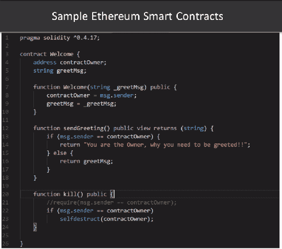

# 高级区块链概念

在本章中，我们将讨论区块链的高级概念以及各种协议、挑战和解决方案。在前面的章节中，我们将共识协议或算法视为区块链最关键的组件或构建模块之一。当我们谈到区块链时，首先想到的是安全和区块链共识算法。我们将研究这些挑战和解决方案。从那里，我们将进入智能合同，以及它们如何与区块链的协议一起工作。

在本章中，我们将介绍区块链的以下高级概念:

*   共识协议是区块链的运行引擎
*   共识算法的类型
*   区块链维护隐私的主要挑战
*   智能合同
*   分布式应用

# 共识协议简介

一致性算法是在分布式过程或系统中实现的过程，用于就某些特定数据达成一致。区块链共识算法保持分类帐交易在网络中同步，以确保分类帐仅在适当的参与委员会批准交易时更新，并且当分类帐更新时，它们以相同的顺序用相同的交易更新。这个过程叫做**共识**，保持这个运行的协议程序就是共识算法。这就是为什么共识被认为是区块链的运转引擎或心脏。

因此，共识主要是为区块链建立一个强大的技术基础设施层，这使得它成为最关键的部分。它确保添加到区块链的每个下一个块是唯一的真实版本，并且没有其他块代表另一个版本。它还保护整个区块链免受强大对手的攻击，这些强大对手可能会破坏它，使它无法保持其完整性。简而言之，对于区块链网络，达成共识确保了网络中的所有节点对区块链的一致全局状态达成一致。

# 共识机制的性质

共识方案具有以下几个关键属性，这些属性决定了其适用性和有效性:

*   **安全**:根据协议的规则，如果所有节点产生相同的输出，并且产生的输出有效，则一致协议被确定为安全的。这也被称为共享立法的一致性。
*   **活性**:如果所有参与一致性的故障节点最终产生一个值，则一致性协议的活性得到保证。
*   **容错**:共识协议如果能经常从失败中恢复或参与共识，则提供容错。
*   **不可否认性**:这提供了验证假定的发送者确实发送了消息的方法。
*   **分散共识**:单个中央权威机构无法提供交易终结性。因此，共识必须是分散的。
*   **Quorum structure** :节点以预定义的方式交换消息，可以同时包括几个阶段或层次。
*   **认证**:共识过程提供了验证参与者身份的手段。
*   **Integrity** :该流程强制验证交易的完整性。

虽然所有上述性质都至关重要，但费希尔、林奇和彼得森的一个著名结果，即 **FLP 不可能结果**，指出没有确定性共识协议可以在异步系统中同时保证安全性、活性和容错性。尽管容错对于全球分布式网络的运行至关重要，但取决于它们的系统需求和假设，分布式系统倾向于在安全性和活性之间进行选择。

# 拜占庭将军的问题

在分布式系统中，故障分为以下两种类型:

*   **Fail-stop faults** :这些是良性故障，由于硬件或软件崩溃导致节点停止参与共识协议。当故障停止故障发生时，节点将停止响应。
*   **拜占庭故障**:这些是导致节点行为不稳定的故障。Leslie Lampert 也将这类错误定义为**拜占庭将军的问题**。

拜占庭将军的问题是基于这样一种情况而概念化的:一群将军，每一个都指挥着拜占庭军队的一部分，包围了一个敌人的堡垒。为了成功地攻击并接管要塞，所有的将军必须同意一个共同的作战计划，并且将军只能通过信使(骑马者或跑步者)进行交流。但是，有一种可能性，这些信使可能会被敌人抓住，消息可能永远不会到达其他将军。此外，达成协议的困难在于，一个或多个将军可能是叛徒，并可能有意破坏整个作战计划。作为叛徒，他们可能发送错误的信息，歪曲信息，或者根本不发送任何信息。但是所有忠诚的将军都会按照计划行事。简而言之，少数叛徒不应该导致忠诚的将军们采取一个坏的或错误的计划。通过这个例子，我们可以看到拜占庭将军的问题是一个典型的分布式和去中心化系统的挑战。

# 拜占庭将军问题的解决方案

分布式系统现在有一种传统的共识方法，这种方法侧重于在面对不可靠的系统时建立容错能力，主要针对故障停止故障进行配置。拜占庭将军问题的一些例子是 **Paxos** 、 **Raft** 和 **Viewstamped** 复制。传统的一致性方法用于在分布式数据库中放置事务的顺序，以通过使用复制的状态机来排序客户端生成的请求和在分布式应用中发生的其他各个阶段的改变。这种网络中需要的节点数量是`2 f + 1`，以便能够容忍`f`个故障停止故障。容忍拜占庭错误会给系统增加几层额外的消息传递，从而增加一致性协议的复杂性。所有这些解决方案都带来了开销并增加了复杂性，使它们实际上变得不可能。

# 实用拜占庭容错

允许低开销的拜占庭容错应用的方法是**实用拜占庭容错** ( **PBFT** )。PBFT 是由米格尔·卡斯特罗和芭芭拉·利斯科夫在 1999 年首次提出的。PBFT 可以以最小的延迟处理大量的直接 P2P 消息。为了能够容忍系统中的`f`个错误，PBFT 需要`3f + 1`个副本。因此，PBFT 使用了主副本和辅助副本的概念，其中辅助副本会自动检查主副本所做决策的健全性和活性，如果发现主副本受损，辅助副本可以集体切换到新的主副本。每个节点维护一个内部状态。一旦接收到消息，相应的节点使用该消息，结合内部状态，来运行计算或操作。这指导节点做什么或考虑它接收的消息。一旦节点对相应的消息做出了单独的决定，它就将该决定传播给系统中的所有其他节点。基于由所有参与节点传播的决策，达成一致决策。与其他方法相比，这种达成共识的机制需要更少的努力和增加更少的开销。

# 共识算法的类型

以下三种共识算法或协议用于大多数区块链平台:

*   啪
*   刷卡机
*   诗人

在后面的章节中，我们还将对这三者进行快速比较。在我们看这些不同的共识算法之前，让我们先来看看各种算法背后的原因。以下是这种多样性的一些原因:

*   **业务需求**:业务需求驱动使用哪种算法。
*   **用例**:使用公共或私有区块链的用例影响将使用的算法。
*   **令牌需求**:并不是每个业务案例都需要使用令牌或加密货币，可能只是想在达成共识的情况下使用底层区块链。
*   **安全和隐私**:安全要求可能会有所不同，隐私也是如此。一些人可能想要一个公共的区块链，而另一些人可能更喜欢私人的。

*   表现:区块链公众可能需要更多时间来达成共识，而私人可能会更快。
*   **健壮性**:与其他用例相比，银行用例可能需要极高的加密和一致性算法。

# 工作证明

比特币也使用 PoW 算法，这是达成区块链共识的最著名方法。为了在 PoW 中达成共识，与 PBFT 不同，不要求网络中的所有节点提交单独的结论。相反，PoW 使用哈希函数来创建条件，允许单个/个人参与者宣布他们对所提交信息的结论，然后由所有其他系统参与者验证这些结论。哈希函数有一个参数，确保错误信息不会以可接受的方式计算，以防止任何错误的结论。

比特币系统的参与者代表网络公开验证信息，他们会得到一个新创造的比特币作为奖励。这个为验证信息而搜索有效散列的过程被称为**挖掘**。这种奖励参与网络的制度允许广泛参与，从而建设一个更强大的网络和更安全的区块链。这种广泛的参与确保了更大的网络稳定性，对每个参与者的要求最低，并允许参与者保持匿名。

# PoW 的挑战

虽然 PoW 除了是最著名的方法之外还有它的好处，但是它也有自己固有的挑战。节点需要使用现实世界的资源，比如计算机和电力。运行计算不同潜在解决方案的计算机或计算机集群需要大量电力，从生态学的角度来看，这并不理想，对环境也不利。

节点需要大量的计算硬件来达成共识，而这些硬件非常昂贵。如果那里的回报更好，矿工有可能会移动他们的硬件来开采不同的硬币或旧硬币。在这种情况下，矿工和节点的忠诚度较低。PoW 激励共识过程，这是矿工开采区块并获得奖励的动机。然而，在最大容量为 2100 万比特币的情况下，随着一段时间内越来越多的点数被释放，矿工的奖励将随着硬币变得越来越难开采而下降。这可能会导致矿工失去继续采矿的动力，这可能会挑战整体共识。

事实上，你需要大量的计算能力，超过了普通人的承受能力，甚至无法工作，这意味着采矿社区正在变得越来越小，越来越排外。这违背了分散化的思想，并可能导致 51%的攻击。

# 利害关系证明

PoS 是 PoW 的最常见替代方案，用于验证和确认区块上的交易。在这种类型的共识算法中，验证者投资于系统中的硬币，而不是投资于昂贵的计算机设备来进行区块挖掘比赛。

请注意术语“验证器”,因为 PoS 中没有硬币生成或挖掘。相反，所有的硬币从第一天起就存在，验证者，也称为利益相关者，只在交易费用上严格配对。

在 PoS 中，以更确定的方式选择批准新消息的个人，以确认提交给数据库的新信息的有效性。这种选择是由网络根据网络中每个个体的比例来完成的。在 PoS 中，您被选中创建下一个新区块的机会取决于您拥有或必须作为赌注留出的系统中硬币的比例。例如，拥有 500 枚硬币的验证者被选中的可能性是拥有 100 枚硬币的人的五倍。

转向参与组织有助于鼓励更多的社区参与，并有助于权力下放。将挖掘从进行大部分挖掘的几个 GPU 群组手中拿走，这有点像寡头垄断，然后将其均匀地分布在网络上，应该会导致一个更真实的分散系统。简单的 PoS 算法存在一个问题，即没有任何东西处于危险之中。它不会因为演员验证了不止一段历史而惩罚他们，这意味着电视网很容易对真实的历史产生分歧。一个没有什么可失去的或者没有利害关系的参与者没有理由不做坏事。这些实现没有为节点投票选择正确的块提供激励。因此，节点可以在多个块上投票，支持多个分叉，以最大化他们赢得奖励的机会，因为他们这样做不花费任何东西。为了正确和有效地实施采购订单，需要解决这个无关紧要的问题。

# 经过时间的证明

PoET 是一种共识算法，类似于 power，它消耗的电力要少得多，这是 Intel 为他们自己开发的。该算法使用一个 **t** **生锈的执行环境** ( **TEE** )，例如**软件保护扩展** ( **SGX** )，以确保块以随机抽签的方式产生，而无需做任何工作，而不是让参与者解决密码难题。这种方法基于通过 TEE 提供的保证速率时间。据英特尔称，PoET 算法可扩展至数千个节点，并将在任何支持 SGX 的英特尔处理器上高效运行。PoET 的一个主要缺点是需要始终信任英特尔，而不再信任第三方是区块链的根本原因。这种算法可以看作是另一种替代方法。

# 权力、权力和诗人之比较

为了更好地理解，我们现在将比较我们已经看到的三种共识算法，并根据某些参数对它们进行权衡。下表显示了每个参数的相应一致性算法的状态:

| **参数** | **功率** | **位置** | **诗人** |
| 区块链类型 | 未经许可 | 两者 | 两者 |
| 交易终结 | 盖然论的 | 盖然论的 | 盖然论的 |
| 交易率 | 低的 | 高的 | 中等 |
| 需要令牌 | 是 | 是 | 不 |
| 参与成本 | 是 | 是 | 不 |
| 对等网络的可扩展性 | 高的 | 高的 | 高的 |
| 信任模型 | 不可信 | 不可信 | 不可信 |

现在，让我们讨论前面的表格:

*   **区块链类型**:表示区块链平台的类型，许可或无许可，其中可以使用共识模型。这主要由共识模型所允许的成员类型决定。虽然 PoW 模型是专门为具有开放式参与的无权限平台构建的，但从技术上讲，它们可以与权限平台一起使用，但在该设置中并不理想。按照设计，PoS 和 PoET 可以在这两种函数类型中工作。
*   **交易终结**:这表示交易一旦被添加到区块链中的块，是否被认为是最终的。基于 PoW 和 PoET 的共识模型具有同时挖掘多个块的风险，这是因为它们的领导者关系模型与网络延迟相结合。

*   **成交率**:能即时确认交易并迅速达成共识的平台，成交率较高。幂方法是概率性，且必须花费大量时间来解决密码难题。因此，这些模型具有较高的事务延迟，因此事务率较低。
*   **需要令牌**:由于设计是基于令牌的存在，PoW 和 PoS 模型固有地需要一个加密令牌，而 PoET 模型不需要令牌来实现共识。
*   **参与成本:**权力和参与组织参与共识存在固有成本。为了开发安全存款以声明兴趣并与平台绑定，PoW 需要消耗能量，这是共识协议外部的资源，而 PoS 需要节点购买一些初始加密货币。
*   **对等网络的可扩展性**:共识模型的可扩展性是当对等节点的数量不断增加时，它达成共识的能力。前面总结的所有模型都具有很高的可扩展性。
*   **信任模型**:决定了参与共识的节点必须是已知的还是可信的。在 PoW、PoS 和 PoET 中，节点可能是不可信的，因为达成共识的机制是基于其他方式的，如计算工作或安全存款。只要超过 25%到 50%的网络不是对抗性的，共识决策就不会有效。

这里还有一个参数没有列出，那就是**对手容忍度**:这是网络中可以被攻破而共识不会受到影响的部分。每个共识模型都有一定的阈值或真正的对手容忍度。

# 区块链面临的主要隐私挑战

让我们来看看区块链在隐私方面面临的一些普遍挑战，以及应对这些挑战的解决方案。加州大学伯克利分校赛博朋克运动的共同创始人、著名数学家埃里克·休斯(Eric Hughes)在 1993 年表示，开放社会中的隐私需要匿名交易系统。直到现在，现金一直是主要的系统。匿名系统使个人能够在需要时，并且只在需要时透露他们的身份。但是，比特币和公共区块链的情况是这样吗？有一种普遍的错觉，认为比特币是匿名的，不可追踪的。这是一个可以理解的错误，考虑到比特币广受欢迎的使用案例，也就是我们在前面章节中提到的臭名昭著的丝绸之路。

借助比特币区块链的不变性，联邦调查局能够追踪并曝光涉案人员。然而，我们不能忽视的是，他们能够追踪货币的流向，并挑出他们要找的人。事实是，比特币确实是假名，有迹可循。比特币的每一笔交易都将输入映射到输出，任何人都可以以一种非常简单的方式追踪这笔钱。中本聪在他的白皮书中把比特币定义为一部保管史。2009 年，他声明如下:

“我们将电子硬币定义为一串数字签名。”

# 比特币的假名行为

假名是指我们与某个实体建立关系时，不披露该实体的个人身份。假名是指唯一的替代标识符，例如某人的昵称、信用卡号、大学的学号和银行账号。使用假名，您可以通过对这些事务进行分组来标记来自同一实体的各种消息和事务。假名在社交网络和其他虚拟交流渠道中被广泛使用。例如，任何客户服务代表用假名介绍自己，而不是透露他们的原名；这是化名。例如，推特账号和脸书账号就是假名的典型例子。

我们必须记住，当使用假名时，一个人无法被识别，但仍然可以被挑选出来，这是对区块链隐私的挑战。让我们来看看以下挑战:

*   **公共区块链分类账**:由于公共区块链分类账可供任何人使用，一些地址可以根据其所有权进行分组，使用行为模式和来自区块链以外来源的公开可用信息。
*   **钱包地址**:钱包地址重用将您的交易链接到一个单独的配置文件中。
*   **IP 地址复用** : IP 地址复用也向世人暗示，某一方，比如你或我，控制着各种地址。
*   **合并来自多个交易的输入**:这显示了你控制的一组地址。
*   **使用精简客户端** : 如果你使用的是精简客户端，而不是真正严格意义上的编写客户端，那么这些客户端实际上会向第三方透露你的完整地址集等等。

比特币地址集群作为另一个著名的技术堆栈，对比特币地址用户的去匿名化提出了挑战。通过分析从区块链获得的信息，它在寻址由单个用户产生的所有地址的同时这样做。然后可以观察到，P2P 网络代表了帮助比特币用户去匿名化的其他信息源。将这两者结合在一起可以很容易地辅助比特币地址聚类，并帮助识别个人。在某些情况下，它还可以帮助关联文件用户的所有事务。与此同时，当今世界上有许多公司正在区块链周边开展业务。随着网络的扩大，这些公司变得越来越重要，因为追踪此类资本流动的动机变得更强了。

# 隐私挑战的解决方案

让我们来看看一些有助于应对公共区块链带来的隐私挑战的解决方案。

# 混币原理

CoinJoin 是 Gregory Maxwell 提出的比特币交易匿名化方法。它是比特币交易压缩的一种方法，旨在通过丢弃不必要的信息来提高隐私性。CoinJoin 事务是指多人同意形成一个事务，其中一些输出具有相同的值。所有各方通过某个匿名通道走到一起，每个人都提供一个属于自己的目的地址。其中一方创建交易，向每个目的地地址发送一枚硬币。各方注销后分别登录渠道，各自贡献一枚硬币到账户，资金将从该账户中支出。如果`X`数量的硬币被支付到账户中，它们被分配到目的地地址；否则，他们被退还。一些流行的 CoinJoin 实现示例有 SharedCoins、Dark Wallets、CoinShuffle 和 Dash。

# 环形签名

环签名是一种技术上复杂的技术，但非常有前途，有助于实现令牌匿名化和识别应用。本质上，环签名是证明签名者拥有对应于一组特定公钥中的一个的私钥，但不揭示它是哪一个。它由实际签名者组成，然后与非签名者结合形成一个环。这个环中的实际签名者和非签名者都被认为是同等有效的。实际的签名者是一次性使用的密钥，对应于从发送者的钱包发送的输出。非签名者是从区块链中提取的过去交易的输出。这些过去的事务输出通过形成事务输入的一部分而在环签名事务中充当诱饵。所有的投入看起来都同样有可能是环外交易中花费的产出。

例如，如果 Dan 希望向 Melissa 发送一个 Monero，其戒指大小值为 5，则将从 Dan 的钱包中取出 5 个输入中的一个，然后将其添加到戒指签名交易中。其他四个输入是从区块链提取的过去的事务输出。这四个输入是诱饵，当与来自丹钱包的输入融合时，形成一组五个可能的签名者，这五个组成一个环。第三方将不能确定哪个输入实际上是由 Dan 的一次性使用密钥签名的。然而，通过使用密钥图像，网络能够验证转移给梅丽莎的资产或硬币之前没有被花费过。Monero 是使用环签名机制的最好例子。

# 零知识证明

另一项具有非常强大的属性来解决隐私挑战的技术是**零知识证明** ( **ZKP** )。ZKP 允许用户构造一个数学证明，这样，当一个程序在某个只有该用户知道的隐藏输入上执行时，它会有一个特定的公开输出，但不会透露除此之外的任何其他信息。**零知识简洁的非交互知识论证** ( **Zk-SNARKS** )是 ZKP 协议中更强的技术。它证明某件事是真的，但没有透露任何具体是什么使它成为真的。Zcash 是第一种保持完全匿名的加密货币。它使用 Zk-SNARKS 加密实现。它通过隐藏关于交易的所有知识来提供完全匿名。它为用户提供了对其特定财务信息的私人访问控制。它还使用了一个叫做**视图键**的概念。用户可以向个人提供该视图密钥，以获得交易的详细信息。

# 智能合同和分散式应用

我们在前面的章节中讨论了比特币和区块链，以及这整个技术如何成为继互联网之后的下一个重大创新。除了区块链的所有独特功能，如不变性、加密和安全性，智能合约使区块链成为一项更具创新性的技术。除了 P2P 网络和私钥加密之外，区块链程序是一种以编程方式控制资金流动的程序。这些项目是一种智能合同，仍然是区块链的核心。如果你看一下双方之间的典型标准合同协议，它基本上规定了关系的条款，这些条款或关系通常由法律实体强制执行。另一方面，智能合约通过使用加密技术编写的智能代码来加强它们之间的关系。简而言之，智能合约是完全按照其创建者或程序员编写的方式执行自身的程序。

这个概念是由著名的计算机科学家和密码学家 Nick Szabo 在 1993 年首次提出的。他打了一个数字自动售货机的比方，并解释了用户如何输入任何东西，如数据或值，并接收特定的项目，类似于我们可以从自动售货机获得的真实世界的小吃或软饮料。在区块链的例子中，用户可以通过编写一个程序来创建一个智能合同，并将数据推送到该合同，以便它可以执行所需的命令。

# 了解智能合同

智能合约是区块链技术的核心。这些是用图灵完全编程语言编写的程序，能够自我验证和自我执行协议，能够自主运行或无需任何外部干预。通俗地说，如果我们把比特币看作数字货币，那么智能合约就是高度可编程的数字货币。智能合约是存储在区块链的一段代码，由区块链交易触发，然后从区块链的数据库读取数据或向其写入数据。

只有在满足特定条件的情况下，节点网络才会验证交易，但比特币仅限于处理货币用例。但是，对于许多非金融用例，甚至是金融用例，钱不是中心点，但却是触发点呢？以太坊(Ethereum)是区块链的另一个变体，它从比特币派生出来，并经过进一步修改，用一种图灵完整、更强大的语言取代了比特币的受限语言，允许编写广泛的智能合同。

# 智能合同的运作

现在，让我们简单看一下触发智能合约工作的以下因素和条件:

*   **约定**:双方或多方之间的期权合约，在区块链平台上编写、编码、部署。参与的个人可以保持匿名，但合同写在公共账本上，保持不变。
*   **触发或执行点**:任何触发事件，无论是在区块链境内还是在区块链境外，都会使合同按照编码条款执行。例如，触发事件可以是合同的到期日或续期日，交易所的特定价格，或者我们系统的某个截止价格。
*   **结果**:智能合约的执行可能会产生一个改变交易状态的结果，或者改变区块链的状态，例如现金分类账。它也可能影响其他系统。
*   透明度:这是合同的另一个重要方面。这些合同在区块链永远有效。监管者可以在区块链利用这些信息来了解市场活动，同时维护相关各方的隐私。

现在，让我们看一个写合同的例子。以下是开始时应遵循的步骤:

1.  创建一个新文件，命名为`sample.sol`。
2.  接下来，打开文件开始编写代码，如下面的屏幕截图所示:

B11516_3_03

让我们看看前面代码中包含的步骤:

1.  首先，让我们声明我们将使用的 Solidity 版本，它是`pragma solidity^0.4.17`。这允许以太坊平台编译特定版本的合同。
2.  然后，我们来声明一个契约，命名为`Welcome`。

3.  接下来，让我们在这个契约中声明两个实例表变量。一个是`contractOwner`地址。这将捕获该合同所有者的地址或帐户，他将在 Solidity 平台上部署该合同。
4.  接下来，我们声明一个`greetMsg`字符串，它是从契约的所有者那里获取的。
5.  现在，我们声明一个`Welcome`函数。每当契约被部署在以太坊平台上时，这个实例或函数就会被公开调用。
6.  接下来，我们在这个函数中传递`_greetMsg`字符串。我们也将使这成为一个公共契约。
7.  接下来，我们给`contractOwner`变量赋值:`contractOwner = msg.sender`。因此，调用这个函数的人实际上将是消息所有者，他有权创建这个契约。
8.  同样，我们也将`greetMsg`的值指定为`greetMsg = _greetMsg`。因此，我们在这里所做的是我们已经创建了一个名为`Welcome`的构造函数，当契约在以太坊平台上部署时会调用这个函数。
9.  然后，我们再声明一个名为`sendGreeting()`的函数，它将返回一个字符串类型的变量`greetMsg`。
10.  要查看更多的函数，让我们通过添加`public view returns(string)`视图将`public returns(string)`转换成一个空视图函数。
11.  我们可以稍微调整一下这个函数，使其成为一个条件:`if message.sender == contractOwner`。这将把`Hello Mr. Owner why you need to be greeted!`返回给所有者，否则它将返回`greetMsg`。
12.  同样，我们将再声明一个名为`killContract()`的公共函数。
13.  然后，我们给出一个条件，`if message.sender == contract Owner`，分配一个任务，`selfdestruct(this)`。所以，除非契约的主人调用这个 kill contract 函数，否则会从以太坊平台扰乱契约。

这一点非常重要，因此您可以决定您希望在什么条件下从平台解决合同。因此，您可以在那里创建一个有时间限制的合同。

所以，这是一个你如何写详细的智能合同的例子。

# 分散应用

自诞生以来，区块链的应用已经提高了每个行业的期望值，并且有望在大多数创新技术中更加普及。它在不变性、安全性、加密、分布式分类帐等方面提供了很多功能。我们不应该忽视这样一个事实，即区块链可以用不变性、透明性、匿名性和安全性来解决具体问题。但是，它也有自己的挑战，例如，达成共识所需的速度、达成共识所需的时间以及公共分类帐中的复制时间。

# 挑战和解决方案

我们已经在前一章中介绍了分散式应用程序。Dapps 不归任何人所有，不能关闭，也不能有停机时间。因此，每当我们想要构建 Dapp 时，我们都需要记住一些考虑因素，例如，Dapp 必须是完全开放的源代码，并且自主运营，没有任何实体负责其大部分货币。它必须有协议的改变，旨在作出一些全面的改进，由所有用户批准。它将所有运营数据加密存储在公共区块链中，最重要的是，它必须激励。你真的需要在矿工中达成共识才能达成共识。同时，矿工们也需要一些动力。如果目标只是使用去中心化，那么还有很多其他的方法可以实现，比如 BitTorrent。

因此，尽管区块链仍在不断发展，衍生出许多新事物，使其越来越成熟，但我们作为一个整体社区需要避免滥用这一技术，不要在任何地方都使用它。相反，必须对技术、建筑和设计基础进行彻底的分析，以确定何时以及为何使用区块链作为解决问题的方案。我们绝不能认为它是适合所有问题的一站式解决方案。

# 摘要

在本章中，我们学习了区块链中使用的一些高级概念，并讲述了各种区块链实施中使用的各种共识协议。我们还研究了区块链隐私面临的一些关键挑战，以及 ZKP 等解决方案如何帮助保护隐私。然后，我们继续讨论智能合约，这是区块链的核心基石之一；它们是如何编写的；它们是什么；以及它们是如何被执行的。我们还研究了 Dapps，何时使用，何时不使用。在下一章中，我们将了解一些用于保护比特币和加密货币的一般做法。