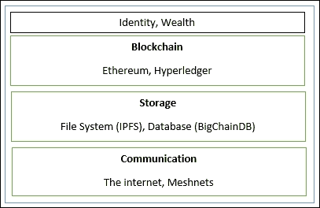

# 第二章。分散

权力下放不是一个新概念；它已经在战略、管理和治理中使用了很长时间。分权的基本思想是将控制和权力分散到外围，而不是由一个中央权力机构完全控制整个组织。这给组织带来了几个好处。例如提高效率、更快地做出决策、更好地激励员工以及减轻高层管理人员的负担。

在这一章中，将在区块链的背景下讨论分权的概念；两者的目标是相似的，即没有单一的中央权力机构在控制。还将介绍权力下放的方法和途径，并提供一些例子。此外，还将详细讨论区块链生态系统的去中心化、去中心化应用和去中心化平台。许多激动人心的应用和想法出现在分散的区块链技术中，将在本章中介绍。

# 利用区块链的权力下放

分散化是区块链技术所提供的核心优势和服务。区块链的设计是一个完美的工具，可以提供一个不需要任何中介的平台，并可以通过共识机制与许多不同的领导者合作。这种模式允许任何人竞争成为决策权威。这种竞争由共识机制管理，最常用的方法被称为**工作证明** ( **PoW** )。

权力下放的程度各不相同，从半权力下放到完全权力下放，视需要和情况而定。从区块链的角度来看，分散化可以被视为一种机制，它提供了一种重塑现有应用程序和范例或构建新应用程序的方式，以便将完全控制权交给用户。

**信息和通信技术** ( **ICT** )传统上是基于集中式范例，由此数据库或应用服务器处于中央机构(例如系统管理员)的控制之下。随着比特币和区块链技术的出现，这种模式已经发生了变化，现在任何人都可以启动一个去中心化的系统(并且在没有单点故障或单一可信机构的情况下操作它)的技术已经出现。根据在区块链上运行的分散式应用程序中使用的治理类型和模型，它可以自动运行，也可以需要一些人工干预。

接下来的图表显示了目前存在的不同类型的系统，即中央系统、分布式系统和分散式系统。这一概念最早于 1964 年发表在保罗·巴兰关于 T2 分布式通信网络的论文中。

集中式系统是传统的(客户端-服务器)IT 系统，其中只有一个机构控制系统，并全权负责系统的所有操作。中央系统的所有用户都依赖于单一的服务来源。在线服务提供商，如易贝、谷歌、亚马逊、苹果应用商店和大多数其他提供商，都使用这种常见的服务交付模式。另一方面，在分布式系统中，数据和计算分布在网络中的多个节点上。有时，这个术语会与并行计算混淆。虽然在定义上存在重叠，但这两种系统之间的主要区别在于，在并行系统中，计算由所有节点同时执行以获得结果，而在分布式系统中，计算可能不会并行发生，数据仅在用户视为单个一致系统的多个节点上复制。为了实现容错和速度，这两种模型都有所变化。在这个模型中，仍然有一个中央权威机构控制所有节点并管理处理。这意味着该系统本质上仍然是中央集权的。

不同类型的网络/系统

分散式系统和分布式系统之间的关键区别在于，在分布式系统中，仍然存在一个管理整个系统的中央权威，而在分散式系统中，不存在这样的权威。分散系统是一种网络类型，其中节点不依赖于单个主节点；相反，控制权分布在许多节点上。例如，这类似于一种模型，其中组织中的每个部门都有自己负责的数据库服务器，从而从中央服务器中取走权力，并将其分配给管理自己数据库的子部门。

开启了这个去中心化应用新时代的去中心化范式的一个真正创新是去中心化共识，它是随着比特币而引入的。这使得用户能够通过共识算法就某事达成一致，而不需要中央信任的第三方、中介或服务提供商。

# 权力下放的方法

有两种方法可以用来实现去中心化。这些方法将在下面的章节中详细讨论。

## 脱媒

这可以借助一个例子来解释。假设你想给在另一个国家的朋友寄钱。你去一家银行，这家银行会把你的钱转到你选择的国家的银行，并收取费用。在这种情况下，银行会保留一个更新的中央数据库，以确认您已经汇款。有了区块链技术，就有可能把这笔钱直接寄给你的朋友，而不需要通过银行。你需要的只是你在区块链的朋友的地址。这样，不再需要中介，通过去中介化实现去中心化。然而，由于繁重的监管和合规要求，在金融部门通过非中介化实现的实际分权程度是有争议的。然而，这个模型不仅可以用于金融，也可以用于许多其他不同的行业。

## 通过竞争

在这种方法中，一组服务提供商相互竞争，以便被系统选择提供服务。这种模式没有实现完全的去中心化，但是在一定程度上确保了中介或服务提供者不会垄断服务。在区块链技术的背景下，可以设想一个系统，在该系统中，智能合同可以根据外部数据提供商的声誉、以前的得分、评论和服务质量，从大量提供商中选择外部数据提供商。这不会导致完全去中心化，但它允许智能合同根据前面提到的标准做出自由选择。通过这种方式，在服务提供商之间形成了一种竞争环境，从而他们相互竞争成为首选的数据提供商。

下图显示了不同级别的分权。在左手边，有一个中央系统控制的传统方法；在右边，实现了完全的脱媒；在中间，显示了相互竞争的中介或服务提供商。中间基于信誉或投票选择中介或服务商，实现部分去中心化。

权力下放的规模

虽然去中心化有很多好处，包括但不限于透明、高效、节约成本、发展可信的生态系统，以及在某些情况下的隐私和匿名，但也需要彻底解决一些挑战，如安全要求、软件缺陷和人为错误。例如，在比特币或以太坊等分散式系统中，安全性通常由私钥提供，如果由于人为错误导致私钥丢失，或者如果由于智能合同代码中的错误导致分散式应用程序容易受到对手的攻击，如何确保与这些私钥相关联的智能财产不会变得无用？在我们开始使用区块链和去中心化应用程序去中心化一切之前，重要的是要理解不是所有的事情都需要(或者可以)去中心化。

# 权力下放的途径

尽管在比特币或区块链出现之前就有一些系统可以归类为某种程度上的去中心化，如 BitTorrent 或 Gnutella 文件共享，但随着区块链技术的出现，人们正在采取许多措施来利用这种新技术进行去中心化。通常，比特币区块链是许多人的首选，因为它已被证明是最具弹性和最安全的区块链，市值近 120 亿美元。另一种方法是使用其他区块链，比如以太坊，这是目前许多开发人员构建分散式应用程序的首选工具。

## 如何放权

Arvind Narayanan 等人提出了一个框架，可用于评估区块链技术背景下各种事物的分散化要求。该框架基本上提出了四个问题，一旦回答了这些问题，就可以清楚地了解一个系统如何去中心化。这些问题列举如下:

1.  什么是去中心化？
2.  需要何种程度的权力下放？
3.  用的是什么区块链？
4.  使用了什么安全机制？

第一个问题简单地问什么系统正在被去中心化。这可以是任何系统，例如身份系统或交易系统。下一个问题可以通过查看前面讨论的分权规模来具体说明所需的分权水平。可以是完全脱媒，也可以是部分脱媒。第三个问题非常简单，开发者可以选择哪种区块链适合特定的应用程序。它可以是比特币区块链、以太坊区块链或任何其他被认为适合特定应用的区块链。最后，需要回答关于安全机制的一个关键问题，即如何保证分散系统的安全性。例如，它可以是原子性的，由此事务要么完全执行，要么根本不执行。换句话说，要么全有，要么全无。这确保了系统的完整性。其他机制可以包括信誉，它允许系统中不同程度的信任。

### 例子

在本节中，提供了一个应用上述框架的例子。

在第一个例子中，选择了一个货币转账系统，它需要是分散的。在这种情况下，可以回答前面提到的四个问题，以便评估分权要求。答案如下所示:

1.  **答案 1** :货币转账系统。
2.  **答案二**:脱媒。
3.  **答案 3** :比特币。
4.  **答案 4** :原子性。

通过回答这四个问题，可以看出支付系统是如何去中心化的。基于前面的回答，可以说，汇款系统可以通过去除中介而分散，并且将在比特币区块链上实现，通过原子性提供安全保证。

同样，这个框架可以用于任何其他需要进行分权评估的系统。通过回答这四个简单的问题，可以很清楚地知道可以采取什么方法来分散系统。

# 区块链和全生态系统去中心化

为了实现彻底的权力下放，区块链周围的环境也必须权力下放。区块链本身就是一个分布式账本，运行在常规系统之上。这些元素包括存储、通信和计算。还有其他因素，如身份和财富，传统上是基于集中的范式，也需要分散这些方面，以实现完全分散的生态系统。

## 储存

数据可以直接存储在区块链中，这样做确实实现了去中心化，但这种方法的一个主要缺点是区块链在设计上不适合存储大量数据。它可以存储简单的事务和一些任意数据，但肯定不适合存储图像或大块数据，传统数据库系统就是这种情况。更好的选择是使用**分布式哈希表** ( **DHTs** )。DHT 最初用于点对点文件共享软件，如 BitTorrent、Napster、Kazaa 和 Gnutella。通过 CAN、Chord、Pastry 和 Tapestry 项目，DHT 研究变得流行起来。BitTorrent 被证明是最具扩展性和速度最快的网络，但问题是用户没有动力无限期地保存文件。用户通常不会永久保存文件，并且如果节点离开了具有某人所需数据的网络，除了让所需的节点再次重新加入网络以使文件再次变得可用之外，没有其他方法来检索它。这里的两个主要要求是高可用性和链路稳定性，这意味着数据应该在需要时可用，并且网络链路也应该总是可访问的。**Juan Benet 的行星间文件系统** ( **IPFS** )拥有这两种特性，其愿景是通过取代 HTTP 协议来提供一个去中心化的万维网。IPFS 使用 Kademlia DHT 和 merkle DAG 分别提供存储和搜索功能。

激励机制基于一种称为 Filecoin 的协议，该协议向使用 BitSwap 机制存储数据的节点支付激励。比特交换机制允许节点在一对一的关系下保持发送的字节或接收的字节的简单分类帐。此外，在 IPFS 中使用基于 Git 的版本控制机制来提供数据版本的结构和控制。

还有其他替代方案，比如以太坊 swarm、storj、maidsafe。以太坊有自己的分散和分布式生态系统，使用 Swarm 进行存储，使用 whisper 协议进行通信。Maidsafe 的目标是提供一个分散的万维网。所有这些项目将在本书后面更详细地讨论。

BigChainDB 是另一个存储层分散化项目，旨在提供一个可伸缩的、快速的、线性可伸缩的分散数据库，而不是传统的文件系统。BigChainDB 补充了以太坊和 IPFS 等分散处理平台和文件系统。

## 沟通

一般认为互联网(区块链的通信层)是去中心化的。这在某种程度上是正确的，因为互联网最初的愿景是开发一个去中心化的系统。电子邮件和在线存储等服务现在都基于这样一种模式，即服务提供商处于控制地位，用户相信他们会在需要时提供服务。这种模式基于对中央机构(服务提供商)的信任，用户无法控制他们的数据；甚至密码也存储在可信的第三方系统中。需要以这样一种方式向单个用户提供控制，即保证对他们的数据的访问，并且不依赖于单个第三方。对互联网的访问(通信层)是基于互联网服务提供商(ISP)的，它们充当互联网用户的中心枢纽。如果 ISP 因政治或任何其他原因而关闭，那么在这种模式下就不可能进行通信。一种替代方法是使用网状网络。尽管与 Internet 相比，它们的功能有限，但它们仍然提供了一种分散的替代方案，在这种方案中，节点可以直接相互通信，而无需 ISP 之类的中心集线器。

### 注意

一个 Meshnet 的例子是 Firechat([http://www.opengarden.com/firechat.html](http://www.opengarden.com/firechat.html))，它允许 iPhone 用户在没有互联网的情况下以点对点的方式直接相互交流。

现在想象一个允许用户控制他们的通信的网络；没有人可以因为政治或审查原因而关闭它。这可能是区块链生态系统中分散通信网络的下一步。必须注意的是，只有在互联网受到政府审查和控制的司法管辖区才需要这种模式。

如前所述，互联网最初的愿景是建立一个去中心化的网络；然而，多年来，随着谷歌、亚马逊和易贝等大型服务提供商的出现，控制权正在向大玩家转移。例如，电子邮件的核心是一个去中心化的系统；任何人都可以毫不费力地运行电子邮件服务器，并开始发送和接收电子邮件，但有一种更好的替代方案已经在为最终用户提供托管服务，因此人们很自然地倾向于选择集中式服务，因为它更方便、更免费。然而，免费服务是以宝贵的个人数据为代价提供的，许多用户并没有意识到这一事实。这是一个显示互联网如何走向集中化的例子。区块链再次向世界展示了这种去中心化的愿景，现在人们正在齐心协力地利用这种技术，并获得它可以提供的好处。

## 计算

计算或处理的分散化是通过以太坊等区块链技术实现的，其中嵌入了业务逻辑的智能合同可以在网络上运行。其他区块链技术也提供了类似的处理层平台，业务逻辑可以以分散的方式在网络上运行。

下图显示了分散式生态系统概述，在底层，互联网或 Meshnets 提供了一个分散式通信层，然后存储层使用 IPFS 和 BigChainDB 等技术来实现分散化，最后，您可以看到作为分散式处理层的区块链。区块链也可以以有限的方式提供存储层，但这严重阻碍了系统的速度和容量；因此，其他解决方案如 IPFS 和 BigChainDB 更适合以分散的方式存储大量数据。在顶部，显示身份和财富层。互联网上的身份是一个非常大的话题，bitAuth 和 OpenID 等系统已经提供了具有不同程度的去中心化和安全假设的认证和识别服务。

区块链能够为各种问题提供解决方案。一个与身份相关的概念被称为*佐科三角*，它要求网络协议中的命名系统是安全的、分散的、对人类有意义的。据推测，一个系统只能同时具有这两种性质，但是随着区块链以命名硬币的形式出现，这个问题得到了解决。然而，这并不是万灵药，并且有其自身的挑战，例如依赖用户安全地存储和维护私钥。这就引出了关于权力下放是否合适的其他一般性问题。也许权力下放并不适合每一种情况。在许多情况下，声誉良好的中央系统往往工作得更好。

有许多项目正在为更广泛的分布式区块链系统开发解决方案。

随着权力下放模式的出现，不同的术语和术语现在出现在媒体和学术文献中。随着区块链技术的出现，现在有可能构建传统物理组织的软件版本。在去中心化的背景下，即将出现的概念值得讨论。

# 智能合同

智能合同可以被认为是一个小型的分散程序。智能合约不一定需要区块链来运行；然而，由于区块链技术提供的安全优势，现在使用区块链作为智能合同的分散执行平台几乎成为一种标准。智能合约通常包含一些业务逻辑和数量有限的数据。区块链中的参与者或参与者使用这些智能合同，或者代表网络参与者自主运行。

这些小程序驻留在区块链上，如果满足某些特定的标准，它们就执行业务逻辑。关于智能合约的更多信息将在[第 6 章](06.html "Chapter 6. Smart Contracts")、*智能合约*中提供，该章节专门对智能合约进行详细讨论。

# 分权组织

分散式组织 ( **DOs** )是运行在区块链上的软件程序，基于真实人类组织的理念，有人员和协议。一旦以智能合约或一组智能合约的形式的 DO 被添加到区块链中，它就变得分散，并且各方基于 DO 软件中定义的代码彼此交互。

# 分散的自治组织

就像 DOs 一样，一个**去中心化的自治组织** ( **道**)也是一个运行在区块链之上的计算机程序，其中嵌入了治理和业务逻辑规则。DAO 和 DO 基本上是一样的东西，但是主要的区别是 DAO 是自治的，这意味着它们是完全自动化的，并且包含人工智能逻辑，而 DOs 缺乏这种特性，并且依赖于人的输入来执行业务逻辑。

以太坊区块链率先推出了 DAOs。在 DAO 中，代码被认为是管理实体，而不是人或书面契约。然而，*策展人*是一个人类实体，作为维护该代码的人参与进来，并充当社区的提案评估者。如果从令牌持有者(参与者)那里收到足够的信息，Dao 可以雇佣外部*承包商*。最著名的 DAO 项目是*的 DAO*([T7)，因为它在众筹阶段筹集了 1.68 亿美元。"一体行动"项目旨在成为一个风险资本基金，旨在提供一种没有单一实体作为所有者的分散经营模式。不幸的是，这是由于 DAO 代码中的一个错误而被黑客攻击的，价值数百万美元的**以太货币** ( **ETH** )被从 DAO 中抽取出来，成为黑客创建的子 DAO。它需要以太坊区块链上的硬分叉来逆转黑客攻击的影响并启动资金恢复。这一事件引发了一场关于安全性、质量以及彻底测试智能合约中的代码以确保完整性和充分控制的必要性的辩论。有一些项目正在进行中，尤其是在学术界，它们正在寻求将智能契约编码形式化。](https://daohub.org)

目前，Dao 不具有任何法律地位，尽管它们可能包含一些执行某些协议和条件的智能代码，但是这些规则在当前现实世界的法律系统中没有价值。也许有一天，由执法机构或包含规则和条例的监管机构委托和许可的*自主* *代理*可以嵌入到 DAO 中，以从法律和合规的角度确保 DAO 的完整性。一个**自主代理** ( **AA** )是一段无需人工干预就能运行的代码。Dao 是纯粹的分散实体，这一事实使其有可能在任何物理管辖区内运行。因此，他们提出了一个大问题，即当前的法律体系将如何与如此多样的不同司法管辖区和地域相结合。

# 分散的自治公司

**Dao**、**分权自治公司**(**DAC**)是一个类似的概念，但被认为是 Dao 的一个较小的子集。DAC 和 Dao 的定义有时会重叠，但一个普遍的区别是 Dao 通常被认为是非营利的，而 DAC 可以通过向参与者提供股份和支付股息来赚钱。这些公司可以根据内部编程的逻辑，在没有人工干预的情况下自动经营业务。

# 分散的自治社会

**去中心化自治社会** ( **DASs** )是一个概念，通过这个概念，整个社会可以在多个复杂智能契约的帮助下，在一个区块链上运行，并结合 DAOs 和**去中心化应用** ( **DAPPs** )自主运行。这种模式并不意味着一种非法的方法，也不是基于一种完全自由的意识形态；相反，政府提供的许多服务都可以通过区块链提供，例如政府身份证系统、护照发放以及契约、婚姻和出生记录。另一个理论是，如果一个政府是腐败的，中央系统不能提供一个社会所需要的令人满意的信任水平，那么这个社会可以在一个区块链上开始它自己的虚拟社会，这个社会是由分散的共识驱动的，并且是透明的。这可能被视为自由主义者或赛博朋克的梦想，但在区块链身上是完全可能的。

# 分散式应用

前面提到的所有想法都在分散应用程序的大伞下。所有 Dao、DAC 和 DOs 基本上都是运行在对等网络中区块链之上的分散式应用程序。这是与权力下放有关的最新技术进步。分散式应用程序或 DAPPs 是可以在它们自己的区块链上运行的软件程序，使用另一个已经存在的已建立的区块链，或只使用现有区块链解决方案的协议。这些被称为 I 型、II 型和 III 型 DAPPs。

## 分散应用程序的要求

为了使一个应用程序被认为是一个分散的应用程序，它必须满足以下标准。这个定义是由*戴维·约翰斯顿*和其他人在他们名为*的白皮书《分散化应用的一般理论》中提出的，Dapps* :

1.  DAPP 应该是完全开源和自治的，任何一个实体都不应该控制它的大部分令牌。对应用程序的所有更改都必须基于社区给出的反馈意见并得到一致认可。
2.  应用程序操作的数据和记录必须加密保护，并存储在一个公共的、分散的区块链上，以避免任何中心故障点。
3.  应用程序必须使用加密令牌，以便向那些为应用程序贡献价值的人(例如，比特币矿工)提供访问和奖励。
4.  令牌必须由分布式应用根据标准密码算法生成。这一代令牌充当了对贡献者(例如，矿工)的价值的证明。

## DAPP 的操作

DAPP 建立共识可以使用共识算法来实现，例如工作证明和利益证明。到目前为止，只有 PoW 被发现可以令人难以置信地抵抗 51%的攻击，这一点从比特币中可见一斑。此外，DAPP 可以通过采矿、筹款和开发来分发代币(硬币)。

### 例子

这里提供了一些分散应用的例子。

#### KYC 链

该应用程序提供了一种基于智能合同的安全便捷的方式来管理**了解您的客户** ( **KYC** )数据的工具。

#### 露天集市

这是一个分散的点对点网络，允许卖家和买家之间直接进行商业活动，而不是依赖于一个中心方，这与易贝和亚马逊等传统供应商不同。应当注意，该系统不是建立在区块链之上的；相反，在对等网络中使用分布式哈希表，以便实现对等体之间的直接通信和数据共享。然而，它利用比特币作为支付网络。

#### lazoooz

这相当于优步的分权制。它允许点对点乘车共享，用户可以通过*运动证明*获得激励，并可以赚取 Zooz 硬币。

### 注意

还有许多其他的 DAPPS 在区块链以太坊建造，并在 http://dapps.ethercasts.com/展出。

# 权力下放平台

现在有很多平台可以去中心化。世界上许多公司都推出了平台，承诺使分布式应用程序开发对用户来说更容易、更易访问、更安全。这里讨论一些著名的名字。

## 以太网

以太坊名列榜首，因为它是第一个引入图灵完全语言和虚拟机概念的区块链。这与比特币和许多其他加密货币中有限的脚本语言形成了对比。随着这种称为 Solidity 的图灵完备语言的出现，开发分散式应用程序有了无限的可能性。这是 Vitalik Buterin 在 2013 年提出的，它提供了一个公共区块链来开发智能合同和去中心化应用。以太坊上的货币代币叫做以太。

## 迈德赛

Maidsafe 提供了一个**安全** ( **人人安全访问**)的网络，它由未使用的计算资源组成，如存储、处理能力和用户的数据连接。网络上的文件被分成小数据块，这些数据块被加密并随机分布在整个网络中。这些数据只能由其各自的所有者检索。一项关键创新是，重复文件会在网络上被自动拒绝，这有助于减少管理负载所需的额外计算资源。它使用 Safecoin 作为令牌来激励其贡献者。

## 的语言

Lisk 是一个区块链应用开发和加密货币平台。它允许开发人员使用 JavaScript 构建去中心化的应用程序，并将它们托管在各自的侧链中。Lisk 使用**授权利益证明** ( **DPOS** )机制来达成共识，由此可以选出 101 个节点来保护网络并提出区块。它使用 Node.js 和 JavaScript 后端，而前端允许使用标准技术，如 CSS3、HTML5 和 JavaScript。Lisk 使用 LSK 硬币作为区块链的货币。Lisk 的另一个衍生产品是 Rise，这是一个基于 Lisk 的去中心化应用和数字货币平台。它更加关注系统的安全性。

对这些平台和其他平台的更实用的介绍将在后面的章节中提供。

# 总结

本章介绍了分散化的概念，这是区块链技术所提供的核心服务。尽管权力下放的概念并不新鲜，但它在区块链世界获得了新的意义。因此，最近已经引入了基于分散架构的各种应用。这一章首先介绍了权力下放的概念。接下来，讨论了从区块链角度看权力下放的问题。此外，还介绍了与区块链生态系统中不同层次的权力下放有关的想法。从区块链的角度来看，随着区块链技术和去中心化的出现，出现了几个新概念和术语，例如 DAOs、DAPPs 和各种其他概念和术语。本章还介绍了所有这些术语。最后，结合实例讨论了分散式应用。在下一章中，将介绍理解区块链生态系统所必需的基本概念。主要介绍密码学，它为区块链技术提供了一个重要的基础。