# 第四章。比特币

比特币是区块链技术的首次应用。本章将向读者详细介绍比特币技术。

随着第一种完全去中心化的数字货币的推出，比特币开始了一场革命，这种货币被证明是极其安全和稳定的。这也引发了学术和工业研究的极大兴趣，并引入了许多新的研究领域。自 2008 年推出以来，比特币广受欢迎，目前是世界上最成功的数字货币，投资了数十亿美元。它建立在密码学、数字现金和分布式计算领域数十年的研究基础之上。在接下来的部分，为了提供理解比特币发明背后的基础所需的背景，呈现了一个简短的历史。

几十年来，数字货币一直是一个活跃的研究领域。创造数字现金的早期提议可以追溯到 20 世纪 80 年代初。1982 年， *David Chaum* 提出了一个方案，使用盲签名来构建不可追踪的数字货币。在这个方案中，银行将通过签署用户提供给它的一个盲随机序列号来发行数字货币。然后，用户可以使用由银行签名的数字令牌作为货币。这种方案的局限性在于银行必须跟踪所有用过的序列号。这是一个中央系统的设计，需要得到用户的信任。后来在 1990 年， *David Chaum* 提出了一个被称为电子现金的改进版本，它不仅使用了盲签名，还使用了一些私人身份数据来编写消息，然后发送到银行。这一方案允许发现重复支出，但不能防止重复支出。如果在两个不同的地方使用同一个代币，那么双重消费者的身份就会暴露。电子现金只能代表固定金额。 *Adam Back 的* hashcash 于 1997 年推出，最初是为了阻止垃圾邮件。hashcash 背后的想法是解决一个计算难题，这个难题很容易验证，但是计算起来相对困难。

这种想法是，对于单个用户和单封电子邮件，额外的计算工作量是不明显的，但由于运行垃圾邮件活动所需的时间和资源将大幅增加，因此不鼓励有人发送大量垃圾邮件。

B-money 是由*戴伟*在 1998 年提出的，它引入了使用工作证明来创造货币的想法。该系统的一个主要弱点是，拥有更高计算能力的对手可以在不允许网络调整到适当难度的情况下产生不请自来的金钱。该系统缺乏节点间共识机制的细节，并且一些安全问题如 Sybil 攻击也没有得到解决。与此同时， *Nick Szabo* 引入了 BitGold 的概念，它也是基于工作机制的证明，但除了网络难度级别是可调的之外，与 b-money 有相同的问题。*托马斯·桑德*和*阿蒙·塔沙玛*在 1999 年提出了一个电子现金方案，首次使用 Merkle 树来表示硬币，并使用零知识证明来证明拥有硬币。在这个方案中，要求中央银行记录所有用过的序列号。这个方案允许用户完全匿名，尽管需要计算成本。 **RPOW** ( **可重用工作证明**)由*哈尔·芬尼*于 2004 年引入，并由*亚当·贝克*使用 hashcash 方案作为创造货币所花费的计算资源的证明。这也是一个中央系统，它有一个中央数据库来记录所有用过异能令牌。这是一个使用远程证明的在线系统，由**可信计算平台** ( **TPM 硬件**)实现。

前面提到的所有方案都是经过精心设计的，但从某个方面来说都很薄弱。特别是，所有这些方案都依赖于用户需要信任的中央服务器。

# 比特币

2008 年，*中本聪*写了一篇关于比特币的论文，*比特币:点对点电子现金系统*。论文中介绍的第一个关键思想是，纯粹的点对点电子现金确实需要一个中间银行在点对点之间转移支付。

比特币是建立在数十年的密码学研究基础上的，如对 Merkle 树、哈希函数、公钥密码学和数字签名的研究。此外，比特币、b-money、hashcash 和加密时间戳等理念为比特币的发明奠定了基础。所有这些技术都巧妙地结合在比特币中，创造了世界上第一种去中心化的货币。比特币解决的关键问题是拜占庭将军问题的优雅解决方案以及双重花费问题的实用解决方案。

自 2011 年以来，比特币的价值大幅上升，如下图所示:

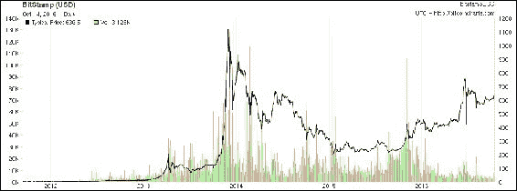

2012 年以来的比特币价格和交易量(对数标度)

比特币的监管是一个有争议的话题，尽管这是自由主义者的梦想，但执法机构和政府正在提议各种监管措施来控制它，比如纽约州金融服务局颁发的比特币许可证。这是颁发给从事虚拟货币相关活动的企业的许可证。

比特币的增长也是因为所谓的*网络效应*。也被称为需求方规模经济，这是一个基本上意味着使用网络的用户越多，网络就越有价值的概念。随着时间的推移，比特币网络的增长呈指数级增长。尽管比特币的价格波动很大，但它在过去几年里大幅上涨。目前(撰写本文时)，比特币价格为 815 英镑。

## 比特币的定义

比特币可以有多种定义；它是一种协议，一种数字货币，一个平台。它是点对点网络、协议和软件的结合，促进了名为比特币的数字货币的创建和使用。注意，大写 *B* 的比特币用于指代比特币协议，而小写 *b* 的比特币用于指代比特币，即货币。这种对等网络中的节点使用比特币协议相互交谈。

随着比特币的发明，货币的去中心化第一次成为可能。此外，在比特币中，双重支出问题得到了优雅而巧妙的解决。例如，当一个用户同时向两个不同的用户发送硬币，并且它们被独立地验证为有效交易时，就会出现重复消费问题。

### 钥匙和地址

椭圆曲线加密用于在比特币网络中生成公钥和私钥对。比特币地址是通过获取私钥的相应公钥并散列两次来创建的，第一次使用 SHA256 算法，然后使用 RIPEMD160。然后，产生的 160 位哈希以版本号为前缀，最后使用 Base58Check 编码方案进行编码。比特币地址长度为 26-35 个字符，以数字 1 或 3 开头。典型的比特币地址如下所示:

**1 anagugg 8 biev 2 fystnrumx 7 quck 58 wt**

这也通常编码在 QR 码中，以便于共享。上述地址的二维码如下图所示:


比特币地址的二维码 1 anagug G8 bike v2 fy stbnrumx 7 quck 58 wt

目前，有两种类型的地址，常用的 P2PKH 和另一种 P2SH 类型，分别以 1 和 3 开头。在早期，比特币使用直接支付到公钥，现在被 P2PKH 取代。然而，直接支付到公钥仍然在比特币中用于 coinbase 地址。地址不应使用一次以上；否则，可能会出现隐私和安全问题。避免地址重用在一定程度上规避了匿名问题，比特币也有一些其他安全问题，如交易延展性，这需要不同的方法来解决。


来自 bitaddress.org 的私人密钥和比特币地址放在一个纸质钱包里

### 比特币中的公钥

在公钥加密中，公钥是由私钥生成的。比特币使用基于 SECP256K1 标准的 ECC。私钥是随机选择的，长度为 256 位。公钥可以以未压缩或压缩的格式呈现。公钥基本上是椭圆曲线上的 *x* 和 *y* 坐标，并且是未压缩的格式，以十六进制格式的前缀 04 表示。 *X* 和 *Y* 坐标长度均为 32 位。与未压缩格式的 65 字节相比，压缩的公共密钥总共有 33 字节长。公钥的压缩版本基本上只包括 *X* 部分，因为 *Y* 部分可以从中导出。公钥压缩版之所以有效，是因为比特币客户端最初使用的是未压缩的密钥，但从比特币核心客户端 0.6 开始，以压缩密钥为标准。

键由各种前缀标识，如下所述:

*   未压缩的公钥使用 0x04 作为前缀
*   如果公钥的 y 32 位部分是奇数，则压缩公钥从 0x03 开始
*   如果公钥的 y 32 位部分是偶数，则压缩公钥从 0x02 开始

更详细的数学描述和它工作的原因在这里描述。如果 ECC 图被可视化，它揭示了 *y* 坐标可以在 *x* 轴之下或者在 *x* 轴之上，并且由于曲线是对称的，所以只需要存储素数域中的位置。

### 比特币中的私钥

私钥基本上是在 SECP256K1 ECDSA 建议指定的范围内选择的 256 位数字。从 0x1 到 0x ffff FFFF FFFF FFFF FFFF FFFF FFFF FFFE BAAE DCE 6 AF48 A03B bfd 2 5E8C D036 4140 中任意选择的 256 位数字都是有效的私钥。

私钥通常使用**钱包导入格式** ( **WIF** )进行编码，以便于复制和使用。WIF 可以转换成私钥，反之亦然。这里描述了这些步骤。

此外， **Mini Private Key Format** 有时用于将密钥编码在 30 个字符以下，以便在物理空间有限的地方存储，例如，在物理硬币上蚀刻或抗损坏的 QR 码。比特币核心客户端还允许对包含私钥的钱包进行加密。

### 比特币货币单位

比特币货币单位描述如下。最小的比特币面额是 Satoshi。


### base58 检查编码

这种编码用于限制各种字符之间的混淆，例如 0OIl，因为它们在不同的字体中看起来是一样的。编码基本上采用二进制字节数组，并将它们转换成人类可读的字符串。该字符串由一组 58 个字母数字符号组成。更多的解释和逻辑可以在比特币源代码中的`base58.h`源文件中找到。


来自比特币源代码的解释

比特币地址使用 Base58check 编码。

### 虚荣心地址

由于比特币地址基于 base 58 编码，因此有可能生成包含人类可读信息的地址。一个例子如下所示:


QR 中编码的公共地址

虚空地址是使用纯暴力方法生成的。下面的屏幕截图显示了一个示例:


从 https://bitcoinvanitygen.com/生成的虚名地址

# 交易

交易是比特币生态系统的核心。交易可以简单到只是将一些比特币发送到一个比特币地址，也可以根据要求相当复杂。每个事务至少由一个输入和输出组成。投入可以被认为是在以前的交易中产生的硬币，而产出可以被认为是正在产生的硬币。如果交易是铸造新硬币，那么没有输入，因此不需要签名。如果交易是将硬币发送给其他用户(比特币地址)，则需要由发送者用他们的私钥签名，并且还需要参考之前的交易，以显示硬币的来源。事实上，硬币是 Satoshis 中表示的未使用的交易输出。

交易没有加密，在区块链公开可见。块由事务组成，可以使用任何在线区块链浏览器查看这些事务。

## 事务生命周期

1.  用户/发送者使用钱包软件或一些其他接口发送交易。
2.  钱包软件使用发送者的私钥对交易进行签名。
3.  使用洪泛算法将交易广播到比特币网络。
4.  挖掘节点将该事务包含在下一个要挖掘的块中。
5.  一旦解决工作证明问题的矿工将新开采的区块广播到网络，开采就开始了。工作证明将在本章后面详细解释。
6.  节点验证该块并进一步传播该块，然后开始生成确认。
7.  最后，确认开始出现在接收者的钱包中，并且在大约六次确认之后，交易被认为是最终确定和确认的。但是，六只是一个推荐数字；即使在第一次确认之后，交易也可以被认为是最终的。等待六次确认背后的关键思想是，在六次确认后，重复消费的可能性实际上被消除了。

## 交易结构

高层次的事务包含元数据、输入和输出。事务被合并以创建一个块。交易结构如下表所示:

<colgroup class="calibre13"><col class="calibre14"> <col class="calibre14"> <col class="calibre14"></colgroup> 
| **字段** | **尺寸** | **描述** |
| 版本号 | 4 字节 | 用于指定挖掘器和节点用于事务处理的规则。 |
| 输入计数器 | 1 字节- 9 字节 | 交易记录中包含的输入数量。 |
| 输入列表 | 可变的 | 每个输入由几个字段组成，包括以前的事务散列、以前的 Txout-index、Txin-script 长度、Txin-script 和可选的序列号。块中的第一个事务也称为 coinbase 事务。它指定一个或多个事务输入。 |
| 柜台外 | 1 字节- 9 字节 | 表示输出数量的正整数。 |
| 输出列表 | 可变的 | 交易中包含的输出。 |
| 锁定时间 | 4 字节 | 这定义了交易生效的最早时间。它或者是 Unix 时间戳，或者是块号。 |

*   **元数据**:这部分事务包含一些值，比如事务的大小、输入和输出的数量、事务的散列和一个`lock_time`字段。每个事务都有一个指定版本号的前缀。
*   **输入**:一般每个输入花费一个前一个输出。每个输出都被认为是一个**未用完的事务输出** ( **UTXO** )，直到一个输入消耗掉它。
*   **输出**:输出只有两个字段，包含发送比特币的指令。第一个字段包含 Satoshis 的数量，而第二个字段是一个锁定脚本，它包含需要满足的条件，以便输出被花费。本节稍后将讨论使用锁定和解锁脚本以及生成输出的事务开销的更多信息。
*   **验证:**使用比特币的脚本语言进行验证。

一个示例事务如下所示:

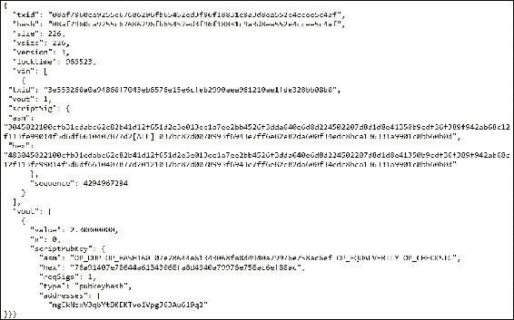

一个示例解码事务，显示了前面描述的各种字段

### 脚本语言

比特币使用一种简单的基于堆栈的语言，称为 *script* 来描述比特币如何被花费和转移。它不是 Turing complete，也没有循环来避免长时间运行/挂起的脚本对比特币网络的任何不良影响。这种脚本语言基于类似 Forth 的语法，并使用反向波兰符号，其中每个操作数后面都跟有它的运算符。使用**后进先出** ( **LIFO** )堆栈从左到右对其进行评估。

脚本使用各种操作码或指令来定义它们的操作。操作码也称为字、命令或函数。比特币节点的早期版本有一些操作码，由于在设计中发现了错误，这些操作码不再使用。

脚本操作码的各种类别是常量、流控制、堆栈、逐位逻辑、拼接、算术、加密和锁定时间。

通过组合`ScriptSig`和`ScriptPubKey`来评估事务脚本。`ScriptSig`是解锁脚本，而`ScriptPubKey`是锁定脚本。这就是如何评估一项交易的花费；先解锁再花。`ScriptSig`由希望解锁交易的用户提供。`ScriptPubkey`是交易输出的一部分，规定了消费输出所需满足的条件。换句话说，输出被包含条件的`ScriptPubKey`(锁定脚本)锁定，当满足条件时将解锁输出，然后硬币可以被兑换。

### 常用操作码

所有操作码都在比特币参考客户端源代码的 script.h 文件中声明。这可以通过以下评论下的链接访问，链接位于[https://github . com/bitcoin/bitcoin/blob/master/src/script/script . h](https://github.com/bitcoin/bitcoin/blob/master/src/script/script.h):

**/**脚本操作码*/**

这里列出了最常用的操作码的描述。这张表摘自《比特币开发者指南:

<colgroup class="calibre13"><col class="calibre14"> <col class="calibre14"></colgroup> 
| **操作码** | **描述** |
| `OP_CHECKSIG` | 这需要一个公钥和签名，并验证事务散列的签名。如果匹配，则将 TRUE 推送到堆栈上；否则，将推 FALSE。 |
| `OP_EQUAL` | 如果输入完全相等，则返回 1；否则，返回 0。 |
| `OP_DUP` | 这复制了堆栈中的顶部项目。 |
| `OP_HASH160` | 输入被散列两次，第一次用 SHA-256，然后用 RIPEMD-160。 |
| `OP_VERIFY` | 如果顶层堆栈值不为真，则将事务标记为无效。 |
| `OP_EQUALVERIFY` | 这个和`OP_EQUAL`一样，但是之后运行`OP_VERIFY`。 |
| `OP_CHECKMULTISIG` | 这将获取第一个签名，并将其与每个公钥进行比较，直到找到匹配项，并重复此过程，直到检查完所有签名。如果所有的签名都是有效的，那么结果返回 1 值；否则，返回 0。 |

## 交易类型

比特币中有各种脚本来处理从源到目的地的价值转移。根据交易的要求，这些脚本从非常简单到非常复杂不等。这里讨论的是标准交易类型。使用`IsStandard()`和`IsStandardTx()`测试评估标准交易，通常只有通过测试的标准交易才允许在比特币网络上挖掘或广播。但是，非标准交易在网络上是有效和允许的。

*   **Pay to Public Key Hash** (**P2PKH**): P2PKH is the most commonly used transaction type and is used to send transactions to the bitcoin addresses. The format of the transaction is shown as folows:

    `ScriptPubKey` : `OP_DUP OP_HASH160` < pubKeyHash > `OP_EQUALVERIFY OP_CHECKSIG`

    `ScriptSig`><酒吧>

    `ScriptPubKey`和`ScriptSig`参数连接在一起并被执行。本节稍后将给出一个示例，我们将对此进行更详细的解释。

*   **Pay to Script Hash** (**P2SH**): P2SH is used in order to send transactions to a script hash (that is, the addresses starting with 3) and was standardized in BIP16\. In addition to passing the script, the redeem script is also evaluated and must be valid. The template is shown as follows:

    `ScriptPubKey` : `OP_HASH160` <救赎哈希> `OP_EQUAL`

    `ScriptSig`:【<签名>...<签约><救赎>

*   **MultiSig (Pay to MultiSig)**:M of n multisignature transaction script is a complex type of script where it is possible to construct a script that required multiple signatures to be valid in order to redeem a transaction. Various complex transactions such as escrow and deposits can be built using this script. The template is shown here:

    `ScriptPubKey`:<m><pubKey><pubKey>。。。】<n>T1】

    `ScriptSig` : 0 [ <先生>。。。<签>

    原始 multisig 已经过时，multisig 通常是 P2SH rename 脚本的一部分，在前面的要点中提到过。

*   **Pay to Pubkey**:This script is a very simple script that is commonly used in coinbase transactions. It is now obsolete and was used in an old version of bitcoin. The public key is stored within the script in this case, and the unlocking script is required to sign the transaction with the private key.

    该模板如下所示:

    <pubkey>`OP_CHECKSIG`</pubkey>

*   **Null data/OP_RETURN**:This script is used to store arbitrary data on the blockchain for a fee. The limit of the message is 40 bytes. The output of this script is unredeemable because `OP_RETURN` will fail the validation in any case. `ScriptSig` is not required in this case.

    该模板非常简单，如下所示:

    `OP_RETURN` <数据>

P2PKH 脚本执行如下所示:

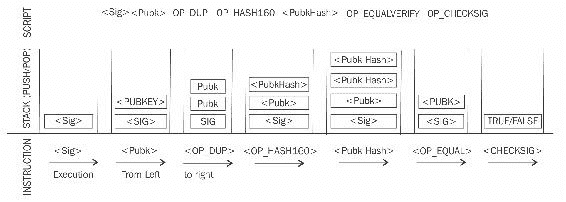

P2PKH 脚本执行

在通过比特币网络传输之前，所有交易最终都会被编码成十六进制。一个以十六进制显示的示例交易是通过使用以下命令在比特币测试网上使用比特币 cli 检索的:

```
drequinox@drequinox-OP7010:~$ bitcoin-cli --testnet getrawtransaction "08af7960ca9255c67686296fb65452ed3f96f18831c9a3d8ea552e4ccee5c4af"
0100000001b008bb28e3fde10a2161a9ae9029ebcfe6156e57b63e04f76048a9a06032553e010000006b483045022100cfb31edabc62c82b41d12f651d2e3e013ee1a7ee2bb4526f3dda640e6d8d224502207d8d1d8e41350b9cdf36f389f942ab68c12f113fe99014f5d6df6610407877d20121037bc82d0078993f6943e7ff6e82e82da600f34edc8bca136331a9901c8bb60b0dfeffffff028085b50d000000001976a91407e78644a61343068fa8d4940a79976e758ac6ef88ac95bddc1c000000001976a914dad770cccb1026ebf87acacfe35f2d6f2d336faa88ac33cb0e00

```

### 比特币基地交易

coinbase 事务或生成事务总是由挖掘器创建，并且是块中的第一个事务。它被用来创造新的硬币。它包括一个特殊字段，也称为 *coinbase* ，作为 coinbase 事务的输入。该事务还允许使用多达 100 字节的任意数据来存储任意数据。在《创世纪》中，这包括摘自《泰晤士报》的最著名的评论:

> *《泰晤士报》03/1/2009 财政大臣濒临第二次银行救助*

这条消息证明了创世纪区块的开采时间不早于 2009 年 1 月 3 日。

### UTXO 是什么？

**未用完的交易输出** ( **UTXO** )是未用完的交易输出，其可以作为新交易的输入来花费。与比特币交易相关的其他概念描述如下。

#### 交易费用

交易费用由矿商收取。收取的费用取决于交易的规模。交易费用的计算方法是减去投入的总和和产出的总和。这些费用被用作对矿商的激励，以鼓励他们在矿商正在创建的区块中包括用户交易。所有的事务都在内存池中结束，挖掘器从内存池中根据事务的优先级挑选事务，并将其包含在建议的块中。本章稍后将介绍优先级的计算；然而，从交易费用的角度来看，费用较高的交易会更快被矿商接受。对于各种类型的操作，例如发送事务、包含在块中以及由节点进行中继，根据不同的规则来计算费用。比特币协议没有固定费用，也不是强制性的；即使没有费用的交易也会在适当的时候处理，但可能需要很长时间。

#### 合同

根据比特币核心开发者指南的定义，合同基本上是使用比特币系统执行金融协议的交易。这是一个简单的定义，但具有深远的影响，因为它允许用户设计可以在许多现实世界场景中使用的复杂契约。合同允许开发一个完全分散的、独立的、降低风险的平台。可以使用比特币脚本语言建立各种合同，如托管、仲裁和小额支付渠道。一个脚本的当前实现非常有限，但是各种类型的契约仍然有可能被开发。例如，只有在多方签署交易时才释放资金，或者可能只有在一定时间过去后才释放资金。这两种场景都可以使用`multiSig`和事务锁定时间选项来实现。

#### 交易延展性

比特币中的交易延展性是由于比特币实现中的一个 bug 而引入的。由于这个缺陷，对手有可能改变交易的交易 ID，从而导致看起来某个交易没有被执行的情况。这可能会出现重复存款或取款的情况。换句话说，这个漏洞允许在比特币交易被确认之前更改其唯一 ID。

如果在确认之前更改了 ID，交易似乎根本没有发生，这就可能导致双重存款或取款攻击。

#### 交易池

也被称为*内存池*，这些池基本上是由节点在本地内存中创建的，以便维护块中尚未确认的事务的临时列表。通过验证后，事务根据其优先级被包含在一个块中。

#### 交易验证

这个验证过程是由比特币节点执行的。以下是比特币开发者指南中的描述:

1.  检查语法，确保事务的语法正确。
2.  验证输入和输出不为空。
3.  检查字节大小是否小于最大块大小，当前为 1 MB。
4.  产值必须在允许的货币范围内(0 到 2100 万 BTC)。
5.  所有输入都必须有指定的先前输出，coinbase 事务除外，它不应被中继。
6.  验证`nLockTime`不得超过 31 位。为了使事务有效，它不应少于 100 字节。此外，标准签名中的签名操作数的数量应该少于或不多于 2。
7.  拒绝*非标准*交易；例如，`ScriptSig`只允许将数字压入堆栈。`ScriptPubkey`没有通过`isStandard()`的检查。
8.  如果在主分支的池或块中已经有匹配的事务，则拒绝该事务。
9.  如果每个输入的引用输出存在于池中的任何其他事务中，则该事务将被拒绝。
10.  对于每个输入，必须存在一个被引用的输出事务。这将在主分支和事务池中进行搜索，以确定输出事务是否缺少任何输入，这将被视为孤立事务。如果池中不存在匹配的事务，它将被添加到孤立事务池中。
11.  对于每个输入，如果引用的输出交易是 coinbase，它必须有至少 100 个确认；否则，交易将被拒绝。
12.  对于每个输入，如果引用的输出不存在或已经被花费，则交易将被拒绝。
13.  使用引用的输出事务来获取输入值，验证每个输入值以及总和是否在 0-2100 万 BTC 的允许范围内。
14.  如果输入值之和小于输出值之和，则拒绝交易。
15.  如果交易费用太低，无法进入空区块，则拒绝交易。

# 区块链

区块链是比特币网络上所有交易的带时间戳、有序且不可变的公共账本。每个块由链中的散列来标识，并通过引用前一个块的散列来链接到其前一个块。

在下面的块结构中，描述了块报头，随后是提供对区块链结构的深入了解的详细图表。

## 一个街区的结构

<colgroup class="calibre13"><col class="calibre14"> <col class="calibre14"> <col class="calibre14"></colgroup> 
| 字节 | **名称** | **描述** |
| 80 | 块标题 | 这包括下一节描述的块标题中的字段。 |
| *变量* | 交易计数器 | 该字段包含块中的事务总数，包括 coinbase 事务。 |
| *变量* | 处理 | 块中的所有事务。 |

## 块标题的结构

<colgroup class="calibre13"><col class="calibre14"> <col class="calibre14"> <col class="calibre14"></colgroup> 
| 字节 | **名称** | **描述** |
| four | 版本 | 指示要遵循的块验证规则的块版本号。 |
| 32 | 前一个块头哈希 | 这是前一个块头的双 SHA256 哈希。 |
| 32 | merkle 根哈希 | 这是块中包含的所有事务的 merkle 树的双 SHA256 散列。 |
| four | 时间戳 | 该字段包含 Unix 纪元时间格式的数据块的大致创建时间。更准确地说，这是矿工已经开始散列报头的时间(从矿工的角度来看的时间)。 |
| four | 难度目标 | 这是该区块的难度目标。 |
| four | 目前 | 这是一个任意的数字，挖掘者会反复更改它，以产生一个满足难度目标阈值的散列。 |


区块链、块、块头、事务和脚本的可视化

如上图所示，区块链是一个数据块链，其中每个数据块都通过引用前一个数据块头的哈希链接到其前一个数据块。这种链接确保了除非记录事务的块和其后的所有块都被修改，否则任何事务都不能被修改。第一个区块不与任何先前的区块链接，被称为创世区块。

## 创世纪街区

这是比特币区块链的第一块。创世纪块被硬编码在比特币核心软件中。它在`chainparams.cpp`文件中。

[https://github . com/bit coin/bit coin/blob/master/src/chain params . CPP](https://github.com/bitcoin/bitcoin/blob/master/src/chainparams.cpp)


比特币通过执行严格的交易验证规则和通过挖掘来防止重复支出。只有在严格的规则检查和成功的工作证明解决方案之后，才会在区块链中添加块。块高度是区块链中特定块之前的块数。区块链目前的高度(在我写这篇文章的时候)是 434755 块。工作证明用于获得区块链。每个块包含一个或多个事务，其中第一个事务是 coinbase 事务。coinbase 事务有一个特殊的条件，它防止事务在至少 100 个块之前被耗尽，以避免以后该块被声明为过时。

当一个块被解决，并且每个其他仍在寻找散列难题的解决方案的挖掘者都在该块上工作时，旧块被创建。挖掘和散列谜题将在本章后面详细讨论。由于不再需要对该块进行操作，因此该块被视为陈旧块。

孤立块也称为分离块，并且在某个时间点被网络接受为有效块，但是当创建不包括该最初接受的块的证明较长的链时被拒绝。它们不是主链的一部分，有时会发生在两个矿工设法同时生产区块的时候。

最新的 block 版本是版本 4，它是由 BIP65 提出的，自 bitcoin core client 0.11.2 以来一直在使用，因为在`nVersion`字段中的 BIP9 位的实现正被用于指示 softfork 更改。

由于比特币的分布式性质，网络分叉可以自然发生。在两个节点同时宣告有效 b 锁的情况下，会导致两个区块链具有不同事务的情况。这是一种不可取的情况，但比特币网络只能通过接受最长的链来解决这一问题。在这种情况下，较小的链将被视为孤立链。如果对手设法获得网络 hashrate(计算能力)的 51%的控制权，那么他们可以强加他们自己的交易历史版本。

随着比特币协议的变化，区块链可能会出现分叉。在*软分叉*的情况下，只有先前的有效块不再被接受，从而使得软分叉向后兼容。在软分叉的情况下，只有矿工需要升级到新的客户端软件，以便利用新的协议规则。计划中的升级不一定会创建分叉，因为所有用户都应该已经更新了。另一方面，硬分叉会使以前有效的块失效，并要求所有用户进行升级。有时会添加新的事务类型作为软分叉，任何更改(如块结构更改或主要协议更改)都会导致硬分叉。

截至 2017 年 2 月 4 日，比特币区块链的当前大小约为 101 GB。下图显示了区块链的大小随时间的变化:


截至 2017 年 2 月 6 日区块链的当前大小

大约每 10 分钟就有新的数据块添加到区块链中，并且每 2016 个数据块动态调整一次网络难度，以保持新数据块稳定地添加到网络中。

网络难度使用以下公式计算:

*目标=上一个目标*时间/2016 * 10 分钟*

难度和目标是可以互换的，代表的是同一个东西。Previous target 代表旧的目标值，time 是生成前 2016 个块所花费的时间。网络难度基本上就是矿工找一个新块有多难，也就是现在的哈希拼图有多难。

在本节中，将讨论挖掘，这将解释如何解决哈希难题。

### 采矿

采矿是一个资源密集型过程，通过这一过程，新的区块被添加到区块链。块包含由挖掘节点通过挖掘过程验证并添加到区块链的事务。这一过程是资源密集型的，以确保采矿者花费了所需的资源，从而使一个区块被接受。矿工通过消耗所需的计算资源来铸造新硬币。这也保护了系统免受欺诈和双重消费攻击，同时为比特币生态系统添加了更多虚拟货币。

大约每 10 分钟产生(开采)一个新块。如果矿工创造了新的区块，他们会得到新的硬币作为奖励，如果他们在区块中进行交易，他们会得到交易费。新块以大致固定的速率创建。此外，大约每 4 年，每 210，000 个区块，新比特币的创造速度就会下降 50%。比特币刚推出的时候，区块奖励是 50 个比特币；然后在 2012 年，这个减少到 25 个比特币。2016 年 7 月，这进一步降低到 12.5 个硬币(12 个硬币)，下一次降低估计是在 2020 年 7 月 4 日。这将减少硬币奖励进一步下降到大约六个硬币。

每天大约产生 144 块，即 1728 个比特币。实际硬币的数量每天都不同；然而，每天的数据块数量保持在 144 个。比特币的供应也是有限的，到 2140 年，将有近 2100 万个比特币最终被创造出来，此后将不会再有新的比特币被创造出来。然而，比特币矿商仍将能够通过收取交易费从这个生态系统中获利。

### 矿工的任务

一旦一个节点与比特币网络连接，比特币矿工就要执行几项任务。

### 与网络同步

一旦新节点加入比特币网络，它就会通过向其他节点请求历史块来下载区块链。这是在比特币矿工的背景下提到的；然而，这不一定只是矿工的任务。

*   **交易验证**:网络上广播的交易由全节点通过验证和确认签名和输出进行验证。
*   **块验证**:挖掘器和完整节点可以开始验证它们接收到的块，方法是根据某些规则对它们进行评估。这包括验证块中的每个交易以及验证随机数值。
*   **创建新块**:矿工在验证网络上广播的交易后，通过组合这些交易提出一个新块。
*   **执行工作证明**:这项任务是采矿过程的核心，这是矿工通过解决计算难题找到有效区块的地方。块报头包含 32 位随机数字段，并且要求挖掘者重复改变随机数，直到结果散列小于预定目标。
*   **获取奖励**:一旦某个节点解决了哈希难题，立即广播结果，其他节点验证并接受分块。由于与大约同时发现的另一个区块发生冲突，新铸造的区块不被其他矿工接受的可能性很小，但一旦被接受，矿工将获得 12.5 个比特币(截至 2016 年)和任何相关的交易费用。

### 工作证明

这证明已经花费了足够的计算资源来构建有效的块。**工作证明** ( **PoW** )是基于每次选择一个随机节点来创建一个新块的思想。在该模型中，节点相互竞争，以便根据它们的计算能力按比例被选择。以下等式总结了比特币的工作证明要求:

*H ( N || P_hash || Tx || Tx ||。。。Tx) <目标*

其中 N 是 nonce， *P_hash* 是前一个块的 hash， *Tx* 表示该块中的事务， *Target* 是目标网络难度值。这意味着前面提到的串联字段的散列应该小于目标散列值。找到这个随机数的唯一方法是蛮力方法。一旦某个挖掘者遇到某个模式的某个数量的零，该块立即被广播并被其他挖掘者接受。

### 挖掘算法

挖掘算法由以下步骤组成。

*   之前的哈希块是从比特币网络中检索的。
*   将网络上广播的一组潜在交易组合成一个块。
*   使用 SHA256 算法计算带有 nonce 和先前哈希的块头的双重哈希。
*   如果结果散列低于当前难度级别(目标)，则停止该过程。
*   如果结果散列大于当前难度级别(目标)，则通过递增 nonce 重复该过程。随着比特币网络哈希速率的提高，32 位随机数的总量很快就耗尽了。为了解决这个问题，实施了*额外随机数*解决方案，其中 coinbase 事务被用作额外随机数的来源，以提供更大范围的随机数供挖掘者搜索。
*   挖掘难度随着时间的推移而增加，可以由单 CPU 笔记本电脑挖掘的比特币现在需要专门的挖掘中心来解决哈希难题。可以使用比特币命令行界面使用以下命令来查询当前难度级别:

```
 $ bitcoin-cli getdifficulty 
 258522748404.5154

```


随着时间的推移挖掘难度增加

由`getdifficulty`命令返回的值。

### 散列率

哈希速率基本上代表每秒计算哈希的速率。在比特币的早期，由于使用了 CPU，它曾经很小，但现在有了专用的矿池和 ASICs，这在过去几年中呈指数增长。这增加了难度。下面的哈希速率图显示了哈希速率随时间的增长，目前以 Exa 哈希为单位进行测量。这意味着在 1 秒钟内，比特币网络矿工每秒钟计算超过 1 0 亿次散列。

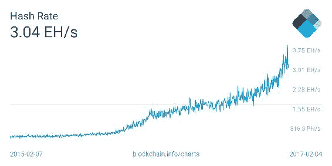

截至 2017 年 6 月 2 日的散列率，显示了两年期间的情况

### 采矿系统

久而久之，比特币矿工用各种方法开采比特币。由于挖掘背后的核心原理是基于 double SHA256 算法，加班矿工开发了复杂的系统来越快地计算散列。以下是对比特币中使用的不同类型的挖掘方法以及它们如何随时间演变的回顾。

### CPU

CPU 挖掘是最初的比特币客户端中第一个可用的挖掘类型。用户甚至可以使用笔记本电脑或台式电脑来挖掘比特币。CPU 挖掘不再有利可图，现在使用更先进的挖掘方法，如基于 ASIC 的挖掘。

### GPU

由于比特币网络难度的增加和寻找更快采矿方法的普遍趋势，矿工们开始使用 PC 中可用的 GPU 或显卡来进行采矿。GPU 支持通常使用 OpenCL 语言编程的更快的并行计算。与 CPU 相比，这是一个更快的选择。用户还使用超频等技术来获得 GPU 能力的最大优势。此外，使用多个图形卡的可能性增加了图形卡用于比特币挖掘的流行程度。然而，GPU 采矿有一些限制，例如过热和需要专门的主板和额外的硬件来容纳多个显卡。

### FPGA

甚至 GPU 采矿也没有持续多久，很快矿工们找到了另一种使用 FPGAs 进行采矿的方法。**现场可编程门阵列** ( **FPGA** )基本上是一个集成电路，可以通过编程来执行特定的操作。FPGAs 通常用**硬件描述语言** ( **HDLs** )编程，比如 Verilog 和 VHDL。Double SHA256 很快成为 FPGA 程序员的一个有吸引力的编程任务，几个开源项目也开始了。与 GPU 相比，FPGA 提供了更好的性能；然而，诸如可访问性、编程难度以及对编程和配置 FPGA 的专业知识的要求等问题导致了比特币挖矿的 FPGA 时代的短暂。此外，ASICs 的出现导致基于 FPGA 的采矿系统迅速被淘汰。在 FPGA 采矿有利可图的时期，开发了 X6500 miner、Ztex 和 Icarus 等采矿硬件。各种 FPGA 制造商，如 Xilinx 和 Altera，生产可用于编程挖掘算法的 FPGA 硬件和开发板。

### ASIC

**专用集成电路** ( **ASIC** )被设计来执行 SHA-256 操作。这些特殊的芯片由不同的制造商出售，并且提供非常高的散列率。这种方法曾经奏效过一段时间，但是由于采矿难度的快速增加，单体 ASICs 不再有利可图。

目前，采矿是个人力所不及的，现在平行使用数千个 ASIC 单元的专业采矿中心向用户提供采矿合同，以代表他们进行采矿。没有技术限制，这就是为什么单个用户不能并行运行数千个 ASICs，但它需要专用的数据中心和硬件，单个人的成本可能会变得令人望而却步。


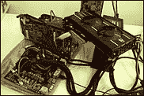

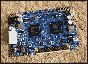


四种类型的挖掘(CPU、GPU、FPGA 和 ASIC)

### 采矿池

当一群矿工一起开采一个区块时，就形成了一个矿池。如果区块被成功开采，则*池管理器*接收 coinbase 交易，然后负责将奖励分配给投入资源开采该区块的一组矿工。这与单独挖掘相比是有利可图的，在单独挖掘中，只有一个单独的挖掘者试图解决部分散列求逆函数(散列难题)，因为在挖掘池中，奖励被支付给池中的每个成员，而不管他们(更具体地说，他们的单个节点)是否解决了难题。

有各种模型，采矿池经理可以使用支付给矿工，如支付每股模型和比例模型。在按份额付费模式中，采矿池管理器向参与采矿活动的所有矿工支付固定费用，而在比例模式中，份额是根据解决哈希难题所花费的计算资源量来计算的。

现在存在许多商业池，它们通过云和易于使用的 web 界面提供采矿服务合同。最常用的有**蚁池**、 **F2Pool** 、【BW.COM】T4。下图显示了所有主要挖掘池的哈希能力比较:

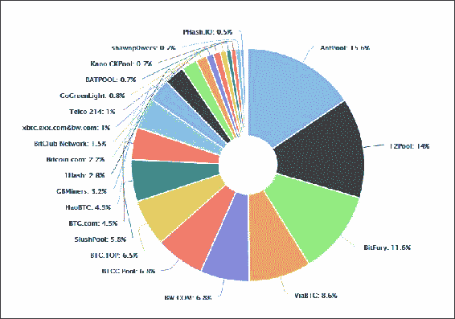

截至 2017 年 6 月 2 日采自 https://blockchain.info/pools 的采矿池及其散列能力(散列率)

如果一个池通过生成超过 51%的比特币网络散列率来控制超过 51%的网络，则挖掘集中化是一个主要问题。正如前面在简介部分讨论的那样，51%攻击可能导致双重支出攻击，它可能影响共识，事实上在比特币网络上强加另一个版本的交易历史。

这种情况在比特币历史上发生过一次，当时 GHash。大型矿池 IO 设法获得了超过 51%的网络容量。学术界提出了两阶段工作证明等理论解决方案，以抑制大型矿池。该方案引入了第二个密码难题，该难题导致挖掘池暴露它们的私钥或者提供它们的挖掘池的相当大一部分散列，从而减少池的整体散列。

各种类型的硬件在商业上可用于采矿目的。目前，最有利可图的是 ASIC 采矿，许多供应商都提供专用硬件。除非花费大量的金钱和精力来建造你自己的采矿设备甚至中心，否则单独采矿现在是没有多少利润的。以目前的难度系数(2016 年 10 月)，如果用户设法生产 12 TH/s 的哈希速率，他们可以希望每天获得 0.01366887 BTC(约 8 美元)，这与购买可以生产 12 TH 的设备所需的投资相比是非常低的。包括电费等运营成本在内，这并不十分有利可图。

## 比特币网络

比特币网络是一个 P2P 网络，其中节点交换交易和区块。网络上有不同类型的节点。有两种主要类型的节点，完整节点和 SPV 节点。顾名思义，完整节点是执行钱包、矿工、完整区块链存储和网络路由功能的比特币核心客户端的实现。然而，没有必要执行所有这些功能。SPV 节点或轻量级客户端仅执行钱包和网络路由功能。比特币协议的最新版本是 70014，随比特币核心客户端 0.13.0 推出。

一些节点更喜欢仅作为完全区块链节点，包含完整的区块链，并执行网络路由功能，但不执行挖掘或存储私钥(钱包功能)。另一种类型是 solo miner 节点，可以执行挖掘，存储完整的区块链，并充当比特币网络路由节点。

有一些非标准但被大量使用的节点被称为池协议服务器。这些节点利用替代协议，例如 stratum 协议。有些节点只执行挖掘功能，称为挖掘节点。仅计算散列的节点使用 stratum 协议向挖掘池提交它们的解决方案。在没有区块链的情况下，运行 SPV 客户端运行钱包和网络路由功能是可能的。

Internet 上的大多数协议都是基于行的，这意味着每一行都由回车符和换行符*分隔。Stratum 也是一种基于线路的协议，它利用普通的 TCP 套接字和人类可读的 JSON-RPC 在节点之间进行操作和通信。*

比特币网络是通过其不同的魔法值来识别的。列表如下所示:


比特币网络的神奇价值

幻值用于指示消息来源网络。

完整节点执行四个功能:钱包、矿工、区块链和网络路由节点。

当一个比特币核心节点启动时，首先，它启动所有对等体的发现。这是通过查询硬编码到比特币核心客户端并由比特币社区成员维护的 DNS 种子来实现的。该查找返回许多 DNS A 记录。默认情况下，比特币协议在主网络的 TCP 端口 8333 上工作，在测试网络的 TCP 端口 18333 上工作。


chainparams.cpp 中的 DNSSeeds

首先，客户端发送一个协议消息 *Version* ，它包含各种字段，比如版本、服务、时间戳、网络地址、nonce 和其他一些字段。远程节点用它自己的版本消息响应，随后在两个节点之间交换 verack 消息，表示连接已经建立。

在此之后， **G** ***etaddr*** 和 ***addr*** 消息被交换以找到客户端不知道的对等体。同时，两个节点中的任何一个都可以发送 ping 消息来查看连接是否仍然有效。

现在可以开始块下载了。如果节点已经使所有块完全同步，那么它使用 *Inv* 协议消息监听新块；否则，它首先检查它是否对 *inv* 消息有响应并且已经有库存。如果是，则使用 ***Getdata*** 协议消息请求块；如果没有，那么它使用 *GetBlocks* 消息请求库存。这种方法一直使用到版本 0.9.3。


协议可视化节点发现

根据比特币核心客户端的版本，初始块下载可以使用块优先或头优先的方法来同步块。“块优先”方法非常慢，从版本 0.10.0 开始就停止使用了。

从版本 0.10.0 开始，引入了名为 headers-first 的初始块下载方法。这带来了重大的性能改进，过去需要几天才能完成的区块链同步现在只需几个小时。核心思想是新节点首先向对等节点请求块头并验证它们。一旦完成，由于完整链的蓝图已经以块头链的形式被下载，所以从所有可用对等体并行请求块。

在这种方法中，当客户端启动时，如果报头链已经同步，则它检查区块链是否已经完全同步；如果没有，这是客户端第一次启动时的情况，它使用 ***getHeaders*** 消息向其他对等体请求报头。如果区块链是完全同步的，它通过 *Inv* 消息监听新块，如果它已经有一个完全同步的头链，那么它使用 *Getdata* 协议消息请求块。该节点还检查报头链是否具有比块更多的报头，然后通过发出 *Getdata* 协议消息来请求块。

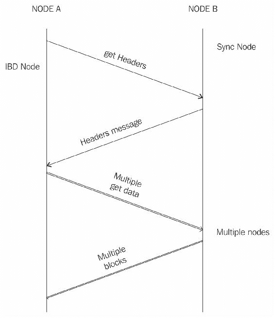

比特币核心客户端> = 0.10.0 标头和块同步，IBD =初始块下载和同步节点是指请求块的节点

`Getblockchaininfo`和`getpeerinfo` RPC 更新了新功能以适应这一变化。一个 RPC， *getchaintips* ，用于列出区块链所有已知的分支。这也包括只有标题的块。`Getblockchaininfo` 用于提供关于区块链当前状态的信息。`Getpeerinfo` 用于列出对等体之间共有的块数和报头。

Wireshark 还可以用来可视化对等体之间的消息交换，并可以作为了解比特币协议的宝贵工具。这里显示了一个示例。这是一个显示版本、verack、getaddr、ping、addr 和 inv 消息的基本示例。

在细节中，可以看到数据包类型、命令名和协议消息结果等有价值的信息。


wireshark 中的示例块消息

这里显示了一个协议图，显示了两个对等体之间的数据流。这可以帮助您了解节点何时启动以及使用了什么类型的消息。

在以下示例中，比特币剖析器用于分析流量并识别比特币协议命令。

在下面的例子中可以看到诸如**版本**、 **getaddr** 和 **getdata** 的消息交换，以及描述消息名称的适当注释。这项练习对于学习比特币非常有用，建议在比特币测试网上进行实验，在测试网上可以通过网络发送各种消息和交易，然后由 Wireshark 进行分析。


总共有 27 种类型的协议消息，但随着协议的增长，它们可能会随着时间的推移而增加。最常用的协议消息及其解释如下:

*   **版本**:这是节点向网络发出的第一条消息，通告其版本和块数。然后，远程节点用相同的信息进行回复，然后建立连接。
*   **Verack :** 这是接受连接请求的版本消息的响应。
*   **Inv:** 这是节点用来宣传它们对块和事务的了解。
*   **Getdata :** 这是对 inv 的响应，请求由其散列标识的单个块或事务。
*   **Getblocks:** 这将返回一个 *inv* 数据包，其中包含从最后一个已知散列或 500 个块之后开始的所有块的列表。
*   **Getheaders :** 用于请求指定范围内的块头。
*   **Tx :** 用于发送事务，作为对 getdata 协议消息的响应。
*   **Block:** 发送一个 Block 来响应 *getdata* 协议消息。
*   **Headers:** 该数据包返回多达 2000 个块头，作为对 getheaders 请求的回复。
*   **Getaddr:** 这是作为请求发送的，以获取关于已知对等体的信息。
*   **Addr:** 这提供了关于网络上节点的信息。它包含 IP 地址和端口号形式的地址和地址列表的数量。
*   **全客户端和 SPV 客户端**:**T3】全客户端是下载整个区块链的胖客户端或全节点；这是将区块链作为客户端进行验证的最安全的方法。比特币网络节点可以在两种基本模式下运行:完全客户端或轻量级 SPV 客户端。SPV 客户端用于验证支付，无需下载完整的区块链。SPV 节点仅保存当前有效的最长区块链的块报头的副本。通过查看 merkle 分支来执行验证，merkle 分支将事务链接到接受事务的原始块。这不是很实际，需要一个更实际的方法，用 BIP37 实现，bloom filters 只用来过滤掉相关的事务。**
*   **布隆过滤器** : 布隆过滤器基本上是一种数据结构(带有索引的位向量)，用于以概率方式测试元素的成员资格。它基本上提供了有假阳性但没有假阴性的概率查找。元素在散列几次后被添加到布隆过滤器，然后通过相应的索引将位向量中的相应位设置为 1。为了检查布隆过滤器中元素的存在，应用相同的散列函数并与位向量中的位进行比较，以查看相同的位是否被设置为 1。不是每个哈希函数(如 SHA1)都适合布隆过滤器，因为它们需要快速、独立和均匀分布。布隆过滤器最常用的哈希函数是 fnv、mumur 和 Jenkins。

这些过滤器主要由简单支付验证 SPV 客户用来请求他们感兴趣的交易和 merkle 块。merkle 块是块的轻量级版本，它包括一个块头、一些散列、一个 1 位标志列表和一个事务计数。这些信息可以用来构建 merkle 树。这是通过创建仅匹配 SPV 客户端所请求的那些事务和块的过滤器来实现的。一旦在对等体之间交换了版本消息并建立了连接，节点就可以根据它们的要求设置过滤器。这些概率过滤器提供了不同程度的隐私或精确度，这取决于它们被设置的精确或松散程度。严格的布隆过滤器将仅过滤节点已经请求的事务，但是代价是可能将用户地址暴露给对手，对手可以将事务与其 IP 地址相关联，从而损害隐私。另一方面，松散设置的过滤器会导致检索更多不相关的事务，但会提供更多的隐私。此外，对于 SPV 客户端，布隆过滤器允许他们使用低带宽，而不是下载所有交易进行验证。

*   **BIP 37** 提出了 bloom filters 的比特币实现，并在比特币协议中引入了三条新消息。
*   **Filterload:** 用于设置连接上的布隆过滤器。
*   **Filteradd:** 向当前过滤器添加新的数据元素。
*   **FilterClear** :删除当前加载的滤镜。

更多细节可以在 BIP37 规范中找到。

## 钱包

钱包软件用于存储私人或公共密钥和比特币地址。它执行各种功能，如接收和发送比特币。如今，软件通常同时提供两种功能:比特币客户端和钱包。在磁盘上，比特币核心客户端钱包存储为 Berkeley DB 文件:

```
:~/.bitcoin$ file wallet.dat

```

`wallet.dat` : Berkeley DB (Btree，版本 9，原生字节顺序)

私钥可以通过不同的方式生成，并由不同类型的钱包使用。钱包不存储任何硬币，也不存在钱包为用户存储余额或硬币的概念。其实在比特币网络中，*币*是不存在的；相反，只有交易信息存储在区块链上(更准确地说，是 UTXO，未用输出)，然后用于计算比特币的数量。

### 钱包类型

在比特币中，有不同类型的钱包可用于存储私钥。作为一个软件程序，它们还向用户提供一些功能来管理和执行比特币网络上的交易。

#### 非确定性钱包

这些钱包包含随机生成的私人钥匙，也被称为*一串钥匙钱包*。比特币核心客户端在首次启动时会生成一些密钥，并在需要时生成密钥。管理大量的钥匙非常困难，并且容易出错的过程会导致硬币被盗和丢失。此外，还需要定期备份钥匙并对其进行适当保护，以防止被盗或丢失。

#### 确定性钱包

在这种类型的钱包中，密钥是通过散列函数从种子值中导出的。这个种子号是随机生成的，通常由人类可读的*助记码*字来表示。助记代码字在 BIP39 中定义。这个短语可用于恢复所有密钥，并使私钥管理相对容易。

#### 分级确定性钱包

在 BIP32 和 BIP44 中定义，HD wallets 将密钥存储在从种子派生的树结构中。种子生成父密钥(主密钥)，用于生成子密钥，然后生成孙密钥。高清钱包中的密钥生成不直接生成密钥；相反，它会产生一些信息(私钥生成信息)，这些信息可用于生成一系列私钥。如果主私钥是已知的，则 HD 钱包中私钥的完整层次结构是容易恢复的。正是由于这一特性，高清钱包非常易于维护，并且具有很高的便携性。

#### 大脑钱包

主私钥也可以从记忆的密码散列中导出。关键思想是，该密码短语用于导出私钥，并且如果在 HD 钱包中使用，这可以产生从单个记忆的密码导出的全 HD 钱包。这就是所谓的大脑钱包。这种方法容易受到密码猜测和暴力攻击，但是像*键拉伸*这样的技术可以用来减缓攻击者的进度。

#### 纸质钱包

顾名思义，这是一个纸质钱包，上面印有所需的密钥材料。它需要物理安全来存储。纸质钱包可以在网上从各种服务提供商那里产生，比如 https://bitcoinpaperwallet.com/的[、https://www.bitaddress.org/的](https://bitcoinpaperwallet.com/)或者 T2 的。

#### 硬件钱包

另一种方法是使用防篡改设备来存储密钥。这种防篡改设备可以定制，或者随着支持 NFC 的手机的出现，这也可以成为 NFC 手机中的**安全元素** ( **SE** )。Trezor 和 Ledger 钱包(各种类型)是最常用的比特币硬件钱包。


保险库 Wallet

#### 在线钱包

在线钱包，顾名思义，完全在线存储，通常通过云作为服务提供。它们为用户提供了一个 web 界面来管理他们的钱包，并执行各种功能，如支付和接收付款。它们易于使用，但意味着用户信任在线钱包服务提供商。

#### 手机钱包

手机钱包，顾名思义，安装在移动设备上。他们可以提供各种支付方式，最明显的是使用智能手机摄像头快速扫描二维码并进行支付的能力。移动钱包可用于 Android 平台和 iOS，例如，breadwallet、copay 和 Jaxx。


Jaxx 手机钱包

# 比特币支付

可以使用各种技术接受比特币作为支付手段。比特币在许多司法管辖区不被承认为法定货币，但它正越来越多地被许多在线商家和电子商务网站接受为一种支付方式。买家可以通过多种方式向接受比特币的商家付款。例如，在网上商店中，可以使用比特币商家解决方案，而在传统的实体店中，可以使用销售点终端和其他专门的硬件。客户只需扫描带有卖家支付 URI 的二维码，就可以使用他们的移动设备进行支付。比特币 URIs 允许用户只需点击链接或扫描二维码就能付款。 **URI** ( **统一资源标识符**)基本上是一个表示交易信息的字符串。它是在 BIP21 中定义的。QR 码可以显示在销售终端附近。几乎所有的比特币钱包都支持这一功能。

商家可以使用下面的截图来宣传他们可以接受比特币作为支付方式。


此处接受比特币标志

各种支付解决方案，如 xbtterminal 和 34 字节比特币 POS 终端已商用。

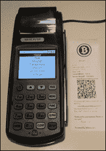

34 字节 POS 解决方案。

许多在线服务提供商提供的比特币支付处理器允许与电子商务网站集成。一个简单的互联网搜索可以显示许多选项。

为了引入和标准化比特币支付，各种 bip 已经被提出并最终确定。最值得注意的是，BIP 70(安全支付协议)描述了商家和客户之间的安全通信协议。该协议使用 X.509 证书进行身份验证，并通过 HTTP 和 HTTPS 运行。这个协议中有三个消息:PaymentRequest、Payment 和 PaymentACK。该方案的主要特点是抵御中间人攻击和安全的支付证明。中间人攻击可能会导致这样的情况:攻击者坐在商家和买家之间，在买家看来，他们似乎在与商家交谈，但实际上，中间人正在与买家而不是商家进行交互。这可能导致商家的比特币地址被操纵，从而欺骗买家。

其他几个 BIP，如 BIP71 和 BIP72，也被提出来标准化支付消息封装和 URI 方案以支持 BIP70。

比特币闪电网络是一种可扩展的离线即时支付解决方案，于 2016 年初推出，允许区块链以外的支付。该网络利用区块链的支付渠道。这使得比特币具有更高的速度和可扩展性。该论文可在[https://lightning . network/](https://lightning.network/)获得，并且鼓励感兴趣的读者阅读该论文，以便理解本发明背后的理论和基本原理。

## 比特币投资和买卖比特币

有许多在线交易所，用户可以在那里买卖比特币。现在这是互联网上的一项大业务，它提供比特币交易、差价合约、点差交易、保证金交易和各种其他选择。当比特币的价格上涨或下跌时，交易者可以购买比特币或通过建立多头或空头头寸进行交易，以获利。其他几个功能，比如把比特币换成其他虚拟货币也是可以的，很多网上的比特币交易所都提供这个功能。还提供高级市场数据、交易策略、图表和支持交易者的相关数据。一个例子来自 CEX。IO 这里。其他交易所也提供类似的服务。

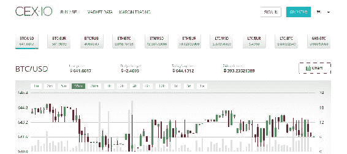

比特币交易所 cex.io 的例子

下面的屏幕截图显示了交易所的订单簿，其中列出了所有的买卖订单:


交易所 cex.io 的比特币订单示例

## 比特币安装

比特币核心客户端可以从[https://bitcoin.org/en/download](https://bitcoin.org/en/download)安装。这适用于从 x86 windows 到 ARM Linux 的不同体系结构和平台，如下图所示:

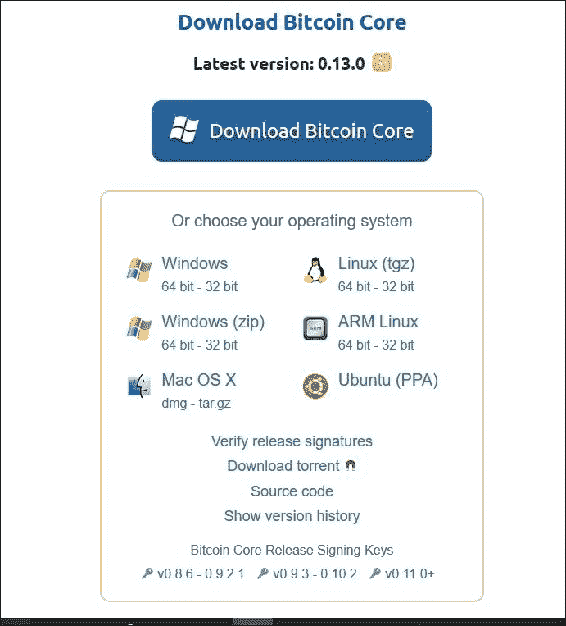

### 设置比特币节点

这里展示了 Ubuntu 上比特币核心安装的运行示例；其他平台，可以从[www.bitcoin.org](http://www.bitcoin.org/)了解详情。


第二步:

```
drequinox@drequinox-OP7010:~$ sudo apt-get update

```

根据所需的客户端，用户可以使用以下命令之一，也可以同时发出这两个命令:

```
sudo apt-get install bitcoind
sudo apt-get install bitcoin-qt
drequinox@drequinox-OP7010:~$ sudo apt-get install bitcoin-qt bitcoind
Reading package lists... Done
Building dependency tree
Reading state information... Done
.......

```

### 设置源代码

如果用户希望参与比特币代码或出于学习目的，可以下载和编译比特币源代码。Git 可以用来下载比特币的源代码:

```
$ sudo apt-get install git 
$ mkdir bcsource 
$ cd bcsource 
drequinox@drequinox-OP7010:~/bcsource $ git clone https://github.com/bitcoin/bitcoin.git 
Cloning into 'bitcoin'... 
remote: Counting objects: 78960, done. 
remote: Compressing objects: 100% (3/3), done. 
remote: Total 78960 (delta 0), reused 0 (delta 0), pack-reused 78957 
Receiving objects: 100% (78960/78960), 72.53 MiB | 1.85 MiB/s, done. 
Resolving deltas: 100% (57908/57908), done. 
Checking connectivity... done. 
drequinox@drequinox-OP7010:~/bcsource$

```

将目录更改为比特币:

```
drequinox@drequinox-OP7010:~/bcsource$ cd bitcoin

```

完成前面的步骤后，可以编译代码了:

```
drequinox@drequinox-OP7010:~/bcsource/bitcoin$ ./autogen.sh 
drequinox@drequinox-OP7010:~/bcsource/bitcoin$ ./configure.sh 
drequinox@drequinox-OP7010:~/bcsource/bitcoin$ make 
drequinox@drequinox-OP7010:~/bcsource/bitcoin$ sudo make install

```

### 设置比特币. conf

`bitcoin.conf` file 是比特币核心客户端用来保存配置设置的配置文件。除了`-conf`开关之外，bitcoind 客户端的所有命令行选项都可以在配置文件中设置，当 bitcoin-qt 或 bitcoind 启动时，它将从该文件中获取配置信息。

在 Linux 系统中，这通常可以在`$HOME/.bitcoin/`中找到，或者也可以在命令行中使用 `-conf=<file>`开关来指定 bitcoind 核心客户端软件。

### 启动测试网络中的一个节点

如果您想测试比特币网络并运行一个实验，可以在 testnet 模式下启动比特币节点。与实时网络相比，这是一个更快的网络，并且放宽了采矿和交易规则。

比特币测试网提供各种水龙头服务。一个例子是比特币 testnet 沙盒，用户可以请求将比特币支付到他们的 TestNet 比特币地址。这可以通过[https://testnet.manu.backend.hamburg/](https://testnet.manu.backend.hamburg/)访问。这对于在测试网上进行交易实验非常有用。

启动测试网络的命令行如下:

```
bitcoind --testnet -daemon 
bitcoin-cli --testnet <command> 
bitcoin-qt --testnet

```

### 在 regtest 中启动一个节点

regtest 模式(回归测试模式)可用于创建本地区块链以进行测试。

以下命令可用于在 reg 测试模式下启动节点:

```
bitcoind -regtest -daemon 
Bitcoin server starting

```

可以使用以下命令生成块:

```
bitcoin-cli -regtest generate 200

```

相关的日志消息可以在 Linux 系统上的`.bitcoin/regtest`目录中的`debug.log`下查看。


块生成后，余额可按如下方式查看:

```
drequinox@drequinox-OP7010:~/.bitcoin/regtest$ bitcoin-cli -regtest getbalance 
8750.00000000

```

可以使用以下命令停止节点:

```
drequinox@drequinox-OP7010:~/.bitcoin$ bitcoin-cli -regtest stop 
Bitcoin server stopping

```

### 启动 live mainnet 中的节点

*Bitcoind* 是可以作为守护进程运行的核心客户端软件，它提供了 JSON RPC 接口。*比特币-cli* 是命令行功能丰富的工具，用于与守护进程进行交互；然后，守护程序与区块链交互并执行各种功能。Bitcoin-cli 仅调用 JSON-RPC 函数，并且不会在区块链上自行执行任何操作。

*比特币-qt* 是比特币核心客户端 GUI。当钱包软件首次启动时，它会验证磁盘上的块，然后启动并显示以下 GUI:

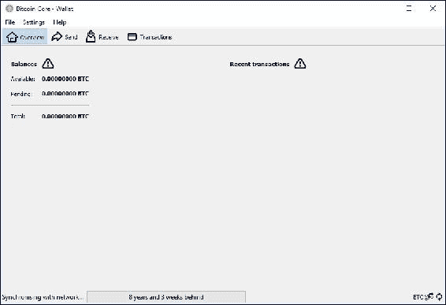

比特币核心 QT 客户端，刚安装完，显示区块链不同步

验证过程不是特定于比特币-qt 客户端的；它也由 *bitcoind* 客户端执行。

### 体验比特币-cli

比特币 cli 是比特币核心客户端提供的命令行界面，可用于通过比特币核心客户端提供的 RPC 界面执行各种功能。

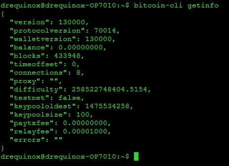

比特币-cli getinfo 的运行示例；相同的格式可用于调用其他命令

通过以下命令可以显示所有命令的列表:


Testnet bitcoin-cli，这只是输出的前几行，实际输出有许多命令

*   **HTTP REST** : 从比特币核心客户端 0.10.0 开始，HTTP REST 接口也可用。默认情况下，它运行在与 JSON-RPC 相同的 TCP 端口 8332 上。

## 比特币编程和命令行界面

比特币编程现在是一个非常丰富的领域。比特币核心客户端公开了各种 JSON RPC 命令，这些命令可用于构建原始交易，并通过自定义脚本或程序执行其他功能。此外，还提供了命令行工具 Bitcoin-cli，它利用了 JSON-RPC 接口，并提供了丰富的工具集来处理比特币。

这些 API 也可以通过许多在线服务提供商以比特币 API 的形式获得，它们提供了一个简单的 HTTP REST 接口。比特币 API，如`blockchain.info`和 bitpay、block.io 等，为开发基于比特币的解决方案提供了无数选择。

各种库可用于比特币编程。列表如下所示，如果您感兴趣，可以进一步探索这些库。

**Libbitcoin** :在 https://libbitcoin.dyne.org/[可用](https://libbitcoin.dyne.org/)，提供强大的命令行实用程序和客户端。 **Pycoin** :可在[https://github.com/richardkiss/pycoin](https://github.com/richardkiss/pycoin)获得，是 Python 的一个库。

Bitcoinj:这个库可以在 https://bitcoinj.github.io/的 T2 获得，并且是用 Java 实现的。

网上有很多比特币 API 可用；最常用的 API 如下所示:

[https://bit coir . io/](https://bitcore.io/)

[https://bit coins . org/](https://bitcoinjs.org/)

https://blockchain.info/api 所有的 API 都提供或多或少相同类型的功能，很难选择哪种 API 是最好的。

## 比特币改进提案(BIPs)

这些文档用于向比特币社区提议或告知所建议的改进、设计问题或关于比特币生态系统某些方面的信息。有三种类型的比特币改进提案，缩写为 BIPs:

*   **标准 BIP** :用于描述对比特币系统产生重大影响的重大变化，例如，块大小变化、网络协议变化或交易验证变化。
*   **流程 BIP** :标准 BIP 和流程 bip 的主要区别在于，标准 bip 涵盖协议变更，而流程 bip 通常处理核心比特币协议之外的流程变更提议。这些只有在比特币用户达成共识后才能实施。
*   **信息 BIP** :这些通常只是用来建议或记录一些关于比特币生态系统的信息，比如设计问题。

# 总结

本章介绍了比特币及相关概念。先从比特币相关的一些历史和基本定义说起。引入了密钥和地址以及公钥和私钥等概念。还讨论了比特币网络中的交易工作方式(以及脚本、操作码和交易类型等相关概念)。此外，支撑比特币网络的区块链也被引入。与此同时，相关的概念，如挖掘，工作证明，挖掘系统和钱包被提出。最后，还提供了一些关于设置比特币客户端、比特币 cli 的使用以及不同比特币网络介绍的实用信息。在下一章，将介绍替代货币和相关概念。