# 第七章。以太坊 101

这一章是对区块链以太坊的介绍。将向您介绍以太坊背后的基本原理和高级理论概念。将详细讨论与以太坊区块链相关的各种组件、协议和算法，以便你能理解区块链范式背后的理论。此外，本章还将对钱包软件、挖掘和设置以太坊节点进行实用而深入的介绍。还将介绍一些关于各种挑战的材料，例如以太坊所面临的安全性和可伸缩性。此外，还将讨论交易和市场动态。

# 简介

以太坊是由 Vitalik Buterin 于 2013 年 11 月提出的概念。提出的关键思想是开发一种图灵完备语言，允许为区块链和分散应用程序开发任意程序(智能契约)。这与比特币形成对比，比特币的脚本语言非常有限，只允许基本和必要的操作。

## 以太坊客户端和版本

使用不同语言开发了各种以太坊客户端，目前最流行的是 go-Ethereum 和 parity。go-Ethereum 是用 Golang 开发的，而奇偶校验是用 Rust 建立的。也有其他可用的客户端，但通常情况下，称为 *geth* 的 go-Ethereum 客户端足以满足所有用途。Mist 是一个用户友好的**图形用户界面** ( **GUI** )钱包，它在后台运行 geth 以与网络同步。这方面的更多细节将在本章后面的安装和挖掘部分提供。

以太坊的第一个版本被称为 *Frontier* ，以太坊的当前版本被称为 *homestead release* 。下一个版本被命名为 metropolis，它专注于协议简化和性能改进。最终版本被命名为 *serenity* ，预计将实现一个利害关系证明算法(Casper)。serenity 的其他研究领域包括可伸缩性、隐私和**以太坊虚拟机** ( **EVM** )升级。由于这是一个持续的开发工作，以太坊生态系统将经历不断的改进和发展，serenity 不应真正被视为最终版本，而是持续改进的漫长旅程中的一个重要里程碑。预计会有更多的版本，但是还没有命名。web 3.0 的愿景*已经提出，并且正在社区中讨论。Web 3.0 是一个概念，它基本上提出了语义和智能 Web，作为现有 web 2.0 技术的演进。这是一个生态系统的愿景，其中人、应用程序、数据和 web 都连接在一起，并且能够以智能的方式相互交互。随着区块链技术的出现，去中心化网络的想法也出现了，这实际上是互联网的最初设想。核心思想是互联网上的所有主要服务，如 DNS、搜索引擎和身份，都将在 web 3.0 中去中心化。这就是以太坊作为一个平台可以帮助实现这一愿景的地方。*

## 以太坊栈

以太坊堆栈由各种组件组成。核心是运行在 P2P 以太网上的以太坊区块链。其次，有一个以太坊客户端(通常是 geth)运行在节点上，并连接到对等以太坊网络，从这里下载区块链并存储在本地。它提供了各种功能，如挖掘和帐户管理。区块链的本地副本定期与网络同步。另一个组件是`web3.js`库，它允许通过**远程过程调用** ( **RPC** )接口与 geth 交互。

这可以在下图中看到:


以太坊堆栈显示了各种组件

# Ethereum blockchain

以太坊，就像任何其他区块链一样，可以被视为基于事务的状态机。这是*加文·伍德*博士写的以太坊黄皮书中提到的。其思想是通过增量执行事务，将起源状态转换为最终状态。最终的转变然后被接受为国家的绝对无可争议的版本。在下图中，显示了以太坊状态转换函数，其中事务执行导致了状态转换。


以太坊状态转移函数

在前面的例子中，开始从**地址 4718bf7a** 向**地址 741f7a2** 传输 2 个以太网。初始状态表示事务执行前的状态，最终状态是变形后的状态。这将在本章后面更详细地讨论，但是这个例子的目的是介绍以太坊中状态转换的核心思想。

## 货币(ETH 和 ETC)

作为对矿工的激励，以太坊还奖励其本国货币以太，缩写为 ETH。在 DAO hack(稍后描述)之后，为了缓解这个问题，提出了一个硬 fork 因此，现在有两个以太坊区块链:一个被称为以太坊经典，其货币由 ETC 代表，而硬分叉版本是 ETH，它继续增长，并正在积极开发。然而，ETC 有自己的追随者，一个致力于进一步发展 ETC 的社区，它是以太坊的非工作的原始版本。本章主要介绍 ETH，它是目前最活跃和最官方的以太坊区块链。

## 叉子

在 homestead 的最新版本中，由于主要的协议升级，导致了硬分叉。该协议在块号 1，150，000 处升级，导致从称为 Frontier 的第一版以太坊迁移到称为 homestead 的第二版以太坊。

最近一次发生在 2016 年 11 月 24 日 14:12:07 UTC 的无意分叉是由于 geth 客户端的日志机制出现了 bug。网络分叉发生在块号 2，686，351 处。这个 bug 导致 geth 无法在空的情况下恢复空的帐户删除。这在奇偶校验(另一个流行的以太坊客户端)中不是问题。这意味着从块号 2686351 开始，以太坊区块链被一分为二，一个运行奇偶校验客户端，另一个运行 geth。geth 1 . 5 . 3 版解决了这个问题。

## 气体

以太坊的另一个关键概念是气体。以太坊区块链上的所有交易都需要支付它们所执行的计算的成本。成本由一种名为*气体*或*加密燃料*的东西支付，这是以太坊推出的新概念。这笔作为*执行费*的气体由交易发起者预先支付。每次操作都会消耗*燃料*。每个操作都有一个预定义的气体量。每个事务指定了它执行时愿意消耗的气体量。如果它在执行完成之前耗尽了*的气体*，那么事务执行的任何操作都将被回滚。如果交易成功执行，则任何剩余的气体被退还给交易发起者。

这一概念不应与采矿费混淆，后者是一个不同的概念，用于向矿工支付*气*作为费用。本章后面将提供有关气体和操作的概念和计算的更多信息。

## 共识机制

以太坊中的共识机制基于 2013 年 12 月由*佐哈尔*和*索波林斯基*最初提出的幽灵协议。对此感兴趣的朋友可以在 http://eprint.iacr.org/2013/881.pdf 的[查看详细的原文。](http://eprint.iacr.org/2013/881.pdf)

以太坊使用这种协议的一个简单版本，在这个版本中，为了构建它而花费最多计算量的链被标识为确定版本。另一种看待它的方式是找到最长的链，因为最长的链一定是通过消耗足够的采矿努力建立的。**贪婪最重观察子树** ( **幽灵**)最初是作为一种机制引入的，以缓解由于快速块生成时间导致陈旧或孤儿块而产生的问题。在 GHOST 中，陈旧的块被添加到计算中，以计算出最长和最重的块链。陈腐的街区在以太坊里被称为大叔或者奥姆。

下图显示了最长和最重链条之间的快速比较:

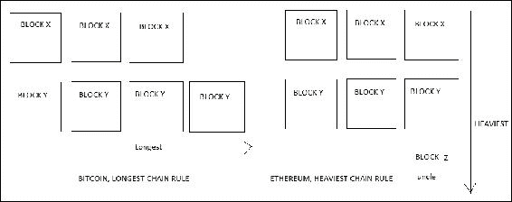

最长和最重的链条

## 世界状态

以太坊中的世界状态代表以太坊区块链的全球状态。它基本上是以太坊地址和账户状态之间的映射。地址长度为 20 字节。这个映射是一个使用**递归长度前缀**(**)序列化的数据结构。RLP 是一种专门开发的编码方案，在以太坊中用于序列化二进制数据以供存储或通过网络传输，以及将状态保存在 Patricia 树中。RLP 函数将一个项目作为输入，它可以是一个字符串或一列项目，并产生适合存储和通过网络传输的原始字节。RLP 不对数据进行编码；相反，它的主要目的是对结构进行编码。**

 **### 账户状态

帐户状态由四个字段组成:nonce、balance、storageroot 和 codehash，下面将详细描述。

#### 现在

该值在每次从该地址发送交易时递增。对于合约账户，它表示该账户创建的合约数量。合约账户是以太坊中存在的两种账户类型之一；它们将在本章后面更详细地解释。

#### 平衡

该值表示 Weis 的数量，Weis 是地址持有的以太币(以太)的最小单位。

#### Storageroot

此字段表示 Merkle Patricia 树的根节点，该树对客户的存储内容进行编码。

#### 代码页

这是一个不可变的字段，包含与帐户相关联的智能合约代码的散列。对于普通帐户，该字段包含空字符串的 Keccak 256 位哈希。该代码通过消息调用来调用。

世界状态及其与帐户 trie、帐户和块头的关系可以在下图中看到。它在图的中间显示了 account 数据结构，该结构包含从左边显示的 account 存储 trie 的根节点派生的存储根散列。然后在世界状态 trie 中使用帐户数据结构，世界状态 trie 是地址和帐户状态之间的映射。最后，使用 Keccak 256 位算法散列世界状态 trie 的根节点，并使其成为块报头数据结构的一部分，这在图的右侧显示为状态根散列。


帐户 trie(帐户的存储内容)、帐户元组、世界状态 trie 和状态根 hash 以及它们的关系

帐户 trie 基本上是一棵 Merkle Patricia 树，用于对帐户的存储内容进行编码。内容存储为 256 位整数键的 keccak 256 位散列到 RLP 编码的 256 位整数值之间的映射。

## 交易

以太坊中的交易是使用私钥的数字签名数据包，其中包含指令，当完成时，会导致消息调用或合同创建。根据产生的输出，事务可以分为两种类型:

*   **消息调用事务**:该事务只是产生一个消息调用，用于将消息从一个帐户传递到另一个帐户。
*   **合同创建事务**:顾名思义，这些事务导致新合同的创建。这意味着当该交易成功执行时，它会创建一个具有相关代码的帐户。

这两个事务都由一些公共字段组成，这里将对它们进行描述。

### 现在

Nonce 是一个数字，发送方每发送一次交易，它就增加 1。它必须等于发送的事务数，并用作事务的唯一标识符。nonce 值只能使用一次。

### 燃气轮机

`gasPrice`字段表示执行交易所需的 Wei 的数量。

### 气体限制

`gasLimit`字段包含代表为了执行交易可以消耗的最大气体量的值。气体和气体极限的概念将在本章后面更详细地介绍。现在，可以说这是用户(例如，交易的发送者)愿意为计算支付的费用。

### 到

顾名思义，`to`字段是一个表示交易接收方地址的值。

### 值

`Value`表示要转移给接收方的魏总数；在合约账户的情况下，这代表合约将持有的余额。

### 签名

签名由三个字段组成，分别是 *v* 、 *r* 和 *s* 。这些值代表数字签名( *R* ， *S* )和一些可以用来恢复公钥的信息( *V* )。也是交易的一部分，从中也可以确定交易的发送者。该签名基于 ECDSA 方案，并利用了 SECP256k1 曲线。在[第 3 章](03.html "Chapter 3. Cryptography and Technical Foundations")、*密码学和技术基础*中讨论了椭圆曲线密码的理论。在这一节中，ECDSA 将在以太坊中的使用环境中介绍。

*V* 是描述椭圆曲线点的大小和符号的单字节值，可以是 27 或 28。 *V* 在 ECDSA 回收合同中用作回收 ID。该值用于从私钥中恢复(导出)公钥。在 secp256k1 中，恢复 ID 应为 0 或 1。在以太坊，这是抵消了 27。本章稍后将提供关于 ECDSARECOVER 函数的更多详细信息。

*R* 由曲线上的计算点得出。首先，选取一个随机数，与曲线的生成器相乘，计算出曲线上的一个点。该点的 *x* 坐标部分为 *R* 。 *R* 编码为 32 字节序列。 *R* 必须大于 0 且小于 secp256k1n 限值(115792089237316195423570985008687907852837564279074904382605163141518161494337)。

通过将 *R* 乘以私钥并将其添加到要签名的消息的散列中，最后将其除以选择来计算 *R* 的随机数，来计算 *S* 。 *S* 也是 32 字节序列。 *R* 和 *S* 一起代表签名。

为了对一个事务进行签名，使用了`ECDSASIGN`函数，该函数将待签名的消息和私钥作为输入，产生 *V* ，一个单字节值； *R* ，一个 32 字节的值，以及 *S* ，另一个 32 字节的值。方程式如下:

*ecds assign(消息，私钥)= (V，R，S)*

### 初始化

`Init`字段仅用于旨在创建合同的交易。这表示一个无限长的字节数组，它指定了要在帐户初始化过程中使用的 EVM 代码。包含在该字段中的代码仅在第一次创建帐户时执行一次，并在此后立即销毁。

`Init`还返回另一个名为 *body* 的代码段，该代码段持续存在并运行，以响应合同帐户可能收到的消息调用。这些消息调用可以通过事务或内部代码执行来发送。

### 数据

如果事务是一个消息调用，那么使用`data`字段代替`init`，它代表消息调用的输入数据。它的大小也没有限制，被组织成一个字节数组。

这可以在下图中看到，其中一个事务是前面提到的字段的元组，然后包含在由要包含的事务组成的事务 trie(一个修改的 Merkle-Patricia 树)中。最后，使用 Keccak 256 位算法对事务 trie 的根节点进行散列，并将其与块中的事务列表一起包含在块头中。

事务可以在事务池或块中找到。当挖掘节点开始其验证块的操作时，它从事务池中支付最高的事务开始，并逐个执行它们。当达到 gas 限制或事务池中不再有要处理的事务时，挖掘开始。在这个过程中，该块被重复散列，直到找到有效的随机数，该随机数一旦与该块散列，就产生小于难度目标的值。一旦区块开采成功，将立即向网络广播，声称成功，并将被网络验证和接受。这个过程类似于上一章讨论的比特币的挖矿过程。唯一的区别是，以太坊的工作证明算法是抗 ASIC 的，称为 *Ethash* ，其中找到一个随机数需要很大的内存。

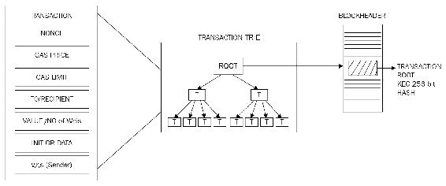

事务、事务 trie 和块头之间的关系

## 合同创建交易

创建帐户时需要几个基本参数。这些参数如下所示:

*   发报机
*   原始翻译者
*   可用气体
*   天然气价格
*   禀赋，即最初分配的乙醚量
*   任意长度的字节数组
*   初始化 EVM 代码
*   消息调用/协定创建堆栈的当前深度(当前深度表示堆栈中已经存在的项目数)

合同创建交易产生的地址长度为 160 位。准确地说，如黄皮书中所定义的，它们是仅包含发送者和随机数的结构的 RLP 编码的 Keccak 散列的最右边的 160 位。最初，帐户中的随机数被设置为零。帐户的余额被设置为传递给合同的值。存储也被设置为空。代码哈希是 Keccak 空字符串的 256 位哈希。

当执行 EVM 代码(初始化 EVM 代码)时，账户被初始化。在代码执行期间的任何异常情况下，例如没有足够的气体，状态不会改变。如果执行成功，则在支付适当的汽油费用后创建账户。以太坊(homestead)的当前版本规定，合同交易的结果要么是一个带有余额的新合同，要么是没有价值转移的新合同没有被创建。这与以前的版本形成对比，在以前的版本中，无论契约代码部署是否成功，都可以创建契约。

## 消息调用交易

消息调用需要几个参数来执行，如下所示:

*   发报机
*   交易发起者
*   接受者
*   要执行其代码的帐户
*   可用气体
*   价值
*   天然气价格
*   任意长度字节数组
*   呼叫的输入数据
*   消息调用/协定创建堆栈的当前深度

消息调用导致状态转换。消息调用还会产生输出数据，如果执行事务，则不会使用这些数据。在消息调用由 VM 代码触发的情况下，使用事务执行产生的输出。

下图显示了两种类型的事务处理之间的分离:

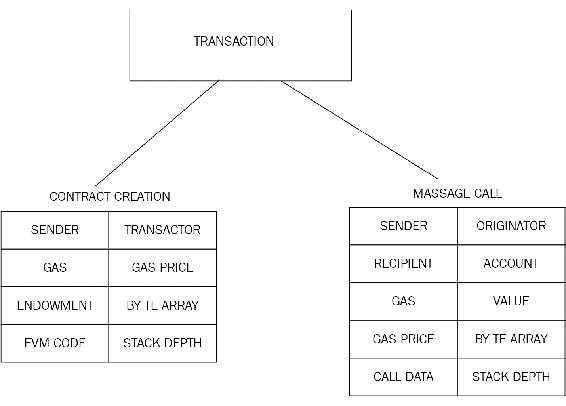

交易类型、执行所需的参数

# 以太坊的元素区块链

在接下来的部分，你将被介绍以太坊网络和区块链的各种组件。首先，EVM 的基本概念将在下一节给出。

## 以太坊虚拟机(EVM)

EVM 是一个简单的基于堆栈的执行机器，它运行字节码指令，以便将系统状态从一种状态转换到另一种状态。虚拟机的字长设置为 256 位。堆栈大小限制为 1024 个元素，并基于 **LIFO** ( **后进先出**)队列。EVM 是一台图灵完全机器，但受到运行任何指令所需气体量的限制。这意味着由于 gas 要求，可能导致拒绝服务攻击的无限循环是不可能的。EVM 还支持在发生异常的情况下进行异常处理，例如没有足够的气体或无效的指令，在这种情况下，机器会立即停止并将错误返回给执行代理。

EVM 是一个完全隔离的沙盒运行时环境。在 EVM 上运行的代码不能访问任何外部资源，比如网络或文件系统。

如前所述，EVM 是一种基于堆栈的架构。EVM 的设计是大端的，它使用 256 位宽的字。这个字长允许 Keccak 256 位散列和椭圆曲线加密计算。

有两种类型的存储可供合同和 EVM。第一个叫做内存，是一个字节数组。当一个协定完成代码执行时，内存被清除。它类似于 RAM 的概念。另一种叫做储存，永久储存在区块链上。这是一个关键价值商店。

内存是无限的，但受到汽油费要求的限制。与虚拟机相关联的存储是一个字可寻址的字阵列*,它是非易失性的，并且作为系统状态的一部分来维护。键和值的大小和存储空间是 32 字节。程序代码存储在**虚拟只读存储器** ( **虚拟 ROM** )中，可使用 CODECOPY 指令访问。CODECOPY 指令用于将程序代码复制到主存储器中。最初，EVM 中的所有存储和内存都被设置为零。*

下图显示了 EVM 的设计，其中虚拟 ROM 存储使用 **CODECOPY** 复制到主内存中的程序代码。然后，EVM 通过参考程序计数器来读取主存储器，并逐步执行指令。程序计数器和 EVM 堆栈随着每次指令执行而相应地更新。


EVM 行动

EVM 优化是一个活跃的研究领域，最近的研究表明，EVM 可以被优化和调整到非常精细的程度，以实现高性能。使用 **Web 组件**(**)的可能性研究已经在进行中。WASM 是由 Google、Mozilla 和 Microsoft 开发的，现在正被 W3C 社区组织设计为一个开放标准。WASM 的目标是能够在浏览器中运行机器码，从而以本机速度执行。类似地，EVM 2.0 的目标是能够在 CPU 中本地运行 EVM 指令集(操作码)，从而使其更快更高效。**

 **### 执行环境

为了执行代码，执行环境需要一些关键元素。关键参数由执行代理提供，例如事务。这些因素如下:

1.  拥有执行代码的帐户的地址。
2.  事务发送者的地址和该执行的起始地址。
3.  启动执行的交易中的天然气价格。
4.  输入数据或交易数据，取决于执行代理的类型。这是一个字节数组；在消息调用的情况下，如果执行代理是一个事务，则事务数据作为输入数据包含在内。
5.  启动代码执行的帐户或交易发送方的地址。在代码执行由事务发起的情况下，这是发送者的地址；否则就是账户的地址。
6.  价值或交易价值。这是以魏为单位的金额。如果执行代理是一个事务，那么它就是事务值。
7.  要执行的代码以一个字节数组的形式出现，迭代器函数在每个执行周期中获取这个数组。
8.  当前块的块头
9.  当前正在执行的消息调用或协定创建事务的数量。换句话说，这是当前正在执行的调用或创建的数量。

执行环境可以被视为一个由九个元素组成的元组，如下所示:


执行环境元组

除了前面提到的九个字段，系统状态和剩余气体也被提供给执行环境。执行导致产生结果状态、执行后剩余气体、自毁或自杀设置(稍后描述)、对数序列(稍后描述)以及任何气体退款。

#### 机器状态

机器状态也由 EVM 在内部维护。在 EVM 的每个执行周期之后，机器状态被更新。虚拟机中运行一个迭代器函数(下一节将详细介绍),它输出状态机单个周期的结果。机器状态是由以下元素组成的元组:

*   可用气体
*   程序计数器，最大为 256 的正整数
*   存储内容
*   内存中的活动单词数
*   堆栈的内容

EVM 旨在处理异常，并将在出现以下任何异常时暂停(停止执行):

*   没有足够的执行所需的气体
*   无效指令
*   堆栈项目不足
*   跳转操作码的目标无效
*   无效的堆栈大小(大于 1024)

#### 迭代器函数

前面提到的迭代器函数执行各种重要的函数，这些函数用于设置机器的下一个状态，并最终设置世界状态。这些功能包括以下内容:

*   它从执行环境中存储机器代码的字节数组中获取下一条指令。
*   它相应地从堆栈中添加/移除(推送/弹出)项目。
*   根据指令/操作码的气体成本减少气体。
*   增加**程序计数器** ( **PC** )。

机器状态可视为下图所示的元组:


机器状态元组

如果在执行周期中遇到停止、自杀或返回操作码，虚拟机也能够在正常情况下暂停。

用高级语言编写的代码，如 serpent、LLL 或 Solidity，被转换成 EVM 理解的字节码，以便由 EVM 执行。Solidity 是为以太坊开发的高级语言，带有 JavaScript，如语法，为智能合约编写代码。一旦代码编写完成，它就会被编译成 EVM 可以理解的字节码，使用的是名为 solc 的 Solidity 编译器。

**LLL** ( **类似 Lisp 的低级语言**)是另一种用于编写智能合同代码的语言。Serpent 是一种类似 Python 的高级语言，可以用来编写以太坊的智能合约。

例如，solidity 中的一个简单程序如下所示:

```
pragma solidity ^0.4.0; 
contract Test1
 { 
    uint x=2; 
    function addition1(uint x) returns (uint y) { 
    y=x+2; 
 } 
}  

```

这个程序被转换成字节码，如下所示。如何编译 solidity 代码的细节和例子将在下一章给出。

#### 运行时字节码

```
606060405260e060020a6000350463989e17318114601c575b6000565b346000576029600435603b565b60408051918252519081900360200190f35b600281015b91905056 
Opcodes PUSH1 0x60 PUSH1 0x40 MSTORE PUSH1 0x2 PUSH1 0x0 SSTORE CALLVALUE PUSH1 0x0 JUMPI JUMPDEST PUSH1 0x45 DUP1 PUSH1 0x1A PUSH1 0x0 CODECOPY PUSH1 0x0 RETURN PUSH1 0x60 PUSH1 0x40 MSTORE PUSH1 0xE0 PUSH1 0x2 EXP PUSH1 0x0 CALLDATALOAD DIV PUSH4 0x989E1731 DUP2 EQ PUSH1 0x1C JUMPI JUMPDEST PUSH1 0x0 JUMP JUMPDEST CALLVALUE PUSH1 0x0 JUMPI PUSH1 0x29 PUSH1 0x4 CALLDATALOAD PUSH1 0x3B JUMP JUMPDEST PUSH1 0x40 DUP1 MLOAD SWAP2 DUP3 MSTORE MLOAD SWAP1 DUP2 SWAP1 SUB PUSH1 0x20 ADD SWAP1 RETURN JUMPDEST PUSH1 0x2 DUP2 ADD JUMPDEST SWAP2 SWAP1 POP JUMP 

```

### 操作码及其含义

EVM 引入了不同的操作码。操作码根据它们执行的操作分为多个类别。这里列出了操作码及其含义和用法。

#### 算术运算

EVM 中的所有运算都是 2^256.模运算这组操作码用于执行基本的算术运算。这些操作的值从 0x00 到 0x0b。

<colgroup class="calibre13"><col class="calibre14"> <col class="calibre14"> <col class="calibre14"> <col class="calibre14"> <col class="calibre14"> <col class="calibre14"></colgroup> 
| **助记符** | **值** | **流行** | **按下** | **气体** | **描述** |
| 停止 | 0x00 | 0 | 0 | 0 | 停止执行 |
| 模拟数字音乐制碟 | 0x01 | 2 | one | three | 将两个值相加 |
| MUL | 0x02 | 2 | one | five | 将两个值相乘 |
| 潜水艇 | 0x03 | 2 | one | three | 减法运算 |
| 差异 | 0x04 | 2 | one | five | 整数除法运算 |
| 扫描范围 | 0x05 | 2 | one | five | 有符号整数除法运算 |
| 现代的 | 0x06 | 2 | one | five | 模余数运算 |
| 雾霾天气 | 0x07 | 2 | one | five | 有符号模余数运算 |
| ADDMOD | 0x08 | three | one | eight | 模加法运算 |
| 马尔莫德 | 0x09 | three | one | eight | 模乘法运算 |
| 经历 | 0x0a | 2 | one | 10 | 指数运算(基数的重复乘法) |
| 签名扩展 | 0x0b | 2 | one | five | 扩展 2s 补码有符号整数的长度 |

请注意，STOP 不是一个算术运算，但由于它所在的值(0)范围，它被归类到此算术运算列表中。

#### 逻辑运算

逻辑运算包括用于执行比较的运算和布尔逻辑运算。这些操作的值在 0x10 到 0x1a 的范围内。

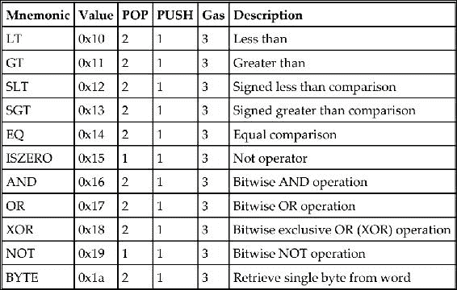

#### 密码运算

此类别中只有一个名为 SHA3 的操作。值得注意的是，这不是由 NIST 标准化的标准 SHA3，而是最初的 Keccak 实现。


#### 环境信息

这一类别共有 13 条指令。这些操作码用于提供与地址、运行时环境和数据复制操作相关的信息。

<colgroup class="calibre13"><col class="calibre14"> <col class="calibre14"> <col class="calibre14"> <col class="calibre14"> <col class="calibre14"> <col class="calibre14"></colgroup> 
| **助记符** | **值** | **流行** | **按下** | **气体** | **描述** |
| 地址 | 0x30 | 0 | one | 2 | 用于获取当前正在执行的帐户的地址 |
| 平衡 | 0x31 | one | one | 20 | 用于获取给定账户的余额 |
| 起源 | 0x32 | 0 | one | 2 | 用于获取原始交易发送方的地址 |
| 呼叫者 | 0x33 | 0 | one | 2 | 用于获取启动执行的帐户的地址 |
| 请求即付的 | 0x34 | 0 | one | 2 | 检索指令或事务存放的值 |
| 调用数据加载 | 0x35 | one | one | three | 检索通过消息调用传递了参数的输入数据 |
| CALLDATASIZE | 0x36 | 0 | one | 2 | 用于检索通过消息调用传递的输入数据的大小 |
| 调用数据副本 | 0x37 | three | 0 | three | 用于将通过消息调用传递的输入数据从当前环境复制到内存中。 |
| CODESIZE | 0x38 | 0 | one | 2 | 检索在当前环境中运行代码的大小 |
| 代码副本 | 0x39 | three | 0 | three | 将当前环境中的运行代码复制到内存中 |
| 煤气价格 | 0x3a | 0 | one | 2 | 检索由初始交易指定的天然气价格。 |
| EXTCODESIZE | 0x3b | one | one | 20 | 获取指定帐户代码的大小 |
| EXTCODECOPY | 0x3c | four | 0 | 20 | 用于将账户代码复制到内存中。 |

#### 屏蔽信息

这组指令与检索与块相关联的各种属性有关:

<colgroup class="calibre13"><col class="calibre14"> <col class="calibre14"> <col class="calibre14"> <col class="calibre14"> <col class="calibre14"> <col class="calibre14"></colgroup> 
| **助记符** | **值** | **流行** | **按下** | **气体** | **描述** |
| 块散列 | 0x40 | one | one | 20 | 获取 256 个最近完成的块之一的哈希 |
| 科班巴 | 0x41 | 0 | one | 2 | 检索块中受益人集合的地址 |
| 时间戳 | 0x42 | 0 | one | 2 | 检索块中设置的时间戳 |
| 数字 | 0x43 | 0 | one | 2 | 获取块的编号 |
| 困难 | 0x44 | 0 | one | 2 | 取回积木的难度 |
| 气体限制 | 0x45 | 0 | one | 2 | 获取块的气体极限值 |

#### 堆栈、内存、存储和流操作

<colgroup class="calibre13"><col class="calibre14"> <col class="calibre14"> <col class="calibre14"> <col class="calibre14"> <col class="calibre14"> <col class="calibre14"></colgroup> 
| **助记符** | **值** | **流行** | **按下** | **气体** | **描述** |
| 持久性有机污染物 | 0x50 | one | 0 | 2 | 从堆栈中移除项目 |
| MLOAD | 0x51 | one | one | three | 用来从存储器中装入一个字。 |
| 斯特姆斯特 | 0x52 | 2 | 0 | three | 用于将一个单词存储到内存中。 |
| 阿姆斯特丹 8 号 | 0x53 | 2 | 0 | three | 用于将一个字节保存到内存中 |
| 斯劳德人 | 0x54 | one | one | 50 | 用于从存储器中装入一个字 |
| 商店吗 | 0x55 | 2 | 0 | 0 | 将一个字保存到存储器 |
| 跳跃 | 0x56 | one | 0 | eight | 改变程序计数器 |
| 跳跃 | 0x57 | 2 | 0 | 10 | 根据条件改变程序计数器 |
| 个人电脑 | 0x58 | 0 | one | 2 | 用于在递增之前检索程序计数器中的值。 |
| MSIZE | 0x59 | 0 | one | 2 | 以字节为单位检索活动内存的大小。 |
| 气体 | 0x5a | 0 | one | 2 | 检索可用气体量 |
| 跳跃目标 | 0x5b | 0 | 0 | one | 用于标记跳转的有效目的地，在执行过程中不影响机器状态。 |

#### 推送操作

这些操作包括用于将项目放入堆栈的推送操作。这些指令的范围是从 0x60 到 0x7f。EVM 总共有 32 个推送操作。PUSH 操作，从程序代码的字节数组中读取。

<colgroup class="calibre13"><col class="calibre14"> <col class="calibre14"> <col class="calibre14"> <col class="calibre14"> <col class="calibre14"> <col class="calibre14"></colgroup> 
| **助记符** | **值** | **流行** | **按下** | **气体** | **描述** |
| 推 1。。。按 32 | 0x60...0x7f | 0 | one | three | 用于将 *N* 右对齐的大端字节项放入堆栈。 *N* 是一个值，根据所使用的助记符，其范围从 1 个字节到 32 个字节(全字)。 |

#### 复制操作

顾名思义，复制操作用于复制堆栈项目。值的范围是从 0x80 到 0x8f。EVM 有 16 种 DUP 指令。放入堆栈或从堆栈中移除的项目也随着所使用的助记符而递增地改变；例如，DUP1 从堆栈中移除一个项目并将两个项目放入堆栈，而 DUP16 从堆栈中移除 16 个项目并将 17 个项目放入堆栈。

<colgroup class="calibre13"><col class="calibre14"> <col class="calibre14"> <col class="calibre14"> <col class="calibre14"> <col class="calibre14"> <col class="calibre14"></colgroup> 
| **助记符** | **值** | **流行** | **按下** | **气体** | **描述** |
| DUP1 .。。DUP16 | 0x80...0x8f | X | Y | three | 用于复制第 N 个堆栈项目，其中 *N* 是对应于所使用的 DUP 指令的编号。 *X* 和 *Y* 分别是移除并放入堆栈的项目。 |

#### 交换操作

交换操作提供了交换堆栈项目的能力。有 16 条交换指令可用，对于每条指令，根据所用操作码的类型，堆栈项目被移除并递增至 17 个项目。

<colgroup class="calibre13"><col class="calibre14"> <col class="calibre14"> <col class="calibre14"> <col class="calibre14"> <col class="calibre14"> <col class="calibre14"></colgroup> 
| **助记符** | **值** | **流行** | **按下** | **气体** | **描述** |
| SWAP1。。。SWAP16 | 0x90...0x9f | X | Y | three | 用于交换第 N 个堆栈项目，其中 *N* 是所使用的交换指令对应的编号。 *X* 和 *Y* 分别是移除并放入堆栈的项目。 |

#### 伐木作业

日志记录操作提供操作码以在子状态元组的日志系列字段上附加日志条目。共有四种日志操作可用，范围从 0x0a 到 0xa4。

<colgroup class="calibre13"><col class="calibre14"> <col class="calibre14"> <col class="calibre14"> <col class="calibre14"> <col class="calibre14"> <col class="calibre14"></colgroup> 
| **助记符** | **值** | **流行** | **按下** | **气体** | **描述** |
| LOG0。。。日志 4 | 0x0a...0xa4 | X | Y (0) | 375,750,1125,1500,18 75 | 用于为日志记录追加 *N* 个主题，其中 *N* 是所使用的日志操作码对应的编号。例如，LOG0 表示没有主题的日志记录，LOG4 表示有四个主题的日志记录。 *X* 和 *Y* 分别代表从堆栈中移除和放置的项目。 *X* 和 *Y* 增量变化，根据所使用的对数运算，从 2，0 开始到 6，0。 |

#### 系统操作

系统操作用于执行各种与系统相关的操作，如帐户创建、消息调用和执行控制。此类别中共有六种操作码可用。

<colgroup class="calibre13"><col class="calibre14"> <col class="calibre14"> <col class="calibre14"> <col class="calibre14"> <col class="calibre14"> <col class="calibre14"></colgroup> 
| **助记符** | **值** | **流行** | **按下** | **气体** | **描述** |
| 创造 | 0xf0 | three | one | 0 , 3200 | 用于使用相关代码创建新帐户。 |
| 呼叫 | 0xf1 | seven | one | 40 | 用于向帐户发起消息呼叫。 |
| 呼叫代码 | 0xf2 | seven | one | 40 | 用于使用替代帐户的代码向该帐户发起消息呼叫。 |
| 返回 | 0xf3 | 2 | 0 | 0 | 停止执行并返回输出数据。 |
| 委派电话 | 0xf4 | six | one | 40 | 与 CALLCODE 相同，但不更改发送方和值的当前值。 |
| 自杀 | 0xff | one | 0 | 0 | 停止(中止)执行，并注册帐户以便以后删除 |

在这一节中，我们讨论了所有的 EVM 操作码。以太坊家园版的 EVM 总共有 129 个操作码。

# 预编译合同

以太坊中有四个预编译的契约。这是这些合同的清单和细节。

## 椭圆曲线公钥恢复函数

**ECDSARECOVER** ( **椭圆曲线 DSA 恢复函数**)在地址 1 可用。它被表示为 ECREC，并且需要 3000 气体来执行。如果签名无效，则该函数不返回任何输出。公钥恢复是一种标准机制，通过这种机制可以从椭圆曲线加密中的私钥导出公钥。

ECDSA 恢复功能如下所示:

*ECDSARECOVER(H，V，R，S) =公钥*

它接受四个输入:H，它是要签名的消息的 32 字节散列，以及 *V* 、 *R* 和 *S* ，它们代表带有恢复 ID 的 ECDSA 签名，并产生 64 字节的公钥。本章前面已经详细讨论了 *V* 、 *R* 和 *S* 。

## SHA-256 位哈希函数

SHA-256 位哈希函数是在地址 2 处可用的预编译协定，它生成输入的 SHA256 哈希。它几乎就像一个传递函数。SHA-256 (SHA256)的气体要求取决于输入数据的大小。输出是 32 字节的值。

## RIPEMD-160 位哈希函数

RIPEMD-160 位哈希函数用于提供 RIPEMD 160 位哈希，在地址 3 可用。这个函数的输出是一个 20 字节的值。与 SHA-256 类似，Gas 要求取决于输入数据的数量。

## 身份功能

identity 函数在地址 4 可用，用 ID 表示。它简单地将输出定义为输入；换句话说，无论给 ID 函数输入什么，它都会输出相同的值。用一个简单的公式计算气体需求:*15+3【I<sub class="calibre61">d</sub>/32】*其中 *I <sub class="calibre61">d</sub>* 是输入数据。这意味着在高水平上，气体需求取决于输入数据的大小，尽管执行了一些计算，如前面的等式所示。

前面提到的所有预编译契约都可以成为本机扩展，并且将来可以包含在 EVM 操作码中。

# 账目

帐户是以太坊区块链的主要组成部分之一。状态是由于帐户之间的交互而创建或更新的。在账户之间和账户上执行的操作代表状态转换。状态转换是使用以太坊状态转换函数实现的，其工作原理如下:

1.  通过检查语法、签名有效性和 nonce 来确认交易有效性。
2.  计算交易费用，并使用签名解析发送地址。此外，发送者的账户余额被相应地检查和减去，并且 nonce 被递增。如果帐户余额不足，将返回一个错误。
3.  提供足够的乙醚(气价)来支付交易成本。这是根据交易的大小按字节递增收费的。
4.  在这一步中，发生了实际的价值转移。流程是从发送方的账户到接收方的账户。如果交易中指定的目的地帐户尚不存在，则会自动创建该帐户。此外，如果目标帐户是合同，则执行合同代码。这也取决于可用的气体量。如果有足够的天然气可用，那么合同代码将完全执行；否则会跑到没气的地步。
5.  在由于帐户余额或 gas 不足而导致交易失败的情况下，除了支付给矿工的费用之外，所有状态更改都将回滚。
6.  最后，费用的剩余部分(如果有的话)作为零钱被发送回发送者，并相应地向矿工支付费用。此时，该函数返回结果状态。

## 账户类型

以太坊有两种类型的账户:

*   外部拥有的账户
*   合同账户

第一个是**外部拥有账户** ( **EOAs** )，另一个是合约账户。eoa 类似于比特币中由私钥控制的账户。契约帐户是指具有与私钥相关联的代码的帐户。一个 EOA 有余额，能够发送交易，没有关联代码，而一个**合同账户** ( **CA** )有余额，有关联代码，能够被触发并执行代码以响应交易或消息。值得注意的是，由于以太坊区块链的图灵完备性，合约账户中的代码可以具有任意复杂程度。代码由 EVM 在以太网上的每个采矿节点执行。此外，合约帐户能够保持自己的永久状态，并可以调用其他合约。据设想，在 serenity 版本中，外部拥有的账户和合同账户之间的区别可能会被消除。

# 块

如前所述，块是区块链的主要构建块。以太坊块由各种组件组成，描述如下:

*   块标题
*   交易列表
*   长辈或叔伯的名单

事务列表只是块中包含的所有事务的列表。此外，块中还包含了大叔们的头像列表。最重要也是最复杂的部分是块头，在这里讨论。

## 块标题

块头是以太坊块中最关键和最详细的组件。标题包含有价值的信息，这里将详细描述。

### 父哈希

这是父(前一个)块头的 Keccak 256 位哈希。

### 拥抱哈希

这是块中包含的 Ommers(叔伯)块列表的 Keccak 256 位哈希。

### 受益人

受益人字段包含 160 位的收件人地址，一旦区块成功开采，收件人将获得开采奖励。

### 状态根

状态根字段包含状态 trie 的根节点的 Keccak 256 位散列。它是在所有事务处理完成后计算的。

### 交易根

事务根是事务 trie 的根节点的 Keccak 256 位散列。事务 trie 表示包含在块中的事务列表。

### 收款根源

收据根是交易收据 trie 的根节点的 keccak 256 位散列。该 trie 由块中包含的所有交易的收据组成。交易收据在每笔交易处理后生成，包含有用的交易后信息。下一节将提供有关交易收据的更多详细信息。

### 原木开花

日志布隆是布隆过滤器，其由来自块中包括的事务列表的每个事务收据的日志条目的记录器地址和日志主题组成。下一节将详细解释日志记录。

### 难度

当前区块的难度级别。

### 数字

所有先前块的总数；创世区块是零区块。

### 气体极限

该字段包含的值表示对每块天然气消耗量设置的限制。

### 使用的气体

该字段包含区块中包含的交易消耗的天然气总量。

### 时间戳

Timestamp 是块初始化时间的纪元 Unix 时间。

### 额外数据

额外数据字段可用于存储与该块相关的任意数据。

### 混合散列

Mixhash 字段包含一个 256 位的散列，一旦与 nonce 组合，就用于证明为了创建这个块已经花费了足够的计算量。

### 现在

Nonce 是一个 64 位的散列(一个数字),它与 mixhash 字段一起用于证明为了创建这个块已经花费了足够的计算量。

下图显示了块和块标题的详细结构:


带块头的块结构详图

## 创世纪街区

genesis 块在其包含的数据和从普通块创建的方式方面略有不同。它包含这里描述的 15 个项目。

从 Etherscan.io，实际版本如下所示:

<colgroup class="calibre13"><col class="calibre14"> <col class="calibre14"></colgroup> 
| **元素** | **描述** |
| 时间戳 | (2015 年 7 月 30 日 03:26:13 PM +UTC) |
| 处理 | 本区块 8893 笔交易和 0 笔合同内部交易 |
| 混杂 | 0xd 4 和 5670 f 876 AEF 8c 010 b 86 a 40 D5 f 5645 a 118d 0906 a 34 和 69aec8c0db1cb8fa3 |
| 父哈希 | 0x 000000000000000000000000000000000000000000000000000000000000000000000000000000000000。 |
| sha3 叔伯 | 0x 1 DCC 4 8 dec 75 D7 aab 85 b567 B6 CCD 41 ad 312451 b 948 a 7413 F0 a 142 FD 40d 49347 |
| 开采者 | 15 秒内 0x 00000000000000000000000000000000000000 |
| 困难 | Seventeen billion one hundred and seventy-nine million eight hundred and sixty-nine thousand one hundred and eighty-four |
| 总难度 | Seventeen billion one hundred and seventy-nine million eight hundred and sixty-nine thousand one hundred and eighty-four |
| 大小 | 540 字节 |
| 气体极限 | Five thousand |
| 使用的气体 | 0 |
| 目前 | 0x0000000000000042 |
| 集体奖励 | 5 乙醚 |
| 叔叔的奖励 | 0 |
| 额外数据 | ú(hex:0x 11 bbe 8db 4 e 347 B4 e 8c 937 C1 c 8370 e 4b 5 ed 33 ADB 3db 69 cbdb 7a 38 E1 e 50b 1 B2 fa) |

## 交易收据

事务收据用作存储事务执行后的状态的机制。换句话说，这些结构用于记录事务执行的结果。它在每个事务执行后产生。所有收据都存储在索引键的 trie 中。该 trie 的根的散列(Keccak 256 位)被放置在块报头中作为收据根。它由这里描述的四个元素组成。

### 交易后状态

这个条目是一个 trie 结构，保存事务执行后的状态。它被编码为一个字节数组。

### 使用的气体

此项表示包含交易收据的区块中使用的天然气总量。该值在事务执行完成后立即获取。总用气量应为非负整数。

### 日志集

此字段显示因事务执行而创建的日志条目集。日志条目包含记录器的地址、一系列日志主题和日志数据。

### 布鲁姆过滤器

布隆过滤器是根据前面讨论的日志集中包含的信息创建的。日志条目被缩减为 256 字节的散列，然后随着日志的增长，该散列被嵌入到块的头中。日志条目由日志记录器的地址、日志主题和日志数据组成。日志主题被编码为一系列 32 字节的数据结构。日志数据由几个字节的数据组成。

这个过程可以在下图中看到:

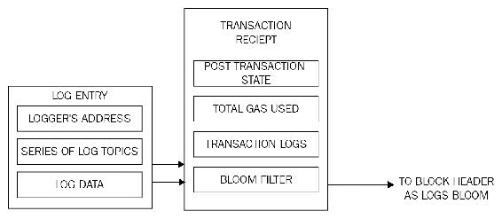

交易收据和日志激增

## 交易验证和执行

在验证交易的有效性之后，执行交易。初始测试如下所示:

*   事务必须是格式良好的，并且是 RLP 编码的，没有任何附加的尾随字节
*   用于签署交易的数字签名是有效的
*   交易随机数必须等于发送方帐户的当前随机数
*   气体限制不得少于交易使用的气体
*   发送者的账户包含足够的余额来支付执行成本

### 事务子状态

事务子状态是在事务执行期间创建的，它在执行完成后立即被处理。这个事务子状态是一个由三项组成的元组。

#### 自杀集

该元素包含交易执行后被处置的账户列表。

#### 日志系列

这是一系列索引检查点，允许监控和通知以太坊环境外部的实体(如应用程序前端)的契约调用。它就像一个触发机制，每次调用特定的函数或发生特定的事件时都会执行。创建日志是为了响应智能合约中发生的事件。它也可以作为一种更便宜的存储方式。事件将在[第 8 章](08.html "Chapter 8. Ethereum Development")、*以太坊发展*中用实际例子来涵盖。

#### 退还余额

这是启动执行的交易中的天然气总价格。退款不会立即执行；相反，它们用于部分抵消总执行成本。

下图描述了事务子状态元组:

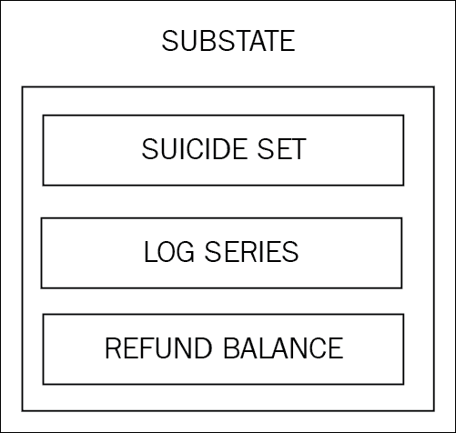

子状态元组

## 区块验证机制

如果以太坊块通过以下检查，则被认为是有效的:

*   与大叔和交易一致。这意味着所有的 Ommers(叔伯)满足他们确实是叔伯的属性，并且如果叔伯的工作证明是有效的。
*   如果前一个块(父块)存在并且有效。
*   如果块的时间戳有效。这基本上意味着当前块的时间戳必须高于父块的时间戳。还有，应该是未来不到 15 分钟。所有块时间都以纪元时间(Unix 时间)计算。

如果这些检查中的任何一项失败，该块将被拒绝。

### 阻止最终确定

区块终结是由矿工运行的过程，目的是验证区块的内容并应用奖励。它导致执行四个步骤。这里详细描述了这些步骤。

#### Ommers 验证

验证 Ommers(陈旧块也称为叔伯)。在采矿的情况下，确定 Ommers。陈旧块的报头的验证过程检查报头是否有效，以及叔叔与当前块的关系是否满足六个块的最大深度。一个块最多可以包含两个叔叔。

#### 交易验证

验证交易。在采矿的情况下，确定交易。该过程包括检查区块中使用的总气体是否等于最终交易后的最终气体消耗量。

#### 奖励申请

应用奖励，这意味着用奖励余额更新受益人的帐户。在以太坊，对于陈旧的方块也会给矿工一个奖励，是方块奖励的 1/32。被包含在方块中的叔叔们也可以获得总方块奖励的 7/8。当前的格挡奖励是 5 以太。一个块最多可以有两个叔叔。

#### 状态和随机数验证

验证状态和随机数。在挖掘的情况下，计算有效的状态和 nonce。

### 阻挡难度

如果两个方块之间的时间减少，方块难度增加，而如果两个方块之间的时间减少，方块难度增加。这是保持大致一致的块生成时间所必需的。以太坊宅地发布中的难度调整算法如下图:

```
block_diff = parent_diff + parent_diff // 2048 *  
max(1 - (block_timestamp - parent_timestamp) // 10, -99) +  
int(2**((block.number // 100000) - 2))  

```

前面的算法意味着，如果父块和当前块的生成之间的时间差小于 10 秒，则难度增加。如果时间差在 10 到 19 秒之间，难度等级保持不变。最后，如果时间差为 20 秒或更长，难度级别会降低。这种减少与时差成正比。

除了基于时间戳差异的难度调整之外，还有另一部分(显示在前面算法的最后一行)在每 100，000 个块之后以指数方式增加难度。这是以太坊网络中引入的所谓的*难度定时炸弹*或*冰河时期*，这将使未来某个时候在以太坊区块链上采矿变得非常困难。这将鼓励用户转向股权证明，因为电力链上的采矿最终将变得极其困难。根据最新更新和基于算法的估计，区块生成时间将在 2017 年下半年变得非常长，到 2021 年，它将变得如此之长，以至于几乎不可能在 POW 链上进行开采。这样，矿工将别无选择，只能转而使用以太坊提出的名为 Casper 的股权证明方案。

# 乙醚

以太是由矿工铸造的，作为对他们花费计算努力的货币奖励，以通过验证和确认交易和块来保护网络。以太在区块链以太坊内用于支付 EVM 上的合同的执行。以太用于购买气体作为加密燃料，这是在以太坊区块链上执行计算所必需的。

面额表如下所示:


EVM 在区块链进行的每次计算都要收费。详细的费用表将在下一节中列出。

## 气体

在以太坊区块链进行的每一项手术都需要支付燃气费。由于 EVM 的图灵完全性质，这是一种确保无限循环不会导致整个区块链停止的机制。交易费作为一定数量的乙醚被收取，并从交易发起者的账户余额中提取。矿工为采矿而进行的交易需要付费。如果这个费用太低，可能永远都接不到交易；费用越高，矿商将这些交易纳入区块的可能性就越大。相反，如果支付了适当费用的交易被矿工包括在区块中，但是有太多复杂的操作要执行，则如果气成本不够，它会导致气用完异常。在这种情况下，交易将失败，但仍将成为冻结的一部分，交易发起者将不会获得任何退款。

交易成本可使用以下公式估算:

*总成本=用气量*气价*

这里， *gasUsed* 是交易在执行期间应该使用的总天然气，而 *gasPrice* 由交易发起者指定，作为对矿工的激励，以将交易包括在下一个区块中。这是在以太中指定的。每个 EVM 操作码都有一个费用。这是一个估计值，因为使用的气体可能多于或少于交易发起人最初指定的值。例如，如果计算花费太长时间或者智能合约的行为响应于一些其他因素而改变，则事务执行可能执行比最初预期的更多或更少的操作，并且可能导致消耗更多或更少的 gas。如果执行耗尽了所有的资源，所有的东西都会立即回滚；否则，如果执行成功，并且有一些剩余的 gas，那么它被返回给事务发起者。

每次操作都要消耗一些汽油；这里显示了几个操作的高级费用表作为示例:

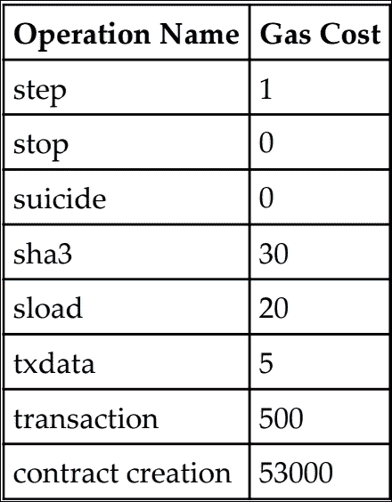

根据前面的费用表和前面讨论的公式，SHA3 操作的计算示例如下:

*   SHA3 花费 30 汽油
*   目前的天然气价格为 25 GWei，相当于 0.000000025 乙醚
*   两者相乘:*0.000000025 * 30 = 0.00000075*乙醚

总计 0.00000075 乙醚是将要充入的总气体。

## 费用表

在三种情况下，充气是执行操作的先决条件:

*   运算的计算
*   对于合同创建或消息调用
*   内存使用量的增加

本章前面提供了气体值的说明和各种操作列表。

# 消息

根据黄皮书的定义，消息是在两个账户之间传递的数据和价值。消息是在两个帐户之间传递的数据包。该数据包包含数据和值(乙醚量)。它可以通过智能协定(自治对象)发送，也可以由外部参与者(外部拥有的帐户)以已由发送方数字签名的交易形式发送。

合同可以向其他合同发送消息。消息只存在于执行环境中，从不存储。消息类似于事务；然而，主要的区别在于它们是由契约产生的，而交易是由以太坊环境之外的实体(外部拥有的账户)产生的。

消息由这里提到的组件组成:

1.  邮件的发件人
2.  邮件的收件人
3.  魏要转账的金额和报文到合同地址
4.  可选数据字段(合同的输入数据)
5.  可以消耗的最大气体量

当合同执行`CALL`或`DELEGATECALL`操作码时，生成消息。

## 通话

呼叫不向区块链广播任何内容；相反，它是对约定函数的本地调用，在节点上本地运行。它几乎就像一个局部函数调用。它不消耗任何气体，因为它是一个只读操作。这类似于一次演习。调用在节点上本地执行，通常不会导致任何状态变化。根据黄皮书的定义，这是将消息从一个帐户传递到另一个帐户的行为。如果目标帐户具有关联的 EVM 代码，则虚拟机将在收到消息时启动，以执行所需的操作。如果消息发送者是一个自治对象，那么调用传递从虚拟机操作返回的任何数据。

事务改变了状态。这些由外部因素创建，并被签名，然后广播到以太坊网络。

# 采矿

采矿是将新货币加入区块链的过程。这是对矿工验证和核实由交易组成的块的激励。挖掘过程通过验证计算来帮助保护网络。

在理论层面上，采矿机执行以下功能:

1.  监听以太网上广播的事务，并确定要处理的事务。
2.  确定称为 Uncles 或 Ommers 的陈旧块，并将它们包含在块中。
3.  用成功开采区块获得的奖励更新帐户余额。
4.  最后，计算有效状态，并最终确定模块，这定义了所有状态转换的结果。

现在的挖矿方式是基于工作证明，类似于比特币。当一个区块被认为有效时，它不仅必须满足一般的一致性要求，而且还必须包含对给定难度的工作证明。

随着 serenity 的发布，工作证明算法将被利益证明算法所取代。为了建立适用于以太网的利益证明算法，已经进行了大量的研究工作。

已经开发了一个名为 Casper 的算法，它将取代以太坊中现有的工作证明算法。这是一种基于经济协议的安全押金，其中要求节点在能够产生块之前放置安全押金。在 Casper 中，节点被命名为绑定验证器，而放置安全押金的行为被命名为绑定。

## Ethash

**Ethash** 是以太坊中使用的工作证明算法的名称。最初，这是作为 Dagger-Hashimoto 算法提出的，但自从第一次实现以来，已经发生了很大的变化，PoW 算法现在已经发展成为现在所知的 Ethash 算法。与比特币类似，挖掘背后的核心思想是找到一个曾经在预定难度级别散列结果的随机数。最初以太坊刚兴起，甚至 CPU 和单 GPU 挖矿都有一定盈利的时候，难度很低，但现在已经不是这样了。现在要么池化采矿有利可图，要么大型 GPU 采矿农场用于采矿目的。

Ethash 是一种硬存储算法，这使得它很难在专用硬件上实现。与比特币一样，ASIC 已经开发出来，这导致了多年来的采矿集中化，但内存硬工作证明算法是阻止这种威胁的一种方式，以太坊实现了 Ethash 来阻止采矿 ASIC 的开发。该算法需要根据随机数和块头选择固定资源的子集，称为 **DAG** ( **有向无环图**)。DAG 的大小约为 2 GB，每 30000 个数据块更改一次。挖掘只能在挖掘节点首次启动时完全生成 DAG 时开始。每 30000 个块之间的时间大约为 5.2 天，称为历元。这个 DAG 被称为 Ethash 的工作验证算法用作种子。根据当前规范，历元时间被定义为 30，000 个块。

当前的奖励方案是对成功找到有效随机数的奖励。除了获得 5 个乙醚之外，成功的矿工还可以获得区块内消耗的天然气成本，以及区块内包含过期区块(大叔)的额外奖励。每个街区最多允许两个叔叔，获得正常街区奖励的 7/8。为了达到 12 秒的方块时间，每个方块的难度都要调整。奖励与矿工的散列率成正比，散列率基本上是指矿工散列的速度。

只要加入以太坊网络，运行合适的客户端，就可以进行挖掘。关键要求是，在开始挖掘之前，节点应该与主网络完全同步。

在下一节中，将提到各种挖掘方法。

## CPU 挖掘

即使在主网上没有利润，CPU 挖掘在测试网络上仍然是有价值的，甚至可以在私有网络上试验挖掘和合同部署。专用网络和测试网络将在下一章用实例讨论。这里展示了如何开始 CPU 挖掘的 geth 示例。Geth 可以用 mine 开关启动，以便开始采矿:

```
geth --mine --minerthreads <n>

```

也可以使用 web 3 geth 控制台启动 CPU 挖掘。发出以下命令可以启动 Geth 控制台:

```
geth attach 

```

在此之后，可以通过发出以下命令来启动挖掘器，如果成功，将返回 true，否则返回 false。看一下下面的命令:

```
Miner.start(4)
True

```

前面的命令将用四个线程启动挖掘器。看一下下面的命令:

```
Miner.stop
True

```

前面的命令将停止采矿机。如果成功，该命令将返回 true。

## GPU 挖掘

在基本层面上，可以通过运行两个命令轻松执行 GPU 挖掘:

```
geth --rpc

```

一旦 geth 启动并运行，并且完全下载了区块链，就可以运行 Ethminer 来开始采矿。Ethminer 是一个独立的挖掘器，也可以在 farm 模式下用于挖掘池。可以从[https://github.com/Genoil/cpp-ethereum/tree/master/releases](https://github.com/Genoil/cpp-ethereum/tree/master/releases)下载:

```
ethminer -G

```

使用`G`开关运行假设正确安装和配置了适当的图形卡。如果没有找到合适的显卡，ethminer 将返回一个错误，如下面的屏幕截图所示:


找不到合适的 GPU 时出错

GPU 采矿需要 AMD 或 Nvidia 显卡和适用的 OpenCL SDK。对于 NVidia 芯片组，可以从[https://developer.nvidia.com/cuda-downloads](https://developer.nvidia.com/cuda-downloads)下载。对于 AMD 芯片组，可以在[http://developer . AMD . com/tools-and-sdks/opencl-zone/AMD-accelerated-parallel-processing-app-SDK](http://developer.amd.com/tools-and-sdks/opencl-zone/amd-accelerated-parallel-processing-app-sdk)获得。

一旦显卡安装和配置正确，就可以通过发出`ethminer -G`命令开始该过程。

Ethminer 也可以用来运行基准测试，如下图所示。有两种模式可用于基准测试。可以是 CPU，也可以是 GPU。命令如下所示。

### CPU 性能指标评测

```
$ ethminer -M -C

```

### GPU 性能指标评测

```
$ ethminer -M -G

```

下面是 CPU 挖掘基准测试的屏幕截图示例:


CPU 基准测试

也可以在命令行中指定要使用的 GPU 设备:

```
$ ethminer -M -G --opencl-device 1

```

由于 GPU 挖掘是使用 OpenCL AMD 实现的，因此与 NVidia GPUs 相比，基于芯片组的 GPU 往往工作更快。由于高内存需求(DAG 创建)，FPGAs 和 ASICs 不会比 GPU 提供任何主要优势。这样做是为了阻止开发采矿专用硬件。

## 采矿钻机

随着时间的推移，开采以太的难度越来越大，矿工们开始建造带有多个 GPU 的采矿钻机。一个采矿钻机通常包含大约五个 GPU 卡，它们都并行工作进行采矿，从而提高了找到有效随机数进行采矿的机会。

采矿钻机可以通过一些努力来建造，也可以从不同的供应商那里买到。典型的采矿钻机配置包括在接下来的章节中讨论的部件。

### 主板

需要具有多个 PCI-E x1 或 x16 插槽的专用主板，例如 BIOSTAR Hi-Fi 或 ASRock H81。

### 固态硬盘

需要 SSD 硬盘。建议使用固态硬盘，因为它的性能比模拟硬盘快得多。这将主要用于储存区块链。

### GPU

GPU 是钻机最重要的组成部分，因为它是采矿的主要工具。例如，它可以是具有 4 GB RAM 的蓝宝石 AMD 镭龙 R9 380。

Linux Ubuntu 的最新版本通常被选为该平台的操作系统。还有另一个版本的 Linux 可用，叫做 EthOS(可在[http://ethosdistro.com/](http://ethosdistro.com/)获得)，它是专门为以太坊采矿而构建的，支持本地采矿操作。

最后安装 Ethminer、geth 等挖掘软件。此外，还安装了一些远程监控和管理软件，以便在需要时可以远程监控和管理钻机。安装适当的空调或冷却机制也很重要，因为运行多个 GPU 会产生大量热量。这还需要使用适当的监控软件，以便在硬件出现任何问题时(例如，如果 GPU 过热)向用户发出警报。


在易贝出售的以太坊采矿设备

## 采矿池

网上有很多矿池提供以太坊挖矿。可以使用以下命令将 Ethminer 连接到挖掘池。每个池都发布自己的指令，但一般来说，连接到池的过程是相似的。这里展示了一个来自 ethereumpool.co 的例子:

```
ethminer -C -F http://ethereumpool.co/?miner=0.1@0x024a20cc5feba7f3dc3776075b3e60c20eb1459c@DrEquinox

```


ethminer 的截图

# 客户和钱包

随着以太坊的大力发展和演变，在过去的几年中已经开发和引入了许多组件、客户端和工具。以下是以太坊提供的所有主要组件、客户端软件和工具的列表。提供这个列表是为了减少以太坊可用的许多工具和客户端的模糊性。此处提供的列表还解释了各种组件的用法和意义。

## Geth

这是以太坊客户端的 Go 实现。

## Eth

这是以太坊客户端的 C++实现。

## Pyethapp

这是以太坊客户端的 Python 实现。

## 平价

这个实现是使用 Rust 构建的，由 EthCore 开发。EthCore 是一家致力于开发奇偶校验客户端的公司。奇偶性可以从[https://ethcore.io/parity.html](https://ethcore.io/parity.html)下载。

## 轻客户端

SPV 客户端仅下载区块链的一小部分。这使得低资源设备，如移动电话、嵌入式设备或平板电脑，能够验证交易。在这种情况下，不需要完整的以太坊区块链和节点，SPV 客户仍然可以验证交易的执行。SPV 客户端也称为轻客户端。这种想法类似于比特币 SPV 客户端。有 Jaxx([https://jaxx.io/](https://jaxx.io/))提供的钱包，可以安装在 iOS 和 Android 上，提供 **SPV** ( **简单支付验证**)功能。

## 安装

以下安装过程描述了在 Ubuntu 系统上安装各种以太坊客户端。以太坊维基上有其他操作系统的说明。因为在后面的例子中会用到 Ubuntu 系统，所以这里只描述了在 Ubuntu 上的安装。

在 Ubuntu 系统上使用以下命令可以安装 Geth 客户端:

```
> sudo apt-get install -y software-properties-common
> sudo add-apt-repository -y ppa:ethereum/ethereum
> sudo apt-get update
> sudo apt-get install -y ethereum

```

安装完成后。Geth 可以简单地通过在命令提示符下发出`geth`命令来启动，因为它预先配置了连接到实时以太网(mainnet)所需的所有参数:

```
> geth

```

### 以太网安装

Eth 是以太坊客户端的 C++实现，可以在 Ubuntu 上使用以下命令进行安装:

```
> sudo apt-get install cpp-ethereum 

```

### 薄雾浏览器

Mist browser 是一个面向最终用户的用户友好界面，具有功能丰富的图形用户界面，用于浏览 DAPPS、账户管理和合同管理。薄雾安装将在下一章介绍。

当 Mist 第一次启动时，它将在后台初始化 geth，并将与网络同步。根据网络的速度和类型，与网络完全同步可能需要几个小时到几天的时间。如果使用 TestNet，那么同步完成相对较快，因为 TestNet (Ropsten)的大小没有 MainNet 大。关于如何连接到 TestNet 的更多信息将在下一章提供。

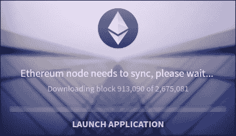

薄雾浏览器启动并与主网络同步

薄雾浏览器不是钱包；事实上，它是 DAPPS 的一个浏览器，为创建和管理合同、账户以及浏览分散的应用程序提供了一个用户友好的用户界面。以太坊钱包是一款随薄雾发布的 DAPP。

Wallet 是一个通用程序，它可以存储私钥和相关联的帐户，并且根据存储在其中的地址，它可以通过查询区块链来计算与地址相关联的以太网的现有余额。

其他钱包包括但不限于 MyEtherWallet，这是一个用 JavaScript 开发的开源以太钱包。MyEtherWallet 在客户端浏览器中运行。这在[https://www.myetherwallet.com](https://www.myetherwallet.com)有售。

Icebox 是由 Consensys 公司开发的。这是一个冷存储浏览器，提供乙醚的安全存储。这取决于运行 Icebox 的计算机是否连接到互联网。

以太坊为桌面、移动和网络平台提供了各种钱包。下图显示了一个名为 Jaxx 的流行以太坊 iOS 钱包:


显示交易和当前余额的 iOS 版 Jaxx 以太坊钱包

一旦区块链同步，Mist 将启动并显示以下界面。在本例中，显示了四个没有余额的帐户:


薄雾浏览器

可以通过多种方式创建新账户。在 Mist 浏览器中，可以通过点击**账户**菜单并选择**新账户**或点击 Mist 账户概览屏幕中的**添加账户**选项来创建账户。


添加新帐户

该帐户需要设置密码，如上图所示；一旦帐户建立，它将显示在 Mist 浏览器的帐户概述部分。

还可以使用 geth 或奇偶校验命令行界面通过命令行添加帐户。下一节将介绍这个过程。

### Geth

```
$ geth account new 
Your new account is locked with a password. Please give a password. Do not forget this password. 
Passphrase: 
Repeat passphrase: 
Address: {21c2b52e18353a2cc8223322b33559c1d900c85d} 
drequinox@drequinox-OP7010:~$

```

可以使用 geth 通过以下命令显示帐户列表:

```
$ geth account list 

Account #0: {11bcc1d0b56c57aefc3b52d37e7d6c2c90b8ec35} /home/drequinox/.ethereum/keystore/UTC--2016-05-07T13-04-15.175558799Z--11bcc1d0b56c57aefc3b52d37e7d6c2c90b8ec35 

Account #1: {e49668b7ffbf031bbbdab7a222bdb38e7e3e1b63} /home/drequinox/.ethereum/keystore/UTC--2016-05-10T19-16-11.952722205Z--e49668b7ffbf031bbbdab7a222bdb38e7e3e1b63 

Account #2: {21c2b52e18353a2cc8223322b33559c1d900c85d} /home/drequinox/.ethereum/keystore/UTC--2016-11-29T22-48-09.825971090Z--21c2b52e18353a2cc8223322b33559c1d900c85d

```

### geth 控制台

geth JavaScript 控制台可用于执行各种功能。例如，可以通过附加 geth 来创建帐户。

Geth 可以与正在运行的守护进程连接，如下图所示:


一旦 geth 与以太坊客户端的运行实例(在本例中为奇偶校验)成功连接，它将显示命令提示符' *>* '，该命令提示符提供了一个交互式命令行界面，使用 JavaScript 符号与以太坊客户端进行交互。

例如，可以在 geth 控制台中使用以下命令添加新帐户:

```
> personal.newAccount() 
Passphrase: 
Repeat passphrase: 
"0xc64a728a67ba67048b9c160ec39bacc5626761ce" 
>

```

帐户列表也可以类似方式显示:

```
> eth.accounts 
["0x024a20cc5feba7f3dc3776075b3e60c20eb1459c", "0x11bcc1d0b56c57aefc3b52d37e7d6c2c90b8ec35", "0xdf482f11e3fbb7716e2868786b3afede1c1fb37f", "0xe49668b7ffbf031bbbdab7a222bdb38e7e3e1b63", "0xf9834defb35d24c5a61a5fe745149e9470282495"]

```

### 向账户注入比特币

此选项在 Mist 浏览器中可用，方法是单击帐户，然后选择向帐户注资的选项。用于此操作的后端引擎是 shapeshift.io，可用于从比特币或其他货币(也包括法定货币选项)为帐户提供资金。

一旦交易完成，转账的乙醚将进入账户。


## 奇偶校验安装

奇偶校验是以太坊客户端的另一个实现。它是用 Rust 编程语言编写的。开发奇偶校验的主要目标是高性能、小尺寸和可靠性。可以在 Ubuntu 或 Mac 系统上使用以下命令安装奇偶校验:

```
bash <(curl https://get.parity.io -Lk)

```

这将启动奇偶校验客户端的下载和安装。奇偶校验安装完成后，安装程序还将提供 netstats 客户端的安装。netstat 客户端是一个后台运行的守护程序，它收集重要的统计数据并在[stats.ethdev.com](http://stats.ethdev.com)上显示出来。

下面的屏幕截图显示了奇偶校验的安装示例:

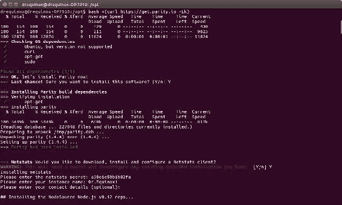

安装成功完成后，将显示以下消息。然后可以使用`parity -j`启动以太坊奇偶校验节点。如果为了使用带奇偶校验的以太坊钱包(Mist 浏览器)而需要与 geth 兼容，那么应该使用`parity -geth`命令来运行奇偶校验。这将在与 geth 客户端兼容的模式下运行奇偶校验，从而允许 Mist 在奇偶校验之上运行。

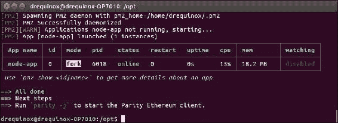

奇偶校验安装

客户可以选择在[https://ethstats.net/](https://ethstats.net/)上市。一个例子如下所示:


所有连接的客户端都列在 ethstats.net 上，如下面的屏幕截图所示。这些客户端与相关属性一起列出，如节点名称、节点类型、延迟、挖掘状态、对等体数量、挂起事务数量、最后一个阻塞、困难、阻塞事务和叔叔数量。


在[https://ethstats.net/](https://ethstats.net/)上市的客户

Parity 还提供了一个用户友好的 web 界面，通过该界面可以管理各种任务，如帐户管理、地址簿管理、DAPP 管理、合同管理以及状态和签名者操作。

这可以通过发出以下命令来实现:

```
$ parity ui

```

这将调出如下所示的界面:


奇偶校验用户界面。

如果奇偶校验在 geth 兼容模式下运行，奇偶校验 UI 将被禁用。为了启用 UI 以及 geth 兼容性，可以使用以下命令:

```
$ parity --geth --force-ui

```

前面的命令将在 geth 兼容模式下启动奇偶校验，并启用 web 用户界面。

### 使用奇偶校验命令行创建帐户

以下命令可用于创建使用奇偶校验的新帐户:

```
$ parity account new
Please note that password is NOT RECOVERABLE.
Type password:
Repeat password:
2016-11-30 02:18:55 UTC c8c92a910cfbce2e655c88d37a89b6657d1498fb

```

# 交易和投资

乙醚可在各种交易所买卖。写这篇文章的时候以太坊目前的市值是 680，277，967，一个以太值 7.89。最近，价格波动很大，并且由于最近的以太坊攻击和以太坊网络上的后续分叉而显著下降。

下图显示了历史市值详情:


以太历史市值(来源 Etherscan.io)

乙醚既可以在各种交易所购买，也可以开采。有一些在线服务，比如允许从一种货币转换到另一种货币的 shapeshift.io。

各种在线交易所，如 kraken、coinbase 等，提供使用信用卡或另一种虚拟货币(如比特币)购买法定货币的以太网。

# 黄色的纸

以太坊黄皮书由*Gavin Wood*博士撰写，是以太坊协议的正式定义。任何人都可以通过遵循论文中定义的协议规范来实现以太坊客户端。这篇文章可能有点难读，特别是对于没有代数或数学背景并且不熟悉数学符号的读者。

此处提供了本文中使用的所有符号及其含义的列表，以方便读者阅读。一旦知道了符号的含义，就很容易理解和欣赏黄皮书中描述的概念和规范。

## 有用的符号

<colgroup class="calibre13"><col class="calibre14"> <col class="calibre14"> <col class="calibre14"> <col class="calibre14"></colgroup> 
| **符号** | **意为** | **符号** | **意为** |
| 第二个 | 被定义为 | ≤ | 小于或等于 |
| = | 等于 |  | 适马，世界之州 |
| ≠ | 不等于 |  | Mu，机器状态 |
| ║...║ | 的长度 |  | 以太坊状态转移函数 |
|  | 是的一个元素 |  | 块级状态转移函数 |
|  | 不是的元素 | 。 | 序列拼接 |
|  | 尽管 |  | 存在着 |
|  | 联盟 | 我是说... | 合同创建功能 |
|  | 逻辑与 |  | 增量 |
| ： | 到这样的程度 |  |  |
| {} | 一组 |  |  |
| () | 元组的功能 |  |  |
| [] | 数组索引 |  |  |
|  | 逻辑或 |  |  |
| > | 大于 |  |  |
| + | 添加 |  |  |
| - | 减法 |  |  |
| ∑ | 总和 |  |  |
| { | 描述 if 的各种情况，否则 |  |  |
|  | 最低元素的地板 |  |  |
|  | 天花板，最高元素 |  |  |
|  | 字节数 |  |  |
|  | 异或 |  |  |
| (甲、乙) | 实数> = a 且< b |  |  |
|  | 空集，null |  |  |

# 以太坊网络

以太坊网络是一个对等网络，节点参与其中以维护区块链并为共识机制做出贡献。根据需求和用途，网络可以分为三种类型。

## 广告

MainNet 是以太坊目前的活网。MainNet 的当前版本是 homestead。

## 测试集

TestNet 也称为 Ropsten，是以太坊区块链的测试网络。该区块链用于在部署到生产现场区块链之前测试智能合同和 DApps。此外，作为一个测试网络，它允许实验和研究。

## 专用网络

顾名思义，这是可以通过生成新的 genesis 块来创建的专用网络。这通常是分布式分类帐网络中的情况，在分布式分类帐网络中，一组私有实体启动自己的区块链，并将其用作许可的区块链。

关于如何连接到测试网和如何建立专用网的更多讨论将在下一章讨论。

## 支持协议

为了支持完整的分散式生态系统，我们正在开发各种支持协议。这包括耳语和群体协议。除了作为核心区块链层的合同层之外，还有其他层需要被分散化，以实现完整的分散化生态系统。这包括分散存储和分散消息传递。为以太坊开发的 Whisper 是一种分散式消息协议，而 Swarm 是一种分散式存储协议。这两种技术目前都在开发中，并被设想为完全去中心化的网络提供基础。在下一节中，将详细讨论这两种技术。

### 耳语

Whisper 为以太网提供分散的点对点消息传递功能。实质上，whisper 是节点为了相互通信而使用的通信协议。消息的数据和路由在耳语通信中被加密。此外，它被设计用于较小的数据传输和不需要实时通信的情况。Whisper 还旨在提供一个无法追踪的通信层，并提供各方之间的“黑暗通信”。区块链可以用于通信，但这很昂贵，节点之间交换的消息并不需要一致同意。因此，whisper 可以用作一种协议，允许

geth 已经提供了 Whisper，可以在运行 geth 以太坊客户端时使用`--shh` 选项来启用它。

### 蜂群

Swarm 正被开发为一个分布式文件存储平台。它是一个分散的、分布式的对等存储网络。该网络中的文件通过其内容的散列来寻址。这与传统的集中式服务形成对比，在传统的集中式服务中，存储仅在一个中心位置可用。这是作为以太坊 web 3.0 栈的本地基础层服务开发的。Swarm 与 DevP2P 集成，dev P2P 是以太坊的多协议网络层。Swarm 设想为以太坊 Web 3.0 提供一个 **DDOS** ( **分布式拒绝服务**)抗攻击和容错的分布式存储层。whisper 和 Swarm 都在开发中，尽管 Swarm 的概念验证和 alpha 代码已经发布，但还没有稳定的产品版本。

下图给出了 Swarm 和 whisper 如何配合以及如何与区块链一起工作的高级概述:

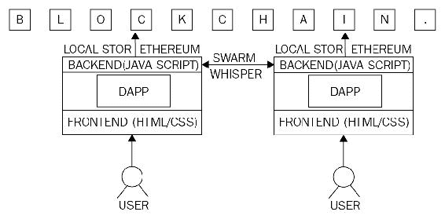

图表显示区块链，耳语和蜂群

# 在以太坊上开发的应用

以太坊中有各种 DAO 和智能合约的实现，最著名的是*DAO*，它最近被黑客攻击，需要硬分叉才能收回资金。创建 DAO 是为了作为一个收集和分配投资的分散平台。

Augur 是另一个已经在以太坊上实现的 DAPP，以太坊是一个去中心化的预测市场。其他各种分散的应用程序在[http://dapps.ethercasts.com/](http://dapps.ethercasts.com/)上列出。

# 可扩展性和安全性问题

在任何区块链中，可伸缩性都是一个基本问题。安全也是最重要的。隐私和保密等问题引发了一些适应性问题，尤其是在金融领域。然而，在这些领域正在进行大量的研究。关于所有区块链相关问题的更详细讨论将在[第 12 章](12.html "Chapter 12. Scalability and Other Challenges")、*可扩展性和其他挑战*中进行。

# 总结

本章首先讨论了以太坊的历史，以太坊发展背后的动机，以及以太坊的客户。然后，向您介绍了以太坊区块链的核心概念，如状态机模型、世界和机器状态、帐户和帐户类型。此外，还详细介绍了**以太坊虚拟机** ( **EVM** )的核心组件。还详细介绍和讨论了其他概念，如块、块结构、gas 和消息。本章的后面部分介绍了以太坊客户端的实际安装和管理。讨论了两个最受欢迎的客户端，geth 和 parity。在下一章中，我们将对这些客户端进行更深入的讨论，讨论使用以太坊进行开发。最后，介绍了支持协议和与以太坊面临的挑战相关的主题。以太坊正在不断发展，新的改进正由专门的开发者社区定期进行。以太坊的改进提案在 https://github.com/ethereum/EIPs 的[展出，这也表明了研究的规模和社区对这项技术的浓厚兴趣。此外，最近发起的一项倡议**企业以太坊联盟** ( **EAA** )旨在开发能够满足企业级业务需求的企业级以太坊平台。随着对可扩展性、优化、吞吐量、容量和安全性等主题的研究，预计随着时间的推移，以太坊将发展成为一个更加健壮、用户友好和稳定的区块链生态系统。](https://github.com/ethereum/EIPs)****