# 第八章。以太坊发展

本章介绍与以太坊开发相关的概念、技术和工具。本章将介绍几个例子来补充前面章节中提供的理论概念。本章将主要介绍开发环境的设置以及如何使用以太坊区块链创建智能合约。将提供详细的演练示例，帮助您理解如何使用以太坊和其他支持工具在区块链上开发和部署智能合约。

# 建立开发环境

第一个任务是建立一个开发环境。下一节将介绍以太坊对测试网和私有网的设置。Test Net 被称为 Ropsten，被开发人员或用户用作测试智能合约和其他区块链相关提案的测试平台。以太坊中的私有网络选项允许创建一个独立的私有网络，该网络可用作参与实体之间的分布式分类帐，并用于智能合约的开发和测试。虽然以太坊还有其他可用的客户端，比如上一章讨论过的奇偶校验，但是 geth 是以太坊的主要客户端和常用工具，因此本章将在示例中使用`geth`。

## 测试网(ropsten)

以太坊 Go 客户端`geth`可以使用以下命令连接到测试网络:

```
$ geth --TestNet

```

下面的屏幕截图显示了一个示例输出。该屏幕截图显示了所选网络的类型以及有关区块链下载的各种其他信息。

一个用于测试网络的区块链探索者位于 https://testnet.etherscan.io/的[，可以用来跟踪以太坊测试网络上的交易和块。](https://testnet.etherscan.io/)


连接到以太坊测试网络的 geth 命令的输出

## 建立专用网络

私人网络允许创造一个全新的区块链。这不同于测试网或主网，因为它使用它的起源块和网络 ID。为了创建专用网络，需要三个组件:

1.  网络 ID。
2.  创世纪文件。
3.  存储区块链数据的数据目录。尽管没有严格要求提及数据目录，但如果系统上已经有多个活动的区块链，则应指定数据目录，以便为新的区块链使用单独的目录。

私人网络允许创造一个全新的区块链。这不同于测试网或主网，因为它使用自己唯一的起源块和网络 ID。在主网上，geth 默认知道对等点并自动连接，但在专用网上，geth 需要通过指定适当的标志和配置来配置，以便它能够被其他对等点发现或发现其他对等点。

除了前面提到的三个组件之外，您最好禁用**节点发现**，这样互联网上的其他节点就无法发现您的私有网络，并且真正是私有的。如果其他网络碰巧有相同的源文件和网络 ID，它们可能会连接到您的专用网络。拥有相同网络 ID 和起源块的可能性非常低，但是，禁用节点发现是一种很好的做法，也是推荐的做法。

在下一节中，将通过一个实例详细讨论所有这些参数。

### 网络 ID

网络 ID 可以是除 1 和 3 之外的任何正数，这两个数字已经分别被以太坊主网和测试网(Ropsten)使用。网络 ID 786 已被选作本节稍后讨论的示例专用网络。

### 创世纪文件

genesis 文件包含自定义 genesis 块所需的必要字段。这是网络中的第一个块，不指向任何先前的块。以太坊协议执行严格的检查，以确保互联网上没有其他节点可以参与共识机制，除非它们具有相同的起源块。

下面显示了一个自定义的 genesis 文件，该文件将在后面的示例中使用:

```
{ 
  "nonce": "0x0000000000000042", 
    "timestamp": "0x0",    "parentHash":"0x0000000000000000000000000000000000000000000000000000000000000000", 
    "extraData": "0x0", 
    "gasLimit": "0x4c4b40", 
    "difficulty": "0x400", 
    "mixhash":"0x0000000000000000000000000000000000000000000000000000000000000000", 
    "coinbase": "0x0000000000000000000000000000000000000000", 
    "alloc": { } 
} 

```

该文件可以保存在扩展名为 JSON 的文本文件中；比如`privategenesis.json`。可选地，可以通过在`alloc`中指定受益者地址和 Wei 的数量来预分配以太网，但是这通常是不必要的，因为在私有网络上，以太网可以很快被开采。

### 数据目录

这是保存以太坊网络的区块链数据的目录。比如下面这个例子，就是`~/.ethereum/privatenet`。

在 geth 客户端中，指定了许多参数，以便启动、进一步微调配置和启动专用网络。这里列出了这些标志。

#### 旗帜及其含义

*   s 标志确保节点不会被自动发现，如果它碰巧有相同的源文件和网络 ID。
*   `--maxpeers`:该标志用于指定允许连接到私有网络的对等体的数量。如果它被设置为 0，那么没有人能够连接，这在一些场景中可能是可取的，比如私有测试。
*   `--rpc`:用于启用 geth 中的 RPC 接口。
*   `--rpcapi`:该标志将允许的 API 列表作为参数。例如，`eth,web3`将通过 RPC 启用 web3 和 eth 接口。
*   `--rpcport`:设置 TCP RPC 端口；比如:9999。
*   `--rpccorsdomain`:该标志指定允许连接到私有 geth 节点并执行 RPC 操作的 URL。
*   `--port`:指定 TCP 端口，用于监听来自其他对等方的传入连接。
*   `--identity`:该标志是指定私有节点名称的字符串。

### 静态节点

如果需要连接到一组特定的对等点，那么可以将这些节点添加到保存有`chaindata`和`keystore`文件的文件中，例如在`~/.ethereum/privatenet`目录中。文件名应该是`static-nodes.json`。这在专用网络中很有价值。json 文件的示例如下所示:

```
[ 
"enode:// 44352ede5b9e792e437c1c0431c1578ce3676a87e1f588434aff1299d30325c233c8d426fc57a25380481c8a36fb3be2787375e932fb4885885f6452f6efa77f@xxx.xxx.xxx.xxx:TCP_PORT" 
] 

```

这里，`xxx`是公共 IP 地址，`TCP_PORT`可以是系统上任何有效且可用的 TCP 端口。长的十六进制字符串是节点 ID。

## 启动专用网络

启动专用网络的初始命令如下所示:

```
$ geth --datadir ~/.ethereum/privatenet init ./privether/privategenesis.json

```

这将产生类似于以下屏幕截图所示的输出:


专用网络初始化

此输出表明已经成功创建了一个 genesis 块。为了启动`geth`,可以发出以下命令:

```
$ geth --datadir .ethereum/privatenet/ --networkid 786

```

这将产生以下输出:


为专用网络启动 geth

现在可以使用下面的命令通过 IPC 将`geth`连接到私有网络上正在运行的 geth 客户机。这将允许您与专用网络上正在运行的`geth`会话进行交互:

```
$ geth attach ipc:.ethereum/privatenet/geth.ipc

```

如此处所示，这将为正在运行的专用网络会话打开交互式 JavaScript 控制台:


开始连接专用网络 786

您可能已经注意到，当`geth`启动时，会出现一条警告消息。

### 注意

警告:没有以太基础集，也没有找到默认帐户

出现此消息是因为在新的测试网络中当前没有可用的帐户，并且没有帐户被设置为 etherbase 以接收采矿奖励。这个问题可以通过创建一个新帐户并将该帐户设置为 etherbase 来解决。当在测试网络上进行挖掘时，这也是需要的。这显示在以下命令中。注意，这些命令是在 geth JavaScript 控制台中输入的，如上图所示。

以下命令创建一个新帐户。在这种情况下，将在专用网络 ID 786 上创建帐户:

```
> personal.newAccount("Password123")
"0x76f11b383dbc3becf8c5d9309219878caae265c3"

```

创建帐户后，下一步是将其设置为 Etherbase/coinbase 帐户，以便采矿奖励进入该帐户。这可以使用以下命令来实现:

```
> miner.setEtherbase(personal.listAccounts[0])
true

```

目前，etherbase 帐户没有余额，使用以下命令可以看到:

```
> eth.getBalance(eth.coinbase).toNumber();
0

```

最后，只需发出以下命令就可以开始挖掘。该命令接受一个参数，即线程数量。在下面的示例中，通过将 2 指定为 start 函数的参数，将为挖掘过程分配两个线程:

```
> miner.start(2)
true

```

挖掘开始后，将执行第一次 DAG 生成，并生成类似于以下内容的输出:


DAG 生成

一旦 DAG 生成完成并开始挖掘，`geth`将产生类似于下面截图所示的输出。可以清楚地看到，利用`Mined 5 blocks . . .` 消息，区块正在被成功挖掘。


采矿产量

可以使用以下命令停止挖掘:

```
> miner.stop
true

```

在 JavaScript 控制台中，可以查询总以太的当前余额，如下所示。在挖掘之后，在下面的例子中可以看到相当大的数量。采矿速度极快，因为它是一个专用网络，而且在 genesis 文件中，网络难度也设置得相当低:

```
> eth.getBalance(eth.coinbase).toNumber();
2.72484375e+21

```

如果连续按下两个空格和两个制表符，将显示可用对象的完整列表。如下图所示:


可用对象

此外，当键入命令时，可以通过按 tab 键两次来自动完成。如果按下了两个选项卡，则还会显示可用方法的列表。如下图所示:


可用的方法

除了前面提到的命令之外，为了获得可用方法的列表，在键入任何命令之后，都要输入`;`(分号)。下一个屏幕截图中显示了一个例子，它显示了`net`可用的所有方法的列表:


方法列表

还有一些其他命令可用于查询专用网络。一些例子如下所示:

*   获取当前天然气价格:

```
> eth.gasPrice
20000000000

```   获取最新的块号:

```
> eth.blockNumber
587

```

调试问题时，Debug 可以派上用场。这里显示了一个命令示例；然而，有许多方法可用。以下方法将返回块`0`的 RLP:

*   **使用 RLP 编码**:

```
> debug.getBlockRlp(0)
 "f901f7f901f2a0000000000000000000000000000000000000000000000000
        0000000000000000a01dcc4de8dec75d7aab85b567b6ccd41ad312451b948a
        7413f0a142fd40d49347940000000000000000000000000000000000000000
        a056e81f171bcc55a6ff8345e692c0f86e5b48e01b996cadc001622fb5e363
        b421a056e81f171bcc55a6ff8345e692c0f86e5b48e01b996cadc001622fb5
        e363b421a056e81f171bcc55a6ff8345e692c0f86e5b48e01b996cadc00162
        2fb5e363b421b9010000000000000000000000000000000000000000000000
        00000000000000000000000000000000000000000000000000000000000000  
        00000000000000000000000000000000000000000000000000000000000000
        00000000000000000000000000000000000000000000000000000000000000
        00000000000000000000000000000000000000000000000000000000000000
        00000000000000000000000000000000000000000000000000000000000000
        00000000000000000000000000000000000000000000000000000000000000
        00000000000000000000000000000000000000000000000000000000000000
        000000000000000000000000000000000082020080834c4b40808000a00000
        00000000000000000000000000000000000000000000000000000000000088
        0000000000000042c0c0"

```   **发送交易前解锁账户**:

```
> personal.unlockAccount
        ("0x76f11b383dbc3becf8c5d9309219878caae265c3")
Unlock account 0x76f11b383dbc3becf8c5d9309219878caae265c3
Passphrase:

```   **发送交易**:

```
> eth.sendTransaction({from:   
        "0x76f11b383dbc3becf8c5d9309219878caae265c3", to:  
        "0xcce6450413ac80f9ee8bd97ca02b92c065d77abc", value: 1000})

```

另一种方法是使用`listAccounts[]`方法，这可以如下图所示完成:

```
> eth.sendTransaction({from: personal.listAccounts[0], to:   
        personal.listAccounts[1], value: 1000})

```   获取编译器列表。注意，如果没有显示输出，意味着没有安装 solidity 编译器；本章后面提供了 solidity 编译器安装的详细信息:

```
> web3.eth.getCompilers()
["Solidity"]

```

### 私网上跑雾

可以通过发出以下命令在专用网络上运行 Mist。这个二进制文件通常在安装完`/opt/Ethereum`后可以在`home`文件夹中找到:

```
$ ./Ethereum\ Wallet --rpc ~/.ethereum/privatenet/geth.ipc

```

这将允许连接到正在运行的私有网络`geth`会话，并提供所有功能，如钱包、账户管理和通过 Mist 在私有网络上部署合同。

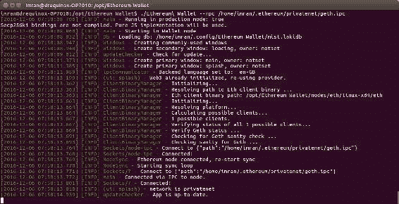

运行以太坊钱包以连接到专用网络

一旦以太坊启动，它将显示这里显示的界面，清楚地表明它运行在**私网**模式。


私有网络上的薄雾

Mist 也可以使用 RPC 在网络上运行。如果`geth`在不同的节点上运行，而 Mist 在另一个节点上运行，这是很有用的。这可以通过运行带有如下所示标志的 Mist 来实现:

```
--rpc http://127.0.0.1:8545

```

### 使用 Mist 部署合同

使用 Mist 部署新合同非常容易。Mist 提供了一个接口，在这里可以用 solidity 编写合同，然后部署到网络上。

在本练习中，将使用一个简单的契约，它可以对输入参数执行各种简单的算术计算。这里显示了如何使用 Mist 部署这个契约的步骤。由于 solidity 还没有引入，这里的目的是让用户体验契约部署和交互过程。关于编码和可靠性的更多信息将在本章的后面提供，在此之后，理解所示的代码将变得容易。那些已经熟悉 JavaScript 或任何其他类似语言的人会发现代码几乎是不言自明的。

合同源代码示例如下所示:

```
pragma solidity ^0.4.0; 
contract SimpleContract2
{ 
  uint x; 
  uint z; 
  function addition(uint x) returns (uint y)
{ 
  z=x+5; 
  y=z; 
} 
function difference(uint x) returns (uint y)
{ 
  z=x-5; 
  y=z; 
}  
function division(uint x) returns (uint y) 
{ 
 z=x/5; 
 y=z; 
} 

function currValue() constant returns (uint) 
{ 
 return z; 
} 
} 

```

这段代码可以简单地复制到 Mist 的 contracts 部分，如下所示。在左手边，可以复制源代码；验证后，如果没有检测到语法错误，部署合同的选项将出现在右侧的下拉菜单中，显示为 **SELLECT CONTRACT TO DEPLOY** 。只需选择合同并按下屏幕底部的 D **eploy** 按钮。


Mist 浏览器合同部署

Mist 将询问帐户的密码，并将显示一个类似于以下屏幕截图的窗口:

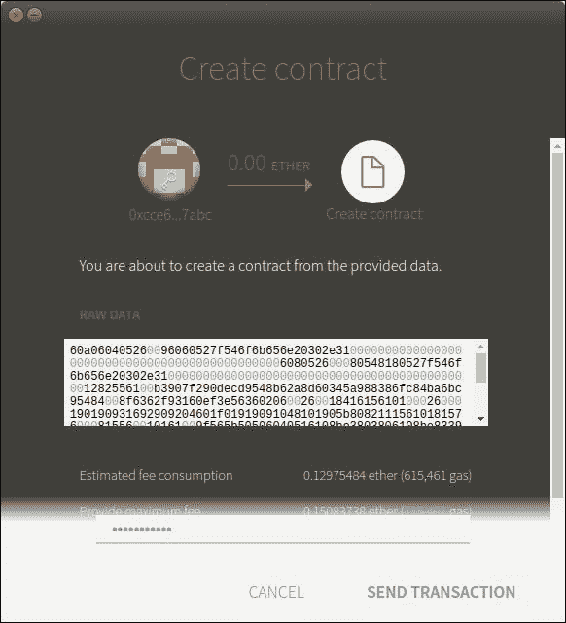

使用 Mist 创建合同

输入密码并点击**发送交易**以部署合同。

一旦部署和挖掘成功，它将出现在 Mist 的事务列表中，如下所示:

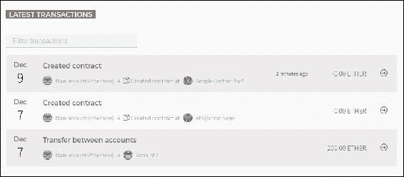

在 Mist 中创建后的交易列表

一旦契约可用，就可以通过 Mist 使用执行事务和调用可用的函数进行交互。

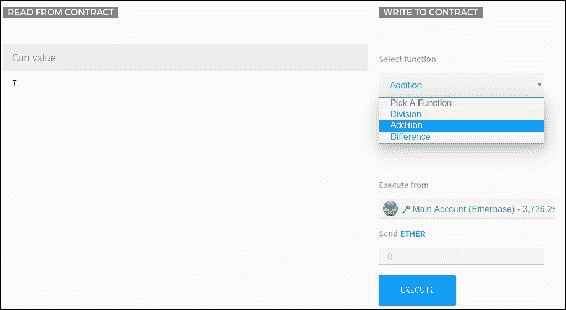

使用 Mist 中的读写选项与合同进行交互

在前面的截图中，从合同读取的**和从合同**写入的**选项是可用的。此外，在右手边可以看到契约已经公开的功能。一旦选择了所需的函数，就为该函数输入适当的值，并选择帐户(执行自)；按“执行”以执行交易，这将导致调用合同的所选功能。**

这个过程如下面的截图所示:

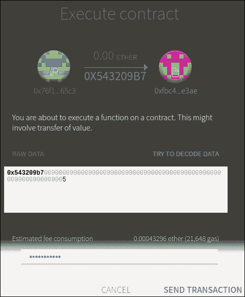

迷雾中的合同执行

如屏幕截图所示，输入账户的适当密码，然后按**发送交易**将交易发送至合同。

# 开发工具和客户端

以太坊开发有很多可用的工具。下图显示了以太坊的各种开发工具、客户端、ide 和开发框架的分类:


以太坊生态系统组件的分类

在这一章中，主要的焦点将集中在`geth`、浏览器可靠性、solidity、solc 和 truffle 上。其余的元素将简要讨论。

## 语言

合同可以用多种语言编写。有四种语言可以用来写合同:

*   **Mutan** :这是一种 Go 风格的语言，2015 年初已经弃用，不再使用。
*   LLL:这是一种类似 Lisp 的语言，因此得名 LLL。这也不再使用了。
*   这是一种简单干净的类似 Python 的语言。它被积极地用于合同开发。
*   这种语言现在几乎已经成为以太坊合同写作的标准。这种语言是本章的重点，将在后面的章节中详细讨论。

## 编译器

编译器用于将高级契约源代码转换成以太坊执行环境理解的格式。solidity 编译器是最常用的编译器，在这里讨论。

### Solc

solidity 编译器将高级 solidity 语言转换成**以太坊虚拟机** ( **EVM** )字节码，这样它就可以被 EVM 在区块链上执行。

Linux Ubuntu 操作系统上的 solidity 编译器可以使用以下命令进行安装:

```
$ sudo apt-get install solc

```

如果尚未安装 PPAs，可以通过运行以下命令进行安装:

```
sudo add-apt-repository ppa:ethereum/ethereum
sudo apt-get update

```

为了验证 solidity 编译器的现有版本并验证它是否已安装，可以使用以下命令:

```
$ solc --version
solc, the solidity compiler commandline interface
Version: 0.4.6+commit.2dabbdf0.Linux.g++

```

Solc 支持多种功能。下面是几个例子:

*   Display contract in a binary format.

    

    可靠性编译器二进制输出

*   估计气体:

```
imran@drequinox-OP7010:~$ solc --gas contract1.sol
======= SimpleContract =======
Gas estimation:
construction:
 97 + 54600 = 54697
external:
 division(uint256):   230
 addition(uint256):   231
 difference(uint256): 253
internal:

```

注意`contrat1.sol`仅作为示例显示；该文件可以包含任何智能合约可靠性代码。这里没有显示文件的代码。

web3 从`geth`控制台内部使用 Solc 来编译合同。这里显示了语法，`contractsourcecode`是 solidity 源代码:

```
web3.eth.compile.solidity(contractsourcecode)

```

这将在本章后面详细讨论，届时将向您介绍合同开发。

### 集成开发环境

solidity 开发有多种 ide 可供选择。大多数 ide 都可以在线获得，并通过 web 界面呈现。浏览器可靠性最常用于较小的合同，在这里讨论。

#### 浏览器可靠性

Browser solidity 是使用 solidity 开发和测试合同的基于网络的环境。它不能在区块链上运行；事实上，它是一个模拟环境，可以在其中部署、测试和调试契约。在[https://ethereum.github.io/browser-solidity](https://ethereum.github.io/browser-solidity)有售。界面示例如下所示:


浏览器可靠性

在左侧，有一个带有语法突出显示和代码格式化的代码编辑器，在右侧，有许多工具可用于部署、调试、测试和与契约交互。各种特性都是可用的，比如事务交互、连接到 JavaScript VM 的选项、执行环境的配置、调试器、形式验证和静态分析。它们可以配置为连接到执行环境，如 JavaScript VM、injected Web3(其中 Mist 或类似的环境提供了执行环境)或 Web3 provider，后者允许通过 IPC 或 RPC over HTTP (web3 provider 端点)连接到本地运行的以太坊客户端(例如，`geth`)。

#### 混合

2016 年 8 月 Mix IDE 停产后，开始了 Remix 项目。Remix 是一个基于浏览器的 IDE，目前正在大力开发，目前只有调试器部分可用。这个调试器非常强大，可以用来对 EVM 字节码进行详细的跟踪和分析。在下一节中，将介绍 Remix 的安装和使用示例。

#### 安装

混音在[https://github.com/ethereum/remix](https://github.com/ethereum/remix)有售。第一步是克隆 GitHub 存储库:

```
$ git clone https://github.com/ethereum/remix
Cloning into 'remix'...
remote: Counting objects: 2185, done.
remote: Compressing objects: 100% (213/213), done.
remote: Total 2185 (delta 124), reused 0 (delta 0), pack-reused 1971
Receiving objects: 100% (2185/2185), 1.12 MiB | 443.00 KiB/s, done.
Resolving deltas: 100% (1438/1438), done.
Checking connectivity... done.

```

成功完成上述步骤后，执行以下命令:

```
cd remix
npm install
npm run build

```

此时，可以运行`npm run start_node`，或者使用适当的标志启动`geth`。一旦`geth`启动并运行，一个简单的网络服务器就可以运行，为 remix 网页提供服务。现在`geth`可以通过以下命令启动:

```
$ geth --datadir .ethereum/privatenet/ --networkid 786 --rpc --rpcapi 'web3,eth,debug' --rpcport 8001 --rpccorsdomain 'http://localhost:7777'

```

注意`--rpcapi`标志；为了允许`web3`、`eth`、`debug`通过 RPC，这是必需的。

如果运行 `npm run start_node`,可能会出现以下信息:

```
$ npm run start_node
> ethereum-remix@0.0.2-alpha.0.0.9 start_node /home/imran/remix
> ./runNode.sh
both eth and geth has been found in your system
restart the command with the desired client:
npm run start_eth
or
npm run start_geth

```

假设需要`geth`，使用以下命令:

```
$ npm run start_geth

```

如果选择运行`geth`，那么需要一个简单的 web 服务器来浏览 remix 网页。这可以简单地通过发出 Python 命令来实现，如下所示。这应该从`remix`目录运行。


Python 快速 web 服务器

一旦命令成功并且 web 服务器正在运行，就可以使用`http://localhost:7777` URL 浏览 remix，如下面的屏幕截图所示:


网络浏览器显示通过 TCP 7777 运行和服务的混音

Remix 也可以作为浏览器坚固性的一部分(浏览器坚固性在前面已经单独讨论过了)。它可以通过提供 web3 提供者端点连接到本地专用网。这显示如下:


连接到本地`geth`节点的浏览器可靠性上的 **Web3 提供者**选项如下:


浏览器可靠性中的混合调试器

### 工具和库

以太坊有各种工具和库。这里讨论最常见的几种。

#### Node.js 第七版

因为大多数工具和库都需要 Node js，所以可以使用以下命令安装它:

```
curl -sL https://deb.nodesource.com/setup_7.x | sudo -E bash -
sudo apt-get install -y nodejs

```

#### 本地以太坊街区探索者

本地以太坊街区浏览器是一个有用的工具，可以用来探索本地区块链。这可以通过以下步骤进行安装:

在 Linux Ubuntu 机器上，运行以下命令以安装本地以太坊块浏览器:

```
$ git clone https://github.com/etherparty/explorer

```

这将显示类似如下的输出:

```
Cloning into 'explorer'...
remote: Counting objects: 253, done.
remote: Total 253 (delta 0), reused 0 (delta 0), pack-reused 253
Receiving objects: 100% (253/253), 51.20 KiB | 0 bytes/s, done.
Resolving deltas: 100% (130/130), done.
Checking connectivity... done.

```

下一步是将目录更改为 explorer 并运行以下命令:

```
imran@drequinox-OP7010:~$ cd explorer/
imran@drequinox-OP7010:~/explorer$ npm start
> EthereumExplorer@0.1.0 prestart /home/imran/explorer
> npm install

```

安装完成后，将显示类似于以下内容的输出，其中以太坊浏览器的 HTTP 服务器启动:


以太坊浏览器 HTTP 服务器

一旦 web 服务器启动，应该使用以下命令启动`geth`:

```
geth --datadir .ethereum/privatenet/ --networkid 786 --rpc --rpccorsdomain 'http://localhost:8000'

```

成功启动`geth`后，在 TCP `port 8000`上导航到本地主机，如此处所示，以便访问本地以太坊块浏览器。

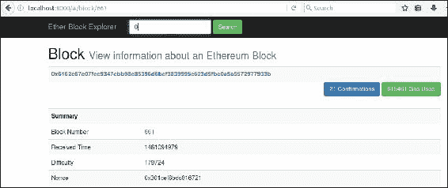

块浏览器

或者，可以使用 Python 或任何其他合适的提供者来启动 web 服务器。在 Python 中，可以启动一个快速 web 服务器，如下面的代码所示:

```
imran@drequinox-OP7010:~/explorer/app$ python -m SimpleHTTPServer 9900
Serving HTTP on 0.0.0.0 port 9900 ...

```

需要用适当的参数启动`geth`客户端。否则，可能会出现类似以下屏幕截图所示的错误:


错误消息以太坊本地块浏览器

重启`geth`以允许`rpccorsdomain`:

```
geth --datadir .ethereum/PrivateNet/ --networkid 786 --rpc --rpccorsdomain 'http://192.168.0.17:9900'

```

### ethereums

有时，不可能在测试网上测试，主网显然不是测试合同的地方。建立专用网络有时很费时间。当需要快速测试并且没有合适的测试网络可用时，EthereumJS testrpc 非常方便。它使用 EthereumJS 来模拟以太坊`geth`的客户端行为，并允许更快的开发测试。Testrpc 作为节点包通过 npm 提供。

在安装 testrpc 之前，应该已经安装了 Node.js，并且 npm 包管理器也应该可用。

可以使用以下命令安装 Testrpc:

```
npm install -g ethereumjs-testrpc

```

为了启动 testrpc，只需发出这个命令并让它在后台运行，然后打开另一个终端来处理合同。

```
$testrpc

```

## 合同开发和部署

为了开发和部署合同，需要采取各种步骤。大体上，这些可以分为四个步骤:编写、测试、验证和部署。部署之后，下一步是创建用户界面，并通过 web 服务器呈现给最终用户。

编写步骤与编写 solidity 中的合同源代码有关。这可以在任何文本编辑器中完成。在 Linux、Atom 和其他编辑器中，有各种插件和附件可用于 Vim，为 solidity 源代码提供语法高亮和格式化。

测试通常由自动化手段来执行。在本章的后面，将向您介绍 truffle，它使用 Mocha 框架来测试合同。然而，也可以执行手动测试。一旦合同在模拟环境(例如 EthereumJS testrpc)或专用网络上得到验证、运行和测试，它就可以部署到 Ropsten 测试网络并最终部署到 live 区块链(Homestead)。

在下一节中，将向你介绍语言的可靠性。这是对 solidity 的一个简要介绍，它应该提供编写合同所需的基础知识。语法非常类似于 C 和 JavaScript，编程起来相当容易。

# 介绍坚固性

Solidity 是以太坊中用于编程契约的特定领域语言。然而，也有其他语言，如蛇语、变形语和 LLL 语，但是在我写这篇文章的时候，solidity 是最流行的。它的语法更接近 JavaScript 和 c。Solidity 在过去几年中已经发展成为一种成熟的语言，非常容易使用，但要像其他成熟的语言一样变得高级和功能丰富，它还有很长的路要走。然而，这是目前可用于编程契约的最广泛使用的语言。

它是一种静态类型语言，这意味着 solidity 中的变量类型检查是在编译时进行的。每个变量，无论是状态变量还是局部变量，都必须在编译时指定类型。这是有益的，因为任何验证和检查都是在编译时完成的，某些类型的错误，如数据类型的解释，可以在开发周期的早期而不是在运行时被发现，这可能是昂贵的，特别是在区块链/智能合同范例的情况下。该语言的其他特性包括继承、库和定义复合数据类型的能力。

Solidity 也是一种叫做面向契约的语言。在 solidity 中，契约相当于其他面向对象编程语言中的类的概念。

## 类型

Solidity 有两类数据类型:值类型和引用类型。

### 值类型

这些在这里详细解释。

#### Boolean

此数据类型有两个可能的值，true 或 false，例如:

```
bool v = true; 

```

该语句将值`true`分配给`v`。

#### 整数

此数据类型表示整数。这里显示了一个表，其中显示了用于声明整数数据类型的各种关键字。

<colgroup class="calibre13"><col class="calibre14"> <col class="calibre14"> <col class="calibre14"></colgroup> 
| 关键字 | 类型 | 细节 |
| `int` | 带符号整数 | int8 到 int256，这意味着关键字从 int8 到 int256，增量为 8，例如 int8、int16、int24。 |
| `uint` | 无符号整数 | uint8 to uint256 |

例如，在这段代码中，注意`uint`是`uint256`的别名:

```
uint256 x; 
uint y; 
int256 z; 

```

这些类型也可以用关键字`constant`声明，这意味着编译器不会为这些变量保留存储槽。在这种情况下，每次出现都将被替换为实际值:

```
uint constant z=10+10; 

```

状态变量是在函数体之外声明的，根据分配给它们的可访问性，只要契约持续，它们在整个契约中都是可用的。

#### 地址

该数据类型包含一个 160 位长(20 字节)的值。该类型有几个成员，可用于与合同交互和查询合同。这些成员描述如下:

**平衡**

balance 成员返回地址在 Wei 中的余额。

**发送**

此成员用于向某个地址(以太坊的 160 位地址)发送一定数量的以太，并根据事务的结果返回 true 或 false，例如:

```
address to = 0x6414cc08d148dce9ebf5a2d0b7c220ed2d3203da; 
address from = this; 
if (to.balance < 10 && from.balance > 50) to.send(20); 

```调用函数**

提供 `call`、`callcode`、`delegatecall`是为了与没有**应用二进制接口** ( **、**)的函数进行交互。应该谨慎使用这些函数，因为它们对类型安全和合同安全有影响，使用起来不安全。

#### 数组值类型(固定大小和动态大小的字节数组)

Solidity 有固定大小和动态大小的字节数组。固定大小的关键字范围从`bytes1`到`bytes32`，而动态大小的关键字包括字节和字符串。`bytes`用于原始字节数据，string 用于 UTF-8 编码的字符串。因为这些数组是由值返回的，所以调用它们会导致开销。`length`是数组值类型的成员，返回字节数组的长度。

静态(固定大小)数组的示例如下:

```
bytes32[10] bankAccounts;  

```

动态调整大小的数组示例如下:

```
bytes32[] trades;  

```

获得交易的`length`:

```
trades.length; 

```

### 文字

这些用于表示固定值。

#### 整数文字

整数是范围在 0-9 之间的十进制数字序列。一个例子如下所示:

```
uint8 x = 2; 

```

#### 字符串文字

字符串文字指定用双引号或单引号书写的一组字符。一个例子如下所示:

```
'packt' 
"packt" 

```

#### 十六进制文字

十六进制文字以关键字 hex 为前缀，并在双引号或单引号内指定。一个例子如下所示:

```
(hex'AABBCC'); 

```

### 列举

这允许创建用户定义的类型。一个例子如下所示:

```
enum Order{Filled, Placed, Expired }; 
Order private ord; 
ord=Order.Filled; 

```

枚举允许在所有整数类型之间进行显式转换。

### 功能类型

有两种函数类型:内部函数和外部函数。

#### 内部功能

这些只能在当前合同的上下文中使用。

#### 外部功能

外部函数可以通过外部函数调用来调用。

固体中的函数可以标为常数。常量函数不能改变契约中的任何东西；它们只在被调用时返回值，并且不消耗任何气体。这是上一章讨论的*调用*概念的实际实现。

声明函数的语法如下所示:

```
function <nameofthefunction> (<parameter types> <name of the variable>) {internal|external} [constant] [payable] [returns (<return types> <name of the variable>)] 

```

### 参考类型

顾名思义，这些类型是通过引用传递的，将在下一节中讨论。

#### 数组

数组表示一组连续的元素，这些元素在一个内存位置上具有相同的大小和类型。这个概念与任何其他编程语言都是一样的。数组有两个名为`length`和`push`的成员:

```
uint[] OrderIds; 

```

#### 结构

这些结构可用于将一组不同的数据类型归入一个逻辑组。这些可用于定义新类型，如下例所示:

```
Struct Trade 
{ 
uint tradeid; 
uint quantity; 
uint price; 
string trader; 
} 

```

#### 数据位置

数据位置指定特定复杂数据类型的存储位置。根据指定的缺省值或注释，该位置可以是存储器或内存。这适用于数组和结构，可以使用**存储**或**内存**关键字来指定。由于在内存和存储之间进行复制可能会非常昂贵，因此指定一个位置有时会有助于控制气体消耗。 **Calldata** 是另一个用来存储函数参数的内存位置。外部函数的参数使用 **calldata** 内存。默认情况下，函数的参数存储在**存储器**中，而所有其他局部变量使用**存储器**。另一方面，状态变量需要使用**存储**。

### 映射

映射用于键到值的映射。这是一种将值与键相关联的方式。此映射中的所有值都已初始化为全零，例如:

```
mapping (address => uint) offers; 

```

这个例子显示了`offers`被声明为映射。另一个例子更清楚地说明了这一点:

```
mapping (string => uint) bids; 
bids["packt"] = 10; 

```

这基本上是一个字典或散列表，其中字符串值被映射到整数值。名为`bids`的映射有一个映射到值`10`的`packt`字符串值。

### 全局变量

Solidity 提供了许多在全局名称空间中总是可用的全局变量。这些变量提供关于块和事务的信息。此外，还提供加密功能和地址相关变量。

可用函数和变量的子集如下所示:

```
keccak256(...) returns (bytes32) 

```

此函数用于计算提供给函数的参数的`keccak256`散列:

```
ecrecover(bytes32 hash, uint8 v, bytes32 r, bytes32 s) returns (address) 

```

此函数从椭圆曲线签名返回公钥的关联地址:

```
block.number 

```

这将返回当前的块号。

### 控制结构

固体中可用的控制结构有`if - else`、`do`、`while`、`for`、`break`、`continue`、`return`。它们的工作方式类似于 C 语言或 JavaScript。

#### 事件

solidity 中的事件可用于在 EVM 日志中记录某些事件。当需要将契约中的任何更改或事件通知给外部接口时，这些非常有用。这些日志存储在区块链的事务日志中。不能从契约中访问日志，但日志被用作一种机制来通知契约中的状态变化或事件(满足条件)的发生。

在这里的一个简单例子中，如果传递给`function Matcher`的`x`参数等于或大于`10`，则`valueEvent`事件将返回 true:

```
contract valueChecker { 
    uint8 price=10; 
    event valueEvent(bool returnValue); 
    function Matcher(uint8 x) returns (bool) 
    { 
        if (x>=price) 
        { 
            valueEvent(true); 
            return true; 

        } 
     } 
} 

```

#### 继承

坚固性支持继承。`is`关键字用于从另一个合同中派生出一个合同。在下面的例子中，`valueChecker2`是从`valueChecker`合同中派生出来的。派生合同可以访问父合同的所有非私有成员:

```
contract valueChecker 
{ 
 uint8 price=10; 
 event valueEvent(bool returnValue); 
 function Matcher(uint8 x) returns (bool) 
 { 
  if (x>=price) 
  { 
   valueEvent(true); 
   return true;    
  } 
 } 
} 
contract valueChecker2 is valueChecker
{ 
 function Matcher2() returns (uint) 
 { 
  return price + 10; 
 } 
} 

```

在前面的例子中，如果`uint8 price = 10`被更改为`uint8 private price = 10`，那么它将不能被`valuechecker2`契约访问。这是因为现在该成员被声明为私有，不允许任何其他协定访问它。

#### 图书馆

库只在特定地址部署一次，它们的代码通过 EVM 的 CALLCODE/DELEGATECALL 操作码调用。库背后的关键思想是代码的可重用性。它们类似于合约，并充当调用合约的基础合约。可以声明一个库，如下例所示:

```
library Addition 
{ 
 function Add(uint x,uint y) returns (uint z) 
  { 
    return x + y; 
  } 
} 

```

然后可以在契约中调用这个库，如下所示。首先，它需要被导入，并且可以在代码中的任何地方使用。一个简单的例子如下所示:

```
Import "Addition.sol" 
function Addtwovalues() returns(uint) 
{ 
 return Addition.Add(100,100); 
} 

```

库有一些限制；例如，它们不能有状态变量，也不能继承或被继承。此外，他们也不能接受乙醚；这与可以接收以太网的合同相反。

#### 功能

solidity 中的功能是与合同相关联的代码模块。函数用名称、可选参数、访问修饰符、可选常量关键字和可选返回类型来声明。这显示在以下示例中:

```
function orderMatcher(uint x) private constant returns(bool returnvalue) 

```

在前面的示例中，`function`是用于声明函数的关键字。`orderMatcher`是函数名，`uint x`是可选参数，`private`是**访问修饰符/说明符**，用于控制从外部契约对函数的访问，`constant`是可选关键字，用于指定该函数不改变契约中的任何内容，而是仅用于从契约中检索值，`returns (bool returnvalue)`是函数的可选返回类型。

*   **如何定义函数**:定义函数的语法如下:

    ```
            function <name of the function>(<parameters>) <visibility     
            specifier> returns (<return data type> <name of the variable>) 
            { 
             <function body> 
            } 

    ```   **Function signature**: Functions in solidity are identified by its signature, which is the first four bytes of the keccak-256 hash of its full signature string. This is also visible in browser solidity, as shown in the following screenshot. **D99c89cb** is the first four bytes of 32 byte keccak-256 hash of the function named **Matcher**.

    

    函数散列如浏览器可靠性所示

在这个示例函数中，**匹配器**的签名哈希为 **d99c89cb** 。这些信息对于构建接口非常有用。

*   **函数的输入参数**:函数的输入参数以<数据类型> <参数名称>的形式声明。这个例子阐明了这个概念，其中`uint x`和`uint y`是`checkValues`函数的输入参数:

    ```
            contract myContract  
            { 
             function checkValues(uint x, uint y)  
             { 
             } 
            } 

    ```   **Output parameters of a function**: Output parameters of a function are declared in the form of <data type> <parameter name>. This example shows a simple function returning a `uint` value:

    ```
            contract myContract  
            { 
             Function getValue() returns (uint z) 
             { 
              z=x+y; 
             } 
            } 

    ```

    一个函数可以返回多个值。在前面的示例函数中，`getValue`只返回一个值，但是一个函数可以返回多达 14 个不同数据类型的值。可以选择省略未使用的返回参数的名称。

*   **内部函数调用**:可以直接在内部调用当前契约上下文中的函数。这些调用是为了调用同一契约中存在的函数。这些调用导致 EVM 字节码级别的简单跳转调用。
*   **外部函数调用**:外部函数调用是通过从一个合同到另一个合同的消息调用实现的。在这种情况下，所有功能参数都被复制到存储器中。如果使用`this`关键字调用内部函数，它也被认为是外部调用。`this`变量是一个指向当前合同的指针。它可以显式转换为地址，并且协定的所有成员都是从该地址继承的。
*   **Fall back functions**: This is an unnamed function in a contract with no arguments and return data. This function executes every time ether is received. It is required to be implemented within a contract if the contract is intended to receive ether; otherwise, an exception will be thrown and ether will be returned. This function also executes if no other function signatures match in the contract. If the contract is expected to receive ether, then the fall back function should be declared with the `payable`**modifier**. The `payable` is required; otherwise, this function will not be able to receive any ether. This function can be called using the `address.call()` method as, for example, in the following:

    ```
           function ()  
           { 
            throw;  
           } 

    ```

    这种情况下，如果按照前面描述的条件调用`fallback`函数；它将调用 throw，这将回滚到调用之前的状态。它也可以是 throw 之外的其他结构；例如，它可以记录一个事件，该事件可以用作警报，将调用结果反馈给调用应用程序。

*   **修改函数**:这些函数用来改变一个函数的行为，可以在其他函数之前调用。通常，它们用于在执行函数之前检查一些条件或验证。`_`(下划线)用于修饰符函数中，当调用修饰符时，将被替换为函数的实际主体。基本上，它象征着需要*守护*的功能。这个概念类似于其他语言中的 guard 函数。
*   **构造函数**:这是一个可选函数，与合同同名，一旦创建合同就执行。构造函数不能被用户调用，并且在一个契约中只允许有一个构造函数。这意味着没有重载功能可用。
*   **Function visibility specifiers (access modifiers)**: Functions can be defined with four access specifiers as follows:
    *   **外部**:这些功能可以从其他合同和交易中访问。除非使用关键字`this`，否则不能在内部调用它们。
    *   **公共**:默认情况下，函数是公共的。它们既可以在内部调用，也可以使用消息调用。
    *   **Internal** :内部函数对父合同的其他派生合同可见。
    *   私有函数:私有函数只对声明它们的同一个契约可见。
*   **其他重要关键字/函数抛出** : `throw`用于停止执行。因此，所有状态更改都会被还原。在这种情况下，没有气体返回给交易发起者，因为所有剩余的气体都被消耗掉了。

#### solidity 源代码文件的布局

**版本杂注**

为了解决 solidity 编译器版本的未来版本中可能出现的兼容性问题，可以使用 pragma 来指定兼容编译器的版本，例如，如下所示:

```
pragma solidity ^0.5.0 

```

这将确保源文件不会被小于`0.5.0`的版本和从 0.6.0 开始的版本编译。

**导入**

实体导入允许将符号从现有实体文件导入到当前全局范围。这类似于 JavaScript 中可用的导入语句，例如:

```
Import "module-name"; 

```评论**

可以以类似于 C 语言的方式在 solidity 源代码文件中添加注释。多行注释包含在`/*`和`*/`中，而单行注释以 `//`开始。

下面是一个示例 solidity 程序，显示了 pragma、import 和 comments 的用法:

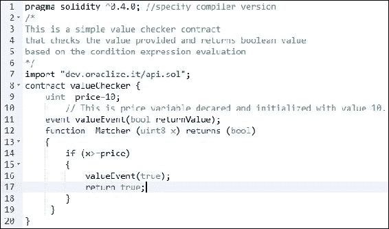

浏览器坚固性中显示的示例坚固性程序

这就完成了对 solidity 语言的简单介绍。这种语言非常丰富，并且在不断改进。详细的文档和编码指南可以在网上找到。

# 介绍 Web3

Web3 是一个 JavaScript 库，可用于通过 RPC 通信与以太坊节点通信。Web3 通过公开已经通过 RPC 启用的方法来工作。这允许开发利用 web3 库的用户界面，以便与部署在区块链上的合同进行交互。

为了通过`geth`公开方法，可以使用以下命令:

```
$ geth --datadir .ethereum/privatenet/ --networkid 786 --rpc --rpcapi 'web3,eth,debug' --rpcport 8001 --rpccorsdomain 'http://localhost:7777'

```

注意允许使用`web3, eth`和`debug`方法的`--rpcapi`标志。

这是一个强大的库，可以通过附加一个`geth`实例来进一步探索。在本节的后面，将向您介绍通过 JavaScript/HTML 前端使用 web3 的概念和技术。

可以使用以下命令附加`geth`实例:

```
$ geth attach ipc:.ethereum/privatenet/geth.ipc

```

一旦`geth` JavaScript 控制台运行，就可以查询 web3，例如:


web3 via geth

可以使用`geth`部署一个简单的契约，并通过`geth`提供的命令行界面(控制台或附加)使用 web3 进行交互。以下是实现这一目标的步骤。例如，将使用以下源代码:

```
pragma solidity ^0.4.0; 
contract valueChecker { 
    uint  price=10; 
    event valueEvent(bool returnValue); 
    function  Matcher (uint8 x) returns (bool) 
    { 
        if (x>=price) 
        { 
            valueEvent(true); 
            return true; 
        } 
     } 
} 

```

现在打开之前已经打开的`geth`控制台，并遵循以下步骤:

1.  Declare a variable named `simplecontractsource` and assign the program code to it:

    ```
    > var simplecontractsource = "pragma solidity ^0.4.0; contract  
        valueChecker { uint price=10;event valueEvent(bool returnValue);    
        function Matcher (uint8 x) returns (bool) { if (x>=price) 
        {valueEvent(true); return true; } } }"

    ```

    这将显示以下输出:

    ```
     undefined

    ```

    请注意，源代码需要在一行中，这意味着不能有换行符。这可以在 Linux 中使用以下命令来实现:

    ```
    $ tr --delete '\n' < valuechecker.sol > valuecheckersingleline.sol

    ```

    在前面的例子中，`valuechecker.sol`是包含新行字符`\n`的文件，`valuecheckersingleline.sol`是从文件中删除新行字符后产生的输出文件。然后可以将代码从文件中复制并粘贴到`geth` JavaScript 控制台中。

2.  现在验证 solidity 编译器是否可用，如果不可用，请参考本章中解释 solidity 安装的章节:

    ```
    > eth.getCompilers()
    ["Solidity"]

    ```

3.  创建一个变量，使用 solidity:

    ```
    > var  
        simplecontractcompiled=eth.compile.solidity(simplecontractsource)
    undefined

    ```

    赋值并编译代码
4.  Enter `simplecontractcompiled`; it will display output similar to the following. as `simplecontractcompiled` has been assigned the data from preceding step 3.

    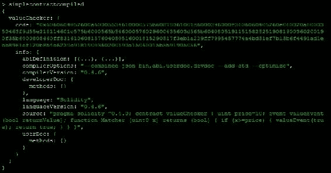

    simplecontractcompiled 输出

5.  创建一个变量与合同进行交互:

    ```
    >var simplecontractinteractor=eth.contract
        (simplecontractcompiled.valueChecker.info.abiDefinition);
    undefined

    ```

6.  检查 **ABI** ( **应用二进制接口** ):

    ```
    > simplecontractinteractor.abi
    [{
     constant: false,
     inputs: [{
     name: "x",
     type: "uint8"
     }],
     name: "Matcher",
     outputs: [{
     name: "",
     type: "bool"
     }],
     payable: false,
     type: "function"
    }, {
     anonymous: false,
     inputs: [{
     indexed: false,
     name: "returnValue",
     type: "bool"
     }],
     name: "valueEvent",
     type: "event"
    }]

    ```

7.  Check the code of `valueChecker` in the hexadecimal format:

    ```
    > simplecontractcompiled.valueChecker.code

    ```

    这将返回以下输出。对你来说可能略有不同:

    ```
     "0x6060604052600a60005534610000575b60878061001c6000396000f36060604
        05260e060020a6000350463f9d55e218114601c575b6000565b3460005760296004
        35603d565b604080519115158252519081900360200190f35b6000805460ff83161
        0608157604080516001815290517f3eb1a229ff7995457774a4bd31ef7b13b6f449
        1ad1ebb8961af120b8b4b6239c9181900360200190a15060015b5b91905056"

    ```

8.  Now enter the following piece of code; note that the data field contains the code for `simplecontractcompiled:`

    ```
    >var simplecontractTransaction = simplecontractinteractor.new({
     from: eth.coinbase,
     data: simplecontractcompiled.valueChecker.code,
     gas: 2000000
     },
     function(err, contract) {
     if (err) {
     console.error(err);
     } else {
     console.log(contract);
     console.log(contract.address);
     }
    });

    ```

    假设它返回一条错误消息:

    ```
     Error: account is locked
     Undefined

    ```

    如果是这样，那么使用以下命令解锁帐户。

    首先，使用以下命令列出帐户，以获取帐户 id:

    ```
     > personal.listAccounts
     ["0x76f11b383dbc3becf8c5d9309219878caae265c3", 
        "0xcce6450413ac80f9ee8bd97ca02b92c065d77abc"]

    ```

    使用要解锁的帐户输入以下命令，如下所示:

    ```
     > personal.unlockAccount
        ("0x76f11b383dbc3becf8c5d9309219878caae265c3")
     Unlock account 0x76f11b383dbc3becf8c5d9309219878caae265c3

    ```

    输入帐户的密码:

    ```
     Passphrase:
     true

    ```

    解锁账户后，再次输入前面的代码；比如，出现一条错误消息:

    ```
     > Error: The contract code couldn't be stored, please check your      
        gas amount.

    ```

    这种情况下，尽量加大气量。如果输入的气体值太大，则会出现如下错误信息:

    ```
     Error: Exceeds block gas limit
     undefined

    ```

9.  Once the account is successfully unlocked, start the miner so that the contract can be mined (it is not necessary to unlock the account to start mining. Account unlocking is necessary to mine the contract and create it on the blockchain):

    ```
    > miner.start()
    true

    ```

    正确创建合同后，它将显示类似于以下内容的输出:

    ```
     [object Object]
    undefined
    undefined
    > [object Object]
    0x94a1107f2585f0ab931c71f2f8f02e9f5ab888c0

    ```

    这显示了挖掘合同后新创建的合同的地址。

10.  为了使与合同的交互更容易，可以将账户的地址赋给一个变量:

    ```
    > var simplecontractaddress=
        "0x94a1107f2585f0ab931c71f2f8f02e9f5ab888c0"
    Undefined

    ```

11.  现在公开了很多方法，现在可以进一步查询合同，例如:

    ```
    > var deployedaddress=eth.getCode(simplecontractaddress);
    undefined
    > deployedaddress
    "0x606060405260e060020a6000350463f9d55e218114601c575b6000565b346000
        576029600435603d565b604080519115158252519081900360200190f35b6000805
        460ff831610608157604080516001815290517f3eb1a229ff7995457774a4bd31ef
        7b13b6f4491ad1ebb8961af120b8b4b6239c9181900360200190a15060015b5b919
        05056"
    > eth.getBalance(simplecontractaddress)
    0

    ```

12.  之后，可以创建一个名为`simplecontractinstance`的对象，用于调用方法:

    ```
    simplecontractinstance = web3.eth.contract(simplecontractcompiled
        .valueChecker.info.abiDefinition).at(simplecontractaddress);

    ```

13.  现在已经曝光的方法有很多种，可以看一个列表如下:

    ```
    > simplecontractinstance.Matcher.
    simplecontractinstance.Matcher.apply               
        simplecontractinstance.Matcher.constructor          
        simplecontractinstance.Matcher.request 
    simplecontractinstance.Matcher.arguments           
        simplecontractinstance.Matcher.estimateGas          
        simplecontractinstance.Matcher.sendTransaction 
    simplecontractinstance.Matcher.bind            
        simplecontractinstance.Matcher.getData         
        simplecontractinstance.Matcher.toString 
    simplecontractinstance.Matcher.call            
        simplecontractinstance.Matcher.length              
        simplecontractinstance.Matcher.uint8 
    simplecontractinstance.Matcher.caller          
        simplecontractinstance.Matcher.prototype

    ```

14.  可以进一步查询合同，如下图所示。在下面的示例中，使用参数调用了`Matcher`函数。请记住，在代码中，有一个条件检查，如果值等于或大于 10，则函数返回`true`；否则，它返回`false`。这可以看如下:

    ```
    > simplecontractinstance.Matcher.call(12)
    true
    > simplecontractinstance.Matcher.call(9)
    false
    > simplecontractinstance.Matcher.call(0)
    false
    > simplecontractinstance.Matcher.call(12)
    true

    ```

## 发布请求

可以通过 HTTP 上的 jsonrpc 与`geth`交互。为此，可以使用 curl。这里展示了一些例子，以便让您熟悉 post 请求，并展示如何使用 curl 发出 POST 请求。卷发在 https://curl.haxx.se/的[可以买到。](https://curl.haxx.se/)

在通过 HTTP 使用 JsonRPC 接口之前，应该使用适当的开关启动`geth`，如下所示:

```
--rpcapi web3

```

该开关将启用 HTTP 上的`web3`接口。

Linux 命令 curl 可以用于通过 HTTP 进行通信，如下面的几个例子所示。

*   **Retrieve the list of accounts**: For example, in order to retrieve the list of accounts using the `personal_listAccounts` method, the following command can be used:

    ```
    $ curl --request POST --data    
        '{"jsonrpc":"2.0","method":"personal_listAccounts","params":    
        [],"id":4}' localhost:8001

    ```

    这将返回输出，一个包含帐户列表的 JSON 对象:

    ```
    {"jsonrpc":"2.0","id":4,"result":    
        ["0x76f11b383dbc3becf8c5d9309219878caae265c3","0xcce6450413ac80f9
        ee8bd97ca02b92c065d77abc"]}

    ```

在前面的`curl`命令中，`--request`用于指定请求命令，POST 是请求，`--data`用于指定参数和值，最后，`localhost:8001`是打开来自`geth`的 HTTP 端点的地方。

## HTML 和 JavaScript 前端

希望通过网页以用户友好的方式与合同进行交互。可以从基于 HTML/JS/CSS 的网页中使用 web3.js 库与合同进行交互。HTML 内容可以使用任何 HTTP web 服务器提供，而 web3.js 可以通过本地的 **RPC** 连接到正在运行的以太坊客户端(`geth`)，并提供一个到区块链上的合同的接口。这种架构可以在下图中看到:

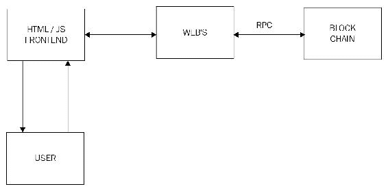

web3.js、前端和区块链交互架构

如果 web3.js 尚未安装，请使用以下步骤:否则，转到下一步。

### 安装 web3.js

只需发出以下命令，就可以通过`npm`安装 Web3:

```
$ npm install web3

```

也可以直接从[https://github.com/ethereum/web3.js](https://github.com/ethereum/web3.js)下载。

通过`npm`下载的`web3.min.js`，可以在 HTML 文件中引用。这可以在 node_modules 下找到，例如`/home/drequinox/netstats/node_modules/web3/dist/web3.min.js`。可以选择将文件复制到主应用程序所在的目录中，并可以从那里使用。一旦文件在 HTML 或 JS 中被成功引用，就需要通过提供 HTTP 提供者来初始化 web3。这通常是到正在运行的`geth`客户端所公开的本地主机 HTTP 端点的链接。这可以通过使用以下代码来实现:

```
web3.setProvider(new web3.providers.HttpProvider('http://localhost:8001')); 

```

一旦设置了提供者，就可以使用`web3`对象及其可用方法与合同和区块链进行进一步的交互。

可以使用以下代码创建`web3`对象:

```
if (typeof web3 !== 'undefined')
{ 
  web3 = new Web3(web3.currentProvider); 
} 
else 
{ 
  web3 = new Web3(new     
  Web3.providers.HttpProvider("http://localhost:8001")); 
} 

```

#### 举例

在下一节中，将展示一个示例，该示例将利用 web3.js 来允许通过在简单的 HTTP web 服务器上提供的网页与合同进行交互。这可以通过以下步骤实现:

1.  首先，在主目录中创建一个名为`/simplecontract/app`的目录。
2.  Then, create a file named `simplecontractcompiled.js`, as shown here:

    ```
        simplecontractcompiled={ 
        valueChecker: { 
        code:         
        "0x6060604052600a60005534610000575b60878061001c6000396000f360606040
        5260e060020a6000350463f9d55e218114601c575b6000565b34600057602960043
        5603d565b604080519115158252519081900360200190f35b6000805460ff83161
        0608157604080516001815290517f3eb1a229ff7995457774a4bd31ef7b13b6f449
        1ad1ebb8961af120b8b4b6239c9181900360200190a15060015b5b91905056", 
        info: 
        { 
        abiDefinition: 
        [{ 
        constant: false, 
        inputs: 
        [{ 
        name: "x", 
        type: "uint8" 
        }], 
        name: "Matcher", 
        outputs: 
        [{ 
        name: "", 
        type: "bool" 
        }], 
        payable: false, 
        type: "function" 
        },
        { 
        anonymous: false, 
        inputs: 
        [{ 
        indexed: false, 
        name: "returnValue", 
        type: "bool" 
        }], 
        name: "valueEvent", 
        type: "event" 
        }], 
        compilerOptions: "--combined-json bin,abi,userdoc,devdoc --add-       
        std --optimize",compilerVersion: "0.4.6",   
        developerDoc: 
        { 
        methods: {} 
        }, 
        language: "Solidity", 
        languageVersion: "0.4.6", 
        source: "pragma solidity ^0.4.0; contract valueChecker { uint         
        price=10; event valueEvent(bool returnValue);                                                                      
        function Matcher (uint8 x) returns (bool) { if (x>=price) {       
        valueEvent(true); return true; } } }", 
        userDoc: { 
        methods: {} 
        } 
        } 
        } 
        } 

    ```

    该文件包含各种元素。最重要的是 **ABI** ( **应用二进制接口**)，可以使用`geth`进行查询，如前面在契约部署过程中的步骤 6 所示。

3.  Create a file named `simplecontract.js`, as shown here:

    ```
        if (typeof web3 !== 'undefined')
        { 
        web3 = new Web3(web3.currentProvider); 
        } 
        else 
        { 
         web3 = new Web3(new    
         Web3.providers.HttpProvider("http://localhost:8001"));          
        } 
        console.log("Coinbase: " + web3.eth.coinbase); 
        var simplecontractaddress = "0x94a1107f2585f0ab931c71f2f8f02e9
                                     f5ab888c0"; 
         simplecontractinstance =      
         web3.eth.contract(simplecontractcompiled.valueChecker
         .info.abiDefinition).at(simplecontractaddress); 
         var code = web3.eth.getCode(simplecontractaddress); 
         console.log("Contract balance: " +                            
         web3.eth.getBalance(simplecontractaddress)); 
         console.log("simple contract code" + code); 
         function callMatchertrue()
         { 
            var txn = simplecontractinstance.Matcher.call(12);{ 
         }; 
         console.log("return value: " + txn); 
         } 
         function callMatcherfalse() 
         { 
         var txn = simplecontractinstance.Matcher.call(1);{ 
         }; 
         console.log("return value: " + txn); 
         } 

    ```

    这个文件是主 JavaScript 文件，包含创建一个`web3`对象的代码。它还提供了用于在区块链上与合同进行交互的方法。这里给出了代码的解释。

**创建 web3 对象**

```
if (typeof web3 !== 'undefined')  
{ 
  web3 = new Web3(web3.currentProvider); 
} 
 else  
{ 
  web3 = new Web3(new Web3.providers.HttpProvider("http://localhost:
         8001"));                                                 
} 

```

这段代码首先检查是否已经有一个可用的提供程序；如果是，那么它会将提供者设置为当前提供者。否则，它将 web3 提供者设置为`localhost: 8001`；这是本地实例`geth`运行的地方。

**通过调用任何 web3 方法检查可用性**

```
console.log("Coinbase: " + web3.eth.coinbase); 

```

这行代码只是通过调用`web3.eth.coinbase`方法使用`console.log`来打印 coinbase。一旦这个调用成功，就意味着`web3`对象已经被正确创建并且`HttpProvider`是可用的。任何其他调用都可以用来验证可用性，但是作为一个简单的例子，在前面的例子中已经使用了`web3.eth.coinbase`。

**将合同地址分配给变量**

```
var simplecontractaddress = "0x94a1107f2585f0ab931c71f2f8f02e9f5ab888c0     
                             ";

```

该声明将分配部署在区块链的合同地址的值。语句变量成功执行后，`simplecontractaddress`将包含合同的地址。这是部署协定时，在前面示例的步骤 9 中创建的协定的地址。只需使用代码中的地址。

**创建主合同对象**

```
simplecontractinstance = web3.eth.contract(simplecontractcompiled
                                 .valueChecker.info.abiDefinition)
                                 .at(simplecontractaddress); 

```

这段代码将创建一个对象，稍后将在代码中使用该对象与区块链上的合同进行交互。`simplecontractinstance`将暴露契约的功能。`web3.eth.contract`将 ABI 数组作为参数。这可以通过使用`simplecontractcompiled.valueChecker.info.abiDefinition`来实现。最后，`.at`将契约的地址作为参数。

**获取合同地址代码(可选)**

这里显示的是一个示例，完全是可选的:

```
var code = web3.eth.getCode(simplecontractaddress); 
console.log("simple contract code" + code); 

```

前面的语句用于查询合同的代码。这是一个简单的`web3.eth.getCode`调用，将区块链上的合同地址作为参数。最后，`console.log`用于通过打印 code 变量来打印合同的代码。

**合同余额**

console.log("合约余额:"+web 3 . eth . get balance(simplecontractaddress))；前面的代码将调用`web3.eth.getBalance`并将合同地址作为参数，并将打印合同的余额，此时余额为 0。

**合同功能**

一旦正确创建了`web3`对象和`simplecontractinstance`对象，就可以很容易地调用合同函数，如下例所示:

```
function callMatchertrue() 
{ 
 var txn = simplecontractinstance.Matcher.call(12);{ 
}; 
console.log("return value: " + txn); 
} 

function callMatcherfalse()
{ 
var txn = simplecontractinstance.Matcher.call(1);{ 
}; 
console.log("return value: " + txn); 
} 

```

可以使用`simplecontractinstance.Matcher.call`进行调用，然后为参数传递值。调用 solidity 代码中的函数匹配器:

```
function  Matcher (uint8 x) returns (bool) 

```

它接受一个类型为`uint8`的参数`x`,并返回一个布尔值，true 或 false。

相应地，对合同进行调用，如下所示:

```
var txn = simplecontractinstance.Matcher.call(12); 

```

在前面的示例中，`console.log`用于打印函数调用返回的值。一旦调用的结果在`txn`变量中可用，就可以在程序的任何地方使用，例如，作为另一个 JavaScript 函数的参数。

最后，用下面的代码创建名为`index.html`的 HTML 文件:

```
<html> 
<head> 
    <title>SimpleContract Interactor</title> 
    <script src="./web3.min.js"></script> 
    <script src="./simplecontractcompiled.js"></script> 
    <script src="./simplecontract.js"></script> 
</head> 
<body> 
    <button onclick="callMatchertrue()">callTrue</button> 
    <button onclick="callMatcherfalse()">callFalse</button> 
</body> 
</html> 

```

建议运行一个合适的网络服务器来提供 HTML 内容(例如`index.html`)。或者，可以从文件系统中浏览文件，但这可能会给大型项目带来一些问题；作为一种良好的做法，始终使用 web 服务器。使用以下命令可以启动 Python 中的快速 web 服务器。该服务器将从运行它的同一个目录中提供 HTML 内容。Python 不是必须的；它甚至可以是 Apache 服务器或任何其他 web 容器。


Python 中的简单 web 服务器

现在任何浏览器都可以用来浏览通过 TCP `port 7777`提供的网页。下面的示例显示了这一点。应该注意，这里显示的输出是在浏览器的控制台窗口中。要查看输出，必须启用浏览器的控制台。


与合同的互动

为了简单起见，这些值被硬编码在代码中，因此在 index.html 中创建了两个按钮。这两个按钮都用硬编码的值调用函数。这只是为了演示参数通过 web3 传递给契约，并且相应地返回值。

前面的按钮后面调用了两个函数。`callMatchertrue()`方法有一个硬编码的值 12，该值通过以下方式发送给契约:

```
simplecontractinstance.Matcher.call(12) 

```

使用以下代码在控制台中打印返回值，首先调用`Matcher`函数，然后将值赋给`txn`变量，稍后在控制台中打印:

```
simplecontractinstance.Matcher.call(1) 
function callMatchertrue() 
{ 
 var txn = simplecontractinstance.Matcher.call(12);{ 
}; 
console.log("return value: " + txn); 
} 

```

类似地，`callMatcherfalse()`函数的工作方式是使用以下代码将一个硬编码值`1`传递给契约:

```
simplecontractinstance.Matcher.call(1) 

```

返回值会相应地打印出来:

```
console.log("return value: " + txn); 
function callMatcherfalse() 
{ 
 var txn = simplecontractinstance.Matcher.call(1);{ 
}; 
console.log("return value: " + txn); 
} 

```

这个例子演示了如何使用 web3 库与区块链上的合同进行交互。

## 开发框架

以太坊现在有各种开发框架。正如在前面讨论的例子中所看到的，通过通常的手动方式部署契约是非常耗时的。这就是 truffle 和 embark 等类似框架可以用来简化和加快过程的地方。最广泛使用的框架被称为块菌。在下一节中，将向您介绍 truffle 框架。

### 松露

Truffle 是一个开发环境，它使得测试和部署以太坊契约变得更加容易和简单。Truffle 使用 Mocha 和 Chai 提供契约编译和链接以及自动化测试框架。这也使得将合同部署到任何私有网、公共网或区块链以太网测试网变得更加容易。此外，还提供了资产管道，这使得处理所有 JavaScript 文件变得更加容易，使它们可以供浏览器使用。

#### 安装

安装前，假设节点可用，可以如下图查询。如果节点不可用，则首先需要安装节点，以便安装 truffle:

```
drequinox@drequinox-OP7010:~/testdapp$ nodejs --version
v7.2.1
drequinox@drequinox-OP7010:~/testdapp$ node --version
v7.2.1

```

truffle 的安装非常简单，可以通过`npm`使用以下命令完成:

```
$ sudo npm install -g truffle

```

这需要一段时间；安装后，`truffle`可用于显示帮助并确保安装正确。

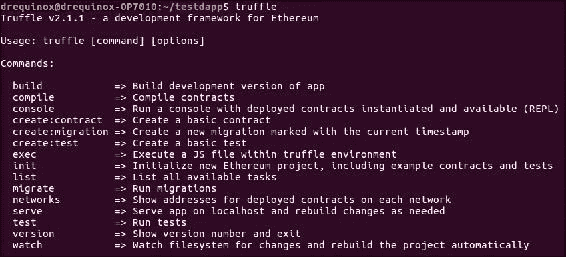

松露帮助

或者，可以在[https://github.com/ConsenSys/truffle](https://github.com/ConsenSys/truffle)获得这个库，可以在本地克隆它来安装 truffle。Git 可用于使用以下命令克隆存储库:

```
https://github.com/ConsenSys/truffle.git

```初始化松露**

Truffle 可以通过运行以下命令来初始化。首先，为项目创建一个目录，例如:

```
mkdir testdapp

```

然后，切换到`testdapp`并运行以下命令:

```
~/testdapp$ truffle init

```

一旦命令成功，它将创建如下所示的目录结构。这可以使用 Linux 中的`tree`命令来查看:

```
drequinox@drequinox-OP7010:~/testdapp$ tree
.
├── app
│   ├── images
│   ├── index.html
│   ├── javascripts
│   │   └── app.js
│   └── stylesheets
│       └── app.css
├── contracts
│   ├── ConvertLib.sol
│   ├── MetaCoin.sol
│   └── Migrations.sol
├── migrations
│   ├── 1_initial_migration.js
│   └── 2_deploy_contracts.js
├── test
│   └── metacoin.js
└── truffle.js
7 directories, 10 files

```

这个命令创建四个主目录，分别命名为`app`、`contracts`、`migrations`和`test`。如前面的示例所示，总共创建了 7 个目录和 10 个文件。在下一节中，将给出所有这些文件和目录的解释。

*   `App`:该目录包含所有的应用文件，包括 HTML 文件、图片、样式表和 JavaScript 文件。该文件夹包含进一步的子目录，`images`、`javascripts`和`stylesheets`，这些子目录包含相关的应用文件。
*   `Contracts`:该目录包含 solidity 合同源代码文件。这是 truffle 在迁移期间寻找 solidity 合同文件的地方。
*   `Migration`:这个目录下有所有的部署脚本。
*   顾名思义，这个目录包含了应用程序和合同的相关测试文件。

最后，truffle 配置存储在`truffle.js`文件中，该文件创建于运行`truffle init`的项目的根文件夹中。当`truffle init`运行时，它将创建一个名为 MetaCoin 的示例项目。例如，首先将向您介绍如何使用 truffle 中的各种命令来测试和部署 MetaCoin。稍后，进一步的例子将展示如何为定制项目使用 truffle。

**使用块菌编译**

库和契约都可以用 truffle 编译。合同文件的名称应该与文件中的合同名称相同。例如，在前面创建的示例元币项目中，`contracts`目录下名为`MetaCoin.sol`的文件与文件中的元币契约同名。这也适用于库文件，并且区分大小写。

*   文件名:

```
MetaCoin.sol 

```   文件中的合同名称:

```
contract MetaCoin { 
        mapping (address => uint) balances; 

```

编译可以如下所示运行:

```
~/testdapp$ truffle compile
Compiling ConvertLib.sol...
Compiling MetaCoin.sol...
Compiling Migrations.sol...
Writing artifacts to ./build/contracts
~/testdapp$

```

一旦编译成功完成，所有对象都将被写入到`build`目录中。输出目录如下所示:

```
~/testdapp$ tree build/
build/
└── contracts
 ├── ConvertLib.sol.js
 ├── MetaCoin.sol.js
 └── Migrations.sol.js
1 directory, 3 files

```

如前面的示例所示，`build`目录是用`contracts`子目录自动创建的，该子目录包含三个 JavaScript 文件。

**迁移**

这就是松露向区块链部署合约的过程。这个过程依赖于`migrations`目录下的可用文件。

该过程如下所示:

```
~/testdapp$ cd migrations/
~/testdapp/migrations$ ls -ltr
-rw-rw-r-- 1 drequinox drequinox 124 Dec 12 12:57 2_deploy_contracts.js
-rw-rw-r-- 1 drequinox drequinox  72 Dec 12 12:57 1_initial_migration.js
~/testdapp/migrations$ cat 2_deploy_contracts.js
module.exports = function(deployer) 
{
 deployer.deploy(ConvertLib);
 deployer.autolink();
 deployer.deploy(MetaCoin);
};
drequinox@drequinox-OP7010:~/testdapp/migrations$ cat 1_initial_migration.js
module.exports = function(deployer) 
{
 deployer.deploy(Migrations);
};

```

如前面的输出所示，有两个文件包含指定需要部署哪些协定的代码。

文件名遵循一个惯例，即文件名必须以数字为前缀。为了保存所有迁移的记录，此前缀是必需的。文件名中的后缀可以是任何描述性名称。首先，更改`truffle.js`文件以指向适当的网络是很重要的。`truffle.js`文件包含关于应用程序的构建和 rpc 的有价值的信息。在这种情况下，`geth`已经在运行，它可以简单地指向使用可用的客户端:

```
module.exports = { 
  build: { 
    "index.html": "index.html", 
    "app.js": [ 
      "javascripts/app.js" 
    ], 
    "app.css": [ 
      "stylesheets/app.css" 
    ], 
    "img/": "img/" 
  }, 
  rpc: { 
    host: "localhost", 
    port: 8001 
  } 
}; 

```

在前面的文件中，需要将`rpc`更改为指向适当的网络。一旦`rpc`被更改(在本例中，`geth`在端口 8001 上运行，而不是通常的 8545)，truffle 迁移可以使用以下命令运行。同样重要的是，挖掘要在`rpc`所指向的以太坊节点上运行；否则，合同不会被挖掘。

可以使用此处显示的命令部署协定:

```
~/testdapp$ truffle migrate

```

它可能会显示一条错误消息，如下所示。如果出现这种情况，则意味着 truffle 用来部署区块链合同的帐户被锁定，需要解锁:

```
Running migration: 1_initial_migration.js
 Deploying Migrations...
Error encountered, bailing. Network state unknown. Review successful transactions manually.
Error: **account is locked** 
 at Object.InvalidResponse (/usr/lib/node_modules/truffle/node_modules/ether-pudding/node_modules/web3/lib/web3/errors.js:35:16)
 at /usr/lib/node_modules/truffle/node_modules/ether-pudding/node_modules/web3/lib/web3/requestmanager.js:86:36
 at exports.XMLHttpRequest.request.onreadystatechange (/usr/lib/node_modules/truffle/node_modules/web3/lib/web3/httpprovider.js:114:13)
 at exports.XMLHttpRequest.dispatchEvent (/usr/lib/node_modules/truffle/node_modules/xmlhttprequest/lib/XMLHttpRequest.js:591:25)
 at setState (/usr/lib/node_modules/truffle/node_modules/xmlhttprequest/lib/XMLHttpRequest.js:610:14)
 at IncomingMessage.<anonymous> (/usr/lib/node_modules/truffle/node_modules/xmlhttprequest/lib/XMLHttpRequest.js:447:13)
 at emitNone (events.js:91:20)
 at IncomingMessage.emit (events.js:185:7)
 at endReadableNT (_stream_readable.js:974:12)
 at _combinedTickCallback (internal/process/next_tick.js:74:11)
 at process._tickDomainCallback (internal/process/next_tick.js:122:9)

```

可以使用`geth` JavaScript 控制台中的以下命令解锁帐户。

首先，列出帐户以查看所有帐户，然后选择需要解锁的帐户。Truffle 默认采用 coinbase 帐户。选择适当的帐户，如下所示:

```
> personal.listAccounts
["0x76f11b383dbc3becf8c5d9309219878caae265c3", "0xcce6450413ac80f9ee8bd97ca02b92c065d77abc"]

```

可以使用以下命令解锁帐户:

```
> personal.unlockAccount("0x76f11b383dbc3becf8c5d9309219878caae265c3")
Unlock account 0x76f11b383dbc3becf8c5d9309219878caae265c3
Passphrase:
true

```

帐户解锁后，可以使用以下命令再次运行迁移:

```
~/testdapp$ truffle migrate

```

它将显示类似于此处所示的输出。应该注意，要完成迁移，必须开始挖掘。迁移将通过在`migrations`目录中查找可用文件来执行各种步骤。如示例所示，`1_initial_migration.js`和`2_deploy_contracts.js`已用于提供松露的迁移步骤和要求:

```
Running migration: 1_initial_migration.js
 Deploying Migrations...
 Migrations: 0xf444cce0cee00cab4d04bcfc0005626b8b02add8
Saving successful migration to network...
Saving artifacts...
Running migration: 2_deploy_contracts.js
 Deploying ConvertLib...
 ConvertLib: 0x2ba8a4a75a6b845bf482923cff29ecc98cd68d90
 Linking ConvertLib to MetaCoin
 Deploying MetaCoin...
 MetaCoin: 0x0be9c5de978fa927b93a5c4faab31312cea5704a
Saving successful migration to network...
Saving artifacts...
~/testdapp$

```

一旦命令成功完成，它将返回一个命令提示符，显示消息`saving artefacts`。

可以通过`geth` JavaScript 控制台使用这里显示的几个命令来验证部署:

```
> eth.getBalance("0x0be9c5de978fa927b93a5c4faab31312cea5704a")
0
> eth.getCode("0x0be9c5de978fa927b93a5c4faab31312cea5704a")
"0x606060405260e060020a60003504637bd703e8811461003457806390b98a1114610056578063f8b2cb4f1461007d575b610000565b346100005761004460043561009f565b60408051918252519081900360200190f35b3461000057610069600435602435610119565b604080519115158252519081900360200190f35b34610000576100446004356101b1565b60408051918252519081900360200190f35b6000732ba8a4a75a6b845bf482923cff29ecc98cd68d906396e4ee3d6100c4846101b1565b60026000604051602001526040518360e060020a028152600401808381526020018281526020019250505060206040518083038186803b156100005760325a03f415610000575050604051519150505b919050565b600160a060020a03331660009081526020819052604081205482901015610142575060006101ab565b600160a060020a0333811660008181526020818152604080832080548890039055938716808352918490208054870190558351868152935191937fddf252ad1be2c89b69c2b068fc378daa952ba7f163c4a11628f55a4df523b3ef929081900390910190a35060015b92915050565b600160a060020a0381166000908152602081905260409020545b91905056"

```

注意，新部署的契约的地址取自前面显示的 truffle migrate 命令输出。 `(MetaCoin: 0x0be9c5de978fa927b93a5c4faab31312cea5704a)`

*   **Interaction with the contract**: Truffle also provides a console (command-line interface) that allows interaction with the contracts. All deployed contracts are already instantiated and ready to use in the console. This is an REPL-based interface that means Read, Evaluate, and Print Loop. Similarly, in the geth client (via attach or console), REPL is used via exposing **JSRE** (**JavaScript runtime environment**). The console can be accessed by issuing the following command:

    ```
    ~/testdapp$ truffle console

    ```

    这将打开一个命令行界面，如下所示:

    

    松露控制台

    一旦控制台可用，就可以运行各种方法来查询合同。通过键入以下命令并按 tab 键结束，可以显示方法列表:

    

    公开的方法

    为了与契约交互，还可以调用其他方法；例如，为了检索契约的地址，可以在 truffle 控制台中调用以下方法:

    ```
    truffle(default)> MetaCoin.deployed().address
    '0x0be9c5de978fa927b93a5c4faab31312cea5704a'
    truffle(default)>

    ```   **Query the balance of the contract**:

    ```
    truffle(default)>      
            MetaCoin.deployed().getBalance.call(web3.eth.accounts[0])
    { [String: '8750'] s: 1, e: 3, c: [ 8750 ] }

    ```

    输出返回一个值为`8750`的字符串。

*   **Transfer the balance**:

    ```
    truffle(default)>         
            MetaCoin.deployed().sendCoin("0xcce6450413ac80f9ee8bd97ca02b92c
            065d77abc",50, {from:"0x76f11b383dbc3becf8c5d9309219878caae265c 
            3"})
     '0xb8969149fcfb54ec9beac31af1fc86c386f9aa42cb13d2eb9bf946993198
           6e0f'

    ```

    这将返回事务的散列，如果成功，将导致目标的余额增加 50。目标帐户是在`sendCoin`函数中传递的参数。

*   **目标账户**的余额:可以通过以下命令获取:

    ```
    truffle(default)>      
            MetaCoin.deployed().getBalance.call(web3.eth.accounts[1])
    { [String: '1250'] s: 1, e: 3, c: [ 1250 ] }
    truffle(default)>

    ```

为了退出松露控制台，使用了`.exit`命令。

#### 使用块菌进行测试

测试是 truffle 的一项强大功能，可以通过运行以下命令来调用:

```
~/testdapp$ truffle test

```

这将从`test`目录中读取测试并相应地执行测试。truffle 使用的测试框架叫做 Mocha，它使用的断言框架叫做 Chai。

示例测试运行如下所示。这个测试只运行两个测试。在原始文件中，有三个测试，但是为了简单起见，这里只使用了两个。此外，大多数系统上的测试可能会失败；因此，为简单起见，已将其从文件中删除。失败的测试用例将在后面讨论。另外，应该注意的是，挖掘应该为测试运行而运行。

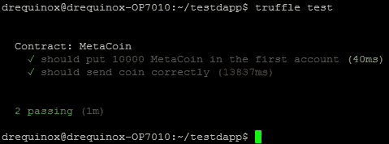

显示两次成功测试的块菌测试输出

这两个测试基于 truffle init 生成的文件。在下面的文件中，为了简化起见，只显示了一个测试，而 truffle 为默认的 MetaCoin 项目创建了三个测试。通过在文本编辑器中编辑`metacoin.js`文件，可以从文件中删除测试:

```
contract('MetaCoin', function(accounts) 
{ 
 it("should put 10000 MetaCoin in the first account", 
 function() 
 { 
  var meta = MetaCoin.deployed();  
  return meta.getBalance.call(accounts[0]).then(function(balance)
  { 
   assert.equal(balance.valueOf(), 10000, "10000 wasn't in the first     
   account"); 
  }); 
 }); 
}); 

```

所有测试文件都需要存在于`project`目录下的`tests`目录中。测试在`it`块中指定。


基于前面显示的文件进行测试，只有一个测试

在前面的测试案例中，当契约为时，它应该有 10000 英镑的余额。这个测试基本上是测试 10000 的余额在部署合约后是否可用。为了解释这个概念，可以模拟这个错误，例如，如果`metacoin.js`文件是通过改变断言:

```
assert.equal(balance.valueOf(), 10000, "10000 wasn't in the first account"); 

```

到

```
assert.equal(balance.valueOf(), 1000, "10000 wasn't in the first account"); 

```

这将导致人为的断言失败，因为在 assert 中，预期的金额是 1000，而在部署契约时，它的余额是 10，000。运行测试时，会显示以下输出，表明测试失败。这种更改只是为了演示，以便让您看到测试可能会失败，以及如果失败，会产生什么类型的输出。

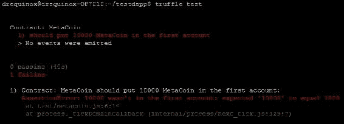

块菌测试输出失败

`truffle test`命令带有很少的可选参数，尤其是`--verbose-rpc`，这对理解以太坊客户端和 truffle 之间的 RPC 通信非常有帮助。

在测试执行期间，有时会出现如下所示的错误消息:

```
Error: timeout of 120000ms exceeded. Ensure the done() callback is being called in this test.

```

当以太坊节点未进行挖掘，或者部署合同的时间超过 2 分钟时，会出现此错误。这就是超时发生的原因；因此，如果在 PrivateNet 上，通过挖掘节点运行测试是很重要的。在 Ropsten 上，有时可能需要 2 分钟以上的时间。或者可以使用`ethereumjs-testrpc`，这是松露常用的，提供快速模拟以太坊 RPC 客户端。

#### 建造

truffle 内置用于引导浏览器的前端。它通过导入已编译的合同和相关的已部署合同以及以太坊客户端配置来工作。所有对象在构建后都保存在`./build`目录中。所有构建配置都存在于`truffle.js`文件中，该文件指导 truffle 构建什么。默认情况下，该文件只带有`build:`和`rpc:`配置。

可以通过发出以下命令来启动构建:

```
~/testdapp$ truffle build

```

一旦构建完成，如果还不存在的话，就会创建一个`build`目录，并且会创建一个类似于这里所示的树形结构。这是基于`truffle.js`文件创建的:

```
build/
├── app.css
├── app.js
├── contracts
│   ├── ConvertLib.sol.js
│   ├── MetaCoin.sol.js
│   └── Migrations.sol.js
├── images
└── index.html

```

一旦构建成功完成，所有前端文件都将准备就绪。然后可以使用 truffle 的`serve`命令在浏览器中查看。`serve`命令创建一个 web 服务器，以呈现 HTML 内容。该命令可以如下所示运行。

请注意，该命令在运行时使用了`-p`标志来指定端口 TCP 7777。这是必需的，因为在前面提供的例子中，`geth`正在使用`--rpccorsdomain 'http://localhost:7777'`选项运行。这意味着只允许通过 TCP 7777 提供的内容。默认情况下，`serve`运行在端口 8080 上，该端口可能被系统上的其他进程使用，因为 TCP 8080 是 web 应用程序非常常用的端口。


松露服务

一旦 truffle 服务器启动并在适当的端口上运行，就可以使用浏览器并指向 URL `http://localhost:7777`来浏览内容。


示例元币前端

#### 另一个例子

这里展示了一个例子，在这个例子中，solidity 中的一个简单契约是通过迁移和测试创建的。契约非常简单，只执行加法:

1.  创建名为`simpleTest` :

    ```
    $ mkdir simpleTest

    ```

    的目录
2.  初始化松露:

    ```
    $ truffle init

    ```

3.  从目录中删除文件。这是删除 truffle 创建的默认元币项目文件所必需的。

    ```
    rm -r test/* contracts/* migrations/*

    ```

4.  Place the two files `Addition.sol` and `Migrations.sol` in the contracts directory:

    `Addition.sol`:

    ```
       pragma solidity ^0.4.2; 
       contract Addition
       { 
        uint8 x; 
        function addx(uint8 y, uint8 z ) 
        { 
         x = y + z; 
        } 
    function retrievex() constant returns (uint8)
    { 
     return x; 
    } 
    } 
    Migrations.sol: 
    pragma solidity ^0.4.2; 
    contract Migrations 
    { 
      address public owner; 
      uint public last_completed_migration; 
      modifier restricted()
     { 
        if (msg.sender == owner) _; 
     } 
     function Migrations() 
     { 
      owner = msg.sender; 
     } 
      function setCompleted(uint completed) restricted 
      { 
        last_completed_migration = completed; 
      } 
      function upgrade(address new_address) restricted 
      { 
       Migrations upgraded = Migrations(new_address); 
       upgraded.setCompleted(last_completed_migration); 
      } 
      } 

    ```

5.  将`Addition.js`文件放在`test`目录:

    ```
            contract('Addition', function(accounts) 
            { 
            it(" 100 + 100 = 200 ", function()
            { 
            var AddContract = Addition.deployed(); 
            AddContract.addx(100, 100,{from:accounts[0],gas:1000000})                                      
            .then(function(a) 
            { 
            return AddContract.retrievex.call().then(function(Result)
            { 
            assert.equal(Result, 200, "100 + 100 = 200 is expected"); 
            }); 
            }); 
            });  
            }); 

    ```

6.  In the `migrations` folder, place two files:

    `        1_initial_migration.js`:

    ```
            module.exports = function(deployer) 
            { 
             deployer.deploy(Migrations); 
            }; 

    ```

    `        2_deploy_contracts.js`:

    ```
            module.exports = function(deployer)
            { 
             deployer.deploy(Addition); 
             deployer.autolink(); 
            }; 

    ```

7.  一旦所有文件就绪，使用 truffle compile 编译所有合同。可选地，使用`--compile-all`标志来重新编译契约，即使它们已经被编译过。仅当合同需要重新编译时才需要:

    ```
    ~/simpleTest$ truffle compile
    Compiling Addition.sol...
    Compiling Migrations.sol...
    Writing artifacts to ./build/contracts

    ```

8.  Migrate to the Ethereum test network using truffle migrate. This will deploy the contract on the network. Note that, at this point, `truffle.js` will need to be updated again with port 8001 to point to the Private Net:

    ```
    ~/simpleTest$ truffle migrate
    Running migration: 2_deploy_contracts.js
     Deploying Addition...
     Addition: 0x73934227a1ce7fc44152b7451626759a00b0275c
    Saving successful migration to network...
    Saving artifacts...

    ```

    最后，可以使用以下命令执行测试。这些测试基于前面显示的`Addition.js`文件:

    ```
    ~/simpleTest$ truffle test

    ```

    该命令将首先在以太网(本例中为 PrivateNet)上部署契约。

    

    显示成功块菌测试的样本输出

9.  为了与契约进行交互，可以使用以下方法。由于添加契约已经在 truffle 控制台中实例化并可用，使用各种方法与契约交互变得非常容易。

例如，为了检索已部署协定的地址，可以调用以下方法:

```
truffle(default)> Addition.address
'0x73934227a1ce7fc44152b7451626759a00b0275c'

```

为了从协定中调用函数，部署的方法与协定函数一起使用。这里显示了一个例子，其中调用了`addx`函数并传递了两个参数:

```
truffle(default)> Addition.deployed().addx(100,100)
'0xae6f51782c1bcf04ec34dd54ee31da626dc138993ea813bc6c3c1fe0790b130e'
truffle(default)> '0xb9f8633fbd626466ee2c2f24952a5fca3134f4e7d08f39a4d26ac2689e22b653'

```

从契约中调用`retrievex`函数:

```
truffle(default)> Addition.deployed().retrievex()
{ [String: '200'] s: 1, e: 2, c: [ 200 ] }

```

#### 示例项目:想法的证明

这个程序背后的想法是提供一个公证文件的服务。然后，这可以用作证据，证明索赔人在过去的某个时间曾经接触过某条信息。这对专利文件非常有用。例如，如果有人想出了一个主意，他或她可以创建该文档的散列并将其保存在区块链上。由于区块链的不可改变的性质，它可以作为在某个时间某个想法(文件)存在的永久证据。有许多方法可以实现这一点，但关键思想是相同的，其工作原理是哈希函数提供文本或文档的摘要，并且是唯一的。

这可以通过几种方式实现；主要思想是创建文档或文本字符串的散列，并将其保存在区块链上。一旦文本被散列并保存，通过将文档的散列与已经存储的散列进行比较，可以禁止保存该相同文本的进一步请求。

对于这个例子，将使用 browser solidity、truffle 和 TestNet(已经运行网络 ID 786，在前面创建)。首先，将编写契约的代码。这可以使用任何合适的文本编辑器或集成开发环境来完成。浏览器可靠性也可以使用，因为它也为测试提供了一个模拟环境。这个例子将为你提供一个机会来学习一个合同项目如何从一个想法发展成为一个可靠的合同源代码，并最终部署。

让我们一行一行地看代码:

```
pragma solidity ^0.4.0; 

```

此语句确保最低编译器版本为 0.4.0，最高版本不能高于 0.4.9。这确保了程序之间的兼容性:

```
contract PatentIdea { 

```

本声明是名为`PatentIdea`的合同的开始:

```
mapping (bytes32 => bool) private hashes; 

```

接下来，定义一个映射，将 byte32 映射到 Boolean，这基本上是 byte 32 映射到 Boolean 值的一个`hashmap`(字典):

```
bool alreadyStored; 

```

这是一个用`alreadyStored`名声明的变量，它是一个布尔类型，可以有真或假的值。该变量用于保存`SaveIdeaHash`函数的返回值:

```
event ideahashed(bool); 

```

还声明了一个事件，它将用于捕获散列函数的成功或失败(`SaveIdeaHash`)。当事件被触发时，它将返回一个真或假的布尔值。

声明了一个名为`saveHash`的函数，该函数将 bytes32 类型的哈希变量作为参数，并将其保存在哈希映射中。这将导致合同状态的改变。请注意，函数 accessibility 被更改为 private，因为它只在契约内部需要，不需要公开:

```
 function saveHash(bytes32 hash) private 
{ 
 hashes[hash] = true; 
} 

```

声明了另一个函数`saveIdeaHash`，它采用 string 类型的变量 idea，并根据函数的结果返回一个布尔值(true 或 false):

```
function SaveIdeaHash(string idea) returns (bool)
{ 
 var hashedIdea = HashtheIdea(idea); 
 if (alreadyHashed(HashtheIdea(idea)))  
 { 
  alreadyStored=true; 
  ideahashed(false); 
  return alreadyStored; 
 } 
 saveHash(hashedIdea); 
 ideahashed(true); 
} 

```

这个函数有一个声明为`hashedIdea`的变量，这个变量在调用后面描述的`HashtheIdea`函数后被赋值。注意，如果保存的话，这个函数也可以返回值，但是为了简单起见，这里没有显示。

下一个函数是`alreadyHashed`函数，它被声明为接受 bytes32 类型的名为 hash 的变量，并在检查哈希表中的哈希值后返回一个布尔值(true 或 false)。这再次被声明为常量，并且可访问性被设置为 private:

```
function alreadyHashed(bytes32 hash) constant private returns(bool) 
{ 
 return hashes[hash]; 
} 
} 

```

下一个函数是`isAlreadyHashed`，它检查这个想法是否已经被散列。它采用 string 类型的输入参数 idea，也声明为常量，这意味着它不能改变契约的状态，并根据名为`alreadyHashed`的函数的执行结果返回 true 或 false。这个函数然后调用前面描述的`alreadyHashed`函数，从哈希表中检查哈希表是否已经存储在那里。这意味着相同的字符串(`idea`)已经被散列和存储(获得专利):

```
function isAlreadyHashed(string idea) constant  returns (bool) 
{ 
 var hashedIdea = HashtheIdea(idea); 
 return alreadyHashed(hashedIdea); 
} 

```

最后，这里显示了`HashtheIdea`函数，它接受类型为 string 的`idea`变量，并且是`constant`类型，这意味着它不能改变契约的状态。它还被声明为`private`，因为它只在契约内部使用，所以不需要公开暴露这个函数。此函数返回 bytes32 类型值:

```
  function HashtheIdea(string idea) constant private returns (bytes32) { 
 return sha3(idea); 
} 

```

这个函数调用 solidity 的内置函数`sha3`，在变量 idea 中给它传递一个字符串。这个函数返回字符串的 sha3 哈希。`sha3`函数是 solidity 中可用的`keccak256()`函数的别名，它计算传递给它的字符串的 Keccak-256 散列。注意，这不是 NIST 标准 SHA-3；取而代之的是 Keccak-256，这是向 NIST 提出的 SHA-3 标准竞赛的原始提案。它后来被 NIST 稍微修改并标准化为 SHA-3 标准。与 Keccak-256(以太坊的`sha3`函数)相比，实际的 SHA-3 标准哈希函数将返回不同的哈希。

完整的合同源代码如下所示:

```
pragma solidity ^0.4.0; 
contract PatentIdea 
{ 
  mapping (bytes32 => bool) private hashes; 
  bool alreadyStored; 
  event ideahashed(bool); 

  function saveHash(bytes32 hash) private 
  { 
    hashes[hash] = true; 
  } 

  function SaveIdeaHash(string idea) returns (bool)
  { 
    var hashedIdea = HashtheIdea(idea); 
   if (alreadyHashed(HashtheIdea(idea)))  
   { 
       alreadyStored=true; 
       ideahashed(false); 
       return alreadyStored; 
    } 
       saveHash(hashedIdea); 
       ideahashed(true); 
    } 

  function alreadyHashed(bytes32 hash) constant private returns(bool) 
  { 
    return hashes[hash]; 
  } 

  function isAlreadyHashed(string idea) constant  returns (bool) 
  { 
    var hashedIdea = HashtheIdea(idea); 
    return alreadyHashed(hashedIdea); 
  } 

   function HashtheIdea(string idea) constant private returns (bytes32)    
   { 
    return sha3(idea); 
   } 
  } 

```

该源代码可以在 browser solidity 中模拟，以验证它是否正常工作。这里显示了一些例子。

键入合同源代码并完成语法验证后，在右侧面板上，将显示类似于下图的屏幕。

这段代码可以在很多方面进行改进。例如，日期也可以存储在带有文档散列的映射中，并可以在查询时返回。它可以通过添加结构和更多与专利相关的信息来扩展，但是这个例子是为了简单和易于理解；因此，避免了太多的复杂性。对该代码的进一步增强留给您作为练习。


使用浏览器可靠性创建合同

点击**创建**后，将会显示合同中的两个功能，如下图所示:


相关成本和暴露两种方法

现在可以调用函数，如下例所示:


调用 SaveIdeaHash 函数

同理，`isAlreadyHashed`也可以叫。


执行函数被散列化

如果再次将相同的字符串传递给该函数，它将不会被保存，如下面的屏幕截图所示:


执行函数 SaveIdeaHash

另外，请注意，该事件返回 false，表示哈希无法保存，函数返回 true，进一步表示相同的哈希已经保存。

一旦在 browser solidity 中编写和模拟了合同，下一步就是使用 truffle 来初始化一个新项目，并在 PrivateNet (ID 786)上部署和测试它，PrivateNet 已经在前面的小节中创建了。

第一步是为项目创建一个单独的目录:

```
~$ mkdir ideapatent
~$ cd ideapatent/

```

下一步是初始化 truffle 并创建一个新项目:

```
~/ideapatent$ truffle init

```

创建示例项目后，删除示例合同:

```
~/ideapatent/contracts$ rm MetaCoin.sol ConvertLib.sol

```

在`contracts`文件夹下，创建一个名为`PatentIdea.sol`的文件，并将源代码放入前面显示的文件中。

编辑`truffle.js`以指向本地主机 HTTP 端点:

```
rpc: 
  { 
    host: "localhost", 
    port: 8001 
  } 

```

在`~/ideapatent/migrations`文件夹下，编辑`2_deploy_contracts.js`文件，如下所示:

```
module.exports = function(deployer) 
{ 
  deployer.deploy(PatentIdea); 
  deployer.autolink(); 
}; 

```

更改该文件是为了指定要部署的契约的名称。记下`deployer.deploy(PatentIdea);`。

接下来，使用 truffle 运行编译，如下所示:

```
~/ideapatent$ truffle compile
Compiling Migrations.sol...
Compiling PatentIdea.sol...
Writing artifacts to ./build/contracts

```

确保挖掘正在后台运行并部署到网络，如下所示:

```
~/ideapatent$ truffle migrate
Running migration: 1_initial_migration.js
 Deploying Migrations...
 Migrations: 0x34d63de23de9c9b48251cec94fff427b94976109
Saving successful migration to network...
Saving artifacts...
Running migration: 2_deploy_contracts.js
 Deploying PatentIdea...
 PatentIdea: 0x515fd6a5dbc1eb609dc1700f73be040d9db50d4b
Saving successful migration to network...
Saving artifacts...

```

一旦部署了契约，就可以使用 truffle 控制台与它进行交互。

通过发出以下命令启动 truffle 控制台:

```
~/ideapatent$ truffle console

```

一旦控制台启动并运行，就可以调用已部署契约中的函数，如下所示。

例如，注册一个新想法:

```
truffle(default)> PatentIdea.deployed().SaveIdeaHash("MyIdea")
'0x8644dc66f1173a9103034e17b761f8871ab10ef2a7d19bec9c7eb7164272b8a3'

```

检查`MyIdea`是否被散列:

```
truffle(default)> PatentIdea.deployed().isAlreadyHashed("MyIdea")
true

```

检查另一个想法是否被散列:

```
truffle(default)> PatentIdea.deployed().isAlreadyHashed("MyOtherIdea")
false
truffle(default)>

```

这个例子演示了如何在私有网络上从头开始创建、模拟和部署合同。为了在 TestNet (Ropsten)或 live 区块链上部署它，可以执行类似的练习。只需指向合适的 RPC 并使用 truffle migrate 在您选择的区块链上进行部署。

在下一节中，将讨论各种高级概念。

**神谕**

正如在第 6 章、*智能合约*中所讨论的，甲骨文是智能合约中的真实世界数据。有各种各样的服务可以用来为智能合同提供预言。其中比较突出的是 Oraclize，在 http://www.oraclize.it/[有售](http://www.oraclize.it/)。例如，如果智能合约需要来自第三方来源的实时价格或任何其他真实数据(如特定城市的天气状况),这将非常有用。在许多用例中，oracles 可以向智能合约提供可信的数据，以便使它们能够根据现实生活中的事件做出决策。Oraclize 使智能合约更容易访问互联网，以获得所需的数据。

为了在 Ethereum 上使用 Oraclize，需要向 Oraclize 合同发送一个交易以及相应的付款和查询。因此，Oraclize 将根据请求事务中提供的查询检索结果，并将其发送回合同地址。一旦事务被发送回契约，回调方法或回退函数将被调用。

在 solidity 的实际层面上，首先需要导入 Oraclize 库，然后可以使用从它继承的所有方法。目前，oraclize 只能在 PrivateNet (Ropsten)和区块链以太坊主网上使用。

Oraclize 处理可以可视化，如下图所示:


组织数据流

使用 oraclize 的 solidity 契约的框架结构如下所示。注意 import 只在 oraclize 在 Web 上提供的开发环境下工作；通常，该文件需要手动导入:

```
import "dev.oraclize.it/api.sol"; 
contract MyOracleContract is usingOraclize 
{ 
 function MyOracleContract(){ 
} 

```

请求示例如下例所示:

```
oraclize_query("URL", "api.somewebsite.net/price?stock=XYZ"); 

```

Oraclize 还可以利用 TLS 公证来确保提要是安全的，并且可以证明是诚实的。

**使用 IPFS 在分散存储上部署**

正如在[第一章](01.html "Chapter 1. Blockchain 101")、*区块链 101* 中所讨论的，为了充分受益于去中心化的平台，你最好去中心化存储和通信层。传统上，web 内容是通过集中式服务器提供的，但是也可以使用分布式文件系统来分散这部分内容。

先前示例中所示的 HTML 内容可以存储在分布式和分散式 IPFS 网络上，以便实现增强的分散化。

https://ipfs.io/的[有 IPFS。](https://ipfs.io/)

**安装 IPFS**

可以按照以下过程安装 IPFS:

1.  使用以下命令下载 IPFS 软件包:

    ```
    $ curl https://dist.ipfs.io/go-ipfs/v0.4.4/go-     
            ipfs_v0.4.4_linux-amd64.tar.gz -O

    ```

2.  解压缩`gz`文件:

    ```
    $ tar xvfz go-ipfs_v0.4.4_linux-amd64.tar.gz

    ```

3.  将`ipfs`文件移动到适当的文件夹，以便在路径:

    ```
    $ mv go-ipfs/ipfs /usr/local/bin/ipfs

    ```

    中可用
4.  初始化 IPFS 节点:

    ```
    imran@drequinox-OP7010:~$ ipfs init
    initializing ipfs node at /home/imran/.ipfs
    generating 2048-bit RSA keypair...done
    peer identity: Qmbc726pLS9nUQjUbeJUxcCfXAGaXPD41jAszXniChJz62
    to get started, enter:
     ipfs cat        
            /ipfs/QmYwAPJzv5CZsnA625s3Xf2nemtYgPpHdWEz79ojWnPbdG/readme

    ```

5.  Enter the following command to ensure that **IPFS** has been successfully installed:

    

    成功的 IPFS 安装

6.  启动 IPFS 守护进程:

    ```
    imran@drequinox-OP7010:~$ ipfs daemon
    Initializing daemon...
    Swarm listening on /ip4/127.0.0.1/tcp/4001
    Swarm listening on /ip4/192.168.0.17/tcp/4001
    Swarm listening on /ip4/86.15.44.209/tcp/4001
    Swarm listening on /ip4/86.15.44.209/tcp/41608
    Swarm listening on /ip6/::1/tcp/4001
    API server listening on /ip4/127.0.0.1/tcp/5001
    Gateway (readonly) server listening on /ip4/127.0.0.1/tcp/8080
    Daemon is ready

    ```

7.  使用以下命令将文件复制到 IPFS:

    ```
    ~/sampleproject/build$ ipfs add --recursive --progress .
    added QmVdYdY1uycf32e8NhMVEWSufMyvcj17w3DkUt6BgeAtx7      
            build/app.css
    added QmSypieNFeiUx6Sq7moAVCsgQhSY3Bh9ziwXJAxqSG5Pcp      
            build/app.js
    added QmaJWMjD767GvuwuaLpt5tck9dTVCZPJa9sDcr8vdcJ8pY      
            build/contracts/ConvertLib.sol.js
    added QmQdz9eG2Qd5kwaU86kWebDGPqXBWj1Dmv9MN4BRzt2srf     
            build/contracts/MetaCoin.sol.js
    added QmWpvBjXTP4HutEsYUh3JLDi8VYp73SKNJi4aX1T6jwcmG      
            build/contracts/Migrations.sol.js
    added QmQs7j6NpA1NMueTXKyswLaHKq3XDUCRay3VrC392Q4JDK     
            build/index.html
    added QmPvWzyTEfLQnozDTfgdAAF4W9BUb2cDq5KUUrpHrukseA     
            build/contracts
    added QmUNLLsPACCz1vLxQVkXqqLX5R1X345qqfHbsf67hvA3Nn      
            build/images
    added QmSxpucr6J9rX3XQ3MBG8cVzLCrQFFKmMkTmpcNpjbtf3j build

    ```

8.  Now it can be accessed in the browser as follows:

    

    通过 IPFS 访问网页的浏览器

    ### 注意

    注意，该 URL 指向 IPFS 文件系统。

9.  最后，为了使更改永久化，可以使用下面的命令:

    ```
    /build$ ipfs pin add QmSxpucr6J9rX3XQ3MBG8cVzLCrQFFKmMkTmpcNpjbtf3j
    pinned QmSxpucr6J9rX3XQ3MBG8cVzLCrQFFKmMkTmpcNpjbtf3j recursively

    ```

前面的示例演示了如何使用 IPFS 为智能合约的 web 部件(用户界面)提供分散存储。

IPFS 可以以另一种方式与区块链一起使用。由于存储对区块链来说是一个大问题，所以您最好能够将大量数据保存在其他地方，并将这些数据的链接放在区块链事务中。这样，就不需要在区块链上存储大量数据，也不会因此而导致数据膨胀。通过将数据放在 IPFS，然后在区块链事务中存储 IPFS 链接以引用存储的数据，可以使用 IPFS 来实现这一点。

以太坊自己的 swarm 协议也在大力开发中，并基于类似的原理工作。然而，Swarm 目前正在开发中，而 IPFS 相对来说更发达，目前看来是个更好的选择。IPFS 运行得非常好，很可能成为部署的分散存储的首选平台。Swarm 允许用户通过存储所有区块链数据来运行一个轻量级客户端。这是当前版本的`geth`提供的，详细的指南可以在[https://swarm-guide . readthedocs . io/en/latest/introduction . html](https://swarm-guide.readthedocs.io/en/latest/introduction.html)获得。由于这项技术正在大力开发中，所以只对其进行了简单的介绍，因为它可能会发展得非常快。

对于以太坊中的分散式通信，Whisper 协议提供了分散式通信层。这将作为以太坊基于身份的消息传递层。swarm 和 whisper 都被认为是 Web 3.0 的使能技术。

#### 许可的分布式分类帐

许可分布式分类账的概念与公共区块链有着根本的不同。分布式分类账背后的关键思想是，它们是被许可的，而不是开放的公共区块链。DLT 不执行任何挖掘，因为所有的参与者都已经被审查并且为网络所知，并且不需要挖掘来保护网络。在私人许可的分布式账本上也没有数字货币的概念，因为许可区块链的目的不同于公共区块链。在一个公共的区块链，接入对每个人开放，需要某种形式的激励和网络效应才能发展；相反，在许可的 DLT 中，没有这样的要求。在私人联盟环境中使用以太坊建立许可的 DLT 是可能的，特别是在现有的金融系统中。分布式分类账系统的主要好处是它们更快、更易管理，并且可能与现有的财务系统互操作。

# 总结

本章提供了关于如何设置以太坊开发环境和创建智能契约的详细而深入的实例。本章首先介绍了用于测试和开发目的的创建私有以太网的各种方法。之后，为了让你理解语言的基本原理和语法，介绍了 solidity 语言。详细讨论了使用诸如`geth`和 web3 等技术和工具的实际部署技术。此外，还介绍了智能合同开发和部署的详细分步示例。此外，还结合实际例子讨论了开发框架，以便您可以体验以太坊区块链的智能合约开发生命周期。这是一个很长的章节，通过下面的练习，您将对以太坊上的契约开发、测试和部署有一个深入的了解。最后，讨论了与分散存储、分散通信和 oracles 相关的各种概念和工具。随着以太坊和相关技术和框架的不断快速发展，预计随着时间的推移，将会出现更先进的工具和技术；然而，本章讨论的基本原理可能会保持不变。此外，本章不可能讨论以太坊可用的每一个工具和框架，但是所有讨论的工具和技术都是主流使用的，应该为您过渡到更高级的水平提供坚实的基础。本章中有几个主题没有特意讨论，例如智能合约安全性、智能合约的形式验证、云上的区块链即服务，以及各种行业的智能合约的特定用例。所有这些概念将在后面的章节中讨论。我希望你喜欢读这一章，就像我喜欢写它一样。