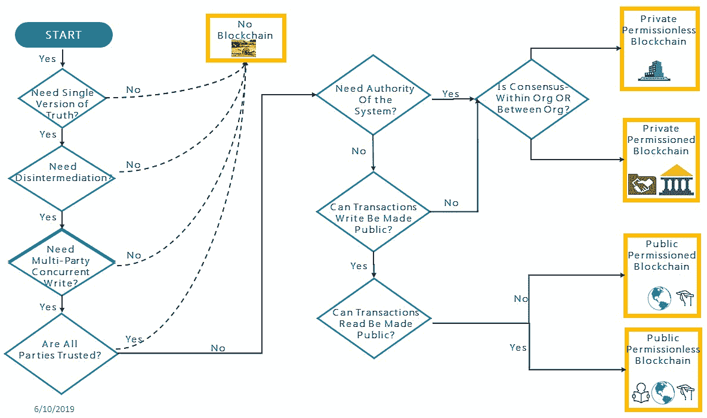
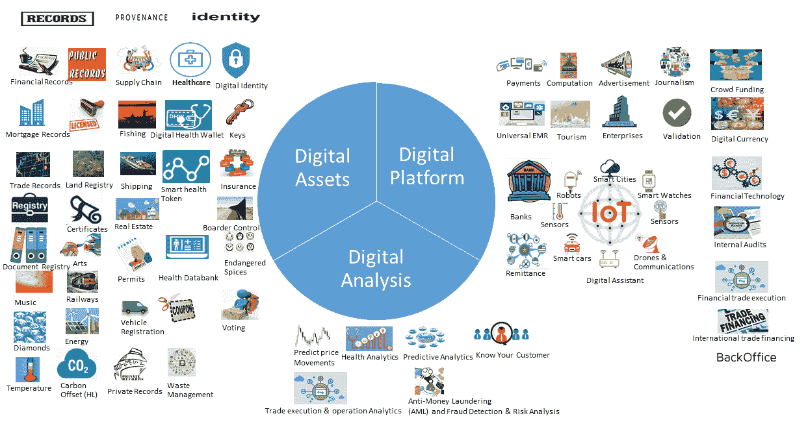
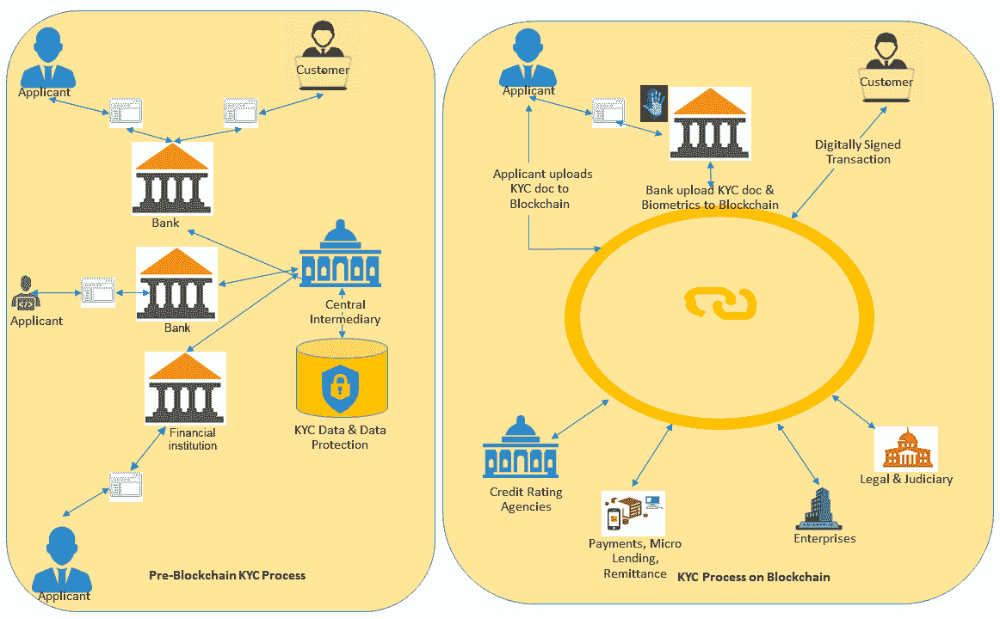
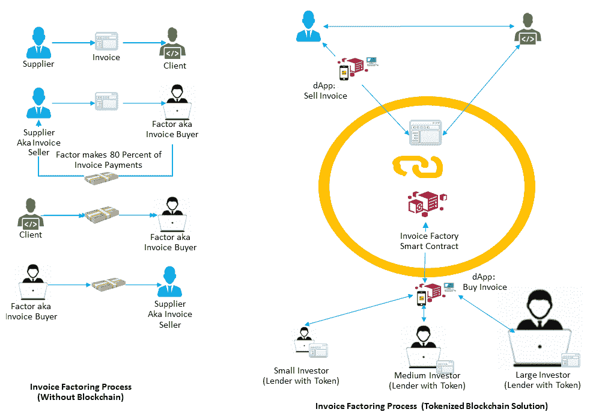
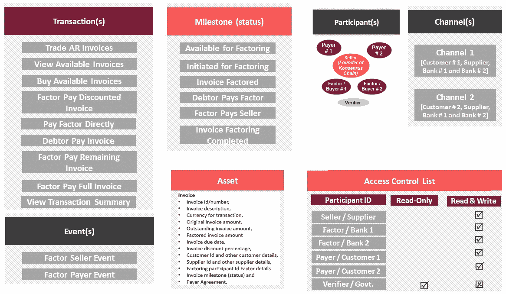
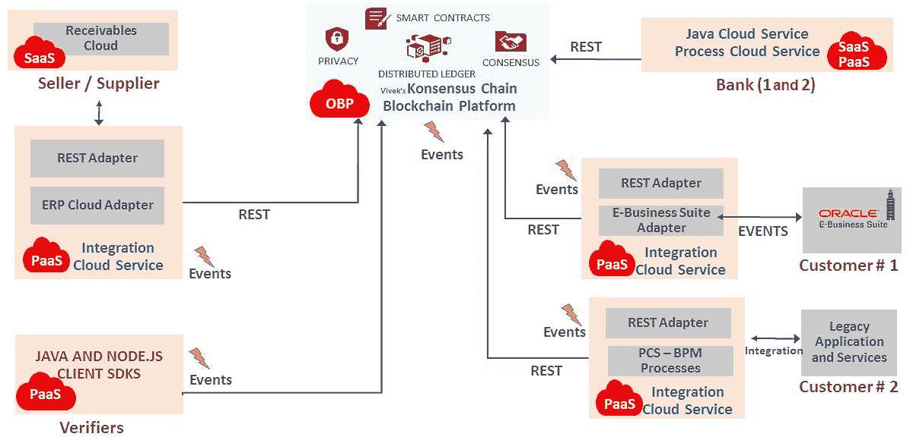
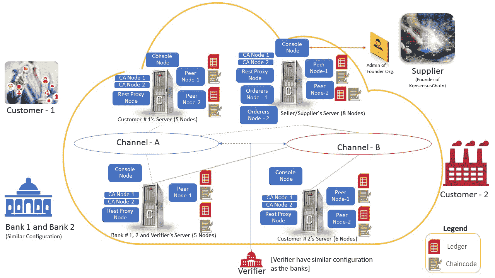

# 解读分布式账本技术和区块链

区块链是一个按时间顺序排列的交易链，这些交易是一致同意的，并被分组为块。这保证了分类帐(链)的信息是可靠的并且可以被信任，因为每个条目(块)都被网络验证并且被网络同意。对于一本记录的账本来说，**分布式账本技术**(**【DLT】**)及其变种(区块链)就是革命。凭借其性质，如作为一个不变的值得信赖的记录分类帐，没有单点故障，没有集中的第三方，以及分散的信任，DLT 和区块链创造了一个炒作(由想象力催化)，让我们可以想象 DLT 和区块链的各种用例。

吸引了所有人注意力的区块链的一个应用是比特币，这是一种全球分布的不可变记录分类账。自从它被发现以来(我不是指它是一项发明)，企业、组织、商业、企业家，以及最近的个人，都已经了解了这项颠覆性技术的重要性。一段时间以来，比特币的巨大旅程掩盖了其底层技术。然而，当世界目睹加密货币的巨大波动时，每个人都对底层颠覆性技术创造的头条新闻表现出兴趣。如今，有许多共识协议、各种 DLT 和区块链，全世界都在试图确定可以由 DLT 和区块链解决的不同用例。

自从它被发现以来，DLT 和区块链已经超越了自己。数十亿美元被注入区块链倡议，而且这一趋势还在逐年增长。探索者正在探索和证明各种用例，从防止人口贩运到数字身份，从教育到医疗保健，等等。

前一章重点介绍了分类账、区块链、DLT 技术及其结构。本章将深入探讨 DLT、其挑战和机遇，并将深入研究各种使用案例。我们还将关注设计策略，以及它如何让我们探索和参与业务场景。

# DLT 的挑战和机遇

企业正在探索 DLT 和区块链的巨大机遇，他们认识到这种颠覆性技术的战略和长期利益。但是，在企业采用 DLT 和区块链之前，需要应对与它们相关的各种挑战。本节总结了 DLT 面临的挑战和提供的机遇。

# 与 DLT 相关的挑战

本节涵盖了采用 DLT 的主要挑战。

# 感觉

对底层技术不成熟的感知:对技术不成熟的感知促使人们相信用它构建的解决方案可能会面临挑战。最近，同样明显的是，DLT 正在努力为并发用户处理更多的事务。从交易和性能的角度来看，表现不佳的 DLT 和区块链申请降低了 DLT 和区块链的吸引力和竞争力。

**感知到的与数据安全性相关的挑战**:企业需要安全的数据访问以及 DLT 和区块链的许可实施。DLT 和区块链，由于其分散的分布式分类账的本质，被认为比集中式分类账更安全，但这需要数据来支持事实。大多数分析都集中在 DLT 和区块链的影响上；然而，注意力需要转移到技术的使用和相关的法规上。对我来说，监管框架越完善，技术就会被越广泛地采用，DLT 和区块链就是如此。

# 共识；一致

**对术语和清晰度的共识**:DLT 与区块链、共识、法规和安全的模糊性，以及它们之间的关系，增加了围绕这一颠覆性技术的困惑。商业利益相关者、决策者、消费者和企业仍然在分析 DLT 和区块链的用例。清晰度越好，采用率越高，因为企业对用例会更清楚。

**法规的不确定性**:考虑到企业已投入大量资金来遵守标准和法规，围绕 DLT 和区块链制定法规至关重要。否则，如果没有法规，DLT 和区块链的收养将仍然是一个问题。

# 事实

**缺少围绕技术的结构化治理**:围绕 DLT 和区块链的治理具有挑战性，尤其是在分类账是分布式的情况下。由于 DLT 和区块链是 P2P，用户使用他们的密钥进行交易；这就是为什么围绕密钥管理的治理，以及围绕密钥丢失的清晰性和合法性，仍然需要发展。

**不紧急**:采用任何技术的另一个重要因素都与对技术的需求有关。如果对它有需求和紧迫性，这项技术将见证监管机构和企业对它的采用的巨大转变。由于企业已经投资于当前的 IT 基础设施，这也是符合法规的，所以他们不急于转移到 DLT 和区块链；这是一个巨大的架构变化和巨大的飞跃。还涉及到成本，企业需要测算**投资回报率** ( **ROI** )。这些因素降低了《DLT 与区块链》及其通过的紧迫性。

# 未知

**早期采用者面临的未知风险**:如今，每个企业都拥有定义完善的流程、IT 系统和分析解决方案，能够满足其当前需求并符合法规和标准。在 DLT 和区块链采用尚待标准化的解决方案需要对其现有解决方案进行大量重新设计，并且风险未知。还有他们清晰度的问题。即使计算出 DLT 和区块链的某种程度的战略利益，企业也不愿意采用 DLT 和区块链，因为资源成本——包括软件和人才。只有当商业利益大于成本和风险时，向 DLT 和区块链的转移才会发生。

在用智能合约取代真实合约方面缺乏明确性:在智能合约和链码方面也缺乏明确性。它们被认为是用简单的可自动执行的条件来代替真正的法律合同。这种缺乏清晰度的现象最终将随着智能合同的发展而消失，当企业分享智能合同作为复杂的真实合同的替代物的影响故事时，智能合同将大放异彩。

**缺乏数据来突出企业可以获得的优势**:由于 DLT 和区块链还没有被广泛采用，关于它们表现的数据还没有被共享和广为人知。对它们的性能的精确评估以及它们对传统的集中分类账方法和分散分类账方法的影响尚不清楚。企业采用 DLT 和区块链的好处仍有待进一步明确。

作为一名 DLT 和区块链的爱好者和传道者，我坚信 DLT 和区块链的挑战不会阻碍这种颠覆性技术的接受和采用。正如我们之前讨论的，信任越多，技术就越有可能被采用。越多的企业看到它们的价值和好处，越多的法规将被立法，越多的标准将被定义。有趣的是，成熟和采用之间是有区别的，这完全取决于企业在使用 DLT 和区块链时发现的好处。好处越多(即使 DLT 和区块链的成熟度较低)，就越有可能被采纳。DLT 和区块链可能需要更多的时间来成熟，而不是被接受。

# DLT 和区块链提供的机会

这是一个去中介化的时代，优步没有车辆，脸书允许数十亿人联网，Airbnb 没有房地产，亚马逊出售几乎所有东西，但没有太多库存。保险、医疗保健、金融、运输、物流、零售和房地产等各种行业都有中介。所有这些涉及中介的案例都是区块链的潜在案例。这允许消除消费者和生产者之间的中介，同时注入信任、可靠性、健壮性、不变性和机密性。金融和非金融行业已经很快理解了 DLT 和区块链技术及其颠覆性应用的潜力。DLT 和区块链可以应用于多个行业，从金融部门到音乐，从知识产权到教育和医疗保健。DLT 和区块链解决各种用例的持续应用如此巨大，以至于世界经济论坛预测，到 2027 年，全球 GDP 的 10%将存储在区块链上。

现在，是时候看看 DLT 和区块链提供的机会了。

# 效率的提高和新的收入来源

**提高效率**:涉及第三方的各种企业流程和以人为中心的流程可以实现自动化并重新设计以提高效率。例如，在 DLT 和区块链，不需要第三方进行数据同步和控制，因此不再需要第三方，从而提高了交易效率。之前，我们讨论了交易方需要对账的情况，其中包括资产及其价值。有了 DLT 和区块链，每个人都有相同的可信账本，所以不需要对账。这是一项显著的成本节约和广泛采用的驱动因素。

**新的收入流**:高效、临时和集成的流程将为企业吸引新的收入流，因为它们将能够快速扩展，更快地与其他组织集成，通过引入敏捷性来快速应对新的挑战。

# 商业模式和增强的弹性

**多种多样的商业模式**:没有第三方为应用程序和商业模式提供了多种可能性。企业可以采用**同行** - **到** - **同行** ( **P2P** )交易，这样他们就可以推动群体经济、共享经济或弱势群体能够融入主流的系统的发展。

**增强的弹性** : DLT 和区块链凭借其分布式的特性，允许参与节点拥有一份账本的副本。即使网络出现故障，每个节点都有一份分类账和交易的副本。没有一个实体拥有它；每个人都拥有它，这增强了网络的弹性。

# 信任的继承

由于没有单点故障，也没有单一或第三方充当中心机构，每个人都拥有网络，但同时又不拥有。事务作为块被添加，但是仅当达成共识时；一旦追加到块中，并且块被添加到链中，它就无处不在并且不可改变。由于不涉及第三方，也不依赖于中央数据库，DLT 和区块链在不变的、可信的分布式平台上提供了身份验证、安全性和信任认证方面的机会。

# 不变性和更智能的世界

**记录和报告不可变性的优势**:由于交易在 DLT 和区块链是不可变的，因此提供了一致性和清晰性的报告。因为它们是不可改变的，所以发生错误的几率极低，并且网络本身会检查欺诈行为。

**智慧世界**:在 DLT 和区块链，企业、企业和消费者、个人和机器、机器和机器等等之间的协议都是通过智能合约来实现的。这些智能合同是自动执行的，因此协议的管理和执行成本大大降低。就合同或协议解释而言，风险显著降低，这进一步降低了在传统合同和协议发生冲突的情况下产生的任何法律成本。

**过多的用例** : DLT 和区块链在大量的用例中寻找机会，从政府到金融和**供应链管理** ( **SCM** )到人类授权。本章将涵盖其中的一些用例。

# 传统技术和解决方案的挑战

人类进化到能够理解交换价值，其根源在于不确定性水平。不确定性越大，对价值交换的信任就越少。确定性越高，交换价值就越大。区块链试图解决各种传统挑战，如信任、中介、保密性、健壮性、弹性和可用性。让我们现在复习一下:

*   **不信任**:当你处理一个集中的系统时，你信任这个系统以及负责保护系统及其安全的底层人员和机器。你与生俱来的信任来自于你正在打交道的组织。例如，我们使用电子邮件服务已经很多年了，有时也会发送重要的个人邮件。我们对提供这些电子邮件服务的组织有着固有的信任，相信并确信我们的电子邮件不会被篡改或丢失。但是，它能被修改吗？你试图从银行或政府等机构获取的数据能被篡改吗？答案是肯定的。另一方面，区块链提供了一个不可信的生态系统，信息不能被篡改，并且可以确定地传递。区块链讲述了人类寻找不可信生态系统的探索。

*   **没有中介**:说到信任，我们可以感觉到它是企业与企业之间或者企业与消费者之间价值交换的基础。此外，当跨越国界、边界和法规时，信任会变得更加复杂、昂贵、低效、容易出错和缓慢。当有中间人介入时，这个等式就复杂了。区块链被证明是无中介、无信任经济的强大替代方案，在无中介、无信任经济中，信任是直接在企业之间、直接在人与人之间或直接在企业与人之间进行的，没有制度化的中介或第三方作为集中的信任机构。由于系统/生态系统本身没有中介和信任，合作、伙伴关系和机会是无限的。此外，区块链允许组织与组织、消费者、机器或彼此之间进行交易，而无需任何中介。对我来说，这是信任的演变，信任是在一个生态系统和技术中，现在允许各方在没有可信中介的情况下进行交易。当涉及到交易时，理解保密性是最重要的。
*   **保密性**:这是个人、组织或团体保持其数据私密的权利，他们的行为既不被记录也不被监控。他们可以通过匿名的方式获得隐私，不让其他人知道他们的任何信息，或者不在交易本身中公布任何敏感信息或文档，或者交易加密信息。机密性是指根据协议，对个人、组织或各方的敏感信息进行安全、受控的交换。它也可以被称为许可访问，其中许可被授予以允许各方访问信息。正是在这个科技发达的时代，科技侵犯了隐私。个人、组织和机构的数据和信息在公共领域之外，这些数据和信息在防火墙之外托管，或者被其他人用来监控和获取模式并衡量活动。

面部识别就是一个例子，它不仅仅是一项技术；这是一种生物识别(有趣的是)不需要你的共识。指纹和视网膜扫描需要你的共识；但是，通过面部识别，有人可以在未经您同意的情况下使用您的身份。信息可以被导出，你的模式可以被面部技术识别。微笑着付款，将个人与照片或动态定价联系起来，是当今流行的面部识别应用的一些例子。通过复杂的模式匹配，技术甚至可以将数据与个人或组织联系起来。

使用区块链技术，用户是所有者，可以决定可以共享的信息的深度和级别以及与谁共享。例如，用户可以选择分享他们的面部识别生物识别身份，用于政府的安全计划，而不是用于用户购买行为模式识别的商业用途。

区块链通过加密和访问控制提供机密性和隐私。持久化数据被加密和存储，而传输中的数据通过启用双向**传输层安全性** ( **TLS** )来保护。此外，它还对根据智能合约或链码执行的交易进行加密。基于角色的访问控制或基于属性的访问控制根据用户的角色配置文件或用户的属性来定义谁可以执行事务。最重要的是，您应该只与有权访问数据和信息的各方共享数据和信息(例如，Hyperledger Fabric 的私人渠道)。通过这种方式，组织假设信息只与应该能够访问它的各方共享。如果使用分布式分类账，保密性可以提高到下一个级别，分布式分类账不是公开的，而是特定于只有经同意的各方才能进行交易的渠道。

*   **健壮性**:我们在上一节讨论了信任，我们了解到信任是关于正确执行事务的。然而，信任也扩展到管理异常。系统管理可信异常的能力称为健壮性。稳健在区块链至关重要，因为其基于共识的生态系统无需中介就能建立信任。区块链可能会遇到例外，比如说，两个矿工同时找到了一个谜题的解决方案。区块链提供了遵循最长链的解决方案，在一个周期内整合单链将有助于解决这样的双重挖掘问题。类似地，通过允许引用数字资产的第一个交易被接受，并拒绝引用相同资产的第二个交易，可以解决重复支出的例外。这方面存在挑战，但系统的潜在健壮性增强了信任。毕竟，在区块链，信任是建立在制度本身上的，而区块链制度的稳健性将吸引企业和个人。
*   恢复力:恢复力是指一个人从震惊状态中恢复过来的能力，例如，一大笔手机账单，或者你刚刚把手机掉进了水里。你从这些冲击中恢复的速度和积极程度决定了你的弹性。同样，在区块链，弹性是指区块链网络从故障中恢复的能力。有趣的是，由于区块链技术的本质，它天生具有弹性。使用 DLT，事务在参与节点上备份并可用。随着越来越多的节点加入区块链网络，其可用性也在增加。因为数据在每个节点上都可用，所以弹性不是问题。它是分布式的，所以没有单点故障，而且它也是分散的，这意味着没有单一的权威。在节点可以随时连接或脱离区块链网络的系统中，这可以实现出色的灾难恢复。
*   **可用性:**由于区块链网络不需要中央权威机构来信任和维护它，而且它还具有弹性，节点可以随时连接和分离，因此系统的可用性得到了增强。随着越来越多的节点连接到网络，网络变得更加可用。当区块链网络中的单个节点处于活动状态时，它甚至被归类为可用。由于没有遗漏交易和人为错误，以及所有交易都符合共识的系统，区块链提供了一个有弹性的、健壮的系统。事务是不可变的，可以被验证，并且这种验证的结果总是一致的。想象一个比传统技术有更多好处的系统；它诱使商业和企业相信区块链是一场革命*。*

# 设计策略

本节将详细介绍如何设计区块链解决方案来构建业务网络。许多企业、企业家和组织都在分析区块链。他们采用区块链来提高企业对企业交易的速度，以不变的方式存储信息，并安全地共享信息。对于企业来说，区块链是一个平台，同行通过交易交换价值，没有中央仲裁者的干预。所有这些都是好的；然而，我们应该从哪里开始呢？这一部分包括定义区块链的设计策略。

我使用了我的书《我们和诺亚一起醒来》中的以下术语*，*我发现有趣的是，我在那本书中探索的自我提升概念也可以应用于技术:

| **探索** | 雇用 | **实验** | **经历** | **影响** |
| 用例识别 | *为*——*为*流 | 获得技能 | 分析结果 | 分享 |
| 证明用例的合理性 | *未来流量* | 敏捷 | 衡量结果 | 影响 |
| 区块链网络的结构 | 整体解决方案设计 | 开发、测试 | 分析教训 |  |
| 业务网络目标 | 选择 MVP | 提升，测试 |  |  |
| 管理 | 画出长远的愿景 | 部署 |  |  |
| 争议和仲裁人 | 未来的增强 |  |  |  |
|  | 定义范围 |  |  |  |
|  | 定义故事板 |  |  |  |

上表列出了区块链解决方案的设计策略。本节将对此进行更详细的讨论。

当您做出各种决策时，与企业关键利益相关者举行研讨会和会议总是有益的，例如通过区块链技术识别用例并论证用例。它还有助于确定区块链的类型、定义、治理和仲裁员等等。研讨会期间可遵循以下原则:

*   将研讨会定义为业务研讨会，并列出可以在后续技术研讨会中回答的技术问题。
*   强调识别用例，并通过回答和评定各种因素来证明用例的合理性。
*   不断衡量观众的反应、问题和对因素的倾向，这些因素可能与区块链一致或相反。将此反馈给证明性问题(如下节所列),以进一步提高问题的结果。
*   将*理解为* - *是*，*到* - *是*过程，因为它们有助于使解决方案与业务需求保持一致。
*   在研讨会中包括区块链专家、技术专家和安全专家，因为他们有助于回答具体的技术问题，也有助于他们被真正的业务需求所吸引。
*   确定关键的利益相关者，并建立一个利益相关者联盟(业务联盟和技术联盟)，以便您可以更有效地运行后续的研讨会。
*   与技术联盟举行并行设计会议。早期的设计会议带来了两个非常重要的东西:简单和清晰。
*   在设计会议开始和结束时使用商业联盟的反馈，同样，在商业会议结束时使用技术联盟的反馈。这将有助于你建立平衡，让事情走上正轨。

# 探索

本节涵盖了区块链技术候选用例的识别和论证。我们还将包括识别区块链的类型、治理和仲裁员。

# 识别和证明用例

启动研讨会将确定用例，在高层次上起草它，并分析区块链作为解决手边用例的候选。这种探索是至关重要的，因为它确保所有各方达成共识，使用区块链来处理用例。它有助于量化对基于区块链的解决方案的需求。

以下是将在等式中使用的因素列表，用于量化区块链作为用例解决方案的需求。对于所选的使用案例，根据以下因素量化对区块链的需求:

*   **真相**:
    *   政党之间有和解的必要吗？
    *   企业、其合作伙伴和供应商之间是否存在信息孤岛，等等？
*   **中介**:
    *   是否存在现有的中介？
    *   这些中介只是确保信任吗？
    *   是否有必要将具有相似共同问题的参与者包括在内？

*   **多方**:
    *   这个用例会导致与其他人共享信息吗？
    *   多方需要更新报告吗？
    *   您是否需要来自其他来源或利益相关方的信息？
    *   是不是其他当事人遇到的类似问题？
*   **交易**:
    *   这个用例需要企业报告事务的准确性吗？
    *   这个用例需要事务透明吗？
    *   这个用例需要事务隐私吗？
    *   它需要高事务吞吐量吗？
*   **权威**:
    *   参与者中需要监管权威吗？
    *   你预见到其他党派的加入吗？
*   **标准和其他解决方案**:
    *   这个用例容易突出资产吗(或者你能容易地识别资产吗？)、交易和事件？
    *   这种用例是否会使您的业务价值链中的资产数字化变得容易？
    *   你能用传统技术更好地解决它吗？

# 量化区块链需求的算法是什么？

对于上述因素，请确保为每个问题拟定两个单独的因素，即关键程度因素问题和满意度因素问题。这些问题的答案应该由参与者给出。例如，关于**真值**的第一个因素可以用以下问题展开:

*   **关键因素**:各方之间的和解是否关键？
*   **满意度**:目前双方对账是否满意？

公式化所有其他因素，并扩展它们以衡量关键因素和满意度因素。这是证明区块链必要性的关键。在这里，我试图建立一个等式来证明区块链的必要性:让我称之为**区块链证明等式** ( **BJE** )。

让我们用这个 BJE 来量化对区块链的需求。给用例因子分配一个数字，并检查对于给定的用例，区块链的使用是否合理。换句话说，我们可以说用例因素在突出区块链的可用性方面是最重要的。在这一节中，我将试图草拟一个等式来证明区块链的必要性。对区块链的需求如下:

*   **合理的**:当用例对企业来说是关键的，但是它目前没有被很好地服务时。这意味着他们对当前的解决方案不满意。
*   **不合理**:当用例对企业来说不是关键的，但是它目前得到了很好的服务。这意味着他们对当前的解决方案感到满意。

最后，当**结果**是合理的时候，我们会考虑区块链的必要性；否则，区块链就没有存在的必要。

# 建立等式

通过研讨会和会议，让参与者根据两个因素对上述问题进行评分:**关键因素** ( **CF** )和**满意度** ( **SF** )。这些因素需要在 0 到 5 的范围内独立回答，其中 5 表示极其关键，0 表示不关键；同样，五是极度满意，零是不满意。

让我用公式表示:

*BN = CF + (CF - SF)*

这里， *BN* 是区块链需求， *CF* 是临界因子， *SF* 是满意度因子。

这意味着:*区块链需要* = *关键度因子* + ( *关键度因子*–*满意度因子*)。这里的*、**关键因素*是将该因素评价为非常关键的人的百分比，而*满意因素*是将该因素评价为非常满意的人的百分比。在这个等式中，*关键度*是认为结果非常或非常重要的人的百分比，而*满意度*是认为结果非常或非常满意的人的百分比。

如果 80%的受访者认为这些因素非常关键，而只有 20%的受访者认为非常满意，那么对区块链的需求是合理的。然而，如果只有 20%的受访者认为这些因素非常关键，而 80%的受访者认为非常满意，那么就没有理由需要区块链。

在我的下一本书《解决方案设计者的区块链》中，我将发展这个等式并围绕它绘制更多细节。现在，我们将探索这个等式，并看看它如何根据手头的各种因素快速帮助量化(证明)给定用例对区块链的需求。

# 区块链的类型

一旦您证明了对区块链的需求，您就可以分析各种因素来确定哪个区块链解决方案适合该用例。下图不言而喻地说明了哪种类型的区块链能够满足您的要求。然而，如果你想了解每种类型的区块链的细节，你可以参考[第一章](1.html)、*探索区块链和 BaaS* 中的*类型的区块链网络*部分，在那里我们提供了不同类型的区块链的细节。

下图说明了确定特定类型区块链需求的限定词:

区块链的类型

上图清楚地强调了可以帮助您识别用例所需的区块链网络类型的限定符。

# 业务网络的结构

到目前为止，作为设计策略的一部分，我们已经确定了用例以及限定符/因素来证明对区块链的需求。我们还分析了使用案例，并就所需的区块链网络类型达成了共识。从这一章开始，我们将关注被许可的区块链，因为这本书是关于超账本结构和被许可的区块链。在这一节中，我们将着重于为区块链的业务网络定义一个结构，特别是为许可的区块链网络。许可的区块链商业网络由一个以上的企业组成。他们解决了一个常见的业务问题，并希望从区块链技术中获益。因此，出现的第一个问题是如何界定许可的区块链网络的范围和结构。

定义结构至关重要，因为它会对税收、法律、管辖权和治理产生影响。许可的区块链网络的结构如下:

*   **基于财团的商业网络**:它们可以是合资企业，所有成员都像创始人一样；
    *   合资企业:这些通常是大规模的中央集权结构。合资企业很死板，通常让创始人坐在驾驶座上。然而，如果忽略合资企业的缺陷，那么组成财团是一个有效的选择。每个成员(有财务参与)都可以作为创始人加入，创始人之间可以组成合资法人实体。他们可以民主地决定财团的建立、维护和运作。
*   **创始人驱动的商业网络**:创始人驱动的商业网络由创始人建立和维护。在这种情况下，创始人能够掌控商业网络，并决定未来的技术方向。它们可以是以下类型:
    *   **软件许可驱动**:这是一家技术公司或解决方案/平台提供商打理创始人驱动的业务网络的时候；例如，IBM 或 Oracle 从头开始构建一个解决方案来照顾这个联盟。这种配置可能会导致技术集中化。
    *   **开源驱动**:这样的网络由一个开源巨头运营；Linux 基金会的 Hyperledger 项目和以太坊就是例子。开源仍然缺乏企业支持、项目治理、项目融资等方面的能力。

*   **基于社区的商业网络**:这些是由社区驱动的区块链网络，它们或者由标准驱动，或者由自主驱动:
    *   **被许可的分散自治组织** ( **pDAO** ): **分散自治组织** ( **DAOs** )就像合作组织一样，各个合作方提供资金。例如，对无许可 Dao 的资助是由 ico 和令牌安排的。可以有一个 pDAO，其中在规则中规定了联盟的治理，这些规则包含在链代码本身中。在这样的配置中，是链码驱动联合体的操作。联盟的创建者可以处理联盟的建立和维护。操作由链码自动处理。

# pDAOs

pDAOs 是分散的(没有单一的权威)和自治的(自给自足)。这意味着它们是由参与企业拥有的基于社区的区块链网络。然而，运营、资金和争议解决都由管理自治许可组织的链码自动处理。企业联合体的这种设置将消除为了维护和处理联合体的操作而进行大型企业活动的需要。所有的决定都是*民主的*，由处理财团运作的代码驱动。这样的企业联合体将定义链码的*运行*和*维护*。本质上，他们将首先定义业务网络的构成。此后，链码将负责自动实现宪法。每一个提议，比如添加和删除成员，都可以作为一个事务提交给 chaincode，它将负责在区块链上执行。这样一个由社区驱动的区块链网络是为区块链、区块链和区块链服务的。权力不掌握在少数人手中；它是分布式的，由底层许可网络和特定用例的链码的版本许可，并且是自治的。

我相信 pDAO 可能是企业区块链采用的未来。这样的企业联合体可以在参与者很少的情况下启动。所有的法律确定性都可以通过法律结构来解决，分歧可以通过仲裁来解决。阅读我的下一本书，*面向解决方案设计师的区块链*，该书对 pDAO 进行了详细的扩展和讨论。

# 业务网络目标和治理

上一节概述了如何定义和选择区块链的结构。设计策略的下一步应该侧重于建立业务网络目标和治理。定义业务网络目标和治理也需要分析结果，这些结果是在定义区块链网络时收集的。本节与上一节平行，因为上一节中所做的决定在这里得到了巩固。

在选择区块链结构之前，需要分析各种问题。以下是对选择特定区块链结构有重大影响的一些问题:

*   你如何确保财团不会导致权力集中？
*   谁控制财团？
*   主要联盟成员比后来的成员受益更多吗？
*   谁会从现有的基础设施中受益？这是否会给新加入者或后加入者带来混乱、基础设施依赖或锁定？
*   谁决定新成员的加入或排除？
*   谁来决定财团非核心成员的加入/排除？
*   运营决策将如何执行？
*   该财团将如何融资？
*   纠纷是如何实现的？

治理是一个更广泛的主题，超出了本书的范围。现在，您应该明白，从维护和操作的角度来看，这是定义业务网络和业务网络可伸缩性的重要一步。

# 争议解决和仲裁员

由于财团包括各种企业和分散的各方，它有自己的业务复杂性。这些复杂性可能会导致纠纷。因此，财团必须有仲裁人来解决争端。这意味着财团需要一个仲裁功能，负责财团成员之间的参与合同(通过法律文件)。这可以是处理法律文件的注册会计师当局，直到这些文件也变成智能合同(链码)，它充当智能仲裁员。

联盟可以聘请智能合同(链码)审计员来验证智能合同，并验证智能合同与外部应用程序和数据源的接口和集成。这种独立审计员将向财团提供保证，并帮助发现漏洞。

# 参与、实验、体验和影响

一旦你探索了设计策略，是时候将*作为* - *是*流程，并将*到* - *定义为*流程。解决方案的整体设计将确保流程、用例以及技术之间的同步性。以大爆炸开始区块链解决方案可能是一个有问题的方法。选择一个**最小可行产品** ( **MVP** )并为未来的增强绘制草图。从一个简单、清晰但重要的用例开始。这确保了两个好处:

*   过程的简单明了将有助于你及时有效地将需求转化为解决方案
*   用例的关键程度将巩固区块链处理关键用例的能力

从一个较小的区块链商业网络开始。尽量不要包括仲裁员、监管者和庞大的财团。设计一个可扩展和动态的解决方案，但是构建一个最小可行的产品来满足用例的范围。这方面的细节超出了本书的范围。你应该遵循敏捷的方法来开发基于区块链的解决方案。你可以在我的下一本书《解决方案设计师的区块链》中了解更多关于区块链解决方案设计的信息。

# 区块链属性和用例

DLT 和区块链一样，被视为本世纪最具颠覆性的技术进步之一。虽然在成为多数人的一部分之前，它需要克服许多监管挑战，但区块链的各种属性使其真正具有革命性。正是区块链的特性为各种行业提供了大量的潜力。在本节中，我们将讨论区块链属性以及由这些属性催化的用例。

# 区块链属性

随着区块链的第一个应用比特币的巨大成功，以及以太坊和 Hyperledger 的出现，企业、组织、行业领袖、企业家和个人已经意识到区块链不是一个不切实际的梦想，而是一场真正的革命，它将推动当今各行各业的企业进入数字企业的新时代。DLT 和区块链的各种属性可以实现分散的自治市场，促进减少交易和对账中的摩擦，允许安全维护和共享分散的记录，并使消费者和企业能够跟踪产品、供应品和文档的来源。

以下是区块链最重要的财产清单:

*   **共享和透明访问**:这导致数据的一致性，当更新在参与者之间复制时，允许参与者访问一致的数据。对于许可的区块链，它只允许授权的参与者访问数据。透明度提高了系统的可审计性和信任度，降低了欺诈和审计的成本。
*   **不可变** : 区块链是 append-only；记录不能被修改或删除。不变性增强了对系统中存在的信息的信心，并多次降低了欺诈的可能性。
*   **已验证且不可否认的交易**:交易只有在达成共识后才被批量加入区块链。因此，不能否认交易的有效性。
*   **保密隔离**:使用许可的区块链，交易可以被查看，并且仅更新授权的参与者或当事人。
*   **去中心化** : DLT 和区块链一样，是一个去中心化的 P2P 网络，没有中央权威机构来控制网络。这就消除了第三方和中介，从而进一步降低了交易成本，实现了近乎实时的交易执行。
*   **分布式账本**:所有参与节点都维护一份账本。因此，不需要调节，因为 DLT 保证了数据的一致性。由于数据的一致性得到了保证，因此不需要进行协调、解决争议以及因解决争议而导致的延迟。
*   **智能合同** / **链码**:业务逻辑是在智能合同或链码中创作的，由参与者验证并共享，从而在自动化业务流程中产生高度信任。任何资产都可以在区块链中以数字形式表示，交易按照智能合同或链码中定义的业务逻辑执行。
*   弹性:不可信的生态系统、健壮性、保密性和可用性是我们之前讨论过的其他一些特性。

这些特性不仅推动了各行业各种用例的发展，还解决了 DLT 和区块链面临的挑战。除此之外，区块链可以被定制为一个像 Hyperledger 这样的许可区块链。在许可的区块链中，只有授权方可以访问区块链网络，并且只能查看和更新相关信息和任务。虽然一个许可的区块链需要精心的规划，但它消除了企业对区块链的担忧。各种 BaaSes，如**甲骨文区块链平台** ( **OBP** ，为获得许可的区块链提供解决方案，并简化获得许可的区块链的采用。因此，BaaS 实质上是在催化区块链革命的采用。

# 属性和使用案例

区块链有几个颠覆性的特性吸引着各行各业，并解决了各行各业的各种使用案例。尽管金融行业仍是探索和实施 DLT 和区块链用例的主要新兴参与者，但区块链有几项优势/属性对行业很有吸引力，如不可变的永久记录、公共记录的存储库、通用格式、可访问性和带有时间戳散列的公证，它们还解决了各种政府和法律用例，如投票、提案、治理服务、事务性组织、P2P 债券、土地所有权、IP 注册、税收收据、公证服务和文档注册服务。

类似地，分布式分类账、分散式网络、交易共识和无信任交易方等属性吸引了数字货币、支付、汇款、金融部门、银行、保险、结算、交易、衍生品、内部审计和众筹等市场的用例。区块链和 DLT 属性，如大规模协调、交易安全和通信(也称为消息传递)，对**物联网** ( **物联网**)行业具有吸引力，并推动了大量用例链，如智能家庭网络、联网汽车、智能城市、个性化机器人、数字助理、无人机和传感器网络。医疗保健用例，如数字健康钱包、智能健康令牌、健康数据分析、健康数据库、通用电子病历和个人发展合同，都可以在 DLT 和区块链使用，如大规模多流集成、隐私和安全、实时可访问性和通用格式。

上述属性还导致处理艺术、科学和人工智能用例，如 P2P 资源网络、乌鸦分析、社区超级计算机、电影、艺术追踪和跟踪、区块链倡导者、数字思维文件和区块链学习者。下图列出了一些用例，只是 DLT 和区块链为企业、组织和个人带来的可能性和机遇的一瞥:

属性和使用案例

上图显示了有助于实现政府、法律、市场、物联网和医疗保健等各种行业的各种用例的属性。属性列列出了属性，而用例列突出显示了对给定行业最有吸引力的用例。

# 用例的类型

从广义上说，区块链是一个理想的用例，分散的共识，分类帐是附加在自己同意的交易，是不可交换的。在这一部分，我将把区块链用例分成几个类别；但是，我相信有数百万个用例，这是非交换状态转移函数的结果。列出的用例分类是详尽的。

让我们从简单地将区块链的定义放入一个等式开始:

*Blockchain* = *Who Owns* - *What*, *When*, *and How much*

*当*是时间线，而*多少*是数量。不过，*到底是什么*，才是这里讨论的话题。我对区块链的分类集中在*什么*和*谁*上。

**什么:** *什么*代表资产；本质上，有价值的稀缺资产。身份、货币、土地所有权、合同、选票、出处和付款等资产是宝贵而稀缺的。让我们分析区块链的各种应用程序，并检查它们实际管理什么。比特币管理账户，以太坊管理合约状态，Everledger 管理与钻石相关的事件，信任额度由 Ripple 管理，等等。同样，对于 Hyperledger Fabric，资产可以是有形资产，如房地产和硬件，而无形资产是资产，如合同和知识产权。因此，对于那些要求在交易这些资产的同时通过将它们记录在不可变的分类账上来建立分散的共识的情况，区块链系统是一个潜在的解决方案。

**世卫组织:**在任何给定的时间点，区块链都是一种货币，一个网络，一个协议，或者一个平台。这种观念正在推动世界走向一个“道”或**分散自治社区** ( **DAC** )的世界。我将从头到尾交替使用这些术语。

一个组织或一个企业是一群人，他们一起工作以实现一组确定的目标并遵循规则。这样的组织拥有资产和负债，这意味着有一组人和法律契约来建立持有资产和拥有负债的真理。一个组织之所以行动，是因为在一组关键的人之间有这样做的共同共识。同样，雇用某人意味着雇员同意提供某些服务，而雇主同意提供金钱和其他福利。在所有这些情况下，都有合同(一套规则)。

问题是:我们真的需要管理层来执行这些规则吗，或者我们需要特定业务职能部门的特定工作来执行这些合同吗？工业化通过在底层整合机器来回答这个问题；DLT，比如区块链，也能在顶级赛事中做到吗？组织依据合同和规则运作，同时遵循规则，规则也是一套规则。组织执行这些合同和规则来产生收入，提供服务，并为员工向组织提供的服务支付报酬，以便组织可以向他们的客户提供服务并向政府纳税。这些难道不能通过软件，尤其是区块链和 Hyperledger 这样的 DLT 来实现吗？

对我来说，答案是*是的*，并且需要最少的人工参与。可以有 Dao(也称为 DAC ),其中资产所有者是利益相关者，智能契约和链码是负责组织的日常、战略和战术操作的规则和契约。参与的节点是员工自己，他们负责确认、验证，并以最低的回报达成共识。是的，现在完全描绘 DAOs 的未来还为时过早；有可能出现一个分布式的世界政府，其中政策和关系由超级智能契约来处理。

好吧，跳回到现在，回头看看前面的等式，让我们把注意力集中在*谁*上。在采用区块链时，您应该寻找的关键要素如下:在向区块链迁移时，企业将同意的资产和共识机制是什么？您是否正在规划一个 DAO，或者您的企业是否正在规划建立一个业务网络，各方将在该网络中进行互动并建立一个联合体？在这里，我指的是区块链的允许和不允许的世界。无论哪种情况，*谁*都很重要，需要确定。由于 Dao 和 DAC 的世界正在展开，我正在考虑将智能合约和链码推动的市场作为区块链的一个用例类别。DLT 的世界越成熟，世界就越接近 Dao 和 DAC 的现实。现在，让我们再次回到等式，看看等式的其他两部分，除了*什么*和*谁*。这两块是*当*和*多少*。本质上，*多少*是一项资产的数量和所有其他参数的通称。*当*帮助分析时间线、事件日期和交易时。

现在的问题是，我们如何获得关于*谁，何时，什么*，以及*多少*的信息？这些信息是区块链生态系统的一部分，并带来了第三个最重要的用例类别，即分析。进入设计和开发阶段，尝试总是提出解决方案的可见性方面。根据等式及其相关定义，区块链用例有三个主要类别:

*   数字资产
*   数字分析
*   数字平台

在本节中，我们将深入这些类别，并列出这些区块链用例的子类别。

# 数字资产

当我们使用术语“数字资产”时，我们指的是具有以下主要类别的大量资产:

*   有形资产和
*   无形资产。

以下是有形资产的子类别:

*   **金融资产**:货币、股权(公有和私有)、债券、衍生品、商品、金融、小额金融、慈善、众筹。
*   **记录**:记录可以是公开的、半公开的，也可以是其他类型的:
*   **公共记录**:
    *   财务记录，如支出记录、交易记录、抵押记录和服务记录
    *   公共记录，如企业所有权记录、监管记录、企业成立/解散记录、健康/安全检查记录、移民记录和政府法律
    *   头衔，如土地头衔
    *   登记，如车辆登记和法医证据
    *   执照和许可证，如营业执照、建筑许可证和持枪许可证
    *   出生证明、死亡证明和结婚证等证明
    *   数字身份，如护照、SSN 号码、唯一 ID、选民 ID、投票、产品的数字令牌等等
*   **半公开记录**:
    *   证书，即学位、成绩、学习评估报告等等
    *   记录，如员工记录、行为记录、医疗记录、会计记录、商业交易记录、仲裁、供应记录、交付记录和公民身份记录
*   **私人记录**:
    *   合同和合同
    *   个人信息，如遗嘱、信任、签名和 GPS 数据
    *   钥匙，例如汽车钥匙、旅馆钥匙、公寓和住宅钥匙、储物柜钥匙、出租汽车钥匙和包裹递送钥匙

以下是无形资产的子类别:

*   无形资产，如优惠券、门票、专利、保留、商标、版权、许可证(如软件许可证、视频游戏许可证和电影许可证)、域名、艺术证明，如作者身份、照片和视频或音频所有权记录
*   杂项，如温度记录和运动记录

在这里，我们试图利用这些资产。但是，也有在区块链上管理和记录这些资产的用例。此外，有一类特殊的用例处理一些资产的来源，并且主要在 SCM 用例中实现，例如从供应商到货架的跟踪、药品的跟踪和药片的保管。以下是这些用例的可能子类别:

*   数字身份
*   起源
*   记录

让我们再多谈谈这些子类别。

**数字身份**:身份盗窃和身份欺诈是数字世界常见的头条新闻。全球每年有数十亿条记录被盗、丢失和暴露，三分之二的数据泄露是由于身份盗窃和身份欺诈。区块链 DNA 包括不变性和原生认证，可以遏制身份盗窃和身份欺诈。例如，如果身份识别系统仅基于生物统计学，那么就忽略了身份验证问题。因此，银行、政府和组织可以使用高度准确的结果。即使在生物识别身份验证成为现实之前(对于整个世界，而不仅仅是在特定情况下)，私钥所有权也是一种高度安全且经过验证的身份管理方式，其中密钥是数字资产。因此，用户身份得到管理和验证，而没有暴露个人数据等有价值信息的风险。人员身份、物品身份和唯一性通过数字令牌进行验证和管理。数字令牌是一种资产，是物理项目与该项目的数字身份的映射。然后，这个数字令牌可以用于 SCM 来证明出处，以便提供例如知识产权的权利。

**记录**:区块链不是去中心化的数据库；这是一个记录系统。每天，每时每刻，企业都在用这些资产创建交易，在供应商、客户、合作伙伴和个人之间交换资产。区块链是一个记录这些交易和这些资产的数字身份的系统。这是不可改变的，并且增强了系统上存在的信息的保密性，并且减少了欺诈机会。此外，在达成共识后，交易会以块的形式添加到区块链中。因此，不能否认交易的有效性。

**出处**:有了唯一的数字身份(数字令牌)，任何实物都可以证明其真实性，证明其来源。因为分类账中的记录是不可变的，所以一个项目可以从它的起点追踪到它的终点。原产地检查假冒产品，并允许消费者在挑选商品之前得到通知，因为现在消费者承担了责任，因为消费者完全了解产品的原产地、旅程、旅程中的温度、农场、地区等。消费者可以做出明智的决定。有了出处，每个产品都会讲真话。公司知道他们所供应的材料，可以检查是否有任何不合格的物品被用于制造产品，并了解他们的潜在问题。

除此之外，区块链将免除组织因检查物品和产品而产生的费用。这就是为什么产品上市时间缩短，而信任度却成倍增加的原因。对于来源，区块链带来了透明度、可持续性和对物品和产品的信任。最终消费者对产品、其成分和旅程了如指掌，甚至在他们拿起产品之前。区块链允许智能跟踪和追踪产品，管理产品的数字身份(例如序列号)，记录原产地，标记组成组件的认证，跟踪产品的转换、包装、运输、储存和搁置的整个过程，同时管理法规合规性，并召回和检查产品的真实性。

这些子类是相互关联的。例如，对于来源，产品的数字身份是必须的。该产品的交易，如转换、包装、运输、储存和搁置都记录在分类账中，以便可以分析产品的数字足迹。这些数字足迹帮助消费者追踪和跟踪它。然而，在更广泛的层面上，我们认为它们是跟踪和追踪分析等用例的驱动因素，尽管它们主要是关于资产的数字记录。

# 数字分析

区块链分类账是一个庞大的不变的记录系统。随着世界开始采用越来越多的区块链用例，想想无权限区块链中包含的巨大数据。即使得到许可的区块链也会有财团或私人数据继续大规模增长。对区块链的分析和预测分析将揭示许多故事、事实和见解。这样的生态系统将提供实时、可信和不可更改的信息，这将不仅使企业，而且使较小的组织和个人能够分析信息，并在许可的区块链中分析相关(授权)信息。

区块链在金融技术中有许多用例，例如贸易融资，可以创建智能合同和分散应用程序(dApps)，以提高支付速度，减少跨境和各方执行交易的时间。区块链智能合约、chaincode 或 dApps 也可以简化清算和结算功能。这些 dApps 将产生大量的交易和交易数据、合同，并且交易数据是根据这些合同执行的。这些数据对于战略和战术目的非常有用，数字区块链分析将有助于分析区块链的数据。这产生了区块链分析用例，例如**反洗钱** (AML)和欺诈分析、风险分析、交易执行、运营分析、合规报告和监管报告。

# 数字平台

组织联盟可以构建一个平台，让他们的客户作为一个统一的系统与他们进行交互。或者，几个人可以在家里或智能设备上为变革投票，结果将在当天公布。借助基于区块链平台构建的现代转型应用阵列，所有这一切都有可能实现。这种应用称为 dApps。

dApp 提供了一个去中心化的平台来构建去中心化的应用程序。这些 dApps 继承了区块链的许多优点，例如 P2P 交互、无信任系统和可靠性共识。由于 dApps 继承的区块链优势建立在区块链平台上，数据不是集中记录的，而是分布式的。这排除了单点故障的可能性，因为不需要对账而提高了交易速度，因为不涉及第三方而降低了成本，并且在提高透明度的同时减少了欺诈及其相关成本。应用上市所需的成本和时间大大降低，区块链可以轻松地与遗留系统集成，从而为企业提供了区块链与遗留系统共存的机会。

dApps 之外是 DAO 和 DAC 的世界。智能合同/链码可以以这样的方式创作，即它们可以执行业务的大部分功能。区块链可以通过执行作为智能合同或链码的一部分创作的法律合同和规则来运营业务，并引用记录在区块链账本上的记录、数据和文档。

dApps 市场是一个主要领域，其中有许多解决简单到复杂问题的应用程序，这些应用程序建立在区块链平台上，如用于无许可应用程序的以太坊，用于许可用例的 Hyperledger Fabric，以及用于基于物联网用例的 Hyperledger 和**物联网协会** ( **IOTA** )。例如，股票交易遵循 T+3，交易在接受后三天结算。有了区块链，贸易可以立即结算。政府法规可以被吸收到 dApps 和 DAO 中，因为法规遵从性是可以编码到智能合同或链码中的政府规则。这将把规则注入 dApps 和 Dao/DAC。有关 Dao/DAC 的详细信息，请参考上一节。

区块链和物联网的联姻提供了一个记录、处理和共享机器对机器交互的生态系统。区块链为区块链账本增加了物联网数据的不可变记录，这为物联网系统带来了不信任和透明。通过设备的数字身份，区块链允许对设备的身份进行认证和验证，并为许可和无许可的用例开辟了大量的用例。IOTA 是物联网的数据层，它依赖于一个名为**有向无环图** ( **DAG** )的 DLT，其中的重点是执行和记录机器之间的事务。

下图显示了基于三种主要用例类别的不同用例:

分类用例

下一节将深入探讨一些用例。

# 探索用例

在*设计策略*部分*，*我们试图为一个基于区块链的商业解决方案定义一个设计策略，它有五个步骤:探索、参与、试验、体验和影响。在这一节中，我们将专注于第一步。在这一步，我们将探索几个区块链用例。它们如下:

*   不动产登记和所有权转移
*   了解你的客户
*   发票保理

# 政府-不动产登记和所有权转让

不动产由政府记录和维护，主要是在地方政府一级。例如，国家评估员负责记录和维护国家的财产记录。虽然有几个国家实现了数字化，但许多国家仍然使用传统方法，依赖纸质系统。或多或少，记录导致合法的所有权，交易记录，并检查非法处置。从本质上讲，该记录是所有权的合法证明。在这一记录过程中，政府是维护财产记录、评估其价值和收税的可信机构。作为一个受信任的中央权力机构，政府机构提供信任并倡导透明。此外，政府的中央权力机构还提供了一个程序，以确认产权、保护文件、将产权作为公开记录进行透明展示，并提供无缝方法来转让这些权利的所有权和记录转让交易。简而言之，公众寻找记录和权利维护、所有权和权利的转让以及转让交易和信托的记录。

这听起来不像是一个可以通过区块链解决的有效用例吗？事实上，许多地方和国际政府已经开始采用区块链来数字化记录区块链的土地所有权记录。它在许多方面都有帮助，如透明度、保护记录、检查欺诈性转账和记录转账。这个用例涵盖了一个简单的不动产登记、评估和列表的区块链解决方案。

# 当前流程面临的挑战

记录房契会产生行政费用。通常，契约是通过电子表格、邮寄、电子邮件或书面形式亲自交付给记录办公室的。然后，它被扫描并上传到文档存储。这导致记录被发送到中央存储器。从那时起，记录的信息用于确定记录的所有权。该记录的所有权也向公众公开以供参考。任何进一步的交易，比如所有权的转移，都需要在同一个中央存储器中进行。这不仅成本高、效率低、容易出错，而且耗时。

# 区块链，救世主

记录将存储在区块链或政府的中央存储库，其参考可以在区块链。有关大型对象存储的更多详细信息，请参考第 3 章、*中[的*大型*、*对象存储-* 、*链上或链下*部分。土地或财产所有权被记录为数字资产，在区块链上可供公众参考。可以针对这些资产执行交易，并且可以快速转移资产。政府机构不需要一直扫描文档、打印标签、记录文件和维护它们。该数字资产的所有信息都可以在不变的区块链中获得。也可以对这些资产执行税务交易。可以对财产价值进行评估，并且可以将该价值评估作为这些数字资产(财产)的交易发布在区块链上。一切都记录在一个地方，可以通过区块链记录生成分析和报告。区块链作为对数字资产(财产)执行的所有交易的可追踪和可审计的记录历史。](3.html)*

各种交易，如一个包裹变更交易(数字资产被分割、合并或重新分类)，都可以记录在区块链上。各种命题，如 58 和 193(指加州的道具)，导致父母和子女之间或祖父母和孙子女之间的不动产转移交易，都可以记录在不可变的账本上。还可以记录各种其他生命周期事件，如地址更改和任何属性属性更改。由于数据在区块链上可用，因此很容易与其他部门共享数据，这也使得其他部门可以很容易地连接到一个源以获得相关信息。可以在数字资产上进行各种其他交易，如估价、评估和滚动更正，这些交易可以在数字资产上进行交易，并且可以被记录以实现可审计性和可追溯性。

不动产(也称为*不动产*或*不动产*)注册中心的区块链解决方案可以是**不动产链**注册中心。这是一个区块链解决方案，其中记录了土地记录和建筑记录等不动产记录。这些财产在区块链上被识别为数字资产，这些数字资产的交易(记录)被记录在区块链平台上:

用于财产登记和评估的区块链解决方案

上图显示了一个简单的区块链不动产登记、评估、列表和分析解决方案。这是一个区块链平台，包含以下组件:

*   有一个 dApp 来登记不动产，它也将验证和关联纳税人。它叫做**不动产记录管理系统**。记录的不动产将有一个数字身份，系统将把它识别为一个独特的数字资产，拥有定义的所有权和确定的纳税人。如果已经记录了一个属性，那么可以使用该属性的唯一数字资产 ID 来验证它和它的所有权。
*   有一个 dApp 可以让你列出属性。同样，财产所有人授权列出财产清单。这份清单将允许你买卖房产。今天，有**多个列表服务** ( **MLSes** )，这是一个房地产数据库，房地产经纪人为其支付费用以列出、购买和出售房地产。Zillow 等各种网站与这些 mlse 合作开发住宅物业，而 CoStar 等其他公司则与 mlse 合作开发商业物业。要想出售你的房产，你需要向注册在这些 MLSes 名下的代理人付款。有时是销售价格的 6%到 9%。这是一件昂贵的事情，为了获得更好的交易，你可能需要与大联盟合作，以获得更广泛的市场。一家总部位于区块链的 dApp 正寻求将 T4 授权的 T5 房产在区块链上市。现在，每个人都可以进行买卖，这是透明的，交易也是不变的。
*   还可以创建 dApp 来分析房地产数据，这些数据可以展示房地产的趋势、评估价值变化和交易。
*   可以创建诸如**评估&评估**之类的智能合同，这些合同可以处理所有权转移、施工许可等等。例如，当针对财产(数字资产)进行转让时，区块链会收到契约的副本。智能合同将决定是否需要利用州法律进行重新评估。如果需要重新评估，则确定资产的新市场价值，并且通过智能合同通信服务将新的评估值传达给纳税人。这种智能合同也将照顾豁免规则，如残疾豁免和退伍军人豁免。此外，某些所有权的转移，如丈夫对妻子，不会导致重新估价。这些智能合同处理这样的评估规则，可以为纳税人创造新的评估价值。智能合同还可以通过新的评估与纳税人沟通，让业主在不同意评估值的情况下提起上诉。
*   其他系统，如法律和司法系统以及税收人员，可以很容易地与区块链连接，并从中获取相关的授权信息。

# 区块链解决方案的优势

区块链解决方案在物业登记、挂牌和评估方面的优势如下:

*   效率:今天契约记录很贵。将财产注册引入区块链平台导致**财产即资产服务**(**PAAs**)，在那里它被不变地记录。诸如所有权变更、评估和估价等后续事务可以由智能合同处理，这增加了效率；它不容易出错，而且效率更高。
*   **实时**:房产记录实时更新。智能合约几乎可以立即执行所有权转移、评估和重新评估计算等交易。区块链实时提升公共信息的透明度和准确性。
*   **不可变交易**:由于数字资产注册和交易记录在 DLT 上，所以它是不可变的，容易受到攻击，并且是防篡改的。像在海地发生的那种土地记录被破坏的自然灾害可能会发生。这种情况不会发生在像区块链这样不变的账本上。
*   **信任**:区块链促进了财产登记和记录的信任、透明、高效、准确和安全，记录了财产交易、上市、自动评估和评价，易于集成，等等。这表明区块链是集中式不动产记录、所有权和交易系统的强大替代方案。

# 社会因素

这种基于区块链的土地所有权登记解决方案对洪都拉斯等国家来说意义重大，世界银行在洪都拉斯发行美元，帮助洪都拉斯政府将土地所有权数字化。中央系统不是一个可行的解决方案，因为腐败的玩家可能会入侵和篡改它。区块链解决方案是最适合这种问题的解决方案，因为它是不可变的，不能被篡改。另一个例子是印度，该国三分之二的民事案件与土地和财产有关。根据政府数据，有 2200 万起未决案件。其中有 600 万人被拖了 5 年多。在区块链平台上，土地和财产记录是具有唯一数字身份的数字资产。它们不变地存储在分类账中，区块链系统将处理这些数字资产的交易，如所有权转移、属性变化、新建筑和贷款。用户、授权机构和政府几乎可以立即跟踪和追溯数字资产的整个历史。这样一个系统将是高度无组织和腐败地区的福音。

# 房地产众筹

另一个有趣的用例与前面的用例一致，与财产的众筹有关。众筹一个财产，代币代表财产的部分所有权，已经存在很久了。然而，当你想要清算，而你的合伙人还没有准备好的时候，问题就出现了。通过对数字资产(如房产)的代币所有权，您可以交易代币而不用担心问题，并根据您的意愿和需要进行清算。令牌或固定数量的数字令牌可以表示财产(土地、建筑或公寓)等数字资产的所有权百分比。根据百分比，您将获得租金收入或股息。这是一个开放的窗口，为那些想进入房地产，想投资房地产，但也想开始小额投资。现在，你可以拥有一小部分企业、一小部分住宅或一小部分公寓，并从租金或股息中获得潜在收益。

# 金融科技——了解你的客户

为了检查监管风险、洗钱、未经授权的融资等，银行花费了数十亿美元来吸引新客户并保持现有客户的合规性。虽然开户是一个简单直接的过程，但它涉及识别和进一步核实申请人的监管过程。这些过程被称为入职过程，也称为**了解你的客户** ( **KYC** )。此流程面临不断的法规变化，需要保持最新以满足法规遵从性要求。它复杂、耗时且成本高昂。粗略估计，每家银行每年花费 6000 万到 3 亿美元。每个 KYC 大约需要 5 到 45 天，平均而言，一个新账户需要 24 天才能上线。此外，金融机构需要维护其系统和流程，以符合不断变化的监管要求。此外，客户没有统一的体验，因为每个银行都不一样。除此之外，银行每年在反洗钱上总共花费数十亿美元。

显而易见，所有金融机构和银行的负担导致客户的参与度很低。区块链在这种情况下是一个潜在的救星，因为它允许金融机构分担负担。此外，它还消除了重复工作，因为客户详细信息将在共享的分布式分类帐中提供。通过启用区块链的 KYC 流程，客户的最新信息可在共享的分布式分类帐中获得。如果需要对客户数据进行更改，参与的金融机构和银行将达成共识，并参与基于共识的联合方法来验证申请人。

目前，KYC/入职涉及从申请人处收集文件，让信贷机构核实申请人的身份，并将其纳入反洗钱和非法金融交易。这一链条涉及多方，成本高、耗时长、速度慢且容易出错。

# 礼物

目前，KYC，也称为入职流程，面临着许多挑战。首先，由于信贷、会计、法律和运营等不同部门遵循不同的流程，因此缺乏结构。由于每个部门对法规的理解不同，每个金融机构或银行的每个部门都有一个单独的流程。其次，这些流程需要符合不断变化的法规。第三，需要一系列文件和各种接触点来验证申请人是否增加了流程的时间和成本。

# 将来的

密码、安全、哈希等区块链技术以及透明性和不变性等属性将确保银行试图访问的记录准确、一致、安全、可靠和真实。由于数据是共享的，它既不是由单个实体控制的，也没有单点故障。根据共识，数据也是可靠的。客户/申请人的个人数据在区块链上的可用性是一个可以解决的问题。每个金融机构和银行都可以维护其安全数据库来托管其客户的数据，并且只共享到区块链的链接或到区块链的令牌。

对于申请人，金融机构或银行执行 KYC 进程，验证申请的身份。这确保了个人不会沉迷于任何非法金融交易。申请人向金融机构或银行提供某些信息，然后由银行的**业务线** ( **LOB** )(也称为部门)使用，以核实申请人是否参与反洗钱和非法融资活动。借助面向 KYC 的区块链解决方案，即使是参与银行也可以通过一个安全的共享不变分类账共享申请人的验证信息。客户的任何错误交易都会立即向区块链发出警报，参与银行和金融机构可以利用该警报来标记该客户。

KYC 本质上是一场涉及多方的认同运动。由于区块链是共享的、不可改变的、可靠的和安全的，并且没有单一权威或单一故障点，银行和金融机构不需要调和。

参考下图中的**前区块链 KYC 流程**，申请人提交文件，包括政府颁发的身份证件，如 SSN 号码、驾驶证和护照，以及其他信息，如就业、营业税和地址证明。银行收集这些文件，并在开始扫描后，将其转发给中央中介机构，以验证此人的身份。中介将这些信息存储在中央数据库中，并会产生管理、维护和保护这些数据的成本。这一成本进一步级联到银行。此外，每个参与银行和金融机构重复相同的过程:

KYC 用例

尽管申请人提交了政府颁发的身份证明，但在保证程度方面仍然存在挑战。最大的挑战是证明你是谁。中介会检查各种数据源、信用机构等等，但是保证级别仍然是一个值得怀疑的问题。

如果申请人是第一次申请，甚至没有信用记录，该怎么办？最高级别保证中缺失的环节是申请人的生物识别和验证。申请人可以提供政府颁发的身份证件，如护照、SSN 号码或驾驶执照，以及固有的生物特征。最高级别的保证是通过匹配生物特征和政府身份来保证的。这转化为在中央中介处也具有生物统计数据的事实。这增加了数据保护成本，并引入了复杂的设备来扫描申请人的生物特征。

# KYC/区块链的登机流程

申请人的唯一数字身份是基于政府颁发的标识符和生物特征生成的。生物识别技术增加了最高级别的保证，由政府 ID 提供支持。这将作为客户在区块链网络上的唯一数字身份。这有助于申请人转为客户进行跨境交易。此外，使用区块链 KYC 解决方案，没有中央中介，因此每个银行和金融机构都不需要重复执行 KYC 检查。共享的不可变分布式分类帐将提供请求银行或金融机构，以及申请人的许可，用于客户跨银行和机构的活动。如果有任何可疑情况，它还会发出警报，让银行和机构对该客户进行标记。对于客户执行的所有后续交易，他们的数字身份将被附加到每笔交易中，这意味着每笔交易都有客户的数字签名，具有最高级别的保证。客户的数字身份可以帮助您访问客户的相关信息，如他们的地址，并让您跟踪和追踪任何交易。这也将有助于您标记任何可疑的交易，并有助于减少假阳性。在区块链，没有中央中间人。因此，不存在单点故障，不变的共享账本是事实的来源。

# 区块链进程

对于区块链，KYC/登机流程如下:

1.  申请人带着他们的身份证、地址和纳税证明去银行。
2.  银行将扫描该文件，以及申请人的生物特征，并将其推送到区块链(假设银行开始使用生物特征进行入职)。或者，客户可以将他/她的 KYC 文档直接上传到区块链(如上图所示)。

3.  区块链网络将使用政府身份证的某些属性，如 SSN 号码和出生日期，如果启用了生物识别技术，将使用生物识别技术生成申请人的唯一数字身份。如果申请人已经存在，经核实的信息将返回给银行。
4.  当一个新的申请人加入区块链时，将进行一项交易，由参与银行和金融机构核实。因此，数字身份是高度可靠的，是基于共识添加的，这也意味着它是可靠的。类似地，对现有客户信息所做的任何更改都可以附加到协商一致的区块链中。参与银行和金融机构可以实时访问所有更新和新增内容。
5.  经验证的申请人被添加为客户。
6.  该客户执行的交易将始终包括他们的数字签名。

这确保了创建客户的数字身份，并且每笔交易都有经过验证的数字签名。但是，让我们讨论一下谁可以访问区块链上的数据。由于数据存在于共享的分布式分类帐中，因此第三方可以访问这些数据进行验证，但只有在被授予权限之后。这可以检查任何未经授权的数据访问，并增强个人用户和机构用户的能力。

当申请人向银行提供信息及其生物特征时，他们的数字身份由区块链系统创建。但是，在用户同意之前，任何人都不能访问它。用户将拥有这些数据，只有在用户同意后，其他人才能访问这些数据。用户可以通过登录 KYC 门户网站(作为区块链网络的 dApp 的统一 KYC 门户网站)并建立数据的私钥来给予同意。现在，银行和其他第三方可以出于验证目的访问数据，数据仍然归用户所有。此外，每个验证请求和对用户数据的每次访问都会留下痕迹，这将增强最终用户的能力，并告知他们谁在使用他们的信息以及用途。

KYC 过程可以构建为智能合同，然后可以跨行业使用，并进一步诱导标准化。区块链提供了严格的反欺诈检查，因为区块链上的数据是不可变的。银行和金融机构不需要单独进行验证。由于数据位于共享的分布式分类账上，因此各方都可以访问它，尽管它仍归最终用户所有。随着交易的签署，任何欺诈活动都可以被发现并通过区块链网络进行交流。由于账本上的数据是可信的、可靠的、不可变的，所以不需要二次验证。可以实时发现诈骗和欺诈性交易，从而节省时间以及未被发现的诈骗和诈骗的后果。

我们之前讨论的 KYC 解决方案是客户的分布式数字身份解决方案。此外，将银行和金融机构引入区块链消除了冗余。使用数字身份对交易进行签名有助于防止欺诈，并识别非法和欺诈交易。然而，KYC 及其在区块链的底层数字身份解决方案也有各种使用案例。它可以找到需要唯一数字身份的用例的解决方案；比如会员卡，法制，信用评级机构。除此之外，所有那些涉及事务的用例都是基于区块链的 KYC 解决方案的主要候选对象。示例包括赌博、数字版权、小额融资、P2P 借贷、汇款、全球支付、股权、债务、众筹、衍生品、投票、所有权、所有权记录、知识产权和医疗保健。

# 金融科技-发票保理

小企业通常带着他们的发票去大型金融公司，比如银行，以获得融资。通常，企业对企业和企业对政府的交易，尤其是采购，需要更长的支付时间。公司通常将发票出售给发票融资公司，并可以获得未付发票的融资。通常是发票的 75%到 85%。当发票融资公司收到该金额时，将收到剩余的金额，剩余的金额将由发票融资公司扣除费用。发票融资公司收取的金额通常取决于付款条件。付款期限越长，发票保理公司收取的费用就越高。大致来说，发票保理业务在全球是一项价值 3 万亿美元的业务。在全球范围内，每年大约有 2%的发票融资受到欺诈。

今天有什么？

银行和金融机构确实有检查欺诈和处理潜在风险的流程；但是，这是一项劳动密集型、手动、成本高、耗时且效率低下的工作。以下是发票保理的主要步骤:

1.  供应商向其客户开具付款条件发票(30 至 90 天)
2.  供应商需要现金，因此达成协议，将发票分配给保理商，发票包括费用和其它详细信息
3.  发票被出售并分配给票据贴现商
4.  保理商将预付大约 80%的发票金额
5.  在发票到期日，客户向票据贴现商支付发票金额
6.  减去费用后，票据贴现商向供应商支付剩余的 20%

我们试图解决什么？

大多数情况下，公司会将发票拿到多个金融机构或银行。因为融资公司和银行没有整合的沟通机制；它容易受到攻击，这可能是潜在的欺诈点。由于公司有多个地方收取发票，并且由于金融机构和银行没有整合，他们不知道同一张发票被提交给不同的金融机构或银行。此外，可以修改发票并提交给各方以获得融资。这里，我们讨论两个主要挑战:第一，相同的发票被发送给各方，第二，被更改的发票被发送给各方。除此之外，发票保理业务还会带来其他风险，例如不付款和延迟付款等。其他风险包括发票可能是假的，或者可能被篡改过。发票保理也是一个用例，用于验证客户及其顾客的身份。经过验证和确认的身份可以降低延迟付款和不付款的风险。

将发票保理业务引入区块链系统将分散发票保理业务的整个流程。区块链智能合同将负责协议并验证参与者(供应商及其客户，就本节中的前一个示例而言)的信用。由于它是一个不可变的交易记录，参与方还可以分析参与者过去的表现，这有助于降低风险并增加整个过程的透明度。区块链解决方案，特别是基于 Hyperledger Fabric 的解决方案，将有助于减少发票融资中发生的欺诈，特别是由于缺乏沟通和重复开具发票造成的欺诈。

# 基于联盟的解决方案

许可的基于 Hyperledger 的解决方案可以帮助公司在分类帐上共享关于发票的关键信息，而不是向他们提供关于客户数据的详细信息。尽管这是一个由银行、金融机构等组成的财团，但它们是竞争对手。在基于联合体的解决方案中，发票销售者将与特定的代理商(银行或金融机构)联系。发票的数字身份将通过区块链网络进行验证。在唯一性的情况下，该发票将被票据贴现商(银行或金融机构)考虑用于票据贴现。供应商可以允许其客户成为区块链网络的一部分，这样客户就可以直接向保理商付款。所有交易都将通过区块链网络进行处理，该网络由交易方的数字身份进行签名，并将包括有关发票数字身份(数字资产)的信息。

可以想象，发票的数字标识(也称为数字令牌)是由区块链网络发行的，并且是唯一的。因此，在区块链网络中不会出现双重发票。除此之外，所有的当事人，如银行和金融机构，都在联合体中；因此，每个人都会知道发票，这消除了任何沟通问题。这也将检查卖方同时将相同的或篡改的发票给多个贷方的任何机会。如果他们这样做，发票将只为一次请求支付，重复发票的行为将被永久记录在区块链上，这可能会影响卖方的信用评级。随着区块链网络的发展，可以更加重视卖方和贷方的信用评分。卖家的评级越好，他们需要支付的费用就越少，因为这会鼓励合法可信的卖家。有了区块链，发票保理业务也可以向中小投资者推广。

# 市场解决方案

发票销售者可以通过 dApp 使用区块链平台，这将允许他们选择他们想要出售的发票。一旦发票被标记为待售，经验证的票据贴现商就可以接受该发票。如果卖方认可，这意味着卖方同意保理协议和费用。在这种情况下，智能合同将向卖方发出支付交易，卖方将得到支付。在到期日，智能合约将从客户账户发出借记交易，以贷记票据贴现方账户。在向保理账户付款后，智能合同将负责向卖方支付剩余款项，并将费用记入保理账户。

在整个过程中，一旦发票被推送到区块链交易平台，所有的交易都由智能合约本身处理。智能合同自动对供应商、保理商和客户进行开票、贷记和借记。发票的某些属性可用于生成发票本身的唯一散列，也称为数字身份。发票属性的任何改变都会导致发票散列的改变，并且很容易被区块链网络发现。

# 令牌化市场

有了区块链，发票保理业务超越了银行和金融机构的界限。中小投资者也可以参与发票保理。比方说，*发票购买&销售*是基于区块链解决方案的 dApp:

*   发票卖家可以使用该应用程序并选择一张发票进行交易。
*   卖家可以根据之前的分数设置发票金额或智能合约。卖家的信用评分会修改发票的价格。
*   区块链智能合同(发票保理智能合同)将生成发票的数字身份(数字令牌),并对其进行重复验证。
*   验证后，将根据发票金额的百分比或分数对发票进行令牌化。
*   贷方(小型、中型或大型)可以拥有这些代币。代币代表应该支付给卖家的部分。代币的所有权意味着同意向卖方付款。
*   在到期日，智能合约将基于贷方拥有的令牌(票据贴现账户)从客户账户发出债务交易，以贷记票据贴现账户。
*   向贷方(票据贴现账户)付款后，智能合同将负责向卖方支付剩余款项，并将费用记入贷方/票据贴现账户。

下图显示了使用和不使用区块链的发票贴现流程:

发票保理用例

由于这是一种基于令牌的方法，中小企业和大银行都可以通过区块链网络的不变性、信任度和可靠性跨境购买发票。

# 参与用例

在*设计策略*部分，我们试图定义一个由五个步骤组成的区块链设计策略:探索、参与、实验、体验和影响。在这一节中，我们将专注于第二步。在这一步中，我们将参与上一节中定义的一个用例。[第五章](5.html)、*在 Oracle 区块链平台上管理解决方案*和[第六章](6.html)、*在 Oracle 区块链平台上开发解决方案*，负责解决方案的试验。在那里，我们将定义另一个用例，并尝试构建解决方案的链代码。我们还将设置和配置一个区块链网络来运行链码，并通过 REST 使用集成来连接链码。

在这一章中，在讨论用例时，我们将从定义流程开始—首先将*定义为* - *是*流程，然后将*到* - *是*流程。我们在上一节中已经介绍了很多关于流程的内容，这就是为什么本节将讨论*，因为* - *就是*流程。在参与过程中，我们将学习定义模型的艺术，包括资产、数据模型、事务、参与者、事件和访问控制。一旦定义了流程并确定了组件，我们将研究用例的集成架构和基础设施配置。

对于给定的用例，参与和定义基于区块链的业务网络的步骤如下:

1.  将*定义为* - *是*流程，以识别问题并定义高级流程(*到* - *是*)
2.  确定并定义区块链网络组件:
    *   确定参与者。
    *   定义资产和数据模型。
    *   在事务细节中定义业务流。这允许您识别事务和事件。

# 定义流程

此用例涵盖应收账款保理，也称为发票保理。这是一种金融交易，允许企业从其未付发票中快速产生价值。我们首先将*定义为* - *是*流，然后将*到* - *是*流，这允许我们识别各种区块链组件。

# 现状流程

销售人员与客户进行交易并开具发票。这些发票的到期日为 30 天、90 天或更长时间，这取决于供应商及其客户的商业条款。因此，他们的客户不会立即向卖家付款。在这种情况下，如果卖方希望立即获得现金来运营或创造更多业务，他们可以选择出售其未偿应收款。这让卖家可以满足他们的即时需求。发票销售者通常会将未结发票打折出售。买方通常会接受折扣，并立即向卖方付款。然而，买方只支付折扣金额，例如发票总额的 90%。在幕后，买方检查付款人(客户)的信用历史，因为最终付款给买方的是客户。在此过程中，有三方——发票卖方、发票债务人(付款人)和发票保理商(买方)。这种发票保理也称为应收账款融资或应收账款保理。它是一种资产抵押贷款，允许卖方的应收账款作为抵押。

# 未来流程

概括地说，供应商向其客户(客户 A 和客户 b)交付货物。供应商向这些客户开具付款发票。客户 A 将在 30 天后收到发票 1，客户 b 将在 90 天后收到发票 2。供应商需要立即获得现金，并将发票 1 和发票 2 分别以 5%和 10%的折扣出售。银行 1 和银行 2 也是总部设在区块链的商业网络(KonsensusChainBC)的参与者。他们浏览可用的发票并进行分解。银行 1 让售发票 1，并将发票价值的 95%支付给供应商，而银行 2 让售发票 2，并将发票价值的 90%支付给供应商。保理业务将导致立即向供应商支付发票。立即付款确认将导致客户的应收账款被更新。现在，客户 1 需要向银行 1 付款，而客户 2 需要向银行 2 付款。用新的收款人详细信息更新应付金额。在到期日，账户从付款人(客户)账户直接支付到买方(银行)账户，并且客户的 AP 系统被更新。在客户 1 和 2 100%支付发票后，买方将向卖方(供应商)支付剩余的发票金额。然而，买方(银行 1 和银行 2)将向卖方支付剩余部分，减去交易费。

# 识别和定义业务网络组件

下图突出显示了名为 KonsensusChainBC 的业务网络的各种区块链组件。这些组件包括资产、交易、事件、渠道和区块链网络的访问控制列表。由于这个区块链商业网络是在基于 Hyperledger 结构的区块链上实现的，因此它也有一个渠道的概念。尽管这个步骤需要一个包含事务和事件的详细流程，但是您可以跳到事务流程步骤，然后再回到这个部分。

根据事务处理流程，您可以在区块链业务网络上获得以下组件列表:

协商一致意见的分块链组成部分 BC

请访问[第 3 章](3.html)、*深入探究 Hyperledger 结构*，了解有关交易、事件、渠道、参与者和访问控制的详细信息。访问[第 5 章](5.html)、*使用甲骨文区块链平台管理解决方案、*配置 OBP 网络。

# 定义资产

资产可以是*值*的任何东西。资产可以是有形资产，如房地产和硬件，也可以是无形资产，如合同和证书。可以使用链码事务修改资产。因此，在我们确定交易之前，最好先确定将在区块链网络上交易的资产。身份、货币、土地所有权、合同、选票、出处和付款等资产是宝贵而稀缺的。让我们分析区块链的各种应用程序，并检查它们实际管理什么。例子账户是比特币中的资产，契约状态由以太坊管理，钻石作为资产由 Everledger 管理等等。同样，对于 Hyperledger Fabric，资产可以是有形资产，如房地产和硬件，而无形资产可以是合同和知识产权。这意味着，区块链是这些情况下的潜在解决方案，在这些情况下，要求在建立分散共识的同时交易资产，同时将它们记录在不可变的分类账中。

对于这个业务案例，主要资产是发票。以下是资产的一些属性:

*   发票 ID/编号
*   发票描述
*   交易货币
*   原始发票金额
*   未付发票金额
*   让售发票金额(根据折扣百分比计算)
*   发票到期日
*   发票折扣百分比
*   客户 ID 和其他客户详细信息
*   供应商 ID 和其他供应商详细信息(以及银行详细信息)
*   保理参与者 ID(同意*至* - *成为*发票保理商的银行)
*   保理商详细信息(保理商银行的详细信息等)
*   发票里程碑(状态)
*   付款方协议(真/假)

# 定义参与者

这一小节集中于定义业务网络的参与者。对于发票保理的使用案例，涉及以下各方:

*   供应商，也称为卖方或发票发行人:
    *   该供应商也是区块链网络(KonsensusChainBC)的创始人，在该网络中，各银行和客户作为参与者相互联系
    *   区块链网络的链码是一个名为 KonsensusChain
        的 dApp
    *   这个 dApp 提供了一个销售应收账款的解决方案。它还带有用户界面，允许供应商(卖方)、买方(保理商)和客户(付款人/债务人)进行交易
    *   供应商的应收账款与区块链网络相关联
*   客户(客户 A 和客户 B)也被称为付款人/债务人:
    *   客户使用 KonsensusChain dApp 浏览发票的里程碑(状态)并检查收款人的信息。
    *   客户的应付账款与区块链网络相关联，在那里它订阅从区块链网络发出(引发)的事件。各种事件允许客户的**应付账款** ( **AP** )更新收款人详细信息，并用发票的持续状态变化更新他们的 AP 系统。
*   银行是购买发票的一方。他们也被称为买家。在这个场景中有两个银行(银行 1 和银行 2)。
*   审核人是有权访问交易概要，但没有很多细节的参与者。这方面的一个例子是政府机构，如**证券交易委员会** ( **证券交易委员会**)，希望检查发票保理中的欺诈行为，并需要访问交易摘要。

下图显示了参与者:

KonsensusChainBC 商业网络参与者

虚线/蓝色圆圈表示客户 1、供应商和所有银行之间的渠道，而实线/红色圆圈表示客户 2 和供应商之间的渠道。我们将在[第 3 章](3.html)、*深入探讨超账本结构*中更详细地讨论渠道。

# 交易和事件的详细流程

这一部分是识别事务和事件的核心，也是定义通道和访问控制的基础。我们将在这一节中讨论所有剩余的区块链组件。

**供应商** ( **卖方**)提出以发票价值 5%的折扣(发票 1 开具给客户 A)和发票价值 10%的折扣(发票 1 开具给客户 B)出售应收账款。供应商的**应收账款** ( **AR** )会自动将发票推送到区块链网络(KonsensusChainBC)。推送到区块链网络的 AR 发票标有“*待批保理*”作为里程碑(状态)。

以下是由**卖方**执行的步骤，以确保保理发票的可用性:

1.  KonsensusChain dApp 为供应商提供了一个用户界面(基于角色)。该界面允许**卖方**批准 AR 发票，这些发票正等待保理(*等待保理批准*)。批准后，发票将可供银行让售。
2.  一旦批准，chain code(KonsensusChain dApps 背后的智能合同)将发出交易*贸易 AR 发票*，发票的里程碑(状态)将为*可用于保理*。

**银行** ( **买家** / **付款方**)使用 dApps (KonsensusChain)和面向买家的用户界面。

以下是**付款人执行的步骤:** 

1.  银行 1 和银行 2 使用 dApps UI 浏览发票，该发票可用于票据贴现。
2.  浏览时，dApp 发出**查看可用发票交易。**
3.  银行浏览发票并选择要购买的发票。这将导致交易**购买可用发票**，发票变更的里程碑变为*启动保理*:

假设银行 1 购买了客户 A 的发票，银行 2 购买了客户 b 的发票。以下是这一假设的结果:

1.  此状态(*发起保理*)变更将导致自动执行*保理商支付折扣发票*交易，发票里程碑将变更为*发票保理*。

2.  *保理商支付贴现发票*交易产生两个事件:*保理商事件*和*保理商付款人事件*。*代理商卖方事件*将导致以下活动:
    *   银行 1 的系统将向供应商支付发票金额的 95%(根据客户 A 的发票 1 ),并向供应商支付发票金额的 90%(根据客户 B 的发票 2)
    *   *因素卖方事件*也将导致供应商的 AR 系统更新其记录。

**客户** ( **债务人** / **收款人**)应付账款系统将接收来自链码的*保理付款人事件*。以下是*保理商付款人事件*的影响以及客户应付账款(AP)的变化:

1.  *保理商付款人事件*也将导致客户的应付账款(AP)系统更新记录:
    *   客户 1 和客户 2 通过包含唯一客户身份、发票标识符和收款人账户详细信息的过滤器订阅了*票据付款人事件*。这将允许 AP 系统将收款人详细信息与发票相关联。
    *   这些事件将包含他们被列为付款人/债务人的发票的详细信息。这些发票现在将具有修改后的收款人(银行)详细信息。在这种情况下，银行的详细信息和银行的帐户详细信息也将成为事件的一部分。
2.  客户的 AP 系统也将直接调用*支付因素*交易。这是客户直接向收款人(发票买方/票据贴现商)付款的协议。这不会导致发票里程碑的变化，但是*付款方协议*发票属性会被设置为*真*。

当发票到期时，即客户 A 在 30 天内，客户 B 在 90 天内，KonsensusChain (chaincode)将自动向收款人(银行)支付 100%的发票金额。发票到期时会出现以下情况:

1.  发票到期，将导致*债务人支付发票*的交易。这将把发票的里程碑更改为*债务人付款因子*
2.  在执行*债务人支付发票*交易后，chaincode 将自动导致*保理商支付贴现发票*交易，发票的里程碑将为*保理商支付卖方*。这将导致如下结果:

    *   此步骤将导致银行(买方/票据贴现商)向发票卖方(供应商)支付剩余的发票。
    *   发票的票据贴现商(买方)将减去票据贴现费，将余额支付给卖方(本例中为供应商)。
    *   付款后，卖方系统将自动调用*保理商支付全额发票*交易。这是 KonsensusChain 区块链网络的最终指示符，指示成功的付款收据。在这个最后阶段，发票的里程碑(状态)将是*发票保理完成*。

下图突出显示了整个事务流程:

交易流程

# 集成架构

下图显示了各种系统如何与区块链业务网络集成。应用程序可以使用 REST、SDK 和事件与区块链网络集成。这简化了应用程序开发以及与区块链网络的集成。事件允许 SaaS、PaaS 和定制流程订阅事件并做出相应的响应。

我们在本章中设计的业务场景是因为所有参与者都是 KonsensusChain 区块链网络的一部分，并使用 dApp 来执行交易。这种 dApps 提供了基于角色的用户界面，允许参与者连接到应用程序并执行事务。然而，我们也讨论了导致更新应收账款和更新应付账款的交易。AR 和 AP 分别是供应商和客户 1 的 SaaS 和内部(电子商务套件)应用程序。这种应用程序可以订阅区块链事件并相应地采取行动。

参照我们的业务场景，卖方(供应商)可以通过 REST 与区块链网络(KonsensusChain)集成，并执行*贸易 AR 发票*交易。该交易将导致在区块链网络中发现发票。该银行的应用程序可以通过 REST 和 SDK 将其 SaaS、PaaS 和定制流程与区块链网络连接起来。客户 2 没有 SaaS，他们使用 BPM 解决方案构建自己的流程和应用程序。这类应用程序还可以订阅区块链事件，并通过 REST 连接。

验证者使用 Java、Go 和 Node.js 进行高级集成:

集成架构

# 商业网络的基础设施

到目前为止，我们已经遍历了发票保理用例，并对业务网络(KonsensusChain)进行了建模以实现该用例。我们还了解了与区块链网络的集成选项。这一部分致力于实现业务网络的基础设施。到目前为止，我们讨论的用例可以在一个许可的区块链上实现，比如 Hyperledger Fabric。因此，我们将尝试使用基于 Hyperledger Fabric 的云平台来定义基础架构。在 [第一章](1.html)、*探索区块链和 BaaS* 的 *BaaS* 部分，我们瞥见了 OBP。在这一部分，我们将尝试实现 OBP 上的业务用例。

从基础设施的角度来看，Oracle 为区块链提供了一个云托管平台，它预装配了各种底层服务，如计算、存储、身份管理(身份验证)、容器、对象存储(嵌入式归档)、日志和管理分析(运营)等。各种 SaaS 应用程序、PaaS 应用程序、内部应用程序和遗留应用程序可以使用 Oracle 的集成云服务与区块链集成，并可以订阅从区块链业务网络引发(发出)的事件。

下图显示了 OBP 是在 Hyperledger Fabric 的基础上构建的:

OBP 利用 Hyperledger 结构

供应商(卖方)组织计划建立一个联盟，并决定建立一个以创始人为基础的联盟，从而增加了几个参与组织。为此，他们在 OBP 设立了区块链实例。每个区块链实例都包含托管容器、虚拟机、身份管理、数据块和对象存储，以及 Kafka，即 Oracle Event Hub 云服务。在这一部分，我们将浏览业务案例，并尝试实现它的基础结构。 **T2】**

KonsensusChain 是一个以创始人为基础的区块链网络，其链码负责金融交易、发票买卖、向发票卖方付款以及接收来自最终客户的付款。KonsensusChain 成立于 OBP。每个组织(创始人和参与者)都有一台物理机器。既然是生产部署，那么它的订购是基于 Kafka 的，订购节点是和方正机构一起做的。这个基础设施还包括用于每个组织的一个**认证机构** ( **CA** )。对于每小时少于 1，000 个事务的要求，这种高可用性配置将如下所示:

*   两个结构 CA 节点跨独立的虚拟机(VM)复制，以实现**高可用性** ( **高可用性**)。
*   供应商(创始人)将有两个对等节点，而客户和银行各有两个对等节点。
*   4 TB 存储。
*   为高可用性在每个虚拟机上复制一个控制台节点。这个控制台可以用来管理参与者，创始人可以用它来管理链码。
*   身份云服务是集成的，允许组织管理角色和身份。
*   在一个隔离的 VM 中将有一个容器用于链码。您可以使用控制台来管理链码。
*   其余代理节点将跨单独的虚拟机进行复制，以实现高可用性。这些节点提供了 RESTful APIs。
*   还提供了负载平衡器、操作管理和监控。
*   提供了用于跨区域的块的配置备份和复制的对象存储。
*   创始人(销售者/供应商)将拥有两个 Kafka 订购者节点，这两个节点跨独立的虚拟机进行复制以实现高可用性。

下图显示了我们在本节中讨论的区块链商业网络(KonsensusChain)的基础架构:

区块链商业网络的基础设施

每个组织将获得一个区块链实例(一个创始人和五个参与者实例)。每个实例将包括节点——一个对等节点、一个控制台节点、一个 REST 代理节点和一个 CA 节点，而创建者将有一个订购者节点。实例还与对象存储相集成，用于配置和分类帐的动态备份。备份包括分类帐块、通道配置、检查点、链码以及用于配置文件和日志文件的节点。备份和恢复是自动过程。它还在订购方的节点上使用 Oracle event hub cloud service for Kafka。REST 代理节点将允许 RESTful APIs，这进一步帮助 SaaS、PaaS 及其应用程序与区块链业务网络连接和集成。通过所有这些服务、容器和基础设施，OBP 负责区块链业务网络的高可用性、可伸缩性和弹性。

# 摘要

这一章强调了 DLT 和区块链的挑战和机遇。这一章还深入探讨了区块链的各种属性，以及这些属性是如何影响区块链在各种场景中的使用的。在这一章中，我们还深入研究了用例建模，并展示了实现用例的集成方面和基础设施。*设计策略*部分提到了五个阶段——探索、参与、实验、体验和影响。我们还讨论了设计策略的最初两个阶段(探索和参与)。我们通过检查各种用例来探索设计策略，证明采用区块链是合理的，并且还试图制定一个等式来证明/量化给定用例中区块链的使用。后来，我们通过为一个给定的用例定义一个基于区块链的业务网络来参与设计策略。在这里，我们勾画了流程，并确定了各种基于区块链的业务网络组件，如资产、交易、参与者、事件、访问控制和渠道。我的下一本书，*解决方案设计师的区块链*，广泛涵盖了设计策略。在这个版本中，[第 5 章](5.html)、*在 Oracle 区块链平台上管理解决方案*和[第 6 章](6.html)、*在 Oracle 区块链平台上开发解决方案*，涵盖了设计策略的实验部分，在这里您将学习构建链代码并在区块链平台上运行。这允许您使用区块链平台进行实验。从下一章开始，我们将探索 Hyperledger，它的架构和其他细节。