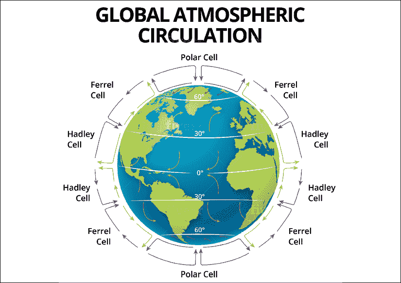

# 10

# 对智慧城市和环境的影响

科技让我们的生活变得更好。然而，许多对我们有益的技术却不幸地对环境有害。我们能在保持现代生活方式的同时走向更可持续的生活方式吗？本章重点关注量子计算和区块链在智能城市和环境用例中的应用，以及这些应用如何引导我们找到一些答案。

我们是地球上最聪明的物种。大自然赋予人类不可思议的体力和脑力。权力越大，责任也越大。当我们开始部署技术和人力资源来改善我们的生活时，必须以可持续的方式进行。我们需要注意这样一个事实，即我们与来自动物和植物王国的朋友分享这个世界。更重要的是，我们必须考虑我们希望我们的后代继承什么样的世界。

社会各阶层的创新需要与我们所生活的世界的长期健康发展相一致。除了科技含量高，智能城市还意味着更绿色的城市。在这一章中，我将介绍如何将技术应用于交通管理、废物管理和气候建模等领域。

# 那么，我为什么要在乎呢？

就在 26 年前，我和一群朋友以及我的老师去参加一个考试。我们去考试中心的交通工具是牛车。这曾经是我在印度泰米尔纳德邦的村子里常见的景象。这个村庄被称为 Melagaram，距离泰米尔纳德邦和喀拉拉邦的边界大约 5 英里，位于西高止山脉的山麓。

曾经有一段时间，我们可以去我们家的阳台，看被称为主瀑布的瀑布。它是印度南部的顶级旅游景点之一，每年 6 月至 8 月，全球各地的人们都会定期前往。这是一个美丽的村庄，我仍然梦想着在“家里”工作，就像在我的村庄里一样。

我度过大部分时光的学校叫希尔顿预科学校。它由魅力非凡的贝尔先生领导；我们都尊敬和热爱的人。我们都有许多关于学校的记忆。它的基地离形成印度最南端两个邦边界的山脉山麓只有一英里远。季风会带来降雨，我们可以从教室的窗户看到我们称之为老瀑布的瀑布。

学校有一个美丽的花园，甚至学校食堂(我们称之为“食堂”)也在花园中间。我们每天早上乘坐校车去学校，途中会经过湖泊、绿地、瀑布、大片茂密的植被和小溪。仔细想想，我的孩子们今天在英国上学，与其说是通勤，不如说是每天的短途旅行。

我们的家离学校几英里远，也有一个绿色社区。我们的房子对面有一个蚁丘，离我们的大门只有一个板球场的距离。我们家周围是绿色的稻田。我们的许多邻居都有奶牛、母鸡和干草堆，我们会整天在那些地里玩耍。

在六月、七月和十一月的雨季，我们会在我们的铅笔盒里收集红色天鹅绒般的小虫子。我在那个村子里一直住到 15 岁，后来我搬到了炎热、潮湿、拥挤和污染严重的钦奈市去上高中。

我几乎把家乡的青山，美丽的风景，温和的细雨当成了理所当然。钦奈对我的系统是一个冲击。我会骑自行车去学校，当我到家时，我必须洗掉额头上的黑色烟灰。在夏季的几个月里，路上的柏油会融化。我知道我已经离开了天堂，去寻找更好的生活。不应该是那样的。

本章将智能城市和环境结合在一起是有原因的。智能城市不仅仅是在我们的城市中安装跟踪市民行为的设备。他们不仅仅是从这些设备中获取数据，并做出实时决策来优化城市的功能。它们也是为了确保一个城市不必为了变得聪明和成熟而失去绿色。

每次我想在社交媒体上分享有趣的内容，我首先会选择环保意识、气候变化和塑料污染。在这些故事中，有人辞去高薪工作，领导清理被塑料污染的海滩，或者开垦数百英亩的林地。这些故事激励着我。

那么，新兴技术对创建智能城市有什么用处呢？最近，我开着我的特斯拉从伦敦希思罗机场到我在肯特的家。乘客座位上有一位朋友，他在过去的几十年里一直是英特尔的工程师。我们正在讨论如果部署在印度道路上，为特斯拉自动驾驶引擎提供动力的人工智能将如何工作。

流量管理是量子计算机的一个很好的用例。这些机器将需要物联网设备的数据和电信提供商的地理空间数据的支持。交通管理是一个重大挑战的新兴经济体已经尝试人工智能来改善交通管理。然而，问题远未解决。

随着世界聚焦于让我们的城市变得更好，确保我们在这个过程中不损害环境是至关重要的。建设智能城市的努力也应该是为了保护环境。气候变化一直是全世界最高层讨论的话题。自然纪录片讲述极地冰川融化及其对野生动物和天气模式的影响。

关于气候变化是否只是我们可能不得不经历的一个周期，或者它是否是人为的，仍然存在争论。有些人认为这只是一个没有足够数据的理论，有些人认为在过去的 10-15 年里，人类造成了很大一部分气候变化。

这是技术可以帮助评估的事情吗？像 PolArctic 这样的初创公司正在模拟北极冰的融化以及导致融化的变量。要得到一个气候变化及其周围变量的综合模型是一项艰巨的任务。量子计算也许是模拟自然如何运作的最佳平台。过去的技术在这项任务上并不成功。在经典计算机中模拟自然或物理要比用量子计算机困难得多。

当我们模拟气候变化时，我们进入了相互依赖的变量领域。在这一章中，我将讨论通过智能城市创新让我们的生活变得更美好，以及通过创新更好地了解自然让我们的世界变得更美好。

# 智慧城市

世界各地的智能城市计划涉及在城市中使用数据采集设备，为城市中的人们提供有针对性的最佳服务。到 2025 年，智能城市市场预计将达到 7000 亿美元至 2.4 万亿美元。很难得到正确的数字，但这是一个跨越发达国家和新兴经济体的巨大全球市场。

有几个智慧城市用例涉及区块链和量子机器学习。本章中我们将涉及的一些领域有:

*   停车
*   交通管理
*   城市规划
*   垃圾收集

## 智能停车

通常，在智能城市项目中，我们看到政府与私营部门密切合作，以交付成果。例如，英国的一项倡议旨在提高停车效率。这个过程包括实时获取车辆数据和停车位。虽然有几个保存停车数据的应用程序，但将它们全部纳入一个中央存储库以提供智能的数据标准却缺失了。

因此，英国政府在 2019 年 5 月发布了一项关于标准化可用停车应用程序数据的公告。这些数据包括停车数据的可用性、许可时间和价格。所有的汽车司机都可以通过一个统一的平台来使用它。来源:[https://www . gov . uk/government/news/uk-on-the-edge-of-revolution-to-make-parking-easy-and-help-British-high-streets](https://www.gov.uk/government/news/uk-on-verge-of-revolution-to-make-parking-easier-and-help-british-high-streets )

此类举措的挑战在于，一个国家的人民正在与政府共享大量个人数据。集中持有此类数据会使数据所有者感到担忧。它为黑客提供了机会，但也让政策制定者可以访问某些类型的数据，公民可能会认为这是对隐私的侵犯。

区块链可以帮助分散这些数据的所有权。即使是一个得到许可的区块链，一个预先商定的实体财团可以充当公共信息的看门人，也可能比一个完全集中的机构要好。一个纯粹主义者可能不想把一个许可分类账称为区块链，但是在我看来，在它能够欣赏纯粹的分散生态系统之前，它需要集中的世界几次迭代升级。

有像**委托利益证明** ( **DPoS** )这样的协议可以让一小组节点验证交易。虽然他们没有更改交易详细信息的权限，但他们可以在网络上签署和广播交易。在 DPoS 协议中，代表由网络通过投票选出。因此，如果有一个节点是不诚实的代表，它可以被网络投票否决。

这些协议可以作为通向分散数据世界的桥梁。然而，我仍然相信即使在目标国家也会有一定程度的中央集权。回到我们的智慧城市例子，区块链的使用，结合良好的元数据管理，可能是数据隐私的未来。英国有 people.io 和 Nuggets.life 这样的公司专注于解决这些数据隐私问题。

虽然智能停车在英国等国家具有重要价值，但该地区的交通管理做得很好。在新兴市场的许多地方，流量管理是一个主要问题。现在让我们来看看技术如何对此有所帮助。

## 交通管理

当我想到交通管理的时候，我脑海中浮现的画面是印度混乱的道路。管理和规范像印度这样的国家的道路是当今技术面临的最大挑战之一。当我 15 年前搬到英国时，我经历了忘记和重新学习驾驶技术的过程。

我现在在英国道路上开车比在印度道路上更舒服。更多才多艺的司机可以舒适地在这两个国家驾驶，但我大脑中的智能引擎却很难做到这一点。人类大脑需要付出巨大的努力来适应在两种截然不同的环境之间转换的复杂性。人工智能达到应对这种情况所需的复杂程度可能还需要一段时间。

然而，这并不是说在这些环境中部署尖端技术就不能提高效率。在我与印度阿姆里塔大学的研究负责人的交谈中，她透露了使用机器学习进行交通管理的研究工作正在进行中。

在我与富士通的讨论中，他们透露，他们受量子启发的数字 Annealers 也解决了交通管理问题。他们在一个仓库配送场景中部署了他们的解决方案，并在确定最佳路线方面实现了 45%的效率。

地理空间数据的应用结合来自传感器和雷达的数据可以帮助有效地管理交通。由于移动电话在世界各地的渗透，来自移动塔的地理空间数据在世界大部分地区都可以获得。使用这些数据可以实现对拥挤的主动识别。历史数据的模式也可以预测交通堵塞的概率。

虽然使用这些数据可以更容易地识别城市中某个地方的拥挤情况，但在拥挤之前进行预测却很难。雷达部署在新兴市场，用于识别交通枢纽的拥挤情况，然而，由于硬件成本以及实时捕获和传输大量数据的挑战，它们不可扩展。在印度，一个雷达传感器的成本可能高达 40，000 英镑，这使得它无法广泛部署。

交通摄像头结合图像识别算法可以识别拥挤的路口。当与无人机结合使用时，这在交通堵塞的实时管理中是有用的。然而，智能城市必须朝着交通拥堵的预测建模和确定解决方案的方向发展。

最近在印度钦奈进行的一项实验中，有 64 台摄像机架设在城市的繁华地段。一天之内，约有 90，000 名违反交通规则者被查出并被罚款。已确认的违规行为包括逆向行驶、禁止入内违规、跳跃信号和三重骑行。这表明，即使在小规模和有限的规模上实施这种控制，也能提高效率。

地理空间数据可以识别交通流量。这些数据有助于模拟有多少人在一天中的什么时间从城镇的一个地方开车到另一个地方。这些数据中的模式可以被捕获。然而，更难建模的行为点是城市某个地方的交通流量增加、事故或路障如何影响城市其他地方的交通。这就是量子退火机的用武之地。

在量子退火过程中，优化所需的信息被输入到物理系统中。在量子 annealer 上对交通管理问题建模与旅行推销员问题非常相似，正如在*第 2 章*、*量子计算–关键讨论点*中所讨论的。量子系统是由这个问题的许多可能的解叠加而成的。不同的可能解决方案的概率通过退火过程演变。

随着退火过程的进行，较低能量的选项成为问题的可能解决方案。由系统基态确定的解的概率最高。这个过程使用的哈密顿函数管理系统能级的信息。

在繁忙的城市里，交通管理有两个方面需要考虑。一个是正在发生的交通堵塞以及它们是如何解决的，第二个是预测交通堵塞的发生。实时数据捕捉可以将资源分配到交通堵塞的区域。

预测交通堵塞的能力可以更有效地规划道路工程、事故管理和城市交通管理。随着自动驾驶汽车开始成为主流，管理交通的集成基础设施变得越来越重要。

## 城市规划

在世界的许多地方，城市规划和治理是由管理城市的市政委员会和公共部门机构来执行的。我们将触及的过程包括理解新建筑、立交桥、公园和道路对市民生活的影响。

新建筑、公园和道路基础设施是快速发展的城市的重要组成部分。然而，它们也会影响城市的碳足迹、排水基础设施、雨水管理和交通控制。地理空间数据与 3D 建模技术相结合，对于优化城市空间的使用以造福市民是必不可少的。

## 废物收集

随着自动化接管世界，一些公司正在进行研究，以确定其对工作的影响。根据普华永道公司最近的一份报告，英国的废物管理行业预计受自动化的影响最大。如下图所示，该行业超过 62%的工作面临被机器取代的风险。

图 1:预测工作因自动化而面临风险的数字来源:[https://www . PwC . co . uk/economic-services/ukeo/pwcukeo-section-4-automation-March-2017-v2 . pdf](https://www.pwc.co.uk/economic-services/ukeo/pwcukeo-section-4-automation-march-2017-v2.pdf)

我会以不同的方式解读前面关于废物管理行业的统计数据。这一高比例向我们表明，通过一点点智能自动化，废物管理行业可以获得许多效率。本次讨论的重点是废物收集流程。

目前的垃圾收集过程包括卡车穿过城镇的每一条街道，从垃圾箱中收集垃圾。在英国，已经对装有传感器的垃圾箱进行了试点测试。这些传感器可以提供垃圾箱有多满的信息，以便只需要收集更满的垃圾箱。垃圾箱上的传感器也可以在装满时发出警报。

英国 Rugby Borough Council 的一个试点项目使用太阳能智能垃圾箱，帮助将垃圾收集量从每年 51，000 个减少到 1，509 个。随着这一过程成为主流，可能会有进一步的效率。例如，quantum annealers 可以通知垃圾收集车收集垃圾的最快方法。

从可持续发展的角度来看，传感器会告知议会哪些家庭的垃圾量最低。议会可以有聪明的税收系统，为垃圾量最低的家庭提供退税。我们可以更进一步，找出丢弃塑料最多的家庭，并为此向他们征收更多的税。随着物联网成为主流，量子计算的应用可以帮助实现大规模影响。

# 气候建模

除了少数对气候变化持怀疑态度的人，大多数人都意识到气候变化是一个重要的现象，我们不能再忽视它了。根据世界野生动物联盟 ( **WWF** )的数据，地球每年失去 1870 万英亩森林，相当于每分钟 27 个足球场。这是一个严重的问题，因为森林是碳汇，因为树木吸收和储存二氧化碳。

有一种假设认为气候变化或全球变暖是一个周期性事件。自上一个冰川期以来，在 10，000 年的时间里，全球气温上升了 3 到 8 摄氏度。当前科学界的共识是，人类活动导致的碳排放是加速这一气候变化周期的重要因素。政府间气候变化委员会(T2)的研究已经确认最近的气候变化有 90%的可能性与人类活动有关。来源:[https://www.ipcc.ch/](https://www.ipcc.ch/ )

在过去的 200 年里，碳排放和气温升高也被记录在案，并被发现密切相关。这种排放很有可能是气温上升的原因，因为二氧化碳(CO 2 等温室气体被认为会将热量截留在大气中，导致全球气温上升。参考:【https://www.nature.com/articles/srep21691 T2】

然而，这并不都是悲观的。大自然有奇特的方法让生命从灾难中重生。最近有一篇关于乌克兰切尔诺贝利的文章让我充满了希望。三十年前发生的切尔诺贝利事故非常严重，以至于“切尔诺贝利”一词现在成了灾难的同义词。1986 年，切尔诺贝利的核反应堆突然释放出大量能量。随后，放射性污染在空气中传播了几天。事故死亡人数估计有数千人。

自从灾难袭击了当时的苏联地区，2600 平方公里的土地已经被废弃。然而，三十年后，植物和动物又回到了切尔诺贝利。最近一篇关于该地区生态系统复苏的文章描述了植物是如何适应甚至是放射性环境的。《商业内幕》的文章指出，与 1986 年的灾难之前相比，切尔诺贝利现在有更好的植物和动物生活。来源:[https://www . business insider . com/Chernobyl-exclusion-zone-animal-refuge-2019-5？r =美国& IR=T](https://www.businessinsider.com/chernobyl-exclusion-zone-animal-refuge-2019-5?r=US&IR=T )

这表明，如果系统地努力恢复我们已经失去的森林，气候变化的影响是可以逆转的。恢复森林需要几十年的时间。因此，当务之急是我们在技术的帮助下解决气候变化问题。虽然长期的重新造林努力提供了一个有希望的缓解方案，但我们还需要能够管理我们目前在世界各地经历的极端气候。有效管理气候变化需要双管齐下的方法。

有两个关键领域的气候变化建模技术可以帮助促进:

1.  量子退火和机器学习可以帮助我们预测世界各地的空间和时间气候条件，使我们能够预测和管理世界各地的极端天气事件。

1.  量子计算可以帮助我们识别和量化最具影响力的气候变化驱动因素，进而为全球缓解方案提供信息。

第一个是战术演习，可以帮助我们预测、监控和管理世界各地的极端天气模式。第二个是更具战略性和实验性的方法，我们确定人类必须接受的关键生活方式变化，以长期应对气候变化。

理解气候变化需要几个变量的数据——这些已知的变量会影响一个地区的气候条件。它们是:

*   生物地理学
*   大气环流
*   海洋环流
*   地球的倾斜

## 生物地理学

生物地理学是指植物和动物在地球上的分布。正如我们之前讨论的，土地、冰、植物和动物的最佳组合至关重要。当冰层太厚时，植物和动物会争夺土地，就像冰河时期一样。冰河时期的气候变化将猛犸象和剑齿虎等物种推向灭绝。然而，我们更可能遇到的气候变化是冰的融化。这可能会导致生活在极地地区的动物灭绝。

动物物种的灭绝影响了地球的植被模式，进而影响了气候模式。有一些例子表明，将某些动物如海狸引入生态系统会改变一个地区的自然景观和气候模式。这种现象被称为“反馈回路”海狸影响溪流和河流的流动，进而影响植被。随着植被模式的改变，新的动物物种到来，进一步影响了景观和生活的平衡。来源:https://www.nature.com/articles/nature10574

因此，了解一个地区、一个大陆甚至一个星球的生物地理学如何影响数千年来的气候模式是至关重要的。动物、植物、景观和气候模式的进化之间有着内在的相互依赖关系。这种环境被称为“开放系统”；由于我们无法控制系统中的变量，以及变量之间相互影响的趋势，这些系统非常复杂。这些属性使得经典计算机(实际上还有气候科学家)很难对这些行为进行建模。

## 大气环流

地球大气中的空气运动始于赤道。赤道的高温导致空气上升。随着空气上升，它变得更冷，并导致冷凝，导致降雨。这是一个影响全球天气和植被模式的重要现象。当空气从高气压区移动到低气压区时，它创造了世界上干燥和潮湿的区域。

从赤道到南北纬 30 度的空气运动是造成沙漠的原因。由于空气中的水分很少，地球的这一部分降雨量较少。这个区域被称为哈德利细胞。如下图所示，每个区域都有特定的空气流动模式，并以不同的方式命名。空气的运动创造了一个蒸发、凝结和降水的循环，影响着世界各地的天气模式。

图 2:全球大气环流图解

## 洋流

洋流对全世界的天气模式都有影响。海洋中的温度以三维模式流动，即从东到西，从北到南，从表面到深处。热带海洋的风从东向西吹。因此，陆地的沿海地区从东到西有一个温度梯度。例如，太平洋西部比东部高 8℃。

然而，随着信风减弱，温暖的海水由于重力而向东移动。当这种温暖的天气模式向东移动到南美洲的沿海地区时，我们就会看到厄尔尼诺效应。

厄尔尼诺现象导致南美西北部气温升高。由于海洋表面最温暖的部分产生最多的蒸发，我们看到热带风暴也向东移动。这影响了全球的天气模式。厄尔尼诺效应每隔几年发生一次，科学家还无法准确预测。

## 地球的倾斜

地球的倾斜对风的大气环流有影响。由于倾斜，表面上的空气被偏转。在北半球，被偏转的空气流向其初始轨迹的右侧，在南半球则相反。地球绕太阳公转产生了气候循环。

这些周期长达 10 万年。在这些周期中，地球的倾斜度从 21.5 度变化到 24.5 度。由于倾斜会影响太阳辐射、洋流和大气环流，因此对气候循环有着显著的影响。

## 量子计算解决方案

如前所述，由于有几个相互依赖的变量影响着地球的气候，因此很难使用经典的计算方法来有意义地模拟气候模式。量子计算机应该有能力处理模拟气候变化所需的数据。第一步需要最终确定气候变化是由人类活动引起的。

2019 年 1 月，埃克森美孚与 IBM 的量子计算能力合作进行环境建模。量子计算机可以更好地模拟自然，因为自然实际上是量子力学的。要在经典计算机中做到这一点，需要先将物理学转化为计算机科学，然后再将其加载到计算机中。在量子计算机中，物理以其自然状态被编码。没有翻译，因此在这个过程中没有信息丢失。因此，用量子计算机模拟它的行为应该更准确。

在我最近与一位物理学家的谈话中，他提到量子计算机应该是建模物理的伟大工具。除了量子计算机处理能力的提高，如果利用得当，它模仿自然的事实可以更好地模拟自然的行为。

南加州大学也在利用量子计算机解决气候变化的难题。随着量子机器学习和退火过程成为主流，我们将每天使用几种解决方案来了解我们对环境的影响。我们将能够更好地预测天气状况，更有效地应对极端天气。

# 结论

量子机器学习和退火技术在智能城市和气候建模中的应用仍处于非常早期的阶段。与金融服务和医疗保健应用相比，这些应用仍然远远落后。虽然新兴技术的智能城市应用或许可以等待，但我们必须对气候变化有一个明确的理解。

气候变化的新影响也许是影响我们生活和后代生活的一些最重要的现象。决策者必须利用量子计算机等技术来推动最高层的决策。自上而下应对气候变化的方法将帮助我们作为公民应对人类活动对我们星球的长期影响。

到目前为止，我们已经介绍了量子计算在医疗保健、金融服务和智能城市领域的应用。在接下来的章节中，我们将着眼于它在物流中的应用，物流正在与一些使用经典计算机难以解决的问题进行斗争。我们还将研究抗量子账本，区块链社区可以使用它来做好量子准备。