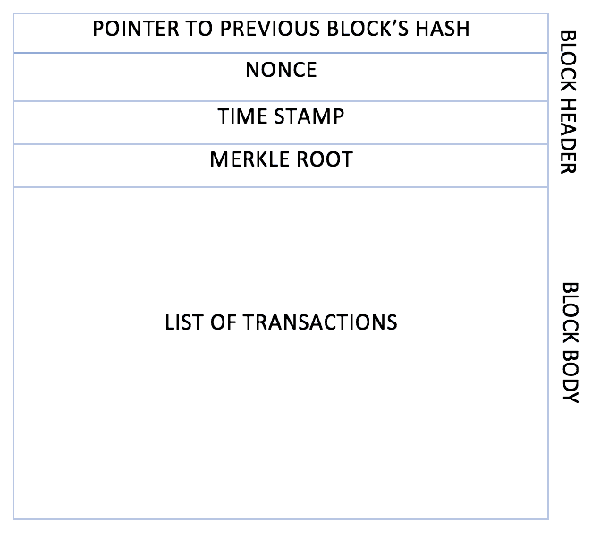

# 区块链 101

如果你正在读这本书，很可能你已经听说过区块链，并对其巨大的潜力有了一些基本的了解。如果不是，那么让我告诉你，这是一项承诺积极改变几乎所有行业现有模式的技术，包括但不限于 IT、金融、政府、媒体、医疗和法律。

本章介绍了区块链技术、它的技术基础、它背后的理论以及各种技术，这些技术结合在一起构成了今天的区块链。

在这一章中，我们首先描述分布式系统的理论基础。接下来，我们将讨论比特币的前身，区块链技术正是通过它被介绍给世界的。最后，我们向您介绍区块链技术。这种方法是理解区块链技术的逻辑方式，因为区块链的根源在于分布式系统。我们将在这里快速地涉及很多内容，但是不要担心——当你浏览这本书的时候，我们将会更详细地浏览大量的材料。

# 区块链技术的发展

随着 2008 年比特币的发明，世界被引入了一个新概念，这个新概念现在可能会彻底改变整个社会。它有望对每个行业产生影响，包括但不限于金融部门、政府、媒体、法律和艺术。一些人将区块链描述为一场革命，而另一派思想认为它将是更进化的，并且在区块链的任何实际利益开花结果之前将需要许多年。这种思维在某种程度上是正确的，但在我看来，革命已经开始了。

世界各地的许多著名组织已经在使用区块链技术编写概念证明，因为它的颠覆性潜力现在已经得到了充分的认可。然而，一些组织仍处于初步探索阶段，尽管随着技术的成熟，他们有望进步得更快。这是一种对现有技术也有影响的技术，并且有能力从根本上改变它们。

如果我们看看过去几年，我们注意到在 2013 年开始出现一些想法，建议在加密货币以外的其他领域使用区块链。大约在那个时候，区块链的主要用途是加密货币，在此期间出现了许多新的硬币。下图显示了区块链技术的年度进展和适应趋势。轴上显示的年份表示区块链技术的特定阶段所处的时间范围。每个阶段都有一个代表行动的名称，显示在 *x* 轴上，从**想法&思想**到最终**成熟&进一步标准化**的时期开始。 *y* 轴显示了区块链技术的活动、参与和采用水平。图表显示，最终，大约在 **2025** 左右，区块链技术有望成熟，拥有大量用户。

区块链技术的采用和成熟

上图显示，2013 年出现的**想法&想法**与加密货币之外的区块链技术的其他用途有关。然后在 2014 年，一些**研究&实验**开始，这导致了**概念验证**、**进一步研究**，以及 2015 年至 2017 年间的全面**试验项目**。2018 年，我们将看到**现实世界的实施**。许多项目正在进行中，并准备取代现有系统，例如，**澳大利亚证券交易所** ( **ASX** )即将成为第一个用区块链技术取代其遗留清算和结算系统的组织。

关于这个话题的更多信息可以在[https://www.asx.com.au/services/chess-replacement.htm](https://www.asx.com.au/services/chess-replacement.htm)找到。

预计在 2019 年期间，将开展更多的研究，同时对区块链技术的监管和标准化产生一些兴趣。在此之后，利用区块链技术的生产就绪项目和现成产品将从 2020 年开始提供，到 2021 年，区块链技术的主流使用预计将开始。区块链技术的进步几乎就像是 20 世纪 90 年代末的互联网泡沫。随着区块链技术的适应和进一步成熟，预计将继续进行更多的研究，最终，预计在 2025 年，该技术将足够成熟，可用于日常生活。请注意，图表中提供的时间表并不严格，可能会有所不同，因为很难准确预测区块链技术何时会成熟。该图表基于近年来取得的进展以及当前对该技术的研究、兴趣和热情，表明到 2025 年区块链技术有望成熟。

在过去的几年里，人们对区块链技术的兴趣显著增加。从加密货币的角度来看，区块链曾经被认为是简单的极客货币，或者被认为是不值得追求的东西，现在它正在被世界上最大的公司和组织研究。数百万美元正被用于改造和试验这项技术。这从欧盟最近采取的行动中可以明显看出，他们宣布计划到 2020 年将区块链研究的资金增加到近 3.4 亿欧元。

感兴趣的读者可以在 https://www . Irish times . com/business/technology/boost-for-区块链研究-as-eu-increases-funding-four-fold-1.3383340 了解更多信息。

另一份报告显示，到 2021 年，全球在区块链技术研究上的支出可能达到 92 亿美元。

关于这一点的更多信息可以在[https://bitcoinmagazine . com/articles/report-suggests-global-spending-区块链-tech-could-reach-920 亿-2021/](https://bitcoinmagazine.com/articles/report-suggests-global-spending-blockchain-tech-could-reach-92-billion-2021/) 找到。

有**企业以太坊联盟** ( **EEA** )、 **Hyperledger** 、 **R3** 等各种财团，成立了区块链技术的研发。此外，大量初创企业已经在提供基于区块链的解决方案。在谷歌上简单地搜索一下趋势，就能发现过去几年人们对区块链技术的巨大兴趣。特别是，自 2017 年初以来，搜索词*区块链*的增长相当显著，如下图所示:

区块链的谷歌趋势图

这种技术的各种好处是可以预见的，例如分散的信任、成本节约、透明度和效率。然而，还有许多挑战也是区块链积极研究的领域，比如可伸缩性和隐私。

在本书中，我们将了解区块链技术如何带来前面提到的好处。您将了解什么是真正的区块链技术，以及它如何通过带来效率、成本节约、透明度和安全性等诸多好处来重塑企业、多个行业乃至日常生活。我们还将探讨什么是分布式账本技术、去中心化和智能合约，以及如何使用以太坊和 Hyperledger 等主流区块链平台开发和实施技术解决方案。我们还将调查在区块链成为主流技术之前需要解决哪些挑战。

[第 16 章](16.html)、*可扩展性和其他挑战*，专门讨论区块链技术的局限性和挑战。

# 分布式系统

理解分布式系统对于理解区块链技术至关重要，因为区块链在本质上是一个分布式系统。它是一个分布式分类账，可以是集中式的，也可以是分散式的。区块链最初旨在并且通常被用作一个分散的平台。它可以被认为是一个具有分散和分布式范例属性的系统。这是一个分散-分布式系统。

**分布式系统**是一种计算模式，通过这种模式，两个或多个节点以协调的方式相互协作，以实现共同的结果。它的建模方式使最终用户将它视为一个单一的逻辑平台。例如，谷歌的搜索引擎是基于一个大型分布式系统，但对用户来说，它看起来像一个单一的，连贯的平台。

一个**节点**可以被定义为分布式系统中的一个个体玩家。所有节点都能够相互发送和接收消息。节点可以是诚实的、有缺陷的或恶意的，它们有内存和处理器。表现出非理性行为的节点也被称为**拜占庭节点**，源自拜占庭将军问题。

拜占庭将军问题

1982 年，兰波特和其他人在他们的研究论文*中提出了一个思想实验，拜占庭将军问题*可在[找到:https://www . Microsoft . com/en-us/research/publication/Byzantine-Generals-Problem/](https://www.microsoft.com/en-us/research/publication/byzantine-generals-problem/)一群带领拜占庭军队不同部分的军队将军计划进攻或从一座城市撤退。他们之间唯一的交流方式是通过信使。他们需要同意同时罢工才能赢。问题是，一个或多个将军可能是叛徒，他们可能会发出误导性的信息。因此，需要一个可行的机制，允许将军们达成一致意见，即使在背信弃义的将军们在场的情况下，以便攻击仍然可以同时进行。作为分布式系统的类比，将军可以被认为是节点，叛徒是拜占庭(恶意)节点，而信使可以被认为是将军之间的通信通道。这个问题在 1999 年由 Castro 和 Liskov 解决，他们提出了实用拜占庭容错算法，在收到一定数量的包含相同签名内容的消息后达成共识。

拜占庭节点的这种不一致行为可能是故意恶意的，这对网络的运行是有害的。网络上节点的任何意外行为，无论是否恶意，都可以归类为拜占庭行为。

下图显示了分布式系统的一个小规模示例。这个分布式系统有六个节点，其中一个( **N4** )是拜占庭节点，可能导致数据不一致。 **L2** 是一条断开或缓慢的链路，这可能会导致网络分区。

设计一个分布式系统:N4 是一个拜占庭节点，L2 坏了或者是一个慢速网络链接

分布式系统设计的主要挑战是节点间的协调和容错。即使一些节点出现故障或网络链接中断，分布式系统也应该能够容忍这种情况，并继续工作以达到预期的结果。这个问题多年来一直是分布式系统设计研究的活跃领域，并且已经提出了几种算法和机制来克服这些问题。

分布式系统的设计如此具有挑战性，以至于一个被称为 **CAP 定理**的假设已经被证明，该假设认为分布式系统不可能同时拥有所有这三个非常需要的特性；即一致性、可用性和分区容差。我们将在本章后面更详细地探讨 CAP 定理。

# 区块链和比特币的历史

区块链是随着 2008 年比特币的发明而引入的。其实际实施发生在 2009 年。出于本章的目的，简单回顾一下比特币就足够了，因为它将在第 8 章、*介绍比特币*中进行深入探讨。然而，提到比特币是必要的，因为没有比特币，区块链的历史就不完整。

# 电子现金

电子现金或数字货币的概念并不新鲜。自 20 世纪 80 年代以来，基于 David Chaum 提出的模型的电子现金协议已经存在。

正如理解分布式系统的概念是理解区块链技术的必要条件一样，电子现金的概念对于理解区块链、比特币或更广泛的加密货币的首次惊人成功的应用也是必不可少的。

需要解决两个基本的电子现金系统问题:责任性和匿名性。

**责任**要求确保现金只能消费一次(双重消费问题),并且只能由合法所有者消费。当同样的钱可以花两次时，就会出现双重花费的问题。由于复制数字数据非常容易，这在数字货币中成为一个大问题，因为你可以复制许多相同的数字货币。**要求匿名**以保护用户隐私。与实物现金一样，几乎不可能追溯到实际支付这笔钱的个人。

大卫·乔姆在 20 世纪 80 年代的工作中通过使用两种密码操作解决了这两个问题，即**盲签名**和**秘密共享**。这些术语和相关概念将在[第五章](05.html)、*对称密码*和[第六章](06.html)、*公钥密码*中详细讨论。目前，说*盲签名*允许在没有实际看到文档的情况下签署该文档就足够了，并且*秘密共享*是一个能够检测双重消费的概念，即使用同一个电子现金令牌两次(双重消费)。

2009 年，第一个名为比特币的电子现金(e-cash)系统的实际应用出现了。后来出现了加密货币这个术语。它第一次解决了不可信网络中的分布式共识问题。它使用**公钥加密**和**工作证明** ( **PoW** )机制来提供一种安全、可控和分散的铸造数字货币的方法。关键的创新是由事务组成的有序块列表的想法，并通过 PoW 机制进行加密保护。这个概念将在[第 8 章](08.html)、*介绍比特币*中进行更详细的解释。

比特币中使用的其他技术在发明之前就已经存在，包括 Merkle 树、哈希函数和哈希链。所有这些概念在[第 6 章](06.html)、*公钥密码学*中有适当的深度解释。

纵观前面提到的所有技术及其相关历史，很容易看出电子现金方案和分布式系统的概念是如何结合起来创造比特币以及现在所谓的区块链的。这个概念也可以借助下图来形象化:

支持比特币和区块链发明的各种想法

# 区块链

2008 年，以笔名*中本聪*撰写了一篇题为*比特币:一个点对点电子现金系统*的开创性论文，主题是点对点电子现金。它引入了术语**区块链**。没有人知道中本聪的真实身份。在 2009 年推出比特币后，他一直活跃在比特币开发者社区，直到 2011 年。然后他把比特币的开发交给了它的核心开发者，然后就消失了。从那以后，再也没有他的任何消息，他的存在和身份都笼罩在神秘之中。术语*区块链*经过多年演变成了单词*区块链*。

如前所述，区块链技术融合了多种应用，可在各种经济部门实施。特别是在金融部门，金融交易和结算性能的显著改善被视为可带来所需的时间和成本降低。可以说，几乎所有经济部门都已经认识到区块链的潜力和前景，并且已经开始或很快将开始利用区块链技术的好处。

# 区块链定义

**Layman's definition**: Blockchain is an ever-growing, secure, shared record keeping system in which each user of the data holds a copy of the records, which can only be updated if all parties involved in a transaction agree to update.
**Technical definition**: Blockchain is a peer-to-peer, distributed ledger that is cryptographically-secure, append-only, immutable (extremely hard to change), and updateable only via consensus or agreement among peers.

现在让我们更详细地检查一下前面的定义。我们将逐一查看定义中的所有关键词。

# 点对点

技术定义中的第一个关键词是*点对点*。这意味着网络中没有中央控制器，所有参与者直接相互对话。该属性允许在对等体之间直接交换现金交易，而不需要第三方(例如银行)的参与。

# 分布式分类帐

剖析技术定义进一步揭示，区块链是一个*分布式账本*，简单来说就是一个账本在网络中的所有对等体中遍布，每个对等体持有一份完整账本的副本。

# 密码安全的

接下来，我们看到这个分类帐是*密码安全的*，这意味着密码已被用来提供安全服务，使这个分类帐安全，防止篡改和滥用。这些服务包括不可否认性、数据完整性和数据源认证。稍后你会在[第 5 章](05.html)、*对称加密*中看到这是如何实现的，其中介绍了密码学的迷人世界。

# 仅附加

我们遇到的另一个属性是区块链是*仅追加*，这意味着数据只能以*的时间顺序顺序*添加到区块链中。这一特性意味着，一旦数据被添加到区块链中，就几乎不可能更改该数据，并且可以认为该数据实际上是不可变的。尽管如此，它可以在罕见的情况下改变，其中针对区块链网络的共谋成功获得超过 51%的权力。一旦数据被添加，可能会有一些合法的理由来更改区块链中的数据，例如*被遗忘的权利*或*被擦除的权利*(也在**一般数据保护**(**https://gdpr-info.eu/art-17-gdpr/**)裁决[中定义)。](https://gdpr-info.eu/art-17-gdpr/)

然而，这些都是需要单独处理的个案，需要一个优雅的技术解决方案。实际上，区块链确实是不可改变的，不能被改变。

# 可通过共识更新

最后，区块链最重要的属性是它只能通过一致同意来更新。这就是赋予它权力下放的原因。在这种情况下，没有中央机构控制分类帐的更新。相反，对区块链的任何更新都是对照由区块链协议定义的严格标准来验证的，并且只有在网络上所有参与的对等体/节点之间达成共识之后才被添加到区块链。为了达成共识，有各种共识促进算法来确保所有各方对区块链网络上的数据的最终状态达成一致，并坚决同意它是真实的。共识算法将在本章的后面和整本书中适当地讨论。

区块链可以被认为是运行在互联网之上的分布式对等网络的一层，如下图所示。它类似于运行在 TCP/IP 之上的 SMTP、HTTP 或 FTP。

区块链的网络视图

在上图的底层是 internet，它为任何网络提供了基本的通信层。在这种情况下，一个对等网络运行在 internet 之上，internet 承载着另一层区块链。该层包含事务、块、共识机制、状态机和区块链智能合约。所有这些组件都显示为一个方框中的单个逻辑实体，代表对等网络之上的区块链。最后，在顶部，有连接到区块链的用户或节点，它们执行各种操作，如共识、事务验证和处理。这些概念将在本书后面详细讨论。

从商业角度来看，区块链可以被定义为一个平台，在该平台上，对等方可以使用交易来交换价值/电子现金，而不需要中央信任的仲裁人。例如，对于现金转账，银行充当可信的第三方。在金融交易中，中央清算所充当交易双方的仲裁人。这个概念是引人注目的，一旦你吸收了它，你就会意识到区块链技术的巨大潜力。这种非中介化使区块链成为一种分散的共识机制，没有单一的权威机构负责数据库。很快，你会看到分散化的一个显著好处，因为如果不需要银行或中央结算所，那么它会立即带来成本节约、更快的交易速度和信任。

一个**块**仅仅是被捆绑在一起并被逻辑组织的事务的选择。**交易**是一个事件的记录，例如，将现金从汇款人账户转移到收款人账户的事件。一个块由多个事务组成，其大小取决于所使用的区块链的类型和设计。

对前一个块的引用也包括在该块中，除非它是一个起源块。一个**创世纪区块**是区块链第一个硬编码的区块，在区块链第一次启动的时候。砌块的结构还取决于区块链的类型和设计。然而，通常只有几个属性对于块的功能是必不可少的:块头，它由指向前一个块的指针、时间戳、nonce、Merkle 根和包含事务的块体组成。块中还有其他属性，但通常，上述组件在块中总是可用的。

一个 **nonce** 是一个只产生和使用一次的数字。随机数广泛用于许多加密操作中，以提供重放保护、认证和加密。在区块链，它用于 PoW 共识算法和事务重放保护。

Merkle 根是 Merkle 树的所有节点的散列。Merkle 树被广泛用于安全有效地验证大型数据结构。在区块链世界中，Merkle 树通常用于高效地验证交易。区块链中的 Merkle root 出现在块的块头部分，块头部分是块中所有事务的散列。这意味着只需要验证 Merkle 根来验证 Merkle 树中存在的所有事务，而不是逐一验证所有事务。我们将在[第 6 章](06.html)、*公钥密码*中进一步阐述这些概念。

块的一般结构。

上述结构是一个简单的框图，描述了一个模块。与区块链技术相关的特定块结构将在本书后面更深入的技术细节中讨论。

# 区块链的一般元素

现在，让我们浏览一下区块链的一般元素。如果你需要一个关于区块链不同地区的提示，你可以把它作为一个方便的参考部分。更精确的元素将在后面的章节中讨论它们各自的区块链，例如以太坊区块链。一般区块链的结构可以借助下图进行可视化:

区块链的一般结构

这里将逐一描述通用区块链的元素。这些是你会遇到的与区块链有关的元素:

*   **地址**:地址是区块链交易中用来表示发送方和接收方的唯一标识符。一个地址通常是一个公钥或者从一个公钥派生出来。虽然地址可以由同一用户重复使用，但地址本身是唯一的。然而，在实践中，单个用户可能不会再次使用相同的地址并为每次交易生成新的地址。这个新创建的地址将是唯一的。事实上，比特币是一个假名系统。最终用户通常无法直接识别，但一些消除比特币用户匿名性的研究表明，他们可以被成功识别。一个好的做法是让用户为每笔交易生成一个新地址，以避免将交易与共同所有人联系起来，从而防止识别。
*   **交易**:交易是区块链的基本单位。交易代表从一个地址到另一个地址的价值转移。
*   **Block** :一个 Block 由多个事务和其他元素组成，比如前一个 block hash (hash 指针)、timestamp、nonce。
*   **对等网络**:顾名思义，对等网络是一种网络拓扑，其中所有的对等点都可以相互通信并发送和接收消息。
*   **脚本或编程语言**:脚本或程序对交易执行各种操作，以方便各种功能。例如，在比特币中，交易脚本是用一种叫做**脚本**的语言预定义的，它由允许节点将令牌从一个地址转移到另一个地址的命令集组成。然而，脚本是一种有限的语言，它只允许执行事务所必需的基本操作，但不允许任意的程序开发。可以把它想象成一个只支持标准预编程算术运算的计算器。同样，比特币脚本语言不能被称为*图灵全集*。简单来说，图灵完全语言意味着它可以执行任何计算。它是以艾伦·图灵命名的，他提出了图灵机的概念，可以运行任何复杂的算法。图灵完整语言需要循环和分支能力来执行复杂的计算。因此，比特币的脚本语言不是图灵完全，而以太坊的 Solidity 语言是。

为了便于在区块链上进行任意程序开发，需要图灵完全编程语言，它现在是区块链的一个非常可取的特性。把它想象成一台允许使用编程语言开发任何程序的计算机。然而，这种语言的安全性是一个至关重要的问题，也是一个基本的和正在进行的研究领域。我们将在本书后面的[第 8 章](08.html)、*介绍比特币*、[第 4 章](04.html)、*智能合约*和[第 11 章](11.html)、*开发工具和框架*中更详细地讨论这一点。

*   **虚拟机**:这是前面介绍的事务脚本的扩展。一个*虚拟机*允许图灵完整的代码在区块链上运行(作为智能合约)；而事务脚本在其操作中受到限制。但是，虚拟机并非在所有区块链上都可用。各种区块链使用虚拟机运行程序如**以太坊虚拟机**(**EVM**)**链式虚拟机** ( **CVM** )。EVM 用于以太坊区块链，而 CVM 是为一个名为**链芯**的企业级区块链开发并使用的虚拟机。
*   **状态机**:区块链可以被视为一种状态转换机制，通过该机制，作为事务执行、确认和终结过程的结果，区块链网络上的节点将状态从其初始形式修改为下一种形式，并最终修改为最终形式。
*   **节点**:区块链网络中的一个节点根据它所承担的角色执行各种功能。节点可以提议和验证事务，并执行挖掘以促进共识并保护区块链。这个目标是通过遵循**共识协议**(最常见的是 PoW)来实现的。根据使用的区块链类型和分配给节点的角色，节点还可以执行其他功能，如简单的支付验证(轻量级节点)、验证和许多其他功能。节点还执行事务签名功能。交易首先由节点创建，然后也由节点使用私钥进行数字签名，以证明它们是希望转移给区块链网络上的其他人的资产的合法所有者。这种资产通常是代币或虚拟货币，如比特币，但也可以是通过使用代币在区块链上表示的任何真实世界的资产。

*   **智能合约**:这些程序运行在区块链之上，封装了在满足特定条件时要执行的业务逻辑。这些程序是可强制执行和自动执行的。智能合约功能并非在所有区块链平台上都可用，但由于它为区块链应用程序提供的灵活性和强大功能，它现在正成为一个非常受欢迎的功能。智能合同有许多用例，包括但不限于身份管理、资本市场、贸易融资、记录管理、保险和电子政务。智能合同将在[第 4 章](04.html)、*智能合同*中详细讨论。

# 区块链是如何运作的

我们现在已经定义和描述了区块链。现在让我们看看区块链实际上是如何工作的。节点要么是创建新区块和铸造加密货币(硬币)的*矿工*，要么是验证和数字签名交易的*区块签名者*。每个区块链网络必须做出的一个关键决定是，找出哪个节点将把下一个块附加到区块链。这个决定是使用*共识机制*做出的。共识机制将在本章后面介绍。

现在，我们将了解区块链如何验证事务，以及如何创建和添加块来扩大区块链。

# 区块链是如何积累积木的

现在我们来看看创建块的一般方案。此处提供的方案旨在让您大致了解块是如何生成的，以及事务和块之间的关系是什么:

1.  节点通过首先创建事务，然后用其私钥对其进行数字签名来启动事务。一个事务可以代表区块链中的各种操作。最常见的是，这是一种数据结构，表示区块链网络上用户之间的价值转移。交易数据结构通常由一些价值转移逻辑、相关规则、源地址和目的地址以及其他验证信息组成。这将在本书后面关于比特币和以太坊的具体章节中详细介绍。
2.  通过使用称为 Gossip 协议的洪泛协议，将事务传播(洪泛)到基于预设标准验证事务的对等方。通常，需要不止一个节点来验证事务。

3.  一旦事务被验证，它就被包含在一个块中，然后被传播到网络上。此时，交易被视为已确认。
4.  新创建的块现在成为分类帐的一部分，下一个块以加密方式将自身链接回该块。这个链接是一个散列指针。在这个阶段，事务得到第二次确认，块得到第一次确认。
5.  然后，每次创建新块时，都会重新确认交易。通常，比特币网络中需要六次确认才能认为交易是最终的。

值得注意的是，步骤 4 和 5 被认为是非强制性的，因为交易本身在步骤 3 中完成；然而，如果需要的话，在步骤 4 和步骤 5 中执行块确认和进一步的交易再确认。

这就完成了对区块链的基本介绍。在下一节中，您将了解这项技术的优点和局限性。

# 区块链的优点和局限性

区块链技术的众多优势已经在许多行业进行了讨论，并由世界各地参与区块链空间的思想领袖提出。区块链技术的显著优势如下:

*   **权力下放**:这是区块链的核心理念和优势。不需要可信的第三方或中介来验证交易；相反，共识机制用于就交易的有效性达成一致。
*   透明和信任:因为区块链是共享的，每个人都可以看到区块链上的内容，这使得系统是透明的。这样一来，信任就建立了。这在资金或福利支出等需要限制选择受益人的个人酌处权的情况下更有意义。
*   **不变性**:数据一旦写入区块链，就极难再改回来。它不是真正不可变的，但是因为改变数据是如此具有挑战性，几乎是不可能的，这被视为维护不可变的事务分类帐的一个好处。
*   **高可用性**:由于系统基于对等网络中的数千个节点，并且数据在每个节点上复制和更新，因此系统变得高度可用。即使一些节点离开网络或变得不可访问，网络作为一个整体仍继续工作，从而使其高度可用。这种冗余带来了高可用性。
*   **高度安全**:区块链上的所有交易都经过加密保护，因此提供了网络完整性。
*   当前范例的简化:当前许多行业的区块链模式，如金融或医疗，有些混乱。在这种模式下，多个实体维护各自的数据库，由于系统的不同性质，数据共享变得非常困难。然而，由于区块链可以作为许多利益相关方之间的单一共享分类账，这可以通过降低管理每个实体维护的独立系统的复杂性来简化模型。
*   **更快的交易**:在金融行业，特别是在交易后结算功能方面，区块链可以通过实现交易的快速结算发挥至关重要的作用。区块链不需要漫长的验证、协调和清算过程，因为金融机构之间的共享账本上已经有了单一版本的一致同意的数据。
*   **节约成本**:由于在区块链模式中不需要可信任的第三方或清算所，这可以大规模消除以支付给这些方的费用形式出现的间接成本。

与任何技术一样，为了使系统更加健壮、有用和可访问，需要解决一些挑战。区块链技术也不例外。事实上，学术界和工业界都在努力克服区块链技术所带来的挑战。最敏感的区块链问题如下:

*   可量测性
*   适应性
*   规章制度
*   相对不成熟的技术
*   隐私

所有这些问题和可能的解决方案将在第十六章、*可扩展性和其他挑战*中详细讨论。

# 区块链技术的层次

本节将介绍区块链技术的各个层面。据认为，由于区块链技术的快速发展和进步，许多应用将会发展。其中一些进展已经实现，而根据区块链技术目前的发展速度，其他进展预计在不久的将来实现。

这里讨论的三个层次最初在由*梅勒妮·斯旺*、*奥莱利媒体*、 *2015* 所著的《区块链:新经济蓝图一书中被描述为按照每个类别中的应用进行分类的区块链层。这就是区块链是如何发展的，这个版本显示了不同层次的发展和区块链技术的使用。事实上，除了少数例外，所有区块链平台都支持这些功能和应用程序。这种版本控制仅仅是各种区块链类别的逻辑分离，基于它们当前被使用、正在发展或预计将发展的方式。

还要注意的是，出于完整性和历史原因，此处提供了这种版本控制，因为这些定义现在有些模糊，除了比特币(区块链 1.0)，所有支持智能合约开发的较新区块链平台都可以编程为提供所有区块链层级中提到的功能和应用:1.0、2.0、3.0 以及更高。

除了第 1 层、第 2 层和第 3 层，或未来的第 X 层，以下是我自己对区块链技术随着技术进步最终可能成为什么样的展望:

*   **区块链 1.0** :这一层是随着比特币的发明而引入的，主要用于加密货币。此外，由于比特币是加密货币的第一个实现，将这种第一代区块链技术归类为仅包括加密货币是有意义的。所有替代加密货币以及比特币都属于这一类。包括支付、应用等核心应用。这一代人从 2009 年比特币发布开始，到 2010 年初结束。
*   **区块链 2.0** :这是第二代区块链，用于金融服务和智能合约。这一层包括各种金融资产，如衍生品、期权、互换和债券。超出货币、金融和市场范围的应用程序包含在这一层。以太坊、Hyperledger 和其他较新的区块链平台被认为是区块链 2.0 的一部分。这一代人始于 2010 年将区块链用于其他目的的想法开始出现的时候。

*   **区块链 3.0** :第三代区块链用于实现金融服务行业以外的应用，并用于政府、医疗、媒体、艺术和司法领域。同样，与区块链 2.0 一样，以太坊、Hyperledger 和具有智能合约编码能力的新区块链被视为区块链技术层的一部分。这一代区块链出现在 2012 年左右，当时正在研究区块链技术在不同行业的多种应用。
*   **区块链 X.0** :这一代人代表了区块链奇点的愿景，有一天将会出现一个公共的区块链服务，任何人都可以像谷歌搜索引擎一样使用。它将为社会的各个领域提供服务。它将是一个公共和开放的分布式账本，由通用理性代理(*玛奇纳经济学家*)在区块链上运行，做出决策，并代表人们与其他智能自主代理进行交互，并由代码而不是法律或纸质合同进行监管。这并不意味着法律和契约将会消失，相反，法律和契约将可以在代码中实现。

经济玛奇纳是一个来自人工智能和计算经济学领域的概念。它可以被定义为一台做出符合逻辑的完美决策的机器。在这个梦想实现之前，有各种各样的技术挑战需要解决。

关于玛奇纳经济学家的讨论超出了本书的范围，感兴趣的读者可以参考[https://www . Infosys . com/insights/purposed-ai/Documents/machina-econom icus . pdf](https://www.infosys.com/insights/purposeful-ai/Documents/machina-economicus.pdf)了解更多信息。

这一概念在区块链的背景下及其与人工智能的融合将在第 18 章、*和*中详细阐述。

# 区块链的特点

区块链执行由各种特征支持的各种功能。这些功能包括但不限于价值转移、管理资产和协议。上一节描述的所有区块链层都借助区块链提供的功能来执行这些功能，但也有一些例外。例如，智能合约并不是所有区块链平台都支持的，比如比特币。另一个例子是，并非所有区块链平台都生产加密货币或代币，如 Hyperledger Fabric 和 MultiChain。

区块链的功能描述如下:

*   分布式共识:分布式共识是区块链的主要基础。这一机制允许区块链提出一个单一的真相版本，该版本由所有各方商定，不需要中央权力机构。
*   **交易验证**:基于一组预定的规则来验证从区块链上的节点发布的任何交易。只选择有效的事务处理包含在块中。
*   **智能合约平台**:区块链是一个平台，程序可以在其上运行，代表用户执行业务逻辑。不是所有的区块链都有执行*智能合同*的机制；然而，这是一个非常理想的特性，它可以在新的区块链平台上使用，比如以太坊和多链。

智能合约
区块链技术提供了运行智能合约的平台。这些是驻留在区块链网络上的自动化自治程序，封装了在满足特定条件时执行所需功能所需的业务逻辑和代码。例如，考虑一份保险合同，如果航班被取消，索赔将支付给旅行者。在现实世界中，这一过程通常需要大量时间来提出索赔、核实索赔并向索赔人(旅行者)支付保险金额。如果这整个过程通过加密强制信任、透明和执行实现自动化，以便智能合同一收到有问题的航班已被取消的反馈，就自动触发对索赔人的保险支付，会怎么样？如果航班准点，智能合约会自动支付。
这确实是区块链的一项革命性功能，因为它为现实世界的场景提供了灵活性、速度、安全性和自动化，从而可以实现完全可信的系统，同时显著降低成本。智能合同可以被编程为执行区块链用户需要的任何操作，并根据他们的特定业务需求。

*   **在对等体之间转移价值**:区块链通过令牌实现其用户之间的价值转移。代币可以被认为是价值的载体。
*   **加密货币的生成**:根据所使用的区块链类型，该功能是可选的。区块链可以创造加密货币，作为对其矿工的激励，这些矿工验证交易并花费资源来保护区块链。我们将在[第八章](08.html)、*介绍比特币*中详细讨论加密货币。
*   **智能财产**:现在可以以一种安全而精确的方式将数字或实物资产与区块链关联起来，这样其他任何人都无法声称其所有权。你完全控制你的资产，它不能被双重花费或双重拥有。例如，与数字音乐文件相比，它可以在没有任何控制的情况下被多次复制。虽然许多**数字版权管理** ( **DRM** )方案目前正与版权法一起使用，但它们都不能像基于区块链的 DRM 那样强制执行。区块链可以以一种可以完全实施的方式提供 DRM 功能。有一些著名的破碎的 DRM 方案，理论上看起来很棒，但由于这样或那样的限制而被破解。一个例子是 Oculus hack([http://www.wired.co.uk/article/oculus-rift-drm-hacked](http://www.wired.co.uk/article/oculus-rift-drm-hacked))。

另一个例子是 PS3 hack，同样受版权保护的数字音乐、电影和电子书通常在互联网上共享，没有任何限制。我们已经实施版权保护多年，但数字盗版驳斥了所有在区块链上完全执行法律的尝试，然而，如果你拥有一项资产，没有人可以要求它，除非你决定转让它。这一特性具有深远的意义，尤其是在 DRM 和电子现金系统中，重复消费检测是一项至关重要的要求。首次在不需要比特币中的可信第三方的情况下解决了重复花费问题。

*   **安全性提供商**:区块链基于成熟的加密技术，可确保数据的完整性和可用性。通常，由于透明度的要求，不提供保密性。这一限制是金融机构和其他需要交易隐私和保密性的行业采用它的主要障碍。因此，人们正在非常积极地研究区块链交易的隐私和保密性，并且已经取得了进展。有人可能会说，在许多情况下，不需要保密，最好是透明。比如比特币，保密性不是绝对要求；但是，在某些情况下这是可取的。最近的一个例子是 Zcash，它提供了一个进行匿名交易的平台。这个方案会在[第十章](10.html)、*备选币*中详细讨论。区块链还提供其他安全服务，如不可否认性和身份验证，因为所有操作都使用私钥和数字签名进行保护。
*   不变性:这是区块链的另一个重要特性:一旦记录被添加到区块链，它们就不可改变。回滚更改的可能性很小，但要不惜一切代价避免这种情况，因为这样做会消耗过多的计算资源。例如，对于比特币，如果恶意用户想要改变之前的块，那么需要再次计算所有已经添加到区块链的块的功率。这个困难使得区块链上的记录基本上是不可变的。
*   **唯一性**:这个区块链特性确保了每一笔交易都是唯一的，并且还没有被消费过(双重消费问题)。这一特性与加密货币尤其相关，在加密货币中，检测和避免重复消费是一项至关重要的要求。

# 区块链的类型

根据区块链在过去几年中的演变方式，它可以被分为多个类别，这些类别具有不同但有时部分重叠的属性。您*应该*注意到，本章前面描述的层是一个不同的概念，它是根据区块链的发展和用途对其进行逻辑分类的。

在本节中，我们将从技术和业务使用的角度研究不同类型的区块链。这些区块链类型可以出现在任何区块链层上，因为这些层与各种类型的区块链之间没有直接关系。

在本节中，我们将研究:

*   分布式分类帐
*   分布式分类帐技术(DLT)
*   块链
*   分类账

# 分布式分类帐

首先，我需要澄清一个歧义。应该注意的是，*分布式分类帐*是描述共享数据库的广义术语；因此，从技术上讲，所有区块链都属于共享数据库或分布式分类账的范畴。尽管所有的区块链从根本上来说都是分布式分类账，但所有的分布式分类账不一定都是区块链。

分布式分类帐和区块链的一个关键区别是，分布式分类帐不一定由保持分类帐增长的事务块组成。相反，区块链是一种特殊类型的共享数据库，由事务块组成。R3 的 Corda 就是一个不使用交易块的分布式分类账的例子。Corda 是一个分布式分类帐，开发用于记录和管理协议，尤其侧重于金融服务行业。另一方面，更广为人知的区块链，如比特币和以太坊，利用块来更新共享数据库。

顾名思义，分布式分类帐分布在其参与者之间，并分布在多个地点或组织中。这种分类帐可以是私有的，也可以是公共的。这里的基本思想是，与许多其他区块链不同，记录是连续存储的，而不是按块排序。这个概念在 Ripple 中使用，Ripple 是一个基于区块链和加密货币的全球支付网络。

# 分布式账本技术

应该注意的是，在过去的几年里，术语分布式账本或**分布式账本技术** ( **DLT** )已经成为金融业中描述区块链的常用词。有时，区块链和 DLT 可以互换使用。尽管这并不完全准确，但这就是该术语最近的演变，尤其是在金融业。事实上，DLT 现在是金融领域非常活跃和繁荣的研究领域。从金融部门的角度来看，DLT 是在已知参与者之间共享和使用的许可区块链。DLT 通常作为一个共享数据库，所有参与者都是已知的和经过验证的。他们没有加密货币，也不需要采矿来保护账本。

# 公共块链

顾名思义，公共区块链不归任何人所有。它们对公众开放，任何人都可以作为一个节点参与决策过程。用户可能会因为他们的参与而获得奖励，也可能不会。这些*无许可*或*无许可*分类账的所有用户在其本地节点上维护分类账的副本，并使用分布式共识机制来决定分类账的最终状态。比特币和以太坊都被认为是公共区块链。

# 二等兵区块链

顾名思义，二等兵区块链就是二等兵。也就是说，它们只对那些决定在他们之间共享分类账的个人或组织的财团或团体开放。这一类别中现在有各种区块链，例如 HydraChain 和 Quorum。可选地，如果需要，这两个区块链也可以在公共模式下运行，但是它们的主要目的是提供私有区块链。

# 半私有的区块链

半私有的区块链，区块链的一部分是私有的，一部分是公有的。请注意，这在今天仍然只是一个概念，还没有开发出真正的 POC。在半私有的区块链中，私有部分由一群人控制，而公共部分则向任何人开放。

这种混合模式可用于以下场景:区块链的私有部分仍为内部所有并由已知参与者共享，而区块链的公共部分仍可由任何人使用，可选择允许采矿以保护区块链。这样，区块链作为一个整体可以使用 PoW 来保护，从而为私有和公共部分提供一致性和有效性。这种类型的区块链也可以被称为*半分散*模型，其中它由单个实体控制，但仍然允许多个用户通过遵循适当的程序加入网络。

# 边链

更准确的说法是*钉住侧链*，这是一个概念，硬币可以从一个区块链移动到另一个，然后再移动回来。典型的用途包括创造新的*替代硬币*(替代加密货币)，硬币被焚烧以证明足够的赌注。*烧毁*或*在这个上下文中烧毁硬币*是指硬币被送到一个不可描述的地址，这个过程使得*烧毁的*硬币无法恢复。这种机制被用来引导一种新的货币或引入稀缺性，导致硬币的价值增加。

这种机制也被称为**燃烧证明**(**【PoB】**)并且被用作分布式共识到 PoW 和**利害关系证明** ( **PoS** )的替代方法。前述燃烧硬币的例子适用于**单向挂钩侧链**。第二种称为**双向挂钩侧链**，允许硬币从主链移动到侧链，并在需要时返回主链。

这一过程能够为比特币网络建立智能合约。根茎是侧链的主要例子之一，它使用这种范式实现了比特币的智能合约开发。它通过允许比特币区块链的双向挂钩来工作，这导致了更快的吞吐量。

# 许可分类帐

一个*许可分类帐*是一个区块链，其中网络的参与者是已知的和可信任的。许可分类帐不需要使用分布式共识机制；取而代之的是，使用一个协议来维护关于区块链上记录状态的真相的共享版本。在这种情况下，为了验证链上的交易，所有的验证者已经由中央机构预先选择，并且通常不需要挖掘机制。

根据定义，也不要求许可的区块链是私有的，因为它可以是公共的区块链，但是具有受管制的访问控制。例如，如果在比特币上引入一个访问控制层，验证用户的身份，然后允许访问区块链，比特币就可以成为一个许可分类账。

# 共享分类帐

这是一个通用术语，用于描述由公众或财团共享的任何应用程序或数据库。一般来说，所有的区块链都属于共享分类账的范畴。

# 完全私有和专有的区块链

这些类型的区块链没有主流应用，因为它们偏离了区块链技术中去中心化的核心概念。然而，在组织内的特定私有环境中，可能需要共享数据并提供某种程度的数据真实性保证。

这种类型的区块链的一个例子可能是允许不同政府部门之间的协作和共享数据。在这种情况下，除了简单的状态机复制和具有已知中央验证器的协议协议之外，不需要复杂的共识机制。即使在私人区块链，代币也不是真正需要的，但它们可以被用作转移价值或代表某些现实世界资产的手段。

# 符号化的区块链

这些区块链是标准的区块链，通过挖掘或初始分发产生加密货币，作为共识过程的结果。比特币和以太坊是这种区块链的典型例子。

# 无标记块链

这些区块链被设计成没有价值转移的基本单位。然而，在不需要在节点之间传递值并且只需要在各种信任方之间共享数据的情况下，它们仍然是有价值的。这类似于完全私有区块链，唯一的区别是不需要使用令牌。这也可以被认为是用于存储数据的共享分布式分类账。当涉及到不变性、安全性和共识驱动的更新时，它确实有其优势，但不用于价值转移或加密货币的常见区块链应用。

我们对各种类型的区块链的考察到此结束，我们现在将进入下一节来讨论人口普查的概念。

# 共识；一致

共识是区块链的支柱，因此，它通过一个被称为**挖掘**的可选过程来提供控制的分散化。**一致性算法**的选择也受所使用的区块链类型的控制；也就是说，并非所有的共识机制都适用于所有类型的区块链。例如，在没有公共许可区块链，使用权力而不是基于权威证明的简单协议机制是有意义的。因此，为特定的区块链项目选择合适的一致性算法是至关重要的。

**共识**是不信任节点之间就数据最终状态达成一致的过程。为了达成共识，使用了不同的算法。两个节点之间很容易达成一致(例如，在客户机-服务器系统中)，但是当多个节点参与到一个分布式系统中，并且它们需要就一个值达成一致时，达成一致就变得相当困难。尽管一些节点失效，但在多个节点之间获得一致的公共状态或值的过程被称为**分布式一致性**。

# 共识机制

**共识机制**是区块链中的大多数或所有节点为就提议的状态或值达成一致而采取的一组步骤。三十多年来，工业界和学术界的计算机科学家一直在研究这个概念。随着区块链和比特币的出现，共识机制最近成为人们关注的焦点，并获得了相当大的欢迎。

要在协商一致机制中提供期望的结果，必须满足各种要求。下面描述了这些要求:

*   **约定**:所有诚实节点决定相同的值
*   **终止**:所有诚实节点终止共识过程的执行，并最终达成决策
*   **有效性**:所有诚实节点同意的值必须与至少一个诚实节点提出的初始值相同
*   **容错**:一致性算法应该能够在存在故障或恶意节点(拜占庭节点)的情况下运行
*   完整性(Integrity):这是一个要求，即任何节点都不能在一个共识周期中多次做出决定

# 共识机制的类型

所有的一致性机制都是为了处理分布式系统中的错误，并允许分布式系统达到最终的一致状态而开发的。有两大类共识机制。这些类别处理所有类型的故障(故障停止型或任意型)。这些常见类型的共识机制如下:

*   **基于传统拜占庭容错(BFT)的**:这种方法没有计算密集型操作，如部分哈希求逆(如在比特币 PoW 中)，它依赖于一种简单的节点方案，即发布者签名的消息。最终，当接收到一定数量的消息时，就达成了协议。
*   **基于领袖选举的共识机制**:这种安排要求节点在领袖选举抽签中竞争，获胜的节点提出一个最终值。比如比特币使用的 PoW 就属于这一类。

已经提出了许多共识协议的实际实现。Paxos 是这些协议中最著名的。它是由莱斯利·兰波特在 1989 年推出的。在 Paxos 中，节点被分配了各种角色，如提议者、接受者和学习者。节点或进程被命名为副本，并且在存在故障节点的情况下，通过大多数节点之间的协议来达成共识。

Paxos 的替代方案是 RAFT，它通过分配三个状态中的任何一个来工作；即节点的追随者、候选人或领导者。在候选节点获得足够的票数后，选举出一个领导者，然后所有的改变都必须经过领导者。一旦大多数从节点上的复制完成，领导者就提交提议的改变。从分布式系统的观点来看，关于共识机制理论的更多细节超出了本章的范围。然而，在本章的后面，将有一整节专门介绍共识协议。具体算法将在本书后面专门讨论比特币和其他区块链的章节中讨论。

# 区块链的共识

共识是一种分布式计算概念，已在区块链使用，旨在提供一种方式，让区块链网络上的所有对等方同意单一版本的真相。这个概念在本章的分布式系统一节中已经讨论过了。在本节中，我们将在区块链技术的背景下讨论共识。这里提出的一些概念仍然与分布式系统理论有关，但是它们是从区块链的角度来解释的。

大致而言，下文描述了两种主要类别的共识机制:

*   基于证据的、基于领导人选举抽签的或 Nakamoto 共识，其中领导人被随机选出(使用算法)并提出最终值。这一类别也被称为*完全分散*或*无权限*类型的共识机制。这种类型在比特币和以太坊区块链中以 PoW 机制的形式得到了很好的应用。
*   以 BFT 为基础的是一种更传统的基于投票的方法。这类共识也被称为*财团*或*许可*类型的共识机制。

当节点数量有限时，基于 BFT 的共识机制表现良好，但是它们的伸缩性不好。另一方面，基于领导者选举彩票(PoW)类型的共识机制伸缩性很好，但是执行非常慢。由于在这一领域进行了大量研究，新型共识机制也正在出现，例如在 Ripple 网络中使用的半分散型共识机制。涟漪网络将在[第十四章](10.html)中详细讨论，*替代区块链*。还有各种各样的其他提议，试图在可伸缩性和性能之间找到合适的平衡。一些著名的项目包括 PBFT，混合 BFT，BlockDAG，Tezos，恒星和幽灵。

这里介绍了目前可用的共识算法，或者在区块链背景下正在研究的共识算法。下面不是一个详尽的列表，但它包括了所有值得注意的算法。

*   **工作证明(PoW)** :这种类型的共识机制依赖于在提出网络接受的值之前已经花费了足够的计算资源的证明。该方案被用于比特币、莱特币和其他加密货币区块链。目前，它是唯一一种被证明能惊人地成功抵御区块链网络上的任何共谋攻击(如 Sybil 攻击)的算法。西比尔攻击将在[第八章](08.html)、*引入比特币*中讨论。
*   **利益证明(PoS)** :该算法基于节点或用户在系统中具有足够利益的想法；也就是说，用户已经在系统中投入了足够的资金，因此用户的任何恶意尝试都将超过在网络上执行这种攻击的好处。这个想法首先由 Peercoin 提出，它将被用于以太坊区块链版本，名为 *Serenity* 。PoS 中的另一个重要概念是**硬币年龄**，这是一个从未花费的时间和硬币数量得出的标准。在这个模型中，提出和签署下一个区块的机会随着币龄的增长而增加。

*   **委托利益证明(DPoS)** :这是对标准 PoS 的创新，在系统中拥有利益的每个节点都可以通过投票将交易的验证委托给其他节点。它被用于区块链的 BitShares。
*   **耗时证明(PoET)** :由英特尔于 2016 年推出，PoET 使用**可信执行环境** ( **TEE** )通过有保证的等待时间，在领导者选举过程中提供随机性和安全性。它需要英特尔**软件防护扩展** ( **SGX** )处理器为其提供安全保障。在英特尔的*锯齿湖*区块链项目的背景下，这一概念在[第 13 章](13.html)、 *Hyperledger* 中有更详细的讨论。
*   **押金证明(PoD)** :在这种情况下，希望加入网络的节点必须先支付安全押金，然后才能挖掘和提议块。这种机制被用在嫩薄荷区块链。
*   **重要性证明(PoI)** :这个思想意义重大，与 PoS 不同。PoI 不仅依赖于用户在系统中拥有多大的股份，而且还监控用户对令牌的使用和移动，以便建立信任和重要性级别。它被用于 NEM 硬币区块链。关于这枚硬币的更多信息可以在 NEM 的网站 [https://nem.io](https://nem.io) 上找到。
*   **联邦共识或联邦拜占庭共识**:这种机制用在 stellar 共识协议中。该协议中的节点保留一组公开可信的对等节点，并且只传播那些已经被大多数可信节点验证的事务。
*   **基于声誉的机制**:顾名思义，领导者是根据其在网络上随着时间的推移而建立起来的声誉来选举的。它是基于其他成员的投票。
*   **PBFT** :这个机制实现了状态机复制，提供了对拜占庭节点的容错。包括 PBFT、PAXOS、RAFT 和**联邦拜占庭协议** ( **FBA** )在内的各种其他协议也正在被使用或者已经被提议用于分布式系统和区块链的许多不同实现中。
*   **活动证明** ( **PoA** ):该方案结合了 PoS 和 PoW，确保以伪随机但统一的方式选择利益相关方。与电力相比，这是一种相对更节能机制。它利用了一个叫做*跟随聪*的新概念。在该方案中，PoW 和 PoS 被结合在一起以实现一致性和良好安全级别。由于 PoW 仅用于该机制的第一阶段，在第一阶段之后，它切换到消耗可忽略能量的 PoS，因此该方案更加节能。

*   **容量证明(PoC)** :该方案使用硬盘空间作为资源来挖掘块。这与 PoW 不同，PoW 使用 CPU 资源。在 in PoC 中，硬盘空间被用于挖掘，因此也被称为*硬盘挖掘*。这个概念最早是在 Burstcoin 加密货币中引入的。
*   **存储证明(PoS)** :该方案允许存储容量外包。该方案基于这样的概念，即特定的数据可能由节点*存储，该节点*用作参与共识机制的手段。已经提出了该方案的几种变体，例如复制证明、数据拥有证明、空间证明和时空证明。

# CAP 定理和区块链

**CAP 定理**又称布鲁尔定理，由埃里克·布鲁尔于 1998 年作为猜想提出。在 2002 年，它被 Seth Gilbert 和 Nancy Lynch 证明为一个定理。该理论认为，任何分布式系统都不能同时具有一致性、可用性和分区容差:

*   **一致性**是一种确保分布式系统中的所有节点都具有单一的、当前的和相同的数据副本的属性。
*   **可用性**是指系统中的节点已启动，可供使用，并且在需要时接受传入的请求并无任何故障地响应数据。换句话说，数据在每个节点上都可用，并且节点正在响应请求。
*   **分区容错**确保如果一组节点由于网络故障无法与其他节点通信，分布式系统继续正确运行。这可能是由于网络和节点故障造成的。

事实证明，分布式系统不可能同时具有一致性、可用性和分区容差。下面的例子解释了这一点。假设有一个分布式系统，有两个节点。现在让我们把这三个定理应用到这个最小的只有两个节点的分布式系统上。

*   如果两个节点具有相同的共享状态，则实现一致性;也就是说，它们拥有相同的最新数据副本。
*   **如果两个节点都启动并运行，并且使用最新的数据副本进行响应，则实现了可用性**。
*   **如果两个节点之间的通信没有中断(由于网络问题、拜占庭故障等)，并且它们能够相互通信，则实现了分区容差**。

现在考虑这样一个场景，其中出现了一个分区，节点不再能够相互通信。如果没有新的更新数据进入，它只能在一个节点上更新。在这种情况下，如果节点接受更新，那么只有网络中的那个节点被更新，因此一致性丢失。现在，如果更新被节点拒绝，这将导致可用性损失。在这种情况下，由于分区容差，可用性和一致性都无法实现。

这很奇怪，因为不知何故，区块链设法实现了所有这些特性——或者它做到了吗？这将很快得到解释。为了实现容错，使用了复制。这是实现容错的标准且广泛使用的方法。使用一致性算法实现一致性，以确保所有节点都有相同的数据副本。这也叫做**状态机复制**。区块链是实现状态机复制的一种手段。一般来说，节点可能会遇到两种类型的故障。这两种类型都属于分布式系统中可能发生的更广泛的故障类别:

*   **Fail-stop fault** :这种类型的故障发生在一个节点刚刚崩溃的时候。故障停止故障是两种故障类型中较容易处理的一种。本章前面介绍的 Paxos 协议通常用于处理这种类型的故障。这些故障很容易处理
*   **拜占庭故障**:第二种类型的故障是故障节点任意表现出恶意或不一致的行为。这种类型很难处理，因为它会因误导信息而造成混乱。这可能是对手攻击、软件错误或数据损坏的结果。诸如 PBFT 之类的状态机复制协议就是为了解决第二种类型的故障而开发的。

奇怪的是，区块链似乎违反了上限定理，尤其是在其最成功的实施中，比特币。然而，事实并非如此。在区块链，为了可用性和分区容差，牺牲了一致性。在这个场景中，区块链上的**一致性** ( **C** )不会与**分区容差** ( **P** )和**可用性** ( **A** )同时实现，但是它会随着时间的推移而实现。这称为最终一致性，一致性是随着时间的推移从多个节点验证的结果。比特币为此引入了挖矿的概念。**挖掘**是通过使用 PoW 共识算法来促进达成共识的过程。在更高的层面上，采矿可以被定义为一个用于向区块链添加更多区块的过程。稍后在[第 8 章](08.html)、*介绍比特币*中会有更多相关内容。

# 摘要

在这一章中，我们向你介绍了区块链的先进技术。首先，我们讨论了分布式系统的一些基本概念，然后我们回顾了区块链的历史。我们还讨论了电子现金等概念。

此外，我们从不同的角度给出了区块链的各种定义。我们还向您介绍了区块链技术的一些应用。接下来，我们探索了不同类型的区块链。最后，我们检查了这项新技术的优点和局限性。像区块链可伸缩性和适应性问题这样的话题只是被有意地简单介绍了一下，因为这些将在后面的章节中深入讨论。

在下一章中，我们将向您介绍去中心化的概念，这是区块链及其大量应用背后的核心思想。