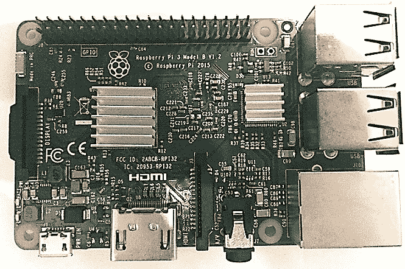
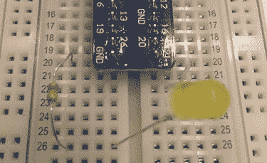
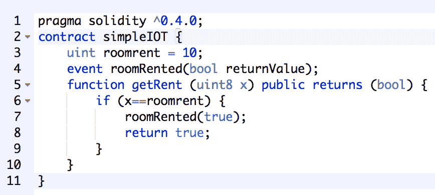
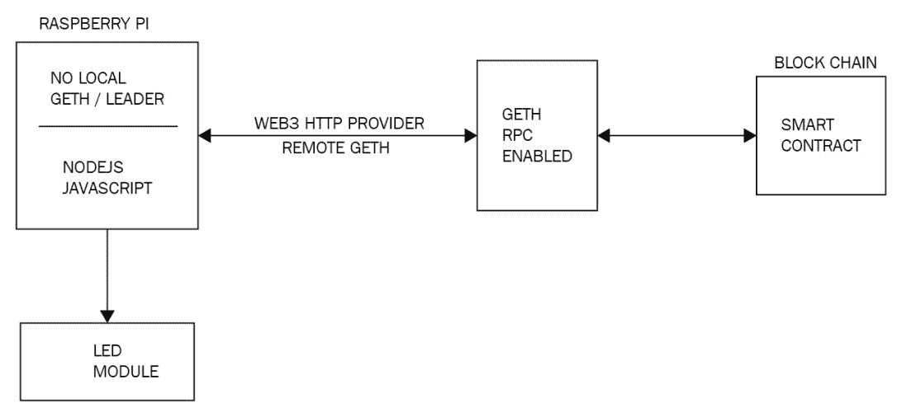

# 货币之外的区块链

数字货币是区块链技术的首次应用，可以说没有意识到它的真正潜力。随着比特币的发明，区块链的概念首次被引入，但直到 2013 年，区块链技术的真正潜力才得以实现，它可能应用于加密货币以外的许多不同行业。从那时起，区块链技术在各个行业的许多使用案例已经提出，包括但不限于金融、物联网、数字版权管理、政府和法律。

本章选取了物联网、政府、健康、金融四个主要行业，借助用例进行讨论。

2010 年，人们开始讨论 BitDNS，这是一种互联网上的分散域名系统。2011 年 4 月，名币([https://wiki.namecoin.org/index.php?title=History](https://wiki.namecoin.org/index.php?title=History))诞生，与比特币相比，它有着不同的愿景，比特币的唯一目的是提供电子现金。这可以被认为是除了纯粹的加密货币之外的第一个区块链使用的例子。
在这之后到了 2013 年，许多想法涌现出来。自 2013 年以来，这一趋势呈指数级增长。

# 物联网

**物联网**(简称**物联网**)由于其转变商业应用和日常生活的潜力，最近获得了很大的关注。物联网可以定义为计算智能物理对象(任何对象，如汽车、冰箱、工业传感器等)的网络，这些对象能够连接到互联网，感知真实世界的事件或环境，对这些事件做出反应，收集相关数据，并通过互联网进行通信。

这个简单的定义有着巨大的影响，并导致了令人兴奋的概念，如可穿戴设备、智能家居、智能电网、智能联网汽车和智能城市，这些都基于物联网设备的基本概念。剖析物联网的定义后，物联网设备执行的四个功能浮出水面。其中包括**感知**、**反应**、**采集**、**沟通**。所有这些功能都是通过使用物联网设备上的各种组件来执行的。

感测由传感器执行。反应或控制由致动器执行，收集是各种传感器的功能，通信由提供网络连接的芯片执行。需要注意的一点是，所有这些组件都可以通过物联网中的互联网进行访问和控制。物联网设备本身在某种程度上可能是有用的，但如果它是更广泛的物联网生态系统的一部分，它就更有价值。

典型的物联网可以由许多相互连接并连接到中央云服务器的物理对象组成。如下图所示:


典型的物联网网络

来源:IBM

物联网的元素分布在多个层，并且存在各种可用于开发物联网系统的参考架构。可以用五层模型来描述物联网，它包含物理对象层、设备层、网络层、服务层和应用层。每个层或级别负责各种功能，并包括多个组件。这些显示在下图中:


物联网五层模型

现在我们将详细检查每一层。

# 物理对象层

这些包括任何现实世界的物理对象。它包括人、动物、汽车、树木、冰箱、火车、工厂、家庭，事实上，任何需要监控和控制的东西都可以连接到物联网。

# 设备层

这一层包含组成物联网的东西，如传感器、转换器、执行器、智能手机、智能设备和**射频识别** ( **RFID** )标签。根据传感器执行的工作类型，可以将传感器分为许多类别，例如身体传感器、家庭传感器和环境传感器。这一层是物联网生态系统的核心，其中各种传感器用于感知真实世界的环境。这一层包括可以监控温度、湿度、液体流量、化学物质、空气、压力等的传感器。通常情况下，设备上需要一个**模数转换器** ( **ADC** )，将现实世界的模拟信号转换成微处理器可以理解的数字信号。

这一层中的致动器提供了实现外部环境控制的手段，例如，启动马达或开门。这些组件还需要数模转换器来将数字信号转换成模拟信号。当物联网设备需要控制机械部件时，这种方法尤其有用。

# 网路层

这一层由各种网络设备组成，这些设备用于在设备之间提供互联网连接，并连接到作为物联网生态系统一部分的云或服务器。这些设备包括网关、路由器、集线器和交换机。这一层可以包括两种类型的通信。

首先是水平通信方式，包括无线电、蓝牙、Wi-Fi、以太网、LAN、Zigbee 和 PAN，可用于提供物联网设备之间的通信。第二，我们与下一层进行通信，这通常是通过互联网进行的，并提供机器与人或其他上层之间的通信。第一层可以可选地包括在设备层中，因为它物理上驻留在设备层上，其中设备可以在同一层相互通信。

# 管理层

这一层为物联网生态系统提供管理层。这包括能够处理从物联网设备收集的数据并将其转化为有意义的见解的平台。此外，这一层还包括设备管理、安全管理和数据流管理。它还管理设备层和应用层之间的通信。

# 应用层

这一层包括运行在物联网网络之上的应用。这一层可以包含许多应用程序，具体取决于运输、医疗保健、金融、保险或供应链管理等需求。当然，这份清单无论如何也不是一份详尽的清单；有无数的物联网应用可以归入这一层。

随着廉价传感器、硬件和带宽的出现，物联网近年来越来越受欢迎，目前已应用于许多不同领域，包括医疗保健、保险、供应链管理、家庭自动化、工业自动化和基础设施管理。此外，IPv6、更小更强大的处理器以及更好的互联网接入等技术进步也在物联网的普及中发挥了至关重要的作用。

物联网的好处包括节约成本、帮助企业做出重要决策，从而根据物联网设备提供的数据提高性能。即使在家庭使用中，配备物联网的家用电器也可以为成本节约提供有价值的数据。例如，用于能源监控的智能电表可以提供关于能源使用情况的宝贵信息，并可以将这些信息反馈给服务提供商。对数百万件事物(物联网设备)的原始数据进行分析，并提供有意义的见解，帮助做出及时高效的业务决策。

通常的物联网模型基于集中式范式，其中物联网设备通常连接到云基础设施或中央服务器，以报告和处理相关数据。这种集中化带来了一定的利用可能性，包括黑客攻击和数据窃取。此外，无法控制单个集中式服务提供商的个人数据也增加了安全和隐私问题的可能性。虽然有一些方法和技术可以在普通物联网模型的基础上构建高度安全的物联网生态系统，但区块链可以为物联网带来更令人满意的好处。基于区块链的物联网模式不同于传统的物联网网络模式。

IBM 表示，物联网区块链有助于建立信任、降低成本和加速交易。此外，分散化是区块链技术的核心，可以消除物联网网络中的单点故障。例如，中央服务器可能无法处理数十亿物联网设备(事物)以高频率产生的数据量。此外，区块链提供的点对点通信模式有助于降低成本，因为无需构建高成本的集中式数据中心或实施复杂的公钥基础设施来保护安全。设备可以直接或通过路由器相互通信。

根据各种研究人员和公司的估计，到 2020 年，将有大约 220 亿台设备连接到互联网。随着连接到互联网的数十亿设备的爆炸式增长，很难想象集中式基础设施能够在不导致过度支出的情况下应对带宽、服务和可用性的高需求。基于区块链的物联网将能够解决当前物联网模型中的可扩展性、隐私和可靠性问题。

区块链使*事物*能够直接相互通信和交易，随着智能合同的出现，谈判和金融交易也可以直接在设备之间发生，而不需要中介、权威或人工干预。例如，如果酒店的一个房间是空的，它可以自己出租，协商租金，并可以为一个支付了适量资金的人类打开门锁。另一个例子是，如果洗衣机用完了洗涤剂，它可以根据智能合同中的逻辑找到最佳价格和价值，然后在网上订购。

上述五层物联网模型可以通过在网络层之上添加区块链层来适应基于区块链的模型。这一层将运行智能合同，并为物联网生态系统提供安全性、隐私性、完整性、自治性、可扩展性和去中心化服务。在这种情况下，管理层可以只包含与分析和处理相关的软件，安全性和控制可以转移到区块链层。该模型可以在下图中看到:


基于区块链的物联网模型

在该模型中，其他层可能保持不变，但将引入一个额外的区块链层，作为物联网网络所有参与者之间的中间件。

在抽象掉前面提到的所有层之后，它也可以被可视化为对等的物联网网络。此模型如下图所示，其中所有设备在没有中央命令和控制实体的情况下相互通信和协商:


基于区块链的直接通信模型，来源:IBM

它还可以节省成本，这是因为通过使用基于区块链的分散方法，设备管理更容易。使用区块链可以优化物联网网络的性能。在这种情况下，将没有必要集中存储数百万设备的物联网数据，因为存储和处理需求可以分布到区块链上的所有物联网设备。这可以完全消除对处理和存储物联网数据的大型数据中心的需求。

基于区块链的物联网还可以挫败拒绝服务攻击，黑客可以更有效地针对集中式服务器或数据中心，但由于区块链的分布式和去中心化性质，这种攻击不再可能。此外，如果像预计的那样，很快将有数十亿台设备连接到互联网，那么从传统的中央服务器管理所有这些设备的安全和更新将变得几乎不可能。区块链可以为这一问题提供解决方案，允许设备以安全的方式直接相互通信，甚至相互请求固件和安全更新。在区块链网络上，这些通信可以被永久安全地记录下来，这将为系统提供可审计性、完整性和透明性。这种机制在传统的对等系统中是不可能的。

总之，物联网和区块链的融合可以带来明显的好处，学术界和工业界的大量研究和工作已经在进行中。已经提出了各种项目来提供基于区块链的物联网解决方案。例如，IBM Blue Horizon 和 IBM Bluemix 是支持区块链物联网平台的物联网平台。各种初创公司，如 Filament，已经就如何建立一个分散的网络提出了新的想法，使物联网上的设备能够在智能合同的驱动下直接和自主地相互交易。

在下一节中，我们将提供一个实际的例子，说明如何构建一个简单的物联网设备，并将其连接到以太坊区块链。该物联网设备连接到以太坊区块链，用于在区块链上的用户发送适当金额的资金时开门(在这种情况下，门锁由 LED 表示)。这是一个简单的例子，需要更严格测试的版本才能在生产中实施，但它演示了如何连接、控制物联网设备，以及如何响应以太坊区块链上的某些事件。

# 物联网区块链实验

这个例子使用了一个 Raspberry Pi 设备，它是一个单板机 ( **SBC** )。Raspberry Pi 是一种 SBC，作为一种低成本计算机开发，旨在促进计算机教育，但作为构建物联网平台的首选工具，它也越来越受欢迎。下图是一个树莓 Pi 3 型号 B。您也可以使用早期的型号，但这些型号尚未经过测试:



树莓 Pi 型号 B

在下一节中，将讨论一个示例，其中 Raspberry Pi 将用作连接到以太坊区块链的物联网设备，并将响应智能合约调用。

首先，需要设置树莓派。这可以通过使用 NOOBS 来完成，它提供了一种安装 Raspbian 或任何其他操作系统的简单方法。

这可以从链接[https://www.raspberrypi.org/downloads/noobs/](https://www.raspberrypi.org/downloads/noobs/)下载并安装。另外，只有 Raspbian 可以从链接[https://www.raspberrypi.org/downloads/raspbian/](https://www.raspberrypi.org/downloads/raspbian/)安装。
https://github.com/debian-pi/raspbian-ua-netinst[的另一个选择](https://github.com/debian-pi/raspbian-ua-netinst)也可以用来安装最小非 GUI 版本的 Raspbian 操作系统。

在本例中，NOOBS 被用来安装 Raspbian，因此本练习的其余部分假设 Raspbian 安装在 Raspberry Pi 的 SD 存储卡上。以下屏幕截图中的命令输出显示了操作系统运行在哪个体系结构上。这种情况下是`armv71`；因此，将下载与 ARM 兼容的 Geth 二进制文件。

可以在 Raspberry Pi Raspbian 操作系统的终端窗口中运行命令`uname -a`来确认平台。


树莓 Pi 架构

一旦安装了 Raspbian 操作系统，下一步就是为 Raspberry Pi ARM 平台下载合适的 Geth 二进制文件。

详细描述了下载和安装步骤:

1.  获取下载。注意，在下面的例子中，下载了一个特定的版本，但是也可以从[https://geth.ethereum.org/downloads/](https://geth.ethereum.org/downloads/)下载其他版本。

我们可以使用`wget`，来下载`geth`客户端图像:

```
      $ wget https://gethstore.blob.core.windows.net/builds/geth-linux- arm7-1.5.6-2a609af5.tar.gz
```

其他版本也是可用的，但建议您下载这个版本，因为这是本章示例中使用的版本。

2.  解压缩并提取到一个目录中。名为`geth-linux-arm7-1.5.6-2a609af5`的目录将使用下面显示的`tar`命令自动创建:

```
      $ tar -zxvf geth-linux-arm7-1.5.6-2a609af5.tar
```

该命令将创建一个名为`geth-linux-arm7-1.5.6-2a609af5`的目录，并将 Geth 二进制文件和相关文件提取到该目录中。Geth 二进制文件可以被复制到`/usr/bin`或者 Raspbian 上适当的路径，这样它就可以在操作系统的任何地方使用。下载完成后，下一步是创建 genesis 块。

3.  需要使用一个 genesis 块。genesis 文件可以从网络上的另一个节点复制。如下图所示。或者，可以生成一个全新的生成块。

```
      { 
           "nonce": "0x0000000000000042", 
           "timestamp": "0x00", 
           "parentHash":   
           "0x0000000000000000000000000000000000000000000000000000000000000000", 
           "extraData": "0x00", 
           "gasLimit": "0x8000000", 
           "difficulty": "0x0400", 
           "mixhash":        
           "0x0000000000000000000000000000000000000000000000000000000000000000", 
           "coinbase": "0x3333333333333333333333333333333333333333", 
           "alloc": { 
           }, 
           "config": { 
               "chainId": 786, 
               "homesteadBlock": 0, 
               "eip155Block": 0, 
               "eip158Block": 0 
           } 
      }
```

4.  一旦`genesis.json`文件被复制到树莓 Pi 上；可以运行以下命令来生成 genesis 块。重要的是使用先前生成的相同的源块，否则节点将有效地运行在不同的网络上:

```
 $ ./geth init genesis.json
```

这将显示类似于以下屏幕截图所示的输出:


初始化生成文件

5.  在创建 genesis 块之后，需要向网络添加对等体。这可以通过创建一个名为`static-nodes.json`的文件来实现，该文件包含 Raspberry Pi 上的`geth`将连接用于同步的对等体的 enode ID:


静态节点配置

可以通过运行以下命令从 Geth JavaScript 控制台获得这些信息，并且该命令应该在 Raspberry Pi 将要连接的对等体上运行:

```
      > admin.nodeInfo
```

这将显示类似于以下屏幕截图所示的输出:


geth nodeInfo

在此步骤之后，可以按照以下部分中的进一步说明将 Raspberry Pi 连接到专用网络上的另一个节点。在示例中，Raspberry Pi 将连接到网络 ID `786` *。*关键是使用以前创建的相同的 genesis 文件和不同的端口号。相同的起源文件将确保客户端连接到起源文件所源自的相同网络。

不同的端口不是严格的要求，但是，如果两个节点在专用网络下运行，并且需要从网络外部的环境进行访问，则将使用 DMZ、路由器和端口转发的组合。因此，建议使用不同的 TCP 端口，以允许端口转发正常工作。下面的第一个节点设置命令中显示的`--identity`开关(以前没有介绍过)允许为节点指定一个标识名。

# 第一个节点设置

首先，需要使用以下命令在第一个节点上启动`geth`客户端:

```
$ geth --datadir .ethereum/privatenet/ --networkid 786 --maxpeers 5 --rpc --rpcapi web3,eth,debug,personal,net --rpcport 9001 --rpccorsdomain "*" -- port 30301 --identity "drequinox"  
```

这将产生类似如下的输出:


在第一个节点上获取

一旦启动，它应该保持运行，并且应该从 Raspberry Pi 节点启动另一个`geth`实例。

# Raspberry Pi 节点设置

在 Raspberry Pi 上，需要运行以下命令来启动`geth`并将其与其他节点同步(在本例中只有一个节点)。以下是命令:

```
$ ./geth --networkid 786 --maxpeers 5 --rpc --rpcapi web3,eth,debug,personal,net --rpccorsdomain "*" --port 30302 --identity "raspberry"  
```

这将产生类似于下面屏幕截图所示的输出。当输出包含显示`Block synchronisation started`的行时，意味着该节点已经成功连接到它的对等节点。


吃树莓派吧。

这可以通过在两个节点上的`geth`控制台中运行命令来进一步验证，如下图所示。只需在 Raspberry Pi 上运行以下命令，就可以连接到`geth`客户端:

```
$ geth attach 
```

这将打开 JavaScript `geth`控制台，用于与`geth`节点交互。我们可以使用`admin.peers`命令来查看连接的对等体:


在 Raspberry Pi 上运行的 geth 控制台管理对等命令

类似地，我们可以通过在第一个节点上运行以下命令来连接到`geth`实例:

```
$ geth attach ipc:.ethereum/privatenet/geth.ipc  
```

一旦控制台可用，就可以运行`admin.peers`来显示其他连接节点的详细信息，如下图所示:


在另一方上运行的 geth 控制台管理对等命令

一旦两个节点都启动并运行，就可以安装更多的先决条件来设置实验。需要安装 Node.js 和相关的 JavaScript 库。

# 安装 Node.js

这里列出了所需的库和依赖项。需要在 Raspberry Pi Raspbian 操作系统上更新 First Node.js 和 npm。为此，可以遵循以下步骤:

1.  使用以下命令在 Raspberry Pi 上安装最新的 Node.js:

```
      $ curl -sL https://deb.nodesource.com/setup_7.x | sudo -E bash -
```

这应该会显示如下所示的输出。输出非常大，因此在下面的屏幕截图中只显示了输出的顶部:


Node.js 安装

2.  通过`apt-get`运行更新:

```
      $ sudo apt-get install nodejs
```

可以通过运行以下命令进行验证，以确保安装了正确版本的 Node.js 和 npm，如以下屏幕截图所示:


npm 和节点安装验证

应该注意的是，这些版本不是必需的；npm 和 Node.js 的任何最新版本都应该可以。但是，本章中的示例使用了 npm 4.0.5 和 node v7.4.0，因此建议读者使用相同的版本，以避免任何兼容性问题。

3.  安装以太坊`web3` npm，这是 JavaScript 代码访问以太坊区块链所必需的:

确保安装了截图中显示的`web3`的特定版本或类似版本，例如 0.20.2。这很重要，因为默认情况下将安装 1.0.0-beta.26 版本(在撰写本文时),这是测试版，正在开发中。因此，本例中应使用 0.20.2 或 0.18.0 稳定版本。读者可以使用`$ npm install web3@0.20.2`安装这个版本。


npm 安装网站 3

4.  类似地，可以安装 npm `onoff`，它需要与 Raspberry Pi 通信并控制 GPIO:

```
      $ npm install onoff
```


开关安装

安装完所有必备组件后，就可以进行硬件安装了。为此，使用试验板和一些电子元件构建一个简单的电路。

硬件组件如下所示:

*   **LED**:**发光二极管**的缩写，可以作为事件的视觉指示。
*   **电阻器**:需要一个 330 欧姆的元件，根据其额定值提供通过电流的阻力。对于这个实验来说，没有必要去理解背后的理论；任何标准的电子工程教科书都详细涵盖了所有这些主题。

*   试验板:这提供了一种不需要焊接就能构建电子电路的方法。
*   **T 形补鞋匠**:它插在试验板上，如下图所示，提供了树莓 Pi 的所有**通用 I/O** ( **GPIO** )引脚的标签视图。
*   **带状电缆连接器**:这只是用来通过 GPIO 在 Raspberry Pi 和试验板之间提供连接。下图显示了所有这些组件:


必需的组件

# 电路

如下图所示，LED 的正极脚(长腿)连接到 GPIO 的引脚号 **21** ，负极脚(短腿)连接到电阻，电阻再连接到 GPIO 的**地** ( **GND** )引脚。一旦设置好连接，带状电缆就可以简单地连接到 Raspberry Pi 上的 GPIO 连接器。



试验板上元件的连接

一旦连接设置正确，并且 Raspberry Pi 已经用适当的库和 Geth 更新，下一步就是开发一个简单的、智能的、期望值的契约。如果提供给它的值不是它所期望的，它不会触发事件；否则，如果传递的值与正确的值匹配，则事件触发，该事件可以由通过 Node.js 运行的客户端 JavaScript 程序读取。当然，Solidity 契约可以非常复杂，并且还可以处理发送给它的 Ether，如果 Ether 的量等于所需的量，则事件可以触发。然而，在本例中，我们的目标是演示如何使用智能合约来触发事件，然后这些事件可以被 Node.js 上运行的 JavaScript 程序读取，然后这些程序又可以使用各种库在物联网设备上触发操作。

智能合约源代码如下所示:



简单 IOT 的坚固性代码

在线 Solidity 编译器(Remix IDE)可以用来运行和测试这个契约。与合同交互所需的**应用二进制接口** ( **ABI** )也在细节部分，如下图所示:


Remix IDE 的 ABI

以下是合同的 ABI:

```
[ 
    { 
        "constant": false, 
        "inputs": [ 
            { 
                "name": "x", 
                "type": "uint8" 
            } 
        ], 
        "name": "getRent", 
        "outputs": [ 
            { 
                "name": "", 
                "type": "bool" 
            } 
        ], 
        "payable": false, 
        "stateMutability": "nonpayable", 
        "type": "function" 
    }, 
    { 
        "anonymous": false, 
        "inputs": [ 
            { 
                "indexed": false, 
                "name": "returnValue", 
                "type": "bool" 
            } 
        ], 
        "name": "roomRented", 
        "type": "event" 
    } 
] 
```

有两种方法可以让 Raspberry Pi 节点通过`web3`接口连接到私有区块链。第一种情况是，Raspberry Pi 设备在本地运行自己的`geth`客户端，并维护自己的账本，但对于资源受限的设备，在某些情况下，不可能运行完整的`geth`节点，甚至是一个轻量级节点。在这种情况下，使用`web3` provider 的第二种方法可以用来连接到适当的 RPC 通道。这将在稍后的客户端 JavaScript Node.js 程序中显示。

下图显示了这两种方法的比较:


租房物联网应用的应用架构(带本地账本的物联网设备)



租房物联网应用的应用架构(无本地账本的物联网设备)

公开暴露 RPC 接口会产生明显的安全问题；因此，建议仅在私有网络上使用此选项，如果需要在公共网络上使用，则采取适当的安全措施，例如仅允许已知的 IP 地址连接到`geth` RPC 接口。这可以通过禁用对等发现机制和 HTTP-RPC 服务器侦听接口的组合来实现。

关于这一点的更多信息可以使用`geth help`找到。传统的网络安全措施如防火墙、**传输层安全** ( **TLS** )和证书也可以使用，但在本例中没有讨论。现在，Truffle 可以用来在 Raspberry Pi 所连接的私有网络 ID `786`上部署契约。Truffle deploy 可以简单地通过使用下面显示的命令来执行；

```
$ truffle migrate  
```

它应该会产生类似于以下屏幕截图的输出:


松露展开

一旦合约被正确部署，就可以开发 JavaScript 代码，该代码将通过`web3`连接到区块链，监听来自区块链的智能合约的事件，并通过 Raspberry Pi 打开 LED。`index.js`文件的 JavaScript 代码如下所示:

```
var Web3 = require('web3');
if (typeof web3 !== 'undefined')
{
    web3 = new Web3(web3.currentProvider);
}else
{
    web3 = new Web3(new Web3.providers.HttpProvider("http://localhost:9002")); 
    //http-rpc-port
}
var Gpio = require('onoff').Gpio; 
var led = new Gpio(21,'out');
var coinbase = web3.eth.coinbase;
var ABIString = '[{"constant":false,"inputs":[{"name":"x","type":"uint8"}],"name":"getRent","outputs":[{"name":"","type":"bool"}],"payable":false,"stateMutability":"nonpayable","type":"function"},{"anonymous":false,"inputs":[{"indexed":false,"name":"returnValue","type":"bool"}],"name":"roomRented","type":"event"}]';
var ABI = JSON.parse(ABIString);
var ContractAddress = '0x975881c44fbef4573fef33cccec1777a8f76669c';
web3.eth.defaultAccount = web3.eth.accounts[0];
var simpleiot = web3.eth.contract(ABI).at(ContractAddress);
var event = simpleiot.roomRented( {}, function(error, result) { if (!error)
{
    console.log("LED On");
    led.writeSync(1);
}
});
```

请注意，在前面的示例中，变量`var ContractAddress`的契约地址`'0x975881c44fbef4573fef33cccec1777a8f76669c'`是特定于部署的，当读者运行这个示例时，它会有所不同。只需将文件中的地址更改为您在部署契约后看到的地址。

另外，请注意在 Raspberry Pi 上启动 Geth 的 HTTP-RPC 服务器监听端口。默认为 TCP 端口`8545`。记得根据您的 Raspberry Pi 设置和 Geth 配置来更改它。在前面的示例代码中，它被设置为`9002`,因为在示例中，运行在 Raspberry Pi 上的 Geth 正在监听`9002`。如果它正在收听您的 Raspberry Pi 上的不同端口，请将其更改为该端口:

```
web3 = new Web3(new Web3.providers.HttpProvider("http://localhost:9002"));
```

当 Geth 启动时，它显示了 HTTP 端点监听哪个端口。这也可以用`geth`中的`--rpcport`通过指定端口号值作为标志的参数来配置。

这段 JavaScript 代码可以放在 Raspberry Pi 上的一个文件中，比如`index.js`。可以使用以下命令运行它:

```
$ node index.js  
```

这将启动程序，该程序将在 Node.js 上运行并侦听来自智能合约的事件。一旦程序正确运行，就可以使用 Truffle 控制台调用智能合约，如下图所示。

在这种情况下，使用参数`10`调用`getRent`函数，这是预期值:


与合同的互动

合约挖掘完成后，会触发`roomRented`，LED 会亮起。

在本例中，它是一个简单的 LED，但它可以是任何物理设备，如可以通过执行器控制的房间锁。如果一切正常，LED 将作为智能合约功能调用的结果而打开，如下图所示:


带 LED 控制的树莓派

此外，在节点端，它将显示类似于此处所示的输出:

```
$ node index.js
LED On 
```

如前面的示例所示，可以构建一个物联网设备的私有网络，在每个节点上运行一个`geth`客户端，并可以侦听来自智能合同的事件，并相应地触发一个操作。所示示例的目的很简单，但展示了以太坊网络的基本原理，可以使用物联网设备以及智能合同驱动的物理设备控制来构建以太坊网络。

在下一节中，将讨论区块链技术在政府、金融和卫生方面的其他应用。

# 政府

目前正在研究区块链的各种应用，这些应用可以支持政府职能，并将当前的电子政务模式提升到下一个级别。首先，在本节中，将提供一些电子政务的背景，然后将讨论一些用例，如电子投票、国土安全(边境控制)和电子身份证(公民身份证)。

政府或电子政府是一种利用信息和通信技术向公民提供公共服务的模式。这个概念并不新鲜，已经在世界各地的不同国家实施，但与区块链，一个新的探索途径已经打开。许多政府正在研究使用区块链技术管理和提供公共服务的可能性，包括但不限于身份证、驾驶执照、各政府部门之间的安全数据共享以及合同管理。透明度、可审计性和完整性是区块链的属性，可以在有效管理各种政府职能方面发挥很大作用。

# 边境管制

自动边境控制系统已经使用了几十年，以阻止非法入境和防止恐怖主义和人口贩运。

机器可读的旅行证件，特别是生物特征护照，为自动化边境管制铺平了道路；然而，目前的系统在一定程度上受到限制，区块链技术可以提供解决方案。在文件 ICAO 9303(【https://www.icao.int/publications/pages/publication.aspx?】)中定义了**机器可读旅行证件** ( **MRTD** )标准 docnum=9303 )由**国际民用航空组织** ( **ICAO** )制定，并已被全球多个国家实施。

每本护照都包含各种安全和身份属性，这些属性可用于识别护照的所有者，并防止篡改护照的企图。这些包括生物特征，如视网膜扫描、指纹、面部识别和国际民航组织规定的标准特征，包括**机器可读区** ( **MRZ** )和护照首页上可见的其他文本属性。

当前边境管制系统的一个关键问题是数据共享，即系统由单一实体控制，执法机构之间不容易共享数据。由于缺乏分享数据的能力，追踪可疑的旅行证件或个人变得很困难。另一个问题涉及立即将旅行证件列入黑名单，例如，当急需追踪和控制可疑旅行证件时。目前，没有机制可以立即将可疑护照列入黑名单或吊销，并向世界各地的边境管制港口广播。

区块链可以通过在智能合同中维护一个黑名单来解决这一问题，该黑名单可以根据需要进行更新，所有机构和边境控制点都可以立即看到任何变化，从而可以立即控制可疑旅行文件的移动。可以说，传统的机制，如公钥基础设施和对等网络也可以用于这一目的，但它们不能提供区块链所能提供的好处。有了区块链，整个系统可以简化，不需要复杂的网络和 PKI 设置，这也将导致成本降低。此外，基于区块链的系统将提供密码保证的不变性，这有助于审计和阻止任何欺诈活动。

由于可伸缩性问题，所有旅行文档的完整数据库目前可能无法存储在区块链上，但后端分布式数据库如 BigchainDB、IPFS 或 Swarm 可用于此目的。在这种情况下，具有个人生物特征 ID 的旅行文档的散列可以存储在简单的智能合同中，然后文档的散列可以用于引用分布式文件系统(如 IPFS)上可用的详细数据。这样，当一个旅行文件被列入网络上的黑名单时，该信息将立即可用，并在整个分布式分类帐中有其真实性和完整性的加密保证。这一功能还可以为反恐活动提供足够的支持，从而在政府的国土安全职能中发挥至关重要的作用。

Solidity 中的简单契约可以具有为存储身份和相关联的生物测定记录而定义的数组。这个数组可以用来存储护照的识别信息。身份可以是护照或旅行证件的 MRZ 与来自 RFID 芯片的生物测定记录的散列。一个简单的布尔字段可以用来识别黑名单护照。一旦这一初步检查通过，传统系统就可以进行进一步详细的生物特征验证，最终在作出关于护照持有人入境的决定时，该决定可以传播回区块链，从而使网络上的所有参与者能够立即分享决定的结果。

构建基于区块链的边境控制系统的高级方法可以如下图所示。在这种情况下，护照被提供给 RFID 和页面扫描仪进行扫描，该扫描仪读取数据页面并提取机器可读信息以及存储在 RFID 芯片中的生物统计数据的散列。在这一阶段，护照持有人的现场照片和视网膜扫描也被拍摄。这些信息然后被传递到区块链，在那里一个智能合同负责验证旅行文件的合法性，首先检查其黑名单护照列表，然后从后端 IPFS 数据库请求更多数据进行比较。请注意，照片或视网膜扫描等生物特征数据并不存储在区块链上，相反，只有对后端(IPFS 或 BigchainDB)中该数据的引用才存储在区块链中。

如果出示的护照中的数据与 IPFS 的文件或 BigchainDB 中的数据相匹配，并通过智能合同逻辑检查，边境大门就可以打开。


使用区块链的自动化边境管制

核实后，这一信息将在整个区块链传播，并立即提供给区块链边境管制的所有参与者。这些参与者可以是各国国土安全部的全球联盟。

# 投票

投票在任何政府中都是一项关键职能，它允许公民参与民主选举进程。虽然投票已经发展成为一个更加成熟和安全的过程，但它仍然有一些限制，需要解决这些限制才能达到期望的成熟水平。通常，当前投票系统的局限性围绕着欺诈、操作流程中的弱点，尤其是透明度。多年来，已经建立了安全的投票机制(机器),其利用了承诺安全和隐私的专用投票机器，但是它们仍然具有可被利用来破坏这些机器的安全机制的弱点。这些弱点可能对整个投票过程产生严重影响，并可能导致公众对政府的不信任。

基于区块链的投票系统可以通过在过程中引入端到端的安全性和透明度来解决这些问题。通过使用在区块链中作为标准的公钥加密，以投票的完整性和真实性的形式提供安全性。此外，区块链保证的不变性确保了投过一次票的人不能再次投票。这可以通过生物特征和智能合同的组合来实现，智能合同维护已经投票的名单。例如，智能合同可以维护一个带有生物特征 ID(例如指纹)的已投选票列表，并可以使用它来检测和防止重复投票。其次，**零知识证明** ( **ZKPs** )也可以用在区块链上，保护区块链上选民的隐私。

一些公司已经在提供这样的服务，一个例子是 https://polys.me/blockchain/online-voting-system。
近日，塞拉利昂使用区块链技术举行总统选举，成为首个使用区块链技术进行选举的国家([https://www . coin desk . com/Sierra-Leone-secretly-holds-first-区块链-powered-president-vote/](https://www.coindesk.com/sierra-leone-secretly-holds-first-blockchain-powered-presidential-vote/))。

# 公民身份证明(身份证)

目前世界各国都发行电子身份证或国民身份证。这些卡是安全的，并且具有许多阻止复制或篡改企图的安全特征。然而，随着区块链技术的出现，可以对这一过程进行一些改进。

数字身份不仅仅限于政府颁发的身份证；这个概念也适用于在线社交网络和论坛。可以有多个身份用于不同的目的。基于区块链的在线数字身份允许控制个人信息共享。用户可以看到谁使用了他们的数据，使用的目的是什么，并且可以控制对数据的访问。这对于当前集中控制的基础设施是不可能的。主要的好处是，政府颁发的单一身份可以通过单一政府区块链以透明的方式轻松用于多种服务。在这种情况下，区块链作为一个平台，政府在其中提供各种服务，如养老金、税收或福利，并且使用单一 ID 来访问所有这些服务。在这种情况下，区块链提供了数字 ID 所做的每一次更改和交易的永久记录，从而确保了系统的完整性和透明度。此外，公民可以在区块链上公证出生证明、婚姻、契约和许多其他文件，这些文件与他们的数字身份证绑定在一起，作为存在的证明。

目前，在许多国家都成功实施了运行良好的身份方案，并且有一种观点认为，身份管理系统中可能不需要区块链。虽然由于区块链技术目前的不成熟，它有一些好处，如隐私和对身份信息使用的控制，但也许它还没有准备好用于现实世界的身份系统。然而，各国政府正在开展研究，探索如何利用区块链进行身份管理。

此外，被遗忘权等法律由于其不可改变的性质，很难纳入区块链教。

# 多方面的

可以实施区块链技术以提高成本和效率的其他政府职能包括税收征收、福利管理和支付、土地所有权记录管理、生活事件登记(婚姻、出生)、机动车登记和许可证。这并不是一个详尽的清单，随着时间的推移，政府的许多职能和程序可以适应区块链模式。区块链的主要优势，如不变性、透明度和权力下放，有助于改善大多数传统的政府系统。

# 健康

卫生行业也被确定为另一个可以通过采用区块链技术而受益的主要行业。区块链提供了传统对等网络无法提供的不可变、可审计、透明的系统。此外，与传统复杂的 PKI 网络相比，区块链提供了一种经济高效、更简单的基础设施。在医疗保健行业，隐私泄露、数据泄露、高成本和欺诈等主要问题可能源于缺乏互操作性、过于复杂的流程、透明度、可审核性和控制。另一个紧迫的问题是假药；特别是在发展中国家，这是一个令人关注的主要原因。

随着区块链在卫生部门的适应性，可以实现多种好处，包括节省成本、增加信任、更快处理索赔、高可用性、不会因操作程序复杂而出现操作错误，以及防止假药的销售。

从另一个角度来看，区块链提供数字货币作为采矿的激励，可以用于提供处理能力来解决科学问题，这有助于找到某些疾病的治疗方法。这方面的例子包括 FoldingCoin，该公司用 FLDC 代币奖励矿工，让他们分享计算机的处理能力，解决需要进行异常大规模计算的科学问题。

在 http://foldingcoin.net/可以买到折叠币。

另一个类似的项目叫做 CureCoin，可以在 https://www.curecoin.net/买到。这些项目在实现目标方面有多成功还有待观察，但这个想法非常有希望。

# 金融

区块链在金融行业有很多应用。金融领域的区块链是目前业内最热门的话题，主要由于其极具成本节约潜力，各大银行和金融机构正在研究如何适应区块链技术。

# 保险

在保险行业，区块链技术可以帮助阻止欺诈性索赔，提高索赔处理速度，并实现透明度。想象一下，所有保险公司共享一个分类账，可以为处理公司间索赔提供快速有效的机制。此外，随着物联网和区块链的融合，可以想象一个智能设备的生态系统，其中所有这些东西都可以通过区块链上的智能合同来协商和管理他们的保险单。

区块链可以降低处理索赔所需的整体成本和精力。索赔可以通过智能合同和保单持有人的相关身份自动验证和支付。例如，在甲骨文和可能的物联网的帮助下，智能合同可以确保当事故发生时，它可以记录相关的遥测数据，并根据这些信息发放付款。如果智能合同在评估支付条件后得出不应释放支付的结论，它也可以扣留支付。例如，在授权车间不修理车辆或在指定区域之外使用的情况下，等等。智能合同可以评估许多条件来处理索赔，这些规则的选择取决于保险公司，但总体思路是，智能合同与物联网和 Oracle 相结合，可以实现整个汽车保险行业的自动化。

Dynamis 等几家初创公司已经提出了在以太坊区块链平台上运行的基于智能合同的点对点保险平台。这最初被提议用于失业保险，并且在模型中不需要承保人。

在[http://dynamisapp.com/](http://dynamisapp.com/)有售。

# 交易后结算

这是区块链技术最受欢迎的应用。目前，许多金融机构都在探索使用区块链技术来简化、自动化和加快成本高昂且耗时的交易后结算流程的可能性。

为了更好地理解这个问题，简要描述了贸易生命周期。一个交易生命周期包含三个步骤:执行、清算和结算。执行涉及双方之间的交易承诺，可以通过前台订单管理终端或交易所输入系统。清算是下一步，根据某些属性，如价格和数量，在卖方和买方之间匹配交易。在这一阶段，参与支付的账户也被识别。最后，结算是最终在买方和卖方之间将证券交换为付款的地方。

在传统的交易生命周期模型中，需要一个中央票据交换所来促进承担双方信用风险的交易方之间的交易。目前的方案有些复杂，卖家和买家必须通过复杂的途径进行交易。这包括各种公司、经纪人、票据交换所和保管人，但是对于区块链，具有适当智能合约的单一分布式分类账可以简化整个过程，并且可以使买方和卖方直接对话。

值得注意的是，交易后的结算过程通常需要两到三天，并且依赖于中央清算所和对账系统。使用共享分类账方法，区块链的所有参与者可以立即看到关于交易状态的单一版本的真相。此外，点对点结算是可能的，这导致复杂性、成本、风险和交易结算时间的减少。最后，通过利用区块链上适当的智能合约，可以消除中介。此外，监管机构还可以查看审计和监管要求的区块链。

这对于实现 MIFID-II 法规要求([https://www.fca.org.uk/markets/mifid-ii](https://www.fca.org.uk/markets/mifid-ii))非常有用。

# 金融犯罪预防

**了解你的客户** ( **KYC** )和**反洗钱** ( **反洗钱**)是预防金融犯罪的关键手段。以 KYC 为例，目前每个机构都有自己的客户数据副本，并通过中央数据提供商进行验证。这可能是一个耗时的过程，并可能导致新客户入职的延迟。

区块链可以通过在所有金融机构之间安全地共享包含经验证的真实客户身份的分布式账本来解决这一问题。这种分布式分类帐只能通过参与者之间的共识来更新，因此提供了透明度和可审计性。这不仅可以降低成本，还能以更好、更一致的方式满足法规和合规性要求。

就反洗钱而言，由于区块链的不可变、共享和透明性质，监管机构可以轻松获得访问私有区块链的权限，在那里他们可以获取相关监管报告的数据。这还将降低与当前监管报告模式相关的复杂性和成本，在当前的监管报告模式中，数据是从各种遗留和不同的系统中提取的，并被汇总和格式化以用于报告目的。区块链可以提供系统中所有金融交易的单一共享视图，这些交易具有加密安全性、真实性和可审计性，从而降低与当前采用的监管报告方法相关的成本和复杂性。

# 媒体

媒体行业的关键问题围绕着内容分发、版权管理和向艺术家支付版税。例如，数字音乐可以不受任何限制地被多次复制，并且任何应用复制保护的尝试都以某种方式被黑客攻击。对音乐家或歌曲作者制作的内容的分发没有控制；它可以根据需要无限制地复制任意多次，因此对版税支付有影响。此外，支付并不总是有保证的，而是基于传统的广播时间数字。围绕版权保护和版税支付的所有这些问题都可以通过连接消费者、艺术家和行业中的所有参与者来解决，允许对过程的透明和控制。区块链可以提供一个网络，在这个网络中，数字音乐被加密保证只由付费的消费者拥有。这种支付机制由智能合同控制，而不是由中央媒体机构或权威机构控制。付款将根据智能合约中嵌入的逻辑和下载次数自动进行。

最近的一个例子是 Musicoin([https://musicoin.org](https://musicoin.org))。

此外，数字音乐文件的非法复制可以被完全阻止，因为一切都以透明的方式在区块链上被记录和永久拥有。例如，音乐文件可以与所有者信息和时间戳一起存储，这可以在整个区块链网络中被跟踪。此外，拥有某些内容的合法副本的消费者被加密地绑定到他们所拥有的内容，并且除非得到所有者的许可，否则不能将该内容转移给另一个所有者。一旦所有的数字内容都不可改变地记录在区块链上，通过区块链可以很容易地管理版权和转让。智能合同可以控制向所有相关方的分配和支付。

# 摘要

区块链技术有许多应用，如本章所述，它们可以在各种行业中实施，为现有解决方案带来多重好处。本章讨论了可以从区块链中受益的五个主要行业。首先讨论了物联网，它本身是另一项革命性的技术；通过将其与区块链相结合，可以解决几个基本限制，从而为物联网行业带来巨大的好处。物联网受到了更多的关注，因为它是适应区块链技术的最突出和最现成的候选对象。

实际使用案例和平台已经以**平台即服务** ( **平台即服务**)的形式出现，用于区块链的物联网，如 IBM 沃森物联网区块链。IBM 蓝色地平线现在也可以进行实验，这是一个分散的区块链物联网网络。其次，讨论了政府部门中的应用，通过这些应用，可以使各种政府流程(如国土安全、身份证和福利支付)变得透明、安全和更加可靠。

此外，还讨论了金融部门的问题以及区块链技术可能提供的解决方案。尽管金融部门正在积极探索使用区块链的可能性，但它离基于区块链的系统的生产就绪状态还很远。最后，还讨论了卫生部门和音乐产业的一些方面。所有这些使用案例以及业内更多案例都基于区块链技术的核心属性，如去中心化、透明性、可靠性和安全性。然而，在区块链技术能够完全适用之前，需要解决某些挑战；这些将在下一章讨论。