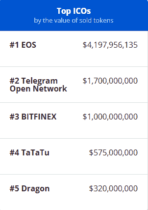

# ico 和符号化的筹款方式

加密货币和区块链导致的两大现象在 2017 年冲击了金融领域。第一个是比特币和以太、Ripple 等其他数字货币从 6 月到 12 月见证的泡沫，后者实际上在不到 8 个月的时间里价值增长了 450 倍。高波动性对加密货币作为强大金融工具和真实数字资产的可信度引发了可怕的后果。这导致大多数金融分析师、银行和对冲基金认为它们是由无形价值和群体不合理行为支撑的唯一投机性和高风险投资。陷入恶性循环后，大众媒体开始报道加密货币和区块链，放大了这一现象，并以这一新金融产品的高回报吸引了投资者，这不可避免地导致了 2017 年圣诞节至 2018 年年中的暴跌。

第二个现象很少被大众媒体报道，实际上可以解释为第一个现象的催化剂。也就是说，**最初的硬币发行** ( **ICOs** )从 2013 年就有了，但直到 2017 年才开始获得考虑。作为一种新的筹资方法，ico 用新创建的加密货币奖励支持者，使任何项目都能在几分钟内众筹到资金。2017 年第一季度，只有 8 个项目通过 ico 获得融资，总额为 1400 万美元。但是热情开始了。在接下来的三个月里，30 个项目成功结束，总金额达到近 10 亿美元。到年底，通过 ICOs 筹集了超过 54 亿美元，启动了 875 个项目。现在是投资者选择正确项目的时候了，这些项目将成为下一个比特币、以太坊或 Ripple。在这个狂热的时期(最终在 2018 年第二季度放缓)，生态系统看起来像一个巨大的赌场，在非理性的环境下，投资者渴望在喧嚣减弱之前赢得大笔资金和项目负责人。

现在，生态系统已经变得与 ico 更加一致，我们将能够事后解释它们和其他衍生的筹资方法(**证券代币发行**(**)、**股权代币发行** ( **ETO** )和**初始代币发行** ( **ITO** ))是什么。我们将通过例子说明它们的利用，描述什么类型的代币可以出售，并解释它们在筹款方面带来的优势。我们还将发现为什么这些方法在解除监管约束和道德问题的同时取得了巨大成功。**

 **本章讨论以下主题:

*   ico 是什么？
*   ICO 插图:以太坊案例
*   实用令牌和安全令牌
*   ICOs 到底有什么革命性？

# ico 是什么？

ICO 有点像**首次公开募股** ( **IPO** )。基本上，它是一种筹款工具，用一种新的加密货币交换一种已经存在的货币。该公司发行新创造的硬币，并以给定的价格出售，而不是像 IPO 那样在指定的证券交易所上市。

简而言之，这是一个由流动资金(比特币、以太坊或法定货币([https://www.investopedia.com/terms/f/fiatmoney.asp](https://www.investopedia.com/terms/f/fiatmoney.asp)))资助的项目，对抗一种专门为项目创造的新加密货币。这些新硬币被称为代币，基本上是基于区块链的数字优惠券，可以以不可逆的方式进行点对点交易。通过购买这些数字优惠券，投资者相信项目的成功和转售带来的附加值。

传统上，初创企业和公司可以通过几种金融工具筹集资金:

*   获得银行贷款
*   发起众筹运动
*   向私人投资者出售他们的资本份额
*   通过向公众投资者出售其资本股份而上市(IPO)

有了代币和区块链，他们现在可以通过创建新的基于数字区块链的代币来筹集资金，并在一定时期内出售这些代币，以筹集流动资金来帮助他们为项目融资。他们的基本论点是，这些代币将随着时间的推移增值，并可兑换成另一种加密货币。

为了理解一个 ICO，有时将它与 IPO 相提并论是很有趣的。首次公开募股的投资者自动获得他们所购股票的某些权利(股息、投票权、所有权等)，这些权利在一定程度上有助于股票的内在价值。在 ICO 中，向投资者发行和出售的代币只伴随着项目成功的承诺。在 ICO 期间购买的代币不享有分红权或投票权。这是一个主要的缺点，经常被批评者拿来作为反驳。

此外，关于这种新的融资方式，ico 在一些管辖区主要不受监管。在过去的几年里，很多项目都失败了，很多骗局也被发现了。此外，大多数项目负责人甚至在开发产品之前就筹集了资金。因此，这是一项高风险的投资。对于一个风险投资家来说，这相当于在一个种子阶段的初创企业投资数百万美元。在投资此类项目之前，需要进行彻底的上游研究。

尽管如此，一些 ico 还是相当成功，募集到了天文数字的资金。实际上，在 2017 年，ICO 融资已经超过风险投资融资，成为区块链初创企业融资的第一方式([https://www . CB insights . com/research/区块链-vc-ico-funding/](https://www.cbinsights.com/research/blockchain-vc-ico-funding/) )。

# ICO 插图——以太坊案例

第一个重要的 ico 是由著名的以太坊制作的(见[第三章](03.html)、*以太坊*、*和智能合约*)。创始人 Vitalik Buterin 和他的团队在 2014 年 7 月 22 日至 2014 年 9 月 2 日期间发行了约 6000 万以太(新的加密硬币或代币)，以换取 31500 比特币，在当时相当于 1840 万美元。

有了这笔钱，他们可以设计并编码未来的以太坊平台，该平台于 2015 年 7 月 30 日推出。创始人鼓励投资者，这个平台将允许人们在其上构建分散的应用程序。投资者受到诱惑，用比特币换取以太，这种货币后来被用作通过平台构建应用程序的燃料。当时，用 1 个比特币，你可以购买约 1900 个以太，截至 2019 年 6 月 19 日，其价值为 509200 美元。非常值得投资！

通过制作预定数量的硬币，项目负责人承诺这些代币将使投资者能够在未来购买服务或产品，或者用它们与另一种加密货币进行交易。

以太坊令人难以置信的是，它们既展示了 ICO 筹款的力量，也让人们能够这样做。事实上，有了像以太坊这样的平台，开发者不用从头开始构建区块链就可以构建应用程序，很多项目已经看到了这个平台的光明。人们可以创建一个应用程序，并出售代币，用于针对以太网或比特币的进一步开发。自从以太坊平台推出以来，ico 的崛起是指数级的。

以太坊平台潜力最突出的展示是**去中心化自治组织** ( **道**)，其 ICO 于 2016 年 5 月上线。该应用程序构建于以太坊区块链之上，旨在创建一个分散的风险投资基金，其投票系统由 DAO 令牌持有者控制。

任何持有 DAO 令牌的人都可以投票决定是否资助某个项目。这种全新的组织管理方式吸引了大约 11，000 名投资者，他们为该项目提供了价值高达 1.5 亿美元的以太网。不幸的是，2016 年 6 月 17 日，一群恶意的黑客成功利用了 DAO 代码中的一个漏洞，并从 DAO 收集的 1150 万美元以太中控制了 360 万美元以太。

这一失败让人们意识到在编写这种应用程序时需要小心，以及通过 ico 为项目和想法提供资金的可能性。

# 实用令牌和安全令牌

尽管在 ICO 期间颁发的大多数令牌在技术上是相似的，但它们的用途可以分为两类:

*   实用令牌
*   安全令牌

当以太坊开始销售以太网时，他们承诺这些代币将被用作使用以太坊平台创建应用程序的支付手段。这强调了以太是一个令牌，使其所有者能够使用平台，从而使用产品。以这种方式，**以太就是一个实用令牌**。

当 DAO 开始出售 DAO 代币时，他们承诺这些代币将被用作进一步融资项目的投票权和可获利的*份额*。代币确实会从道的利润中为所有者提供财务回报。以这种方式，**DAO 令牌就是一个安全令牌**。

这两者之间的区别来自于美国证券交易委员会(T1)(**美国证券交易委员会(T3))，它监管证券的方式与监管公司股票的方式相同。如果一个项目被宣布发行证券代币，该公司必须遵守美国证券交易委员会的法规，特别是 1933 年的证券法，其中必须满足几项义务和要求，才能从合格的、专业的或个人的投资者那里筹集资金。为了确定令牌是公用令牌还是安全令牌，美国 SEC 使用了一种叫做**豪威测试**的审计。它是由最高法院根据 1946 年发生在豪威公司的真实案例创立的。该测试基于几个标准来确定交易是否代表投资合同。换句话说，如果一项交易基于投资者所投资的公司或项目的努力为投资者创造了利润，则该交易应被视为投资合同，并应遵守美国证券交易委员会的法规。**

以这种方式，决定一个令牌是实用令牌还是安全令牌是一件相当主观的事情。虽然有些记号非常明显，例如 DAO 记号或 Ether，但其他记号可能很难判断。根据提出的问题，这更像是一种个人分析:

*   它是一种使用项目产品或服务的代币吗？
*   它是一种只提供某种加密货币回报的代币吗？
*   它是一个可以在另一个平台上使用或购买其他产品或服务的令牌吗？
*   它是一个令牌，可以帮助用户在项目生态系统中开发特定的权限吗？

作为一个联邦独立机构，美国证券交易委员会并不反对 ico，而是反对有关投资合同的欺诈性操纵，特别是当它是一种新的类型时。美国证券交易委员会和其他国家的同等机构将注意力集中在 ico 上，主要是因为法律框架仍未明确。由于遵守美国 SEC 的要求需要许多法律资源和相应的大量资金，许多 ICO 项目一直将他们的令牌作为实用工具或数字优惠券出售，或者至少试图将他们的令牌转变为数字商品，而不必遵循安全令牌的规定流程。

你必须考虑到一些司法管辖区正在处理代币周围的灰色地带。他们倾向于将它们作为股票销售，从而作为金融证券来管理。前所未有的道攻击和随后的广泛媒体报道促使监管机构在监管控制方面进行更深入的研究。在未来，ico 很可能会受到监管，无论令牌将被视为公用事业还是证券(更多信息请参见[第 6 章](06.html)、*区块链合法性、合规性和监管*)。

由于围绕 ico 的监管框架模糊不清，一种类似的融资方法诞生了，这种方法旨在受益于传统的 IPO 稳健性和对美国 SEC 等金融监管的遵守(美国 SEC 的对等机构是德国的 BaFin、瑞士的 FINMA 和法国的 AMF)。这种定制方法被称为 STO，在技术上与 ICO(在分布式账本上发行代币)组织方式相同。

区别在于出售的代币代表特定的受监管金融证券，如股权、债务或衍生品。通过基于区块链的令牌将实物资产数字化的过程被称为**令牌化**。因为经营 STO 的公司基本上出售代表可交易金融资产的代币，所以他们必须比 ico 更严格地遵守金融机构和监管机构的要求。

然而，有利的一面是，sto 仍然享受数字化过程，提供无缝和透明的融资方法，并确保数字价值以点对点和安全的方式转移。

你应该知道，区块链世界有几个术语是指通过区块链代币的筹款方式。在分类和命名变得更加具体之前，ico 是第一个出现的。项目负责人现在可以依靠 s to 来发行数字表示的受监管金融证券，这些证券可以分为不同的类别，称为 eto 或 ITOs。

不要混淆:虽然 ETO 和 ITO 是 STO 的子集，后者本身是 ICO 的派生方法，但它们背后的主要目标都是相同的:从个人、公司或机构筹集资金来实施一个项目。

# ICOs 到底有什么革命性？

ico 是传统风险投资模式的真正创新。通常，一个项目可能需要几个月的时间才能获得投资基金的资助，并且需要已经获得天使投资者的资助，进行了强大的市场调查，并显示出客户的真正有用性和需求。

今天，一个 ICO 要想腾飞，只需要通过一份所谓的白皮书，对一个项目写一个漂亮的描述，设计一个漂亮的网站，展示一些产品的图纸或图片。虽然听起来很简单，但一些项目和产品前初创企业实际上在没有任何原型或演示的情况下筹集了大量资金。

每个月都有许多 ico 推出，在筹集的资金方面创下新的天价纪录。根据 ICO 评级和上市网站 ICObench.com 的说法，有史以来最大的 ICO 由 EOS 于 2018 年 5 月完成，EOS 筹集了 40 亿美元来建立一个区块链平台，用于开发、托管和执行分散的应用程序。以下是按售出令牌价值排列的顶级 ico 的屏幕截图:

如果您对查看 ico 感兴趣，可以浏览以下网站:

*   [https://icobench.com/](https://icobench.com/)
*   [https://icorating.com/](https://icorating.com/)
*   [https://www.smithandcrown.com/](https://www.smithandcrown.com/)
*   [https://www.coinschedule.com/](https://www.coinschedule.com/)
*   [https://www.cryptocompare.com/](https://www.cryptocompare.com/)

# 摘要

总之，ico 是为项目融资的创新方式。他们将我们今天所知的众筹方式转变为一种分散、透明的方式，通过数量不限的投资者筹集资金。在这一章中，我们确定了项目领导如何有效地寻求杠杆来推进他们基于区块链的应用程序的开发。

我们展示了以太坊如何使许多 dApps 得以开发，并通过它们的平台发行代币，从而增加 ico 的民主化。此外，我们提到了 DAO 的故事，这是一种开创性的做法，以分散的方式在个人之间运行投资基金，不幸的是，在其 ICO 期间遭受了大规模黑客攻击，并引起了美国 SEC 和其他金融当局的注意。

就此而言，我们将在下一章对区块链的经济和社会进行概述。这将有助于我们拥抱一个更大的范围，并避免最近的沸腾所强化的常见误解和陈词滥调。然后，我们将了解全球监管机构的表现，以及公共机构采取了哪些行动来跟上区块链带来的技术进步。**