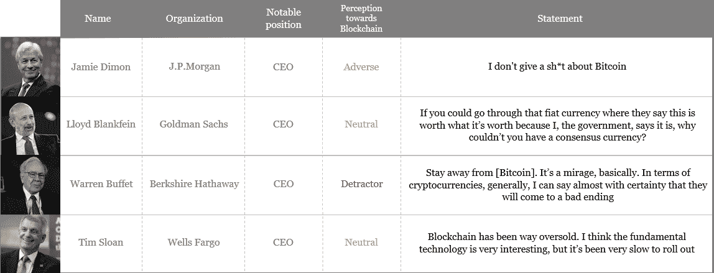
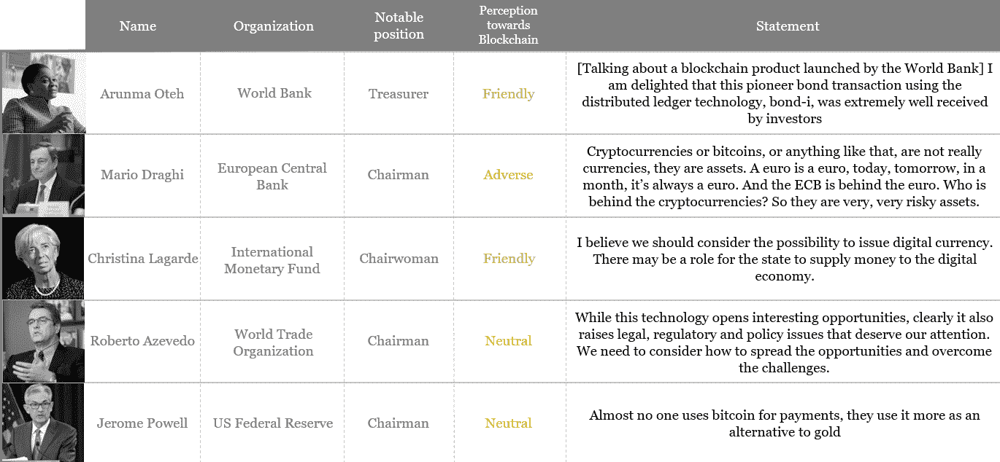

# 定义您的需求

根据 IBM 的说法，首席执行官们倾向于对颠覆性的商业技术非常谨慎，主要是因为它们为新公司带来了更便宜和更快的市场准入，从而加强了竞争。另一方面，众所周知，许多企业因无法满足不断变化的需求而倒闭，尤其是在数字时代。在最新的普华永道首席执行官调查([https://www . PwC . com/GX/en/CEO-Survey/2019/report/PwC-22 th-annual-global-CEO-Survey . pdf](https://www.pwc.com/gx/en/ceo-survey/2019/report/pwc-22nd-annual-global-ceo-survey.pdf))中，28%的企业将技术变革的速度评为极其令人担忧的威胁。通常，这些传统公司隐瞒了这样一个事实，即数字化已经迅速改变了产品和服务的消费方式，并努力利用新技术来应对客户和潜在客户的新消费行为。区块链不会让那些在数字化道路上表现出惰性的公司变得更容易。区块链不仅有助于改变消费习惯，还将改变数据流动和价值在经济行为体之间转移的方式，在一个更加协作和透明的系统中重塑资本主义经济，在这个系统中，价值以更加横向的方式共享。在这种情况下，企业在发展对区块链的一定程度的了解以避免在未来几年被边缘化方面面临着巨大的挑战。但是我们能从哪里开始呢？在这一章中，我们将探讨启动区块链项目的方法，指出必须考虑的风险和机会，潜在的和不可避免的成本，以及必须避免的陷阱。

在本章中，我们将讨论以下主题:

*   务实的推理
*   一辆区块链要多少钱？
*   挑战和问题
*   商界领袖对区块链的看法

# 决定实施区块链

任何组织都应该从问题陈述开始。从技术出发是没有意义的，因为它不能满足最终用户的需求。我经常把这种典型的行为比作抓起一把螺丝刀，看看用它能修好什么。当然，一些东西可能会在这个过程中被修复，但是主要的问题还没有被解决。因此，在想出解决办法之前，首先确定问题是很重要的。

一旦确定了问题，您应该关注可用的最简单的解决方案，并回答这个问题:*我是否真的需要区块链*？

对该问题的最终回答很可能由后续问题决定:

*   您是否需要确保信息的状态或允许数字值在利益相关者之间传递？
*   所有的利益相关者都是独立的吗？
*   利益相关者之间有信任吗？
*   在协作和分享信息方面有共同的兴趣吗？

这些可能是最重要的问题，尽管决策树可能更有帮助:

如果区块链是相关的，那么你应该用商业案例评估项目的潜在影响，这是任何 IT 项目的第一个要求。商业案例应包括各种问题，如如何解决监管约束、需要多少资源、应使用和实施哪些标准，当然，最终产品或服务满足哪些需求。进一步推动评估的一个方法是分析企业对变革的接受程度和风险承受水平。基于这些输出，确定一个合理的投资回报率将变得更加容易，从而决定是否投资。通过根据风险回报前提确定潜在收益，你将能够为你的项目，更广泛地说，为你的公司，彻底建立一个战略方法。

在启动区块链项目之前，您还应该确保所有利益相关方保持一致，并实施强有力的治理，即定义网络中每个人的角色和职责，以便您可以正确设计基础架构。区块链的成功主要在于节点的独立性。一个节点应该对其确认事务和信息存储的决定拥有主权；这就是为什么治理是一个真正的问题，当谈到区块链。不要忘记，这是赋予区块链权力的网络；因此，这可能是需要处理的最重要的组件。

只有这样，才应该将重点放在解决方案的设计和基础架构的选择上。概念验证阶段非常重要，因为技术正在快速发展，具体的演示对于描绘产品和量化收益非常有用。作为一个拥有持续改进和增量发布的敏捷企业，这是适应客户需求的关键。同时，企业应该建立必要的组织框架，包括工作组和沟通过程，以便开发、集成、生产和采用得到充分的支持。最终，如果我们希望能够交付项目，并确保提供足够的经济和技术支持，那么处理财务、营销和商业将成为强制性的。

为了帮助您构建路线图和业务案例，下面列出了可用于保持区块链项目正常进行的事项:

现在，您已经了解了是否要在您的组织中实施区块链项目，让我们来看看区块链项目的成本。

# 一辆区块链要多少钱？

如果我告诉你区块链项目的价格变化很大，你可能不会感到惊讶。根据您想要实现的目标，使用某个基础设施而不是另一个基础设施将会导致从小到大的投资范围。例如，通过公共区块链认证官方文件的成本将主要包括网络为处理交易而征收的交易费，这不是一个非常昂贵的区块链应用程序。如果我们希望从现有的基础设施中受益，使用公共区块链有时是最便宜的解决方案。除了交易费用之外，成本主要取决于在其上开发应用程序和关注用户体验。

另一方面，如果你从零开始建立一个完整的网络，就像脸书正在做的 Libra 项目，他们创建了一个基于新编程语言的集成智能合同的许可区块链，这可能需要更多的钱。导致总成本变化的主要因素是为基础设施供电的网络规模，以及有多少用户将利用这项服务。将许可的区块链升级到企业间级别会变得非常昂贵。

一般来说，一个区块链项目从识别和定义一个完整用例的 5000 美元到工业化解决方案的 200000 美元不等。知道一个区块链开发人员每天的成本在 500 美元到 900 美元之间，您可能会考虑将这些服务外包给价格低得多的外部公司，尽管距离可能会成为项目执行的一个负面因素。然而，这个缺点可以通过从路线图中消除一个困难的任务来抵消:与 R&D 研究人员、数据分析师、业务分析师和开发人员一起建立一个多技能档案团队。需要注意的是，仅仅依靠区块链专家并不能帮助您实现端到端的流程。

总而言之，寻找、构建或选择最合适的区块链需要权衡:其功能、交易速度、安全级别、共识机制和集中化程度。简而言之，部署区块链的成本主要取决于以下因素:

*   选择运行基础设施的功能
*   交易的速度
*   所选共识协议的复杂性
*   区块链的类型(公共、私有或半私有)
*   网络的规模(节点和验证器)

如果您选择基于云的解决方案(例如，与微软、AWS、IBM 或 Oracle 合作)，开发成本会迅速降低，而订阅和维护费用会增加。对于第一个区块链项目，这些解决方案听起来更合适，因为它在迭代最终产品或服务时提供了灵活性和更多的操作空间。正如我之前所说，需要关注基于云的解决方案；然而，对于一些提供托管在他们自己的服务器上的解决方案的提供商来说，分散化的程度可以降低到零。这种基础设施实际上消除了实现区块链的主要兴趣，因为它创建了单点故障并消除了节点的独立性。

截至 2019 年 6 月，市场非常分散，决策者很难选择最佳方案。越多的公司开始关注区块链，区块链平台就越多，一个演员脱颖而出的可能性就越小。尽管有越来越多的实时产品和媒体报道，但没有人能说出在公开和许可的区块链之间，哪个基础设施会兴旺发达。然而，市场上已经有像样的解决方案，如以太坊或超级账本，它们受益于大量的资金支持。

关于 ICO 的行为，大部分成本将包括数据隐私合规性，如完成 KYC 和反洗钱政策，以及营销策略，如白皮书编辑、奖金计划(奖金计划是在 ICO 期间向社交媒体影响者、博客作者和视频制作者提供的激励措施，以帮助项目民主化和传播信息)，以及沟通计划。关于 ICO 的外部专业知识，也可以增加额外费用，如令牌和令牌组学的类型学(令牌组学是单词*令牌*和*经济学*的组合。这是关于建立项目标志的经济选择，如生态系统、商业模式、用途、法律方面或技术结构。).

# 挑战和问题

现在，您已经掌握了实施区块链项目的所有关键，您必须意识到传统区块链项目管理和运营通常会遇到的一些缺点，这些缺点可能会抑制您的主动性:

*   涉众的过程因组织而异，甚至因行业而异。
*   利益相关者管理运营和运行项目的系统之间存在许多差异。
*   组织经常在他们自己的部门或服务之间使用不同的工具，这不利于实现过程中的可追溯性和平滑性。由于这些部门通常各自为政，因此缺少一种更广泛的方法来整合、透明和互操作流程。

这些问题使数据管理变得困难，增加了成本，延长了延迟，从而导致质量和用户体验因整个流程效率低下而下降。如果您愿意使用区块链来满足客户的期望并改进产品或流程，您确实应该考虑通过提高所有利益相关者的意识、进行深入的市场研究以及选择合适的 IT 基础设施来解决上述问题。这与评估网络的*竞争*水平相一致，也就是说，评估数据的敏感程度以及可能为某人提供竞争优势的利益相关者之间共享的价值。您必须分析项目一旦部署，是否会给最终用户带来更大的好处，而不是给网络的某些参与者带来更大的好处。

商业食品、运输、汽车或奢侈品行业的公司都在*竞争*的背景下工作，共同的目的是为客户带来附加值，尽管他们面临持续的竞争。就此而言，请记住，区块链让公司有可能在不信任的环境中与其他公司联合采取行动，不应该为一个或几个参与者提供竞争优势，因为这可能导致独立性的丧失，从而阻碍对网络内真相的评估。

无论如何，一个项目从初始化到产业化，都不是一帆风顺的。例如，尽管大多数解决方案都是开源的，并允许使能器帮助您快速理解采矿和智能合同，但在这个过程中还是有不可避免的步骤。采用更广泛的方法，第一步是选择平台。请注意，以太坊通常是一致的，并且已经被许多公司选择用于他们的项目，因为它的动态性、它的大型支持社区和丰富的文档。一旦选择了平台，就必须初始化区块链，即创建节点并触发第一个块，包括选择数据速度、事务时间跨度和块的大小。这一步可以外包给负责设置和配置的服务提供商。最终，共识协议的选择将取决于您的项目是否包含一定程度的保密性和限制(换句话说，是专用网络)或者您是否选择了公共区块链。正如我们之前提到的，在专用网络中使用工作证明是不相关的，因为节点是可识别的，它们不需要基于计算能力进行竞争。最后一步，您必须部署您的应用程序和智能合约，在检查服务提供商是否处理了它们之后，仍然要小心开发它们所使用的编程语言。不要忘记申请本身就是你写商业案例并选择区块链的原因。不用说，你的最终产品必须方便最终用户；否则，为什么选择区块链？

# 商界领袖对区块链的看法

本章旨在建立全球商业领袖和高管的关键陈述和观点。听取他人的意见通常很有趣，尤其是那些影响和刺激我们视觉的人。一项新兴技术通常会引起经济学家、科学家和政治家的批评，他们会就金融、伦理、环境、社会或技术的利弊展开辩论。

在过去的几年里，区块链吸引了越来越多的开发人员、商人、科学家和精通技术的人，他们为技术的民主化和其适用性做出了贡献。但这个生态系统也面临着一些批评和质疑，有时来自技术领导者或实际上首先引领技术进步的人。随着区块链越来越受欢迎，批评开始增多。从 2017 年开始，由于比特币和其他加密货币的价格上涨，区块链经历了大量的媒体报道。关于单词**区块链**的研究在 2017 年出现了 370 万次，当年有 50 万篇文章是关于这个主题的。

# 讨论中的区块链

早在 2015 年达沃斯世界经济论坛期间，区块链首次被提及为有助于向更加数字化和互联互通的世界过渡的六大趋势之一。断言这一估计的报告是基于对 800 多名 IT 高管和专家的调查，由软件和社会未来全球议程委员会进行的。据估计，到 2027 年，全球 GDP 的 10%将存储在区块链上([http://www3 . weforum . org/docs/WEF _ GAC 15 _ technical _ Tipping _ Points _ report _ 2015 . pdf](http://www3.weforum.org/docs/WEF_GAC15_Technological_Tipping_Points_report_2015.pdf))，并将对新兴市场的金融包容性、可交易资产、财产记录以及可交换服务和价值产生重要影响。这在当时是一个非常大胆的预测，由商业软件联盟(Business Software Alliance)的总裁兼首席执行官维多利亚·埃斯皮内尔(Victoria Espinel)提出，商业软件联盟是一个代表卡巴斯基实验室(Kaspersky Lab)等全球最大软件制造商的贸易团体，其使命是防止软件侵犯版权。毫无疑问，她的报告是非常有洞察力的，因为她添加了一个结论，即如果区块链被广泛采用，政府将需要重新思考他们的传统运作模式和他们的运作方式。

Espinel 的报告与前一年在同一事件中发表的声明形成鲜明对比。受邀参加达沃斯论坛的美国财政部长杰克·卢(Jack Lew)表达了对比特币的怀疑，宣称他将确保比特币不会被用于资助怀有恶意的非法活动。这一声明公然承认了他对比特币和区块链的误解。事实上，比特币的去中心化基础设施阻止了任何权威接管网络，控制价值在个人之间转移的方式。不幸的是，由于这个原因，比特币被用作购买非法产品的手段，但在网上全球毒品市场“丝绸之路”被关闭([https://www.wired.com/2015/04/silk-road-1/](https://www.wired.com/2015/04/silk-road-1/))之前，情况基本如此。

杰克·卢发表声明后不久，摩根大通首席执行官杰米·戴蒙(Jamie Dimon)也表达了同样的观点，称他的公司与比特币无关，因为执法部门最终会终结比特币。具有讽刺意味的是，摩根大通现在是加密领域的主要参与者，并推出了自己的代币 JPM 币和自己的区块链基础设施 Quorum。杰米·戴蒙(Jamie Dimon)称比特币是一种欺诈，并威胁要解雇任何从事比特币交易的分析师后不到两年，这一明显的转变就发生了。至少可以说，这是一个非常有趣的行为，特别是因为摩根大通区块链全球负责人 Umar Farooq 就这项技术发表了完全不同的演讲:

"*我们一直相信区块链的潜力，我们支持加密货币，只要它们得到适当的控制和监管。作为一家受到全球监管的银行，我们相信我们有一个独特的机会，在监管机构的监督下以负责任的方式发展这种能力*。”

回到 2014 年，戴蒙的声明激起了维珍著名创始人理查德·布兰森爵士的反应。在接受《美国消费者新闻与商业频道》采访时，这位亿万富翁企业家声称，在未来几年，将会出现一种全球数字货币，它将取代银行和其他传统货币([https://www . CNBC . com/2014/01/24/Branson-bit coin-take-the-Mr-Dimon . html](https://www.cnbc.com/2014/01/24/branson-on-bitcoin-take-that-mr-dimon.html))。布兰森还利用这次采访宣布，他的商业太空飞行维珍银河的机票可以用比特币购买，这使其成为首批接受比特币作为支付手段的国际企业之一。

从那时起，水已经流过了桥，更多的区块链拥护者已经听到了他们的声音。其中最著名的可能是唐·塔斯考特。这位加拿大企业高管和顾问毕生致力于支持企业及其商业战略，以及技术在企业成长道路中的作用。2017 年，Tapscott 成立了区块链研究所，这是一个着名的独立全球智库，目前正在帮助一百多个项目研究区块链对企业、政府和社会的影响。根据 Tapscott 的说法，区块链不应与人工智能、大数据或**物联网** ( **物联网**)等任何其他新技术相提并论，而是作为启动第四次工业革命的触发器，这一层将允许全新技术在完全数字化的世界中自主交易。

与唐·塔斯考特的乐观姿态形成鲜明对比的是，区块链最强硬的批评者，即努里埃尔·鲁比尼，他在 2019 年 1 月 25 日宣布，区块链不比 Excel 电子表格好多少。预测了 2008 年经济危机的《经济学人》也将区块链定义为有史以来最被夸大的技术。

除了扔石头，鲁比尼认为，由央行支持的数字货币与区块链或加密货币没有任何关系，因为它们由一个单一实体集中管理。这一声明出人意料地受到了区块链生态系统的欢迎，因为它证明了除了鲁比尼不祥的观点之外，他实际上非常清楚区块链的内在价值。

# 高调的观点

我可以继续列举全球不同领导人的不同观点，描述自 2009 年比特币诞生以来区块链提出的每一个积极、消极、令人惊讶、欺骗或鼓励的说法，但数字比一千个字更有意义。

查看以下 IT/数字/创新高管和领导者:

在银行/投资管理人员和领导者中，我们有:

在经济学家中，我们有以下几种:

在公共机构的高管和领导人中，我们有:

如你所见，根据高管的背景、行业、职位和国籍，观点是非常不同的。显然，与金融行业的同行相比，IT 行业的领导者似乎更倾向于支持区块链和加密货币，尽管他们中的一些人对如何实际达到生产级别的适用性和广泛的市场接受度保持谨慎。在经济学家中，争论仍然很激烈，尤其是关于区块链涉及的经济概念和社会理论。对于公共机构领导人来说，重要的是要注意到这个话题尚未被调查，尽管世界银行在 2018 年 8 月通过在私人版以太坊上发行 1.08 亿美元的区块链债券迈出了一大步。总而言之，区块链和加密货币已经在不同的业务领域和主要高管之间进行了广泛的讨论。

# 摘要

在本章中，我们强调了识别和理解业务问题是解决问题的关键，因为这是构建成功解决方案的最佳起点。我们发现，有时区块链并不合适，因为该解决方案不涉及选择区块链时的强制性标准，例如存储信息的需求或参与者利益的一致性。但是，当区块链成为合适的解决方案时，必须解决许多不同的评估、要求和主题。其中包括投资回报、监管约束或团队对变革的接受程度。除了这些开放点之外，我们试图回答一个关于区块链成本的困难但必要的问题，它最终可以被认为是一个包含特定功能的常规 IT 项目，尤其是在启动 ICO 时。然后，我们讨论了必须考虑的挑战和问题，如共识协议、网络中的竞争程度和数据管理。最后，我们展示了一些来自世界各地的企业高管和领导人的观点和声明，并展示了经济学家、政治家、技术专家和经理对区块链的看法是多么的不同。

作为本书的全球结论，关键的要点是，区块链，就像大数据、人工智能或物联网一样，应该被视为一个使能因素，而不是一个目标。这本书展示了决策者或任何好奇的商业人士掌握这一新技术，理解其应用和围绕它的所有利害关系的所有关键。有人强调说，区块链并不是所有商业问题的解决方案，而是一个新兴的计算基础设施，能够在没有任何可信第三方的情况下以对等方式交换数字价值。考虑到这一点，区块链可能给当前经济体系带来的破坏程度就很明显了。我们的目的并不是要赞扬区块链，而是要展示它的所有特点以及我们在过去几年中目睹的成功故事。

我想回顾一下，数字时代公司的目的不是建立去中心化的账本、连接的对象或强大的算法。客户和投资者不会根据公司部署了多少数字化解决方案、为数字化做好准备花了多少钱或者对变化的反应速度来评判公司。相反，一家公司应该能够回答特定的业务问题，达到特定的业务目标，并满足客户的需求，以便在数字时代取得成功，并保持盈利增长。作为决策者，重要的是不要混淆手段和目标，也就是说，要能够区分目标和帮助你实现目标的工具。总的来说，创新就是这些工具之一。

成为创新型组织的途径可以定义为四个步骤。首先，应该把重点放在标准化上，即简化和记录流程。标准化不涉及任何数字解决方案，只是对流程和利益相关者的精确描述。第二，通过纸质流程的数字化实现非物质化将使组织做好被颠覆的准备。第三，伴随非物质化而来的工业化，通过在生产过程中实施各种方法，能够实现连续的生产节奏。最后但同样重要的是，在最后一层实现创新工具(无论是机器人、算法还是区块链)将有助于提高速度、降低风险和增加可靠性。这种心态应该被每一个愿意在组织中实施新技术的 C-Level 高管所接受，因为这需要耐心和强烈的变革意愿。区块链也不例外，尤其是它的新奇和难以理解。

在本书中，我们探讨了它是如何工作的，它由什么组成，它带来了什么样的经济和法律挑战，它是如何被领先的组织实施和解决的，以及它是如何部署的。我真诚地希望你现在对这项新兴技术有了更好的理解，你已经掌握了足够多的方面来形成你自己对区块链的看法。我也希望你有足够的兴趣关注它的未来，当然，你可以继续向你的团队、同事、亲戚或朋友解释它。作为最后一点，这里有一个关于什么是区块链的电梯间推介:

基本上，区块链采取数据库的形式，它是:

*   **去中心化**:它不归任何人所有，没有人是总账的所有者
*   **共享**:这个数据库分布在整个网络上，每个人都拥有一份最新的分类账
*   **透明**:网络中的任何人都可以调出分类账的历史记录，查看过去发生了什么，哪些交易在什么时候得到了验证
*   **安全**:借助加密算法，网络上发生的每一笔交易或信息都以双方同意的方式进行验证，并存储在账本中

从更技术性的角度来看，区块链是一种结合了三种主要技术的分布式分类账:

*   **对等网络**:计算机通过互联网相互连接并交换信息
*   共识机制(consensus mechanism):网络上的计算机同意向账本添加信息，这要归功于一个协议，该协议允许在不到 50%不诚实的网络中达成共识
*   **密码术**:运行算法以确保分类账的安全性，其中每笔交易或验证的信息都是不可改变的