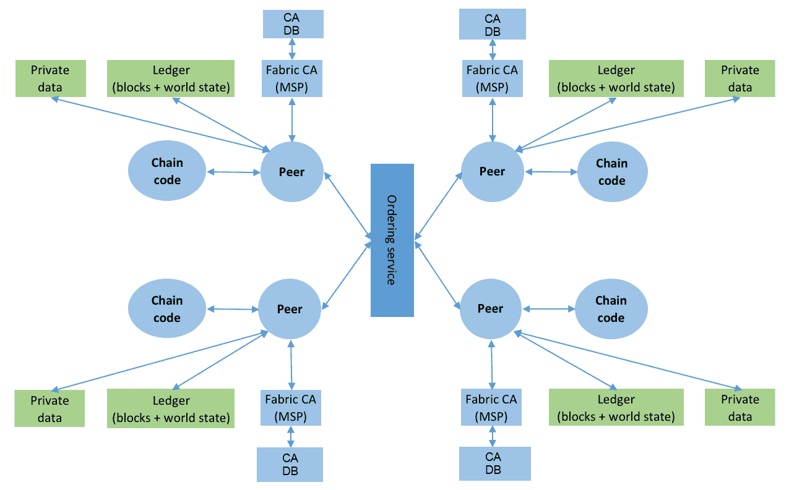

# Hyperledger 结构安全性

Hyperledger Fabric 是一个模块化的区块链系统。它被设计成允许一组已知的行动者在区块链网络中参与和执行行动(所谓的**许可区块链**)。由于其模块化特性，它可以部署在许多不同的配置中。Hyperledger Fabric 的不同部署配置对网络运营商及其用户具有不同的安全影响。

在其核心，Hyperledger Fabric 是一个**公钥基础设施** ( **PKI** )系统，因此它继承了与此类系统相关的安全性(和复杂性)。在撰写本书时，Hyperledger Fabric v1.1 已经发布。

设计和实施区块链网络的安全方面已在前面的应用程序章节中讨论过，我们打算在此给出 Hyperledger Fabric 的安全功能的更广泛和更深入的视图。

我们将在本章中讨论以下主题:

*   影响安全性的设计目标
*   Hyperledger 结构架构概述
*   网络引导和治理——迈向安全的第一步
*   强身份 Hyperledger 结构网络安全的关键
*   链码安全
*   常见的安全威胁以及 Hyperledger Fabric 如何减轻这些威胁
*   超分类帐结构和量子计算
*   一般数据保护法规(GDPR)注意事项

# 影响安全性的 Hyperledger 结构设计目标

要了解 Hyperledger Fabric 的安全性，陈述影响安全性的关键设计目标非常重要:

*   现有成员应确定如何在网络中添加新成员:网络中新实体的准入必须得到网络中现有实体的同意。这个原则是创建一个许可的区块链的基础。代替允许任何实体下载软件并连接到网络，网络成员必须同意接纳新成员的策略(例如，通过多数投票)，然后由 Hyperledger Fabric 执行该策略。投票成功后，新成员的数字证书可以添加到现有网络中。
*   **现有成员应确定如何更新配置/智能合约**:与第一项类似，网络配置或部署或实例化智能合约的任何更改都必须得到网络成员的同意。综上所述，第一点和第二点赋予 Hyperledger Fabric 执行许可区块链的能力。
*   **分类账及其关联的智能合约(链码)可限定相关对等方的范围，以满足更广泛的隐私和保密要求**:在公共区块链网络中，所有节点都有一份区块链分类账的副本，并执行智能合约。为了保持机密性和范围，有必要创建对等组来存储与其事务相关的分类帐(Hyperledger Fabric 中的渠道和渠道私有数据)。更新此类分类帐的智能合同(Hyperledger Fabric 中的链码)的范围将是此类组的成员。

只有参与信道的成员必须确定如何更新该信道的配置。

*   **智能合约可以用通用语言编写**:Hyperledger Fabric 的主要设计目标之一就是允许用 Go、JavaScript 等通用语言编写智能合约。显然，如果在执行之前没有适当的治理和过程来验证和部署智能合同，则允许智能合同执行的通用语言会使系统暴露于各种安全问题。即使这样，用通用语言编写的智能契约也应该被合理地隔离，以限制它们可能无意中造成的损害。
*   **必须保证交易的完整性**:交易是智能合约的执行。事务的创建和存储方式必须能够防止事务被其他对等方篡改，或者能够轻松检测到任何篡改。通常，确保事务完整性需要使用加密原语。
*   **应该利用行业标准**:系统应该利用行业标准来声明数字身份(例如 X.509 证书)，以及对等体之间的通信(例如 TLS 和 gRPC)。
*   **从交易执行和验证中分离共识**:现有的区块链网络将交易执行和验证与在区块链网络的节点之间达成共识相结合。这种紧密耦合使得一致性算法难以实现可插拔性。
*   **随处可插拔性**:系统应采用模块化设计，每个模块应可通过标准接口进行插拔。插入特定于网络的模块的能力赋予了 Hyperledger Fabric 在各种设置中使用的灵活性。然而，这种可插入性也意味着基于超分类帐结构的区块链网络的两个不同实例可能拥有不同的安全属性。

为了理解这些原则如何影响 Hyperledger Fabric 的安全性，我们将简要说明 Hyperledger Fabric 的体系结构。请参考前面的章节了解深入的架构。

# 超级分类帐结构体系

Hyperledger Fabric 体系结构如下所示:



超级分类帐结构体系

# 结构 CA 或成员服务提供商

**会员服务提供商** ( **MSP** )负责为组织的同行和用户创建数字身份。对等体的身份必须在现有网络中配置，以便新的实体参与信道。

结构 CA 是 MSP 的一种实现，它提供了一种从网络成员注册用户并向他们颁发数字身份(X.509 证书)的机制。结构 CA 通常在 Docker 容器中运行。每个结构 CA 都配置有一个后端数据库(默认为 SQLite，带有其他选项，如 PostgreSQL 或 MySQL ),该数据库存储已注册的身份及其 X.509 证书。结构 CA 不存储用户的私钥。

# 同龄人

对等方是参与 Hyperledger 结构网络的实体。其身份由其相应的成员资格服务提供商确定。一个对等点负责部署和实例化 chaincode、更新分类帐、与其他对等点交互以共享与事务相关的私有数据，以及与订购服务和它运行的智能契约(前面的屏幕截图中的 chain code)交互。与 Fabric CA 类似，对等体通常也在 Docker 容器中运行。

# 智能合同或链码

**智能合约** ( **SC** )是应用逻辑，用高级语言编写，比如 Go 或者 JavaScript 当成功执行时，它读取或写入最终提交到分类帐的数据。智能合同不能直接访问分类帐。一个对等体可以部署零个或多个作为 Docker 容器运行的智能合约。对等方还可以部署智能合约的多个版本。

# 分类帐

每个对等体维护一个数字分类帐，其中包含一个对等体收到的所有已提交交易的记录。分类帐中的条目以键/值对的形式存储。对同一项的更新将用新值替换该项的当前值。当然，旧值将保留在分类帐中。为了提供对键的最新值的有效查询，节点可以将每个键的最新值存储在数据库中，例如`CouchDB`。该数据库在 Hyperledger 结构中被称为世界状态。

请注意，对等方将只从其参与的通道接收提交到其分类帐的块。

一个对等体可以是零个或多个通道的一部分，这些通道在前面显示 Hyperledge Fabric 体系结构的图表中没有显示。

# 私人数据

借助 Hyperledger Fabric v1.1 版，对等方可以通过链私有数据实验功能([https://jira.hyperledger.org/browse/FAB-1151](https://jira.hyperledger.org/browse/FAB-1151))选择与渠道中的一部分对等方共享私有数据。分类帐中的块仅包含此类数据的散列，而私有数据存储在分类帐之外的私有状态数据库中。

# 订购服务

排序服务负责从对等方接收已执行的事务，将它们组合成块，并在同一通道上向其他对等方广播。然后，接收交易块的对等方在将其提交到其分类帐之前对其进行验证。订购服务的责任是不要在另一个频道上混合用于一个频道的块。

在 1.0 版的 Hyperledger Fabric 中，对等方将向订购服务发送一个事务(键和相关值，以及读/写集)。因此，订购服务可以看到与交易相关的所有数据，这从保密的角度来看是有意义的。在 Hyperledger Fabric 的 1.1 版中，客户端可以将交易数据的哈希值(输入和读/写集)发送到订购服务，同时将与交易相关的数据直接传输到相关对等方。

目前，订购服务是使用 Kafka 实现的，并且是**崩溃容错** ( **CFT** )，但不是**拜占庭容错** ( **BFT** )。但这是一个时间点声明，因为 HyperLedger 据称是可插拔的，其中包括共识服务。可插拔性意味着将来可能会有其他共识模型可用。

尽管现在在描述 Hyperledger 结构体系的图表中显示，对等方、订购方和结构使用可插入的加密服务提供者，这允许他们插入新的加密算法以及硬件安全模块(HSM)([https://en.wikipedia.org/wiki/Hardware_security_module](https://en.wikipedia.org/wiki/Hardware_security_module))来管理加密密钥。

# 网络引导和治理——迈向安全的第一步

当组织决定使用 Hyperledger Fabric 组建许可的专用区块链网络时，他们需要考虑几个治理方面，这将最终决定网络的整体安全状况。这些治理方面包括但不限于以下内容:

*   如何引导网络并验证成员以创建网络？网络引导是创建区块链网络的第一步。不同的实体可以一起创建一个网络。实体可以进行带外通信，以与第一组成员达成一致，并建立治理策略，这将在接下来讨论。
*   **新实体加入网络(或渠道)的流程是怎样的？**制定接纳网络新成员的政策至关重要，这取决于网络的业务需求。
*   谁可以在网络中的对等体上部署和升级链码？定义一个流程对于防止恶意或有缺陷的链码被安装在一个或多个对等体上很重要(参见 [*第七章*](07.html) ，*一个商业网络示例*)。
*   将存储在区块链上的数据模型是什么？成员必须就将存储在区块链中的通用数据模型达成一致；否则，区块链不可能对其成员有用。数据模型应该被设计成不会与任何合规性法规相冲突，例如**通用数据保护法规**(**GDPR**)([https://gdpr-info.eu/](https://gdpr-info.eu/))。

# 创建网络

当实体决定创建网络时，他们必须决定以下事项:

*   谁将运行订购服务
*   网络中有多少不同的订购服务实例

订购服务的角色至关重要，因为根据配置的不同，它可以看到流经它的所有通道的事务散列或事务数据。因此，决定形成网络的实体可以选择信任其中一个实体来充当订购服务；他们也可能决定信任中立的第三方来运行订购服务。

订购服务可以查看它所服务的所有渠道的所有交易(散列或键/值对)。因此，如果有必要对订购服务隐藏事务数据，则只有事务中的读/写集的散列应该被发送到订购服务，同时在对等体之间直接交换数据。

一旦为网络建立了订购服务，就必须用创始成员的对等方的数字身份对其进行配置。这通常是通过在订购服务 genesis 块中配置对等方的数字证书来完成的。对等体还必须配置订购服务的数字身份。

# 添加新成员

在创建网络或渠道时，创始成员还必须确定如何接纳新成员加入网络或渠道的政策。默认情况下，这个策略就是大多数人选择的策略(即二选二、三选二、四选三等等)。成员可以决定网络中接纳新成员的任何其他政策。接纳新成员的政策的任何变化通常将通过商业协议来决定。一旦达成协议，可以根据当前策略更新通道配置，以反映接纳新成员的新策略。

创建 genesis 块以及更新配置的后续事务都是特权操作，并且在被确认之前必须得到对等管理员的批准。

# 部署和更新链码

一旦成员决定加入渠道，他们可以选择部署和实例化 chaincode(也称为智能契约)。chaincode 定义了如何更新或读取通道范围内的键/值对。链码可以定义它的认可策略，也就是说，它可能需要来自网络中一些或所有对等体的数字签名。由于 Hyperledger Fabric 的许可性质，必须在对等体上安装和实例化需要对等体数字签名(背书)的链码。参见 [*第五章*](05.html) ，*揭露网络资产和交易*， *[第七章](07.html)* ，*一个商业网络示例*，了解更多关于部署 chaincode 的详细信息。

在信道上部署链码之前，预计网络成员会想要检查链码以确保它符合他们的策略。这个过程可以被形式化为链代码治理，要求所有相关成员进行强制性审查，这些成员将在他们的节点上实例化链代码。

建立一个在您的对等体上部署链码的流程，包括手动审查和验证链码作者的数字签名。

# 数据模型

实体必须就将存储在区块链中的数据模型达成一致，而这又是由链码决定的。部署了链码的网络或通道的创始成员将决定存储在通道中的键/值对。此外，成员将决定哪些数据将与其他成员共享，哪些数据将对自己或成员子集保密。数据模型的设计应该使其对成员希望完成的业务功能有用，合理地面向未来，并且不会无意中泄露信息。回想一下，通道中的所有参与对等体存储提交的事务(以及它们的键/值对)。

建立用于定义将存储在渠道中的数据模型的流程。

前面的步骤可以总结如下:

1.  确定谁将运行订购服务
2.  在订购服务中配置创始会员的数字身份
3.  创建渠道并确定接纳新成员的渠道政策
4.  定义编写、分发、部署和实例化链代码的治理
5.  建立数据模型

# 强身份 Hyperledger 结构网络安全的关键

强身份是 Hyperledger 结构安全性的核心。创建、管理和撤销这些身份对于基于 Hyperledger 结构的部署的操作安全性至关重要。身份由 MSP 发布。如前面的 Hyperledger Fabric 架构图所示，一个逻辑 MSP 通常与一个对等体相关联。MSP 可以发布任何适当的密码签名身份。Hyperledger Fabric 附带一个默认的 MSP(Fabric CA)，它向经过身份验证的实体颁发 X.509 证书。

# 引导结构 CA

Fabric CA 可以配置 LDAP 服务器或以独立模式运行。在独立模式下运行时，必须使用存储在结构 CA 后端数据库中的引导标识进行配置。默认情况下，使用 SQLite 数据库，但是对于生产用途，可以配置 PostgreSQL 或 MySQL 数据库。通常，如果使用独立服务器，则结构 CA 服务器与其数据库之间的连接通过 TLS 进行。

对于本章的其余部分，我们将把在没有 LDAP 服务器的情况下运行时的引导实体称为`ca-admin`。在没有 LDAP 服务器的情况下运行时，必须在结构 CA 的引导上提供`ca-admin`及其密码。

为了让`ca-admin`与服务器交互，它必须向结构 CA 服务器提交一个**证书签名请求** ( **CSR** )以获得一个 X.509 证书。这个过程被称为**登记身份**，或者简称为**登记**。有了 X.509 证书后，`ca-admin`就可以添加其他用户，我们将在下面解释。

将管理员用户的密码保存在安全的地方，因为这是您组织的`root`用户。像对待一个 Linux 用户的密码一样安全地对待它。使用它来创建具有适当权限的新用户，但不要将此用户用于任何其他操作，除非出现违反安全的情况，在这种情况下，此用户可用于撤销所有已注册实体的证书。

结构 CA 在系统中提供两个关键操作，即注册和登记。接下来我们将解释这些操作。

# 注册

注册操作将由标识符指定的新实体添加到结构 CA。注册操作不会为用户创建 X.509 证书；这发生在注册操作中。由结构 CA 的管理员来定义向网络添加新用户的策略和过程。

注册用户时，有一些要点需要考虑:

*   如果策略是注册电子邮件地址，则在后续注册时，用户的电子邮件地址将被编码到证书中。在 Hyperledger Fabric 中，发出交易的用户的证书与提交的交易一起存储在分类帐中。任何人都可以解码证书并确定电子邮件地址。

仔细确定新实体将如何在结构 CA 中注册，因为当这些实体发布交易时，它们的数字证书将最终出现在分类帐中。

*   另一个需要考虑的要点是允许该用户注册多少次。每次注册都会导致向用户颁发新的证书。在 Hyperledger Fabric 中，注册的新用户可以注册有限次，也可以无限次注册。通常，正在注册的新实体不应被配置为注册次数不受限制。

对于新用户，最好将最大注册数设置为 1。此设置确保实体与其数字证书之间存在一对一的对应关系，从而使实体撤销的管理更加容易。

*   使用 Hyperledger Fabric 1.1，现在可以在实体注册时为其定义属性。然后，这些属性被编码到实体的 X.509 证书中。

在独立模式下使用时，注册成功后，结构 CA 将创建一个唯一的密码(如果在注册期间未提供)。然后，`ca-admin`可以将这个密码传递给正在注册的实体，该实体将使用这个密码创建一个 CSR，并通过注册操作获得一个证书。

# 默认结构角色

要在结构 CA 中注册实体，实体应该有一组角色。结构 CA 配置有以下默认角色:

```
hf.Registrar.Roles = client, user, peer, validator, auditor
```

结构 CA 可以注册具有以下角色之一的任何实体:

```
hf.Registrar.DelegateRoles = client, user, validator, auditor
```

结构 CA 可以撤销角色:

```
hf.Revoker = true
```

结构 CA 也可以注册中间 CA:

```
hf.IntermediateCA
```

要在 Fabric CA 中注册身份，实体必须具有`hf.Registrar`。角色由逗号分隔的值列表来指定，其中一个值等于注册的身份类型。

其次，调用者身份的从属关系必须等于正在注册的身份的从属关系或者是其前缀。例如，隶属关系为`a.b`的调用者可以注册一个隶属关系为`a.b.c`的身份，但不能注册一个隶属关系为`a.c`的身份。

# 登记

拥有 ID 和密码的实体然后可以向结构 CA 注册它自己。为此，它生成一个公钥/私钥对，创建一个 CSR，并将其与注册的 ID 和 secret 一起发送到结构 CA 的`Authorization`报头中。认证成功后，服务器将 X.509 证书返回给注册的实体。发送注册请求的实体负责管理私钥。这些私钥应该以安全的方式存储(例如硬件安全模块)。

# 证书签名请求中允许哪些加密协议？

CSR 可以定制生成 X.509 证书和密钥，支持**椭圆曲线数字签名算法** ( **ECDSA** )。支持以下密钥大小和算法:

| **尺寸** | ASN 1 oid | **签名算法** |
| --- | --- | --- |
| 25 six | prime256v1 | 带 SHA256 的 ecdsa |
| 38 four | secp384r1 | 带 SHA384 的 ecdsa |
| fifty-two one | secp521r1 | 带 SHA512 的 ecdsa |

# 撤销身份

由于 Hyperledger Fabric 是一个 PKI 系统，因此必须明确撤销必须从系统中删除的身份。这是通过标准的**证书撤销列表**(**CRL**)来完成的。CRL 需要在所有组织中同步，以确保每个人都能检测到被吊销的证书。向其他对等体分发 CRL 需要带外机制。

# 在结构 CA 中管理用户的实际考虑

通常，组织有自己的身份(LDAP)服务器来管理其员工。一个组织可以选择加入一个或多个 Hyperledger 结构网络，但每个网络中只能加入一部分员工。每个网络的结构 CA 的管理员可以选择在每个网络中注册雇员的子集。

由于雇员必须生成和管理私钥以成功加入 Hyperledger 结构网络，所以管理私钥及其相应的数字证书的责任在于组织的雇员。管理私钥和数字证书是非常重要的，这可能会给员工带来过度的负担，并可能导致员工无意中暴露密钥。由于雇员需要记住他们的组织颁发的凭证(例如，用户名和密码)来登录到组织系统，所以组织可以选择代表其参与一个或多个 Hyperledger 结构网络的雇员来管理私钥和证书。根据行业的不同，私钥可能存储在硬件安全模块中，这将使篡改密钥变得不可行。硬件安全模块的精确配置超出了本章的范围。

# 链码安全性

在 Fabric 中，智能合约也被称为 **chaincode** ，可以用 Go 或 JavaScript 编写。链码必须安装在对等体上，然后显式启动。启动时，每个代码在一个单独的 Docker 容器中运行。以前版本的 chaincode 也运行在单独的 Docker 容器中。

运行链码的 Docker 容器可以访问虚拟网络以及整个网络堆栈。如果在将链码安装到对等体上之前没有仔细检查链码，并隔离对该链码的网络访问，则可能导致恶意或错误配置的节点探测或连接连接到同一虚拟网络的对等体。

操作员可以配置策略来禁用链码 Docker 容器上的所有传出或传入网络流量，除了白名单中的节点。

# chaincode 如何与其他签署方共享？

组织必须建立与参与 Hyperledger 结构网络的其他组织共享链码的流程。由于链码必须安装在所有认可的对等体上，因此在与其他对等体共享链码时，有必要通过加密机制来确保链码的完整性。请参考 [*第八章*](08.html) ，*区块链网络中的敏捷性*，了解关于共享链代码的方法的更多详细信息。Nettitude[https://wiki . Hyperledger . org/_ media/security/technical _ report _ Linux _ foundation _ Fabric _ August _ 2017 _ v 1.1 . pdf](https://wiki.hyperledger.org/_media/security/technical_report_linux_foundation_fabric_august_2017_v1.1.pdf)在对 Hyperledger Fabric 进行的安全评估中也强调了这个问题

# 谁可以安装 chaincode？

要在对等体上安装 chaincode，实体的证书必须安装在对等体的节点上(存储在本地 MSP 中)。由于安装 chaincode 是一个高度特权的操作，应该注意只有具有管理能力的实体才有能力执行这个操作。

# 链码加密

实体可以选择在链码调用时使用 AES 加密密钥来加密密钥/值对([https://github . com/hyperledger/fabric/tree/master/examples/chain code/go/enccc _ example](https://github.com/hyperledger/fabric/tree/master/examples/chaincode/go/enccc_example))。加密密钥被传递给 chaincode，后者在发送建议之前对值进行加密。需要解密该值的实体(例如，签署交易)必须拥有密钥。期望这样的加密密钥然后以带外方式与其他对等体共享。

# 基于属性的访问控制

您可能还记得 [*第 4 章*](04.html) ，*用 Golang 设计数据和事务模型*，Hyperledger 1.1 增加的新特性之一是基于属性的访问控制。在注册实体时，可以为实体指定属性，然后在注册时将这些属性添加到 X.509 证书中。属性的例子包括一个角色名称，例如由参与网络的组织所同意的“审计员”。当执行 chaincode 时，它可以在调用或查询操作之前检查身份是否具有某些属性。简单地说，这允许应用程序级属性通过 X.509 证书向下传递到链代码中。

# 基于属性的访问控制的利与弊

在证书中编码属性有它自己的优点和缺点。一方面，与身份相关的所有信息都编码在证书中，因此可以根据属性做出决定。另一方面，如果必须更新属性，例如，用户移动到不同的部门，则必须撤销现有证书，并且必须颁发具有一组新属性的新证书。

# 常见威胁以及 Hyperledger Fabric 如何减轻这些威胁

Hyperledger Fabric 针对一些最常见的安全威胁提供保护，并采用共同责任模式来解决其他问题。在下表中，我们将总结最常见的安全威胁，包括 Hyperledger Fabric 是否解决了这些威胁，以及节点/网络运营商如何或是否有责任解决这些威胁:

| **威胁** | **描述** | **总账结构** | **网络/节点运营商** |
| 电子欺骗 | 使用令牌或其他凭证冒充授权用户，或泄露用户的私钥。 | 结构证书颁发机构为其成员生成 X.509 证书。 | 管理网络参与者之间的证书撤销列表分发，以确保被撤销的成员不能再访问系统。 |
| 篡改 | 修改信息(例如，数据库中的条目)。 | 加密措施(SHA256，ECDSA)的使用使得篡改不可行。 | 源自织物。 |
| 拒绝 | 一个实体不能否认谁做了什么。 | 使用数字签名跟踪谁做了什么。 | 源自织物。 |
| 重放攻击 | 重放交易以损坏分类帐。 | Hyperledger 结构使用读/写集来验证事务处理。由于无效的读取集，事务重播将失败。 | 源自织物。 |
| 信息披露 | 因故意违规或意外暴露而暴露的数据。 | Hyperledger Fabric 支持使用 TLSv1.2 进行传输加密。它不加密静态分类帐数据(由操作员负责)。关于系统中所有对等体及其事务的信息都暴露给订购服务。 | 运营商有责任通过遵循信息安全最佳实践以及静态加密来防止信息泄露。 |
| 拒绝服务 | 使得合法用户很难访问系统。 | 这是操作员的责任。 | 防止系统拒绝服务是运营商的责任。 |
| 特权的提升 | 获得对应用程序的高级访问权限。 | 未经手动审查访问权限，已颁发的身份无法升级其访问权限(例如，创建身份)。 | Hyperledger 结构在 Docker 容器中运行链码。网络/节点运营商的责任是限制访问和运行具有适当限制的链码容器。 |
| 勒索软件 | 使用加密或其他方法来防止访问文件系统上的数据。 | 这是操作员的责任。 | 运营商有责任确保勒索软件无法阻止对节点账本的访问。 |

# Hyperledger 结构中的交易隐私

Hyperledger Fabric 的主要设计考虑之一是提供交易的隐私和机密性。Hyperledger Fabric 提供了许多旋钮来实现这些目标。

# 通道

仅打算与网络中的节点子集共享数据的 Hyperledger 结构节点可以通过通道来这样做。在这些情况下，只有参与通道的对等体可以存储事务数据；不属于通道的对等方看不到事务数据，因此无法存储它。但是，这些数据是向订购服务公开的。稳健的通道设计将解决参与者之间的隔离、数据隐私和保密性，以及具有稳健审计能力的受控/许可访问。

# 私人数据

信道中的对等体可以选择确定它们将与哪些其他对等体共享它们的数据。私有交易数据在对等体之间对等传递，而只有交易数据的散列被广播给订购服务和不共享该数据的对等体。

# 加密交易数据

对等体也可以选择在发送交易数据进行背书之前对其进行加密。但是，签署交易的对等方可能需要查看数据。必须使用带外机制在这样的对等体之间交换加密密钥。

# 超分类帐结构和量子计算

Hyperledger Fabric 使用椭圆曲线加密技术对交易进行数字签名。椭圆曲线加密依赖于数学技术，可以使用量子计算([https://en.wikipedia.org/wiki/Post-quantum_cryptography](https://en.wikipedia.org/wiki/Post-quantum_cryptography))来加速。但是，Hyperledger Fabric 提供了一个可插入的加密提供程序，允许用其他算法替换这些数字签名算法。此外，根据 NIST 信息技术实验室主任的说法，量子计算对区块链系统安全的影响至少需要 15 到 30 年才能成为现实([https://www . coin desk . com/DC-区块链-hearing-sees-call-for-congressional-commission/](https://www.coindesk.com/dc-blockchain-hearing-sees-call-for-congressional-commission/))。

# 一般数据保护法规(GDPR)注意事项

**通用数据保护条例**(**GDPR**)(【https://gdpr-info.eu/】T4)是一部欧盟法律，它定义了个人数据是如何被获取、处理并最终从计算机系统中删除的。在 GDPR，个人数据的定义非常广泛，包括姓名、电子邮件地址和 IP 地址。

根据设计，区块链创建了一个不可变的、永久的、可复制的数据记录。基于 Hyperledger Fabric 的区块链网络显然将包含这三个属性。因此，从 GDPR 的角度来看，在区块链的网络上存储无法删除或修改的个人数据具有挑战性。同样，了解个人数据与谁共享也很重要。

Hyperledger Fabric 的渠道和渠道私有数据功能提供了一种机制，用于确定共享数据的实体。对于通道私有数据，数据从不存储在区块链上，但其加密哈希存储在链上。通过治理过程，对等体可以确定与其他对等体共享这些数据。Hyperledger Fabric 中的渠道私有数据功能可能提供一种机制来存储链外的个人数据，确定与谁共享此数据，同时通过存储在区块链中的加密哈希来维护此数据的完整性。

Hyperledger Fabric 还在数字分类帐中存储创建交易的实体的 X.509 证书。这些 X.509 证书可以包含个人数据。在 1.1 版中，Hyperledger Fabric 提供了一种基于零知识证明来证明身份的机制，同时隐藏了属性的实际值。然后，这些基于零知识证明的凭据将存储在分类帐中，代替传统的 X.509 证书，并可能有助于实现 GDPR 合规性。

# 摘要

在本章中，我们首先介绍了与安全性相关的 Hyperledger Fabric 的设计目标。所描述的所有这些点都被认为是考虑到了结构的安全性。我们简要研究了 Hyperledger 结构安全性，了解了身份在结构安全性中的重要性。我们还研究了链码安全性。

Hyperledger 本身就擅长处理威胁。我们深入探讨了常见的 Hyperledger 安全威胁以及 Fabric 如何减轻这些威胁。

我们还简要了解了量子计算对 Hyperledger 结构的影响。