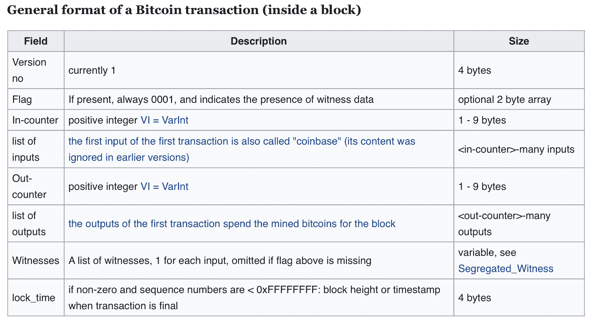
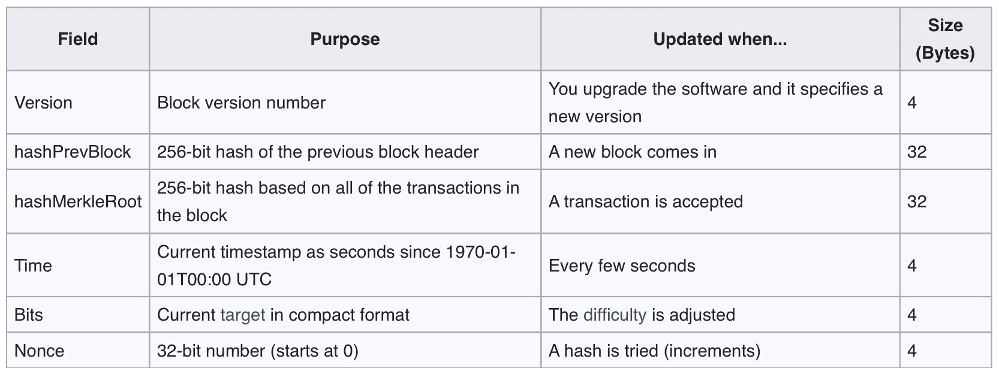
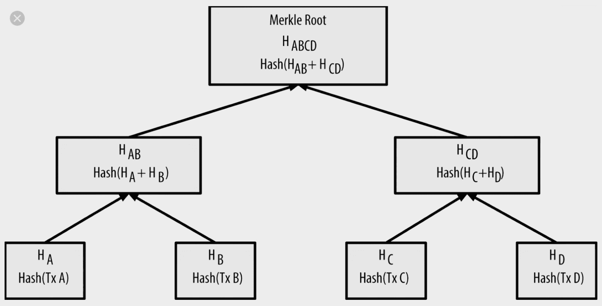
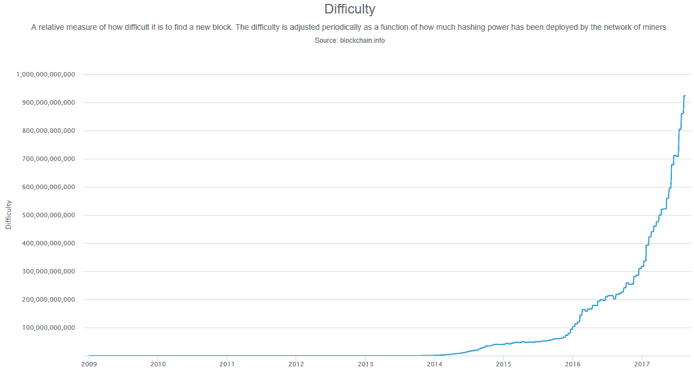

# 区块链技术简介

在本章中，我们将概述区块链及其关键概念，如加密和哈希算法、分布式分类帐、事务、块、工作证明、挖掘和共识。我们将详细介绍区块链技术之母比特币。我们通过指出比特币的一些限制以及以太坊如何解决这些限制来简要介绍以太坊。虽然比特币和以太坊是公共区块链的例子，但 IBM 的 Hyperledger 被用作企业区块链的例子。在这一章的最后，我们提到了区块链的发展:区块链 1.0，2.0，3.0，以及基于它们的用例的其他版本。具体来说，我们将涉及以下关于区块链的主题:

*   区块链的系谱类比
*   比特币共识机制
*   浅谈总账
*   区块链进化

# 谱系类比

其中一位作者最近在北京参加了一个中国大学的母校聚会，区块链成为了一个热门话题。杨教授是一位非常受人尊敬的校友和学者，他著有关于密码学和公共数据安全的书籍，他用系谱学来描述一个。这是一个经过深思熟虑的类比，因为它直观而容易地解释了区块链。这里借用这个类比来说明这项技术背后的基本思想。

在过去的中国，一个氏族(同姓)的每个家庭都有保存一份该氏族家谱的习俗。当家庭成员因婚姻或子女出生以及收养而发生变化时，新成员的名字将出现在每个副本中。然而，新成员必须在名字被加入之前被部落接受。在有些情况下，由于各种原因，婚姻没有得到大多数部族的认可。在这种情况下，新成员的名字不会被输入家谱。换句话说，当一个新成员加入一个家族时，这个消息会被传播到这个家族的其他家族。如果部落一致同意接受新成员，每个家庭都会更新他们的家谱以反映这一变化。另一方面，如果氏族决定不接受新成员，这个名字就不会被加进去。家谱可用于验证目的。例如，如果一个陌生人声称自己是这个家族的成员，或者两个姓氏相同的人急于想知道他们是否有相同的祖先，有了家谱，就很容易验证这一点。这一结果将被接受，因为由于上述共识和分散记录，家谱被认为是可靠的，除非大多数家庭同意，否则很难操纵。

区块链具有家谱的许多特征。它们总结如下:

*   像一个由许多相关家族组成的氏族一样，区块链网络由节点组成。每个节点就像一个家庭。
*   就像每个家庭都保存一份家族谱系的副本一样，区块链的每个节点都保存着链条上发生的所有交易的副本，从最开始的地方开始。所有交易的集合是一个**分类账**。这使得区块链成为一个分散的数据仓库。
*   家谱始于氏族的共同祖先和有直接关系的名字，如父母和子女，它们由一条线连接起来。类似地，分类账由块组成。根据区块链的类型，每个块包含一个或多个交易。(后面你会看到，比特币或以太坊上的块托管多个交易，而 R3 的 Corda 使用一个只有一个交易的块)。交易就像名字，区块类似于隐形盒子，里面装着情侣的名字。根祖先的等价物被称为**起源块**，它是区块链的第一个块。类似于链接父块和子块的线，散列从当前块指向其祖先块，稍后将对此进行更详细的解释。
*   与向家谱添加新名字的共识机制一样，比特币区块链使用一种称为工作证明的机制来决定是否可以将某个区块添加到链中。就像族谱一样，一个块加到一个链上之后，除非一个人占有了网络计算能力的大多数(这叫 51%攻击)，否则很难改变(黑掉)。
*   家谱提供了一个家族历史的透明度。类似地，区块链允许用户查询整个分类账或只是分类账的一部分，并找出硬币的运动。
*   因为每个家庭都有一份家谱的副本，所以即使由于自然灾害、战争或其他原因丢失了许多副本，也不太可能丢失家谱。只要至少有一个家族存活下来，家谱就存活了下来。类似地，只要至少有一个节点存在，分散式分类帐就会存在。

虽然谱系学是解释区块链的一些关键概念的一个很好的类比，但它们并不相同。不可避免地，有一些特征是他们所没有的。例如，区块链广泛使用加密和散列来保护数据和阻止黑客。家谱没有这样的需要。因此，接下来我们远离谱系类比，长期解释关键的区块链概念。

# 比特币

区块链技术最初引起人们的注意是因为,**比特币**区块链，这是一个由中本聪撰写的白皮书概述的想法，并于 2008 年 10 月发表在 metzdowd.com 的密码学邮件列表上。它描述了**比特币数字货币** ( **BTC** )并被命名为*比特币:一个点对点的电子现金系统*。2009 年 1 月，中本聪发布了第一个比特币软件，推出了网络和第一个比特币加密货币单位:BTC 币。

# 为什么是比特币

比特币的诞生正好发生在 2008 年金融危机之后，那是自大萧条以来最严重的经济危机。这不是巧合。比特币加密货币的发明者旨在解决人们对金融机构的幻灭感，金融机构在风险控制方面的巨大失败导致了 2008 年金融危机。

金融机构扮演的一个基本角色是作为中介实体，将不信任方聚集在一起以促进交易。例如，零售银行从个人那里吸收剩余资金，并向需要资金的个人或公司放贷。支付给货币供应者和借款者的利息差额就是银行提供中介服务收取的费用。金融机构在提供这些服务方面非常成功，在推动全球经济发展方面发挥着举足轻重的作用。然而，这种商业模式存在许多缺陷。以下是一些例子:

*   缓慢:完成一笔金融交易通常需要几天时间。例如，完成和结算一笔跨境汇款需要三天时间(在最初输入订单之后)。要实现这一点，机构内和跨机构的多个部门和应用系统必须协同工作，以促进交易。再比如股票交易。一个投资者雇佣一个经纪人来输入一个订单，该订单将被发送到证券交易所。在这里，经纪人或者是交易所的会员，或者将订单发送给另一个具有会员资格的中介机构。在交易所的买方和卖方之间找到匹配后，交易细节由双方记录，并分别发送到他们的后台。后台团队与清算所合作进行清算和结算。双方完成证券(股票)和现金的所有权交换动作需要 T + 3。
*   昂贵:金融中介在提供这些服务时通常收取高额费用。例如，一家美国银行通过从美国向另一个国家的收款人汇款，可以收取 10 到 30 美元的服务费。在股票交易的情况下，一个提供全面服务的经纪人通常收取几十美元或更多的交易费用。即使有折扣经纪人，投资者也需要为每笔交易支付 7-10 美元。
*   **易被黑客攻击**:由于客户的详细信息和交易信息保存在机构内的集中区域，因此容易被黑客攻击，导致严重的财务损失或客户个人机密信息泄露。最近，JP 摩根(2014 年有 8300 万个账户被黑客攻击)、Target(2013 年有多达 7000 万客户的信息被黑客攻击)、Equifax(2017 年有 1.48 亿美国消费者的信息被黑客攻击)等声誉良好的公司都发生了备受瞩目的个人数据泄露事件。
*   **不透明**:金融机构保留交易的详细和汇总信息。然而，大部分信息不对个人客户公开，这导致了信息不平等。在跨境资金转移的例子中，汇款人和收款人都必须等待三天才能知道交易是否成功完成。如果交易失败，就必须启动漫长的调查。想象一下，如果接收者处于紧急情况，需要立即获得资金。尽管客户不得不支付高额费用，但这种服务并不令人满意。

有了区块链技术，上述问题就迎刃而解了。在比特币区块链的情况下，要转移的基础资产是数字货币 BTC。跨境 BTC 交易不超过 1 小时即可完成。不需要结算，因为交易和结算是一个动作。这笔交易的成本只是通过银行转账的一小部分。例如，**美国银行** ( **美国银行**)最近发布的一份报告称，通过区块链转账的费用是美国银行收费的 1/6000。然而，对于一些客户来说，等待一个小时仍然太长了。 **Ripple** ，全球汇款支付提供商，1 分钟内完成。

比特币这个词经常引起混淆，因为人们会交替使用这个词来表示三种东西:加密货币、区块链和协议。为了避免混淆，我们用 BTC 来指代加密货币，用比特币来指代区块链和相应的使用分布式账本的网络。对于协议，我们将完整地拼写出**比特币协议**或简称为协议。

# 对等网络

为了解释比特币的工作原理，让我们来看看完成跨境交易的现有商业模式涉及哪些步骤:

*   客户通过访问银行分行或通过网络输入订单。汇款人提供订单的详细信息，如金额、汇款货币、收款人姓名、收款货币、收款人的银行名称、账户和分行号码以及 SWIFT 号码。在这里， **SWIFT** 代表**环球银行金融电信协会**，这是一个由金融机构使用的信息网络，通过标准化的代码系统安全地传输信息和指令。SWIFT 为每个金融机构分配一个唯一的代码，可互换地称为**银行识别码** ( **BIC** )、SWIFT 代码、SWIFT ID 或 ISO 9362 代码。
*   发送银行接受订单，并验证发送方是否有足够的可用资金。
*   银行收取费用，并通过执行外汇交易将汇款货币的余额转换为收款货币的金额。
*   发送银行向 SWIFT 输入包含所有所需信息的转账报文。
*   收到消息后，收款银行验证收款人的账户信息。
*   在成功验证并按照协议在发送银行和接收银行之间结算资金后，接收银行将金额贷记到接收者的账户。

由于涉及多个步骤、实体和系统，前面的活动需要几天才能完成。

一个比特币网络连接着世界各地的电脑。每台计算机都是地位平等的**节点**，除了被称为**矿工**的节点子集，它们选择扮演验证事务、构建模块和链接到链的角色。使用比特币，完成转账的商业模式包括以下步骤:

1.  发送者使用**电子钱包输入 BTC 的数量、要提取的比特币的地址以及要转移的比特币的地址。**
2.  交易请求由电子钱包发送到比特币网络。
3.  在矿工成功验证交易并将其提交给网络后，BTC 现在可供接收者使用。

比特币的转移速度要快得多(如果使用 Ripple，只需 1 小时或几分钟)，原因如下:

*   交易和结算是一个步骤。这就避免了耗时且昂贵的对账过程。
*   因为 BTC 没有国界，所以不需要外汇交易。它可以在世界范围内自由快速地移动。
*   银行之间不需要资金结算，因为交易不需要中间银行。

在发送者或接收者更喜欢使用法定货币如美元、英镑、CNY 或日元的情况下，加密货币市场可用于 BTC 和法定货币之间的转换。一个名为 CoinMarketCap 的网站列出了这些市场:【https://coinmarketcap.com/rankings/exchanges/】T2。截至 2018 年 9 月 21 日，共有 14044 个市场。市值排名前三的分别是 https://www.binance.com/()、OKEx()、火皮( [https://www.huobi.pro](https://www.huobi.pro) )。

对等网络可以连接世界各地的节点。然而，仅仅是物理连接不足以使两个不信任方相互交易。为了允许他们交易，比特币采取了以下措施:

*   每个节点都将所有交易的完整副本保存在分散式分类账中。这使得对链上的事务的任何改变都是不可行的。
*   总帐事务处理按块分组。通过保存所有先前块的事务的散列，非起源块被链接到其先前的块。因此，更改事务需要更改当前事务块和所有后续事务块。这使得破解分散的账本变得极其困难。
*   比特币通过使用工作证明共识算法解决了双重消费问题，即同一 BTC 被消费两次。
*   哈希广泛用于保护各方的身份，并检测块中发生的任何变化。
*   公钥/私钥和地址用于隐藏交易方的身份，并对交易进行数字签名。

有了这些措施，不信任方会因为以下原因而放心交易:

*   该事务是不可变的和永久的。任何一方都不能单方面宣布交易无效。
*   不可能有双重支出。
*   交易和结算同时发生；因此不存在结算风险。
*   身份受到保护。
*   交易由双方签字，这将避免任何未来的法律纠纷。

# 密码术和散列函数

密码术或密码学是对在对手存在的情况下确保通信安全的技术的研究。在过去，密码术是加密的同义词。现代密码学非常依赖数学理论和计算机科学。它还利用了其他学科的作品，如电子工程、通信科学和物理学。

密码算法的设计是基于这样一种假设，即随着可预见的计算硬件的进步，任何对手都不可能根据这些算法来解密加密的消息。换句话说，从理论上讲，对加密信息进行解码是可能的，但实际上这样做是不可行的。因此，这些算法被定义为计算安全的。理论研究(例如，并行或整数因式分解算法)和计算技术进步(例如，量子计算机)可以使这些算法实际上不安全，因此，加密算法需要不断调整。

加密是将明文转换成难以理解的文本(称为密文)的过程。解密是相反的，换句话说，从难以理解的密文回到明文。

比特币挖矿使用的加密算法是哈希函数。哈希函数是将任意大小的数据映射到固定大小的数据的函数。哈希函数返回的值称为哈希值或简称为哈希。加密散列函数允许容易地验证一些输入数据映射到给定的散列值。然而，反过来——当输入数据未知时——从哈希值重构输入明文实际上是不可行的。换句话说，哈希是单向操作。哈希函数的另一个值得注意的属性是，输入明文的微小变化将导致完全不同的哈希值。这一特性对于保护信息是可取的，因为黑客对原始数据的任何微小改变都会导致明显不同的散列。

两种常见的哈希算法是 MD5(消息摘要算法 5)和 SHA-1(安全哈希算法):

*   MD5 由 Ronald Rivest 于 1991 年开发，它将输入的明文映射成 128 位的哈希值。MD5 消息摘要校验和通常用于在传输或存储数字文件时验证数据完整性。已经发现 MD5 存在大量漏洞。
*   SHA-1 是一种加密哈希函数，将输入明文映射为 160 位(20 字节)哈希，称为消息摘要，通常显示为 40 位数的十六进制数。SHA-1 由美国国家安全局设计，是美国联邦信息处理标准。

SHA-256 是 SHA-1 散列函数的后继者。它是可用的最强的散列函数之一，并且还没有受到任何损害。SHA-256 为文本生成一个几乎唯一的 256 位(32 字节)签名。例如，*我的测试字符串*映射到`5358c37942b0126084bb16f7d602788d00416e01bc3fd0132f4458d
d355d8e76`。通过一个小小的改变，我的测试字符串的散列值*是`98ff9f0555435
f792339d6b7bf5fbcca82f1a83fde2bb76f6aa95d66050887cc` *，*一个完全不同的值。SHA-256 产生 2^256 可能的散列。还没有出现两个不同的输入产生相同的 SHA-256 散列的情况，这个问题在密码学中被称为冲突。即使有最快的超级计算机，发生碰撞所需的时间也比我们宇宙的年龄要长。因此，SHA-256 被比特币用于加密。*

# 分布式分类帐、块、事务处理、地址和 UTXO

在金融机构，分类账是记录金融交易的账簿。类似地，比特币通过地址维护一个用于记录 BTC 交易和余额的分类账。一个关键的区别是，银行的账本是集中的，比特币的账本是分散的。因此，银行的分类账更容易做假账。另一方面，比特币的账本很难做，因为人们必须在全球所有节点改变账本。

用户提交包含以下信息的交易:

*   转让 BTC 的来源
*   要转移的 BTC 数量
*   BTC 应转移到的目的地

根据 Wiki 网站，交易具有如下所示的一般结构:

源地址和目的地址都是 64 个字符的哈希。下面是一个地址的例子:`979e6b063b436438105895939f4ff13d068428d2f71312cf5594c132905bfxy1`。

*地址*这个术语有点混乱。程序员可能认为它是一个与磁盘或内存位置相关的地址。然而，它与物理位置无关。相反，它是一个逻辑标签，用于对已转移出/转移到它的 BTC 进行分组。在某种程度上，你可以把它想象成一个银行账号，然而它们之间有着根本的区别。例如，银行有一个集中的位置来保存帐户的元数据，例如所有者姓名、开户日期和帐户类型。此外，帐户余额是预先计算和保存的。在比特币中，地址上没有元数据，人们必须查询整个分类账，通过计算转入和转出地址的净比特币来找到地址的余额。地址只在比特币交易中引用。当一个地址的余额降至 0 时，任何将来从该地址提取 BTC 的请求将由于资金不足而使交易验证失败。

比特币利用 **UTXO** 模型来管理其 BTC 转移。这个术语是由加密货币引入的，它指的是一种未用完的交易输出*。这是尚未花费的区块链交易的输出，可以用作未来交易的输入。在比特币交易中，只有未用完的输出才能用作输入，这有助于防止重复支出和欺诈。因此，提交的事务导致删除区块链上的输入，并创建 UTXOs 形式的输出。持有相应私钥的所有者可以花费新创建的未用完的交易输出。换句话说，UTXO 是连续处理的，并且提交的事务导致在 UTXO 数据库中移除用完的硬币并创建新的未用完的硬币。*

像地址一样，BTC 不与任何物理对象相关联，例如数字令牌文件或实际铸造的硬币。相反，它只存在于分布式分类帐的交易中。例如，如果一个人想知道到目前为止铸造的 BTC 的总数，他必须遍历区块链上的所有非零平衡地址并将所有 BTC 相加。由于比特币的每一个节点都保留了一本账本，所以寻找答案只是花费计算时间的问题。

当用户在一个节点输入 BTC 交易请求时，安装在该节点的比特币软件将交易广播到所有节点。网络上的节点将通过检索包含输入地址的所有历史交易并确保来自这些地址的 BTC 是合法且足够的来验证交易的有效性。之后，挖掘节点开始通过收集已验证的事务来构建块。通常，一个比特币区块包含 1500 至 2000 笔交易。在解决数学难题的比赛中获胜的矿工将获得建造新积木并将其连接到链条上的角色。在比特币区块链上，大约每 10 分钟就会产生一个新的区块。截至 2018 年 9 月 21 日，比特币上已经创建了大约 542，290 个区块。比特币区块的结构如下所示:

这里，块标题包含以下字段:

nonce 的概念将在关于挖掘的小节中解释。hashPrevBlock 与 hashMerkleRoot 的值相同。Merkle 树散列根本质上是块中所有事务散列通过二叉树聚集结构的散列。下图解释了这个想法:

# 共识机制

如果有人花 1 美元买了一瓶水，这个人不可能花同样的 1 美元去买一罐可乐。如果一个人可以自由地双倍消费一美元，那么货币就会变得一文不值，因为每个人都会拥有无限的数量，而赋予货币价值的稀缺性也会消失。这就是所谓的**重复支出问题**。在 BTC，双重消费是指不止一次使用同一个比特币的行为。如果这个问题得不到解决，BTC 就失去了它的稀缺性，不能被用来促进两个不信任方之间的交易。比特币核心网络通过共识机制防止双重花费。为了解释比特币共识机制是如何工作的，我们首先描述一下 **PoW** ( **工作证明**)和挖掘的概念。

如前所述，一个矿工需要在其他矿工之前解决一个困难的数学难题，以获得当前新区块的建造者的角色，并获得工作报酬。解决数学问题的工作叫做 **PoW** 。

为什么需要电力？想想看:在一个由相互不信任的各方组成的网络中，为了使网络发挥作用，需要比不诚实的攻击者更多的诚实方。想象一下，如果为一个新的块收集了足够的事务，一个矿工被允许立即构建新的块。这简直成了一场谁能快速完成足够交易的竞赛。这为恶意攻击者大开方便之门，他们通过包含无效或虚假的交易来攻击网络，并总是赢得比赛。这将允许黑客自由地双倍消费 BTC。

因此，为了防止攻击者引入坏的事务，参与节点需要足够的时间窗口来验证每个事务的有效性，确保 BTC 尚未被花费。因为每个节点都维护分类帐的副本，所以诚实的矿工可以跟踪历史并确保以下事项以确认交易的有效性:

*   交易的请求者确实拥有 BTC。
*   相同的 BTC 没有被分类帐中的任何其他交易花费。
*   相同的 BTC 没有被候选块内的其他事务消耗。

这个时间窗口当前被设置为大约 10 分钟。为了强制执行 10 分钟的等待时间，比特币要求一名矿工解决一个足够困难的数学难题。这个难题只需要简单的计算。矿工们不得不多次重复相同的计算，以消耗足够的 CPU 时间来达到网络平均每 10 分钟构建一个新块的目标。反复猜测的过程称为**采矿**和装置(特制)称为**采矿钻机**。

因为为了赢得采矿竞赛，矿工需要在硬件上大量投资，所以这些矿工致力于采矿工作，并且旨在获得足够的 BTC 来支付运行采矿操作的成本并获得利润。截至 2018 年上半年，给予一名获胜矿工的奖励是 12.5 BTCs。你可以通过访问 CoinMarketCap 网站([https://coinmarketcap.com/](https://coinmarketcap.com/))找到 BTC 的价格。截至 2018 年 9 月 21 日，一个 BTC 的交易价格约为 6710 美元。因此，12.5 BTC 大约值 83，875 美元。

根据比特币协议，采矿是发行(铸造)新 BTC 的唯一途径。给矿工丰厚的报酬有三个目的:

*   补偿矿工在硬件上的投资。
*   包括采矿运营成本，如公用事业费用，由于采矿现场部署了大型采矿钻机，人力工资和场地租金可能会很高。
*   激励矿工保护网络免受恶意黑客的攻击。为了不损失比特币交易中心和采矿基础设施的价值，矿商有动力维护比特币网络。如果比特币被黑客攻破，比特币的声誉将严重受损，BTC 价格将直线下跌。这正是比特币发明者所希望的:让更多的好矿工比坏矿工来解决重复支出问题。

可以发行的 BTC 总数被确定为 2100 万。截至今日(2018 年 9 月 19 日)，已发行约 1700 万 BTC。比特币协议定义了一个动态调整支付率的规则，剩余的 400 万枚硬币预计在未来 122 年内不会被完全开采。以下几点解释了如何动态调整块创建支出率:

*   该速率每 210，000 块改变一次。它是链上块高度的函数，genesis=0，使用 64 位整数运算进行计算，例如:(50 * 100000000) >> (height / 210000)。该比率最初从 50 个 BTC 开始，在 210，000 块下降到 25 个 BTC。在 420，000 块时，它下降到 12.5 BTCs，当网络达到 6，930，000 块时，它将最终下降到 0。

# 分支

比特币区块链可能会有两条潜在路径，因为矿商不一定会以相同的方式收集交易并与候选区块签约，也不一定会同时进行。黑客攻击或软件升级等其他原因也可能导致路径发散。分裂补丁被称为**叉**。有临时分叉和永久分叉。

如果由于例如恶意攻击而发生永久分叉，则会发生硬分叉。同样，还有软叉的概念。硬分叉和软分叉都指对协议的彻底改变。硬分叉使先前无效的块/事务有效，而软分叉使先前有效的块/事务无效。

为了移除临时分叉，比特币协议规定应该使用最长的链。换句话说，当面对两条路径时，获胜的矿工会选择较长的链来连接新的区块。结果，较长的路径继续增长，失败的(较短的)路径上的块变成孤立的。比特币节点将很快丢弃或不接受这些孤立的区块。它们只将最长链上的块作为有效块。

在永久分叉的情况下，网络上的节点必须选择遵循哪条链。例如，由于比特币社区内部在如何处理可扩展性问题上存在分歧，比特币现金从比特币中分离出来。因此，比特币现金成为自己的链，并共享从 genesis 块到分叉点的交易历史。截至 9 月 21 日，比特币现金的市值约为 80 亿美元，排名第四，而比特币的市值为 2150 亿美元。

# 采矿和难度等级

还有一个问题需要解决:如何保持 10 分钟的新积木搭建速度。如果不采取任何措施，开采率将因以下因素而改变:

*   网络上的矿商数量会随着 BTC 价格的变化而变化
*   技术进步使得采矿钻机的速度越来越快
*   采矿钻机的总数各不相同

比特币调整数学难题的**难度等级**，以便将构建速率保持在 10 分钟。难度等级是根据最近的积木加入的速度计算出来的。如果添加新方块的平均速度小于 10 分钟，难度级别将会增加。如果平均速度超过 10 分钟，就会下降。难度等级每 2016 块更新一次。下图显示了比特币难度水平的历史趋势。

我们还没有谈到实际的挖掘算法。假设当前难度是找到第一个前导字符为 0 的哈希值。在比特币中，解决一个谜题的过程，也就是挖矿，需要一个挖矿者遵循以下步骤:

*   首先，找到构造中的块的 SHA-256 散列。
*   如果得到的散列有一个前导 0，挖掘者就解决了这个难题。矿工将区块链接到节点上的分类帐，并获得奖杯，12.5 BTCs。矿工节点向所有节点广播消息。网络上的所有其他节点和挖掘器验证答案(通过映射块信息加上 nonce 来获得相同的散列)并验证分类帐的整个历史，确保块包含有效的交易。
*   如果通过检查，网络上的所有节点都将该块添加到它们的分类帐副本中。矿工们开始在下一个新区块工作。
*   如果获胜的挖掘者是恶意攻击者，并且在块中包括不良交易，则这些交易的验证将失败，并且其他挖掘者将不会在其分类帐副本中包括该块。他们将继续在当前区块采矿。久而久之，包含坏块的路径将不再是最长的路径，因此，坏块将成为孤立块。这实质上是网络上的所有节点如何达成共识，只将好的块添加到网络中，并防止坏的块偷偷进入，从而解决了重复花费问题。
*   如果产生的散列不是以 0 开始，则允许挖掘器从 0 开始向输入文本附加一个序列号(称为 nonce ),并重试散列。
*   如果得到的散列仍然不包含前导 0，挖掘器将向输入文本添加另一个序列号 1，并获得一个新的散列。挖掘器将继续以这种方式尝试，直到找到第一个带有前导零的散列。

下面是明文和随机数如何一起工作的一个例子。原始明文是*输入字符串*，随机数从 0 到 1 变化:

*   **输入字符串** : `f23f4781d6814ebe349c6b230c1f700714f4f70f735022bd4b1fb69421859993`
*   **输入字符串 0** : `5db70bb3ae36e5b87415c1c9399100bc60f2068a2b0ec04536e92ad2598b6bbb`
*   **输入字符串 1** : `5d0a0f2c69b88343ba44d64168b350ef62ce4e0da73044557bff451fd5df6e96`

在比特币中，*调整难度等级*很大程度上是指改变所需的前导零数量。(实际的调整涉及到其他一些针对需求的挖掘器。)每次添加前导零都会显著增加平均尝试次数，因此会增加计算时间。这就是比特币如何保持平均 10 分钟添加新区块的速度。目前的比特币难度等级是 18 个前导零。

# 黑客——51%的问题

由于 BTC 价格上涨，采矿业务变得更有吸引力。投资正在涌入，涉及数千个或更多钻井平台的大型矿池已经加入网络，以便在首先解决难题并获得回报的竞赛中获得优势。对于没有从投资中获得大量资本的玩家，他们可以选择加入采矿池。当该池赢得一场比赛时，奖金将根据贡献的计算能力分配给每个参与者。

由于所谓的 **51** **%当一个矿工设法将计算能力累积到网络总计算能力的至少 51%时，就会出现这个问题。当这种情况发生时，矿工将有机会超过其他矿工。矿工可以用包含错误交易的块继续增加分类帐，因为该矿工有超过 50%的机会首先解决难题。很快，恶意矿工的账本将增长为最长的路径，所有其他节点都必须根据比特币的共识协议来保存这条路径。**

对于像比特币这样的大型成熟网络来说，51%问题并不是一个关键问题，主要原因如下:

*   一个完善的网络将吸引更多的参与方，并连接大量的节点。黑客购买必要的采矿设备需要极高的初始投资。当这样的网络受到攻击时，当消息公开时，加密技术的价格会迅速下降，黑客收回投资的机会很低。
*   在比特币的历史上，曾经有过积累了危险的高计算能力的矿池逼近这条线的情况。当池中的参与矿工意识到问题时，他们中的许多人选择离开池中。很快，池的计算能力降到了安全水平。
*   在一个小而不成熟的网络的情况下，一个矿工聚集超过 51%的计算能力并不困难。然而，这些网络的加密货币价值是最小的，它给黑客很少的经济激励来利用 51%的问题。

# 私钥和比特币钱包

如前所述，BTC 实际上并不存在。它们存在的唯一证据是当它们与地址相关联时，这些地址在事务中被引用。最初创建地址时，会生成一对公钥和私钥。公钥对公众是公开的，而私钥只由地址的所有者保存。当所有者想要花费他们的 BTC 的全部或一部分时，所有者提供用私钥签署的数字签名，并将 BTC 请求发送到比特币网络。换句话说，一个人必须知道地址和它的私钥才能使用 BTC。

如果所有者丢失了私钥，其关联的 BTC 将永久丢失。因此，建议将这些信息保存在安全的地方。将地址和私钥保存在不同的地方通常是一种好的做法。为了防止数字拷贝丢失，所有者应该保留打印输出的物理拷贝。为了使转换更容易，所有者可以打印一个二维码，然后在需要时扫描二维码。

比特币钱包应用程序可以帮助用户管理密钥和地址。人们可以用钱包做以下事情:

*   生成地址和相应的公钥/私钥
*   保存和组织 BTC 的信息
*   向比特币网络发送交易请求

在比特币中，私钥是 256 位长的哈希，公钥是 512 位长。它们可以转换成更短的十六进制长度。以下屏幕截图给出了一对公钥/私钥以及一个地址的示例:

比特币私钥也可以用以 5 开头的 51 个字符的字符串表示，公钥用 72 个字符的字符串表示。一个示例私钥是`5Jd54v5mVLvy
RsjDGTFbTZFGvwLosYKayRosbLYMxZFBLfEpXnp` ，一个示例公钥是`BFCDB2DCE28D959F2815B16F81798483ADA7726A3C4655DA4FBFC0E1108A8FD17B448A68` *。*

# 比特币脚本

人们可以安装以下开发工具来对比特币操作进行编程:

*   **NodeJS** :这是一个开源、跨平台的 JavaScript 运行时环境，在浏览器之外执行 JavaScript 代码。它允许程序员快速、轻松地编写和执行脚本。这些脚本可以编写为在 web 浏览器或服务器上运行。
*   BitcoinJS :这是一个 JavaScript 库，用于处理比特币及其加密功能。BitcoinJS 可用于生成公钥/私钥和地址。
*   **Blockchain.info** :这是一个公共 API，可以用来查询区块链，找出余额，并向网络广播交易。它可以用来实现一个比特币节点，并安装和运行一个比特币节点。

安装上述工具后，可以执行以下操作:

*   生成新的私钥并计算公钥
*   检查某个地址的余额
*   生成地址
*   构建新的交易
*   发送一个交易，其中涉及三个步骤:
    *   用输入和输出列表构建一个事务
    *   用所需的私钥签署交易
    *   向网络广播交易
*   建立一个托管账户
*   广播交易

# 其他地方

多亏了比特币，区块链技术吸引了全世界的关注。像任何新技术一样，它也有其局限性。比特币的许多变体被创造出来，以解决比特币的一个特定限制。在这里，我们提到其中的几个:

*   **比特币现金**:这是比特币链的一个硬分支，因为一群比特币核心开发者想用一种不同的方式来解决可扩展性问题。
*   **莱特币**:除了添加一个新区块的时间从 10 分钟减少到 2 分钟之外，这几乎与比特币相同。
*   Zcash :这是基于比特币的，但提供完全的支付保密性。
*   Monero 和 Zcash :两种替代硬币都通过使交易历史不可追踪来解决隐私问题，但它们实现了两种不同的解决方案。
*   **破折号**:这主要是提高用户友好性。例如，使事务不可追踪，并且用户不必在考虑将事务提交给链之前等待添加几个额外的新块。
*   **Namecoin** :这将仅用于交易 BTC 的比特币的用例扩展到提供域名服务。
*   **Peercoin** :这种 altcoin 解决了 PoW 的不足，对环境不友好，吞吐量低。相反，它采用利害关系证明来达成共识。基于这一规则，矿工根据其持有的硬币数量来验证大宗交易。换句话说，矿工的采矿能力与拥有的贵族数量成正比。
*   Primecoin :一名 Primecoin 矿工竞争成为第一个找到下一个最大质数的人。

# 艾瑟芬

不管上面提到的替代币在解决比特币的某些局限性方面做出了哪些努力，有几个基本问题尚未得到解决:

*   比特币和这些代用币都有一个特定的目的:交易 BTC 或代用币。
*   虽然程序员可以使用 BitcoinJS 之类的工具与网络进行交互，但生成的代码位于区块链之外，不能保证运行。该链本身没有直接在区块链上编码的图灵完整编程语言。
*   这些区块链是无国籍的，人们必须搜索整个分类账才能找到答案，例如铸造的 BTC 的总数。

针对这些问题，加拿大加密货币研究人员和程序员 Vitalik Buterin 在 2013 年末提出了以太坊的想法。该系统由一家在线众筹网站资助，于 2015 年 7 月 30 日上线，众筹网站预发行了 1190 万枚硬币。

以太坊的核心理念是建立一个通用的区块链，这样用户就可以解决广泛的商业问题，而不仅仅局限于加密货币转账。以太坊引入了一些新的关键概念:

*   在区块链上保存智能合同的概念
*   使用诸如 Solidity 之类的图灵完整编程语言实现智能合约的概念，并在区块链上运行代码片段

Solidity 最初是由 Gavin Wood 在 2014 年 8 月提出的。由 Christian Reitwiessner 领导的以太坊项目的 Solidity 团队后来开发了这种语言。它是五种语言之一，(Solidity，Serpent，LLL，Vyper 和 Mutan)，旨在针对**以太坊虚拟机** ( **EVM** )。

Nick Szabo 是一名程序员兼律师，他在 1996 年首次提出了术语*智能合同*。在他的博客中，Nick Szabo 将其描述为所有智能合约的鼻祖，自动售货机。
如今，区块链上的自动售货机与智能合约拥有完全相同的属性。自动售货机由硬编码的规则构成，这些规则定义了满足某些条件时要执行的操作，例如:

*   如果苏珊在自动售货机里投入一美元钞票，那么她将收到一袋椒盐卷饼。
*   如果汤姆投入一张五美元的钞票，汤姆将得到一袋椒盐卷饼和四美元的零钱。

换句话说，规则是由自动售货机物理定义和执行的。类似地，智能合约在程序代码中包含规则，这些规则在区块链上运行，并在满足特定条件时触发。

智能合同概念的引入意义重大:

*   智能合同是一个脚本化的法律文档。
*   合同中内置的代码存储在以太坊区块链上，不能被篡改或删除。这大大增加了法律文件的可信度。
*   该代码不能被停止，这意味着任何一方——无论该方多么强大——都不能命令或干扰智能合同代码的运行。只要满足某些条件，代码就会运行，法律定义的操作就会执行。
*   以太坊对于区块链就像操作系统对于电脑一样。换句话说，平台是通用的，不再只服务于一个特定的目的。
*   它现在有一个图灵完整的语言:坚固性。

# 企业块链-超级分类帐

以太坊的到来彻底改变了区块链技术。应用技术解决金融行业以外的商业问题已经变得可行。但是以太坊不够用的场景很多。以太坊的问题包括:

*   真正的企业应用程序，尤其是在金融行业，需要高吞吐量，这意味着每天可以处理数十亿笔交易。以太坊目前的形式最大容量为每天 140 万。比特币更惨:一天 30 万笔交易。在一次压力测试中，比特币现金达到 220 万。正在开发中的以太坊 2.0 的目标是达到每天 10 亿次交易，同时保持分散和安全的公共区块链。
*   许多金融市场，例如场外衍生品或外汇，都是基于许可的。以太坊或比特币支持的公共区块链不能满足这样的需求。

为了满足他们的需求，各行各业久负盛名的公司组成财团来从事企业区块链项目，这些项目只需获得许可。换句话说，节点在加入区块链网络之前必须获得批准。企业区块链的例子有 Hyperledger 和 R3 的 Corda。

2015 年 12 月， **Linux 基金会** ( **LF** )宣布创建 Hyperledger 项目。其目标是通过开发区块链和分布式分类账来推进跨行业合作。2017 年 7 月 12 日，该项目宣布其生产就绪的**Hyperledger Fabric**(**HF**)1.0。

目前，Hyperledger 包括五个区块链框架:

*   Hyperledger Fabric(**HF**):一个许可的区块链，最初由 IBM 和 Digital Asset 提供，旨在成为开发具有模块化架构的应用程序或解决方案的基础。它采用插件组件来提供共识和成员服务等功能。像以太坊一样，HF 可以托管和执行智能合约，这些合约被命名为 chaincode。高频网络由对等节点组成，执行智能合同(链码)，查询分类账数据，验证交易，并与应用程序交互。用户输入的交易被引导到订购服务组件，这最初是 HF 的共识机制。称为订购者节点的特殊节点验证交易，确保区块链的一致性，并将验证的交易发送到网络的对等体以及被实现为认证机构的**成员资格服务提供商** ( **MSP** )服务。
*   **Hyperledger Iroha** :基于 HF，专为移动应用设计。Iroha 由 Soramitsu、日立、NTT Data 和 Colu 提供。它采用了现代的、领域驱动的 C++设计。它实现了一种叫做 Sumeragi 的共识算法。
*   Hyperledger Burrow:Burrow 最初是由 Monax 和 Intel 提供的，是一个模块化的区块链，由客户按照 EVM 规范构建。
*   **Hyperledger 锯齿**:由英特尔贡献，它实现了一个共识算法，叫做**耗时证明** ( **诗人**)。PoET 旨在尽可能高效地实现分布式共识。锯齿支持许可和非许可网络。锯齿是为多功能而设计的。
*   Hyperledger Indy :最初由 Sovrin 基金会提供，旨在支持分布式分类帐的独立身份。Indy 提供了工具、库和可重用组件，实现它们是为了提供数字身份。

该倡议的早期成员包括:

*   block chain ISV(block chain，consensys，Digital Asset，R3，Onchain)
*   思科、富士通、日立、IBM、英特尔、NEC、NTT 数据、红帽和 VMware 等技术平台公司
*   金融机构，如 ABN AMRO、ANZ 银行、BNY 梅隆、CLS 集团、CME 集团、**存托和清算公司** ( **DTCC** )、德意志交易所集团、摩根大通、道富银行、SWIFT 和富国银行
*   像 SAP 这样的软件公司
*   学术机构，如剑桥另类金融中心、哥伦比亚大学区块链分校和加州大学洛杉矶分校区块链实验室
*   系统集成商和其他公司，如埃森哲、Calastone、Wipro、Credits、Guardtime、IntellectEU、Nxt Foundation 和 Symbiont

# 区块链的演变

区块链技术仍处于早期阶段。它需要很多年才能成熟，才能充分发掘和利用其潜力。目前，没有一个普遍认可的方法来分类或定义区块链一代。

在她关于区块链的书中，Melanie Swan 根据区块链平台的使用场景定义了区块链 1.0 到 3.0:

*"Blockchain 1.0 is currency, the deployment of cryptocurrencies in applications related to cash, such as currency transfer, remittance, and digital payment systems.* 

*区块链 2.0 是合同，使用区块链的整个经济、市场和金融应用程序，比简单的现金交易更昂贵:股票、债券、期货、贷款、抵押贷款、所有权、智能财产和智能合同。*

*区块链 3.0 是超越货币、金融和市场的区块链应用，尤其是在政府、卫生、科学、文化、艺术等领域。”*

有些人把区块链的进化分为四代，从区块链 1.0 到 4.0:

*   **区块链 1.0** :比特币是这一领域最突出的例子，用例基于**分布式账本技术** ( **DLT** )，可以在其中执行金融交易。加密货币被用作互联网的现金。
*   **区块链 2.0** :以太坊是这一领域最突出的例子，新的关键概念是智能合约，它在区块链上存储和执行。
*   **区块链 3.0** :关键词是 DApps，去中心化应用的缩写，避免了中心化的基础设施。他们使用分散存储和分散通信。与仅涉及后端或服务器端代码的智能合约不同，DApp 可以具有前端代码和用户界面，即客户端代码，以与区块链上的后端代码进行交互。像智能合约代码一样，DApp 的前端可以在以太网群这样的分散存储上存储和执行。总之，DApp 是以太坊上运行的前端加合约。
*   **区块链 4.0** :该细分领域的区块链平台是为服务工业 4.0 而构建的。工业 4.0 简单来说就是指自动化、企业资源规划、不同执行系统的集成。

不管区块链技术如何划分版本，可以肯定的是，技术的增长还远远没有结束。新的想法和实现将被整合到现有的平台中，以应对现实生活中的问题。换句话说，区块链技术将是灵活的，并能自我调整，成为解决业务问题的推动者。

# 摘要

区块链是一项新兴技术。由于它的不变性、透明性、避免重复支出的共识机制，以及其他巧妙的设计，如与先前块的散列相链接的块，该技术允许不信任方相互交易。在本章中，我们解释了其重要特征的基本概念。大多数讨论都是关于比特币，它是这项技术的母亲。我们简单讲过以太坊，它扩展了比特币，引入了智能合约的概念。智能合约的引入使以太坊区块链变得通用，并允许我们开发超越无边界现金支付用例的应用程序，比特币正是为此而发明的。还提到了企业链的概念，以及一个例子，Hyperledger。最后，我们简要介绍了区块链的发展，让读者了解技术的发展趋势。在下一章，我们将详细讨论以太坊的概念。