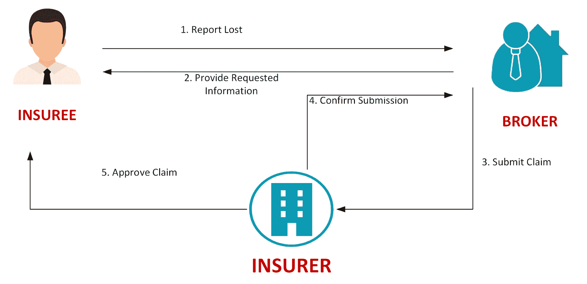
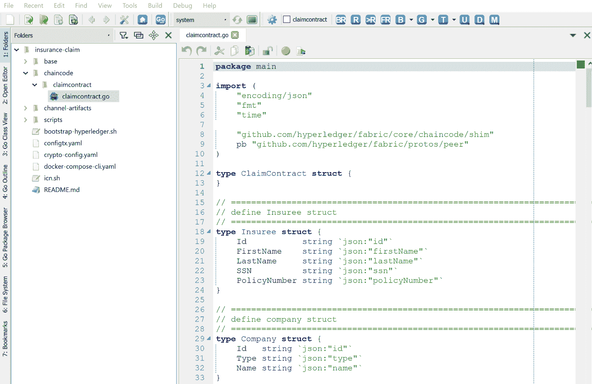
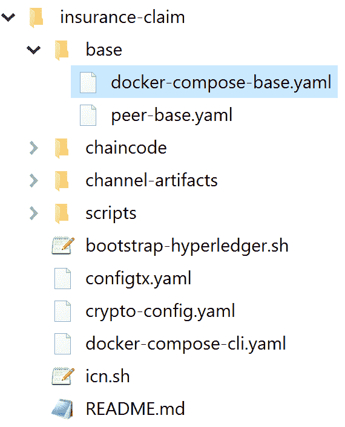
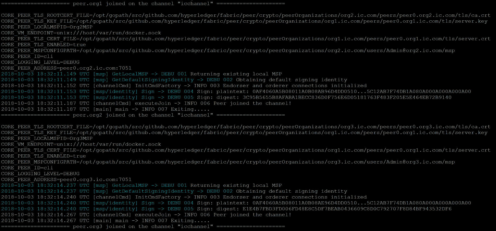
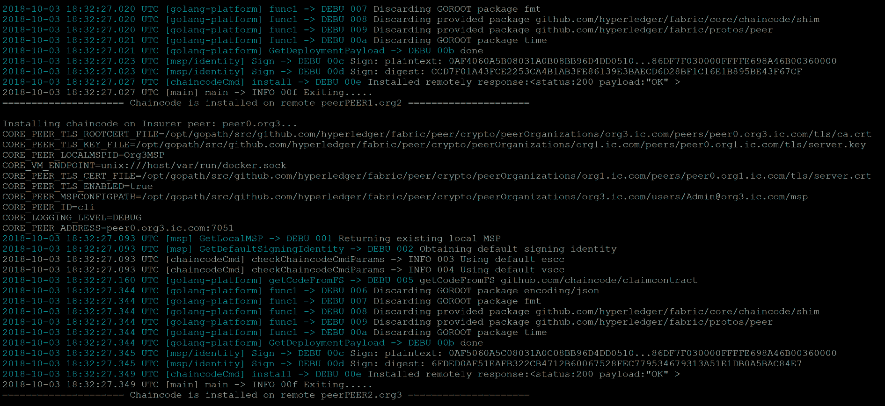
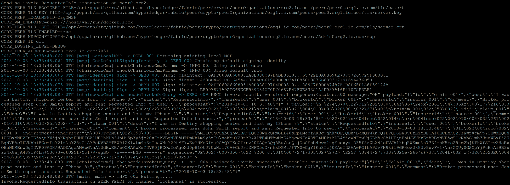
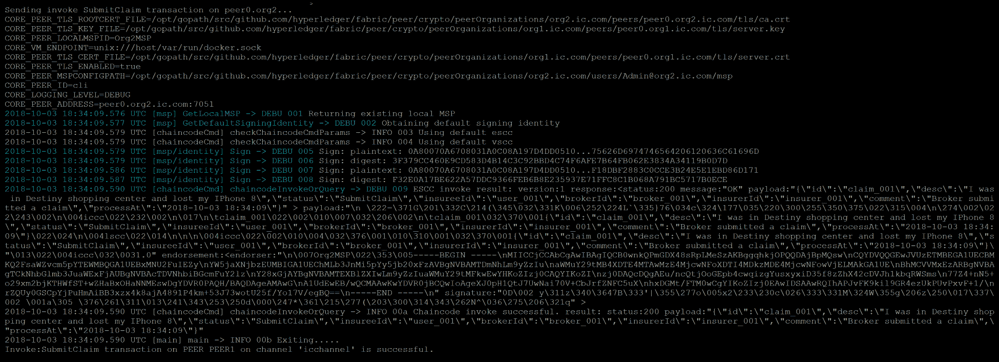
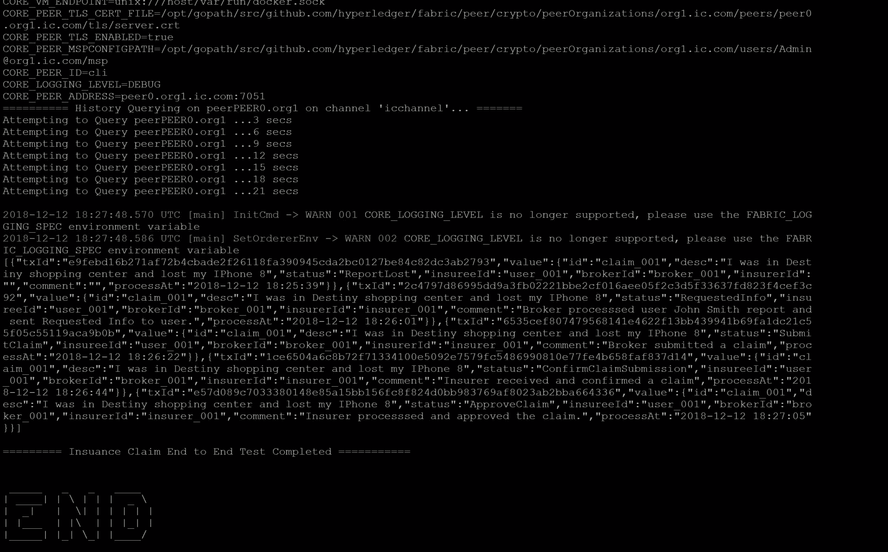

# 使用 Hyperledger Fabric 探索企业区块链应用

上一章，我们讨论了区块链以太坊。以太坊是公共区块链；任何人都可以阅读区块链的数据并做出合理的改变。任何人都可以将新块写入链中。以太坊是完全自主的，不受任何人控制。智能合约是用 Solidity 编写的，作为一种近乎图灵的完整语言，可以运行在**以太坊虚拟机** ( **EVM** )上执行各种交易。开发人员可以使用这些智能合约来构建和部署**d**T6】去中心化应用 ( **DApps** )。以太是以太坊中的加密货币，充当以太坊中每一个操作的燃料，包括执行智能合约、DApps、交易等等。然而，这不是建设区块链的唯一途径。

可以创建区块链，它要求在区块链节点中内置一个访问控制层来读取区块链上的受限信息。这将限制网络中能够在区块链网络的共识机制中进行交易的参与者的数量。这种区块链被称为许可的区块链。

下表显示了公共和许可区块链之间的差异:

|  | **无权限** | **许可** |
| 公共 | 每个人都可以读取交易数据。每个人都可以验证块中的事务。

*   **速度**:差
*   **共识**:工作证明
*   **区块链**:比特币、Ethereum
*   **令牌**:需要

 | 每个人都可以读取交易数据。只有预定义的用户才能验证交易。

*   **速度**:良好
*   **共识**:工作证明
*   **区块链**:Casper 之后的以太坊
*   **令牌**:需要

 |
| 私人的 | 只有预定义的用户可以读取交易数据。只有预定义的用户才能验证交易。

*   **速度**:良好
*   **共识** : **联邦拜占庭协议** ( **FBA** )
*   **令牌**:不需要

 | 只有预定义的用户可以读取交易数据。只有授权用户才能验证交易。

*   **速度**:良好
*   **共识** : **实用拜占庭容错算法** ( **PBFT** )
*   **区块链**:超分类帐结构
*   **令牌**:不需要

 |

Hyperledger Fabric 就是这样一个私人许可的区块链。在本章中，我们将讨论 Hyperledger 结构区块链。

Hyperledger Fabric 是一项开源企业区块链技术。该项目最初由 IBM 和 digital asset 共同出资。Hyperledger Fabric 是 Linux 基金会主持的区块链项目之一。Hyperledger Fabric 中的智能合约称为 *chaincode* ，它定义了 Fabric 应用程序的业务逻辑。模块化体系结构设计使 Fabric 能够支持高度的保密性、弹性、灵活性和可扩展性。Fabric 中的组件，如共识和成员服务，可以即插即用。

在本章中，我们将讨论以下主题:

*   发行索赔
*   设置 Hyperledger 结构环境
*   写一个链码
*   配置 Hyperledger 结构

# 发行索赔

在本节中，我们将探索并实现一个发布声明用例。

没有人想有一个保险索赔，但当事情做错了，事故发生，这可能会导致经济损失。这些损失将由你的保险单赔偿。传统的保险索赔流程几十年来一直保持不变，因为该流程中存在许多关键问题，包括虚假索赔、欺诈检测、缓慢而复杂的索赔处理、人为错误、不良的客户体验以及再保险中低效的信息流。

有了区块链，分类账中的交易记录是不可变的，状态数据只能在各方同意的情况下更新。区块链的记录可以实时共享。这使得保险公司可以快速行动，因为理赔验证所需的大部分信息都可以立即得到处理。保险公司可以跟踪区块链资产数据的使用情况。可以省去文书工作，客户可以通过 web 应用程序提交索赔。

我们来看看保险理赔流程，如下图截图所示。出于演示目的，我们简化了索赔流程，因为在真实的使用案例中，索赔流程可能要复杂得多:



对于前面的过程，步骤如下:

1.  保险公司向经纪人报告索赔
2.  代理提供所请求的信息
3.  经纪人向发行人提交索赔
4.  发行人确认索赔
5.  发行人处理并批准索赔

# 设置 Hyperledger 结构环境

到目前为止，我们已经了解了 Hyperledger Fabric 的关键概念。在本节中，我们将设置一个 Hyperledger Fabric 开发环境。在继续安装步骤之前，让我们看一下 fabric 安装的先决条件。

# 安装先决条件

以下是安装所需开发工具的先决条件。

| Ubuntu Linux 14.04 / 16.04 LTS(均为 64 位)或 macOS 10.12 | Docker 引擎:版本 17.03 或更高 |
| Docker-Compose:版本 1.8 或更高 | 节点:8.9 或更高版本(注意不支持版本 9) |
| npm: v5.x 版 | git: 2.9.x 或更高版本 |
| Python: 2.7.x |  |

我们将使用 Ubuntu 作为开发环境。我们可以使用以下命令下载先决条件:

```
curl -O https://hyperledger.github.io/composer/latest/prereqs-ubuntu.sh
chmod u+x prereqs-ubuntu.sh
./prereqs-ubuntu.sh
```

它可能会提示您输入密码，因为它在执行过程中使用了`sudo`。

# 安装 Hyperledger 结构

创建并导航到名为`insurance-claim`的项目文件夹，如下所示:

```
mkdir ~/insurance-claim && cd ~/insurance-claim
```

输入以下命令安装特定于 Hyperledger Fabric 平台的二进制文件:

```
curl -sSL https://raw.githubusercontent.com/hyperledger/fabric/release-1.3/scripts/bootstrap.sh | bash
```

执行之后，它会将下面特定于平台的二进制文件下载到位于`fabric-samples`文件夹下的`bin`文件夹中。您可以将`fabric-samples/bin`设置为`PATH`变量，如下所示:

```
export PATH=<path to download location>/bin:$PATH
```

我们还从本书的代码文件中提供了`bootstrap-hyperledger.sh`，您可以从 Packt 网站下载。获得文件后，您可以直接运行以下脚本，它将创建一个 bin 文件夹并将二进制文件下载到该文件夹:


这些组件将成为我们 Hyperledger 结构网络的一部分。

# 写入链码

Chaincode 类似于一个*智能合约*。它定义并执行特定网络中授权参与者调用的业务逻辑。链代码是用 Go 或 Node.js 编写的，在我们的例子中，我们将使用 Go。

有许多 ide 和工具支持 Golang。这里有一些非常适合 Golang 的流行想法。

# 开发工具

有各种各样的工具支持 Go 开发。下面几节列出了一些流行的 ide。

# 工具

LiteIDE 是一个直接为 Golang 设计的开源 Go IDE。Go 开发者可以使用许多有用的特性，包括可配置的代码编辑器、定制的构建命令、许多构建选项和 Golang 支持。

# JetBrains Gogland(捷克语)

Gogland 拥有强大的内置自动完成引擎、错误检测、代码重构工具等等。

# Visual Studio 代码

您可以在 Visual Studio 代码中安装 Go 扩展。它提供代码提示和调试代码的能力。

在这一章中，我们将使用 LiteIDE 来开发我们的链码。遵循官方 LiteIDE 安装指南来设置您的本地 IDE 环境，该指南可从以下链接获得:

[https://github . com/visual fc/liteide/blob/master/liteidex/deploy/welcome/en/install . MD](https://github.com/visualfc/liteide/blob/master/liteidex/deploy/welcome/en/install.md)。

# 链码键概念和 API

织物链码中有三个重要的功能:`Init`、`Invoke`、`Query`。每个链码程序都必须实现链码接口，如下所示:

```
type Chaincode interface {
    Init(stub ChaincodeStubInterface) pb.Response
    Invoke(stub ChaincodeStubInterface) pb.Response
}
```

当应用程序初始化其内部数据以供其他链码函数使用时，调用`Init()`。当 chaincode 收到实例化或升级事务时触发。

当应用客户端提出更新或查询事务时，`Invoke()`；函数被调用。

当链码查询链码状态时，调用`Query()`。Hyperledger Fabric 使用 LevelDB(键/值存储)作为存储 world 的默认数据库；州数据。您可以使用一个键来获取当前分类帐状态数据。查询函数通过传入键值来读取链码状态的值。

shim 包为链代码提供 API 以访问其状态变量、事务上下文和调用其他链代码。

`ChaincodeStubInterface`是重要的接口之一。它提供了各种功能，允许您查询、更新和删除分类帐中的资产。这些措施如下:

| `GetState(key string) ([]byte, error)` | `GetState`从分类帐中返回指定键的值 |
| `PutState(key string, value []byte) error` | `PutState`将指定的键和值作为数据写入建议放入事务的写集 |
| `DelState(key string) error` | `DelState`在事务建议的写集中记录要删除的指定键 |

# 定义发行声明

让我们写一个链码。打开 LiteIDE 并创建一个名为`claimcontract.go`的新文件，如下:



在保险索赔用例分析中，我们分析了签发索赔流程中的参与者。我们需要为三个参与者定义一个链码:被保险人、经纪人和保险人，如下例所示:

```
type Insuree struct {
         Id           string `json:"id"`
         FirstName    string `json:"firstName"`
         LastName     string `json:"lastName"`
         SSN          string `json:"ssn"`
         PolicyNumber string `json:"policyNumber"`
}
```

在`Insuree`中，我们定义了`Id`、`firstname`、`LastName`、`SSN`和`policyNumber`。

在 Go 语言中，它允许字段名的首字母大写或小写。当我们需要一个导出的字段是公共的，任何代码都可以使用它时，它需要是一个大写字母。您可以使用 JSON 包中的编码将数据解组到 struct 中，struct 将 JSON 中的字段名定义为`firstName`键，如下所示:

```
type Member struct {
  Name string `json:"member_name"`
}
```

经纪人和保险公司的数据模型是相似的，只是类型不同。我们将它们定义如下:

```
type Company struct {
         Id   string `json:"id"`
         Type string `json:"type"`
         Name string `json:"name"`
}
```

在发放索赔流程中，`Insuree`发起索赔请求。索赔文件将记录在区块链过程中的每一步。它记录了所有必要的信息，包括状态、用户声明描述、`insueeId`、`brokerId`、`insurerId`、每个步骤的处理时间以及从授权方输入的注释，如以下示例所示:

```
type Claim struct {
         Id        string `json:"id"`        //the fieldtags are needed to keep case from bouncing around
         Desc      string `json:"desc"`      //claim description
         Status    string `json:"status"`    //status of claim
         InsureeId string `json:"insureeId"` //InsureeId
         BrokerId  string `json:"brokerId"`  //BrokerId
         InsurerId string `json:"insurerId"` //InsurerId
         Comment   string `json:"comment"`   //comment
         ProcessAt string `json:"processAt"` //processAt
}
```

# 初始化链码

接下来，我们将实现`Init`函数。`Init()`允许链码初始化被保险人数据，以启动索赔请求。在我们的情况下，我们将设置和注册被保险人信息，如下所示:

```
func (c *ClaimContract) Init(stub shim.ChaincodeStubInterface) pb.Response {
         args := stub.GetStringArgs()
         if len(args) != 5 {
                 return shim.Error("Incorrect arguments. Expecting a key and a value")
         }
         insureeId := args[0]
         firstName := args[1]
         lastName := args[2]
         ssn := args[3]
         policyNumber := args[4]
         insureeData := Insuree{
                 Id:           insureeId,
                 FirstName:    firstName,
                 LastName:     lastName,
                 SSN:          ssn,
                 PolicyNumber: policyNumber}
         insureeBytes, _ := json.Marshal(insureeData)
         err := stub.PutState(insureeId, insureeBytes)
         if err != nil {
                 return shim.Error(fmt.Sprintf("Failed to create asset: %s", args[0]))
         }
         return shim.Success(nil)
}
```

`ChaincodeStubInterface.GetStringArg`获取输入参数。它期望参数的长度应为 5。利用所有必需的保险公司数据，我们构建保险公司 JSON 数据，并将其编码为 JSON 字节字符串–`json.Marshal(insureeData`。然后，我们将键和值存储在分类帐中。如果一切顺利，它将向 Fabric 的`client.c`返回一个成功的`peer.Response`对象。

# 调用链码

要触发 invoke 函数，可以调用 chaincode 应用程序函数的名称，并将`shim.ChaincodeStubInterface`作为签名传递。在保险索赔案例中，我们定义了几个函数来支持我们的用例，例如:

`AddCompany`、`ReportLost`、`RequestedInfo`、`SubmitClaim`、`ConfirmClaimSubmission`、`ApproveClaim`。

我们还定义了一个查询来跟踪当前的索赔请求，并定义了`getHistory`来获取所有的历史索赔事务记录，如下所示:

```
func (c *ClaimContract) Invoke(stub shim.ChaincodeStubInterface) pb.Response {
         function, args := stub.GetFunctionAndParameters()
         if function == "AddCompany" {
                 return c.AddCompany(stub, args)
         } else if function == "ReportLost" {
                 return c.ReportLost(stub, args)
         } else if function == "RequestedInfo" {
                 return c.RequestedInfo(stub, args)
         } else if function == "SubmitClaim" {
                 return c.SubmitClaim(stub, args)
         } else if function == "ConfirmClaimSubmission" {
                 return c.ConfirmClaimSubmission(stub, args)
         } else if function == "ApproveClaim" {
                 return c.ApproveClaim(stub, args)
         } else if function == "query" {
                 return c.query(stub, args)
         } else if function == "getHistory" {
                 return c.getHistory(stub, args)
         }

         return shim.Error("Invalid function name")
}
```

# 添加公司

`AddCompany`类似于我们在初始化步骤中添加被保险人的方式。Chaincode 可以通过该功能注册经纪人和保险公司。公司类型可以是*经纪人*或*保险人*，如下:

```
func (c *ClaimContract) AddCompany(stub shim.ChaincodeStubInterface, args []string) pb.Response {
         id := args[0]
         name := args[1]
         companyType := args[2]
         companyData := Company{
                 Id:   id,
                 Type: companyType,
                 Name: name}
         companyBytes, _ := json.Marshal(companyData)
         stub.PutState(id, companyBytes)
         return shim.Success(companyBytes)
}
```

# 报失

在这一步中，被保险人向经纪人报告丢失的物品以及所有索赔信息。该功能还在`processAt`字段记录当前系统处理时间。`currentts.Format(2006-01-02 15:04:05)`是 Go 自定义格式；它会将当前时间转换为 YYYY-MM-dd hh:mm:ss 格式，如下例所示:

```
func (c *ClaimContract) ReportLost(stub shim.ChaincodeStubInterface, args []string) pb.Response {
         claimId := args[0]
         desc := args[1]
         insureeId := args[2]
         brokerId := args[3]
         currentts := time.Now()
         processAt := currentts.Format("2006-01-02 15:04:05")
         //initialized claim
         claimData := Claim{
                 Id:        claimId,
                 Desc:      desc,
                 Status:    "ReportLost",
                 InsureeId: insureeId,
                 BrokerId:  brokerId,
                 InsurerId: "",
                 Comment:   "",
                 ProcessAt: processAt}
         claimBytes, _ := json.Marshal(claimData)
         stub.PutState(claimId, claimBytes)
         return shim.Success(claimBytes)
}
```

# 请求的信息

被保险人挂失后，下一步是经纪人返还`RequestedInfo`，如下所示:

```
func (c *ClaimContract) RequestedInfo(stub shim.ChaincodeStubInterface, args []string) pb.Response {
         return c.UpdateClaim(stub, args, "RequestedInfo")
}
func (c *ClaimContract) UpdateClaim(stub shim.ChaincodeStubInterface, args []string, currentStatus string) pb.Response {
         claimId := args[0]
         comment := args[1]
         claimBytes, err := stub.GetState(claimId)
         claim := Claim{}
         err = json.Unmarshal(claimBytes, &claim)
         if err != nil {
                 return shim.Error(err.Error())
         }
         if currentStatus == "RequestedInfo" && claim.Status != "ReportLost" {
                 claim.Status = "Error"
                 fmt.Printf("Claim is not initialized yet")
                 return shim.Error(err.Error())
         } else if currentStatus == "SubmitClaim" && claim.Status != "RequestedInfo" {
                 claim.Status = "Error"
                 fmt.Printf("Claim must be in RequestedInfo status")
                 return shim.Error(err.Error())
         } else if currentStatus == "ConfirmClaimSubmission" && claim.Status != "SubmitClaim" {
                 claim.Status = "Error"
                 fmt.Printf("Claim must be in Submit Claim status")
                 return shim.Error(err.Error())
         } else if currentStatus == "ApproveClaim" && claim.Status != "ConfirmClaimSubmission" {
                 claim.Status = "Error"
                 fmt.Printf("Claim must be in Confirm Claim Submission status")
                 return shim.Error(err.Error())
         }
         claim.Comment = comment
         if currentStatus == "RequestedInfo" {
                 insurerId := args[2]
                 claim.InsurerId = insurerId
         }
         currentts := time.Now()
         claim.ProcessAt = currentts.Format("2006-01-02 15:04:05")
         claim.Status = currentStatus
         claimBytes0, _ := json.Marshal(claim)
         err = stub.PutState(claimId, claimBytes0)
         if err != nil {
                 return shim.Error(err.Error())
         }
         return shim.Success(claimBytes0)
}
```

由于剩余的流程函数非常相似，我们将`UpdateClaim`定义为一个公共函数，与剩余的步骤共享。

`UpdateClaim`函数首先从输入参数中获取`claimId`和当前参与者的评论。然后，它查询并从区块链获得一个声明，对声明数据进行解码，并将其转换成一个 JSON 字符串— `json.Unmarshal(claimBytes, &claim)`。

在更新索赔内容之前，它将验证输入的索赔状态，并确保它在预期的步骤上。如果一切顺利，我们将更新索赔状态、参与者评论和处理时间。

最后，我们用`claimId`作为分类账中的一个键来更新索赔数据。

# 提交索赔，确认索赔提交，批准索赔

提交、确认和批准索赔与`RequestedInfo`非常相似，这些步骤由`UpdateClaim`函数调用。只有注释、状态和处理时间值不同。

# 询问

查询是您从分类帐中读取数据的方式。查询功能用于查询链码的状态。当我们用`claimId`将索赔数据放入分类帐时，为了读取当前索赔，我们调用`GetState`，传递`claimId`作为键，如下所示:

```
func (c *ClaimContract) query(stub shim.ChaincodeStubInterface, args []string) pb.Response {
         var ENIITY string
         var err error
         if len(args) != 1 {
                 return shim.Error("Incorrect number of arguments. Expected ENIITY Name")
         }
         ENIITY = args[0]
         Avalbytes, err := stub.GetState(ENIITY)         if err != nil {
                 jsonResp := "{\"Error\":\"Failed to get state for " + ENIITY + "\"}"
                 return shim.Error(jsonResp)
         }
         if Avalbytes == nil {
                 jsonResp := "{\"Error\":\"Nil order for " + ENIITY + "\"}"
                 return shim.Error(jsonResp)
         }
         return shim.Success(Avalbytes)
}
```

# gethirstory

顾名思义，`gethistory`函数读取一个键的所有历史值记录的声明，以及`TxId`和声明值。

我们首先定义了`AuditHistory`结构，它有`TxId`和值。`GetHistoryForKey`返回带有`resultsIterator`的结果列表，包含所有历史交易记录。我们遍历这些记录，并将它们添加到一个`AuditHistory`数组中。稍后，我们将其转换为 JSON 字节，并将数据作为响应发送回去，如下所示:

```
func (c *ClaimContract) getHistory(stub shim.ChaincodeStubInterface, args []string) pb.Response {
         type AuditHistory struct {
                 TxId  string `json:"txId"`
                 Value Claim  `json:"value"`
         }
         var history []AuditHistory
         var claim Claim
         if len(args) != 1 {
                 return shim.Error("Incorrect number of arguments. Expecting 1")
         }
         claimId := args[0]
         fmt.Printf("- start getHistoryForClaim: %s\n", claimId)

         // Get History
         resultsIterator, err := stub.GetHistoryForKey(claimId)
         if err != nil {
                 return shim.Error(err.Error())
         }
         defer resultsIterator.Close()

         for resultsIterator.HasNext() {
                 historyData, err := resultsIterator.Next()
                 if err != nil {
                          return shim.Error(err.Error())
                 }
                 var tx AuditHistory
                 tx.TxId = historyData.TxId
                 json.Unmarshal(historyData.Value, &claim)
                 tx.Value = claim              //copy claim over
                 history = append(history, tx) //add this tx to the list
         }
         fmt.Printf("- getHistoryForClaim returning:\n%s", history)

         //change to array of bytes
         historyAsBytes, _ := json.Marshal(history) //convert to array of bytes
         return shim.Success(historyAsBytes)
}
```

这涵盖了我们的发行索赔链代码。我们将在下一节了解 Hyperledger 结构配置。

# 配置 Hyperledger 结构

保险索赔网络中有三个实体——被保险人、经纪人和保险人。所有这些参与者都将在 Fabric 中注册为对等节点。下表描述了三个对等角色和 MSP 信息:

| **用户 ID** | **角色** | **组织 MSP ID** |
| `user_001` | 被保险人 | Org1MSP |
| `broker_001` | 经纪人 | Org2MSP |
| `insurer_001` | 保险公司 | Org3MSP |

我们有一个以 MSP ID org1 加入组织的被保险人，一个以 MSP ID org2 加入组织的经纪人，以及一个以 MSP ID org3 加入组织的保险人。为了引导结构网络，我们需要首先为我们需要运行的所有三个组件生成加密材料。

# 生成证书

我们需要定义`crypto-config.yaml`并使用 cryptogen 工具为每个对等体生成证书。Cryptogen 在工具映像中可用。`crypto-config.yaml`包含以下信息:

*   **order orgs**:管理订购者节点的组织定义
*   **对等节点**:管理对等节点的组织的定义

OrdererOrgs 包含集群中有序节点的以下信息:

*   **姓名**:订购者姓名
*   **域**:订购者的域 URL 在我们的情况下，它是 ic.com
*   **主机名**:订购者的主机名

这里有一个例子:

```
OrdererOrgs:
  - Name: Orderer
    Domain: ic.com
    Specs:
```

```
      - Hostname: orderer
```

PeerOrgs 包含有关群集中对等节点的以下信息:

*   **名称**:机构名称；我们有三个不同的组织:`Org1`、`Org2`和`Org3`
*   **模板数**:一个组织的对等节点数
*   **用户数**:一个组织的用户数

这里有一个例子:

```
PeerOrgs:
  # ---------------------------------------------------------------------------
  # Org1
  # ---------------------------------------------------------------------------
  - Name: Org1
    Domain: org1.ic.com
    Template:
      Count: 2
    Users:
      Count: 1
  # ---------------------------------------------------------------------------
  # Org2
  # ---------------------------------------------------------------------------
  - Name: Org2
    Domain: org2.ic.com
    Template:
      Count: 2
    Users:
      Count: 1
  # ---------------------------------------------------------------------------
  # Org3
  # ---------------------------------------------------------------------------
  - Name: Org3
    Domain: org3.ic.com
    Template:
      Count: 2
    Users:
      Count: 1
```

以下是用于生成加密材料的命令:

```
cryptogen generate --config=./crypto-config.yaml
```

运行 cryptogen 工具后，您应该会在控制台中看到以下输出:


# 生成有序的生成块

生成证书后，流程的下一步是生成订购者起源块。`configtxgen`命令允许用户创建和检查通道配置。`configtxgen`工具的输出主要由`configtx.yaml`的内容控制，如下:

```
Profiles:
    ICOrgsOrdererGenesis:
        Orderer:
            <<: *OrdererDefaults
            Organizations:
                - *OrdererOrg
        Consortiums:
            InsuranceClaimConsortium:
                Organizations:
                    - *Org1
                    - *Org2
                    - *Org3
    ICOrgsChannel:
        Consortium: InsuranceClaimConsortium
        Application:
            <<: *ApplicationDefaults
            Organizations:
                - *Org1
                - *Org2
                - *Org3
Organizations:
    - &OrdererOrg
        Name: OrdererOrg
        ID: OrdererMSP
        MSPDir: crypto-config/ordererOrganizations/ic.com/msp
    - &Org1
        Name: Org1MSP
        ID: Org1MSP
        MSPDir: crypto-config/peerOrganizations/org1.ic.com/msp
        AnchorPeers:
            - Host: peer0.org1.ic.com
              Port: 7051
    - &Org2
        Name: Org2MSP
        ID: Org2MSP
        MSPDir: crypto-config/peerOrganizations/org2.ic.com/msp
        AnchorPeers:
            - Host: peer0.org2.ic.com
              Port: 7051         
    - &Org3
        Name: Org3MSP
        ID: Org3MSP
        MSPDir: crypto-config/peerOrganizations/org3.ic.com/msp

        AnchorPeers:
            - Host: peer0.org3.ic.com
              Port: 7051              
Orderer: &OrdererDefaults
    OrdererType: solo
    Addresses:
        - orderer.ic.com:7050
    BatchTimeout: 2s
    BatchSize:
        MaxMessageCount: 10
        AbsoluteMaxBytes: 20 MB
        PreferredMaxBytes: 512 KB
    Kafka:
        Brokers:
            - 127.0.0.1:9092
    Organizations:
Application: &ApplicationDefaults

    Organizations:
```

我们在`configtx`文件的`Organizations`部分定义了三个组织；我们指定了每个组织的名称，`ID`、`MSPDir`和`AnchorPeers`。`MSPDir`描述 cryptogen 生成的输出 MSP 目录。`AnchorPeers`指向对等节点的主机和端口。它更新事务，以实现不同组织的对等方之间的通信，并查找通道的所有活动参与者，如下所示:

```
configtxgen -profile ICOrgsOrdererGenesis -outputBlock ./channel-artifacts/genesis.block
```

控制台上将显示类似以下内容的输出:


# 生成信道配置事务

`configtxgen`通过执行通道配置事务将通道创建事务写入`channel.tx`，如下所示:

```
configtxgen -profile ICOrgsChannel -outputCreateChannelTx ./channel-artifacts/channel.tx -channelID icchannel
```

控制台上将显示类似以下内容的输出:


执行通道配置事务的输出

# Hyperledger Fabric Docker composer 配置文件概览

Hyperledger Fabric 利用 Docker compose 来定义结构应用程序服务。服务部分是定义所有对等服务和相关容器的地方。Hyperledger Fabric 的 *first-network* 提供了一个`.yaml`模板，帮助您快速从头开始创建 yaml 文件:

[https://github . com/hyperledger/fabric-samples/tree/release-1.2/first-network](https://github.com/hyperledger/fabric-samples/tree/release-1.2/first-network)。

在`docker-compose-cli.yaml`中，我们定义了以下信息:

*   `networks`:区块链网络名称的定义。在我们的例子中，它是`icn`
*   `services`:所有对等服务和相关 Docker 容器的定义
*   `cli`:定义用于替换 SDK 客户端的 Cli 容器，以及 Docker 编写命令行行为的环境变量

以下是网络和服务部分的配置示例:

```
networks:
  icn:
services:
  orderer.ic.com:
    extends:
      file:   base/docker-compose-base.yaml
      service: orderer.ic.com
    container_name: orderer.ic.com
    networks:
      - icn
  peer0.org1.ic.com:
    container_name: peer0.org1.ic.com
    extends:
      file:  base/docker-compose-base.yaml
      service: peer0.org1.ic.com
    networks:
      - icn
```

可以看到，有一个文件扩展名目录:`base/docker-compose-base.yaml`。Docker compose 支持通过*扩展*字段共享单个服务的公共配置。稍后我们将讨论更多关于`docker-compose-base.yaml`的内容。

以下是`cli`部分的配置示例:

```
cli:
    container_name: cli
    image: hyperledger/fabric-tools
    tty: true
    environment:
      - GOPATH=/opt/gopath
      - CORE_VM_ENDPOINT=unix:///host/var/run/docker.sock
      - CORE_LOGGING_LEVEL=DEBUG
      - CORE_PEER_ID=cli
      - CORE_PEER_ADDRESS=peer0.org1.ic.com:7051
      - CORE_PEER_LOCALMSPID=Org1MSP
      - CORE_PEER_TLS_ENABLED=true
      - CORE_PEER_TLS_CERT_FILE=/opt/gopath/src/github.com/hyperledger/fabric/peer/crypto/peerOrganizations/org1.ic.com/peers/peer0.org1.ic.com/tls/server.crt
      - CORE_PEER_TLS_KEY_FILE=/opt/gopath/src/github.com/hyperledger/fabric/peer/crypto/peerOrganizations/org1.ic.com/peers/peer0.org1.ic.com/tls/server.key
      - CORE_PEER_TLS_ROOTCERT_FILE=/opt/gopath/src/github.com/hyperledger/fabric/peer/crypto/peerOrganizations/org1.ic.com/peers/peer0.org1.ic.com/tls/ca.crt
      - CORE_PEER_MSPCONFIGPATH=/opt/gopath/src/github.com/hyperledger/fabric/peer/crypto/peerOrganizations/org1.ic.com/users/Admin@org1.ic.com/msp
    working_dir: /opt/gopath/src/github.com/hyperledger/fabric/peer
    command: /bin/bash -c './scripts/script.sh ${CHANNEL_NAME} ${DELAY}; sleep $TIMEOUT'
    #for mapping the directories that are being used in the environment configurations
    volumes:
        - /var/run/:/host/var/run/
        - ./chaincode/:/opt/gopath/src/github.com/chaincode
        - ./crypto-config:/opt/gopath/src/github.com/hyperledger/fabric/peer/crypto/
        - ./scripts:/opt/gopath/src/github.com/hyperledger/fabric/peer/scripts/
        - ./channel-artifacts:/opt/gopath/src/github.com/hyperledger/fabric/peer/channel-artifacts
    depends_on:
      - orderer.ic.com
      - peer0.org1.ic.com
      - peer0.org2.ic.com
      - peer0.org3.ic.com
    networks:
      - icn
```

`docker-compose`工具使用`docker-compose-cli.yaml`文件初始化 fabric 运行时环境。以下是使用`docker-compose-cli.yaml`文件时最常用的命令:

| `TTY` | TTY 的基本意思是控制台，我们将其设为 true。 |
| `Image` | 指向结构工具图像目录。 |
| `Environment` | 指定环境变量，例如，由 cryptogen 工具生成的与 TLS 相关的文件位置 GOPATH。 |
| `working_dir` | 设置对等方的工作目录。 |
| `command` | 指定容器启动时发出的命令。 |
| `volumes` | 映射环境配置中正在使用的目录。 |
| `depends_on` | 按依赖顺序启动服务。 |

然后，它生成四个 fabric-peer 事务节点容器、一个 fabric-order order 节点容器和一个 fabric-tools cli 容器。

# 结构项目目录结构

在我们的 Fabric 示例 first-network 中，项目结构类似于以下内容:



正如我们之前讨论的，`docker-compose-cli.yaml`服务是从`base/docker-compose-base.yaml`扩展而来的。有两个文件基础目录:`peer-base.yaml`和`docker-compose-base.yaml`。

# 坞站-组合基座. yaml

该文件包含基本配置，包括每个对等体和订购者容器环境和端口号。这定义了保险索赔网络的整体拓扑，如下所示:

```
services:
  orderer.ic.com:
    container_name: orderer.ic.com
    image: hyperledger/fabric-orderer
    environment:
      - ORDERER_GENERAL_LOGLEVEL=debug
      - ORDERER_GENERAL_LISTENADDRESS=0.0.0.0
      - ORDERER_GENERAL_GENESISMETHOD=file
      - ORDERER_GENERAL_GENESISFILE=/var/hyperledger/orderer/orderer.genesis.block
      - ORDERER_GENERAL_LOCALMSPID=OrdererMSP
      - ORDERER_GENERAL_LOCALMSPDIR=/var/hyperledger/orderer/msp
      # enabled TLS
      - ORDERER_GENERAL_TLS_ENABLED=true
      - ORDERER_GENERAL_TLS_PRIVATEKEY=/var/hyperledger/orderer/tls/server.key
      - ORDERER_GENERAL_TLS_CERTIFICATE=/var/hyperledger/orderer/tls/server.crt
      - ORDERER_GENERAL_TLS_ROOTCAS=[/var/hyperledger/orderer/tls/ca.crt]
    working_dir: /opt/gopath/src/github.com/hyperledger/fabric
    command: orderer
    volumes:
    - ../channel-artifacts/genesis.block:/var/hyperledger/orderer/orderer.genesis.block
    - ../crypto-config/ordererOrganizations/ic.com/orderers/orderer.ic.com/msp:/var/hyperledger/orderer/msp
    - ../crypto-config/ordererOrganizations/ic.com/orderers/orderer.ic.com/tls/:/var/hyperledger/orderer/tls
    ports:
      - 7050:7050

  peer0.org1.ic.com:
    container_name: peer0.org1.ic.com
    extends:
      file: peer-base.yaml
      service: peer-base
    environment:
      - CORE_PEER_ID=peer0.org1.ic.com
      - CORE_PEER_ADDRESS=peer0.org1.ic.com:7051
      - CORE_PEER_GOSSIP_EXTERNALENDPOINT=peer0.org1.ic.com:7051
      - CORE_PEER_LOCALMSPID=Org1MSP
    volumes:
        - /var/run/:/host/var/run/
        - ../crypto-config/peerOrganizations/org1.ic.com/peers/peer0.org1.ic.com/msp:/etc/hyperledger/fabric/msp
        - ../crypto-config/peerOrganizations/org1.ic.com/peers/peer0.org1.ic.com/tls:/etc/hyperledger/fabric/tls
    ports:
      - 7051:7051
      - 7053:7053
…..
```

# 同伴基地 yaml

该文件定义了保险索赔`docker-compose-base.yaml`的对等网络配置，如下所示:

```
services:
  peer-base:
    image: hyperledger/fabric-peer
    environment:
      - CORE_VM_ENDPOINT=unix:///host/var/run/docker.sock
      - CORE_VM_DOCKER_HOSTCONFIG_NETWORKMODE=${COMPOSE_PROJECT_NAME}_icn
      - CORE_LOGGING_LEVEL=DEBUG
      - CORE_PEER_TLS_ENABLED=true
      - CORE_PEER_GOSSIP_USELEADERELECTION=true
      - CORE_PEER_GOSSIP_ORGLEADER=false
      - CORE_PEER_PROFILE_ENABLED=true
      - CORE_PEER_TLS_CERT_FILE=/etc/hyperledger/fabric/tls/server.crt
      - CORE_PEER_TLS_KEY_FILE=/etc/hyperledger/fabric/tls/server.key
      - CORE_PEER_TLS_ROOTCERT_FILE=/etc/hyperledger/fabric/tls/ca.crt
    working_dir: /opt/gopath/src/github.com/hyperledger/fabric/peer
    command: peer node start
```

对等体中的命令让对等体安装系统链代码和其他配置。

我们对关键的 Hyperledger 结构配置文件有一个概述，因此让我们使用以下代码启动我们的保险索赔网络:

```
      - CORE_PEER_TLS_KEY_FILE=/etc/hyperledger/fabric/tls/server.key
      - CORE_PEER_TLS_ROOTCERT_FILE=/etc/hyperledger/fabric/tls/ca.crt
    working_dir: /opt/gopath/src/github.com/hyperledger/fabric/peer
    command: peer node start
```

# 启动 Hyperledger 结构网络

现在，是时候打开我们的超级账本结构网络了。我们将使用 Docker 命令开始新的 Docker 编写:

```
docker-compose -f docker-compose-cli.yaml up
```

Docker 容器将触发`docker-compose-cli.yaml`中定义的命令，如下所示:

```
command: /bin/bash -c './scripts/script.sh
```

`script.sh`是一个脚本，包含一系列结构部署和测试命令的指令。我们还在`utils.sh`中定义了一些特定于业务的 shell 脚本函数。

# 创建频道

首先，我们需要创建一个通道来建造一个创世块。运行以下命令:

```
peer channel create -o orderer.ic.com:7050 -c icchannel -f ./channel-artifacts/channel.tx
```

该命令从`channel.tx`读取一个用于加入通道并创建 icchannel 通道的 genesis 块。控制台上的结果如下:


加入并创建通道的控制台的输出

# 加入频道

在订购服务创建通道之后，我们可以将对等方添加到通道中，如下所示:

```
peer channel join -b icchannel.block
```

控制台上的结果如下:



将对等方添加到频道

我们可以看到`peer0.org1`、`peer0.org2`和`peer0.org3`在通道中连接。

# 更新锚点

在开始与我们的发布声明网络进行交互之前，我们需要完成的最后一个操作是更新锚节点。锚对等体接收事务更新并将其广播给组织中的其他对等体。锚定对等体在网络中是可搜索的。因此，任何注册为锚对等体的对等体都可以被顺序对等体或任何其他对等体发现，例如:

```
peer channel update -f ./channel-artifacts/Org1MSPanchors.tx -c icchannel -o orderer.ic.com:7050 --tls true --cafile $ORDERER_CA
```

这是该步骤的控制台输出:


被订单对等体或任何其他对等体发现

# 安装链码

完成前面的步骤后，我们差不多可以使用我们的发行索赔区块链应用程序了。然而首先，我们需要在我们的网络上安装`claimcontract.go` chaincode，如下所示:

```
peer chaincode install -n iccc -v 1.0 -l golang -p github.com/chaincode/claimcontract
```

我们将看到前面命令的输出:



在我们的网络中安装链码

# 实例化链码

安装完 chaincode 后，我们需要实例化它。正如我们之前所讨论的，我们将在`init()`链码上投保。因此，我们需要传递必需的参数来创建被保险人参与者，如下所示:

```
peer chaincode instantiate -o orderer.ic.com:7050 -C icchannel -n iccc -l golang -v 1.0 -c '{"Args":[ "user_001","John","Smith", "9999","4394497111/1"]}' -P "OR    ('Org1MSP.member'
```

这一步的输出如下:


创建被保险人

我们询问被保险人以核实该记录已在区块链创建，如下所示:

```
peer chaincode query -C $CHANNEL_NAME -n iccc -c '{"Args":["query","user_001"]}'
```

从这个输出中我们可以看到，被保险人(`user_001`)被添加到我们的区块链中:


被保险人已加入我们的区块链

# 调用添加代理

让我们为我们的保险索赔区块链配备一个经纪人，如下所示:

```
peer chaincode invoke -o orderer.ic.com:7050 -C icchannel -n iccc -c '{"Args":["AddCompany","broker_001","BROKER","BNC Brokerage"]}'
```

结果如下:


为我们的保险索赔区块链公司聘请经纪人

# 调用添加保险公司

将最后一方保险公司添加到保险索赔区块链，如下所示:

```
peer chaincode invoke -o orderer.ic.com:7050 -C icchannel -n iccc -c '{"Args":["AddCompany","insurer_001","INSURER","Western Insurance"]}'
```

显示的输出如下:


将最后一方保险人添加至保险索赔区块链

# 调用报告丢失

所有参与者都加入了网络，现在是开始保险索赔流程的时候了。被保险人向经纪人报告索赔，下面是调用“报告损失”链码的命令。

```
peer chaincode invoke -o orderer.ic.com:7050 -C icchannel -n iccc -c '{"Args":["ReportLost","claim_001", "I was in Destiny shopping center and lost my IPhone 8", "user_001", "broker_001"]}
```

将显示以下输出:


我同意向经纪人索赔

# 调用 RequestedInfo

代理提供请求的信息，如下所示:

```
peer chaincode invoke -o orderer.ic.com:7050 -C icchannel -n iccc -c '{"Args":["RequestedInfo","claim_001", "Broker processsed user John Smith report and sent Requested Info to user.", "insurer_001"]}'
```

将显示以下输出:



提供所请求的信息

# 调用 SubmitClaim

经纪人向发行人提交索赔，如下所示:

```
peer chaincode invoke -o orderer.ic.com:7050 -C icchannel -n iccc -c '{"Args":["SubmitClaim","claim_001", "Broker submitted a claim"]}'
```

将显示以下输出:



向发行人提交主张

# 调用 ConfirmClaimSubmission

发行人确认该主张，如下:

```
peer chaincode invoke -o orderer.ic.com:7050 -C icchannel -n iccc -c '{"Args":["ConfirmClaimSubmission","claim_001", "Insurer received and confirmed a claim"]}'
```

将显示以下输出:


确认索赔

# 调用批准声明

发行人处理和批准索赔，如下所示:

```
peer chaincode invoke -o orderer.ic.com:7050 -C icchannel -n iccc -c '{"Args":["ApproveClaim","claim_001", "Insurer processed and approved the claim."]}'
```

将显示以下输出:


处理和批准索赔

# 查询索赔历史记录

在发行人批准索赔后，整个流程就完成了，我们可以使用 Fabric API 来查询索赔的整个生命周期，如下所示:

```
peer chaincode query -C icchannel -n iccc -c '{"Args":["getHistory","claim_001"]}'
```

从该查询获得的输出中，我们可以看到索赔请求的整个 Fabric 事务历史。

这结束了我们的测试执行。

# 端到端测试执行

我们已经检查了保险索赔结构执行的每个步骤。为了简化整个端到端应用程序流，您可以导航到`insurance-claim`文件夹，然后运行以下命令:

```
cd ~/insurance-claim
#change path if insurance-claim directory is different
export PATH=/home/ubuntu/insurance-claim/bin:$PATH 
./icn.sh -m up
```

输出结果如下所示:


简化整个端到端应用流程

最终输出如下:



保险索赔端到端测试完成

# 摘要

在本章中，我们学习了 Hyperledger Fabric 的基础知识。在建立开发环境之后，我们为一个保险索赔用例编写了一个链代码。然后，我们学习了 fabric composer 配置。最后，我们为保险索赔应用程序运行了端到端的结构测试。我们可以看到，使用 Hyperledger Fabric 实现一个保险索赔应用程序是相当复杂的。在下一章中，我们将学习如何使用 Hyperledger Composer 快速编写保险索赔申请。