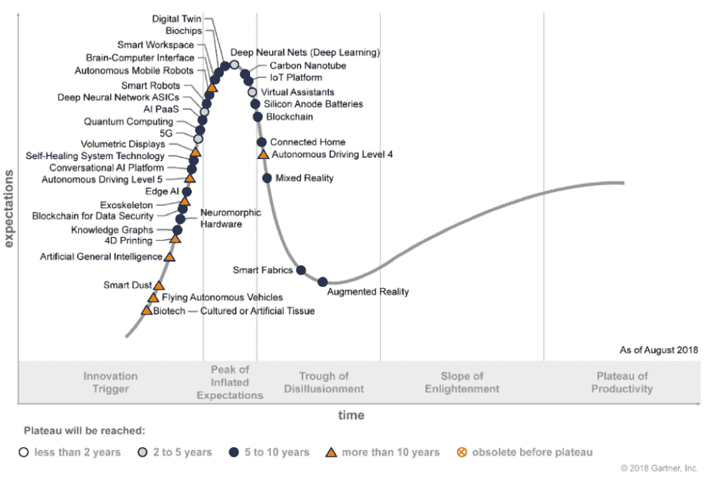
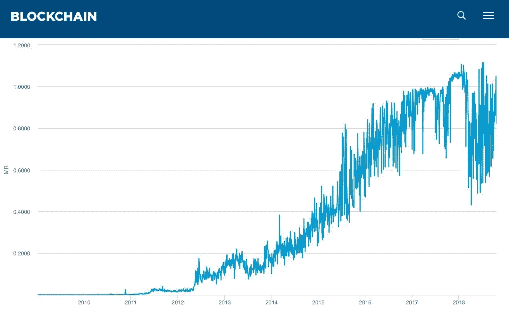
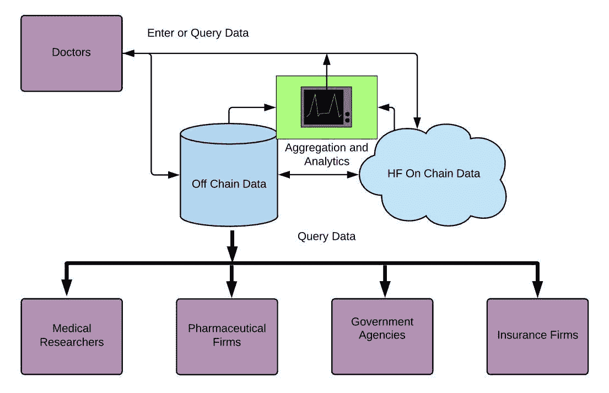

# 区块链用例

完成前六章后，你应该有足够的知识来思考如何应用你新获得的技能来解决现实生活中的问题。如前所述，区块链被认为是一项改变游戏规则的技术，它可能会通过淘汰中介服务来颠覆现有的商业模式，并激发经济高效的新商业模式的诞生。然而，这项技术不能解决所有问题，只有将其与其他成熟或新兴技术相结合，如大数据平台、云计算、数据科学/人工智能和物联网，才能充分实现其价值。

在这一章中，我们首先从较高的层面讨论各行业中流行的区块链用例，包括金融、民用服务、供应链、物联网和医疗保健。然后，在确定适当的使用案例和开发成功的 DApp 之前，我们将继续讨论需要考虑的因素。最后，我们以健康数据共享用例为例，从较高的层面对构建 DApp 进行了评论。具体来说，我们涵盖以下主题:

*   区块链用例的例子
*   如何选择合适的用例
*   深入讨论医疗保健数据共享的使用案例

# 区块链用例示例

技术的发展从根本上改变了人们的生活。纵观人类历史，机器已经取代人类执行各种任务。例如，在农业领域，农用车辆降低了耕作的劳动强度，大大提高了生产率。在美国，截至 2008 年，只有不到 2 %的人口直接从事农业。它们不仅为其他 98%的人口提供所需的食物，还让美国成为最大的农产品出口国。其他领域的例子包括可编程电话交换机取代电话接线员，自动电梯取代电梯操作员。

在过去的几十年里，机器取代人类的趋势加速发展，这在很大程度上归功于计算机的发明。迄今为止，已经发生了三次由计算机主导的技术革命。每一次革命都从根本上影响了现有的商业模式，并激发了新的经营方式。我们现在正处于第四阶段的黎明:一场由区块链技术引领的革命。以下是各个阶段:

*   大型机和个人电脑的发明:计算机取代了人类，更快更好地进行重复计算。推动自动化的计算机应用数不胜数，无处不在。
*   **互联网**:互联网是指全球互联的计算机网络。互联网的到来从根本上改变了提供服务的方式。例如，在 90 年代，在当地租赁店租赁录像带或 CD/DVD 是周末流行的家庭娱乐活动。百视达是一家提供租赁服务的家喻户晓的公司，其商业模式运作良好。2004 年，百视达在全球雇佣了 84，300 名员工，共有 9，094 家门店。有了互联网，像网飞这样的新公司出现了，并打破了百视达这样的公司的统治。家庭不再需要去实体租赁店购买 CD/DVD。相反，他们可以从网上下载一部电影的虚拟拷贝。2010 年，百视达申请破产。今天，网飞是一家 145 亿美元的公司。同样的故事在其他地区重复了很多次。
*   社交媒体网站:脸书、推特或 YouTube 等社交媒体网站不仅改变了现有的商业模式，还改变了人们获取新闻的方式和新闻的传播方式。报纸和基于广播/电视的新闻发布不再是新闻传播的唯一渠道。由于订户的流失，许多新闻出版商被迫关闭。另一方面，自由新闻记者开始通过 YouTube 等方式出现。随着新闻审查变得更加困难，社交媒体网站也从根本上影响了政府。

第四阶段——区块链技术:即使有了社交媒体网站，审查——尽管更加困难——仍然是可能的，因为信息是在一个中央服务器上托管和处理的，所以审查可以在那个中央服务器上实施。在区块链网络中，由于区块链技术的分散设计，审查是不实际的。唯一的办法就是关闭一个国家内网络的所有节点。区块链对现有商业模式的最大影响来自于这样一个事实，即这项技术将使中介服务过时。这尤其会影响金融业，因为大多数金融服务本质上都是中介性质的。这项技术不仅会给金融行业带来变革，还会给几乎所有其他行业带来变革。

接下来，我们举几个潜在的区块链技术应用的例子。我们使用*潜力、*这个词，因为技术仍在发展，其当前形式有许多局限性。不能保证这些用例能够被实现。许多用例成为现实还需要一段时间，有些可能永远也不会有结果。不管一个用例是否可以实现，我们都将讨论的焦点放在业务问题上，以及如何通过这项技术潜在地解决业务*痛点*的想法上。随着技术的进步，例如性能的提高，一些用例将成为现实。我们首先谈谈金融行业的用例。

# 支付和结算服务

以传统方式执行银行间的交易对账既费钱又费时。例如，2016 年，仅美国就有 700 亿张借记卡交易。同年，VisaNet(全球最大的电子支付网络之一)平均每天处理 1.5 亿笔交易。在如此高的交易量下，每笔交易中哪怕是很小的一点节省都可能导致业务总成本的大幅降低。在股票交易的情况下，一个交易加上清算和结算的完整周期需要三天。交易对账失败可能会导致重大的金钱损失。(因此，像 DTCC 这样的票据交换所实施一种保险机制来减轻结算风险。)随着区块链技术的发展，全球范围内的支付处理越来越趋向于即时支付。比如 Ripple 可以在几分钟内完成一笔跨行支付。这项技术结合了交易和结算。它大大降低了相关的交易成本。请求者可以看到事务的步骤。最近的一份研究报告称，Ripple 的支付成本仅为传统交易成本的 0.1%。类似地，对于股票交易，由于区块链实施将交易和清算/结算合并为一个动作，因此不再有结算风险。交易所会员公司不需要为结算保险支付额外费用，也不需要专门处理结算的大型后台团队。这将大大降低公司的经营成本。

# 进出口金融

在货物交易中，进口商和出口商分别通过他们的银行开具**信用证** ( **LC** )和结算货款。区块链将允许银行简化文档管理。它为相关各方提供了透明度，并降低了文档欺诈的潜在风险。它使金融机构之间和内部的交易对账变得更加简单，从而节省了大量资金。分散式分类账提供了可审计的交易日志，减少了法律纠纷的可能性，也简化了解决程序。

# 不可变分类帐

由于参与者数量的增加和交易的复杂性，簿记或记录方法(例如使用分类账)变得越来越复杂。维护分类账的传统方式是集中管理。这种做法缺乏透明度，导致合法或不合法的纠纷频发。由于交易中涉及的各方没有有效的实时方法来对照分类账检查和验证交易事实，因此也很难识别错误。区块链技术可以无缝解决这些问题。链上维护的分散且不可变的分类账几乎消除了任何争议的机会，并在交易各方之间带来了信任。区块链允许实时查询，并允许各方确保其正确性。与传统方式不同，在传统方式中，交易双方在各自的分类账中记录条目，这可能会导致差异，而区块链分类账允许各方维护一个统一的分类账，消除了不一致的可能性。

# 法规遵从性和审计

凭借其不变性，监管机构可以相信他们从企业区块链记录的交易中提取的任何信息。金融公司不必采取措施准备数据并投入大量资金来实施数据治理，以确保数据的正确性。因此，区块链技术可能有助于降低金融公司在证券交易、**反洗钱** ( **反洗钱**)和**了解你的客户** ( **KYC** )等领域的合规和审计成本。

# 身份盗窃检测

分散的区块链系统阻止了银行盗窃和黑客活动。区块链技术的采用将使身份盗窃的检测更加容易。如果窃贼窃取身份并开立银行账户或进行欺诈性税务申报，受影响的个人可以看到他/她名下的所有账户，并识别可疑活动。这个人可以立即向银行或国税局报告，防止他们遭受进一步的损失。

# 资金后台操作

在新客户入职时，区块链可用于提高实施措施的效率，以满足反洗钱和 KYC 的监管要求。它可以帮助计算基金的净现值，以及其他后台活动，如对账和处理公司行为(如股票分割、公司合并和收购等)。

# 抵押品管理

传统上，无论是双边交易还是三方交易，交易各方都无法实时获得担保品信息。区块链可用于提供抵押品管理的去中心化系统。它提供了实时透明度，并保留了一份担保品使用状态的副本，从而消除了由于各方保留其个人记录以及传统担保品管理方法而导致担保品信息不一致的可能性。

在上一节中，我们讨论了金融行业的用例示例。接下来，我们将讨论金融行业以外的例子。

# 卫生保健系统

区块链可以帮助解决缺乏有效管理健康数据的方法的问题。采用区块链技术可以简化医疗数据管理。例如，患者的病史、诊断信息和检验结果保存在各自的医生办公室。在医生(例如患者的家庭医生和专家)之间共享医疗信息既耗时又困难。这可能导致诊断延误或产生多余的医疗检查。区块链可以使数据共享更容易，同时机密数据得到很好的保护。然后可以汇总详细的医疗记录。医疗研究人员、政府机构以及制药或保险公司可以获得这些汇总信息。通过简化和全球访问，卫生数据共享有助于促进研究人员和制药公司在开发新疗法和药物方面的合作。基于真实的健康数据，政府机构可以制定改进的健康政策。医疗保险公司可以利用数据来计算计划的保费，并降低收集所需数据的成本。临床试验结果的分散化也是如此。总之，区块链可以彻底改变健康数据的存储、管理和共享方式。它将深刻影响整个健康产业的发展。

# 房地产交易和租赁市场

在美国，房地产经纪人收取经纪人费用，通常为售价的 5%至 6%，用于撮合买卖双方达成房地产交易。律师为买方或卖方提供法律服务收费数百美元。在纽约市，为了促成租赁交易，房地产经纪人通常向客户收取一个月的租金，通常是几千美元。与所提供的有限服务相比，这是相当昂贵的。区块链提供了一种成本低得多的解决方案，具有提供透明度的附加值。房地产区块链网络为交易匹配不受信任的买方/卖方或租户/房东。脚本化的法律文件，智能合同，取代了房地产律师提供的 mos 法律服务，从而使它们变得不重要。不需要托管账户，因为区块链将交易和结算合二为一。换句话说，转让房屋所有权和付款是同时发生的。类似的解决方案适用于财产租赁的情况。这将大大节省双方的交易费用。面对区块链技术带来的威胁，房地产经纪人要么必须找到一种创新的方式来提供增值服务，要么转向不同的职业。

# 知识产权市场

IP 指的是知识产权。这可以是数字或数字化资产，如小说、歌曲、电影、绘画、专利或软件。区块链技术有可能被用来建立一个买卖知识产权的市场。这将允许所有者向买方出售知识产权资产。例如，在完成一部小说后，作者可以生成预定数量的该小说的数字副本，并直接出售给读者。每个数字拷贝都有一对公钥/私钥和一个地址。支付书价后，这本书的所有权就转让给了一个买家。买方将来可以在二级知识产权市场上转售拷贝。这种新的商业模式不涉及出版商。作者可以将图书销售的大部分收益收入囊中。

# 选举

目前进行选举的方式有许多缺点。首先，它通常要求投票人亲自到场。许多选举仍然依靠纸质投票。这使得计算结果非常耗时、费力且昂贵。这也可能导致漫长的重新计票，这在之前的美国总统选举中在几个势均力敌的州发生过。重新计票需要数周或更长时间才能完成。操纵选举结果、双重投票或伪造投票是其他经常提到的问题，即使在其他国家备受关注的几次选举中也是如此。

区块链技术可以用来解决这些问题。随着区块链的选举 DApp，投票可以发生在世界各地。每个选民都被分配了一个唯一的账户，一个地址，使得双重投票不可行。选举的结果是不可改变的。因此，操纵选举结果是不可能的。这项技术还带来了另一个优势，那就是让全球范围内的跨境公投在环境等问题上变得可行。

# 人力资源和招聘

大公司人力资源部门面临的一个普遍问题是如何找到一个具有合适技能、工作经验和教育背景的候选人。通常，解决办法是雇佣专业的招聘人员或猎头，他们要么通过个人关系网，要么通过浏览 LinkedIn 等社交媒体网站来确定候选人。支付给招聘人员的费用相当于被聘用的候选人一个月的工资，甚至更多。区块链可以用来建立一个分散的专业人士数据库。这可以达到两个目的。首先，它提供了匹配雇主和候选人的透明度。第二，每个公司都可以了解潜在雇员的历史和此人目前的就业状况。这有助于筛选出受雇于公司的潜在欺诈者。

# 公共记录

政府的民政管理办公室保存不同类型的记录，例如关于公民、纳税申报表、地契和财产所有权持有人、建筑许可证、分区信息、专利、水管和下水道布局等等。它们需要不断更新。此外，这些办事处经常收到询问。将这些记录保存在纸面上是昂贵的，因为政府必须雇用一组办公室职员来手动管理这些记录。即使在电子存档的情况下，仍然需要人手来回答询问。有了区块链上的数字账本，查询可以通过软件查询工具来满足，而不是通过办公室职员。该解决方案将保护数据不被恶意篡改。这也有助于减少身份盗窃。

# 减少合同纠纷

IBM 内部使用区块链来解决网络上合作伙伴之间的合同纠纷。据 IBM 估计，在其 290 万笔交易中，平均有 0.9%的交易会引发纠纷。这些纠纷导致约 1 亿美元的资金被套牢，无法投入运作以获取利润。1 亿美元的资本融资成本并不小。解决争议也需要大量成本。有了区块链解决方案，IBM 可以将网络参与者提供的数据结合起来，并创建所有交易的综合视图。区块链通过授权访问的治理机制提供强大的隐私和机密性控制。这种解决方案大大减少了纠纷的数量。

# 共享经济

区块链技术可以用来创建一个市场，以促进向他人共享或出租一个项目或服务的剩余价值。例如，一个人可能有一台未充分利用的计算机，可以出租给另一个需要暂时提高计算能力的用户。在这种情况下，区块链共享市场可以用来完成这样的租赁安排。该平台本质上允许个人在几乎任何可共享的东西上经营私人租赁业务。区块链以技术为基础的市场适合任何可以方便地以数字方式共享使用的设备，比如电脑。市场也可以用来促进一般服务的共享。例如，在一个欧洲国家，年轻人向老年人提供托儿所服务，以换取学分。当一个人变老时，累积的积分可以用来接受类似的服务。在区块链的解决方案中，这个人将收到被称为服务币的数字硬币，用于向其他人提供服务，并且可以在以后花费这些硬币来接受服务。这可能是解决美国托儿所费用高的问题的一个潜在的解决方案。

# 与物联网集成

**IoT** 指物联网。物联网是许多不同类型事物的网络，如物理设备、车辆、家用电器和传感器。这些东西是连接在一起的，可以收集和共享数据。当结合区块链技术和物联网时，我们可能会实现许多有意义的应用。它们可以有很多好处，例如为人们的生活提供便利，拯救生命，以及降低做生意的成本。以下是一些可能的使用案例:

*   当嵌入式传感器检测到洗涤剂的水平低于预设水平时，可以自动调用智能合同来订购额外的洗涤剂。
*   健康腕带或嵌入衣服中的传感器可以检测一个人的生命统计数据，指出潜在心脏病发作的可能性。然后，它会自动触发智能合同，向药店发送订单，并向该人发送短信或电子邮件提醒。如果实施得当，这种应用可以挽救许多生命。

*   冰箱中的内置传感器可以检测蔬菜或肉类的数量，并触发智能合同，从当地农民和肉类供应商处订购额外的蔬菜/肉类，而无需杂货店的参与。这将避免商店增加杂货产品的成本，并为消费者带来节约。
*   当酒店客人准备退房时，客人只需将房间钥匙(或智能钥匙)放在指定的地方。传感器触发结账智能合约。当被触发时，智能合同将访问通过房间内的其他传感器收集的数据，如迷你酒吧小吃/饮料的消费信息或房间设施的可能损坏。根据收集的数据，智能合同将计算最终金额，并通过调用和完成支付交易来完成客人的结账。有了这样的解决方案，客人就不需要去酒店接待处，这就节省了客人的时间。这也有助于酒店降低运营成本，因为酒店不需要雇用员工来管理接待处。

# 促进商业和社会关系

澳大利亚政府实体，联邦科学与工业研究组织(CSIRO)为了澳大利亚的利益进行科学研究。该机构指出，区块链可以用作促进商业和社会关系的数据库系统。区块链技术的有效使用在于多个组织相互作用的复杂市场中。

# 如何选择合适的用例

有这么多关于区块链技术及其对现有商业模式的潜在影响的猜测，是时候现实一点了。在 Gartner 最近的新兴技术炒作周期*报告中，区块链被认为已经进入了*幻灭低谷*阶段，该公司*炒作周期*指标的第三阶段，如下图所示:*

在 2017 年第四季度和 2018 年 Q1 之间，1 BTC 的价格达到了 19K 以上，然后在几天内迅速下降了 10k。2018 年 12 月 11 日是 3.4K。这种令人瞠目的 BTC 价格过山车导致对加密货币的疯狂投机降温，并因此减少了对加密货币项目的投资。此外，该技术的局限性也是一个因素，使该技术不适合某些用例。一个众所周知的问题是大多数区块链平台从比特币继承的每秒**交易** ( **TPS** )的低速率，正如第十三章 、*以太坊基础*中所讨论的。成功的区块链应用仍然很少，它们主要集中在金融行业。Ripple 是一个成功的故事，它专注于现金支付。

由于区块链技术并不适合所有的用例，所以在开始行动之前选择一个合适的用例是很重要的。以下注释有助于您确定使用哪个用例，以及如何为其实现选择区块链平台和其他架构考虑事项:

*   不是每个用例都适合区块链。例如，许多用例可以用传统技术来实现。的确，区块链是一个数据仓库。如果唯一的目的是存放数据，选择常规数据库可能就足够了。目前，写入区块链仍然比写入数据库慢得多。插入区块链需要几秒或几分钟。插入数据库只需要几毫秒。这使得数据库在许多需要高吞吐量的用例中成为更好的选择，例如捕获信用卡/借记卡交易或股票交易市场数据。将来，随着性能和可伸缩性的提高，区块链技术可以用于这些用例。
*   在物联网使用案例中，需要考虑的一个问题是如何将物联网设备与区块链网络集成。物联网设备不是电脑。因此，物联网设备不能成为区块链网络的节点。一种可能的解决方案是通过 API 将设备与网络上的节点链接起来。该节点与区块链总账交互，并在接收到来自物联网设备的信号时触发相应的智能合同。性能也是一个问题。一些物联网设备，如飞机传感器，会产生高频测量结果。低 TPS 区块链网络无法快速响应这些设备的请求。

*   区块链平台的块大小是有限的。例如，比特币的块大小被限制在 1 MB 左右。下图(来自[blockchain.com](https://www.blockchain.com/))显示了其截至 2018 年 10 月的平均块大小历史。对于销售小说或电影的 IP 市场等用例，数字资产的详细信息需要大量存储空间。人们可以考虑结合链上和链下存储的体系结构设计来解决有限的块大小问题。有关数字资产的详细信息可以离线保存在一个集中的位置。以太坊已经采用了链上和链下数据存储方法:

*   如果一个用例涉及一个数字化的资产，管理底层的物理资产需要解决几个问题:
    *   实物资产需要公证，以证明其真实性。
    *   需要一种解决方案来确保基础资产保持不变，并且在公证和产权转让之间不会发生变化。
    *   与数字硬币重复支出问题类似，需要一种解决方案来确保物理资产映射到一个且仅一个数字资产。
    *   贵重的实物资产需要安全的存储场所。当所有权以数字方式转移时，需要记录和转移基础资产的相应所有权。一个可能的解决方案可以借鉴金条交易。实物黄金可以存放在一个安全的地方，比如纽约联邦储备银行的黄金金库。当一堆金条易主时，实物金条并不离开金库。
*   虽然以太坊是一个支持 DApp 开发的通用平台，但它的实现涉及到一个数字硬币。每当加密货币成为解决方案的一部分时，人们可能需要处理与之相关的法律复杂性。例如，在美国，BTC 被定义为资产，而不是货币。换句话说，当一个 BTC 被卖给一个买家时，有一个税收的影响(例如，销售税)。中国等特定国家禁止加密货币交易。因此，企业区块链解决方案，如**Hyperledger Fabric**(**HF**)可能是首选，因为其实施不涉及加密货币。
*   医疗保健数据共享或信用数据数字化等许多用例不适合公共使用。需要一个基于许可的企业(或私有)区块链，而不是以太坊这样的公共区块链。
*   私有链(如 HF 或 R3 的 Corda)相对于以太坊的另一个优势是，HF 和 Corda 都支持 Java 开发，而以太坊需要程序员学习一种新的语言，如 Solidity。鉴于 Solidity 的人才稀缺，找到合格的开发人员既困难又昂贵。另一方面，将 Java 程序员转变为 HF 或 Corda 开发人员可能是一个更简单的解决方案。
*   区块链技术意味着脚本化法律文件的保证执行，这是一个智能合同，使不信任方在进行交易时感到舒适。如果一个用例不需要有保证的事务，那么它就不是一个合适的用例。例如，区块链不需要取代传统的互联网约会网站。约会是非常个人化的，它不会导致有保证的交易——婚姻。
*   如果区块链仅用于分布式分类账，由于区块链解决方案的相关成本，这是不合理的。如果容错和提供透明性是主要目标，那么分布式账本可以通过在多个节点制作账本的相同副本的传统方式来实现，而不需要涉及额外的组件，例如比特币的挖掘和共识机制。引入共识组件是为了解决重复支出问题。分布式分类账不涉及重复支出。换句话说，如果人们只需要一个分布式账本，区块链就是多余的。

*   区块链目前仍然不是许多需要高吞吐量的用例的合适解决方案，例如股票交易或信用卡交易。现有的区块链平台在托管交易数据方面比其他平台(例如，传统数据库)慢很多。例如，需要一个专门的数据库 KDB 来保存每天数十亿条记录的市场数据。

*   由于智能合同是照本宣科的法律文件，因此需要应对一些法律挑战:
    *   智能合同生效时，当地法律是否适用？如果答案是肯定的，您如何处理与当地法律的冲突，这是一种合同在某些节点位置合法而在其他节点位置不合法的情况？
    *   关于区块链和加密货币的法规和法律还不完善。一名美国议员最近敦促国税局澄清对区块链的监管。
    *   由于智能合同的执行是自动且不可阻止的，因此当区块链应用程序无法充分应对洗钱等非法活动时，它可能会被裁定为非法。
    *   加密货币在不同的国家有不同的地位。例如，在美国，它被定义为一种资产，而在新加坡，它被视为一种货币。

# DApp 用例–医疗保健数据共享

在这一小节中，我们将更详细地查看一个用例，并讨论实现 DApp 的步骤。医疗保健数据共享的使用案例将得到进一步研究。这里只讨论想法，不一定能实现。大多数讨论都集中在业务和架构考虑上。

# 商业问题

在开始实施 DApp 之前，应该从业务问题入手，问一些问题，如*挑战或痛点是什么*？就医疗保健数据而言，挑战示例如下:

*   **数字化**:很多患者的病历只有纸质的。对于家庭医生办公室来说尤其如此，因为它们通常很小。患者到医师办公室就诊时，医师办公室接待员翻遍文件柜，抽出一个夹有患者病史的文件夹，仍是常见的场景。然后这些记录被交给医生。医生一边和病人交谈一边阅读记录。这种方法不可扩展且风险很大。洪水或火灾等自然灾害很容易破坏这些记录。当患者更换医生时，旧记录不会被转移。新医生的办公室将建立一个新的文件夹，并开始为患者积累病史。由于旧记录的丢失，一些医学测试可能需要重做，导致额外的费用和给患者带来不便。更重要的是，历史的丢失会导致宝贵时间的丧失，而这些时间本可以用来治疗疾病。
*   **及时性**:由于患者的医疗记录实际上保存在多个办公室，因此共享记录，例如在患者的家庭医生和专家之间共享记录，既困难又耗时。为了便于共享记录，患者首先向专家办公室提供他/她的医生的联系信息。然后，专家办公室的接待员联系医生的办公室。医生办公室安排通过传真或普通邮件发送信息。这种方法速度慢、成本高且不安全。在信息传输期间，患者的医疗信息可能被未授权方看到，并且被盗的保险信息可能被用于恶意目的。
*   **所有权**:病历是患者的健康史。患者应该是医疗数据的所有者。医生的办公室只不过是保管人。在现实中，这种情况很少发生。维护病历的人成为事实上的所有者，并决定如何使用或访问数据。

*   **透明性**:由于医疗记录是纸质的，并且分散在医生的办公室，因此个人和机构用户(如医学研究人员、政府机构和保险公司)无法方便地访问用于立法和其他目的的汇总医疗信息。对不涉及个人机密信息的聚合医疗信息的访问可以有益于医学研究的进步、药物开发的优先次序或制定政府卫生政策。

# 区块链解决方案

在确定业务问题及其*痛点*之后，下一步是寻找合适的解决方案。对于前面的业务问题，需要一个通用的解决方案来构建一个基于计算机的医疗数据共享平台。该平台将允许医生、研究人员、政府机构、保险公司和制药公司等授权方访问医疗数据。开发这样一个平台需要大量的工作。现有纸质记录的数字化远远超出了我们的能力，需要许多团体和组织的参与。由于这本书关注的是区块链技术，所以我们将专注于解决方案的区块链部分，而不必过多担心其实际实现的可行性。

提出区块链技术结合其他技术，如大数据平台和数据科学。区块链将用于托管交易。大数据平台提供了足够的空间来托管详细和汇总级别的大量医疗保健数据。基于数据科学的分析组件计算聚合的医疗数据并导出分析摘要。

*   **数据存储库**:患者医疗保健数据的大小很容易达到数 TB。仅在链上托管医疗保健数据是不可行的。选择结合链上和链下记录的方法来保存详细的医疗数据是合乎逻辑的。事实上，以太坊区块链已经使用了离线维护状态变量的想法，同时将交易和智能合约保存在链上。患者医疗信息的主体可以离线保存，其散列保存在链上。这里使用散列来防止病历被未经授权的修改。每个病人的病历都会被分配一个地址。当患者的病历被更新时，在 chain 上生成一个类型为*更新*的交易。对应于患者的更新病历的新散列被生成并保存在链上。更新后的记录将有一个新地址。类似地，当用户访问病人的医疗记录时，一个类型为*访问*的事务被保存在 chain 上。这些交易的数字资产是医疗记录。

*   **选择区块链平台** *:* 选择一个合适的区块链平台是一个重要的架构决策。需要考虑技术和非技术因素。一个关键的非技术考虑因素是如果 DApp 解决方案涉及加密货币的法律影响，因为不同国家对加密货币交易有不同的法律。试图按照这些定律设计出一个基于硬币的 DApp 是一项艰巨的任务，不值得花力气。我们 DApp 的目的是解决一个商业问题，而不是发行一枚数字硬币。诸如以太坊的通用公共区块链平台涉及数字硬币或代币。Hyperledger Fabric 等企业区块链平台不涉及加密货币。所以要考虑 HF。由于 HF 是基于许可的，它的一致性算法不需要繁重而冗长的计算。因此，HF 提供了更高的 TPS。它还包含一个访问权限和控制组件，这是管理医疗信息访问所必需的。
*   **分析组件**:需要一个分析组件来执行任务，例如汇总详细的医疗信息和提供有用的统计数据。为了屏蔽机密的个人信息，并使医疗信息可供医学研究人员、政府机构或保险/制药公司等用户使用，这种汇总是强制性的。患者的详细医疗信息只能由患者的医生在患者同意的情况下使用。至少，汇总的数据应该不会对任何患者的信息进行逆向工程。
*   **数据保护**:对于任何 DApp 实施，保护平台上托管的数字资产都是一项关键要求。有许多黑客攻击区块链平台、加密货币交易所或钱包并窃取数百万美元数字硬币的例子。一些众所周知的事件是几年前 Mt Gox 和 Bitfinex 被黑。附加在 Zaif 上是一个更近的例子。此外，法律要求保护患者的隐私。不遵守隐私法将导致 DApp 应用程序关闭，并导致昂贵的法律诉讼。为了保护患者的医疗信息，我们可以加密链外数据。当患者允许医生访问病历时，将提供一个临时密钥。医生办公室使用临时密钥来获得用于解密记录的屏蔽私钥。此后，私人密钥不应该被医生的办公室看到。只有临时密钥是可见的，并且在短时间内有效。将为下一个访问请求生成新的临时密钥。聚集的信息可能不需要加密。但是，对信息的访问是基于定义明确的身份验证和授权模型严格控制的。

*   **后端组件**:后端组件是指智能合约开发。需要多个契约来提供管理事务的规则，包括上传病历、访问详细病历或查询汇总数据。由于这些事务在链上，它们提供了上传数据和如何访问数据的审计线索。通过这些审计跟踪，患者可以轻松监控他/她的医疗信息使用情况，并有效保护他/她的隐私和个人健康信息。
*   **前端组件**:要完成一个 DApp，需要一个前端组件。该组件包括与用户的接口以及与 HF 分类账或分析组件的交互。与用户的接口允许诸如医生办公室接待员之类的用户上传或更新病历。它还包含 GUI 工具，供用户访问详细和汇总的医疗信息。任何访问医疗信息的请求首先被传递到授权验证模块。在请求通过权限检查之后，它被发送到模块，这些模块与一个 HF 节点交互以触发相应的智能契约并执行请求。这些模块还与区块链网络进行数据上传。

下图显示了用户如何与健康数据共享平台组件进行交互:

用户与健康数据共享平台组件的交互

前端和后端组件的实现都需要深入了解区块链和 GUI 开发。IDE 的准备和设置本身并不是一件容易的事情。一些创业公司介入填补空白，使这些任务变得更容易。有了这些工具，用户不再需要编写代码来执行重复性任务，如环境设置、测试和部署。相反，用户只需点击几个按钮。因此，开发人员可以专注于解决真正的业务问题。

*   **参与方**:平台涉及多方。医生办公室是主要的数据上传者，也是患者详细医疗记录的用户。医学研究人员、政府机构、制药公司和保险公司都是聚合医疗信息的用户。
*   **架构图**:下面的架构图展示了实现医疗数据共享平台的分层设计。顶层包含前端组件。中间层用于离线数据处理和分析。底层是包含智能合约的后端组件，以及其他 HF 组件:

*   **项目资金**:需要筹集足够的资金来支持医疗数据共享项目。一个想法是在区块链成立一家初创公司，并游说潜在投资者提供资金。如今，由于新兴技术和在线服务，建立和运营一家初创公司变得更加容易。例如，Linode 等云计算供应商提供初创公司所需的廉价硬件供应。同样，通过使用微信，初创公司的成员可以在全球范围内召开视频会议，而不会产生任何成本。Google Drive、Slides、Docs 和 Sheets 可以作为虚拟团队的文档协作和共享软件。GitHub 是用于软件共享和版本控制的。在财务审计方面，BitAudit(【http://www.bitaudit.vip/】)等公司专门为区块链科技公司提供审计服务。鉴于关于加密货币和区块链技术的法律尚未成熟，并且仍在不断发展，这一点很有帮助。

# 摘要

正如上世纪 90 年代的互联网一样，区块链正处于区块链时代的黎明。这项技术将颠覆现有的商业模式，催生新的模式。它将激励建立在区块链网络基础上的社区经济的出现，其中每个参与者都为社区做出贡献并从中受益。不再有一个单一的实体控制并从经济中获得红利。

在这一章中，我们讨论了跨行业的用例，让您了解潜在的区块链应用程序。鉴于现有技术的限制，并非所有这些情况都可以立即实施。随着技术的进步，可以处理更多的用例。最后，我们通过对医疗数据共享用例的深入讨论，讨论了选择适当用例时需要考虑的重要因素，以及开发完整 DApp 时需要遵循的步骤。