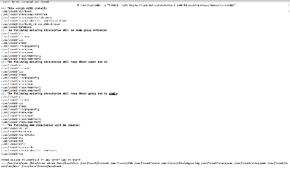
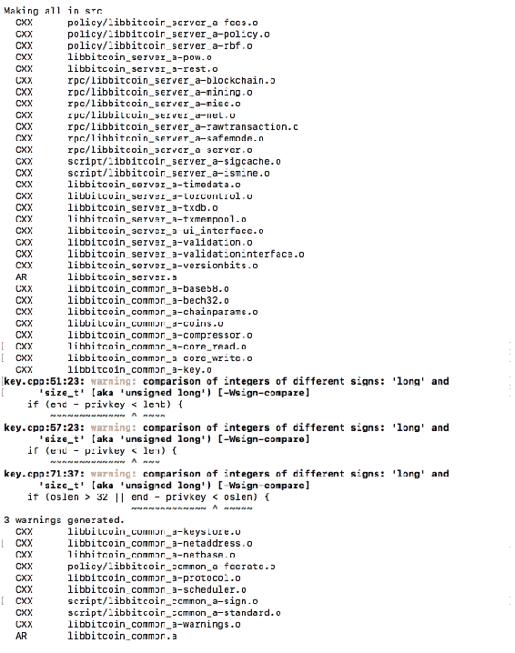
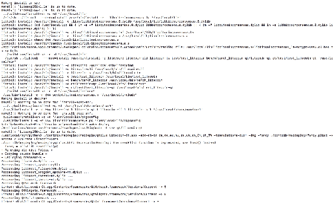

# 创造自己的货币

到目前为止，我们已经广泛讨论了区块链、比特币和替代币。我们已经讨论了比特币的各种错综复杂的关系，它的区块链，以及形成区块链的其他元素。到目前为止，以太坊是本书大部分内容的一个有趣主题。我们还了解到其他基于区块链的项目包含基于货币的项目。

以太坊已经使去中心化的应用成为可能，尽管他们几乎没有开发知识。在以太坊和其他类似项目的基础上建立的交易所有各种各样的代币可用，并且得到了支持者和社区的认可。

在本章中，我们将讨论以下主题:

*   加密货币的类型
*   设置 Litecoin
*   运行莱特币库
*   在 Litecoin 库之上创建自己的硬币

# 了解加密货币的类型

有三种方法可以创建自己的加密货币。两者各有千秋。在创造一种货币之前，重要的是要知道所有涉及的错综复杂，以及你的硬币与目前在交易所可以买到的其他硬币相比提供了什么。流行硬币的列表可以在 https://coinmarketcap.com 找到。

# 基于现有区块链的令牌

这些令牌基于现有的区块链平台，如以太坊、Omni、NEO 等。我们已经在前面的[第 15 章](15.html)、*以太坊开发*中讨论过关于 token 的开发。令牌有助于更快地创建硬币，并支持快速进入市场策略，以便可以将大部分时间投入到自托管区块链的进一步开发中。

有各种各样的区块链项目的例子，开始作为一个象征，并张贴成功的图标，一旦他们开始自己的完全支持的区块链完成一枚硬币。由于与硬币相比，开发令牌更快、更容易，因此这类项目很容易获得关注并立即启动，而且大部分时间可以投入到其他重要任务中，如白皮书创建、ICO 等。

# 从零开始创造一个新区块链

在这种方法中，可以从零开始创建自己的区块链。从比特币和其他区块链平台中获得启示将有助于创造比特币，这将允许你集成新的功能，也可以使用不同的共识技术。

# 一个分叉的区块链有自己的创世积木

我们在这一章的主要焦点是关于这种类型的硬币发展；在推出以太坊、交易对手、NEO 等平台后，我们将创造自己的硬币，并配有自己的区块链。通过获取诸如比特币、莱特币等现有硬币来创建自己的区块链的资源有限。并在此基础上创造自己的加密货币。

# 莱特币的发展

莱特币是首批建立在比特币基础上的加密货币之一。莱特币的来源是从比特币的核心代码中分叉出来的，包括钱包和比特币的其他来源。莱特币相对于比特币的主要变化是 PoW 算法是脚本，而不是比特币的 SHA-256。除此之外，Litecoin 的供币上限为 84，000，000 LTC，封锁时间为 2.5 分钟。

# 该过程

在这一章中，我们将分叉 Litecoin 源代码，并在此基础上工作。以下是相关步骤的简要概述:

*   制定项目的布局和要求。
*   算法的选择，这个过程可以选择各种算法。在这一章中，我们将继续讨论 Litecoin 本身使用的脚本算法。
*   **共识类型**:基于社区支持，可以使用 PoW、PoS 或任何其他共识类型。在这一章中，我们将使用 PoW 共识类型，这将要求矿工开采硬币并确认交易。
*   **币名**:币名要定了。
*   **币简称**:如对于比特币，使用 BTC，对于莱特币，使用 LTC 同样，需要一个缩写，所以缩写最好与硬币名称相似。
*   **连接端口**:选择连接网络的端口很重要；连接到区块链网络的每个节点都将使用该端口。
*   **方块奖励**:设定方块奖励很重要，也就是矿工开采一个方块会得到奖励的金币数量。
*   **区块减半时间**:这是区块奖励将减半的时间，例如，在比特币中，每 210，000 个区块，区块奖励减半，这控制了硬币的生产。
*   **硬币供应限额**:这是所有矿工总共生产的硬币的限额；这通常由区块减半时间控制，因为在一定数量的区块之后，开采更多的区块是不可行的。
*   **比特币基地到期日**:设定要开采的区块数，然后才能花掉区块开采奖励中获得的开采硬币，这一点很重要。
*   **确认**:这是在交易被确认之前要挖掘的区块数。
*   **难度再调整时间**:比如比特币，难度再调整时间为两周；同样，在开发过程中也需要设置这个时间。
*   **区块开采时间**:开采一个区块需要花费的总时间。
*   **种子节点**:这是作为硬币起始节点的节点；在足够多的节点同步并连接到网络之前，保持节点始终在线是非常重要的。有多个可用的种子节点地址是可以接受的。我们还可以选择 DNS 种子，它只是包含区块链网络上种子节点地址的 DNS 服务器。
*   **Wallet UI** :核心 Wallet 构建在 QT 框架上，其 GUI 可以根据需要改变。
*   **图形资产**:可以在 Litecoin 源中选择和替换硬币和其他图形资产的图标；还建议保持图标的大小属性。

# 创造自己的加密货币

一旦定义了前面列出的参数，就可以根据需要对源代码进行修改了。

# 设置 Litecoin

在我们的本地机器上设置 Litecoin 环境是很重要的；GitHub 上的源代码如下:[https://github.com/litecoin-project/litecoin](https://github.com/litecoin-project/litecoin)。

# 平台选择

选择要在其上建立环境的构建平台是很重要的。您可以在源代码的`doc`子文件夹中找到所需的构建指令。在那里，为您提供了首选平台所需的说明文件，以便您按照步骤安装 Litecoin 内核和钱包。

在本节中，我们将学习 Max OS X 构建指令，尽管在建议的指令路径中也有针对其他平台的指令。

# 准备

需要安装`xcode`来编译所需的依赖项。应该在终端中执行以下命令:

```
xcode-select --install
```

接下来需要安装 macOS 的软件包管理器`brew`。以下命令用于安装`brew`:

```
/usr/bin/ruby -e "$(curl -fsSL https://raw.githubusercontent.com/Homebrew/install/master/install)"
```



# 依赖安装

安装完`brew`后，下一步是使用以下命令安装所需的依赖项:


```
brew install automake berkeley-db4 libtool boost miniupnpc openssl pkg-config protobuf python3 qt libevent
```

上述命令将根据需要安装所有必需的依赖项:


# 构建说明

第一步是在根目录或任何其他目录中克隆 Litecoin:

```
git clone https://github.com/litecoin-project/litecoin
cd Litecoin
```

使用以下命令安装`BerkleyDb`:

```
./contrib/install_db4.sh .
```

Litecoin-core 的构建使用以下 make 命令:

```
./autogen.sh
./configure
make
```



您可以运行单元测试来确保构建成功，没有任何错误:

```
make check
```

包含`.app`包的`.dmg`的部署如下所示:



```
make deploy
```


# 建立我们自己的硬币

现在，是时候创造我们自己的硬币了；为此，检查克隆目录和 Litecoin 是很重要的，并制作一个副本以防任何步骤被证明是致命的。

根据我们在前面一节中列出的参数，是时候在必要的位置替换这些参数了。

`src`目录包含 Litecoin 核心源代码，大部分参数将在这里设置。在`chainparams.cpp`文件中，将缩写从`LTC`更改为我们选择的缩写。类似地，所有其他适合缩写的文件都将按照建议进行更改。

# 端口选择

现在，需要更改端口，以便我们的区块链在网络中所有节点的相关端口上工作。

应该在`init.cpp`文件中更改连接端口。

RPC 端口应该在`bitcoinrpc.cpp`文件中更改。

# 块相关参数的设置

在`validation.cpp`文件中，应编辑以下参数:

*   断流阀
*   集体奖励
*   封锁时间
*   难度重定目标时间
*   难度再目标量表

应在`GetBlockSubsidy()`功能中更改块值:

```
CAmount GetBlockSubsidy(int nHeight, const Consensus::Params& consensusParams)
{
 int halvings = nHeight / consensusParams.nSubsidyHalvingInterval;
 // Force block reward to zero when right shift is undefined.
 if (halvings >= 64)
 return 0;

 CAmount nSubsidy = 50 * COIN;
 // Subsidy is cut in half every 210,000 blocks which will occur approximately every 4 years.
 nSubsidy >>= halvings;
 return nSubsidy;
}
```

# 金额限制

现在，是时候设置硬币限额和最小值了，同样的操作可以在`amount.h`文件中完成:

```
typedef int64_t CAmount;

static const CAmount COIN = 100000000;
static const CAmount CENT = 1000000;

static const CAmount MAX_MONEY = 84000000 * COIN;
inline bool MoneyRange(const CAmount& nValue) { return (nValue >= 0 && nValue <= MAX_MONEY); }

#endif // BITCOIN_AMOUNT_H
```

# coinbase 到期数

要更改硬币库的到期时间，在`qt`子文件夹中，应更改`transactionrecord.cpp`文件，以设置在开采的硬币可以被花费之前需要找到的块数:

```
  if (nNet > 0 || wtx.IsCoinBase())
    {
        //
        // Credit
        //
        for(unsigned int i = 0; i < wtx.tx->vout.size(); i++)
        {
            const CTxOut& txout = wtx.tx->vout[i];
            isminetype mine = wallet->IsMine(txout);
            if(mine)
            {
                TransactionRecord sub(hash, nTime);
                CTxDestination address;
                sub.idx = i; // vout index
                sub.credit = txout.nValue;
                sub.involvesWatchAddress = mine & ISMINE_WATCH_ONLY;
                if (ExtractDestination(txout.scriptPubKey, address) && IsMine(*wallet, address))
                {
                    // Received by Bitcoin Address
                    sub.type = TransactionRecord::RecvWithAddress;
                    sub.address = EncodeDestination(address);
                }
                else
                {
                    // Received by IP connection (deprecated features), or a multisignature or other non-simple transaction
                    sub.type = TransactionRecord::RecvFromOther;
                    sub.address = mapValue["from"];
                }
                if (wtx.IsCoinBase())
                {
                    // Generated
                    sub.type = TransactionRecord::Generated;
                }

                parts.append(sub);
            }
        }
    }
    else
    {
        bool involvesWatchAddress = false;
        isminetype fAllFromMe = ISMINE_SPENDABLE;
        for (const CTxIn& txin : wtx.tx->vin)
        {
            isminetype mine = wallet->IsMine(txin);
            if(mine & ISMINE_WATCH_ONLY) involvesWatchAddress = true;
            if(fAllFromMe > mine) fAllFromMe = mine;
        }

        isminetype fAllToMe = ISMINE_SPENDABLE;
        for (const CTxOut& txout : wtx.tx->vout)
        {
            isminetype mine = wallet->IsMine(txout);
            if(mine & ISMINE_WATCH_ONLY) involvesWatchAddress = true;
            if(fAllToMe > mine) fAllToMe = mine;
        }

        if (fAllFromMe && fAllToMe)
        {
            // Payment to self
            CAmount nChange = wtx.GetChange();

            parts.append(TransactionRecord(hash, nTime, TransactionRecord::SendToSelf, "",
                            -(nDebit - nChange), nCredit - nChange));
            parts.last().involvesWatchAddress = involvesWatchAddress; // maybe pass to TransactionRecord as constructor argument
        }
```

根据我们的要求，我们必须更改`transactionrecord.cpp`文件中的交易确认计数来设置该参数。

# 创世纪区块创建

genesis 块是从`LoadBlockIndex()`函数创建的，该函数存在于`validation.cpp`文件中:

```
bool CChainState::LoadBlockIndex(const Consensus::Params& consensus_params, CBlockTreeDB& blocktree)
{
    if (!blocktree.LoadBlockIndexGuts(consensus_params, [this](const uint256& hash){ return this->InsertBlockIndex(hash); }))
        return false;

    boost::this_thread::interruption_point();

    // Calculate nChainWork
    std::vector<std::pair<int, CBlockIndex*> > vSortedByHeight;
    vSortedByHeight.reserve(mapBlockIndex.size());
    for (const std::pair<uint256, CBlockIndex*>& item : mapBlockIndex)
    {
        CBlockIndex* pindex = item.second;
        vSortedByHeight.push_back(std::make_pair(pindex->nHeight, pindex));
    }
    sort(vSortedByHeight.begin(), vSortedByHeight.end());
    for (const std::pair<int, CBlockIndex*>& item : vSortedByHeight)
    {
        CBlockIndex* pindex = item.second;
        pindex->nChainWork = (pindex->pprev ? pindex->pprev->nChainWork : 0) + GetBlockProof(*pindex);
        pindex->nTimeMax = (pindex->pprev ? std::max(pindex->pprev->nTimeMax, pindex->nTime) : pindex->nTime);
        // We can link the chain of blocks for which we've received transactions at some point.
        // Pruned nodes may have deleted the block.
        if (pindex->nTx > 0) {
            if (pindex->pprev) {
                if (pindex->pprev->nChainTx) {
                    pindex->nChainTx = pindex->pprev->nChainTx + pindex->nTx;
                } else {
                    pindex->nChainTx = 0;
                    mapBlocksUnlinked.insert(std::make_pair(pindex->pprev, pindex));
                }
            } else {
                pindex->nChainTx = pindex->nTx;
            }
        }
        if (!(pindex->nStatus & BLOCK_FAILED_MASK) && pindex->pprev && (pindex->pprev->nStatus & BLOCK_FAILED_MASK)) {
            pindex->nStatus |= BLOCK_FAILED_CHILD;
            setDirtyBlockIndex.insert(pindex);
        }
        if (pindex->IsValid(BLOCK_VALID_TRANSACTIONS) && (pindex->nChainTx || pindex->pprev == nullptr))
            setBlockIndexCandidates.insert(pindex);
        if (pindex->nStatus & BLOCK_FAILED_MASK && (!pindexBestInvalid || pindex->nChainWork > pindexBestInvalid->nChainWork))
            pindexBestInvalid = pindex;
        if (pindex->pprev)
            pindex->BuildSkip();
        if (pindex->IsValid(BLOCK_VALID_TREE) && (pindexBestHeader == nullptr || CBlockIndexWorkComparator()(pindexBestHeader, pindex)))
            pindexBestHeader = pindex;
    }

    return true;
}
```

此外，在`chainparams.cpp`中，释义将被更改为必要的选择参数。在 Litecoin 中，使用以下参数:

```
    const char* pszTimestamp = "NY Times 05/Oct/2011 Steve Jobs, Apple’s Visionary, Dies at 56";
```

# 钱包地址

钱包地址是区块链的重要组成部分，因为没有正确的私钥和公钥，就不可能对莱特币的来源进行相关更改。起始字母可以在`base58.cpp`文件中设置。

# 检查站

检查点被硬编码到 Litecoin 核心客户端中。设置检查点后，在检查点条件有效之前，所有事务都是有效的。这是为了防止有人想分叉区块链，从同一块开始；检查点将呈现 false，并且不会接受任何进一步的事务。`checkpoints.cpp`文件有助于管理区块链源代码中的检查点:

```
namespace Checkpoints {

    CBlockIndex* GetLastCheckpoint(const CCheckpointData& data)
    {
        const MapCheckpoints& checkpoints = data.mapCheckpoints;

        for (const MapCheckpoints::value_type& i : reverse_iterate(checkpoints))
        {
            const uint256& hash = i.second;
            BlockMap::const_iterator t = mapBlockIndex.find(hash);
            if (t != mapBlockIndex.end())
                return t->second;
        }
        return nullptr;
   }
```

# 创意和图形

图标和其他图形可以从`src/qt/res/icons`目录中设置和替换，该目录包含所有图像和硬币的主标志。

文件`bitcoin.png`和`about.png`包含特定硬币的标志。

# 总结

通过遵循上述要点，可以使用 Litecoin 源创建硬币并使其工作；一旦硬币被创造出来并投入使用，接下来的步骤将是测试实际生产水平的使用。进一步的步骤包括编译硬币源和使用基于 QT 的钱包:


# 摘要

在本章中，我们讨论了我们自己的加密货币的创建，因为我们已经在第十五章、*以太坊开发*中讨论了基于以太坊平台的代币的创建。在这一章中，我们创建了我们自己的区块链，通过一个 Litecoin 的分叉，然后进行必要的更改来创建具有相关参数的所需硬币。

在接下来的章节中，我们将从区块链的未来，也就是区块链面临的可扩展性和其他挑战的角度来阐述硬币的两面。此外，我们将讨论区块链的未来，以及它将如何塑造互联网和技术的未来，不仅是在以货币为基础的行业方面，而且在区块链作为游戏规则改变者的其他行业方面。