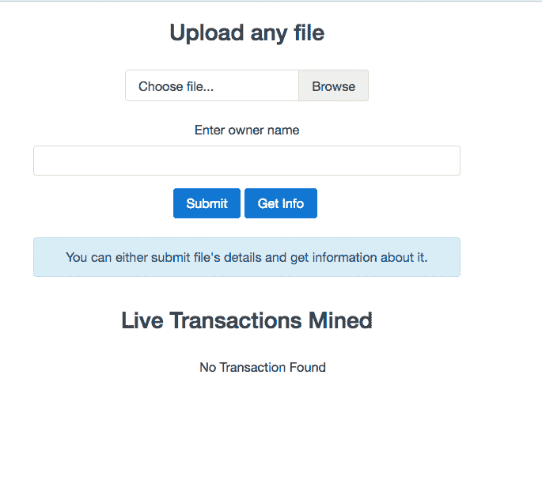
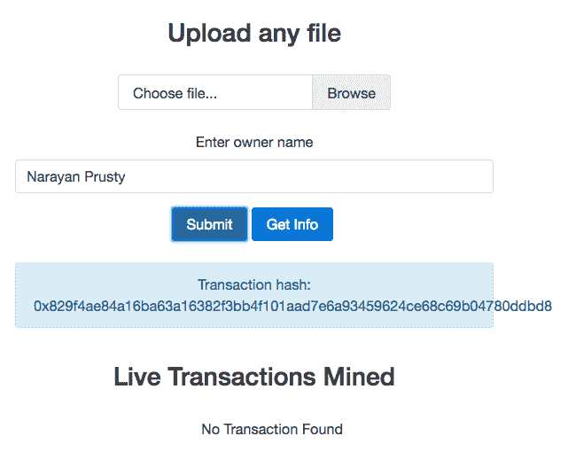
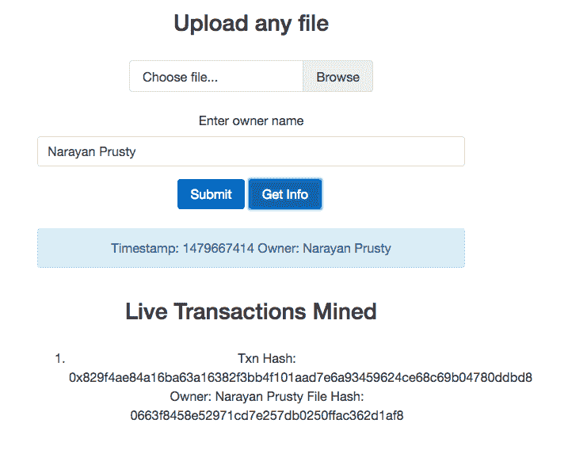

# web3.js 入门

在前一章中，我们学习了如何编写智能合约，并使用 geth 的交互控制台来部署和广播使用 web3.js 的事务。在本章中，我们将学习 web3.js 以及如何导入、连接到 geth，并在 Node.js 或客户端 JavaScript 中使用它。我们还将学习如何使用 web3.js 为我们在前一章中创建的智能合约构建 web 客户端。

在本章中，我们将讨论以下主题:

*   在 Node.js 和客户端 JavaScript 中导入 web3.js
*   连接到 geth
*   探索使用 web3.js 可以做的各种事情
*   发现 web3.js 的各种最常用的 API
*   为所有权契约构建 Node.js 应用程序

# web3.js 简介

web3.js 为我们提供了与 geth 通信的 JavaScript APIs。它在内部使用 JSON-RPC 与 geth 通信。web3.js 还可以与任何其他类型的支持 JSON-RPC 的以太坊节点通信。它将所有 JSON-RPC API 公开为 JavaScript APIs 也就是说，它不仅仅支持所有以太坊相关的 APIs 它还支持与 Whisper 和 Swarm 相关的 API。

随着我们构建各种项目，您将会对 web3.js 了解得越来越多，但是现在，让我们先来看看一些最常用的 web3.js API，然后我们将使用 web 3 . js 为我们的所有权智能合约构建一个前端。

在撰写本文时，web3.js 的最新版本是 0.16.0。我们将学习关于这个版本的一切。

web3.js 托管在[https://github.com/ethereum/web3.js](https://github.com/ethereum/web3.js)，完整的文档托管在[https://github.com/ethereum/wiki/wiki/JavaScript-API](https://github.com/ethereum/wiki/wiki/JavaScript-API)。

# 导入 web3.js

要在 Node.js 中使用 web3.js，只需在项目目录中运行`npm install web3`，在源代码中，可以使用`require("web3");`将其导入。

要在客户端 JavaScript 中使用 web3.js，可以将`web3.js`文件入队，该文件可以在项目源代码的`dist`目录中找到。现在你将拥有全球可用的`Web3`对象。

# 连接到节点

web3.js 可以使用 HTTP 或 IPC 与节点通信。我们将使用 HTTP 来建立与节点的通信。web3.js 允许我们与多个节点建立连接。`web3`的实例表示与节点的连接。该实例公开了 API。

当一个应用程序在 mist 中运行时，它会自动提供一个连接到 Mist 节点的`web3`实例。实例的变量名是`web3`。

以下是连接到节点的基本代码:

```
if (typeof web3 !== 'undefined') { 
  web3 = new Web3(new Web3.providers.HttpProvider("http://localhost:8545")); 
} 

```

首先，我们在这里通过检查`web3`是否为`undefined`来检查代码是否在 mist 内部运行。如果定义了`web3`，那么我们使用已经可用的实例；否则，我们通过连接到自定义节点来创建一个实例。如果您想连接到自定义节点，而不管应用程序是否在 mist 中运行，那么从前面的代码中删除`if`条件。这里，我们假设我们的定制节点在本地端口号`8545`上运行。

`Web3.providers`对象公开构造函数(在这个上下文中称为提供者)来建立连接，并使用各种协议传输消息。`Web3.providers.HttpProvider`让我们建立一个 HTTP 连接，而`Web3.providers.IpcProvider`让我们建立一个 IPC 连接。

`web3.currentProvider`属性被自动分配给当前的提供者实例。创建 web3 实例后，您可以使用`web3.setProvider()`方法更改它的提供者。它接受一个参数，即新提供程序的实例。

记住 geth 默认禁用 HTTP-RPC。所以在运行 geth 时通过传递`--rpc`选项来启用它。默认情况下，HTTP-RPC 在端口 8545 上运行。

`web3`公开了一个`isConnected()`方法，可以用来检查它是否连接到节点。根据连接状态返回`true`或`false`。

# API 结构

`web3`包含一个专门用于以太坊区块链交互的`eth`对象(`web3.eth`)和一个用于耳语交互的`shh`对象(`web3.shh`)。web3.js 的大多数 API 都在这两个对象内部。

默认情况下，所有 API 都是同步的。如果您想要进行异步请求，您可以将可选的回调作为最后一个参数传递给大多数函数。所有回调都使用错误优先的回调方式。

一些 API 有异步请求的别名。例如，`web3.eth.coinbase()`是同步的，而`web3.eth.getCoinbase()`是异步的。

这里有一个例子:

```

//sync request 
try 
{ 
  console.log(web3.eth.getBlock(48)); 
} 
catch(e) 
{ 
  console.log(e); 
} 

//async request 
web3.eth.getBlock(48, function(error, result){ 
    if(!error) 
        console.log(result) 
    else 
        console.error(error); 
}) 

```

`getBlock`用于使用块的编号或散列来获取块的信息。或者，它可以采用一个字符串，如`"earliest"`(创世纪区块)`"latest"`(区块链的顶部区块)，或`"pending"`(正在开采的区块)。如果没有传递参数，那么默认为`web3.eth.defaultBlock`，默认赋给`"latest"`。

所有需要块标识作为输入的 API 都可以接受一个数字、散列或一个可读的字符串。如果没有传递值，这些 API 默认使用`web3.eth.defaultBlock`。

# BigNumber.js

JavaScript 天生就不擅长正确处理大数字。因此，需要你处理大数，需要完美计算的应用程序使用`BigNumber.js`库来处理大数。

web3.js 也依赖于 BigNumber.js，它自动添加。web3.js 总是返回数字值的`BigNumber`对象。它可以接受 JavaScript 数字、数字字符串和`BigNumber`实例作为输入。

这里有一个例子来说明这一点:

```
web3.eth.getBalance("0x27E829fB34d14f3384646F938165dfcD30cFfB7c").toString(); 

```

这里，我们使用`web3.eth.getBalance()`方法来获得一个地址的余额。这个方法返回一个`BigNumber`对象。我们需要在一个`BigNumber`对象上调用`toString()`，将它转换成一个数字字符串。

`BigNumber.js`无法正确处理超过 20 位浮点数字；因此，建议您以卫单位存储余额，并在显示时将其转换为其他单位。web3.js 本身总是回归，在魏身上取平衡。例如，`getBalance()`方法返回地址在 wei 单元中的余额。

# 单位换算

web3.js 提供了将 wei 余额转换成任何其他单位以及将任何其他单位余额转换成 wei 的 API。

`web3.fromWei()`方法用于将魏数转换成任何其他单位，而`web3.toWei()`方法用于将任何其他单位的数转换成魏。这里有一个例子来说明这一点:

```
web3.fromWei("1000000000000000000", "ether"); 
web3.toWei("0.000000000000000001", "ether"); 

```

在第一行，我们把卫转换成以太，在第二行，我们把以太转换成卫。两种方法中的第二个参数可以是以下字符串之一:

*   `kwei/ada`
*   `mwei/babbage`
*   `gwei/shannon`
*   `szabo`
*   `finney`
*   `ether`
*   `kether/grand/einstein`
*   `mether`
*   `gether`
*   `tether`

# 检索天然气价格、余额和交易详细信息

让我们看一下检索汽油价格、地址余额和挖掘交易信息的 API:

```
//It's sync. For async use getGasPrice 
console.log(web3.eth.gasPrice.toString()); 

console.log(web3.eth.getBalance("0x407d73d8a49eeb85d32cf465507dd71d507100c1", 45).toString()); 

console.log(web3.eth.getTransactionReceipt("0x9fc76417374aa880d4449a1f7f31ec597f00b1f6f3dd2d66f4c9c6c445836d8b")); 

```

输出将采用以下形式:

```
20000000000 
30000000000 
{ 
  "transactionHash": "0x9fc76417374aa880d4449a1f7f31ec597f00b1f6f3dd2d66f4c9c6c445836d8b ", 
  "transactionIndex": 0, 
  "blockHash": "0xef95f2f1ed3ca60b048b4bf67cde2195961e0bba6f70bcbea9a2c4e133e34b46", 
  "blockNumber": 3, 
  "contractAddress": "0xa94f5374fce5edbc8e2a8697c15331677e6ebf0b", 
  "cumulativeGasUsed": 314159, 
  "gasUsed": 30234 
} 

```

以下是上述方法的工作原理:

*   `web3.eth.gasPrice()`:根据 x 个最新区块的气价中值确定气价。
*   `web3.ethgetBalance()`:返回任意给定地址的余额。所有的散列应该以十六进制字符串的形式提供给 web 3 . js API，而不是十六进制文字。solidity `address`类型的输入也应该是十六进制字符串。
*   `web3.eth.getTransactionReceipt()`:这是用来获得一个交易的详细信息，使用它的散列。如果在区块链中找到交易，则它返回交易收据对象；否则，它返回 null。交易收据对象包含以下属性:
    *   `blockHash`:该事务所在的块的散列
    *   `blockNumber`:该交易所在的块号
    *   `transactionHash`:交易的哈希
    *   `transactionIndex`:块中事务索引位置的整数
    *   `from`:发件人的地址
    *   `to`:收款人的地址；`null`当是合同创建交易时
    *   `cumulativeGasUsed`:在区块中执行该交易时使用的气体总量
    *   `gasUsed`:该笔具体交易单独使用的气体量
    *   `contractAddress`:如果交易是合同创建，则创建的合同地址；否则为空
    *   `logs`:该事务生成的日志对象数组

# 发送以太网

让我们看看如何将以太发送到任何地址。要发送以太，需要使用`web3.eth.sendTransaction()`方法。此方法可用于发送任何类型的事务，但主要用于发送以太网，因为使用此方法部署协定或调用协定的方法很麻烦，因为它需要您生成事务的数据，而不是自动生成。它采用具有以下属性的事务对象:

*   `from`:发送账户的地址。如果未指定，则使用`web3.eth.defaultAccount`属性。
*   这是可选的。它是消息的目的地址，对于契约创建事务来说是未定义的。
*   这是可选的。如果是合同创建交易，则为 wei 中的交易以及捐赠转移价值。
*   这是可选的。这是交易中使用的汽油量(未使用的汽油将被退还)。如果没有提供，那么它是自动确定的。
*   这是可选的。是本次交易在卫的气价，默认为平均网气价。
*   这是可选的。它或者是一个包含消息相关数据的字节字符串，或者在契约创建事务的情况下，是初始化代码。
*   这是可选的。它是一个整数。每个事务都有一个与之相关联的随机数。nonce 是指示由事务的发送者发送的事务的数量的计数器。如果没有提供，则自动确定。它有助于防止重放攻击。该随机数不是与块相关联的随机数。如果我们使用的 nonce 大于事务应该拥有的 nonce，那么该事务将被放入队列中，直到其他事务到达。例如，如果下一个事务 nonce 应该是 4，如果我们将 nonce 设置为 10，那么 geth 将在广播这个事务之前等待中间的六个事务。nonce 为 10 的事务称为排队事务，它不是挂起事务。

让我们看一个如何将以太网发送到一个地址的示例:

```
var txnHash = web3.eth.sendTransaction({ 
  from: web3.eth.accounts[0], 
  to: web3.eth.accounts[1], 
  value: web3.toWei("1", "ether") 
}); 

```

这里，我们从账号 0 向账号 1 发送一个以太。运行 geth 时，确保使用`unlock`选项解锁两个帐户。在 geth 交互控制台中，它提示输入密码，但是如果帐户被锁定，交互控制台之外的 web3.js API 将抛出一个错误。此方法返回事务的事务哈希。然后，您可以使用`getTransactionReceipt()`方法检查事务是否被挖掘。

您还可以使用`web3.personal.listAccounts()`、`web3.personal.unlockAccount(addr, pwd)`和`web3.personal.newAccount(pwd)`API 在运行时管理帐户。

# 使用合同

让我们学习如何部署一个新的契约，使用它的地址获取对已部署契约的引用，向一个契约发送以太网，发送一个事务来调用一个契约方法，以及估计方法调用的 gas。

为了部署一个新的契约或者获取对一个已经部署的契约的引用，您需要首先使用`web3.eth.contract()`方法创建一个契约对象。它将合同 ABI 作为参数，并返回合同对象。

下面是创建契约对象的代码:

```
var proofContract = web3.eth.contract([{"constant":false,"inputs":[{"name":"fileHash","type":"string"}],"name":"get","outputs":[{"name":"timestamp","type":"uint256"},{"name":"owner","type":"string"}],"payable":false,"type":"function"},{"constant":false,"inputs":[{"name":"owner","type":"string"},{"name":"fileHash","type":"string"}],"name":"set","outputs":[],"payable":false,"type":"function"},{"anonymous":false,"inputs":[{"indexed":false,"name":"status","type":"bool"},{"indexed":false,"name":"timestamp","type":"uint256"},{"indexed":false,"name":"owner","type":"string"},{"indexed":false,"name":"fileHash","type":"string"}],"name":"logFileAddedStatus","type":"event"}]); 

```

一旦有了契约，就可以使用契约对象的`new`方法来部署它，或者使用`at`方法来获取对已经部署的与 ABI 匹配的契约的引用。

让我们看一个如何部署新合同的示例:

```
var proof = proofContract.new({ 
     from: web3.eth.accounts[0],  
     data: "0x606060405261068...",  
     gas: "4700000" 
    },  
    function (e, contract){ 
    if(e) 
    { 
    console.log("Error " + e);     
}     
else if(contract.address != undefined) 
  {     
    console.log("Contract Address: " + contract.address);     
   }     
else      
  {     
    console.log("Txn Hash: " + contract.transactionHash)     
  } 
}) 

```

这里，`new`方法被异步调用，因此如果事务被成功创建和广播，回调将被触发两次。第一次是在事务播出后调用，第二次是在事务挖掘后调用。如果不提供回调，那么`proof`变量的`address`属性将被设置为`undefined`。一旦契约被开采，`address`属性将被设定。

在`proof`契约中，没有构造函数，但是如果有构造函数，那么构造函数的参数应该放在`new`方法的开头。我们传递的对象包含 from 地址、契约的字节码和要使用的最大 gas。这三个属性必须存在；否则，不会创建交易。这个对象可以拥有传递给`sendTransaction()`方法的对象中存在的属性，但是在这里，`data`是契约字节码，`to`属性被忽略。

您可以使用`at`方法来获取对已经部署的契约的引用。下面是演示这一点的代码:

```
var proof = proofContract.at("0xd45e541ca2622386cd820d1d3be74a86531c14a1"); 

```

现在让我们看看如何发送一个事务来调用一个契约的方法。这里有一个例子来说明这一点:

```
proof.set.sendTransaction("Owner Name", "e3b0c44298fc1c149afbf4c8996fb92427ae41e4649b934ca495991b7852b855", { 

from: web3.eth.accounts[0], 
}, function(error, transactionHash){ 

if (!err) 

console.log(transactionHash); 
}) 

```

在这里，我们将方法的对象的`sendTransaction`方法称为同名方法。传递给这个`sendTransaction`方法的对象具有与`web3.eth.sendTransaction()`相同的属性，除了`data`和`to`属性被忽略。

如果您想在节点本身上调用一个方法，而不是创建一个事务并广播它，那么您可以使用`call`而不是`sendTransaction`。这里有一个例子来说明这一点:

```
var returnValue = proof.get.call("e3b0c44298fc1c149afbf4c8996fb92427ae41e4649b934ca495991b7852b855"); 

```

有时，有必要找出调用一个方法所需的气体，以便您可以决定是否调用它。`web3.eth.estimateGas`可用于此目的。但是直接使用`web3.eth.estimateGas()`需要你生成交易的数据；因此，我们可以使用与方法同名的对象的`estimateGas()`方法。这里有一个例子来说明这一点:

```
var estimatedGas = proof.get.estimateGas("e3b0c44298fc1c149afbf4c8996fb92427ae41e4649b934ca495991b7852b855"); 

```

如果你想在不调用任何方法的情况下发送一些以太到一个契约，那么你可以简单地使用`web3.eth.sendTransaction`方法。

# 检索和监听合同事件

现在让我们看看如何从合同中观察事件。监视事件非常重要，因为事务调用方法的结果通常是通过触发事件返回的。

在我们进入如何检索和观察事件之前，我们需要学习事件的索引参数。一个事件最多可以有三个参数具有`indexed`属性。此属性用于通知节点对其进行索引，以便应用程序客户端可以搜索具有匹配返回值的事件。如果不使用 indexed 属性，那么它必须从节点中检索所有事件，并过滤出需要的事件。例如，您可以这样编写`logFileAddedStatus`事件:

```
event logFileAddedStatus(bool indexed status, uint indexed timestamp, string owner, string indexed fileHash); 

```

以下是演示如何监听合同事件的示例:

```
var event = proof.logFileAddedStatus(null, { 
fromBlock: 0, 
toBlock: "latest" 
}); 
event.get(function(error, result){ 
if(!error) 
{ 
  console.log(result); 
} 
else 
{ 
  console.log(error); 
} 
}) 
event.watch(function(error, result){ 
if(!error) 
{ 
  console.log(result.args.status); 
} 
else 
{ 
  console.log(error); 
} 
}) 
setTimeout(function(){ 
event.stopWatching(); 
}, 60000) 
 var events = proof.allEvents({ 
fromBlock: 0, 
 toBlock: "latest" 
}); 
events.get(function(error, result){ 
if(!error) 
{ 
  console.log(result); 
} 
else 
{ 
  console.log(error); 
} 
}) 
events.watch(function(error, result){ 
if(!error) 
{ 
  console.log(result.args.status); 
} 
else 
{ 
  console.log(error); 
} 
}) 
setTimeout(function(){ 
events.stopWatching(); 
}, 60000)

```

前面的代码是这样工作的:

1.  首先，我们通过在一个契约实例上调用事件同名的方法来获取事件对象。此方法将两个对象作为参数，用于筛选事件:
    *   第一个对象用于根据索引返回值过滤事件:例如，`{'valueA': 1, 'valueB': [myFirstAddress, mySecondAddress]}`。默认情况下，所有滤波器值都设置为`null`。这意味着它们将匹配从此协定发送的给定类型的任何事件。
    *   下一个对象可以包含三个属性:`fromBlock`(最早的块；默认是`"latest"`)，`toBlock`(最新区块；默认情况下，它是`"latest"`，和`address`(一个地址列表，只从中获取日志；默认为合同地址)。

2.  `event`对象公开了三种方法:`get`、`watch`和`stopWatching`。`get`用于获取 block 范围内的所有事件。`watch`类似于`get`，但是它在获取事件后观察变化。而`stopWatching`可以用来停止观察变化。
3.  然后，我们有了契约实例的`allEvents`方法。它用于检索合同的所有事件。
4.  每个事件都由包含以下属性的对象表示:
    *   `args`:带有事件参数的对象
    *   `event`:表示事件名称的字符串
    *   `logIndex`:表示块中日志索引位置的整数
    *   `transactionIndex`:表示创建索引位置日志的交易的整数
    *   `transactionHash`:一个字符串，表示创建此日志的事务的散列
    *   `address`:表示该日志来源地址的字符串
    *   `blockHash`:表示该日志所在块的哈希的字符串；`null`当其待定时
    *   `blockNumber`:该日志所在的块号；`null`当其待定时

web3.js 提供了一个`web3.eth.filter` API 来检索和观察事件。您可以使用这个 API，但是早期的方法处理事件的方式要简单得多。你可以在[https://github . com/ether eum/wiki/wiki/JavaScript-API # web 3 eth filter](https://github.com/ethereum/wiki/wiki/JavaScript-API#web3ethfilter)了解更多信息。

# 为所有权合同构建客户端

在前一章中，我们为所有权契约编写了 Solidity 代码，在前一章和本章中，我们都学习了 web3.js 以及如何使用 web3.js 调用契约的方法。现在，是时候为我们的智能契约构建一个客户端了，以便用户可以轻松地使用它。

我们将构建一个客户端，用户选择一个文件并输入所有者的详细信息，然后单击 Submit 来广播一个事务，用文件散列和所有者的详细信息调用契约的`set`方法。一旦交易成功广播，我们将显示交易散列。用户还可以选择一个文件，并从智能合同中获取所有者的详细信息。客户端还会实时显示最近挖掘的`set`交易。

我们将使用 sha1.js 在前端获取文件的散列，使用 jQuery 进行 DOM 操作，使用 Bootstrap 4 创建响应性布局。我们将在后端使用 express.js 和 web3.js。我们将使用 socket.io，以便后端将最近挖掘的事务推送到前端，而前端不会在每个相等的时间间隔后请求数据。

web3.js 可以用在前端。但是对于这个应用来说，会有安全风险；也就是说，我们使用存储在 geth 中的帐户，并将 geth 节点 URL 暴露给前端，这将使存储在这些帐户中的 ether 面临风险。

# 项目结构

在本章的练习文件中，您会发现两个目录:`Final`和`Initial. Final`包含项目的最终源代码，而`Initial`包含空的源代码文件和库，以便快速开始构建应用程序。

为了测试`Final`目录，您需要在其中运行`npm install`,并用部署契约后获得的契约地址替换`app.js`中的硬编码契约地址。然后，使用`Final`目录中的`node app.js`命令运行应用程序。

在`Initial`目录中，你会发现一个`public`目录和两个名为`app.js`和`package.json`的文件。`package.json`包含我们应用的后端依赖项，而`app.js`是你放置后端源代码的地方。

`public`目录包含与前端相关的文件。在`public/css`里面，你会发现`bootstrap.min.css`，这是引导库；在`public/html`里面，你会找到`index.html`，在那里你会放置我们应用的 HTML 代码；在`public/js`目录中，您将找到 jQuery、sha1 和 socket.io 的 JS 文件。在`public/js`中，您还将找到一个`main.js`文件，您将在其中放置我们应用程序的前端 JS 代码。

# 构建后端

我们先来搭建 app 的后端。首先，在`Initial`目录中运行`npm install`，为我们的后端安装所需的依赖项。在我们开始编写后端代码之前，请确保 geth 运行时启用了 rpc。如果您在专用网络上运行 geth，那么请确保还启用了挖掘。最后，确保帐户 0 存在并且已解锁。您可以在启用了 rpc 和挖掘的专用网络上运行 geth，并解锁帐户 0:

```
geth --dev --mine --rpc --unlock=0

```

在开始编码之前，您需要做的最后一件事是使用我们在前一章看到的代码部署所有权契约，并复制契约地址。

现在让我们创建一个单独的服务器，它将为浏览器提供 HTML 并接受`socket.io`连接:

```
var express = require("express");   
var app = express();   
var server = require("http").createServer(app); 
var io = require("socket.io")(server); 
server.listen(8080); 

```

这里，我们将`express`和`socket.io`服务器集成到一个运行在端口`8080`上的服务器中。

现在让我们创建路由来服务静态文件和应用程序的主页。下面是执行此操作的代码:

```
app.use(express.static("public")); 
app.get("/", function(req, res){  
  res.sendFile(__dirname + "/public/html/index.html"); 
}) 

```

这里，我们使用`express.static`中间件来服务静态文件。我们要求它在`public`目录中查找静态文件。

现在让我们连接到`geth`节点，并获取对已部署契约的引用，以便我们可以发送事务并监视事件。下面是执行此操作的代码:

```
var Web3 = require("web3"); 

web3 = new Web3(new Web3.providers.HttpProvider("http://localhost:8545")); 

var proofContract = web3.eth.contract([{"constant":false,"inputs":[{"name":"fileHash","type":"string"}],"name":"get","outputs":[{"name":"timestamp","type":"uint256"},{"name":"owner","type":"string"}],"payable":false,"type":"function"},{"constant":false,"inputs":[{"name":"owner","type":"string"},{"name":"fileHash","type":"string"}],"name":"set","outputs":[],"payable":false,"type":"function"},{"anonymous":false,"inputs":[{"indexed":false,"name":"status","type":"bool"},{"indexed":false,"name":"timestamp","type":"uint256"},{"indexed":false,"name":"owner","type":"string"},{"indexed":false,"name":"fileHash","type":"string"}],"name":"logFileAddedStatus","type":"event"}]); 

var proof = proofContract.at("0xf7f02f65d5cd874d180c3575cb8813a9e7736066"); 

```

代码是不言自明的。把合同地址换成你拿到的那个就行了。

现在让我们创建路由来广播事务并获取有关文件的信息。下面是执行此操作的代码:

```
app.get("/submit", function(req, res){ 
var fileHash = req.query.hash; 
var owner = req.query.owner; 
proof.set.sendTransaction(owner, fileHash, { 
from: web3.eth.accounts[0], 
}, function(error, transactionHash){ 
if (!error) 
{
  res.send(transactionHash); 
} 
else 
{ 
  res.send("Error"); 
} 
}) 
}) 
app.get("/getInfo", function(req, res){ 
var fileHash = req.query.hash; 
var details = proof.get.call(fileHash); 
res.send(details); 
}) 

```

这里，`/submit`路由用于创建和广播事务。一旦我们得到了事务散列，我们就把它发送给客户机。我们没有做任何事情来等待事务挖掘。`/getInfo`路由在节点本身调用契约的 get 方法，而不是创建事务。它只是发送回它得到的任何响应。

现在让我们观察合同中的事件，并将其广播给所有客户端。下面是执行此操作的代码:

```
proof.logFileAddedStatus().watch(function(error, result){ 
if(!error) 
{ 
  if(result.args.status == true) 
  { 
    io.send(result); 
  } 
} 
}) 

```

在这里，我们检查状态是否为真，如果为真，我们才把事件广播给所有连接的`socket.io`客户机。

# 构建前端

让我们从应用程序的 HTML 开始。将这段代码放在`index.html`文件中:

```
<!DOCTYPE html> 
<html lang="en"> 
    <head> 
        <meta name="viewport" content="width=device-width, initial-scale=1, shrink-to-fit=no"> 
        <link rel="stylesheet" href="/css/bootstrap.min.css"> 
    </head> 
    <body> 
        <div class="container"> 
            <div class="row"> 
                <div class="col-md-6 offset-md-3 text-xs-center"> 
                    <br> 
                    <h3>Upload any file</h3> 
                    <br> 
                    <div> 
                        <div class="form-group"> 
                            <label class="custom-file text-xs-left"> 
                                <input type="file" id="file" class="custom-file-input"> 
                                <span class="custom-file-control"></span> 
                            </label> 
                        </div> 
                        <div class="form-group"> 
                            <label for="owner">Enter owner name</label> 
                            <input type="text" class="form-control" id="owner"> 
                        </div> 
                        <button onclick="submit()" class="btn btn-primary">Submit</button> 
                        <button onclick="getInfo()" class="btn btn-primary">Get Info</button>  
                        <br><br> 
                        <div class="alert alert-info" role="alert" id="message"> 
                            You can either submit file's details or get information about it. 
                        </div> 
                    </div> 
                </div> 
            </div> 
            <div class="row"> 
                <div class="col-md-6 offset-md-3 text-xs-center"> 
                    <br> 
                    <h3>Live Transactions Mined</h3> 
                    <br> 
                    <ol id="events_list">No Transaction Found</ol> 
                </div> 
            </div> 
        </div> 
        <script type="text/javascript" src="/js/sha1.min.js"></script> 
        <script type="text/javascript" src="/js/jquery.min.js"></script> 
        <script type="text/javascript" src="/js/socket.io.min.js"></script> 
        <script type="text/javascript" src="/js/main.js"></script> 
    </body> 
</html> 

```

下面是代码的工作原理:

1.  首先，我们显示 Bootstrap 的文件输入字段，以便用户可以选择一个文件。
2.  然后，我们显示一个文本字段，用户可以在其中输入所有者的详细信息。
3.  然后，我们有两个按钮。第一个按钮是在契约中存储文件散列和所有者的详细信息，第二个按钮是从契约中获取文件的信息。点击提交按钮触发`submit()`方法，而点击获取信息按钮触发`getInfo()`方法。

4.  然后，我们有一个警告框来显示消息。
5.  最后，我们显示一个有序列表，以显示当用户在页面上时挖掘的合同的事务。

现在让我们编写`getInfo()`和`submit()`方法的实现，建立一个与服务器的`socket.io`连接，并监听来自服务器的`socket.io`消息。这是代码。将此代码放在`main.js`文件中:

```
  function submit() 
  { 
    var file = document.getElementById("file").files[0]; 
    if(file) 
  { 
   var owner = document.getElementById("owner").value; 
   if(owner == "") 
  { 
   alert("Please enter owner name"); 
  } 
 else 
 { 
  var reader = new FileReader(); 
  reader.onload = function (event) { 
  var hash = sha1(event.target.result); 
  $.get("/submit?hash=" + hash + "&owner=" + owner, function(data){ 
  if(data == "Error") 
  {  
    $("#message").text("An error occured."); 
  } 
  else 
  { 
    $("#message").html("Transaction hash: " + data); 
  } 
  }); 
  }; 
  reader.readAsArrayBuffer(file); 
   } 
} 
  else 
  { 
    alert("Please select a file"); 
  } 
} 
function getInfo() 
{ 
  var file = document.getElementById("file").files[0]; 
  if(file) 
  { 
    var reader = new FileReader(); 
    reader.onload = function (event) { 
    var hash = sha1(event.target.result); 
    $.get("/getInfo?hash=" + hash, function(data){ 
    if(data[0] == 0 && data[1] == "") 
    { 
      $("#message").html("File not found"); 
    } 
    else 
    { 
      $("#message").html("Timestamp: " + data[0] + " Owner: " + data[1]); 
    }   
  }); 
}; 
reader.readAsArrayBuffer(file); 
} 
else 
  { 
    alert("Please select a file"); 
  } 
} 
var socket = io("http://localhost:8080"); 
socket.on("connect", function () { 
socket.on("message", function (msg) { 
if($("#events_list").text() == "No Transaction Found") 
{ 
    $("#events_list").html("<li>Txn Hash: " + msg.transactionHash + "nOwner: " + msg.args.owner + "nFile Hash: " + msg.args.fileHash + "</li>"); 
} 
else  
{ 
  $("#events_list").prepend("<li>Txn Hash: " + msg.transactionHash + "nOwner: " + msg.args.owner + "nFile Hash: " + msg.args.fileHash + "</li>"); 
} 
  }); 
}); 

```

前面的代码是这样工作的:

1.  首先，我们定义了`submit()`方法。在`submit`方法中，我们确保选择了一个文件，并且文本字段不为空。然后，我们将文件的内容作为数组缓冲区读取，并将数组缓冲区传递给 sha1.js 公开的`sha1()`方法，以获取数组缓冲区内内容的哈希。一旦我们有了散列，我们使用 jQuery 向`/submit`路由发出一个 AJAX 请求，然后我们在警告框中显示事务散列。
2.  接下来我们定义`getInfo()`方法。它首先确保选择了一个文件。然后，它生成与之前生成的散列相似的散列，并向`/getInfo`端点发出请求以获取关于该文件的信息。
3.  最后，我们使用由`socket.io`库公开的`io()`方法建立一个`socket.io`连接。然后，我们等待触发器的连接事件，这表明连接已经建立。连接建立后，我们监听来自服务器的消息，并向用户显示有关事务的详细信息。

我们没有在以太坊区块链存储文件，因为存储文件非常昂贵，因为它需要大量的气体。对于我们的例子，我们实际上不需要存储文件，因为网络中的节点将能够看到该文件；因此，如果用户想要对文件内容保密，那么他们将无法做到。我们的应用程序的目的只是证明文件的所有权，而不是像云服务一样存储和提供文件。

# 测试客户端

现在运行`app.js`节点来运行应用服务器。打开您最喜欢的浏览器并访问`http://localhost:8080/`。您将在浏览器中看到以下输出:



现在选择一个文件，输入所有者的名字，然后点击提交。屏幕将变成这样:



在这里，您可以看到显示了事务散列。现在等到交易被挖掘出来。一旦交易被挖掘，您将能够在实时交易列表中看到该交易。屏幕看起来是这样的:


现在再次选择同一个文件，然后点击“获取信息”按钮。您将看到以下输出:



在这里，您可以看到时间戳和所有者的详细信息。现在我们已经完成了第一个 DApp 的客户端构建。

# 摘要

在本章中，我们首先通过例子了解了 web3.js 的基础知识。我们学习了如何连接到一个节点、基本的 API、发送各种事务以及监视事件。最后，我们为我们的所有权契约构建了一个合适的生产使用客户机。现在，您将能够轻松地编写智能合约并为其构建 UI 客户端，以便于使用。

在下一章，我们将建立一个钱包服务，用户可以很容易地创建和管理以太坊钱包，这也是离线的。我们将专门使用 LightWallet 库来实现这一点。