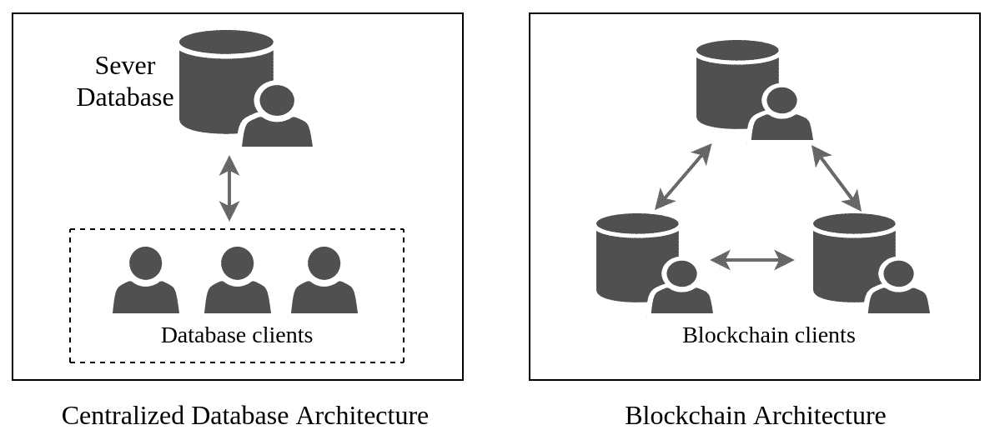
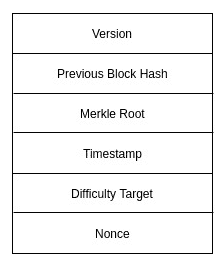

# 介绍

本书旨在帮助您探索激动人心的区块链技术，在第一章中，我们将深入了解它的基本概念。这样做的目的是呈现一个关于区块链的相当广泛的概述，让你为我们将在后面章节中更深入讨论的主题做好充分的准备。由于我们的目的是介绍区块链，本章将涵盖以下主题:

*   区块链是什么，不是什么
*   区块链与数据库有何不同
*   区块链的历史、动机和特征
*   不同类型的区块链
*   块及其工作方式概述
*   摩尔定律对区块链技术的影响

我们将从区块链的基础知识开始，包括它的神话和历史。我们将探索一些关键的区块链概念背后的想法，最后我们将概述区块链技术到底是如何工作的。本章的主题旨在给你足够的动力和信心，让你对我们将在本书后面讨论的主题感到舒适。

# 区块链是什么

尽管区块链有各种各样的定义，但区块链可以被最好地描述为链接在一起形成记录集合(称为分类帐)的块的数据结构，加密是该过程中的关键成分。区块链没有存储机制；相反，它有一套控制信息伪造方式的协议。因此，区块链可以存储在平面文件或数据库中。

区块链技术之所以受欢迎，是因为它的完整性不会轻易被破坏。受损的区块链可以被识别出来，并很容易被网络中的任何人拒绝。这种完整性是通过加密技术实现的，加密技术将这些块绑定在一起；我们将在[第二章](02.html)、*一点密码学*中研究这个密码学的概念。

区块链提供如此强大完整性的承诺最终为在不可信的对等网络中共享数据链的想法铺平了道路。对区块链中的块进行验证可以确保区块链有一个可以被所有人接受的有效全局状态。由于区块链能够在开放的 P2P 网络中共享信息，而不需要任何中央机构来管理它，因此该技术可以有许多不同的应用；然而，该技术不能简单地在没有任何故障排除的情况下立即部署到这些应用程序中。尽管区块链技术从一开始就在应用程序去中心化方面发挥了巨大的作用，但它在不可信环境中的应用仍然面临着一些挑战。最大的挑战之一是保持 P2P 网络中所有参与者的区块链一致。这个问题通过创建一个共识算法得到了解决，该算法就应该如何附加块以在不可信环境中增长链达成一致。

术语*区块链*实际上包含了许多概念，包括 P2P 网络管理、共识机制等等，所有这些都有助于创建一个去中心化的应用程序。

# 区块链不是什么

正如我们刚刚讨论过的，尽管区块链因其基于密码的安全性、分散性和几乎不可变的数据存储机制而引人入胜，但理解它的局限性是非常重要的。

区块链的理想实现是原子事件或事务，其中关于事件的最少信息被存储为事务；这些事务可以集中在一个块中，并添加到一个区块链中。虽然区块链网络擅长处理全局状态，但在批量存储数据时，它不会增加多少价值，因为会有可伸缩性问题。了解何时最好地应用区块链技术来开发应用程序是非常重要的。我们会在[第十一章](11.html)、*中探讨什么时候不应该用区块链，什么时候不应该用区块链？*。

# 区块链定义

你会记得我们在这一章做的第一件事就是注意到单词*区块链*有几种定义。在我们继续之前，让我们看看这个词的几种定义:

“区块链是一个由共识打造的点对点分布式账本，结合了‘智能合约’和其他辅助技术的系统。”
——hyperledger.org

区块链是分布式账本技术的一种特定形式或子集，它构建了一个按时间顺序排列的块链，因此得名“块链”。R3 公司的研究主管安东尼·刘易斯

"区块链数据结构是一个有序的、反向链接的块列表."安德烈亚斯·安东诺普洛斯，一位受欢迎的比特币传播者

# 区块链与数据库有什么不同？

区块链是一种只读和附加的存储方法。这意味着只能在区块链分类账中创建和读取数据块。不能更新或删除区块链中的块；块只能追加到区块链的末尾。公共区块链中没有访问控制，因为它对读写操作都是开放的。

另一方面，关系数据库遵循**创建、读取、更新和删除** ( **CRUD** )操作模型。与区块链不同，每个数据库在创建时都有一个管理员，他们会将访问控制分配给其他用户。关系数据库主要由控制所有应用程序数据的单个实体维护，而区块链技术是为分散的应用程序设计的。

*图 1.1* 应该有助于您形象化集中式数据库架构和区块链架构之间的区别:

图 1.1:显示集中式数据库与区块链架构的图表

注意:区块链固有地提供**不变性**、**安全性**和**冗余** ( **ISR** )，而传统数据库需要额外的投资来为它们保存的数据提供 ISR。与数据库相比，基于区块链的解决方案的主要优势之一是在基础设施管理方面几乎不需要投资。

# 区块链历史

我们知道，区块链技术现在主要应用于在分散网络中跟踪交易或事件；目前，该用例最大的应用范围是在金融领域。然而，事实上，直到最近，区块链技术才像我们今天所知道和使用的那样出现。1991 年，第一个维护区块链来构造数字文档的防篡改时间戳的想法出现了。但这个概念并没有普及，直到一位笔名为**中本聪**——其身份至今不明——的作者在 2008 年发表了一篇名为*比特币:点对点电子现金系统*([https://bitcoin.org/bitcoin.pdf](https://bitcoin.org/bitcoin.pdf))的论文，展示了区块链及其在去中心化网络中的真实用途。

后来，在 2009 年，中本聪创建了区块链技术的参考实现。这被称为比特币。这是基于区块链的电子现金系统的第一次实施，并且仍然是最受欢迎的。Satoshi 从之前的几项发明中获得灵感，如 b-money 和 Hashcash，以创建一种去中心化的数字货币。

注意:虽然比特币是加密货币革命的罪魁祸首，但在此之前，也有过几次使用加密协议普及电子现金的尝试。DigiCash 是美国科学家大卫·乔姆的一个广受欢迎的尝试。还有一种叫做比特黄金的去中心化数字货币，由尼克·萨伯提出，其架构与比特币类似。

比特币于 2009 年发行，当时 Satoshi 进行了第一笔交易，这笔交易被插入比特币区块链的第一块。这个街区被称为创世街区，是整个区块链合法性的证明。Satoshi 在 2011 年停止为比特币项目做出贡献，现在允许开放社区为该项目做出贡献。从那时起，它已经从一种相当简单的数字货币发展成为一种弹性协议，成为每个区块链应用程序的参考实现。虽然比特币的市值波动很大，但截至 2018 年底，它已经接近 2000 亿美元的市值，这几乎是整个加密货币市场的一半。

比特币是第一种解决双重消费攻击问题的去中心化数字货币。维持一个开放的分布式区块链，并就验证区块达成共识，是比特币成为一种实际可行的去中心化货币的主要原因。比特币使用了一种被称为**工作证明** ( **PoW** )算法的共识算法，来证明一个节点实际上已经工作，创建了一个新的区块链块。这个概念也被应用在一个叫做 Hashcash 的实现中，它被提议通过强迫垃圾邮件发送者在发送每封邮件之前做一些工作来限制垃圾邮件。该系统防止垃圾邮件发送者批量发送电子邮件，因为在发送每封电子邮件之前需要进行计算。接收者需要做的只是验证发送者所做的工作。类似地，比特币中实现的 PoW 共识算法防止任何节点用自己创建的块淹没区块链，从而防止任何单个实体主宰区块链。

# 区块链 2.0

比特币真正催生了区块链技术，自那以来，分布式区块链数据库的几个新应用已经出现，最引人注目的是在 2014 年初。这个时代被广泛称为区块链 2.0 时代。命名硬币是最早出现的概念之一。它扩大了比特币区块链的范围，并作为基于比特币的分布式命名系统推出。然而，与比特币不同的是，它能够在公共区块链中以键值对的形式存储数据。这个概念影响了许多区块链 2.0 应用程序，这些应用程序后来越来越流行。

区块链 2.0 最受欢迎的改进之一是引入了智能合约。开发了几个区块链平台，允许用户编写更高级别的脚本，而不用担心实际的区块链实现。在这方面做得最成功的一个平台是以太坊，它是由 Vitalik Buterin 在 2013 年末提出的。以太坊的意图是充分利用比特币使用的技术。比特币最初的实现是为了数字货币的流通。现在，虽然为其他应用程序(如资产转移)实现了脚本语言，但它非常原始，只有少数几个用例。以太坊的联合创始人 Vitalik Buterin 提出，比特币需要一种用于去中心化应用开发的脚本语言，以增加其范围。未能获得同意，Vitalik 提议用更通用的脚本语言开发一个新平台。这个平台 Ethereum 由于在其环境中实现了智能合约而广受欢迎。智能合约是运行在**以太坊虚拟机** ( **EVM** )上的高级脚本。使用以太坊平台已经开发了许多分散的应用程序。

以太坊平台启发开发人员提出一个框架，该框架将使用比特币的核心协议，并建立一个平台来开发去中心化的应用程序。这是一个革命性的方法，因为该技术将用于修改任何应用程序，如果有第三方将是昂贵和多余的。

事实上，有很多动机促使开发人员将区块链技术集成到他们现有的应用程序中。在下一节中，我们将对此进行更深入的解释。

已经创建了几个区块链平台来构建可伸缩的分散式应用程序；这里列出了一些最受欢迎的方法:

*   Corda :这是一个分布式分类账平台，旨在记录、管理和自动化业务合作伙伴之间的法律协议。它是由 R3 与世界上最大的金融机构合作设计的，这使得 Corda 适合于向分布式账本技术转移的金融企业。
*   Hyperledger :这是一个开源项目，旨在推进跨行业的区块链技术。它由 Linux 基金会主办，实现了不同行业和组织之间的协作。例如，IBM 和英特尔是 Hyperledger 项目的积极参与者。有许多 Hyperledger 项目，都旨在使用区块链解决不同的企业级问题。
*   这是一个简单而强大的私有区块链框架，与比特币兼容。它支持完整的资产周期管理。由于它对访问控制的支持，它是开发许可的区块链应用程序的理想框架。
*   NEO :这个应用以前叫做 Antshares，经常被称为“中国的以太坊”。它使用区块链技术和数字身份来数字化资产。

# 区块链背后的动机

每一项新的创新都是试图解决问题的结果。区块链技术也不例外。在了解了区块链技术的演变后，很明显，它的出现是因为需要解决现有经济中不可避免的不确定性。

不确定性永远无法消除，只能降低:每当双方需要达成协议时，总会有一些机构充当第三方立法者来降低不确定性或缺乏信任。一个典型的例子是在易贝上购买一件商品。你总是需要尽可能多的交易确定性。一方期待公平的商品，另一方期待约定的金钱。现在，虽然买方和卖方没有理由信任对方，但他们完成了交易，因为他们信任第三方，也就是易贝，他向双方保证了合法的交易。同样，需要信任这些“中等”机构。信任一个机构需要大量的研究和知识。区块链承诺通过以分散和安全的方式实现应用来克服这些问题，确保某种程度的确定性。这是区块链教在一个不信任的社会中被广泛接受的主要原因之一。

我们知道区块链是在不信任环境中实现的理想技术。然而，区块链不能独自对完全实施的成功负责。它得到了其他几个协议的帮助，这些协议使它成为了一种健壮而有弹性的技术。区块链可以在无信任网络中实现，主要是因为密集 P2P 网络中计算的分散化以及安全和公开分布的分类帐的维护，该分类帐对整个区块链提供了完全的透明性。P2P 协议确保每个节点都拥有区块链的最新状态。

对分散化的需求是区块链技术背后的关键动机，而分散化是通过将计算任务分配给区块链网络的所有节点来实现的。权力下放解决了传统制度的几个问题；单点故障就是这样一个问题。例如，在诸如银行之类的中央系统中，用户将总是与同一个第三方银行通信以获取他们的账户细节。尽管几乎每次都可能发生这种事务，但不能保证 100%的正常运行时间，因为该服务器是集中式的，并且只有几个备份服务器用于负载平衡。很有可能出现这样的情况，所有的服务器都被请求淹没，导致崩溃和服务器关闭。停机是不可避免的，即使是在完美架构的服务器中。如果在一个分散的网络中面临同样的情况，这不会是一个问题，因为所有的交易数据将分布在所有的节点上，这意味着每个节点都可以在出现故障时充当备份节点，保持数据的完整性(基于区块链的解决方案的另一个主要优点)。这是通过维护区块链数据的分布式分类账实现的。区块链不变性是信任区块链完整性的关键因素，它确保了账本的完整性，所有节点都可以公开访问账本。

# 区块链的特色

简而言之，区块链是一系列通过加密技术相互保护的块。加密散列指针被用作链接公共分类帐的区块链中的每个块的参考。虽然这听起来非常安全，因为没有入侵者能够破解区块链并插入他们自己版本的块，但这并不完全安全。由于分类帐是完全透明和公开的，任何节点都可以插入它们的块来复制整个区块链，并创建它们自己的版本。最终，他们可以将该块传播到网络中的每个节点，并证明他们的区块链是合法的。这表明不变性不能仅仅通过连接所有的块并形成一个安全的分类帐来实现。实现不变性需要某种分散的经济机制的帮助，这种机制给网络中的每个节点一个公平的机会来投票决定块的创建，同时也使块一旦被附加就更难重建。

中本聪对这个问题提出的解决方案是比特币能够在去中心化环境中实现的唯一原因。比特币中使用的 PoW 共识算法是第一个——也是最著名的——解决方案。它承诺对公共分类帐的高度不变性，并保护它，即使在不可信的网络中。在加密货币方面，执行 PoW 的节点称为**挖掘节点**。顾名思义，采矿是锻造新区块以附加到区块链上的行为。挖掘所需的工作量确保了区块链是不可变的，并且篡改任何过去的事务几乎是不可能的。

这是因为任何想要篡改过去数据的节点都应该能够通过提供电力并与所有其他挖掘节点竞争来重建所有块。这几乎是不可能的，除非所讨论的节点拥有网络的大部分计算能力，在这种情况下，攻击者将有机会击败所有节点。这就是为什么比特币的共识算法被广泛用于公共区块链应用程序，以实现更高的记录不变性。

然而，不变性并不是区块链技术所展示的唯一特征。由于区块链的分散性，区块链中的每一个事务都在网络的所有节点上复制。信息的复制为区块链提供了更强的鲁棒性。复制的事务必须由每个节点验证，以达成共识。这确保了交易是公开可见的，并且所有区块链数据对网络是透明的。区块链提供的透明性对于一些用例来说可能是一个福音，对于其他用例来说可能是一个诅咒。这就是为什么区块链的变体被创造出来的原因，正如本章后面的章节所描述的。

区块链的所有这些特点使它成为一个完美的公共账本，或者说是**分布式账本技术** ( **DLT** )的一个有效实例。比特币的区块链及其共识机制是迄今为止最具弹性的 DLT。

# DLT 的背景

自从网络发明以来，关于计算架构的集中和分散就一直存在争论。我们已经看到这两种计算架构模型之间的兴趣随着时间的推移而波动。大型机体系结构在企业中用于容纳大量的计算能力、内存和存储。它们在很大程度上是集中的，没有多少计算能力的终端被用来连接到这些机器，以便执行所需的操作。然后，个人计算机被引入家庭使用，具有足够的计算能力、内存和存储来执行基本操作。这就产生了客户机-服务器体系结构，其中客户机与服务器通信以执行计算。服务器通常在分布式系统中执行繁重的计算，并将结果与客户端同步。

云计算架构提供了从任何计算设备对服务器的轻松访问，因为该架构本身是全球可访问的。然而，云计算架构是集中式的，其硬件资源是分布式的，并且对客户端不透明。云厂商和终端用户之间仍然缺乏信任。这就是为什么我们正在见证从其他计算模式到去中心化的转变。DLT 是实现这一里程碑和迎来权力下放时代的关键。

分布式分类账的核心是一个跨地理区域的复制和共享的数字数据库。需要 P2P 网络和共识算法来确保有效的分布式分类帐。区块链技术是用于实现分布式账本的技术之一，但它不是 DLT 的唯一数据结构:

图 1.2:计算机架构的演变，直到 DLT 的诞生(来源:https://en.wikipedia.org)

背景:最早可以与 DLT 相提并论的东西可以追溯到公元 500 年，当时太平洋的雅浦岛依赖一种叫做 Rai 的货币，这种货币是重达 200 多公斤的石头。因为这些石头非常沉重，所以岛上的每个成年人都会记住拉伊的所有权。口头所有权记录确保了没有必要由一方来维护谁有 Rai 的记录。

# 不同类型的区块链

越来越多的区块链用例，以及对其局限性越来越多的认识，已经产生了各种成功的区块链实现。在这一节中，我们将努力抓住它们中每一个的本质。

# 公共区块链(无需许可)

由于其透明性以及每个节点如何参与促进区块链的增长，区块链概念已被广泛使用和改编。早期的区块链模式是比特币的产物，是完全开放和无许可的，被普遍称为公共区块链。由于处理节点的方式公正，公共区块链很受欢迎。

由于记录的不变性，公共区块链可以在不可信网络中无缝工作。比特币、以太坊和其他几个继承了类似 PoW 的共识算法的项目确保记录的交易是不可编辑的。

公共区块链是加密货币项目的理想选择，其中记录的交易不应被修改。然而，如果没有实现必要的更改，公共区块链经常会面临可伸缩性问题。比特币最明显的问题之一是其采矿方法(PoW)，就矿工解决难题所需的电力而言，这种方法非常昂贵。块创建的平均时间为 10 分钟。所以这次采矿的难度等级调整为维持。由于矿工之间竞争，这导致了非常昂贵的电力环境。由于这些复杂的属性，我们无法预测比特币或任何其他公共区块链的未来，只有技术的自然演变才能决定它的命运。

由于这些优点和缺点，无许可或公共区块链非常适合透明应用程序，其中区块链应该固有地保护系统，因为网络是不可信的。

# 二等兵区块链(允许)

引进私人区块链主要是为了扩大区块链技术的范围。被许可的区块链，顾名思义，使用了与公共区块链相反的方法。私人区块链的出现主要是为了解决我们在公共区块链看到的一些问题，并使区块链技术可扩展。

许可区块链引入访问控制，为网络中的参与者提供特定的访问权限。每个被许可的区块链将有一个管理员，该管理员为网络中的参与者分配角色。许可区块链确保不良行为者不是验证或块创建过程的一部分，从而消除对区块链的任何潜在攻击。涉及许可区块链的网络通常是可信网络。

专用区块链适用于只需要在内部共享分类帐的组织。被许可的区块链通常是可变的或者不是严格不可变的，并且它们的事务可以通过一些努力被修改；这与公开的区块链形成鲜明对比，在那里这几乎是不可能的。许可的区块链仍然是分散的分类帐，但是它们将在组织内有一些能力有限的节点，而公共区块链中的节点被公平地对待。

注意:私人区块链不使用比特币的 PoW 共识算法作为他们的共识算法。事实上，创建私有区块链是为了消除公共区块链的高成本共识方法，使区块链技术适用于可信环境。

# block chain consortium(块链联盟)

区块链财团是一个半分散的混合区块链。它结合了无许可和有许可区块链的最佳特性。区块链联盟将相同的任务分配给由多个组织维护的节点，而不是将大多数任务分配给单个组织。可以有多个节点，而不是只有一个验证器节点。虽然区块链财团是允许的，但它比私人区块链更分散。

# 块的概述

现在我们对区块链有了一个公平的了解，我们将给出一个积木的概述，积木负责建造一个区块链。

# 块属性

如果我们将区块链视为一种数据结构，那么块就是用于形成区块链的数据集。区块链形成类似于链表形成，其中每个节点都有对序列中下一个节点的引用。在区块链的情况下，每个块都有一个对前一个节点的引用，从而形成一个链接，一直到链的初始块(称为**起源块**)。正如我们前面提到的，区块链可以以平面文件或数据库格式存储。比特币使用`LevelDB`来存储下载到磁盘的所有块的元数据。

就像链表节点一样，每个块都有一个指针，指针是块的标识符。这些只是块头数据的散列值。关于散列的更多细节将在第二章、*和*中讨论。我们可以将散列视为代表每个块的固定大小的唯一标识符；没有两个块具有相同的标识符。因为所有的块都通过这个散列值链接在一起，所以每个块都将具有前一个块的标识符。前一个块称为父块，每个块只能有一个父块。

每个区块也可以参考区块链的高度。这个高度只不过是块的距离，或块数，从创世纪块。高度是区块链的一个重要属性，因为用普通数字而不是冗长的哈希值来引用块更容易。块散列不是整个块的散列值，而是仅由元数据组成的块头的散列值。在比特币中，SHA256 哈希算法用于哈希块头，并为块创建唯一的标识符。

# 街区的结构

尽管所有区块链都由链接块组成，以形成一个不可变的分类帐，但根据应用程序，可以采用不同的块结构。例如，允许的和不允许的区块链在它们的块结构上有细微的变化。我们

我们将使用比特币的无权限块结构作为参考，尝试并确定其特征:

图 1.3:块的结构

一个模块由图 1.3 中*提到的组件组成。**块头**和**事务**是块最重要的部分，因为它们负责散列值，散列值是块的标识。**块大小**是整个块的大小。**块头**包含该块的所有元数据，并且**事务计数器**具有事务的计数。最后，所有的**事务**都存储在该块中。*

如前所述，一个区块链从一个叫做创世块的初始块开始。如果链从任何给定的块向后遍历，它将在 genesis 块结束，证明整个链是合法有效的。创世程序块通常是在一个公开的或者无许可的区块链中静态编码的，但是它是由第一个参与者在有许可的区块链中创建的。

# 块标题

如前所述，块头由块的元数据组成。它包含了连接区块链中各个区块所需的信息:

图 1.4:块标题的结构

每个块标题将具有*图 1.4* 中概述的组件。这些是无权限区块链(如比特币)中所需的最少字段，以便有效地创建可以附加到不可变区块链的块。**先前块散列**字段是对创建的最后块的引用。 **Merkle 根**是 Merkle 散列树的值；它汇总了块中的所有事务。PoW 一致性算法使用**时间戳**、**难度目标**和**随机数**来解决哈希难题。我们将在整本书中更深入地重温这些概念。

注意:与使用一致算法生成块的无权限区块链不同，有权限的区块链使用块创建者的签名来表示块的身份。但是，许可区块链中的块保留以前的块标识符，就像无许可区块链一样。

# 链接块

正如我们所知，在区块链中，块是使用引用来链接的，就像在链表中一样，但是这里的块是通过引用前一个块的哈希值(标识符)来链接的。区块链网络中的每个完整节点将维护一个完整的区块链，并在需要添加新块时添加新块。由于区块链的分散性质，每个节点将在将块链接到本地区块链记录之前对其进行验证。

每个块的计算哈希值是前一个块的哈希值和它自己的块数据的组合。这导致相邻块之间的依赖性和几乎不可断开的链接:

图 1.5:使用哈希链接块，摘自《比特币:点对点电子现金系统》

Satoshi 解释了应该如何使用时间戳的概念。所有项目都经过哈希处理，数据块带有时间戳，这意味着后续数据块将包含此时间戳，从而创建有序的数据块链。

区块链网络中的每个节点都遵循一个简单的过程来将新块附加到其现有的本地区块链。每当一个节点从网络接收到一个块时，它就检查先前的块散列。如果哈希值与节点的本地区块链上的最后一个块的哈希值匹配，则节点接受该块并将其附加到当前区块链。只要这是已知的最长的区块链，在基于 PoW 的区块链中，网络中的所有对等体就会认为这些块是有效的。

# 摩尔定律对区块链技术的影响

飞兆半导体(Fairchild Semiconductor)和英特尔(Intel)的联合创始人戈登·摩尔观察到，每个电子集成电路的元件数量每年至少会增长两倍。早在 1965 年，他还预测这一增长率将至少再持续十年。几年后，他将这一预测修正为每两年翻一番。这种观察是针对密集集成电路中的晶体管数量的，并且已经在半导体工业中用于设定研究和开发的目标。但这不仅仅局限于芯片制造领域；它也被用来观察技术和社会变化，以及生产力和经济增长。

摩尔定律已被修改并应用于估算网络容量、图像像素、存储设备大小等的变化率。区块链是一项未来的技术，为了实现健康的长期发展，可能必须克服多重限制。摩尔定律将有助于决定任何区块链应用程序所需的复杂性，以便应用程序不必为未来的可伸缩性问题而斗争。

由于网络中的每个节点都维护着完整的区块链总账，区块链数据的大小会随着时间的推移而不断增加。这引起了一些关于可伸缩性的问题，因为每个节点都需要在本地维护区块链(这是分布式网络的本质)。中本聪曾提到，块头大小的增长每年约为 4.2 MB，摩尔定律将保证每年至少增长 1.2 GB RAM(2008 年)，这不会给块存储带来任何问题，即使它们保存在节点内存中。

公共区块链，如比特币，必须为其共识算法处理硬件的哈希速率。比特币挖矿硬件已经能够跟上摩尔定律，根据不断增长的难度提供所需的哈希速率。然而，比特币采矿的未来取决于摩尔定律和硬件能够跟上难度，而不会给矿工造成太大损失:

图 1.6:比特币难度目标的指数级增长(来源:blockchain.info)

# 摘要

这一章已经向我们介绍了在接下来的章节中推动区块链研究所需的一切。了解了区块链技术的背景，包括其目的和工作原理，我们现在应该充分了解这项技术的潜力以及它如何解决我们当前系统中的一些问题。

现在我们已经对这项技术有了一个大致的了解，在下一章[第二章](02.html)、*一点密码学*中，我们将会浏览一下围绕区块链技术主干的概念。在那一章中，我们将探索理解区块链的基础。