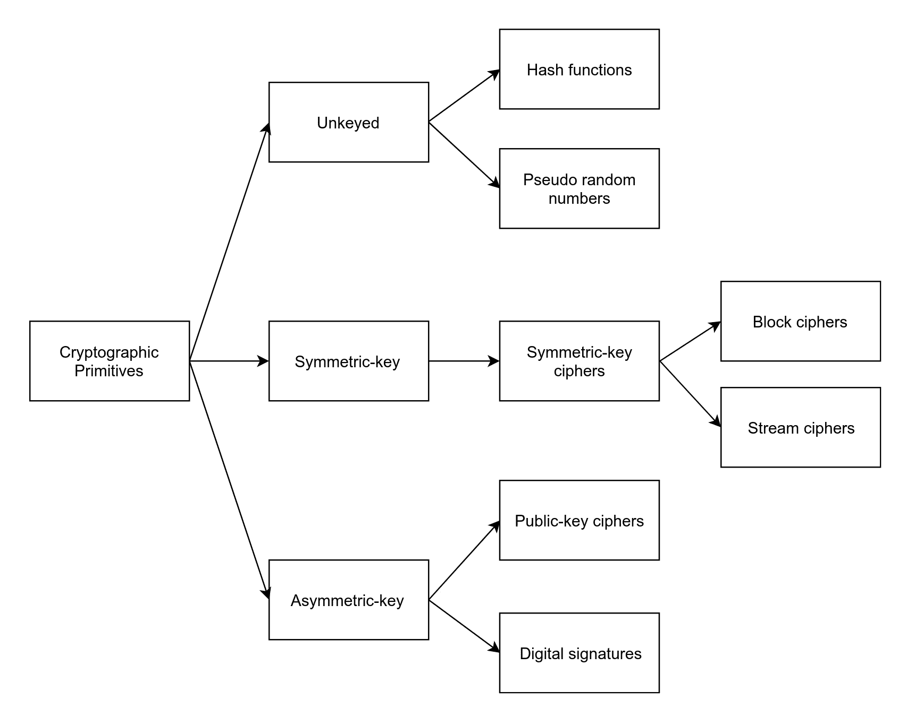
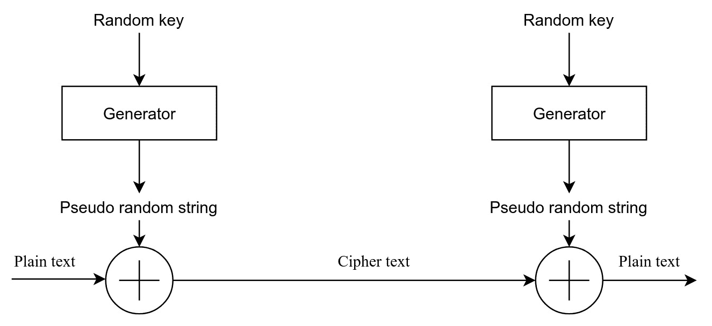
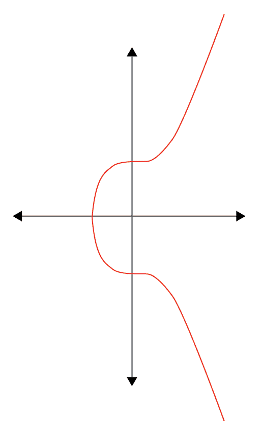
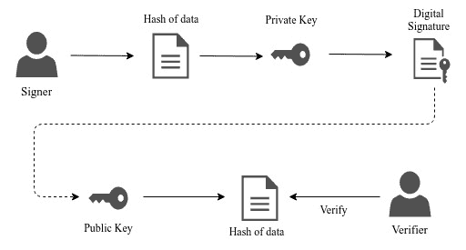

# 一点密码学知识

本章将涵盖所有的密码学基础知识，这些知识是你理解密码学在区块链技术中的重要作用所必需的。我们将深入探究区块链所依赖的密码学的所有方面。我们将用实用术语解释几个概念，以便在后面的章节中轻松实现它们。其中包括以下内容:

*   区块链的密码学
*   经典密码学
*   密码原语
*   Merkle 树
*   编码方案

现代密码学是对私人或安全通信的研究。密码术的基本目标是使两个人能够通过不安全的媒介进行通信。这是通过加密来自发送方的明文以形成只能由接收方解密的密文来实现的，发送方与接收方共享一个秘密。然而，第三方可以访问传输密文的通道，但文本对它没有任何意义，因此通道是否安全并不重要。密码学已经发展，现在可以应用于广泛的领域，包括区块链。我们将从底层和基本的密码实现开始对密码学的概述，然后我们将继续讨论高级和现代的密码学主题。

加密对于信息安全服务(如身份验证、机密性和完整性)至关重要。在 19 世纪，奥古斯特·克尔克霍夫(Auguste Kerckhoffs)概述了后来被称为克尔克霍夫原则的东西:即使除了密钥之外，关于系统的一切都是公共知识，密码系统也应该是安全的。密钥是密码学中唯一需要保密并防止入侵者攻击的资产。

# 区块链的密码学

尽管我们提到了加密技术对区块链技术的成功至关重要，但我们并没有特别探讨任何主题。大多数加密原语在创建分散式区块链应用程序时都有这样或那样的作用。在这一章中，我们将研究所有对区块链有贡献的原语。

大多数区块链应用程序都使用哈希来创建块之间的链接。它还用于共识算法，如工作证明，它基本上利用了形成区块链网络的计算系统的散列能力。数字签名用于签署和验证事务等事件。非对称密钥加密是区块链应用中的一个核心概念，它为网络参与者提供身份或证明资产的所有权。

因此，密码学是一个很好的工具，可以用来完成一些任务，这些任务是取代可信的第三方，并在一个分散的网络中创建一个不可信的环境。

# 经典密码学

在这一节中，我们将研究一些在历史密码中使用过的密码技术。这些特别的密码在现代应用中还不够安全，但是由于它们的简单性，它们可以鼓励我们学习更多关于密码学的知识。探索经典密码学的弱点也有助于我们了解更多关于密码学的一些原理。请看下图:


图 2.1:传统加密模型

*图 2.1* 显示了传统的加密模型，该模型使用通过安全通道与其他用户共享的密钥来加密明文。想要阅读文本的用户将使用密钥解密密文，这将返回原始明文。密钥是私有的，加密和解密算法是公开的，因为没有密钥就不可能解密密文。

两种类型的操作用于将明文转换为密文:替换和转置。这两种技术都确保操作是可逆的，因此它们可以用在加密算法中。

替换密码是一种加密方法，在这种方法中，明文中的字符以固定的方式被其他字符替换。替换密码最简单的例子是凯撒密码，通过将字母表移动三个位置来替换明文字母:字母 A 被替换为 D，B 被替换为 E，以此类推。这种密码的明显问题是方法是固定的，并且不涉及密钥。凯撒密码的一种变体，称为移位密码，被引入，其中从明文到密文的移位量是变化的，并且这个移位量可以充当密钥。虽然这解决了眼前的问题，但它不够实用，因为密钥可能会被蛮力攻击或穷举搜索攻击猜到。多字母密码是密码发展的下一个阶段。这种密码在信息的不同位置引入了一些替换。

换位密码是一种加密方法，其中明文字母的位置根据已知系统进行移位。只有明文的顺序被改变。明文的所有字母保持不变。围栏密码和路线密码是两种众所周知的换位密码。这种密码技术可以通过使用程序设计找到换位模式来解密。

# 密码原语

加密原语是用于构建应用程序使用的加密协议的低级加密算法。这些是设计加密系统的基础。计划在系统中实现加密协议的设计人员不必担心原语的低级抽象，可以完全专注于构建应用程序:



图 2.2:加密原语的分类

*图 2.2* 显示了密码原语的详细分类。区块链技术利用这些密码原语中的大部分来实现基本的区块链功能，并在去中心化的网络上保护数据:用于管理密钥的非对称加密；交易的数字签名；最重要的是，哈希是区块链的支柱，是密码学中最常用的一些基本要素。我们将涵盖所有这些原语，以及其他一些原语，以便对它们有一个清晰的了解。

# 对称密钥加密

对称密钥是一种基于密钥的加密技术，其算法使用相同的密钥来执行明文加密和密文解密。这些密钥由双方通过安全通道共享。任何拥有共享密钥的参与者都可以对数据执行加密和解密操作。对称密钥密码可以是流加密的，也可以是块加密的。

对称密钥加密在基于区块链的应用程序中没有任何重要作用。然而，在我们研究非对称加密之前，它将提供对基于密钥的加密的更好的理解。

# 流密码

流密码使用对称密钥加密。每个明文字符一次加密一个，就像流一样，以创建密文。密钥流或字符流用于加密明文字符。使用伪随机字符串作为密钥流。该伪随机字符串是使用数字移位寄存器(生成器)从随机种子值生成的，如图*图 2.3* 所示。使用的种子是密钥，它也用于解密创建的密文。

为了确保流密码的安全性，其伪随机生成器应该是不可预测的，并且用于生成密钥流的种子值永远不应该被重用，以减少可能的攻击。流密码通常比块密码快，并且对硬件要求低，如下图所示:



图 2.3:流密码的流程图

# 分组密码

分组密码是一种对明文中固定长度的字符块进行加密的密码。这种密码技术广泛用于对大量数据进行加密。通常的块大小为 64 位、128 位和 256 位。例如，64 位分组密码将 64 位明文作为输入，并给出 64 位密文。明文将填充一些块，以防一些明文没有填充块。因为块密码中使用的密钥相当长，所以它们对于暴力攻击是健壮的。这些密码也是其他加密协议的组成部分，如哈希函数和随机数生成器。**数据加密标准**(**DES**)**高级加密标准**(**AES**)**国际数据加密算法**(**IDEA**)**Blowfish**都是一些比较流行的分组密码算法。

# 数据加密标准

DES 曾经是使用最广泛的分组密码，也是一种工业标准。它仍然流行，但在许多应用中已被其他高级分组密码所取代。DES 使用 64 位块和 64 位密钥。密钥中的 8 位用作检错的奇偶校验位，所以密钥大小在技术上是 56 位。已经证明它容易受到暴力攻击和一些密码分析攻击，这是因为它的密钥大小有限。引入 3DES 是为了通过用不同的 56 位密钥运行 DES 三次来克服这个问题。但事实证明，3DES 比 AES 等其他分组密码要慢。

在传输或存储密钥时，DES 使用密钥的 8 位作为奇偶校验位进行错误检测。第 8、16、24，...，第 64 位用于计算奇校验，即密钥每个字节中 1 的个数为奇数。

# 高级加密标准

AES 是现代应用中最广泛使用的分组密码之一。经过 5 年的公开竞争，Rijndael 算法被选为 AES，以选择 DES 的替代品。它具有 128 位的固定块大小和 128、192 或 256 位的可变密钥大小。AES 是一种迭代密码:迭代次数取决于密钥长度。

AES 可以抵御所有已知的攻击。似乎没有比穷举搜索更快的攻击 AES 的方法。攻击 AES 的最佳方法只适用于迭代次数最少的密码变体。

# AES 的示例实现

让我们使用名为`PyCryptodome`的 Python 密码库来实现 AES 密码技术。在本章中，我们将使用`PyCryptodome`库来实现其他密码和散列算法。

PyCryptodome 是一个自包含的 Python 包，包含底层加密原语。PyCryptodome 是`PyCrypto`库的分叉项目，是一个具有扩展原语支持的活动项目。因此，它几乎是旧的`PyCrypto`库的替代物。

我们将使用`Crypto.Cipher`包中的 AES 模块，我们还将从`Crypto.Random`包中导入一个模块来生成 AES 的随机密钥，如下所示:

```
from Crypto.Cipher import AES 
from Crypto.Random import get_random_bytes 
```

加密端将使用随机选择的对称密钥创建密文。一旦我们导入了所需的模块，就会使用`Crypto.Random`包生成一个 16 字节的密钥。这被写入一个需要保密的文件:

```
with open("aes.key", "wb") as file_out: 
    key = get_random_bytes(16) 
    file_out.write(key) 
```

AES 密码对象是通过传递密钥创建的。密码模式 EAX 在代码中使用。该对象用于加密数据。随机数、标签和密文被存储并传输到解密端:

```
data = "plaintext for AES" 
cipher = AES.new(key, AES.MODE_EAX) 
cipher_text, tag = cipher.encrypt_and_digest(data.encode()) 
with open("encrypted.bin", "wb") as file_out: 
    [file_out.write(x) for x in (cipher.nonce, tag, cipher_text)] 
print("Data is encrypted and stored in a file") 
```

AES 的解密部分使用加密过程中生成的相同的 16 字节对称密钥。理想情况下，该密钥必须通过安全通道传输给接收方。读取接收到的加密二进制文件以获得随机数、标签和密文本身。AES 密码对象是使用相同的密钥和随机数值创建的。最后，通过提供`cipher_text`和`tag`，使用`decrypt_and_verify`方法执行解密。提供标签以执行验证；它检查密文中的任何修改:

```
with open("aes.key", "rb") as file_in: 
    key = file_in.read(16) 
with open("encrypted.bin", "rb") as file_in: 
    nonce, tag, cipher_text = [file_in.read(x) for x in (16, 16, -1)] 

cipher = AES.new(key, AES.MODE_EAX, nonce) 
data = cipher.decrypt_and_verify(cipher_text, tag) 
print("Decrypted data is : \"{}\"".format(data.decode())) 
```

加密和解密操作的成功执行将产生以下输出:

```
Data is encrypted and stored in a file
Decrypted data is : "plaintext for AES"  
```

当 AES 程序的加密和解密部分运行时，我们在解密后得到原始数据。对密文的任何修改都会导致 MAC 检查错误，Python 会抛出`ValueError: MAC check failed`。

本章包含的详细 Jupyter 笔记本和脚本可以在本书的 GitHub 资源库中找到。

# 非对称密钥加密

非对称密钥加密是现代密码学中广泛使用的加密技术。除了加密，它还有很多应用。它也常用于区块链的几个元素中，所以我们将深入讨论这种加密技术及其原语。

对称密钥加密使用共享密钥进行加密和解密。这样做的最大问题是共享密钥需要在参与者之间通过安全通道进行交换，这可能很难实现。如果我们一开始就有一个安全的通信通道，这也违背了加密的目的。这就是非对称加密的用武之地。它使用一对称为公钥/私钥对的密钥。公钥是由私钥构造的，可以自由地广播给其他用户。

1978 年，罗纳德·里维斯特、阿迪·萨莫尔和伦纳德·阿德曼创建了第一个公钥算法，即 RSA 算法。

公钥算法允许从随机生成的私钥创建公钥。创建的公钥不能用于推断私钥。换句话说，从私钥创建公钥是一个单向过程。这是公钥加密的安全性所依赖的概念。公钥算法不仅执行加密，还提供认证功能。

私钥的持有者可以使用该密钥向知道用户公钥的系统进行身份验证，如下图所示:


图 2.4:非对称密钥加密

正如我们在图中看到的，与对称加密不同，不需要安全通道来共享密钥。加密和解密算法是相同的，构造的密钥对在加密/解密过程中起着至关重要的作用。如前所述，非对称密钥算法也可用于提供身份验证。这种机制的一个应用是数字签名:只有拥有私钥的用户才能签署消息，而拥有公钥的任何人都可以验证消息的真实性。数字签名也可以用于不可否认性。区块链应用程序，尤其是加密货币，利用数字签名来签署交易，使用私钥来证明所有权。因此，区块链技术主要依赖于非对称加密算法。Diffie-Hellman 密钥交换、DSA、ElGamal、RSA 和**椭圆曲线加密** ( **ECC** )是非对称密钥加密的一些方法。

公钥加密系统的强度取决于从公开的密钥信息中推断私钥的可行性。虽然不可行，但也不是不可能，安全性仅仅依靠密钥大小和密钥生成机制。非对称密钥由于其复杂性和加密/解密大文件所需的时间而没有被广泛使用。它们通常用于数字签名或密钥交换机制，而不是加密协议。

所有非对称密钥算法都基于一个数论问题，该问题确保密钥生成以及加密和解密过程所需的特征。基于解决数论中数学问题的不同方式，非对称密钥生成大致有三种方式:质因数分解、离散对数和椭圆曲线。所有的公钥-私钥算法都是基于这些数学问题。所有这些问题在功能上都类似于活板门功能。

陷门函数是这样一种函数，其中很容易以一种方式计算值，但不可行找到逆。这意味着很难从结果中找到提供给函数的原始输入值。这种功能在非对称加密中被广泛使用。

# 质因数分解

质因数分解是数论中的一个概念，它将一个数分解成两个质数的乘积。素数因式分解是整数因式分解的一个子集，其中一个合数被因式分解为任意两个整数的乘积。

寻找半素数(由两个素数的乘积产生的数)的因子是具有挑战性的，因为它们只有一对因子，并且寻找因子的复杂性随着乘积中使用的素数的大小的增加而增加。没有已知的有效因式分解算法用于在数字具有一定大小时寻找因子。RSA 使用质因数分解，假定从质数的公开乘积中找到私钥是非常困难的。这种假定的困难是在密码学中使用质因数分解的原因。

# 离散对数

离散对数基于离散对数的模运算设置，在这种情况下，无法找到解决方案。对数 log <sub>b</sub> a 是离散对数，其具有整数解 *x* ，使得 *b <sup>x</sup> = a* 。对于求离散对数的解，没有有效的通用方法。当模运算用于离散对数时，它被称为模幂运算，这个问题变得非常困难。这个问题通常与 Diffie-Hellman 密钥交换算法一起使用。

让我们考虑一个模幂运算的例子:

```
33 mod 5 = 2
```

很容易找到前面函数的结果，即 2，但是很难从结果中找到指数值 3。前面的模运算也可以用一个*同余表示为 3<sup>3</sup>T3】T4】≅2(mod 5)*。

假设 *a* 和 *b* 是两个整数， *m* 是正整数。那么短语 *a ≅ b (mod m)* 就叫做**同余**，读作“a 对 b 模 m 全等”，说明 *m 除 a-b* 。

# 椭圆曲线

椭圆曲线是平面实代数曲线，其方程的形式为*y<sup>2</sup>= x<sup>3</sup>+ax+b*。椭圆曲线应该是非奇异曲线，即没有尖点、自交或孤立点。有限域上的椭圆曲线用于加密系统。ECC 在比特币中用于生成私钥-公钥对，因此我们将在本章的后面部分深入讨论这一点:


图 2.5:椭圆曲线(类似于比特币中使用的曲线)

比特币和其他加密货币使用非对称加密中的公钥-私钥概念来识别资产的所有者。私钥用于表示加密货币中硬币的所有权。

# RSA 密码系统

RSA 是公私密码的最初实现之一。它使用质因数分解的原理来生成一个公钥-私钥对，该公钥-私钥对充当陷门函数。使用分发给每个人的公钥进行加密，使用秘密保存的私钥进行解密。

非对称公钥-私钥密码系统的想法是由 Whitfield Diffie 和 Martin Hellman 提出的，他们在 1976 年发表了这个概念。

公钥和私钥对是在两个大素数的帮助下计算的。公钥向用户公开，私钥保密。素数也是保密的。只要使用的素数很大，从公钥计算私钥是不可行的。整个 RSA 密码体制基于整数分解的数论问题，保证了素数分解的难度与所用素数的大小成正比。

# RSA 参数生成

在研究使用 RSA 加密和解密之前，我们需要考虑 RSA 参数生成过程。以下是此过程中涉及的步骤:

1.  选择两个不同的大质数， *p* 和 *q.*
2.  计算 *n = p* **q* 和*φ(n)=(P1)***(Q1)。*
3.  选择一个随机整数 *e* ，使得 *1 < e < φ(n)* 和 *gcd (e，φ(n)) = 1* ，即整数 *e* 和 *φ(n)* 互质。
4.  求 *d ≡ e <sup>-1</sup> (mod φ(n))* ，其中 e <sup>-1</sup> 是 *e* 的模乘逆。

整数 *a* 的模乘逆是整数 *x* ，使得乘积 *ax* 关于模数 *m* 全等于 *1* 。

更清楚地说，找到 *d* 使得*d*** e**≡1(mod**【n】)*，意思是找到一个值 *d* 使得 *d* **e* 除以 *φ(n)* 后有一个余数 *1* 。

5.  公钥用 *(e，n)* 表示，私钥用 *(d，p，q)* 表示。这里， *e* 称为公开指数， *d* 称为私有指数。

# 使用 RSA 加密和解密

加密是在 RSA 中使用分发的公钥执行的。消息 *M* 被转换成整数 *m* 使得 *0 ≤ m < n* 。使用公开的公共指数计算密文 *c* ，如下所示:

*c≥m<sup>e</sup>mod*

任何拥有公开指数的人都可以对消息进行加密，并将其传送给任何拥有私有指数的人。任何有权访问密文和私有指数的人都可以执行如下解密:

*m≥c<sup>d</sup>mod*

消息 *M* 可以从解密的整数 *m* 中重新生成。这就是 RSA 如何利用质因数分解技术来执行加密和解密。对于小消息来说，这个过程可以相当快地执行，但是对于大消息来说，这不是加密的首选方式。这就是 RSA 广泛用于加密原语(如数字签名)而不是加密的原因。

# RSA 的示例实现

该示例使用 Python `PyCryptodome`库中的 RSA 包。以下包是为 RSA 密钥生成以及加密和解密操作而导入的:

```
from Crypto.PublicKey import RSA 
from Crypto.Cipher import PKCS1_OAEP 
```

使用`RSA`包中的`generate`方法创建一个 2048 位 RSA 密钥。公钥从此生成的密钥导出并公开。`key`对象应该保密。使用公钥创建一个密码对象，并使用该对象对消息执行加密:

```
message = "plaintext for RSA" 
key = RSA.generate(2048) 
public = key.publickey() 

cipher = PKCS1_OAEP.new(public) 
cipher_text = cipher.encrypt(message.encode()) 
print("Data is encrypted")
```

解密操作以类似于加密操作的方式执行，但是使用密钥对的私有部分而不是公共部分。密文作为输入被提供给`decrypt`方法，该方法对其进行解密并返回解密后的消息:

```
cipher = PKCS1_OAEP.new(key) 
message = cipher.decrypt(cipher_text) 
print("Decrypted data is : \"{}\"".format(message.decode())) 
```

成功执行上述脚本将输出以下内容:

```
Data is encrypted
Decrypted data is : "plaintext for RSA"
```

# 椭圆曲线密码术

ECC 是一种基于前面提到的椭圆曲线的公-私加密技术。它对椭圆曲线上的点进行加法运算，以计算公钥-私钥对。与其他非对称密钥加密系统(如 RSA)相比，ECC 需要更小的密钥大小。ECC 广泛用于密钥交换机制和数字签名，很少用于加密系统。

ECC 提供与 RSA 相同的安全级别，但密钥更小。256 位 ECC 密钥相当于 3，072 位 RSA 密钥。同样，384 位 ECC 密钥提供的安全级别与 7，680 位 RSA 密钥相同，依此类推。我们可以清楚地看到，由于 ECC 中的密钥大小更小，因此计算时间更少。

由于与 RSA 相比具有密钥大小优势，ECC 被用于*比特币的*寻址系统，以及交易签名操作。它在其他区块链应用程序中也很受欢迎。ECC 的其他应用有 Tor、iMessages、SSH 和 SSL/TLS。

在深入研究 ECC 的加密应用之前，我们先来看看它的一些特性:

*   椭圆曲线由三次方程表示:

*和<sup>2</sup>= x<sup><sup>+ax+b</sup></sup>*

*   椭圆曲线具有水平对称性
*   一条非垂直线与曲线最多相交三点

RSA 加密使用质因数分解。半素数的因式分解真的很难。当在该域中使用时，它形成陷门(单向)功能。类似地，基于椭圆曲线的算法可以使用离散对数。寻找椭圆曲线上随机元素相对于同一曲线上一点的离散对数是一个严重的问题。我们将逐步完成从私钥构建公钥的过程，并研究 ECC 密钥生成过程的单向性质。

# 椭圆曲线上的运算

密码学中使用的椭圆曲线是在有限域中构造的曲线。它们具有以下形式:

*和<sup>2</sup>= x<sup><sup>+ax+b mod(p)</sup></sup>*

在 *p* 上的模运算表明该曲线在阶为 *p* 的素数的有限域上。在进入加密应用之前，我们需要理解一些椭圆曲线的术语和运算。

有限域是由参数 *p* 定义的有限个元素的域，p 是一个质数。这样，有限域就是 *F <sub>p</sub> = {0，.。。，p-1}* 。在等式中用模 *p* 表示。

ECC 中使用的所有元素都必须得到加密参与者的同意。这些元素称为椭圆曲线域参数。{ *p* ， *a* ， *b* ， *G* ， *n* ， *h* }是 ECC 中使用的参数。这些参数定义如下:

*   *p* :有限域由这个素数定义。
*   *a* 和 *b* :这些是方程式中使用的常数。
*   *G* :曲线中所有点的集合由该生成器定义，也称为基点。
*   *n* :表示基点或发电机 G 的阶，最小正数 *n* 使得 *nG = ∞* 。
*   *h* :这是余因子，是集团和子集团的订单数之比( *n* ，而且一定要小( *h < = 4* )，通常是 *h=1* 。

比特币的**椭圆曲线数字签名算法**
( **ECDSA** )曲线使用了 secp256k1 中定义的一组唯一的域参数。您可以在本章的后面部分找到 secp256k1 中使用的曲线的技术规格。

在椭圆曲线上进行的运算称为点运算，它们是点加法和点加倍。我们将使用几何方法来解释这两种操作，以便于清楚地理解。与这些操作相关的 Python 脚本和笔记本可以在本书的 GitHub 资源库中找到:


图 2.6:一个带有坐标和网格的椭圆图(使用 www.desmos.com 创建)

我们将使用*图 2.6* 中的椭圆曲线来执行所有操作。

# 点加法

假设 *P* 和 *Q* 是椭圆曲线上的两点。 *P* 不等于*Q*；它们是曲线上两个不同的点。点加法的几何解释如下:


图 2.7:P 和 Q 的点加法

在如图*图 2.7* 所示的椭圆曲线上执行以下步骤来添加两个点。

1.  在点 *P (x1，y1)* 和 *Q (x2，y2)* 之间画一条直线
2.  该直线将与椭圆曲线相交于点*R<sup>1</sup>T3】*
3.  点*R<sup>1</sup>T3】关于 *x* 轴的映射给出了点 *R (x3，y3)* ，这是 *P* 和 **Q** 相加的结果*

# 点加倍

点加倍是与点相加类似的操作，除了点 *Q* 被移动到与点 *P (P = Q)* 相同的位置:


图 2.8:P 的点加倍

在如图*图 2.8* 所示的椭圆曲线上执行以下步骤来计算点加倍:

1.  在点 *P* 处绘制曲线的切线(因为只有一个点)
2.  这条线将与曲线相交于点*R<sup>1</sup>T3】*
3.  点*R<sup>1</sup>T3】关于 *x* 轴的反射给出点 *R* ，这是点 *R* ( *2R* )的两倍或倍数*

点加倍是 ECC 中使用的概念，用于从私钥构造公钥。下一节深入解释了如何在公钥的生成中使用点加倍。

# 计算公钥

现在我们已经定义了点加倍，我们可以计算曲线上的一个点，它是给定点生成器的倍数，点 G(例如， *4G = G + G + G + G* )，这可以使用点加倍来计算。

让我们使用这个概念来计算非对称加密系统中的公钥-私钥对。

对于给定的规格，每个曲线域参数都是相同的。请参考本章后面部分 secp256k1 标准的技术规范，该标准用于比特币和其他区块链应用程序的数字签名算法。假设 *k* 是随机选择的私钥， *K* 是要生成的公钥。曲线的生成器， *G* ，有一个标准值。可以通过在曲线上执行以下操作来计算公钥:

*K = k*G*

我们可以在使用点加倍的椭圆曲线上使用该等式来生成公钥。椭圆曲线上的点加倍是单向操作。因此，在找到所需的点 *K* 之后，计算相乘的值 *k* 是一项具有挑战性的任务:


图 2.9:使用点加倍将生成器乘以一个整数

*图 2.9* 显示了一个整数值乘以基点 *G* 的过程。在这种情况下，点 *2G* 和 *4G* 是使用给定曲线上的 *G* 的点加倍得到的。这种几何方法可用于通过将生成器乘以私钥 *k* 倍来生成公钥 *K* 。

# secp256k1 的技术细节

比特币使用特定的椭圆曲线，曲线中使用的域参数在 secp256k1 标准中定义。该曲线由素数阶的有限域中的以下三次方程表示:

*y<sup>2</sup>mod(p)= x<sup>3</sup>+7 mod(p)*



图 2.10:实数上的 secp256k1 椭圆曲线

顾名思义，secp256k1 的密钥长度最高可达 256 位。secp256k1 使用的域参数的详细信息以十六进制字符串表示，如下所示:

*   大素数用于有限域。

 **p* 的前述十六进制表示将具有以下十进制值:

*p = 2<sup>256</sup>-2<sup>32</sup>-2<sup>9</sup>-2<sup>8</sup>-2<sup>7</sup>-2<sup>6</sup>-2<sup>4</sup>-1*

*   曲线的常数 *y <sup>2</sup> = x <sup>3</sup> + 7* 如下:
    *   *a = 000000000000000000000000000000000000000000000000000000000000000*
    *   *b = 00000000000000000000000000000000000000000000000000000000000000000000007*
*   基点 *G* 的原始表示有一个更长的十六进制字符串，但它可以用压缩形式表示如下:
    *   *g = 02 79 be 667 e F9 dcbbac 55 a 06295 ce 870 b 07 029 bfcdb 2 DCE 28 d9 59 f 2815 b*16f 81798

*   *G* 和余因子的顺序 *n* 如下:
    *   *n = fff fff fff fff baaedce 6af 48 a 03 b**bfd 25 e 8c d 03441*
    *   *h = 01*

对于 secp256k1 中的任何计算，所有这些值都保持不变。并且该规范足够强大，可以抵御从公钥计算私钥的强力尝试。

# 数字签名

到目前为止，我们已经讨论了对称和非对称加密类别中的各种不同的加密方法。我们还了解了对称加密技术相对于非对称加密技术的一些优势。因此，非对称加密是一种很少使用的加密方法。但是非对称密钥的独特设计使它成为加密以外的一种适用技术，数字签名就是其中之一。

数字签名是一种提供数字文档所有权证明的方法。公钥-私钥密码由于其非对称的密钥特性，在数字签名领域得到了广泛的应用。所有者可以使用私钥签署消息或文档，验证者可以使用公钥验证他们的所有权，公钥分发给每个人。

该过程类似于现实世界中使用的手写签名，其中资产的所有者可以使用他们的签名来对该资产执行任何操作，并且任何人都可以通过将其与之前使用的签名进行比较来验证该签名。数字签名比手写签名更安全，因为在没有私钥的情况下伪造签名是不可行的:



图 2.11:数字签名的设计图

数字签名可以用作确保动作的真实性、不可否认性和完整性的机制。我们可以举一个软件公司向客户发布更新的例子。这些客户端如何确保它们可以信任这些软件更新？这就是数字签名通过允许客户端使用分发的公钥验证这些更新来帮助提供真实性和完整性的地方。只有软件的所有者才能签署软件更新，因为他们拥有私钥。

# 它是如何工作的？

如图*图 2.11* 所示，数字签名过程由两部分组成:签名和验证。与加密不同，数字签名执行第一个操作，即使用私钥签名。验证使用签名者分发的公钥。

哈希算法生成唯一的固定长度值，该值在数字签名的构造和验证过程中使用。有关加密哈希的详细说明，请参考下一节。

# 签名过程

签名操作由消息的所有者使用私钥来执行，以证明其真实性。假设 Alice 是一个包含消息 *m* 的文档的所有者，并且想要将它分发给网络中的其他人。现在，Alice 将首先对消息进行哈希处理，并使用她的私钥对文档进行签名。签名创建如下，其中 F <sub>s</sub> 是签名函数，F <sub>h</sub> 是散列函数， *m* 是消息， *dA* 是爱丽丝的私钥:

*S = F <sub>s</sub> (F <sub>h</sub> (m)，dA)*

Alice 现在将把她的签名和消息一起分发给网络中的每个人。

# 核查进程

验证是由拥有所有者公开的信息的任何人执行的过程。公共信息通常有公钥、消息和消息的签名。让我们假设 Bob 拥有所有的公共信息，并希望验证消息以检查其真实性。Bob 使用签名验证算法，该算法需要消息、公钥和签名的散列。该算法将验证消息没有被任何人篡改。在本章的后面可以找到签名和验证过程的实现示例。

# 椭圆曲线数字签名算法

ECDSA 是一种数字签名算法，它利用 ECC 来创建在数字签名的签名和验证过程中使用的密钥对。由于 ECC 相对于其他公钥算法的优势，它通常用于区块链应用中对交易或事件进行签名。

ECDSA 利用临时密钥对来计算签名对， *R* 和 *S* 。在椭圆曲线上随机选择一个临时私钥 *k* ，对应的公钥计算为 *P = k*G* 。签名计算如下:

*S = k <sup>-1</sup> (散列(m) + dA * R) mod (p)*

签名操作中使用的变量定义如下:

*   k 是临时私钥
*   *R* 是临时公钥的 *x* 坐标
*   *dA* 是私钥
*   m 是消息
*   *p* 是椭圆曲线的素数阶

使用 *R* 、 *S* 对和公钥在 ECDSA 中执行验证。点 *P* 推导如下:

*P = S<sup>-1</sup>* Hash(m)* G+S<sup>-1</sup>* R * Qa*

验证操作中使用的变量定义如下:

*   Qa 是签名者的公钥
*   m 是消息
*   *G* 是椭圆曲线的生成点

比特币中使用 ECDSA 数字签名算法来签署所有者使用自己的私钥创建的交易。

# 创建和验证数字签名的示例

以下软件包用于执行哈希、ECC 密钥创建以及签名创建和验证:

```
from Crypto.Hash import SHA256 
from Crypto.PublicKey import ECC 
from Crypto.Signature import DSS 
```

使用`ECC.generate`方法在 secp256k1 椭圆曲线上生成密钥，并导出公钥和私钥:

```
key = ECC.generate(curve='P-256') 
with open('ecc.pub', 'wt') as f: 
    f.write(key.public_key().export_key(format='PEM')) 
with open('ecc.pem', 'wt') as f: 
    f.write(key.export_key(format='PEM')) 
```

使用`SHA256`算法对需要签名的消息进行哈希处理，然后通过提供私钥使用`DSS`包创建一个签名者对象。然后，所有者对哈希后的消息进行签名:

```
message = b'ECDSA message for signature' 
key = ECC.import_key(open('ecc.pem').read()) 
h = SHA256.new(message) 
signer = DSS.new(key, 'fips-186-3') 
signature = signer.sign(h) 
```

以下代码中的签名验证类似于签名验证。收到的消息最初被散列，因为散列也在发送方执行。分布式公钥被导入并用于创建新的 DSS 对象以供验证。散列消息和接收到的签名用于验证。如果消息或签名被篡改,`verify`函数抛出一个`ValueError`:

```
h = SHA256.new(message) 
key = ECC.import_key(open('ecc.pub').read()) 
verifier = DSS.new(key, 'fips-186-3') 
try: 
    verifier.verify(h, signature) 
    print("The message is authentic.") 
except ValueError: 
    print("The message is not authentic.") 
```

# 密码散列法

加密哈希函数是一种将任意大小的数据映射到固定大小的字符串(称为哈希)的函数。散列函数具有某些特性，这些特性使它们非常适合用于加密。

哈希函数广泛应用于哈希表数据结构中。哈希表将数据存储在键值对中。当需要使用哈希函数将大的键转换成较小的键，然后将值映射到这些较小的键时，就使用哈希表。这使得键到值的映射相当容易，并且这可以在 O(1)时间复杂度内实现。这是因为散列函数具有恒定的时间复杂度。

我们已经多次提到，散列是区块链体系结构的支柱，它有几个特性使它非常有价值，是区块链实现的理想选择。

每个哈希函数都有以下属性:

*   前像阻力:给定一个计算的 hash *h = hash (m)* ，其中 *m* 是消息，从给定的 hash 值中找到消息应该是不可行的。
*   第二个前像阻力:给定一个消息 *m1* ，找到另一个消息 *m2* 使得 *hash (m1) = hash (m2)* 应该是不可行的。
*   抗冲突性:当至少有两条消息产生相同的哈希值时，就说哈希发生了冲突。找到两个消息 *m1* 和 *m2* 应该是不可行的，其中*散列(m1) =散列(m2)* ，也就是说，找到两个具有相同散列值的消息应该是具有挑战性的。这类似于第二个前像阻力，但这里可以选择任意两个消息。因此，这个性质意味着第二个前像阻力。

尽管每个哈希函数都具有这些属性，但是一个好的哈希函数还应该具有其他属性，以便提供强大的安全性:

*   对于任何输入，哈希函数都需要一个固定的时间。
*   与前一条消息的哈希值相比，消息中的任何位更改都会产生一个全新的哈希值。分析散列函数创建的散列值应该是非常困难的。

在区块链中，哈希用于通过计算哈希值为每个数据块创建唯一的身份字符串。每个块将保持前一个块的散列值，从而形成一个块链。哈希为区块链分类账的各个块提供完整性。

# 哈希算法

哈希算法是根据它们的实现、产生的摘要大小和许多其他因素来分类的。一些分类包括消息摘要、**安全散列算法** ( **SHA** )和**竞争完整性原语评估消息摘要** ( **RIPEMD** )。

# 消息摘要

这是 20 世纪 90 年代早期使用的流行散列算法组之一。它们是 128 位哈希函数，`md4`和`md5`是它的变种。自采用以来，在该功能中发现了许多漏洞。不过，这些函数用于创建文件摘要以确保其完整性。

# 安全哈希算法(SHA)

SHA-0 是 SHA 算法的第一个版本。在 2004 年，这个算法暴露了几个弱点，导致了一个更强版本的 SHA-0 被称为 SHA-1。在 2005 年，对 SHA-1 的一次攻击报告说，它将在更少的散列操作中发现冲突。

创建 SHA-2 是为了克服 SHA-1 的弱点，它可以用 224、256、384 和 512 位的摘要大小来实现。SHA-2 是现代密码应用中广泛使用的标准。比特币使用 SHA-256 变体作为哈希算法来解决工作证明难题。

SHA-3 是最新的函数系列，具有 224 位、256 位、384 位和 512 位变体。

# 使用 SHA-256 算法的哈希示例

以下示例脚本使用 SHA-256 哈希算法来计算消息摘要:

```
from Crypto.Hash import SHA256 

hash_object = SHA256.new(data=b'First') 
print(hash_object.hexdigest()) 

hash_object.update(b'd') 
print(hash_object.hexdigest()) 
```

让我们考虑一下前面脚本的输出，并做一些观察:

```
a151ceb1711aad529a7704248f03333990022ebbfa07a7f04c004d70c167919f
18902d9ed3b47effdb6faf90ea69b2ef08ef3d25c60a13454ccaef7e60d1cfe1  
```

正如我们所看到的，无论消息大小如何，输出中的两个哈希值都有 64 个十六进制数字(256 位)。第一个哈希值包含消息“first”，第二个哈希值包含“First d”(update 函数将新消息附加到前一个消息)。虽然最后有一个字符的差异，但整个 SHA-256 哈希值看起来完全不同。SHA-256 的这一特性确保了它是抗前像的，因此很难被破坏。

# Merkle 散列树

Merkle 树是一种二叉树，其中所有叶节点代表数据块的散列。每个父节点都有其子节点的哈希值。散列一直持续到树的根节点。Merkle 树用于汇总大量数据集，并为每个数据集创建一个指纹。

树是计算机科学中的一种数据结构，它由根节点以及父节点和子节点的子树组成，并且通过将根节点定位在顶部来表示。二叉树是每个父树最多有两个节点的树。Merkle 树在比特币、以太坊和其他区块链应用中用于总结每个区块中包含的所有交易。SHA-256 在比特币的 Merkle 树中被用作哈希函数，如下图所示:


图 2.12:总结所有叶子的 Merkle 树

Merkle 树是从叶子节点自下而上构建的。在*图 2.12* 中，叶节点将只由数据块 A、B、C、D 的散列值组成，分别用 H <sub>A</sub> ，H <sub>B</sub> ，H <sub>C</sub> ，H <sub>D</sub> 表示。每个父节点将通过连接子节点的散列值并再次散列它们来构造它的散列:

*H <sub>AB</sub> =散列(h<sub>a</sub>+h<sub>【b】</sub>)*

这个过程一直持续到计算出根节点散列值*H<sub>ABCD</sub>T3。*

由于每个 Merkle 树节点(除了叶节点之外)基于其子节点计算其散列，所以它必须维护一个平衡的树，也就是说，每个节点(除了叶节点之外)应该有两个子节点。这可以通过复制现有的单个子节点来实现。

Merkle 树不仅提供了一种汇总整个数据块的方法，还可以有效地验证数据块是否存在。验证可以在仅仅 *log <sub>2</sub> (n)* 复杂度下实现。

# 编码方案

编码方案通常用于数据存储或通过介质传输文本数据。在原始加密实现中，您经常可以观察到二进制到文本编码方案的转换。

编码方案提供了一种使用基数表示长字符序列的简洁方法。例如，十进制系统使用基数 10，基数 10 使用 0-9 之间的字符，十六进制系统使用 A-F 之间的附加字符以及十进制系统中的数字。系统的基数越大，编码的字符串就越小。

Base64 是一种广泛用于存储和传输大型文件(如图像)的编码方案。它使用 26 个小写字母、26 个大写字母、10 个数字字符和 2 个特殊字符(“+”和“/”)。

Base58 是一种为比特币开发的编码方案，在多个区块链应用中使用。Base58 实际上是 Base64 的子集，其目的是提供更好的可读性。Base64 中被 Base58 省略的字符有 0(零)、O(大写 O)、L(小写 L)、I(大写 I)以及特殊字符“+”和“/”

比特币的 34 字符 Base58 编码钱包地址如下:

*16 rhn 7 mhhtrmddrs 3 周期 5pEpmS2YGTMsk*

# 摘要

本章涵盖了所有重要的密码学主题，从经典密码技术到高级密码原语。我们从讨论经典密码技术开始这一章。我们探讨了对称和非对称加密，并给出了几个例子。加密原语，如哈希和数字签名，将被更详细地讨论，因为它们将作为本书所涉及的区块链概念的基础。

由于我们已经讲述了密码学中的一些基本概念，并研究了它们各自的应用，在下一章中，我们将通过一个简单的区块链例子来尝试实现一些适用于区块链协议的密码学概念。*