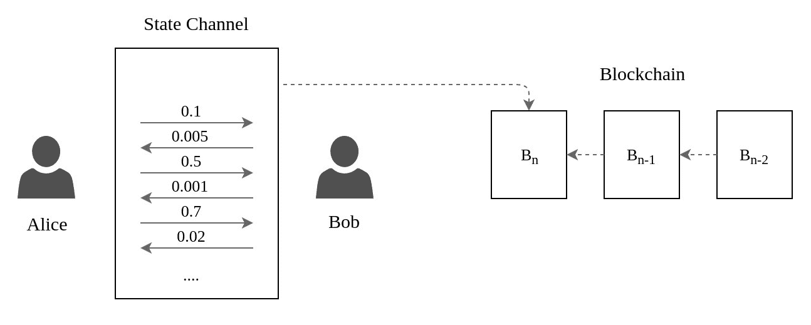
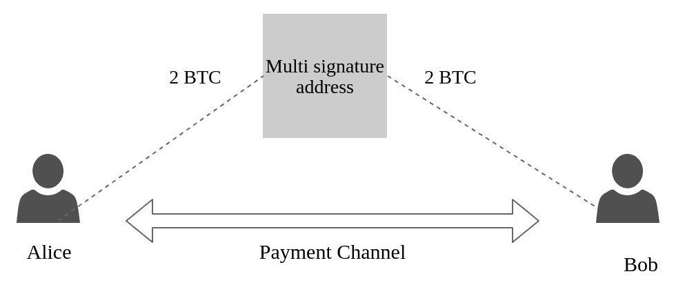
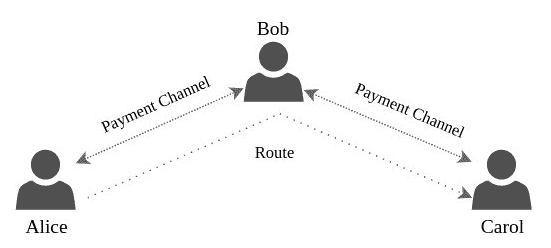
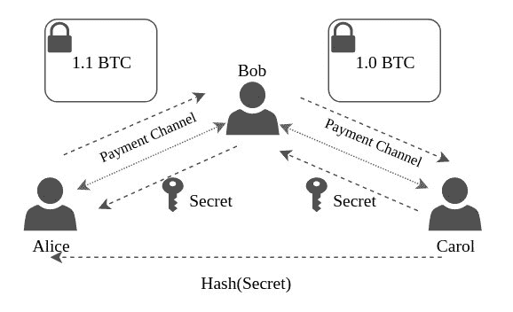
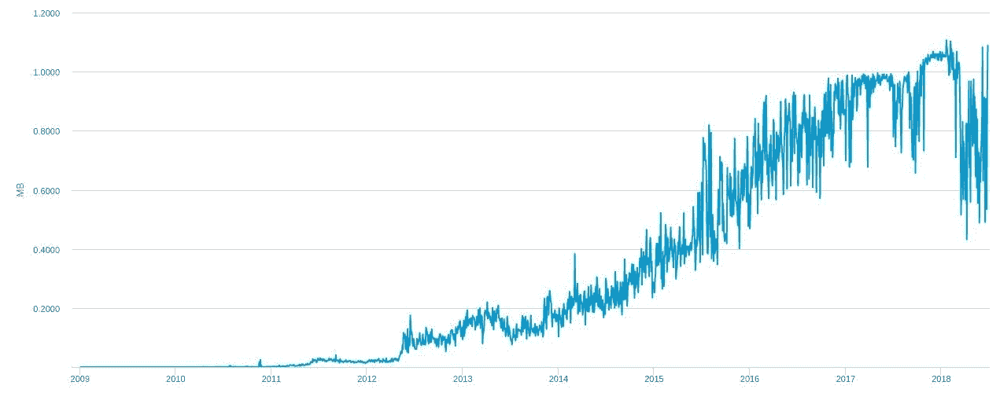
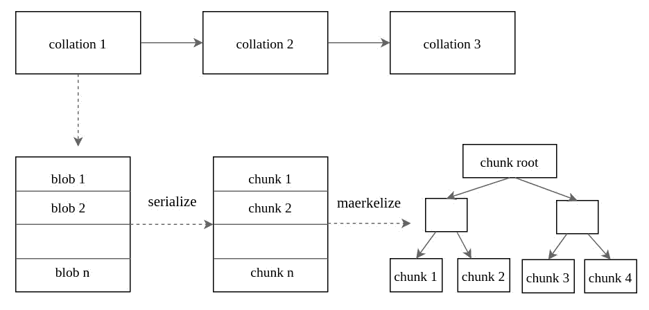
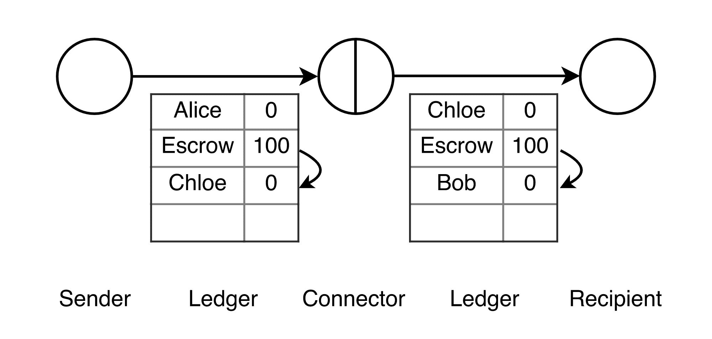

# 区块链优化和增强

可伸缩性是一个至关重要的因素，甚至在创建应用程序之前就已经开始讨论了。然而，即使在应用程序部署之后，应用程序也需要频繁更新，以便根据应用程序负载进行扩展。虽然即使在区块链领域，可伸缩性也一直是人们关注的问题之一，但当这项技术首次被提出时，它并不是首要考虑的问题。然而，随着时间的推移，由于对该技术的兴趣增加，人们现在正致力于改善区块链技术的各个方面。

在这一章中，我们将探讨各种可以实现的优化，以帮助您实现更好的性能或计划可伸缩性。我们还将介绍对现有区块链应用程序的一些增强，以添加有趣的功能。本章中讨论的大多数优化和增强要么已经在一些区块链项目中实现，要么处于实现的初始阶段。

在本章中，我们将讨论以下主题:

*   区块链优化:
    *   交易交易所
    *   外链交易
    *   块大小改进
*   区块链增强功能:
    *   分片
    *   共识算法–PoS、PoA、BFT 和 PoET
    *   跨链网络
    *   隐私增强

自 2009 年比特币首次实现以来，它已经取得了巨大的进步，以抵御不可信公共网络中的任何攻击。比特币通过一个标准程序进行改进，通过一个名为**比特币改进提案** ( **BIP** )的设计文件提出功能，该文件于 2011 年在比特币社区内首次提出。比特币有近 200 条改进建议(【https://github.com/bitcoin/bips】)这些建议是其在网络中的韧性的原因。

我们遇到了几个从比特币概念演变而来的区块链项目。许多其他项目不得不经历巨大的实现变化，以形成满足其需求的应用程序。大多数项目改进和增强了现有的实现，以解决一些挑战，如可伸缩性、安全性和适应性。企业热衷于利用这项技术来分散他们现有的架构。在采用该技术之前，他们一直在创建概念验证，以克服所有现有的挑战。在这一章中，我们将研究一些技术上提出的优化和增强，它们将根除技术面临的挑战。

# 区块链优化

由于区块链应用程序的分散特性，很难对运行中的应用程序的区块链协议进行大的修改。现有协议需要仔细优化以实现改进。在接下来的部分，我们将讨论一些可能的优化。

# 交易交易所

通信和交换数据是分散式 P2P 网络的本质。在区块链网络中，事务是节点之间交换的主要数据。通过使用适用于交易数据的协议，可以实现交易交换的优化。以下部分描述了一些优化技术。

# 区块链中继网络

虽然区块链网络中的节点是平等的，但节点可以选择扮演各种角色。一些节点可能充当完整节点，维护整个区块链，而其他一些节点则充当轻量级节点，仅维护所需的事务。除此之外，愿意创建新块的节点将执行挖掘操作。当所有这些节点以 P2P 方式相互通信时，将会有网络延迟。

挖掘节点需要保持最小的延迟，因为它们涉及时间敏感的操作。即使在重要的金融交易中，分散式系统也需要尽可能地减少延迟，以便客户和商家能够快速收到通知。比特币网络使用中继网络来最小化对等体之间的块交换期间的延迟，尤其是在挖掘节点竞争构建下一个块的情况下。

中继节点在将块/事务中继到网络之前不会完全验证数据。虽然中继节点在中继大多数事务时很快，但它们可能无法准确地传递系统的每个事务。一位名叫马特·科拉洛(Matt Corallo)的比特币核心开发者创建了一个基于 UDP 的中继网络，名为**快速互联网比特币中继引擎** ( **光纤**)。它使用由比特币核心开发的 compact block 提供的压缩技术。由于光纤代码库是比特币核心的扩展，光纤节点可以像比特币核心节点一样设置。

关于协议和节点设置的更多信息可以在[http://bitcoinfibre.org](http://bitcoinfibre.org)找到。

另一个名为 **Falcon** 的中继网络使用应用级直通路由来实现更快的数据块传播。优化的拓扑结构声称它比基于压缩的中继网络更快。这些中继网络不仅保证了网络节点获得更高的吞吐量，还保证了分布式 P2P 网络未来的可扩展性。

关于猎鹰中继节点的更多细节可以在 https://www.falcon-net.org 找到。

# 可逆布鲁姆查找表

可逆布鲁姆查找表可用于有效地找出两个数据集之间的差异。这一概念已经在比特币中实现，以实现对等体之间更低的交易交换延迟。在没有任何机制来发现两个集合之间的差异的情况下，每个比特币节点必须不断将自己的交易集合传输到网络，并期望其他节点以交易集合中不存在的交易来回复。由于每个节点中的大量交易，这种机制消耗了大量的比特币网络带宽和时间。

一种解决方案是传输可用于有效发现数据集之间差异的信息。可逆 bloom 查找表通过创建更小的查找表来解决这个问题，这些查找表可以找到两个集合之间的事务差异。

可逆布隆查找表是布隆过滤器的变体。它们以很高的概率提供对键值对的成功查找。与 bloom 过滤器不同，它们不仅允许您查找特定的键，还可以列出插入的键/值对。查找表是一种概率数据结构，成功查找的概率随着查找表的大小而增加。

布隆过滤器是一种概率数据结构，用于检查集合中元素的存在。虽然元素的不存在从来不会被错误地预测(假阴性)，但存在有时会被错误地预测(假阳性)。布隆过滤器用于比特币的特殊类型节点，称为轻量级或**简单支付验证** ( **SPV** )节点，用于验证块中特定交易的存在，而无需下载整个块。

网络上的每个节点将广播事务池的查找表，该表将被网络中的其他节点识别。网络中的节点将只交换所需的事务，从而减少冗余通信。借助这些查找表，可以快速安全地同步池中的事务。

# 外链交易

可以在区块链之外执行的一组交易被称为链外交易。外链交易依赖于几种验证方法，这些方法不同于主区块链中使用的方法。尽管离线交易的主要动机是提高交易速度，但它也应该通过确保交易不能被任何参与者撤销来提供基本的安全性。

**链外状态通道**和**侧链**是流行的链外解决方案。我们将看看这两种离线交易解决方案。

# 链外状态通道

状态通道是系统成员之间的双向通信，使成员能够执行一系列事务，而无需将它们提交给区块链。通过避免每个事务的区块链确认，离线事务极大地增加了吞吐量。

链外渠道是微交易的理想选择，在微交易中，双方通过建立独立于区块链的支付渠道来交流交易。一旦双方之间的交易结束，国家渠道就可以关闭。然后，信道的最终状态被发送到区块链。

*图 9.1* 显示了在 Alice 和 Bob 之间创建的支付渠道。然后，Alice 和 Bob 将执行一系列事务，这些事务的状态仅在状态通道关闭后才写入区块链:



图 9.1:两个用户之间的状态通道事务

# 闪电网络

闪电网络是在比特币区块链之上运行的第二层支付协议。在撰写本文时，该协议的实现正在比特币的 mainnet 上以测试模式运行。这是一个路由双向网络，旨在解决比特币交易的可扩展性问题。

**设计**

Lightning 网络创建了一个路由支付通道网络，其中节点之间的通信是双向的。该设计已经由几个开源社区按照一套标准实现了。

雷电网络的简单设计包括以下步骤:

1.  通过使用来自各方的初始资金建立支付渠道

2.  执行微支付交易并更新渠道的创建资金

3.  关闭支付通道，并广播通道资金的最终状态

**闪电网络的例子**

让我们考虑一个例子，其中 Alice 想要与 Bob 执行几次比特币支付交易。Alice 和 Bob 决定使用闪电网络开通一个支付通道。

爱丽丝和鲍勃都创建了一个渠道，最初每个人用 2 个比特币资助它。资金可以保存在多签名地址账户中，这将确保双方需要就最终的资金分配达成一致。资产负债表将被维护，它将在每次交易后更新 Alice 和 Bob 的余额。资产负债表类似于餐馆或酒吧记账的概念；不是为每个订单付款，而是维护一个标签，该标签可用于为所有订单一起付款。

Alice 希望向 Bob 发送 0.5 个比特币，因此她将创建一个向 Bob 支付 0.5 个比特币的交易。支付渠道将更新资产负债表，而不是将此交易附加到区块链。现在，渠道基金将 1.5 个比特币反映为爱丽丝的余额，2.5 个比特币反映为鲍勃的余额:



图 Alice 和 Bob 之间的闪电网络支付通道

Alice 和 Bob 可以执行任意数量的交易，而无需等待交易状态，因为支付通道独立于区块链状态。当在创建的通道上不再有交易要执行时，可以关闭支付通道。然后，通道的最终状态被广播到区块链网络，以便在单个事务中包含在区块链中。闪电网络的实施，安全地执行链外交易，增加了区块链网络的总交易吞吐量。

# 路由支付网络

闪电网络中的用户不需要与每个用户建立直接支付通道来执行交易。用户可以找到几个连接的支付通道来连接到其他用户，以便建立路由支付网络。考虑一个例子，其中 Alice 想要与 Carol 建立微支付通道。Alice 早些时候已经与 Bob 建立了一个频道。她还发现 Bob 与 Carol 有一个活跃的频道。因此，Alice 决定通过 Bob 与 Carol 创建一个路由支付通道，而不是建立一个新的支付通道，如图*图 9.3* 所示:



图 Alice 和 Carol 之间通过 Bob 的路由支付网络

路由支付通道建立在多个不可信节点之间，节点不知道路由中的下一跳。网络中的任何支付渠道都可能因错误行为而随时失效。为了容忍网络中的故障，必须为网络中的每个通道建立托管。基于时间的脚本扩展(智能契约)，如**哈希时间锁契约** ( **HTLC** )可用于在支付通道中建立托管。

**哈希时间锁契约**

HTLCs 是一种特殊类型的智能合约，可以使用比特币的基本编程语言(脚本)创建。网络中的参与者将在交易过程中提交他们的资金，交易中的秘密将在托管建立后共享。

HTLC 类似于在交易创建期间创建的锁定脚本，其中使用非对称加密生成的密钥来解锁资金。HTLC 没有使用永久密钥，而是使用随机生成的秘密，并在每次交易中销毁。基金的接收者最初将创建一个随机秘密， *R* ，使用诸如 SHA256 之类的单向函数对其进行散列。然后，计算出的秘密散列值 *H* 可以与交易中涉及的所有参与者共享，以创建 HTLC 脚本。

尽管提交给 HTLC 脚本的基金可以通过提供秘密 R 来赎回，但它也有一个时间锁，要求秘密所有者在指定时间内认领基金。时间因子也可以在块数中指定。比特币使用`CheckLockTimeVerify`扩展来对合同进行时间锁定。

通过结合散列和时间锁定条件来准备最终的 HTLC 脚本。网络中任何一个拥有秘密的节点都可以声称这笔资金属于 HTLC。

**路由支付示例**

让我们在前面的例子的基础上考虑一个场景，其中 Alice 想给 Carol 而不是 Bob 发送 1 个比特币。由于在 Alice 和 Carol 之间没有活动通道，Alice 和 Bob 通过 Bob 创建了一个支付通道，如前所述。现在，Carol 为该会话创建了一个随机秘密 *S* 。她创建了一个秘密 *S* 的散列并与爱丽丝分享，但是这个秘密受到保护，没有向任何人透露。

爱丽丝和鲍勃之间的支付渠道由 4 个比特币提供资金。同样，鲍勃和卡罗尔之间的通道也是用 4 个比特币资助的。Bob 在每个支付通道上都有 2 个比特币的份额。爱丽丝通过创建价值 1.1 比特币的 HTLC 承诺开始交易，该承诺可支付给鲍勃。额外的 0.1 比特币是支付给 Bob 作为经纪的交易费。鲍勃将不能要求承诺，因为他不拥有这个秘密。Bob 现在被指示在另一个通道上创建一个新的事务。他创建了一个价值 1 比特币的 HTLC 承诺，支付给卡罗尔。由于 Carol 拥有密钥，她获得了比特币，并将密钥交给了 Bob。现在鲍勃可以在 HTLC 认领比特币了。

所有参与者在不信任支付网络中的其他节点的情况下要求他们的资产。当任何通道关闭时，可以将支付通道的最终余额写入区块链:



图 Alice 和 Carol 之间通过 Bob 的路由支付网络

每当需要创建事务时，每个节点都将执行路由发现。用于路由发现的信息是通过 P2P 网络模型从网络中的所有节点收集的。一旦节点获得所有信息，最佳路径就由发送方节点构建。发送方发现路由后，所发现的路径中涉及的每个节点不会知道所有节点。每个节点将仅被告知与它们建立了支付通道的节点。这是通过实现一个基于洋葱路由协议的系统来保护交易的隐私来实现的。

# 边链

侧链是一种平行于主区块链的区块链，通过双向销钉连接到主区块链(也称为主链)上。与国家频道类似，侧链是扩展现有区块链网络的第 2 层解决方案。

在将状态提交给主链之前，可以在侧链上执行一组资产上的任意数量的事务。与国家频道不同，侧链是一个永久的链，与主链一起运行。每当一个资产需要被发送到侧链时，同样的资产需要通过转移到一个特殊的地址而被锁定在主链中。一旦资产被锁定在主链中，相同的资产可以被释放到侧链。只要资产被锁定在主链中，侧链就可以在资产上执行事务。一个叫做**联邦**的特殊团体充当主链和侧链之间的中介。

侧链有几种现有的实现方式。根茎创造了一个与比特币区块链双向挂钩的侧链。织机([https://loomx.io/](https://loomx.io/))已经为以太网创建了一个基于侧链的股份证明。matic networks([https://matic . network/](https://matic.network/))是另一项服务，它使用 Plasma 框架的改编版本创建了 Stake 侧链证明。

# 块大小改进

事务块是任何基于区块链的分散式应用程序的基本组成部分。每个基于区块链的实现都将定义自己的块结构。比特币区块有一个标头和主体部分，其中定义了一组字段。很少有字段有固定的限制，块大小也是如此。比特币的块大小是 1 MB，是 2010 年推出的。这限制了一个块中可以包含的事务数量。

随着比特币网络中的活动量因其受欢迎程度而增加，每个区块中创建了更多的交易。*图 9.5* 显示了每个块的平均事务数在过去几年中是如何增长的。从去年开始，大多数比特币区块都达到了每个区块交易数量的门槛。我们可以从图表中得出结论，最近几年每个区块的平均交易次数在 2500 次左右。由于比特币具有 10 分钟的固定块间隔，比特币可以实现的平均交易吞吐量约为每秒 4-5 笔交易，这明显低于 PayPal 或 Visa 交易，其交易吞吐量分别约为每秒 200 笔和 1，600 笔交易:


图 9.5:平均每块比特币交易量(来源:www.blockchain.info)

提高事务吞吐量的一个直接解决方案是充分利用块大小。但是，根据*图 9.6* 中的图表，比特币区块最近一直在利用其全部 1 MB 空间进行交易。由于最近开采的区块数量增加，已多次讨论和提议增加区块规模。尽管机构群体对此很感兴趣，但未能获得实施数据块更新协议所需的多数支持:

近年来，一些块已经超过了 1 MB 的限制，这是由于名为**隔离见证**的协议升级，我们将在后面的章节*提出的解决方案*中讨论。



图 9.6:比特币的平均块大小表示(来源:www.blockchain.info)

# 增加区块大小的动机

增加块大小显然是实现更高事务吞吐量的一种方法。但是，还有其他几个因素可能会导致块大小的增加:

*   增加的交易活动可能导致瓶颈，从而堵塞区块链网络。一些事务可能会被延迟或永远丢失。

*   增加微支付的等待时间会阻止技术的创新。

*   目前，用户被迫支付更高的交易费用来优先处理交易。

# 对增加块大小的关注

尽管增加块大小是增加事务吞吐量的直观方法，但这种方法存在一些问题。以下是其中的一些:

*   由于大小增加，交换块数据将变得更加困难

*   增加数据块大小是一个立竿见影的解决方案，但不是长久之计

*   更改块大小将导致硬分叉，并可能导致共识失败

*   更大的数据块将需要更高的带宽来交换数据，这可能不会引起普通完整节点用户的兴趣，并且由于维护成本增加，可能不再保持完整的区块链

# 提议的解决方案

从 2010 年初开始，就有人试图通过不同的提议来增加区块规模。甚至有一些**比特币改进提案** ( **BIP** )一直在关注这个问题。它们中的一些是 BIP 100 - 103 和 BIP 109，并且它们都处于草稿或被拒绝的状态。

比特币核心的最初开发者之一加文·安德森(Gavin Andreson)提出的最初提案之一“BIP 101”建议将区块大小增加到 8 MB，并每两年将限制增加一倍，大小在两年内线性增长。尽管该提议获得了大多数矿工的支持，但它未能获得经济上的多数支持，因为它需要一个硬叉子。一个名为 **Bitcoin XT** 的替代比特币客户端在 2015 年实施了 BIP 101，但未能获得实施 BIP 101 的共识。BIP 的实现后来被从比特币 XT 中移除。

尽管提出了许多解决方案，但比特币未能获得大多数人对新区块大小的批准。但是提出了一种解决方案来增加块容量并防止事务的可延展性，这就是所谓的隔离见证的协议升级。隔离见证定义了一个称为见证的新结构，其中存储了事务的所有签名信息，将它与块中的事务信息分开。事务的有效性可以通过见证结构中的信息来验证。

隔离见证定义了一个新的重量单位，并允许创建多达 400 万个单位。新见证结构中的 1 字节被认为是 1 个单元，但是旧块区中的 1 字节数据被认为是 4 个单元。这允许旧数据块有 1 MB 的限制，而使用升级协议创建的数据块不受 1 MB 的限制。这个提案的最大优点之一是它不需要区块链的硬分叉来达成共识。

块大小的改进只是区块链可扩展性问题的短期解决方案。比特币社区不断提出更好的解决方案，以便从长远角度解决网络可扩展性问题。

# 区块链增强

在现有区块链协议的基础上进行了大量增强，以提高运行效率或使区块链应用程序适合实现所需的功能。我们将讨论一些需要对协议进行重大修改的增强。

# 分片

比特币和其他现有区块链平台面临的一个关键问题是扩大区块链网络中的应用。存储是降低分散应用程序可伸缩性的主要因素。区块链中的每个完整节点存储整个区块链历史以验证事务。取代在每个节点上存储冗余数据，数据可以在网络上巧妙分布，从而有助于实现可伸缩性和去中心化。以太坊提出了一种分片机制来实现一种可以实现可伸缩性的分布式行为。我们将在这一节讨论以太坊提出的一些关键概念。

更多关于以太坊分割路线图的细节可以在 https://github.com/ethereum/wiki/wiki/Sharding-roadmap 找到。

# 数据库分片的动机

分片涉及对数据进行分区，以便在多个设备之间分发。分片并不是实现计算资源分布的新概念。它已经被用来实现数据库的可伸缩性。数据库碎片是通过对表进行水平分区而创建的。每个分区或碎片通常位于物理上独立的服务器中，以平衡负载。

将数据库表水平划分为碎片将减少行数，从而减少索引大小，这将优化搜索。如果数据库分区是在真实世界的数据分段上执行的，比如在不同的分片上存储与不同国家相关的数据，那么只查询相关的分片将会很容易。

*图 9.7* 显示了最初在全局数据库中存储用户详细信息的数据库表如何进行分区:


图 9.7:基于物理位置的数据库分片

数据库表被水平分割成两个不同的表，每个表维护原始表中全部行的子集。这些表是根据第一个表包含亚洲用户的详细信息，第二个表包含北美用户的详细信息来划分的。以这种方式对数据库表进行分区将提高查询的性能。通过使用一种称为**一致性散列**的特殊散列类型，数据库表也可以被分区并分布在多个服务器上。

当调整了 N 个槽的散列表大小时，大多数键(K)需要重新映射到槽。一致散列是一种特殊类型的散列，其中槽数量的变化只需要重新映射 *K/N* 个键。

# 区块链的分片

分散式区块链网络由若干节点组成，以实现尽可能高的分散程度。网络的安全性随着网络中节点数量的增加而增加。但是节点的数量对网络的可扩展性没有贡献。事实上，随着节点数量的增加，很难进行扩展。以太坊提出了一种分片技术，将整个区块链及其状态分成称为分片的分区。

以太坊中的分片方案可以被划分成任意数量的分片，这些分片保持它们自己的历史和状态。让我们考虑一个方案，其中一个区块链基于一些标准被划分成 *K* 个碎片。分片的一个示例标准可以是资产，其中属于不同资产的事务在不同的分片上维护。因为每个碎片都维护自己的状态，所以在一个碎片中创建的事务的效果仅限于该碎片的状态。

# 碎片中的组件

每个碎片都在一个排序规则中维护数据，这类似于主区块链中的块。每个排序规则都包含 blobs 形式的数据集合。每个排序器包含一个头和主体，类似于主链中的块。*图 9.8* 描述了如何将斑点转换成块，然后通过构建由块作为叶子组成的 Merkle 树来为这些块创建 Merkle 证明。创建了一个排序规则链，这是碎片的区块链。主链仍然存在，由每个人处理，但是他们只存储碎片的排序头。碎片中最长的链称为规范链，它的头将驻留在主链中:



图 9.8:碎片中的排序规则和 blobs

分片中有节点叫做**提议者**。这些节点可以选择碎片，也可以随机选择。提议者负责接受 blobs 并创建排序规则。因此，它们也起校对者的作用。**公证员**是下载和验证校对的实体。它们被分配给碎片，并通过随机信标链(使用一些可验证的随机函数)在每个周期随机地混洗到一个新的碎片。他们还将对校对数据的可用性进行投票。

一个**委员会**将检查投票并决定是否在主链中包含一个排序头。归类头将建立一个到碎片中的归类数据的链接。

# 共享区块链的设计

如前一节所述，划分区块链并将其分布到不同的片上需要各种参与者。网络中的所有参与者将确保每个碎片的整理数据都链接到主链。由于分散式网络中的分布式分片和多种类型的参与者，分片架构有几个安全问题。

如果在超过 50%的验证者诚实地遵循协议的情况下，区块链的设计能够保持诚实的多数，则称其是安全的。如果存在不协调的多数，则该值可以更低。

不协调多数是实现多数的行为，但不超过 50%(通常在 20%到 50%之间)的验证者有能力协调一个行为。

分片区块链的设计将一个分片的事务与网络中的其他分片隔离开来。如果一个节点需要与另一个片上的节点执行事务，这不像经典的区块链设计那样简单。以太坊分片使用一个叫做 receipt 的概念来执行跨分片通信。

# 跨碎片通信

可能会有这样一种情况，一个事务需要在两个或更多的碎片之间共享。以太坊使用一个碎片中的节点创建的收据来确认交易。让我们考虑一个场景，其中用户 *A* 出现在碎片 *M* 中，想要向碎片 *N* 的用户 *B* 发送 100 个硬币。跨碎片通信可以通过以下步骤建立:

1.  在 shard *M* 上创建一个用于扣除硬币的交易。

2.  为从用户 *A* 到 *B* 的 100 个硬币的交易创建收据。交易不会保存在状态中，但是用户可以在碎片 *N* 中验证收据的存在。

3.  在 shard *N* 上创建并发送包含 Merkle 收据证明的交易。该交易还确认了收据是未支出的。用户 *B* 的余额在碎片 *N* 中增加 100 个硬币。

一些复杂的场景可能会导致跨多个碎片的通信，以从其他碎片的状态中查询数据。

# 一致性算法的发展

我们已经在本书的几个章节中遇到了比特币的**工作证明** ( **PoW** )共识算法。PoW 算法是分散式网络协议的基础。虽然比特币的共识算法已经被证明可以有效地在不可信的网络中实现共识，但由于挖掘过程中花费的计算资源，它在成本方面仍然不是很高效。

已经开发并实现了许多可选择的共识算法，以在不产生太多费用的情况下，在去中心化中获得相同的置信度。

# 股权证明

PoS 算法通过不依赖于计算资源来实现一致性，消除了 PoW 的大多数问题。PoS 使用验证器，这与权力中的矿工形成对比，因为他们不执行任何有助于去中心化的工作。PoS 验证器的贡献取决于它们在系统中流通的全部加密货币硬币中所占的份额。拥有三枚硬币的验证者比拥有一枚硬币的验证者对验证做出贡献的可能性大三倍。还有一些其他的因素使这个过程随机化，以避免一个有很大利害关系的验证者垄断验证过程。Peercoin 率先采用 PoS，Nxt 和 BlackCoin 紧随其后。以太坊目前使用 PoW，但是 PoS 正在积极开发中，它已经计划在不久的将来在 mainnet 中实现 PoS。

除了其广泛的好处之外，它在实施中也有自己的一系列问题。BitFury group 发布的一份关于 PoS 与 PoW([https://bitfury.com/content/downloads/pos-vs-pow-
1.0.2.pdf](https://bitfury.com/content/downloads/pos-vs-pow-1.0.2.pdf))的白皮书列出了一些可能的攻击，如远程攻击、贿赂攻击、币龄累积攻击和预计算攻击。确保公共分散网络的完全安全并不容易。即使有弹性的 PoW 理论上也容易受到 51%的攻击，这可能导致双重花费(我们将在[第十章](10.html)、*区块链安全*中涉及 PoW 的安全问题)。PoS 算法通过惩罚不良行为的节点来防止验证器的攻击。以太坊要求每个节点至少拥有 1250 个以太网参与验证。验证者的最小股份存款防止他们在网络中不诚实。

# 活动证明(PoA)

大多数加密货币和使用 PoW 的区块链平台的令牌供应有限。例如，比特币只会铸造 2100 万枚硬币，最终的硬币将在 2140 年的某个时候铸造。当所有硬币都被铸造出来时，矿商将不得不完全依赖交易费作为他们的激励。根据比特币目前的难度水平，它将达到矿工参与采矿过程可能不经济的水平。现有的采矿者可能为了他们自己的利益而尝试并执行不诚实的行为，并且通过无效的交易来破坏区块链系统。PoA 是作为一种可供比特币采用的替代共识算法提出的。这是一种结合了权力和地位混合方法。

在块创建期间，挖掘节点通过用计算资源解决散列难题来执行 PoW。powerprocess 不会添加任何事务；相反，他们只创建包含矿工详细信息的块标题。PoS 用于通过基于块头信息随机选择验证器来进一步处理块。这个共识阶段的处理方式类似于基于 PoS 的系统。如果不是所有选定的验证者都能够签署该块，则选择下一个最佳块，并应用相同的 PoS 验证过程。每个区块被纳入区块链后，战俘和战俘矿工都将获得奖励。

Decred 是一种加密货币，于 2016 年 2 月推出，利用 PoA 实现网络共识。

# 拜占庭容错(BFT)共识模型

一致性算法被设计在分布式系统中，以容忍与拜占庭将军问题相关的拜占庭错误(参见[第 1 章](01.html)、*简介*，关于拜占庭将军问题的定义)。尽管权力和职位可以容忍拜占庭式错误，但这是有代价的。已经提出了几个**拜占庭容错** ( **BFT** )共识模型的变体，作为不可信分布式网络中这个问题的解决方案。

# 实用拜占庭容错(PBFT)

PBFT 共识算法由 Miguel Castro 和 Barbara Liskov 提出，作为分布式系统中拜占庭将军问题的实际解决方案。如果状态改变，它通过投票机制在节点间达成共识。该算法要求在一个有 *f* 个失效节点的系统中至少有 *3f+1* 个节点。PBFT 对系统造成了大约 3%的总开销，这是对基于 PoW 共识的系统的巨大改进。根据节点扩展 PBFT 仍然是一个挑战，因为随着节点数量的增加，这将导致更大的开销。

Hyperledger Fabric 项目使用 PBFT 协议在许可的区块链中实现高交易吞吐量。

# 联邦拜占庭容错

FBFT 是 BFT 算法的一种变体，已经在 Ripple 和 Stellar 等基于支付协议的区块链平台上实现。这两个平台都通过处理法定货币来执行关键交易，如跨境支付。由于它们的关键性，共识模型应该是抗故障的，以避免任何攻击。

**涟漪共识协议**

上一章概述了 Ripple 共识协议及其平台架构。每个节点通过对事务进行投票来实现 FBFT 共识模型。网络中的每个节点维护一个名为**唯一节点列表** ( **UNL** )的列表，包括可信的 Ripple 节点。每个节点向其在 UNL 中的节点广播一组称为候选集的事务。每个节点将验证事务并广播它们对每个事务的投票。每个节点基于为每个事务接收的投票来改进候选集。当一个特定的候选集合从 UNL 中的所有节点接收到 80%的选票时，候选集合中的所有交易通过将其添加到区块链分类账中来确认。Ripple ledger 进入关闭状态，所有未确认的交易将结转到下一轮投票。

Ripple 循环执行投票机制，以在提交事务之前获得所有节点的最低共识。FBFT 实现了比无许可网络更高的交易速率。因此，它可以在需要更高可伸缩性的关键金融系统中实现。

# 逝去时间的证明(诗人)

PoET 是一种共识算法，旨在解决现有共识协议面临的性能问题。它使用可信执行环境解决了拜占庭将军的问题。由于其可信执行模型，它只适用于许可的区块链网络。PoET consensus 已经在 Hyperledger 的锯齿中实现，这是一个由英特尔支持的许可区块链项目。网络中的**可信执行环境** ( **三通**)是通过英特尔的**软件卫士扩展** ( **SGX** )来实现的，这些扩展是允许用户代码分配私有内存区域的指令集。

类似于 PoS 算法，PoET 选举一个随机的对等体来构建下一个块，除了不涉及任何标桩。相反，对等体在参与块创建过程之前会等待一段随机的时间。由于每个对等体都有一个随机等待时间，第一个完成等待时间的对等体将创建该块。每个对等体必须向网络证明几件事情，以使自己有资格成为被选举的节点:

*   证明节点选择了随机等待时间

*   证明节点已经等待了选择的随机等待时间

借助英特尔的 SGX 指令集，每个节点通过在受保护的环境中运行可信代码来满足这些要求。参与选举的节点从可信函数获得等待时间。时间最短的节点将成为下一个要创建的块的领导者。一个函数，比如说`CreateTimer`，将设置定时器，而另一个函数，比如说`CheckTimer`，将在定时器到期时创建一个证明。该证明证明节点在创建块之前已经等待了指定的等待时间。网络上的每个节点都将使用此证明来验证该块。

网络中的每个节点将下载可信代码并执行初始握手来建立可信网络。作为握手的一部分，节点将为可信代码创建密钥对，并向整个网络发布其公钥。

PoET 承诺以其基于时间的选举机制获得更高的性能以达成共识，并且它是私有企业区块链网络的理想选择。但是许可模型对于公共网络是不实际的，因为它需要专门的硬件来创建受保护的执行环境。

# 跨链协议

分布式区块链分类帐是一个不断发展的空间，许多应用程序经常被实现。正如任何需要不时更新的计算机技术一样，现有的区块链系统也需要更新，以便与不断发展的技术一起发展。与其他集中式系统不同，由于节点的分散性，对现有区块链的大量更改将导致硬分叉。现有的区块链系统受限于创新或与演进协议的集成。

开发跨链协议是为了将现有的区块链应用程序与新开发的系统集成在一起，并使多个区块链网络能够相互通信。跨链通信协议还有助于通过集成多个分类账来扩展区块链网络。

几个项目一直致力于跨链协议的实现。Cosmos 、 *Polkadot* 和 *Interledger* 是以他们自己的方式实现跨链协议的一些项目。Cosmos 和 Polkadot 拥有自己的区块链生态系统，其中有几个组件可以与其他独立的区块链系统进行通信。Interledger 是一种跨支付系统进行支付的协议。在下一节中，我们将分析使用 Interledger 的支付系统中的跨链协议实现。

# 内部分类协议

世界各地的所有支付系统都在一个单一的支付网络中运行，所有资产和交易细节都由一个单一的分类账维护。甚至像比特币这样的数字货币也将所有交易保存在一个公共账本中，尽管账本的副本分布在整个网络中。交易可以很容易地在单个分类账中维护，但是纵向扩展这样的分类账是困难的。我们已经在本章的*分片*部分分析了单个分类帐的可伸缩性。除此之外，多样化的支付系统将永远不会同意单一的分布式分类帐或其相应的共识机制。一个可以连接多个支付系统并通过网络执行廉价交易的协议将是现有分类账垂直扩展的一个很好的解决方案。

分类帐间协议提供了一个跨不同分类帐安全转移价值的系统，它也经常与其他支付系统一起使用。Interledger 指定参与者的分类帐之间的连接器来执行交易。与任何现有的支付网关服务不同，参与者不需要信任这些连接器，因为分类帐提供了托管服务。该协议不仅支持区块链分类账之间的价值转移，还能与 PayPal 等传统支付系统建立联系:


图 9.9: Interledger 协议(ILP)用例

# 中间分类帐组件

*   **发送方**将资产发送给已知的接收方。他们将通过选择连接器来启动支付。

*   **接收者**将期望来自特定发送者的资产。他们需要成为转账支付网络的一部分。

*   **连接器**连接发送者和接收者，使 ILP 支付成为可能。连接器也与其他连接器连接。这样做是为了通过为每笔支付构建的连接器链，将尽可能多的发送者与接收者连接起来。

*   **账本**对网络中每个参与者的资产信息进行记账；


图 9.10:夹层组件

# 夹层设计

当前的支付系统以支付网关的形式提供了在不同分类账之间转移价值的方式。他们充当支付银行之间的中介。现有系统主要关心的是安全性和速度。网关由第三方管理，用户需要依靠这些实体来确保安全。这种支付网络中的交易结算较慢，因为网关必须与多家支付银行打交道。Interledger 在分类帐之间引入连接器，在发送方和接收方之间建立链接。该系统中的分类帐创建了一个第三方托管，这是一种加密条件，在跨分类帐进行交易时将保护资金。由作为托管的分类帐创建的加密条件保证资金仅在接收方确认后转移到连接器:



图 9.11:将资金转移到连接器(来源:https://interledger.org)

分散式网络会受到有缺陷或不良行为者的威胁。资金的有条件托管是一个主要的安全特征，它确保资金仅在确认后才被转移。

分类帐 escrows 使用加密签名。然后，任何人都可以验证签名，以检查是否满足条件。

在 Interledger 中，可以使用两种模式来执行付款流程。这些是原子支付和通用支付。

**原子支付**

分类帐间付款保证了转移的执行或中止。它使用一个提交协议，在决定事务的执行或中止之前，系统的准备状态被识别。分散系统中的承诺协议使用一组称为公证人的事务管理器。这些公证用于在不受信任的拜占庭节点之间达成共识。

当在交易之前创建支付网络时，在发送者和接收者之间可能涉及不止一个连接器。连接器的数量取决于参与者之间选择的路由，该路由基于跳数或所涉及的费用。*图 9.12* 显示节点 **p <sub>1</sub>** 和 **p <sub>n</sub>** 之间交易时`n-1`总账之间有`n-2`个连接器:


图 9.12:有多个连接器的支付路线(来源:https://interledger.org)

支付网络中的所有连接器都是错综复杂的节点，在交易过程中可能会表现出错误的行为。当选的公证人团队需要在拜占庭节点中达成共识。不可信的公证人需要容错，以便创建原子事务。网络应该确保在 *3f+1* 节点中不超过 *f* 个有故障的公证节点。

在发送者可以开始转移之前，必须在考虑连接器的费用和汇率之后选择连接器的路径。一旦选择了最佳路径，就可以在交易过程中观察到以下阶段:

1.  参与者选出一组公证人。选举应确保在总共 *3f+1* 名公证人中，有过失的公证人人数应少于 *f* 。

2.  支付发送者向每个连接器提出转账请求。所有连接器将验证汇率是否与它们的汇率匹配。一旦所有的连接器确认他们批准该提议，发送者将开始传输的准备。

3.  发送方准备从分类帐到连接器的传输，并请求连接器准备从路径中的下一个分类帐到其相邻连接器的传输。一旦确认资金已被托管，每个连接器将立即准备转账。

4.  一旦每个分类账的资金托管完毕，资金的最终接收人将在收据上签字。如果公证人按时收到收据，那么公证人将把执行消息转发给交易中的所有参与者。

**通用支付**

与原子支付模型不同，在这种模型中没有公证人充当交易管理者。它利用网络内部的参与者来达成共识。虽然它消除了与外部协调者的交互，但它可以确保在已知环境中只有非故障参与者的安全。由于网络中不可信的参与者表现出错误的行为，普遍支付的实际考虑并不简单。

除了提供多个分类帐之间的连接，Interledger 不依赖于任何其他系统，因此它提供了根据需要扩展系统的自由。它还维护了交易细节的隐私。因此，Interledger 提供的跨分类帐支付协议极大地简化了金融系统之间的通信。Interledger 项目的更多实施细节可在[https://github.com/interledger](https://github.com/interledger)找到。

# 隐私增强

众所周知，比特币在以块存储的交易中维护着账户所拥有的资金的历史。每笔交易都包含敏感信息，如发送方地址、接收方地址和值。网络中的每个节点都使用所有数据来验证事务，然后才能将该数据块包含在区块链中。由于没有中央权威机构，比特币的分散验证迫使交易透明。

比特币的区块链提供了防止篡改交易的安全性，尽管每个人都可以看到交易。虽然区块链保护交易免受许多攻击，但它不能像其他支付服务一样保证账户持有人的完全隐私。比特币网络上的任何人都可以追踪交易历史，而无需进行任何身份验证。披露交易历史可能会暴露特定帐户的敏感信息，如最近的交易或帐户余额。比特币网络的有限隐私一直是用户最关心的问题之一。由于大多数区块链项目都是由比特币演变而来，它们遵循了类似的透明模式。大多数区块链应用程序的伪匿名特性为其用户提供了一定程度的隐私。

伪匿名(pseudo-anonymous)是不公开真实身份的个人或群体的身份。比特币用户通过他们的公共地址来识别，这不会暴露他们的真实身份。

霍普金斯大学的研究人员提出了一种名为 Zerocoin 的匿名加密货币。Zerocoin 使用零知识证明来提供比特币的扩展，通过创建匿名交易来增强其隐私。后来推出了一个名为 Zerocash 的改进协议，这是一种独立的加密货币，它利用了一种特殊的零知识证明，称为 **zk-SNARKs** 。Zerocash 后来发展成为一种成熟的数字加密货币，名为 **Zcash** 。

自从 Zcash 发明以来，已经开发了几个应用程序，通过实现类似的协议来提供隐私。Monero，Dash，Verge，甚至比特币的一个分支叫比特币私有，都是后来推出的一些基于隐私的加密货币。在这一节中，我们将更详细地探讨 Zcash，以及用于确保其交易隐私的底层协议。

# 零知识证明

零知识证明是 Zcash 实现中用于实现匿名的重要密码原语。这是一种方法，其中一方，比如说拥有一些秘密信息的 Alice，可以向另一方 Bob 证明她拥有这些信息，而实际上并没有透露这些信息。每个零知识证明都有两方，一个证明者和一个验证者。证明者将始终拥有保密的知识，而验证者将验证证明者的陈述。证明者在创建证明时应该总是利用秘密知识，这意味着验证者不应该能够在没有秘密知识的情况下向其他方复制证明。无论何时证明者创建零知识证明，它都应该满足以下性质:

*   完整性:如果陈述是真实的，诚实的验证者应该被诚实的证明者的陈述所说服。

*   可靠性:如果陈述是假的，没有不诚实的证明者可以说服验证者它是真的。可能会有一些可以忽略的例外情况。

*   **零知识**:如果语句为真，验证者除了语句本身之外，什么都不学。

零知识证明是概率证明。存在小概率的可靠性错误，其中不诚实的证明者可以使验证者相信虚假陈述。

# 一般示例

我们来看看零知识证明系统，例子很少。

**一个纸牌魔术师**

让我们考虑一个纸牌魔术师的例子，他声称他们知道一个魔术，可以预测任何被观众猜到的纸牌。在这个例子中，魔术师是证明者，观众是验证者，魔术是秘密知识。证明他们知道诀窍的唯一方法就是表演。魔术师让观众想一张牌。在观众想到一张牌后，魔术师挥动魔杖，拿出一张牌。观众确认这是被选中的牌，他们现在相信魔术师知道这个魔术。如果观众仍然需要确认，他们可以要求魔术师再次表演魔术。

这个例子模拟了零知识证明系统。魔术师是证明者，观众是验证者。骗子证明他们知道诀窍，而没有实际揭示诀窍，这满足零知识。如果变戏法的人知道这个戏法，他们总是能够表演这个动作，从而证明了完整性。如果骗子虚假地声称知道这个魔术，表演这个魔术会暴露他们的虚假声明。然而，有一个小概率，魔术师在不知道魔术的情况下就能预测出这张牌。概率是 1/52(因为一副牌中有 52 张牌)。这种可能性很小，如果这个魔术表演多次，这种可能性就会变得微乎其微。

# zk-SNARKs

**zk-SNARK** 代表**知识的零知识简洁非交互论证**。顾名思义，它是零知识证明的一个变种，在这种证明中，你可以证明秘密信息的拥有，而不需要证明者和验证者之间的交互。

许多零知识证明需要证明者和验证者通过建立一个信道不断地通信来证明知识。甚至之前考虑的例子也需要证明者和验证者的持续参与。zk-SNARK 有一个初始设置阶段，证明者和验证者共享一个名为 public 参数的公共字符串。

Zcash 使用`libsnarks`(在 C++中实现)库的分叉实现([https://github.com/zcash/libsnark](https://github.com/zcash/libsnark))来执行 zk-SNARK 操作。

zk-SNARK 允许我们验证已执行程序的正确性，而不必了解执行了什么。虽然这个概念听起来很简单，但是 zk-SNARKs 的内部工作乍一看很难理解。我们将 zk-SNARKs 的实现分解为以太坊博客中建议的四个主要部分:

*   **构造二次算术程序**(**QAPs**):ZK-SNARK 对交易执行的验证应该返回 true 或 false，而不泄露任何信息。这是通过将事务逻辑转换为二次多项式方程来实现的，该方程可以在不泄露敏感信息的情况下进行计算。

*   **在随机点进行评估以实现简洁**:方程中使用的多项式可能非常大。因此，验证者在随机选择的点评估多项式。验证者选择的随机点应该保密。如果公开了随机点，则证明者可能生成仅满足所选点的无效多项式。

*   **同态加密** : zk-SNARK 也使用同态加密技术，在不知道秘密点的情况下对多项式求值。同态加密技术确保对多项式执行的操作与对秘密点执行的操作相同。

*   **零知识**:证明者必须确保实现零知识，以便不泄露敏感信息，同时可以评估交易。

# 现金交易

Zcash 交易涉及发送方和接收方，它们可以有屏蔽的或透明的地址。一个事务可以有任意地址组合。具有两个透明地址的事务是公共事务，而具有屏蔽地址的事务是私有的。在某些情况下，发送者或接收者地址都可以被屏蔽。如果交易的任何一端被屏蔽，则需要生成零知识证明:


图 9.13:不同地址类型的 Zcash 交易

如果用户使用透明地址执行交易，所有未用完的交易输出对公众可见。涉及透明地址的任意数量的事务之间的单个屏蔽事务地址可能会破坏事务链。因此，很难追溯任何交易价值的实际来源。在区块链网络中，即使少量的屏蔽地址也可能导致大量的隐私。目前，Zcash 在他们的网络中只有不到 5%的屏蔽交易，这仍然为其用户提供了大量的隐私。

由于具有屏蔽地址的事务需要创建零知识证明，因此需要更多的资源和时间(最多 40 秒)。但是验证时间可以忽略不计，这对于去中心化是理想的，因为每个节点都执行验证。与 it 提供的改进的隐私相比，创建屏蔽交易的资源和时间成本可以忽略不计。

# 私人交易

零知识证明及其变体 zk-SNARK 的主要意图是使事务私有。在比特币等普通交易中，交易价值由未用输出(UTXOs)来声明。每个 UTXO 由所有者的公共地址和值来描述。我们假设爱丽丝有`1`个比特币，用`UTXO<sub>1</sub>`表示:

```
UTXO1 = (PK1) 
```

`PK<sub>1</sub>`是爱丽丝的公钥。每个 UTXO 还会存储一个随机数，稍后 Alice 会使用它来保护隐私:

```
UTXO1 = (PK1, r1) 
```

现在让我们将 UTXOs 存储在哈希中，以获得更好的隐私性:

```
H1 = HASH (UTXO1) 
```

这些哈希值存储在每个节点上，即使它们已经被使用。因此，为了区分乏和 UTXOs，维护了一个称为无效集的单独列表。

爱丽丝想转账 1 个比特币给鲍勃，鲍勃的公钥是`PK<sub>2</sub>`。Alice 在消费了`UTXO<sub>1</sub>`之后创建了一个新的 UTXO，地址是 Bob，价值 1 个比特币:

```
UTXO2 = (PK2, r2) 
```

爱丽丝创造了一个无效者来花费`UTXO<sub>1</sub>`、`nf<sub>1</sub> = HASH (r<sub>1</sub>)`。她还创建了一个`UTXO<sub>2</sub>`的散列，并将其转发给所有公共节点(Carol in *Figure 9.14* )，以及无效符`nf<sub>1</sub>`。她还在一个私人频道里将新创建的`UTXO<sub>2</sub>`单独转发给鲍勃，如图*图 9.14* 所示:


图 9.14:在 Zcash 中交换交易

当鲍勃接收到**UTXO<sub>2</sub>T3】和无效符**nf<sub>1</sub>T7】的散列时，他通过检查他的本地无效符集来确保**UTXO<sub>2</sub>T11】还没有被花掉。他将 **nf <sub>1</sub>** 添加到无效集，如果它还不存在的话。虽然 Bob 已经验证了**UTXO<sub>2</sub>T19】是合法的，但是他不能确定它确实属于 Alice。确保 UTXO 确实属于 Alice 而不泄露密钥的唯一方法是借助零知识证明。********

除了 Alice 转发的信息外，如图 9.14 所示，还发布了一个零知识证明串 *π* ，让所有节点相信她知道 **PK <sub>1</sub>** 、 **sk <sub>1</sub>** 、 **r <sub>1</sub>** ，其中 **sk <sub>1</sub>** 是对应的私钥虽然 *π* 串证明了这个知识，但它不会泄露任何秘密信息。

# 摘要

在这一章中，我们研究了区块链的大多数优化和增强技术，以扩大这项技术的范围。我们从比特币的基本可扩展性问题入手，提出了一些解决方案。我们讨论了网络、共识和区块链应用程序应用层的问题并提出了解决方案。本章稍后将讨论区块链增强理念，以探索区块链技术的未来可能性。

在下一章中，我们将深入讨论区块链技术的安全性。