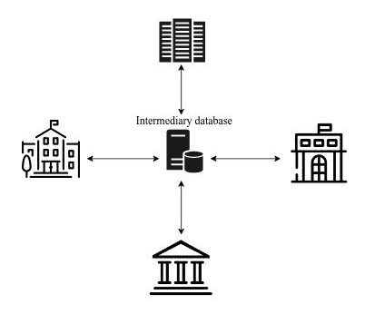
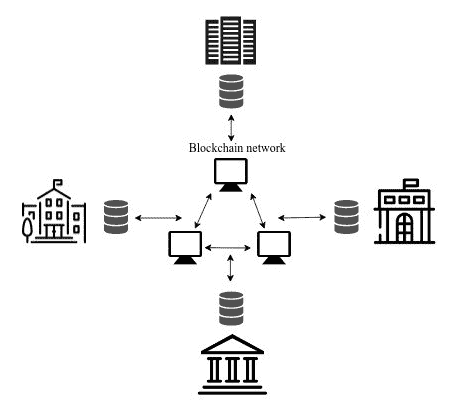
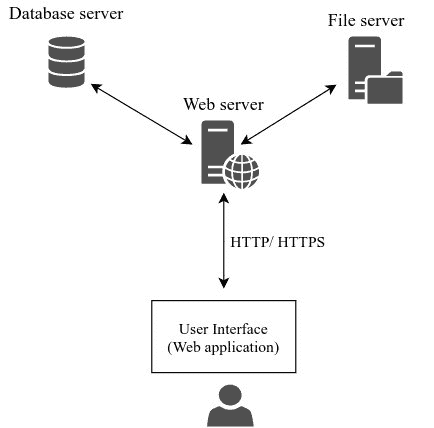
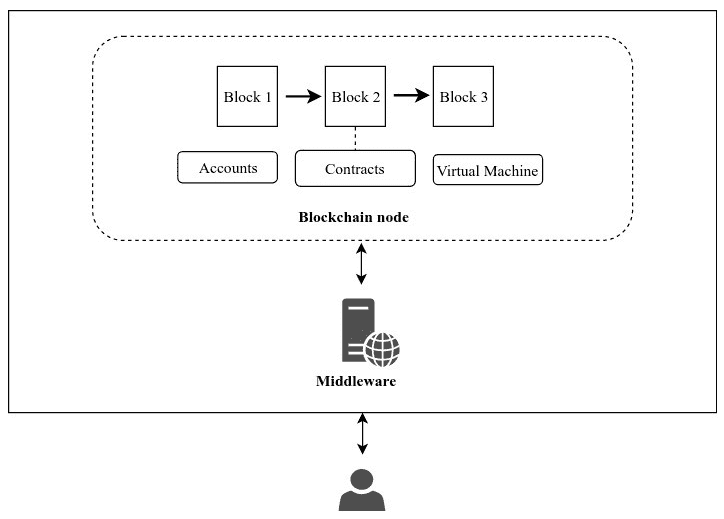
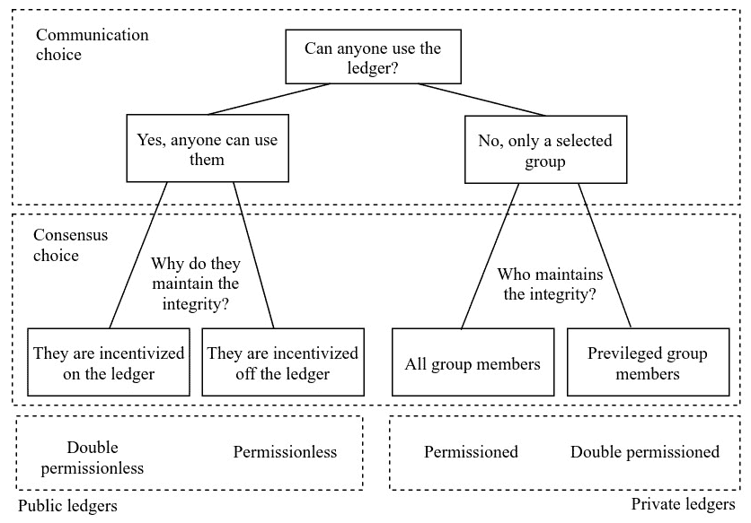
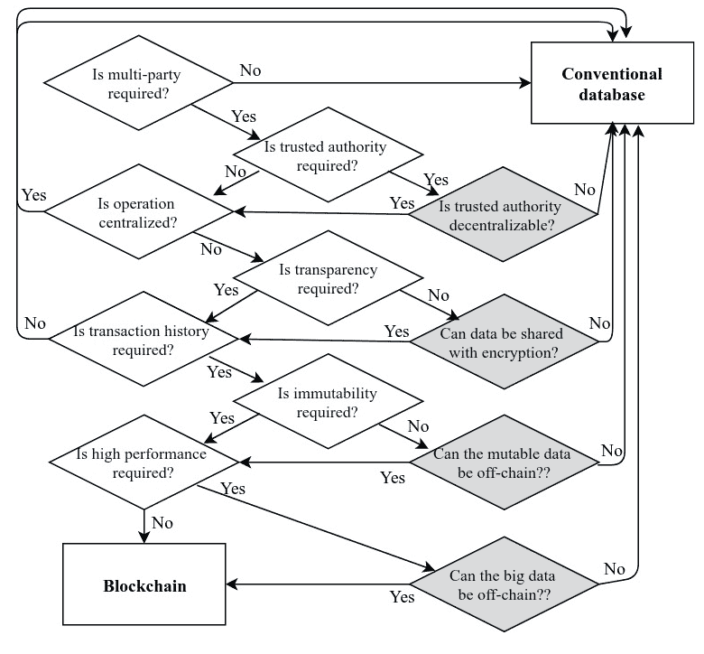

# 什么时候不该用区块链？

到目前为止，在这本书里，为了理解区块链的基本功能，我们已经学习了一些区块链的概念。在前面的章节中，我们还深入研究了该技术，以便熟悉分散式应用程序。然而，当我们看到区块链技术的基础可以帮助我们在分散式网络中构建应用时，我们有必要问自己一个问题，*为什么选择区块链？只有当用例需要区块链的特征时，在用例中使用区块链才有用。*

在这一章中，我们将探索区块链的特征，并分析它们如何影响区块链用例的实现。我们还将研究一些可以用来分析区块链用例的框架。

在本章中，我们将讨论以下主题:

*   分布式数据库对**分布式账本技术** ( **DLT** )
*   在区块链上存储什么
*   集中式架构和分散式架构的区别
*   区块链的属性
*   我们可以用来评估用例的框架

区块链是一项不断发展的技术，由爱好者在每一个可能的用例中不断实现。区块链的一些特点吸引了许多社区的注意，他们决定在分散式网络中构建自己的应用程序。除此之外，众多区块链平台的可用性也促进了这项技术的发展。许多研究人员、爱好者甚至企业已经开始在分散式网络中构建应用程序。他们中的一些人提出了新的解决方案，而另一些人则试图用传统的解决方案来解决问题。

但并不是所有提出的区块链解决方案都是可以接受的；事实上，他们中的许多人由于不必要的分散应用程序而走向了错误的方向。在它被采用之前，了解区块链能提供什么是很重要的。

区块链提供了许多有助于构建无信任网络的功能。然而，它有自己的一套限制。AngelList 的联合创始人 Naval Ravikant 也是 2017 年 CoinDesk 在区块链最具影响力的人之一，他在接受采访时表示，*“区块链的效率低得令人难以置信，当你需要去中心化时，值得付出成本，但当你不需要时就不值得了”*，解决了区块链技术在没有适当评估的情况下被用于构建应用程序的担忧。由于缺乏普遍接受的区块链定义，大多数此类项目都被误导了。

尽管我们对区块链技术有很深的了解，但在实施任何区块链项目之前，我们需要了解并权衡几个参数。有几种评估模型可以证明使用分散式区块链优于传统的集中式系统。在本章中，我们将研究一些参数以及评估策略，它们将帮助我们回答这个问题:*什么时候我们不应该使用区块链？*

# 分布式数据库与分布式分类帐技术(DLT)

当我们考虑实施区块链时，首先想到的问题是，*区块链支持的总账技术与传统数据库有什么不同？*传统的数据库都是集中式的，大部分区块链平台都是使用数据库在各个节点本地存储交易。因此，实际的比较应该在由区块链提供动力的 DLT 和分布式数据库之间进行，这也是我们在这一节要关注的。

尽管在分布式数据库的情况下数据库是分布式的，但是仍然存在集中化，因为数据库由中央可信实体管理，而 DLT 中的分类帐由网络中的不可信节点维护。因此，分布式数据库并不能保证去中心化，仍然促进了具有可信权威的集中式架构。架构差异在*图 11.1* 中有清晰的描述。

尝试采用区块链作为存储技术的业务用例必须了解每种存储技术的优势和缺陷。区块链有一组特征，可能有利于也可能没有利于用例。我们将指出基于区块链的 DLT 的一些特征，这些特征将帮助我们分析该技术对于所讨论的任何用例的适用性:

图 11.1:数据库与 DLT 架构的对比

# 信息的分散控制

DLT 通过允许跨越信任边界共享数据来分散对信息的控制。传统的数据库通常由一个实体控制，它们不容易与其他不可信的实体共享。共享存储在每个实体的数据库中的信息的一种方式是通过中介。每个实体将共享需要与另一个实体通信的信息；这将通过一个所有人都信任的中央机构来完成。*图 11.2* 显示了四个实体与一个中间数据库通信，以获取和发送可共享的信息:

图 11.2:不可信实体通过中间数据库共享数据

另一方面，DLT 的分散允许每个实体共享数据，而区块链将维护所有的信息，并且将被网络中的每个节点信任。每个实体可以验证区块链上的数据，并确保信息未被修改，而不需要中央可信机构。每个实体将维护一份共享信息的副本，该副本通过网络同步，如图*图 11.3* 所示:

图 11.3:不信任的实体在没有中介的情况下彼此共享数据

DLT 实现的去中心化有助于共享信息，而不依赖于中央实体。消除对中央数据库的需要有助于消除维护它所涉及的所有过程。这些流程可能包括雇用员工来设置基础架构、审计、备份、迁移等等。DLT 消除了对人类组织的依赖，创造了一个完全去中心化的自治组织。总之，当信息需要跨越信任边界共享时，去中心化非常有意义。

# 信息的保密性

由集中实体管理的数据库通过设置认证和授权机制来维护信息的机密性。只有被授权访问资源的经过身份验证的用户才能对该信息执行操作。

通过使用加密技术来增强数据库中数据的安全性，从而即使数据库被破坏也能保持机密性。

DLT 是一种公共分类账，任何人无需任何身份验证即可访问。完全无权限的 DLT 不会实施访问控制，网络中的每个人都可以访问数据。在分散式网络中，事务形式的数据必须是透明的，以便每个节点都可以验证它们。存储在区块链上的数据的开放性使得去中心化成为可能。比特币或任何其他公共区块链平台(如以太坊)为嵌入区块的交易提供了完全的透明度。由于在区块链网络中创建的身份并不映射到现实世界的身份，即使交易是公开的，参与者也能够保持匿名。但是对于需要完全或部分隐私的用例来说，这可能并不理想。

一些先进的技术，如**零知识证明** ( **zk-SNARKS** )或加密，可以用来保护用户的隐私。支付渠道，如*闪电网络*，在[第 9 章](09.html)、*区块链优化和增强*中讨论，可用于仅向区块链提交所需交易，同时执行链外的其余交易。还有其他解决方案，例如将状态更改存储在安全的保险库中，并在区块链中仅存储引用地址。安全保险库中的资源只能由授权实体访问。

DLT 提供了保护实体隐私的解决方案。然而，这些解决方案将使实施变得复杂和低效。提议的解决方案将违背 DLT 原则。因此，任何主要关注隐私的用例最好使用传统数据库来存储信息。

# 稳健性

由于技术的分散性，DLT 将大量暴露给公众。DLT 越是暴露在公共网络中，就变得越有弹性。分类帐实现的不变性确保了信息不会被入侵者轻易篡改。这种分散有助于实现整个网络的信息冗余，这将确保一个容错系统。系统的整体健康不依赖于任何特定的实体来使系统健壮。

传统数据库可以复制和分区。复制数据库记录将使数据库容错。复制策略不是大多数数据库的固有特性。尽管分布式数据库系统会在几个节点中复制记录，但它们不像 DLT 那样分散。

网络中的节点之间会有延迟和同步问题。因此，它们不像 DLT 那样具有容错能力，并且需要为数据库采用灾难恢复机制，尤其是那些集中式的数据库。当用例需要实现容错和健壮的系统时，位于区块链的 DLT 是存储记录的首选。

# 表演

我们在上一节中得出结论，DLT 比传统数据库更健壮。但是这种容错系统是以降低性能为代价的。我们已经遇到了区块链技术所面临的可扩展性问题。这是因为实现权力下放需要核查和其他共识机制。比特币使用一种**工作证明** ( **PoW** )算法来实现共识，将区块创建时间限制在 10 分钟。这将限制交易添加到区块链的速率。数据库对记录插入没有任何这样的限制。在数据库表中创建记录比在区块链中插入事务要快得多。

一些区块链平台有提高交易速度的解决方案。但是，它们无法达到传统数据库所达到的性能。通过为特定的应用程序选择特定类型的数据库，数据库可以获得更高的性能。根据应用程序的需求，可以使用关系数据库以及各种非关系数据库，如键值存储、表格数据库和图表。此外，数据库可以通过使用内存存储技术来提高读取操作的性能。

数据库非常适合实现高事务吞吐量。当用例需要快速读写操作时，数据库应该是技术的首选。

# 我们可以在区块链上存储什么？

我们之前比较了区块链和数据库，并分析了它们各自的属性，以评估它们的适用性，然后选择一个作为我们的存储机制。我们假设区块链可以存储可以插入数据库的类似信息。尽管可以将任何数据插入到区块链中，但这不是静态数据的首选存储机制。在本节中，我们将列出在区块链上存储数据的一些限制。

# 将数据存储为事务

区块链上的数据以称为事务的原子事件的形式存储。在比特币等加密货币中，交易包含有助于转移资产的脚本。但是，它们也可能包含任意信息，如充当智能合同的可执行程序。事务还应该确保它有一组优化的指令，这些指令将决定区块链的当前状态。

# 存储最少的数据

尽管任意信息都可以存储在区块链事务中，但不建议将大量数据转储到区块链中。区块链不是一个分散的存储解决方案。还有其他几种分布式文件共享协议，如 IPFS，更适合存储超媒体。

因为交易费用是根据交易中数据的大小计算的，所以为了完成工作，您应该尽量使交易尽可能小。

# 存储需要最少更改的数据

尽管区块链不允许修改数据，但是可以通过创建新的事务来更新以前存储的数据。需要注意的是，在区块链网络中，交易不会被快速处理，建议等待一定数量的块确认，即使交易已被包括在块中。如果某个特定的数据项需要经常更新，那么在处理完所有相关的事务之前，将需要相当长的时间。许多节点甚至可能拒绝引用其他未确认事务的事务。因此，建议离线存储和处理这些数据。

# 集中式与分散式应用程序架构

我们通过分析 DLT 和数据库的属性对它们进行了比较。但是在实现之前分析应用程序的架构也很重要。我们将描述集中式和分散式应用程序的体系结构，以便更清楚地了解组件以及它们相互通信的方式。

在使用基本集中式服务器架构的应用程序中，所有相关组件只有一个实例。*图 11.4* 显示了一个 web 服务器应用程序的架构图。用户可以通过 web 应用程序提供的用户界面与 web 服务器通信。使用诸如 JavaScript 的脚本语言和诸如 HTML 的标记语言的组合来编程 web 应用。一个简单的 web 应用程序将拥有一个托管该应用程序的 web 服务器。但是，web 服务器可以与数据库、文件或应用程序所需的任何其他服务器进行交互。由于集中式服务器只有一个物理地址，所以它们被映射到域地址。用户可以到达**域名系统** ( **DNS** )服务器，找到 web 服务器的物理地址，然后使用应用协议(如 HTTP)进行通信。

在集中式架构中，任何数量的组件都可以独立运行，并在需要时相互通信。典型的 web 应用程序将数据库、存储和 web 服务器作为其组件，如图*图 11.4* 所示:

图 11.4:集中式应用程序的架构图

分散式应用程序将与执行类似功能的节点网络进行通信。使用分散式应用程序的客户端可以与网络中的任何节点进行通信，以执行任何操作。与集中式服务器不同，分散式架构不使用 DNS 服务器，因为没有单一的服务器。

*图 11.5* 显示了区块链网络中的一个节点。用户直接与该节点通信，以使用应用程序的任何功能。正如我们在几个区块链平台上看到的那样，每个节点都将公开一个端口，以便使用**远程过程调用** ( **RPC** )协议进行通信。如果客户端希望使用 web 应用程序进行通信，JavaScript 库用于建立 RPC 连接。一些区块链平台提供了一个桥梁来促进与分散式网络的通信。MetaMask 是以太坊中使用的桥接应用程序。

从集中式应用程序的体系结构图中可以看出，基础结构设计是灵活的，因为单个实体负责维护基础结构。在分散式架构中，节点在设计时没有太大的灵活性。纯粹的分散式架构不会与任何其他集中组件集成，因为这与分散式模型相违背。需要集成几个组件的应用程序会形成复杂的体系结构，而这种体系结构不是分散式网络所需要的:

图 11.5:分散式应用程序的架构图

正如我们在*图 11.5* 中看到的，一个客户端将在没有中介的情况下与分散网络通信。但是有几个用例需要将集中式可信实体与功能在智能契约中定义的分散式网络相集成。通过以中间件的形式部署可信实体，可以创建一个混合架构，如图*图 11.6* 所示。

中间件经常被用作客户端和区块链网络之间的媒介。它可以是一个 web 服务器，可以与区块链节点通信，并在需要时创建和转发事务。中间件基本上是一个向区块链提供可信数据的可信实体。以太坊平台利用了被称为**神谕**的特殊可信实体。这些 oracles 可以为区块链节点中的合同提供可信的外部信息。

在区块链不适合的情况下，企业通常会实施混合体系结构:

图 11.6:带有中间件的分散式应用程序的架构图

# 区块链的属性

到目前为止，在比较 DLT 和数据库时，我们已经讨论了区块链的一些属性。但是由于其分散的本质，区块链有许多固有的属性，这些属性将极大地有利于一些用例，而不会增加其他用例的价值。在本节中，我们将讨论这些属性，以便您能够正确评估区块链是否适合您自己的用例。

# 不变

区块链是一个账本，不允许你更新或删除现有记录。区块链号上记录的数据应该会永久保存。这使得区块链成为不可变的数据结构。与传统的记录保存技术不同，记录一旦被纳入区块链就不能被删除。更新记录的唯一方法是创建一条新记录，这条新记录将撤消前一条记录的效果。在区块链，更新操作成本很高，因为每次插入记录都要耗费时间和费用。

不变性是区块链的关键特征之一，所以所选择的用例能够利用区块链的不变性是很重要的。

# 不可否认性

存储在区块链中的每个交易都是由签署该交易的实体创建的。由于区块链的不变性，一旦交易被添加到区块链中，就无法将其删除。因此，签署交易的实体不能否认交易的存在。由于其可变性，在集中式系统中可以观察到否认，但是在分散式系统中这是非常不可能的。

# 安全性

权力下放的主要优势之一是增强安全性。我们已经在[第十章](10.html)、*区块链安全*中讨论过区块链技术提供的安全级别。区块链网络的分散化将使系统能够抵御许多可以在集中式系统上执行的传统攻击。

任何使用区块链实现的用例都不必担心保护系统免受许多传统攻击。

# 裁员

所有区块链记录都在网络的所有节点上复制，实现了高度的去中心化。网络实现的冗余确保了它是一个容错系统。但是，冗余会在网络中引入延迟，从而对性能产生负面影响。在任何用例中实现区块链之前，考虑容错和性能之间的权衡是很重要的。

# 降低的价格

在分散式网络中创建应用程序的一个吸引人的特点是消除了管理组织、创建和维护基础设施所涉及的成本。实现没有单一实体来承担运行成本的用例是理想的。分散的自治组织 ( **DAOs** )是一个用例，其中没有实体负责承担发生的成本。

# 透明度

网络中的每个节点都必须验证区块链中包含的每个交易。核查过程要求存储在区块链中的所有交易透明。在实现用例时，确定包括在区块链中的数据是至关重要的。保密性非常重要的应用程序不适合公共区块链。

# 区块链的决策模型

基于对区块链技术及其对现实世界问题的影响的深入理解，许多研究人员提出了几个决策模型，这些模型将有助于快速评估区块链在任何用例中的适用性。这些决策模型考虑了区块链的所有基本原则，并决定用例是否适合在基于区块链的生态系统中实现。

# 卡尔·韦斯特和阿瑟·热尔韦

两位计算机科学研究人员 Karl Wüst 和 Arthur Gervais 在论文*中提出了一个决策模型:你需要区块链吗？*，发表在《IACR 密码学》(【https://eprint.iacr.org/2017/375】)上。当系统中存在相互不信任的实体时，该模型有助于在允许和不允许的区块链之间做出决定。

*图 11.7* 描述了区块链决策模型的流程图，该模型决定了区块链在用例中的适用性，并有助于决定区块链的类型。如果用例满足以下所有条件，它建议将区块链作为解决方案:

*   它需要存储状态
*   有多个作者
*   没有在线**可信第三方** ( **TTP** )
*   所有的作者都不可信

它进一步建议，如果所有的作者都是未知的，使用一个无权限的区块链，否则推荐一个有权限的区块链。如果每个人都验证了交易，许可的区块链将是公开的；否则，区块链可以在专用网络中维护:

图 11.7:https://eprint.iacr.org 区块链决策模型的流程图

他们还列出了区块链和数据库的不同属性来比较实现。*表 11.1* 显示了无权限区块链、有权限区块链和可信数据库的几个属性:

|  | **无权限区块链** | **许可的区块链** | **中央数据库** |
| 生产能力 | 低的 | 高的 | 非常高 |
| 潜伏 | 慢的 | 中等 | 快的 |
| 读者数量 | 高的 | 高的 | 高的 |
| 作家人数 | 高的 | 低的 | 高的 |
| 不受信任的编写器数量 | 高的 | 低的 | 0 |
| 共识机制 | 主要是电源，一些 PoS | BFT 协议(如 PBFT) | 没有人 |
| 集中管理 | 不 | 是 | 是 |

表 11.1:比较区块链和中央数据库类型的属性

# 婊子-布朗-帕鲁拉瓦模型

David Birch、Richard Brown 和 Salome Parulava 在论文*中提出了一个评估模型，该论文题为《面向金融服务中的环境责任:共享分类账、透明交易和大金融危机的技术遗产*，发表在*的《支付战略和系统杂志*。本文提出了一个模型来探索共享总账在金融服务中的应用。他们还设想了一个交易透明的金融市场。

*图 11.8* 显示了建议的决策模型，该模型评估了区块链在金融服务中的应用。根据分配给分类帐用户的权限，区块链的类型分为有权限和无权限。根据用户对共享分类帐功能的影响程度，它们也以更精细的方式进行分类:

图 11.8:金融服务的决策模型(来源:Birch-Brown-Parulava 模型)

# 评估区块链适宜性的框架

几位研究人员，即 Sin Kuang Lo、Xiwei Xu、Yin Kia Chiam 和 Qinghua Lu，在题为*评估应用区块链的适宜性*的论文中创建了一个评估框架。该框架考虑了区块链的许多属性，以评估它是否匹配用例的需求。

提出的框架由评估用例之前需要回答的七个问题组成，如图*图 11.9* 所示。该框架建议在满足以下条件时使用区块链:

*   该场景需要多个实体
*   操作不是集中的
*   要求交易历史的完整性
*   性能不是最重要的
*   不涉及可信方
*   希望数据透明
*   插入的数据不应该是可修改的(不可变的)

该框架进一步评估了区块链的一些财产是否可以用其他解决办法保留下来。图 11.9 所示的框架进一步评估了可信机构是否应该分散，如果不希望透明，数据是否可以得到保护，或者是否可以修改，以及批量数据是否可以离线维护。当评估用例的需求时，这个框架不像其他决策模型那样严格:

图 11.9:评估框架(来源:评估区块链应用的适宜性)

该框架评估了文中的一些工业用例。在执行了框架中的每个用例需求之后，它得出结论，供应链和身份管理相关的应用程序可以很容易地适应区块链。另一方面，由于区块链网络的透明度和低吞吐量，电子健康记录和股票市场等信息敏感的用例不适合在区块链实施。在下一章，我们将在评估每个用例的适用性后分析几个用例。

# 广义决策模型

我们已经看到了区块链研究人员提出的几个决策模型。尽管它们都可以用来评估用例的需求，但是没有一个普遍认可的条件列表来决定什么时候使用常规技术，什么时候使用区块链。基于前面提到的决策模型和前面章节讨论的区块链的所有性质，*区块链的性质*，我们创建了一个广义的决策模型，如图*图 11.10* 所示:

图 11.10:通用决策模型的流程图

图 11.10 中描述的决策模型在决定区块链是否适合用例之前考虑了区块链的所有属性。与早期的决策模型类似，它需要在以下条件上达成一致:

*   不涉及可信方
*   交易数据的不变性是所期望的
*   这个场景不需要高性能
*   交易数据不是机密的，或者可以通过加密来保护
*   有多个作者
*   数据可以在网络上共享和复制

如果满足所有条件，用例适合使用区块链技术来实现。确定区块链的类型也很重要，这样可以选择合适的区块链平台来实施。决策模型根据书写实体的性质建议无权限或有权限，如图*图 11.10* 所示。如果数据可以被网络中的每个人共享和验证，它还建议使用公共的区块链网络；如果对共享数据有限制，则建议使用私有的区块链。

我们将在下一章使用决策模型来评估、分析和选择适合各种用例的区块链平台。

# 摘要

本章提供了在决定是否开发一个分散式应用程序时所使用的策略。为了探索区块链的特性，对分布式数据库和位于区块链的 DLT 进行了比较。深入讨论了集中式和分散式应用程序体系结构，以解释基于区块链的体系结构何时会增加价值。我们也探索了区块链建筑的几个关键属性，以便让读者了解区块链的本质。最后，我们探索了一些决策模型，这些模型评估了区块链对于所探索的某些用例的适用性。

现在，我们已经能够在决策模型的帮助下区分区块链和非区块链用例，我们将继续讨论几个财务和非财务区块链用例，指出当前实施中的问题，并证明区块链技术提供的解决方案的合理性。