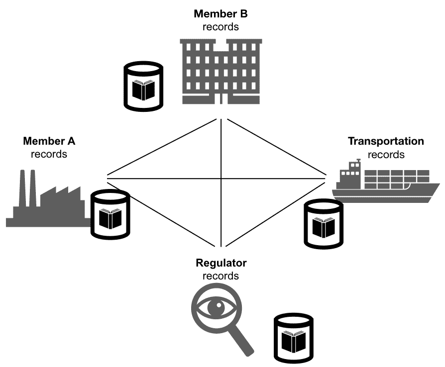
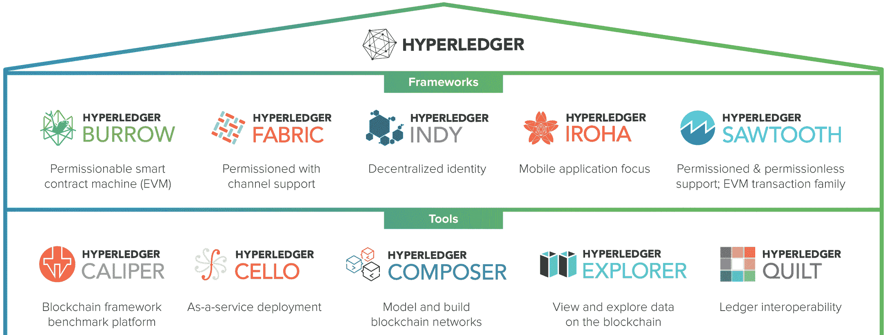
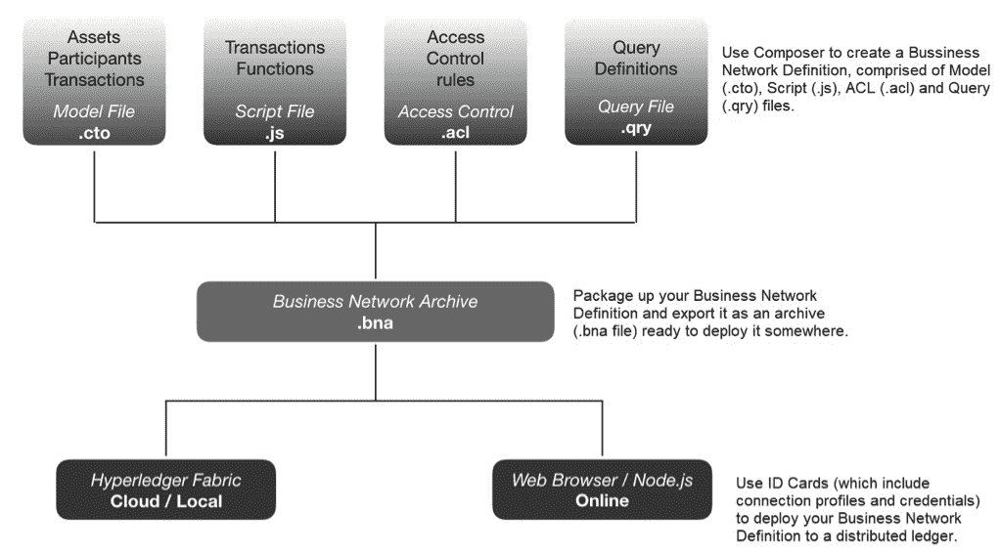

# 解释区块链技术和使用 Hyperledger

区块链是数字世界中的一股变革力量，在这个世界中，人们的联系比以往任何时候都更加紧密。简而言之，这种被称为区块链的共享分布式分类账能够使商业网络中记录交易和跟踪资产的过程更安全、更容易，并且对所有成员都透明。

人们现在经常使用网上银行、电子商务等服务，以及酒店预订、出租车服务和其他在线服务等应用程序进行购物。这产生了大量的交易和数据。除此之外，物联网还为这个数字世界带来了新的可能性。随着产品与物联网的融合，交易量呈指数级增长；因此，跨越地理边界与供应商、银行和监管机构联系的必要性越来越大。

区块链技术为许多行业的运营业务转型提供了巨大的机会，如金融服务、保险、通信和政府。此外，它有利于公司之间的交易，因为它们可以数字化处理。

# 什么是区块链？

让我们更深入地看看区块链到底是什么。资产由能够被拥有或控制以产生价值的任何东西组成。资产是这个网络的主角，可以包括汽车、房子或金钱等有形资产。它们还可以包括版权和专利等无形资产。如果说资产是主角，那么账本就是*关键*。分类账是企业的记录系统。企业将为其参与的多个业务网络拥有多个分类账。

下图显示了企业网络的现状。每个参与者都有自己的分类帐，这些分类帐会随着业务交易的发生而更新:

通过区块链技术，业务网络的成员共享一个分类帐，该分类帐在每次交易发生时通过对等复制进行更新，如下图所示:

区块链允许多个竞争方安全地与同一个宇宙真理源进行交互。它共享了不可变的分类账来记录交易历史，这提供了一个具有已知身份的许可网络。

区块链的四个重要概念如下:

*   **共识**:要使交易有效，所有参与者必须就其有效性达成一致。
*   **出处**:参与者知道资产来自哪里，其所有权如何随着时间的推移而改变。
*   **不变性**:交易被记入分类账后，任何参与者都不能篡改。如果某个事务出错，则必须使用新的事务来纠正错误，然后两个事务都可见。
*   **终结:**单一的共享分类账提供了一个确定资产所有权或交易完成的地方。

当我们谈论区块链时，主要焦点是基于区块链的商业网络，区块链用于商业，其中交易和成员是许可的、私有的和优先的；我们正在处理资产、身份和选择性认可。

你可能很熟悉区块链是一种比特币技术。事实上，我们甚至可以说比特币是区块链的第一个用例。比特币是一种数字货币，没有央行，没有单一管理员，也没有纸币。所使用的软件能够在对等网络中解决数学难题。交易没有中介；它们直接发生在透明的用户之间。

# 区块链和超级账本

围绕区块链有许多框架或技术:R3 (corda)、以太坊、Neo 和 Nem，每一个都有特定的设计和架构。在本书中，我们将重点关注区块链科技超级账本([https://www.hyperledger.org/](https://www.hyperledger.org/))。

Hyperledger 是 Linux 基金会的一部分，该基金会于 2016 年成立，具有技术和组织治理结构，有三十个创始企业成员。现在有 230 多名成员加入了这一倡议。这包括思科、日立、IBM、ABN AMRO、ANZ 银行、红帽、VMware 和 JP 摩根等公司。今天，Hyperledger 在同一个保护伞下与许多项目合作，并专注于区块链用例的差异，以及涵盖框架和工具。在[https://www.hyperledger.org](https://www.hyperledger.org)可以找到对 Hyperledger 项目的详细描述。在这里，Hyperledger 孕育和促进了一系列的商业区块链技术，包括分布式分类帐框架、智能合同引擎、客户程序库、图形界面、实用程序库和示例应用程序。Hyperledger 伞式策略鼓励重复使用通用构建模块，并支持 DLT(分布式账本技术)组件的快速创新:

# 超级分类帐项目

探索 Hyperledger 项目，我们发现五个框架和五个工具。框架有锯齿、Iroha、陋居、Indy 和 Fabric。工具有测径器、作曲器、大提琴、探索者和被子。

让我们来讨论这些框架和工具。

# 超分类帐锯齿框架

Hyperledger 锯齿遵循与其他 Hyperledger 框架相同的架构和特征；它是一个企业区块链平台，用于构建分布式分类帐应用程序和网络。

在我看来，Sawtooth 最显著的特点是使用 API 的便利性，以及许多语言，如 Python、C++、Go、Java、JavaScript 和 Rust。这有助于在锯齿平台上运行的应用程序的开发。此外，您可以在 Solidity 中编写智能合约，用于 Seth 事务家族。

另一个好的特性是并行事务执行。大多数区块链需要串行事务执行，以保证网络上每个节点的顺序一致。以太坊契约兼容也可以用 Seth 锯齿-以太坊集成项目将锯齿平台的互操作性扩展到以太坊。

# Hyperledger Iroha 框架

Hyperledger Iroha 是一个区块链平台，设计用于构建分布式分类账；它基于“了解你的客户”等用例，以移动应用程序开发和名为 Sumeragi 的新链基拜占庭容错共识算法为特色。Soramitsu、Hitachi、NTT Data 和 Colu 最初为 Hyperledger Iroha 做出了贡献。

# Hyperledger 组合工具

如果您想测试一个想法，创建一个**概念证明** ( **POC** )或最小价值产品(MVP)，甚至启动一个项目，那么 Hyperledger Composer 可以帮助您快速轻松地完成这些工作。您可以使用名为 Composer Playground 的 web 应用程序来测试您的业务网络。通过一些点击和一个好的用例，您还可以创建一个集成到您的系统中的业务网络。另一个选择是创建一个前端应用程序来使用您的智能合约。

下图显示了 Hyperledger Composer 工具站点的官方架构概述。

# 超级分类帐挖掘框架

Hyperledger Burrow 文档的第一段很好地描述了这个框架。该描述如下:

*"Hyperledger Burrow is a permissioned Ethereum smart-contract blockchain node. It executes Ethereum EVM smart contract code (usually written in Solidity) on a permissioned virtual machine. Burrow provides transaction finality and high transaction throughput on a proof-of-stake Tendermint consensus engine."*

这个想法实际上是与以太坊智能合约一起工作。应用于 Hyperledger Burrow 的高级架构如下图所示:

# 超分类帐结构

为了探索 Hyperledger 的保护伞项目，我们将使用 Hyperledger Fabric。这是 Hyperledger 框架的第一个项目或最初的概念，Digital Asset 和 IBM 是最初的贡献者之一。Hyperledger 结构的特征如下:

*   允许共识和成员服务等组件即插即用
*   利用容器技术来托管名为 chaincode 的智能契约，它包含系统的应用程序逻辑

但在我们继续之前，让我们回顾一下区块链的一些概念，并详细探索 Hyperledger Fabric:

在上图中，您可以看到一个高级区块链架构。让我们来探索(分析)该架构的重要组件:

*   **Chaincode:** 这是我们的业务网络合同，就像任何合同一样，它规定了网络成员之间可能的交易，并保证每个成员都有预先确定的分类账访问权限
*   **分类账:**把整个交易历史当作一个数字存储，作为一个数据库你可以有查询能力去探索数据。

*   **隐私:**渠道:在大多数情况下，所有网络都有一个唯一的渠道，但 Hyperledger Fabric 允许多边交易，保证了隐私和保密性，因此，如果网络的两个成员出于任何原因需要在他们之间进行指定的交易，他们可以有一个独立于其他人的渠道。
*   **安全和会员服务**:每个会员在网络中都有特定的权限，因此每一笔交易都会被记录下来，并且可以被授权的监管机构或审计机构追踪。

为了更好地解释我们正在讨论的内容，让我们来看一下业务网络中 Hyperledger Fabric 的组件:

上图中显示的组件可以解释如下:

*   多个成员是区块链网络的一部分。在这种情况下，我们有**成员** **1** 、**成员 2、** **成员 3、**和**成员** **N** 。
*   每个成员都有自己的对等成员。
*   每个对等体都有一个**认证机构**。
*   队列或交易将由**排序集群**排序。

# 成员或同行

对等方是托管分类账和智能合约的网络中的成员或公司。智能合同和分类帐用于封装网络中的共享流程和共享信息:

# 认证机构(CA)

企业网络的每个成员都可以访问由系统信任的机构为其颁发的数字身份。在最常见的情况下，数字身份(或简称身份)采用加密验证的数字证书形式，符合 X.509 标准，由 CA 颁发。

# 排序群集

队列或事务将由排序服务排序，排序服务向客户端和对等方提供共享的通信通道，为包含事务的消息提供广播服务。作为订购和分配交易的一部分，Hyperledger Fabric 与**订购服务(OS)** 和 Kaftka 集群一起工作，kaft ka 集群是保证负载平衡和一致性的代理。我们将在设置环境时更详细地探讨这一点。

# SDK/API

应用程序或当前系统可以通过 SDK/API 连接到区块链网络，SDK/API 通常使用 Node.js 开发，是使用智能合约的重要步骤:

Hyperledger Fabric 1.3 中有一些重要的改进。由于 1.1 版和 Node.js chaincode 的支持，开发人员现在可以使用最新的编程语言，使用最流行的框架来开发 chaincode。如果使用的是 1.1 之前的版本，需要使用 Go 来开发链码。让我们来探索 Hyperledger Fabric 1.3 的新功能。

本书中用于设置编码的示例将遵循 Hyperledger Fabric 1.4，具有重要的新功能，例如:

*   **开发应用的新方法**

这些新特性简化了分散代码的编写。它们使开发人员能够直观、合理地使用 Node.js SDK Node.js chaincode 来开发分散式应用程序

*   **操作新功能，更易于维护**

随着越来越多的 Hyperledger Fabric 网络得到部署和测试，可维护性和操作方面变得更加重要。Fabric v1.4 具有日志记录改进、运行状况检查和操作指标等新特性。Fabric 1.4 是开始生产操作的推荐版本，因为它的功能侧重于稳定性和一些重要的修复。如果您访问 Hyperledger Fabric 网站，您可以找到有关将在 v1.4.x 流中提供的未来修复程序的信息，而 v2.0 流中正在开发新功能。

# 选择一个好的用例

在我们开始任何区块链项目之前，重要的一步是选择一个好的用例。我们经常看到这样的情况，可以通过一个分布式数据库，甚至是一个具有良好权限访问的 web 应用程序来解决。有一个难题需要解决:

*   是否涉及商业网络？
*   是否有需要验证或达成共识的交易？
*   审计追踪重要还是来源控制重要？
*   不变性(数据)
*   终局性(争议较少)

一定要画出不同组织的地图，或者一个商业网络，以及它们是如何连接的——这是非常重要的一步。此外，检查用例地址在第二和第五点之间列出的一个或多个属性。如果你在第二点和第五点之间没有一个以上的属性，那么它可能不符合区块链解决方案。

在选择用例时，有一个智囊团或设计思考会议是一个好主意。

下表展示了不同行业的一个很好的使用案例:

| **金融机构** | **保险** | **跨行业及其他** |
| 

*   letter of credit (L/C)
*   Lender

*   Consortium shared general ledger

 | 

*   第一方医疗索赔处理
*   预定个人财产索赔处理

 | 

*   Loyalty points
*   Capital asset management
*   Identity management

 |

# 区块链——食品跟踪用例

现在，让我们关注食品跟踪用例。如今，消费者要求更多的信息和透明度，以了解他们的产品是如何和在哪里制造的。欧盟要求提供更多关于企业供应链的信息，并对不遵守规定的公司和国家处以巨额罚款。自 2016 年以来，中国客户一直在跟踪他们的食品是在哪里生产的，以及在到达他们的餐桌之前，它在不同的批发商和经纪人之间转手了多少次。所以，这个用例听起来很适合区块链，对吗？

让我们思考一下区块链的五大要素:

1.  商业网络

生产商、制造商、运输公司、零售店。

2.  有没有需要验证或共识的交易？

记录资产在供应链中的所有者、时间和位置。

3.  审计追踪很重要吗？

消费者要求，像欧盟和中国这样的国家需要跟踪审计。

4.  不变性和 5。定局

复杂流程中涉及的不同公司和资产。

好了，现在我们知道区块链符合我们的用例，让我们看看使用区块链技术的好处:

*   它是可验证的，防止任何一方改变或质疑被交换信息的合法性。
*   通过提高复杂的全球供应链的透明度，可以提高效率。
*   监管机构、权威机构和商业网络公司可以快速方便地从整个供应链中获取可靠的信息。

在接下来的章节中，我们将更详细地探索食物链，以及区块链如何通过物联网改变食物链。

# 摘要

区块链的特点是共享和分布式账本，能够使商业网络中记录交易和跟踪资产的过程更容易、更动态。这与比特币不同，比特币是未经许可的公共账本的一个例子，定义了一种资源密集的不受监管的影子货币。区块链通常是许可的、私有的，并优先背书，使用基于加密货币的资产。

这个名为 Hyperledger 的项目是一个开源代码的合作项目，旨在推广区块链技术。

2017 年 5 月，有五个活动框架和五个活动工具:

*   **框架:** Hyperledger Burrow、Hyperledger Fabric、Hyperledger Iroha、Hyperledger 锯齿和 Hyperledger Indy
*   **工具:** Hyperledger Cello、Hyperledger Composer、Hyperledger Explorer、Hyperledger Quilt 和 Hyperledger Caliper

在接下来的章节中，我们将更详细地探讨如何使用区块链平台来解决食物链中的一些重要挑战，我们将发现 Hyperledger Fabric 1.4 是一个强大的区块链平台。

# 问题

问:为什么使用区块链？

A.区块链提供了信任和透明度，以解决阻碍供应链的食物链挑战；使用区块链，您可以获得该平台的优势，例如:

*   信任和透明度
*   选择谁在处理和接收信息，因为您只需要一个共享分类帐来处理事务
*   由于分类账是不可变的，缺乏信心不再是一个问题，参与者可以确定交易的来源和真实性
*   快速方便地访问详细的端到端供应链数据
*   根据生态系统的数据，更好地分配商品和产品，最大限度地减少浪费

区块链使参与者能够共享一个账本，每次交易发生时，该账本都会通过点对点复制进行更新。隐私服务用于确保参与者只能看到与他们相关的分类帐部分，并且交易是安全的、经过验证的和可验证的。区块链还允许嵌入资产转移合同，以便与交易一起执行。网络参与者同意如何通过被称为共识的过程来验证交易。政府监管、合规和审计可以是同一个网络的一部分。

# 进一步阅读

要查找有关该主题的更多信息，请访问以下链接:

*   Hyperledger 锯齿文档，可在以下链接找到:[https://Sawtooth . Hyperledger . org/docs/core/releases/latest/introduction . html # distinct-features-of-Sawtooth](https://sawtooth.hyperledger.org/docs/core/releases/latest/introduction.html#distinctive-features-of-sawtooth)
*   Hyperledger Iroha 文档，可在以下链接找到:[https://www.hyperledger.org/projects/iroha/resources](https://www.hyperledger.org/projects/iroha/resources)
*   Hyperledger Indy 文档，可在以下链接找到:[https://github . com/Hyperledger/Indy-node/blob/stable/getting-started . MD](https://github.com/hyperledger/indy-node/blob/stable/getting-started.md)
*   Hyperledger Composer 文档，可在以下链接中找到:[https://Hyperledger . github . io/Composer/latest/introduction/introduction . html](https://hyperledger.github.io/composer/latest/introduction/introduction.html)
*   Hyperledger Framework 1.4 文档，可在以下链接中找到:[https://hyperledger-fabric.readthedocs.io/en/release-1.4/](https://hyperledger-fabric.readthedocs.io/en/release-1.4/)

*   GitHub Hyperledger 框架链接:[https://github.com/hyperledger/fabric](https://github.com/hyperledger/fabric)